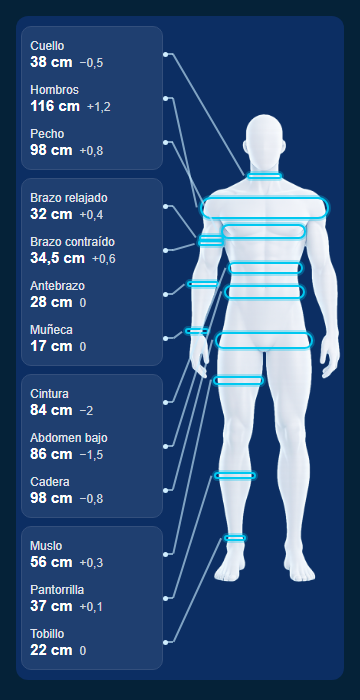
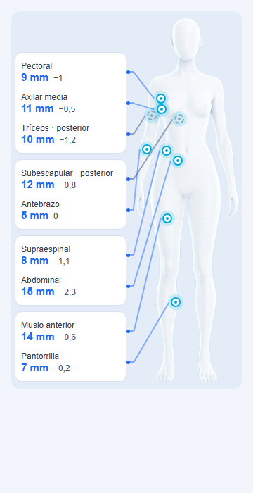

# Evidencia · DL-111: catálogo antropométrico de BE, lámina y evolución física en la APK

**Estado:** integrada en `main` con el PR #126 (`0308355`), CI en verde y desplegada en test; APK 0.12.2 publicada (`EVIDENCIA/PUBLICACION-0.12.2/LEEME.md`). **Falta la validación de Dirección en el teléfono.**

Pedido de Dirección del 2026-09-30 (noche): la lámina del compositor en el website del profesional, la figura con las medidas y la comparación en la APK, y las fórmulas antropométricas investigadas y programadas para que el profesional elija el método. Las decisiones que tomó el ejecutor están en DL-111 (`docs/DEUDA_LEGAJO.md`), **a ratificar**.

## Qué se entregó

| Pieza | Dónde |
|---|---|
| Ficha de investigación: 58 entradas con fuente, población, sitios, fórmula y 199 casos de prueba | `docs/propuestas/METODOS-ANTROPOMETRICOS_ficha.md` |
| Protocolo «Perfil antropométrico completo» (30 mediciones) | `prisma/migrations/20261001000000_perfil_antropometrico_completo` |
| 40 métodos con descripción, fuente, población y categoría | `prisma/migrations/20261001010000_metodos_antropometricos` |
| Las 40 reglas, versionadas | `packages/domain/src/formulas-antropometricas.ts` |
| Generadores del catálogo (una sola fuente para la migración y los nombres) | `scripts/catalogo-antropometrico/` |
| La lámina del compositor, como datos | `packages/domain/src/figura-de-lamina.ts`, `docs/direccion/LAMINA-DEL-COMPOSITOR.md` |
| La lámina en el website | `apps/web/src/app/pro/advisees/anthropometry/lamina*.tsx` |
| Ficha del método al elegirlo | `apps/web/src/app/pro/advisees/anthropometry/calculos.tsx` |
| Resultados de las fórmulas en la evolución (API-ANT-06) | `apps/api/src/antropometria/evolucion.service.ts` |
| «Mi evolución» en la APK: última toma sobre la figura, resultados y evolución por medida | `apps/mobile/src/pantallas/antropometria.tsx`, `figura-de-la-toma.tsx` |

## Pruebas

| Prueba | Resultado |
|---|---|
| Dominio completo, con las 40 fórmulas contra los casos de la ficha y los ejemplos publicados por las fuentes (tabla 9 de Durnin y Womersley, sujeto 573 de Heath y Carter) | **424/424** |
| Scripts: vocabulario prohibido en las pantallas, contraste de los temas (con los colores de la lámina de la APK), figuras idénticas a las del compositor | **35/35** |
| API, unitarias | **53/53** |
| Integración de antropometría: el catálogo (los 40 métodos ejecutados por la API sobre una toma completa), la evolución con resultados derivados, los cálculos y la antropometría | **46/46** |
| Integración completa, en la CI (PostgreSQL 16) | **561/561** (39 suites) |
| Typecheck del dominio, la API, el website y la APK · OpenAPI al día | ✅ |
| Recorrido del website en Chrome sin ventana: ficha del método, lámina en sus modos y temas, descarga del PNG, evolución con nombres, 1280 y 390 px | **17/17** |

## La figura de la APK, en maqueta

No hay teléfono ni emulador en esta máquina. `maqueta-figura-apk.cjs` dibuja en HTML la figura de la APK con **las mismas cuentas** que el componente (posiciones del compositor, apilado de tarjetas, guías y colores de los tokens) y Chrome sin ventana la captura. **No es una captura de la APK**: sirve para revisar la geometría, no el dibujo final de Android.

| Perímetros, hombre, Azul noche | Pliegues, mujer, Claro |
|---|---|
|  |  |

## El website, en un navegador

Recorrido automático con Chrome sin ventana sobre una base local con datos sintéticos: un profesional, un asesorado y tres tomas del perfil completo, con 28 cálculos cada una. **No es la prueba manual de Dirección.** Resultado: **17 de 17 controles** (`web-controles.json`).

| Qué se controló | Captura |
|---|---|
| La ficha del método al elegirlo: qué da, qué pide con el valor de la toma, la fuente y la población; finalidad y precisión en palabras | `web-02-nuevo-calculo.png` |
| Medición · Circunferencias, cuerpo entero: tarjetas, anillos, guías y diámetros óseos | `web-10-medicion-circunferencias-entero.png` |
| Medición · Pliegues: el punto frontal rotulado «Supraespinal», los posteriores punteados y el pie con la suma de 7 pliegues | `web-14-medicion-pliegues.png` |
| Conclusiones: los resultados vigentes por categoría, cada uno con su método | `web-15-conclusiones.png` |
| Tema Azul de la lámina | `web-21-tema-azul.png` |
| Serie: tres tomas, cada sitio con su gráfico y la diferencia como resta, sin «mejor» ni «peor» | `web-30-serie-circunferencias.png` |
| La sección en el tema Claro del website, con los controles y lo que no tiene sitio en la figura | `web-50-seccion-website-claro.png` |
| La sección a 390 px de ancho, sin desplazamiento horizontal | `web-51-seccion-movil.png` |
| La evolución con los nombres del catálogo (antes, códigos) | `web-60-evolucion-grasa.png` |

Además: «Descargar imagen» bajó un PNG de 2160 × 3840 (4,4 MB); los botones dicen su estado con `aria-pressed`; no hubo errores de consola ni de página.

## Límites

- **Validación profesional pendiente.** Los coeficientes, sitios y poblaciones están contrastados con las fuentes y con dos implementaciones independientes, no con un profesional de Dirección ni con un caso clínico.
- **APK sin teléfono.** La pantalla nueva no se abrió en un dispositivo: queda para la revisión de Dirección con la 0.12.2.
- **Sin teclado manual ni TalkBack.** No se verificaron.
- **Lo que no se sembró** (ficha, §13 y §15.2): US Navy, Faulkner para mujeres, masa ósea de Martin, De Rose y Guimarães para mujeres, Heymsfield, Martin, Kerr, densidad como resultado visible y los índices de VanItallie y Kouri. Esperan la decisión de Dirección.
