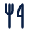
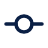
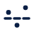
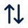
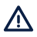
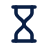
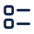

# Íconos de BE: catálogo

> **Copia del 2026-10-10,** traída al repositorio con WP-ESCRITORIO-AMABLE. Sirve para saber qué simboliza cada
> ícono y dónde va. Las carpetas de la tabla «Qué archivo uso», los generadores y las láminas que nombra están en el
> taller de diseño, fuera del repositorio (ver `../LEEME.md`). En el producto, el dibujo es un dato del dominio
> (`packages/domain/src/iconos.ts`) y lo dibuja `apps/web/src/components/icono.tsx`.

> Lo escribe `generar-catalogo.mjs` a partir de `iconos.js` (el dibujo), `significados.js` (las palabras),
> `apk.js` (los que ya tiene la APK) y las maquetas (dónde aparece cada uno). No se edita a mano.
> Para leerlo con los dibujos a buen tamaño y con buscador, abrir `CATALOGO.html`.

105 íconos: 92 en uso en las maquetas y 13 reservados. Es una propuesta de la dirección de UX: entra
al producto cuando Dirección la valide.

## Qué archivo uso

| Para qué | Qué se usa | Dónde está | Por qué |
|---|---|---|---|
| Programar el website | El dibujo como dato y el componente `Icono` | `para-programar\iconos.ts` y `icono.tsx` | Toma el color del texto: sirve igual en Claro y en Azul noche, y no se pixela a ningún tamaño |
| Programar la APK | El mismo dato, con el componente de la APK | `para-programar\iconos.ts` e `icono.nativo.tsx` | El dibujo está escrito una sola vez para los dos productos |
| Un documento, la tesis o una presentación | PNG de 512 px, con fondo transparente | `png-grande\claro\` sobre fondo claro; `png-grande\azul-noche\` sobre fondo oscuro | Se pega como cualquier imagen |
| Una imagen chica donde no se puede usar SVG | PNG de 24 px y sus versiones más nítidas (`@2x`, `@3x`, `@4x`) | `png\claro\` y `png\azul-noche\` | El nombre sin sufijo es el de 24 px; los otros son 48, 72 y 96 |
| Abrirlo en un programa de dibujo, o editarlo | SVG | `svg\` (toma el color del texto) o `svg-con-color\` (con el color de cada tema ya puesto) | El dibujo se cambia en `iconos.js`, no en estos archivos |

El formato .ico no hace falta: sirve solo para el ícono de la pestaña del navegador y para el de un programa de Windows,
y BE ya tiene el suyo.

## Las reglas de la familia

- Lienzo de 24 × 24, con el dibujo entre 3 y 21.
- Solo trazo, de 1,75 de grosor, con extremos y uniones redondeados. Lo único lleno son los puntos.
- Un solo color: el del texto que lo acompaña. El tema cambia el color, no el dibujo.
- Un ícono no va solo si su sentido no es evidente: lleva su texto al lado. Si es un botón de solo ícono, lleva un nombre para el lector de pantalla que dice lo que hace («Quitar Pollo»), no lo que se ve («cruz»).
- Ningún ícono dice si algo está bien o mal.
- Los cuatro íconos de área (Nutrición, Entrenamiento, Antropometría, Información) son los mismos que la APK tiene en su barra.

| Tamaño | Dónde |
|---|---|
| 24 px | Títulos de área |
| 20 px | Filas y botones |
| 18 px | Pestañas, enlaces y chips |
| 15 px | Dentro de una etiqueta |

Las calorías y los macros van siempre en este orden: Calorías, Carbohidratos, Grasas, Proteínas. Sin color propio y
siempre con la palabra.

## El catálogo

En «Dónde aparece», el número es el de la pantalla de las maquetas y el texto entre comillas es el que acompaña al ícono.

### Áreas

| | Nombre | Qué es | Qué simboliza | Dónde aparece | Cuidado |
|---|---|---|---|---|---|
|  | `nutricion` (igual a la APK) | Una manzana, con su cabo y su hoja | El área Nutrición, y todo hecho que pertenece a ella | 01: «Nutrición» · 02: «Comidas 3 registradas», «Comidas 4 registradas» · 08: «Nutrición» · 13: «Nutrición» · y 2 más | Es el área, no una comida: cada comida del plan lleva los cubiertos (`comida`) |
|  | `entrenamiento` (igual a la APK) | Una mancuerna | El área Entrenamiento, y todo hecho que pertenece a ella | 01: «Entrenamiento» · 02: «Sesión A · Tren inferior 7 series», «Sesión B · Tren superior 12 series» · 07: «Ejercicio: Press de banca» · 08: «¿Cómo viene progresando este ejercicio? Carga, repeticiones y RIR de …», «Entrenamiento» · y 3 más |  |
|  | `antropometria` (igual a la APK) | Una cinta métrica, con sus marcas | El área Antropometría, y todo hecho que pertenece a ella | 01: «Antropometría», «Tomas» · 02: «Toma antropométrica Peso 77,9 kg» · 08: «Antropometría» · 13: «Evaluaciones 1», «Antropometría» | En la APK la misma cinta es la zona «Evolución»: es la misma información, vista por el asesorado |
|  | `informacion` | Un formulario en su portapapeles | El área Información y los formularios | 08: «¿Con qué información cuento para revisar el objetivo? Qué hay registr…» · 13: «Formularios 1», «Formulario sin responder desde el 22 sept» |  |

### Vistas

| | Nombre | Qué es | Qué simboliza | Dónde aparece | Cuidado |
|---|---|---|---|---|---|
|  | `resumen` | Cuatro bloques de distinto tamaño, como un tablero | La vista Resumen: lo pendiente con una persona, de un vistazo | Encabezado: «Resumen» |  |
|  | `linea-de-tiempo` | Dos puntos sobre una línea vertical, cada uno con su renglón | La vista Línea de tiempo: qué pasó y cuándo | Encabezado: «Línea de tiempo» · 03: «Ver el 24 sept en la línea de tiempo» · 07: «Ver la sesión en la línea de tiempo» · 09: «Ver el 24 sept en la línea de tiempo» · y 2 más |  |
|  | `analizar` | Dos ejes y una línea que sube y baja | La vista Analizar, y todo enlace que abre un gráfico | Encabezado: «Analizar», «Evolución» · 04: «Abrir estos gráficos en grande» · 08: «Comparar métricas, sin pregunta» · 25: «¿Cómo viene progresando un ejercicio? Verlo en Analizar» |  |

### Nutrición

| | Nombre | Qué es | Qué simboliza | Dónde aparece | Cuidado |
|---|---|---|---|---|---|
|  | `calorias` | Un rayo | Las calorías | 01: «Calorías 2.250 kcal», «Calorías registradas» · 02: «Calorías 590 kcal» · 04: «Calorías registradas» · 08: «Calorías» · y 3 más | En el escritorio se dice «Calorías», no «Energía». No se usa para «rápido» ni para avisos |
|  | `carbohidratos` | Una espiga de trigo | Los carbohidratos | 01: «Carbohidratos 255 g» · 02: «Carbohidratos 62 g» · 08: «Carbohidratos» · 10: «Carbohidratos» · y 3 más |  |
|  | `grasas` | Una palta partida al medio, con su carozo | Las grasas | 01: «Grasas 70 g» · 02: «Grasas 18 g» · 08: «Grasas» · 10: «Grasas» · y 3 más | No es una gota: la gota queda reservada para el agua |
|  | `proteinas` | Un muslo de pollo | Las proteínas | 01: «Proteínas 150 g», «Proteínas registradas» · 02: «Proteínas 45 g» · 04: «Proteínas registradas» · 05: «Proteínas registradas · 24 sept» · y 5 más |  |
|  | `fibra` | Una hoja | La fibra | 08: «Fibra» |  |
|  | `comida` | Un tenedor y un cuchillo | Una comida: el desayuno, el almuerzo o cualquier otra del plan o del día | 08: «Registros de comida» · 10: «Comida: Almuerzo» · 16: «Desayuno 2 opciones · se elige una», «Almuerzo 3 opciones · se elige una» · 17: «Desayuno 2 opciones · se elige una», «Almuerzo 3 opciones · se elige una» | No es el área: el área Nutrición es la manzana. Va uno solo para todas las comidas, porque el nombre de cada una lo escribe el profesional |
|  | `alimento` | Un cuenco colmado | Los alimentos del catálogo, entre los que se elige; un ingrediente | 21: «En el catálogo BE 4 alimentos con «arroz»» | No va en cada renglón de una lista de alimentos: sería el mismo dibujo repetido. No es la olla de `receta`: el cuenco es un alimento solo; la olla, una preparación |
|  | `opciones` | Una tarjeta al frente y otras dos que asoman a los costados | Las opciones de una comida, entre las que el asesorado elige una | 16: «Ver la opción 3» |  |
|  | `a-mano` | Un teclado | Las cantidades las escribió la persona a mano, en lugar de confirmar las porciones del plan | 02: «Cantidades informadas» · 20: «Cantidades informadas» |  |

### Entrenamiento

| | Nombre | Qué es | Qué simboliza | Dónde aparece | Cuidado |
|---|---|---|---|---|---|
|  | `carga` | Una pesa, con su argolla | La carga de una serie | 01: «Press de banca · serie 1» · 07: «Carga» · 08: «Carga» | No es un disco: el disco se confundía con el ícono de objetivo |
|  | `repetir` | Dos flechas que se siguen en círculo | Las repeticiones de una serie | 07: «Repeticiones» · 08: «Repeticiones» |  |
|  | `series` | Cuatro palitos y una raya que los cruza, como al contar | Las series registradas | 08: «Series registradas» |  |
|  | `volumen` | Tres bloques apilados, de menor a mayor | El volumen: la carga multiplicada por las repeticiones | 08: «Volumen» |  |
|  | `descanso` | Un cronómetro | El descanso entre series | 25: «Descansos y duración de cada serie» |  |
|  | `salteada` | Un arco con flecha que pasa por encima de un punto | Una sesión que no se realizó | Todavía no aparece. Pensado para: La línea de tiempo y la pestaña Entrenamiento | Describe, no reprocha: no lleva color ni signo de error |

### Antropometría

| | Nombre | Qué es | Qué simboliza | Dónde aparece | Cuidado |
|---|---|---|---|---|---|
|  | `peso` | Una balanza de baño | El peso corporal | 01: «Peso corporal» · 04: «Peso corporal» · 08: «Peso corporal» |  |
|  | `pliegue` | Un pliegue de piel, apretado de los dos lados | Los pliegues cutáneos | 08: «Suma de 6 pliegues» · 22: «Pliegues cutáneos · mm» · 23: «Pliegues 0 de 11» |  |
|  | `perimetro` | Una cinta métrica enrollada, con la punta afuera | Los perímetros | 08: «Cintura» · 22: «Perímetros · cm» · 23: «Perímetros 9 de 13» |  |
|  | `talla` | Una regla de pie y una flecha de arriba abajo | La talla | Todavía no aparece. Pensado para: El selector de métricas y la pestaña Antropometría |  |

### Hechos

| | Nombre | Qué es | Qué simboliza | Dónde aparece | Cuidado |
|---|---|---|---|---|---|
|  | `hito` | Una bandera | Un hito: algo que marca un antes y un después (un plan que se activa, una revisión, un cambio de protocolo) | 02: «Hitos 10» · 03: «Hitos (4)» · 05: «Hitos (4)» · 09: «Hitos (4)» |  |
|  | `plan` | Una hoja con la esquina doblada y dos renglones | El plan vigente; también «Porciones del plan», cuando la persona confirmó lo indicado | Encabezado: «Plan» · 01: «Plan» · 02: «Porciones del plan» · 04: «Ver la planificación» · y 5 más |  |
|  | `borrador` | Una hoja con un lápiz | Algo en preparación, que todavía no rige: un plan en borrador o una evaluación sin registrar | 01: «Hay un plan en borrador: todavía no rige» · 13: «Plan en borrador desde el 21 sept», «Evaluación en preparación desde el 25 sept» · 23: «Borrador» |  |
|  | `objetivo` | Una diana | El objetivo de un área | 01: «Objetivo» · 14: «Objetivo» · 16: «Objetivo del día» · 17: «Objetivo del día» | Es lo que se busca, no un puntaje: nunca va con un porcentaje de cumplimiento |
|  | `revision` | Un portapapeles con una marca adentro | Una revisión: registrada, o por preparar | Encabezado: «Revisiones» · 01: «Preparar la revisión de Nutrición», «Esa revisión está registrada, sin aplicar» · 02: «Lo nuevo desde la revisión» · 13: «Revisiones 3» · y 1 más | La marca dice que el profesional revisó, no que el asesorado hizo algo bien |
|  | `reloj` | Un reloj | Algo con fecha: una revisión próxima, vencida o pendiente | 01: «Próxima revisión: 30 sept en 2 días» · 13: «Revisión vencida hace 3 días», «Revisión en 2 días» · 14: «Revisión pendiente desde el 12 sept» · 26: «Sin responder» |  |
|  | `protocolo` | Dos flechas en sentidos opuestos | Un cambio de protocolo, de método o de unidad: lo de antes y lo de después no se comparan | 01: «El peso cambió de protocolo el 9 sept» · 04: «No se restan.» · 12: «Peso corporal: desde el 9 sept no se compara con la referencia, porqu…» · 22: «Perfil antropométrico completo», «Pliegues y perímetros (demostración)» |  |
|  | `seguimiento` | Dos eslabones de una cadena | Un seguimiento o un vínculo entre el profesional y el asesorado | Todavía no aparece. Pensado para: Los hitos de apertura y cierre de un seguimiento, y la sección de vínculos |  |
|  | `comparar` | Un cuadro partido en dos, con un renglón a distinta altura de cada lado | Comparar dos etapas o dos períodos | 03: «Comparar etapas» · 05: «Comparar etapas» · 07: «Comparar etapas de Entrenamiento» · 10: «Comparar etapas» |  |
|  | `etapa` | Un tramo con un tope en cada punta | Una etapa: el tiempo en que rigió una versión del plan | Todavía no aparece. Pensado para: Los rótulos de etapa de los gráficos y la tabla de Comparar etapas |  |
|  | `rango` | Dos líneas y, entre ellas, una flecha fina de dos puntas | Un rango que fijó el profesional: del mínimo al máximo | 16: «Rango de este día tipo», «Rango de la comida» · 17: «Rango de este día tipo», «Rango de la comida Propuesta · dato nuevo» | Nunca con tilde ni cruz: estar dentro del rango es un dato, no una aprobación |
|  | `activar` | El símbolo de encendido | Activar un plan: desde ese momento es el que ve el asesorado | 17: «Activar plan» · 18: «Activar esta versión» · 28: «Activar plan» | Guardar, aplicar y activar son tres actos distintos y llevan tres íconos distintos |
|  | `aplicar` | Una flecha que entra en una hoja | Aplicar una revisión al plan | Todavía no aparece. Pensado para: La lista de revisiones registradas, en «Aplicar continuidad» |  |
|  | `desvio` | Un camino de guiones y una línea que se aparta hacia arriba | Algo se apartó de lo indicado: una comida diferente o una sesión con cambios | 20: «Comida diferente 1», «Comida diferente: «Pizza con amigos», 3 porciones» · 25: «Con desvío o no realizada 1», «Realizada con desvío» | Es el mismo ícono en Nutrición y en Entrenamiento, a propósito |

### Estados

| | Nombre | Qué es | Qué simboliza | Dónde aparece | Cuidado |
|---|---|---|---|---|---|
|  | `cargado-otro-dia` | Un reloj con una flecha que vuelve hacia atrás | El registro se cargó un día distinto del que ocurrió | 02: «Cargado otro día», «Se cargó» |  |
|  | `corregido` | Un lápiz | Un registro corregido; también la acción de cambiar algo | 02: «Corregido», «Se corrigió» · 17: «Cambiar» · 22: «Corregida» · 26: «Corregida» · y 1 más |  |
|  | `anulado` | Un círculo cruzado por una barra | Un registro anulado: sigue en la historia, pero no cuenta | 29: «Anular esta medición» |  |
|  | `sin-confirmar` | Un círculo de guiones con un punto en el centro | La persona registró la comida pero no confirmó las cantidades | 02: «Sin confirmar 4», «1 sin confirmar» · 20: «Sin confirmar 1», «1 sin confirmar» |  |
|  | `distinto` | El signo «distinto» (≠) | Lo registrado es distinto de lo indicado | 02: «Distinto de lo indicado 7», «1 distinta de lo indicado» · 07: «Serie por serie, frente al plan» · 08: «¿Lo registrado coincide con lo indicado? Cada registro frente a lo qu…» · 20: «Distinto de lo indicado 1» · y 1 más | Distinto no es «mal»: no lleva rojo |

### Datos

| | Nombre | Qué es | Qué simboliza | Dónde aparece | Cuidado |
|---|---|---|---|---|---|
|  | `medido` | Un medidor de aguja | Un dato medido con un instrumento | 01: «Medido» · 02: «Medido» · 03: «Medido» · 09: «Medido» · y 3 más |  |
|  | `reportado` | Un globo de diálogo | Un dato que contó la persona | 01: «Reportado» · 07: «Reportado» · 09: «Reportado» · 12: «Reportado» · y 2 más |  |
|  | `calculado` | Una calculadora | Un dato que BE calculó a partir de otros | 01: «Calculado» · 03: «Calculado» · 05: «Calculado» · 08: «IMC» · y 6 más |  |
|  | `estimado` | Dos ondas, como el signo «aproximadamente» (≈) | Un dato estimado por un método, no medido directamente | Todavía no aparece. Pensado para: Las medidas que salen de una fórmula, en Antropometría |  |
|  | `subtotal` | Una línea con un círculo vacío en el medio | Un subtotal: al valor le falta algún dato | Todavía no aparece. Pensado para: La lectura de un día incompleto y la tabla de datos | No es una barra de avance |
|  | `hoy` | Un calendario con un punto | Hoy: el día todavía no terminó y su valor puede cambiar | Todavía no aparece. Pensado para: La lectura del día en curso en Analizar |  |
|  | `origen` | Una hoja con una lupa | Ver de dónde sale un dato | 03: «Ver origen» · 07: «Ver origen» · 09: «Ver origen» · 10: «Ver origen» · y 2 más |  |
|  | `tabla` | Una tabla | Ver los mismos datos del gráfico en una tabla | 03: «Tabla de datos» · 04: «Tabla de datos» · 05: «Tabla de datos» · 07: «Tabla de datos» · y 5 más |  |
|  | `lista` | Una lista con puntos | Los registros, uno debajo del otro | Encabezado: «Registros», «Tomas» |  |
|  | `texto` | Cuatro renglones de texto | El resumen en texto de lo que muestra un gráfico | 03: «Resumen en texto» · 05: «Resumen en texto» · 09: «Resumen en texto» · 11: «Resumen en texto» · y 2 más |  |

### Gráficos

| | Nombre | Qué es | Qué simboliza | Dónde aparece | Cuidado |
|---|---|---|---|---|---|
|  | `separadas` | Dos líneas, una arriba y otra abajo, con una raya entre las dos | Ver cada métrica en su propio gráfico | 03: «Separadas» · 05: «Separadas» · 09: «Separadas» · 11: «Separadas» · y 2 más |  |
|  | `juntas` | Dos ejes y dos líneas, una arriba de la otra, sin tocarse | Ver las métricas en un mismo gráfico | 03: «Juntas» · 05: «Juntas» · 09: «Juntas» · 11: «Juntas» · y 2 más | Se parece a `analizar`, que tiene una sola línea: `analizar` abre los gráficos y este elige cómo verlos |
|  | `cambio-relativo` | Una línea de guiones y tres puntos sueltos: dos por encima y uno por debajo | Ver cuánto se alejó cada métrica de su punto de partida. La línea es la partida («igual que al principio»); los puntos, valores que quedaron por encima o por debajo | 03: «Cambio relativo» · 05: «Cambio relativo» · 09: «Cambio relativo» · 11: «Cambio relativo» · y 2 más | Es una manera de ver el gráfico, no un puntaje: nunca va al lado de un dato de cumplimiento. En este dibujo los guiones son la partida, no el plan |
|  | `referencia` | Un ancla | La referencia del cambio relativo: los días contra los que se compara | 12: «Referencia: 17 al 23 ago» |  |
|  | `acercar` | Una lupa con el signo más | Acercar un tramo del gráfico | Todavía no aparece. Pensado para: La barra de los gráficos de Analizar |  |
|  | `ver-todo` | Dos topes y dos flechas que se abren hacia ellos | Volver a ver todo el período | Todavía no aparece. Pensado para: La barra de los gráficos de Analizar, después de acercar |  |

### Acciones

| | Nombre | Qué es | Qué simboliza | Dónde aparece | Cuidado |
|---|---|---|---|---|---|
|  | `solicitar` | Un avión de papel | Enviarle un pedido al asesorado: solicitar contexto, o ver las solicitudes enviadas | Encabezado: «Solicitar contexto» · 13: «Solicitudes enviadas (2)» · 26: «Pedir información» · 27: «Enviar solicitud» |  |
|  | `actualizar` | Una flecha que da la vuelta | Volver a leer: actualizar o reintentar | Encabezado: «Actualizar» · 13: «Actualizar» · 15: «Reintentar» · 19: «Reintentar», «Actualizar la vista» |  |
|  | `buscar` | Una lupa | Buscar | 02: «Buscar en el período» · 13: «Buscar por nombre o referencia» · 21: «arroz 4 en el catálogo» |  |
|  | `filtros` | Dos controles deslizantes | Los filtros que no están a la vista | 02: «Más filtros» · 13: «Más filtros» · 25: «Más filtros» |  |
|  | `calendario` | Un calendario | El período, una fecha o un día entero | Encabezado: «Período: 17 ago – 27 sept 2026 · 42 días» · 02: «Ocurrió» · 04: «Comparar otros dos períodos, con fechas elegidas a mano» · 06: «Cambiar el período», «18/10/2026» · y 5 más |  |
|  | `guardar` | Un señalador | Guardar una vista para volver a ella | 08: «Retomar una vista guardada» · 09: «Guardar esta vista» · 11: «Guardar esta vista» · 12: «Guardar esta vista» · y 2 más | No es «Guardar cambios» de un formulario: ese botón va sin ícono |
|  | `descargar` | Una flecha hacia abajo sobre una base | Descargar los datos | 21: «Importar desde Open Food Facts» |  |
|  | `duplicar` | Dos cuadrados superpuestos | Hacer una copia: crear una versión nueva a partir de otra | 16: «Crear nueva versión a partir de esta» |  |
|  | `ver` | Un ojo | Ver el detalle de algo | Todavía no aparece. Pensado para: Las filas que abren una vista previa |  |
|  | `salir` | Una puerta y una flecha que sale | Cerrar sesión | Todavía no aparece. Pensado para: Cuenta |  |
|  | `ordenar` | Dos flechas, una que sube y otra que baja | Cambiar el orden: subir o bajar un elemento, u ordenar una lista | 17: «Subir» |  |
|  | `mas` | El signo más | Agregar | 01: «Preparar una toma» · 15: «Preparar una toma» · 17: «Agregar», «Agregar opción» · 20: «Agregar estimación» · y 4 más |  |
|  | `cerrar` | Una cruz | Cerrar un panel, o quitar un elemento | 02: «Cerrar» · 03: «Calorías», «Proteínas» · 05: «Calorías», «Proteínas» · 09: «Calorías», «Carga · Press de banca» · y 10 más | Nunca significa «mal» o «no cumplió» |
|  | `menu` | Tres puntos | Más acciones: lo que se usa de vez en cuando | 03: «Más acciones» · 04: «Más acciones» · 05: «Más acciones» · 07: «Más acciones» · y 7 más | No es el menú de tres rayas de la APK, que abre la navegación |

### Navegación

| | Nombre | Qué es | Qué simboliza | Dónde aparece | Cuidado |
|---|---|---|---|---|---|
|  | `derecha` | Un ángulo hacia la derecha | La fila abre algo; o «siguiente» | 01: «Próxima revisión: 30 sept en 2 días», «44 comidas nuevas» · 02: «19:05», «8:40» · 03: «Fecha siguiente» · 07: «Sesión siguiente» · y 9 más |  |
|  | `izquierda` | Un ángulo hacia la izquierda | «Anterior» | 03: «Fecha anterior» · 07: «Sesión anterior» · 09: «Fecha anterior» · 10: «Día anterior» · y 3 más |  |
|  | `abajo` | Un ángulo hacia abajo | Se despliega: una lista de opciones o un bloque plegado | Encabezado: «Apariencia: Claro», «Período: 17 ago – 27 sept 2026 · 42 días» · 02: «Lo nuevo desde la revisión», «Comidas 3 registradas» · 04: «Nutrición · versión 1», «Nutrición · versión 2» · 05: «8:10 Desayuno Tostadas con queso 30 g», «17:00 Merienda Yogur con manzana 25 g» · y 11 más |  |
|  | `arriba` | Un ángulo hacia arriba | Se pliega | 02: «Comidas 4 registradas» · 05: «13:30 Almuerzo Pollo, arroz y verduras 45 g» · 16: «Almuerzo 3 opciones · se elige una» · 17: «Almuerzo 3 opciones · se elige una» · y 2 más |  |
|  | `volver` | Una flecha hacia la izquierda | Volver a donde se estaba | Encabezado: «Volver a la ficha, donde estabas» · 05: «Volver a la lectura del 24 sept» · 19: «Volver» |  |
|  | `abrir` | Una flecha en diagonal, hacia arriba y a la derecha | El enlace lleva a otra sección | 01: «Abrir Nutrición», «Abrir Entrenamiento» · 02: «Ver en Nutrición · Registros» · 05: «Ver en Nutrición · Registros» · 14: «Abrir Nutrición» |  |

### Casillas

| | Nombre | Qué es | Qué simboliza | Dónde aparece | Cuidado |
|---|---|---|---|---|---|
|  | `tilde` | Una tilde | Una casilla marcada | 08: «Calorías», «Carga» · 27: «Qué te gustaría poder hacer o mejorar con el entrenamiento Texto», «Qué actividad venís haciendo y desde hace cuánto Texto» | Solo dentro de una casilla. Suelta, se leería como «cumplió» |
|  | `guion` | Una raya | Una casilla marcada en parte | 06: «24 sept 2 de 4 comidas Ver», «26 sept 1 de 4 comidas Ver» | Solo dentro de una casilla |

### Sistema

| | Nombre | Qué es | Qué simboliza | Dónde aparece | Cuidado |
|---|---|---|---|---|---|
|  | `ayuda` | Un libro abierto | «Cómo se lee esta vista»: la ayuda de cada pantalla | Encabezado: «Cómo se lee esta vista» |  |
|  | `pregunta` | Un signo de pregunta dentro de un círculo | Empezar el análisis por una pregunta | 01: «Empezar por una pregunta» · 03: «Cambiar la pregunta» · 04: «Cambiar la pregunta» · 05: «Cambiar la pregunta» · y 8 más |  |
|  | `info` | Una «i» dentro de un círculo | Una aclaración | 10: «Propuesta · hoy el plan no guarda rangos por comida» · 27: «Pedir información no amplía tu acceso ni el consentimiento: hasta que…» |  |
|  | `aviso` | Un triángulo con un signo de exclamación | Algo requiere atención: el contenido cambió, o algo no se pudo hacer | 19: «Este contenido cambió desde que lo abriste Actualizá la vista antes d…» | Es para la pantalla, nunca para un dato del asesorado |
|  | `sin-datos` | Una bandeja vacía | No hay datos, o ningún hecho coincide con lo que se buscó | 14: «Sin más indicadores con datos en este período. Probá con un período m…» · 15: «Sin tomas en este período No es un cero: no hay tomas registradas del…» · 19: «Ningún hecho coincide con estos filtros En el período hay 154 hechos.…» | Vacío no es un cero ni un error |
|  | `sin-conexion` | Una nube tachada | No hay conexión | 19: «No pudimos cargar esta vista Parece que no hay conexión. Lo que escri…» |  |
|  | `espera` | Un reloj de arena | Hubo muchas consultas seguidas: hay que esperar un momento | 15: «No pudimos completar esta parte Hubo muchas consultas seguidas. Esper…» · 19: «No pudimos cargar esta vista Hubo muchas consultas seguidas. Esperá u…» |  |
|  | `servicio` | Dos servidores, uno sobre el otro | BE no está disponible | 19: «No pudimos cargar esta vista BE no está disponible en este momento. P…» |  |
|  | `candado` | Un candado cerrado | Sin acceso: a un área, o a algo que no existe o ya no se puede ver | Encabezado: «Acceso no disponible» · 13: «Entrenamiento: acceso no disponible» · 19: «No encontramos un recurso disponible para esta acción Podés volver al…» · 27: «Entrenamiento» |  |
|  | `acceso` | Un candado abierto | El acceso actual: lo que el asesorado autorizó a ver | Encabezado: «Acceso actual» |  |
|  | `oculto` | Un ojo tachado | Vista parcial: hay algo que no se ve con el acceso actual | Encabezado: «Vista parcial según tu acceso actual.» · 13: «Hay datos de algún asesorado que no podés ver desde tu alcance: no se…» |  |
|  | `cargando` | Un arco abierto, que gira | Se está cargando | 15: «Cargando las calorías registradas…» | Con «reducir movimiento» queda quieto |
|  | `claro` | Un sol | La apariencia Claro | Encabezado: «Apariencia: Claro» |  |
|  | `azul-noche` | Una luna | La apariencia Azul noche | Encabezado: «Apariencia: Azul noche» |  |

### Personas

| | Nombre | Qué es | Qué simboliza | Dónde aparece | Cuidado |
|---|---|---|---|---|---|
|  | `persona` | Una persona | Un asesorado, o la cuenta propia | Todavía no aparece. Pensado para: Cuenta y el encabezado de un asesorado |  |
|  | `asesorados` | Dos personas | Tus asesorados | 13: «Tus asesorados 5» |  |
|  | `solicitud` | Una persona con el signo más | Solicitar un vínculo con un asesorado nuevo | Encabezado: «Solicitudes» · 13: «Solicitar vínculo» |  |
|  | `pendientes` | Dos casillas, cada una con su renglón | Los pendientes: lo que BE puede saber que falta hacer | 13: «Pendientes» |  |

### Biblioteca

| | Nombre | Qué es | Qué simboliza | Dónde aparece | Cuidado |
|---|---|---|---|---|---|
|  | `plantillas` | Tres capas apiladas | Las plantillas: un plan guardado para volver a usar | 16: «Guardar como plantilla» · 24: «Guardar como plantilla» |  |
|  | `habitual` | Una chinche | Lo habitual: los alimentos y las comidas que el profesional usa seguido | 17: «Agregar una comida habitual» · 21: «Alimentos habituales», solo el ícono, con el nombre «Marcar como habitual» | No es una estrella: la estrella se lee como puntaje o favorito |
|  | `receta` | Una olla humeante | Una receta del profesional | 16: «De tu receta «Tarta de atún», versión 2 · una porción» · 17: «2 · Tarta de atún» |  |
|  | `imagen` | Un cuadro con una montaña y un sol | Una foto: la de una comida o la de una receta | Encabezado: «Lámina» · 20: «Foto 1 del asesorado. Las fotos son privadas: las ven el asesorado y …» · 22: «Ver lámina» |  |

## Los íconos que la APK ya tiene

La APK ya tiene 20 íconos dibujados en su código, con el mismo estilo de trazo. Los cuatro de área son los mismos en
los dos productos. Los demás quieren decir lo mismo y se parecen mucho; cuando se unifique la APK, pasan a salir de esta
familia. La comparación dibujada está en `laminas/lamina-apk-claro.png`.

| En la APK | Dónde | Archivo de la APK | En la familia | Relación |
|---|---|---|---|---|
| Inicio | La barra de zonas y las tarjetas de Inicio | `barra-de-zonas.tsx` | — | Solo en la APK. El website profesional no tiene Inicio |
| Nutrición | La barra de zonas y las tarjetas de Inicio | `barra-de-zonas.tsx` | `nutricion` | Mismo dibujo, trazo por trazo |
| Entrenamiento | La barra de zonas; el respaldo de un ejercicio sin imagen | `barra-de-zonas.tsx · iconos-de-entrenamiento.tsx` | `entrenamiento` | Mismo dibujo, trazo por trazo |
| Evolución | La barra de zonas y las tarjetas de Inicio | `barra-de-zonas.tsx` | `antropometria` | Mismo dibujo, trazo por trazo. En el website el área se llama Antropometría |
| Información | La barra de zonas y las tarjetas de Inicio | `barra-de-zonas.tsx` | `informacion` | Mismo objeto, con medidas apenas distintas. La familia lo dibuja con dos renglones en vez de tres, para que se lea a 18 px |
| Cronómetro | El temporizador de la sesión, el descanso y «Cronometrar serie» | `iconos-de-entrenamiento.tsx` | `descanso` | Mismo objeto, con medidas apenas distintas. La APK le dibuja además el botón del costado |
| Rutina | «Ver rutina» | `iconos-de-entrenamiento.tsx` | `lista` | Mismo objeto, con medidas apenas distintas |
| Plan de la serie | La banda «Plan de la serie N» | `iconos-de-entrenamiento.tsx` | `plan` | Mismo sentido, otro dibujo. La familia dibuja la hoja con la esquina doblada, porque comparte esa base con «borrador», «origen» y «aplicar» |
| Nube | Lo guardado en el teléfono que todavía falta enviar | `iconos-de-entrenamiento.tsx` | `sin-conexion` | Mismo sentido, otro dibujo. En la familia la misma nube, tachada, es «sin conexión». La nube sola es de la APK: el website no guarda nada sin enviar |
| Plato | El respaldo de una comida sin foto | `iconos-de-nutricion.tsx` | `comida` | Mismo sentido, otro dibujo. Los dos dicen «una comida»: la familia usa solo los cubiertos, porque a 18 px el plato no se lee |
| Cámara | Sacar la foto de una comida diferente | `iconos-de-nutricion.tsx` | — | Solo en la APK. El profesional no saca fotos desde el website |
| Galería | Elegir una foto guardada | `iconos-de-nutricion.tsx` | `imagen` | Mismo objeto, con medidas apenas distintas |
| Registrado | Una comida que la persona ya registró | `iconos-de-nutricion.tsx` | — | Solo en la APK. En el teléfono le dice a la persona qué ya cargó hoy. En el website no se usa: al lado de un dato del asesorado, una tilde se leería como «cumplió» |
| Sin registro | Una comida que todavía no se registró | `iconos-de-nutricion.tsx` | — | Solo en la APK |
| Información | Los avisos y «Cómo se lee» | `iconos-de-nutricion.tsx · ui.tsx` | `info` | Mismo objeto, con medidas apenas distintas |
| Anterior y siguiente | El carrusel de opciones, «Volver» y las filas que abren algo | `iconos-de-nutricion.tsx · cabecera.tsx · menu-auxiliar.tsx` | `derecha`, `izquierda` | Mismo objeto, con medidas apenas distintas. En el website, «Volver» es además una flecha con cola (`volver`) |
| Desplegar y plegar | Los bloques que se abren | `ui.tsx` | `abajo`, `arriba` | Mismo objeto, con medidas apenas distintas |
| Cerrar | El menú auxiliar | `menu-auxiliar.tsx` | `cerrar` | Mismo objeto, con medidas apenas distintas |
| Menú | La cabecera | `cabecera.tsx` | — | Solo en la APK. Ojo con los nombres: en la familia, `menu` son tres puntos y quiere decir «Más acciones» |
| Cuenta | La cabecera | `cabecera.tsx` | `persona` | Mismo objeto, con medidas apenas distintas |

## Los que se redibujaron

Cada vez que un ícono cambia de dibujo queda anotado cómo era y por qué cambió (`cambios.js`). Los dos dibujos, lado a
lado, están en `laminas/lamina-cambios-claro.png`.

| Ícono | Cuándo | Motivo | Por qué |
|---|---|---|---|
| `nutricion` | 10/10 | Alineación con la APK | En la APK, Nutrición es una manzana. Los cubiertos pasaron a ser «una comida» (`comida`) |
| `entrenamiento` | 10/10 | Alineación con la APK | Las medidas eran apenas distintas de las de la mancuerna de la APK |
| `antropometria` | 10/10 | Alineación con la APK | En la APK la cinta va horizontal |
| `juntas` | 10/10 | Devolución de Dirección | Las dos líneas se cruzaban y no se leía. Ahora son dos líneas en un mismo gráfico, sin tocarse |
| `cambio-relativo` | 10/10 | Devolución de Dirección | La línea se pisaba con su base de guiones. El cambio relativo se mide en porcentaje: va el signo |
| `rango` | 10/10 | Devolución de Dirección | La flecha quedaba gruesa entre dos líneas de guiones. Límites llenos, más separados, y la flecha más fina |
| `alimento` | 10/10 | Devolución de Dirección | Una zanahoria es una verdura, no «los alimentos». Antes había sido una manzana, que ahora es Nutrición |
| `proteinas` | 10/10 | Crítica propia | A 18 px parecía una llave. Ahora la carne se afina hacia el hueso, como un muslo |
| `pliegue` | 10/10 | Crítica propia | Dos flechas enteras eran demasiados trazos para 18 px. Quedan dos ángulos |
| `cambio-relativo` | 10/10 | Segunda devolución de Dirección | El signo de porcentaje no convenció. Ahora es el cero y, al lado, sube o baja: cero es «igual que al principio», como cuando se pone en cero una balanza |
| `alimento` | 10/10 | Segunda devolución de Dirección | La canasta no convenció; el cuenco sí, pero mejor dibujado. Tiene base, y el fruto y la hoja se apoyan en el borde en vez de flotar |
| `cambio-relativo` | 10/10 | Elección de Dirección | El cero con la flecha tampoco convenció. Dirección eligió, entre las pruebas, la línea de partida con puntos sueltos. Se pasó en limpio: tres guiones iguales (quedaba un resto al final, que se veía como un punto de más) y los puntos, despegados de la línea |
| `alimento` | 10/10 | Elección de Dirección | El cuenco con un fruto y una hoja tampoco convenció. Dirección eligió, entre las pruebas, el cuenco colmado. Es ese mismo dibujo, centrado en su casilla |

## Lo que no se usa

| Qué | Por qué |
|---|---|
| Una tilde suelta al lado de un dato del asesorado | Se lee como «cumplió». La tilde va solo dentro de una casilla |
| Cruces de error, caritas, medallas, trofeos, estrellas, rachas | Es calificar, y BE ubica, no califica |
| Flechas verdes o rojas, o cualquier ícono con color propio | El color queda para las líneas de los gráficos |
| La gota | Está reservada para el agua, por si después se suma la hidratación |
| Un ícono distinto para cada comida (desayuno, almuerzo…) | El nombre de cada comida lo escribe el profesional: va el mismo ícono de comida, con el nombre al lado |
| Un ícono en cada renglón de una lista de alimentos | Sería el mismo dibujo repetido: no ayuda a encontrar nada |
