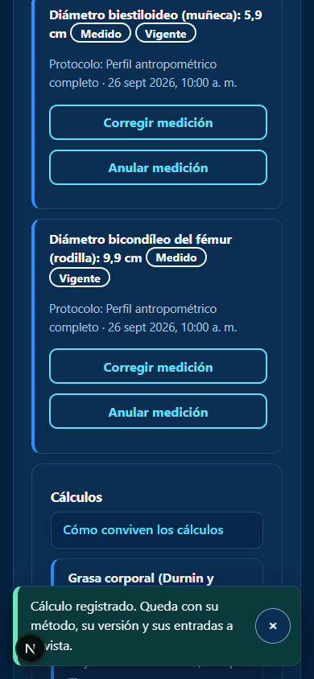
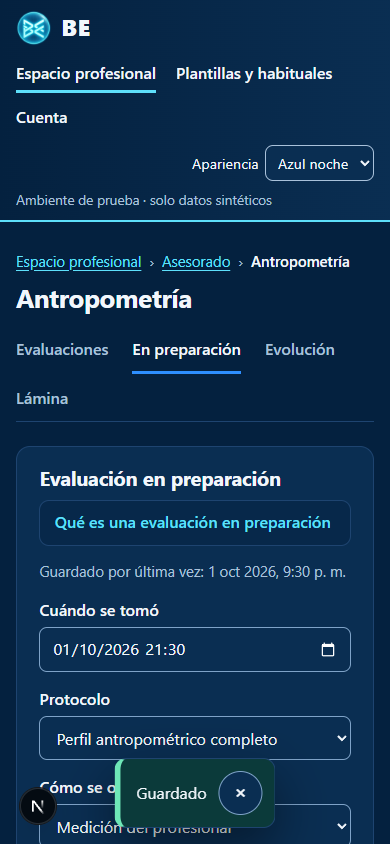
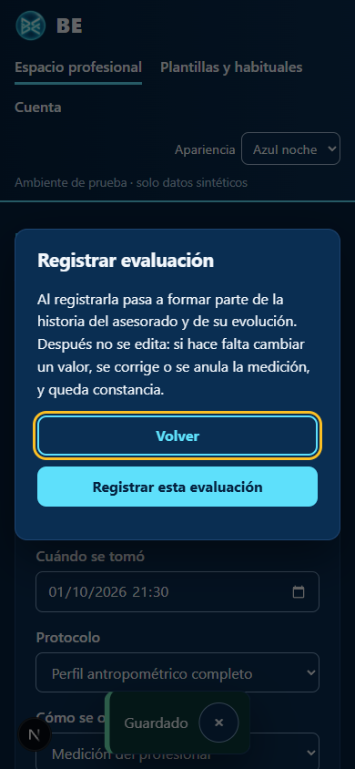
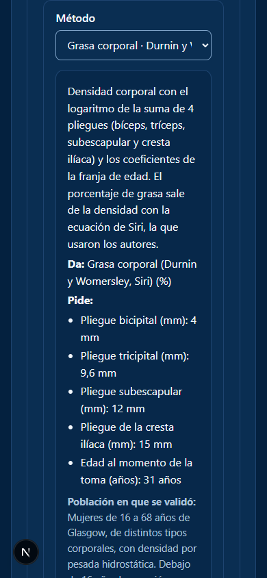
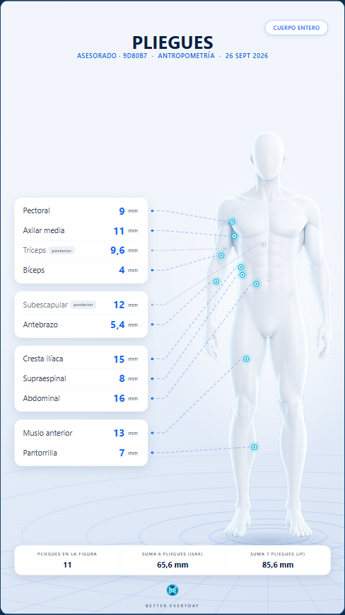
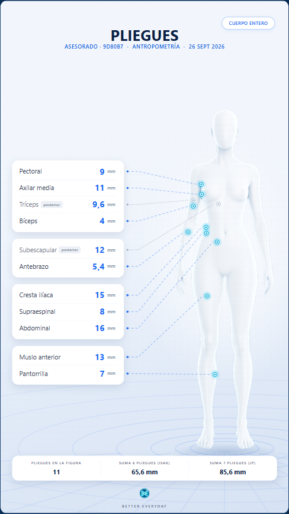
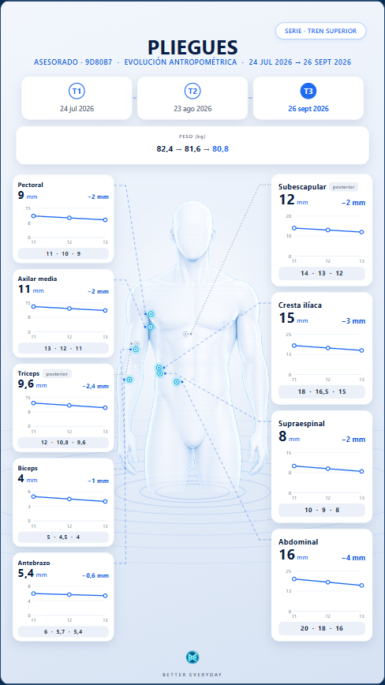
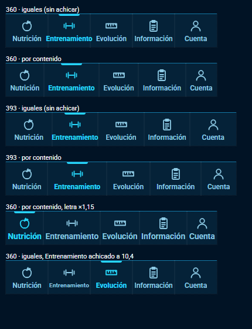
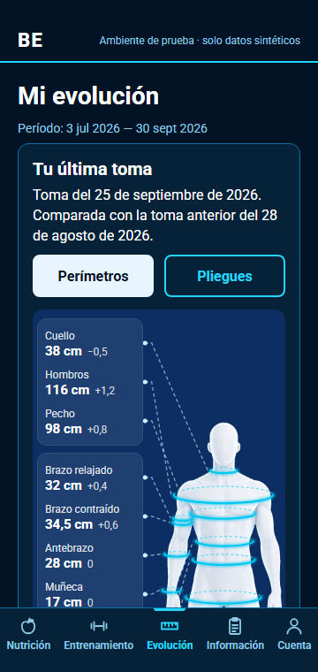
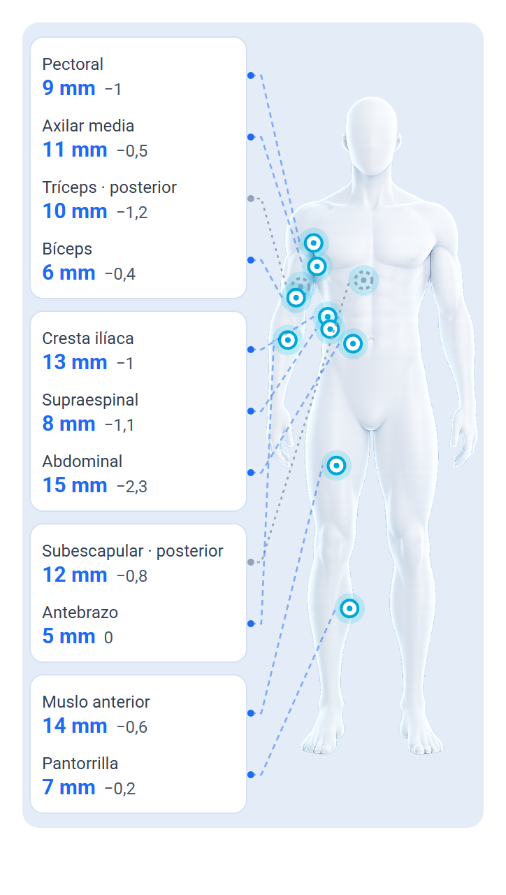

# Evidencia · DL-112 y DL-113: purga del catálogo y UX/UI del website y la APK

**Estado:** implementado en la rama `feat/ux-ui-1`. La integración, el despliegue en test y la APK 0.13.0 se
registran en el PR de publicación. **Falta la prueba de Dirección en el teléfono.**

El pedido de Dirección del 2026-10-01 tuvo cuatro partes:
- purgar el catálogo de métodos («28 son demasiados»);
- arrancar la etapa de UX y UI, con una navegación en la zona baja de la APK;
- mostrar menos texto a la vista, para que no se pierdan funcionalidades;
- dejar escritas las buenas prácticas.

Las decisiones del ejecutor están en DL-112 y DL-113 (`docs/DEUDA_LEGAJO.md`), **a ratificar**. Las buenas prácticas
están en `docs/ux/GUIA-UX-UI.md`.

## Qué se entregó

| Pieza | Dónde |
|---|---|
| Purga: 21 métodos vigentes, 23 retirados con su motivo, 4 nuevos (masa grasa y libre de grasa de Durnin y Womersley) | `prisma/migrations/20261002000000_purga_del_catalogo_antropometrico`, `scripts/catalogo-antropometrico/catalogo-metodos.cjs` |
| Retiro sin borrar: un retirado no se lista ni se ejecuta, se consulta como histórico y sus corridas siguen en la historia | `retiro_de_especificacion` (solo agregar), `apps/api/src/antropometria/*.service.ts` |
| APK: barra inferior con cinco zonas | `apps/mobile/src/barra-de-zonas.tsx`, `src/navegacion.ts`, `App.tsx` |
| APK: figura en SVG (anillos como elipses) | `apps/mobile/src/dibujo-de-la-figura.ts`, `src/pantallas/figura-de-la-toma.tsx` |
| APK: menos texto a la vista (`Ayuda`, `Desplegable`) | `apps/mobile/src/ui.tsx` y las pantallas |
| Website: `Ayuda` y `AvisoFlotante` | `apps/web/src/components/ayuda.tsx` |
| Website: registrar evaluación con diálogo modal; Cálculos con lo técnico a un toque; aviso de variantes por sexo | `apps/web/src/app/pro/advisees/anthropometry/` |
| Website: el resto de las pantallas con el mismo criterio | `apps/web/src/app/**` |
| Lámina: bíceps y cresta ilíaca sobre la figura; pie con las dos sumas y «Sin calcular»; en Serie, una guía que pisaría otro punto entra de costado | `packages/domain/src/figura-de-lamina.ts`, `lamina.ts` |
| Guía de UX y UI, con la lista de control por pantalla | `docs/ux/GUIA-UX-UI.md` |

## Pruebas

| Prueba | Resultado |
|---|---|
| Dominio completo, con las 4 fórmulas nuevas y la geometría de la lámina: sitios nuevos, filas en orden, guías que no se cruzan ni pisan otro punto, en Medición y en Serie | **429/429** |
| Scripts (Node 22): vocabulario de las pantallas, contraste, figuras del compositor y navegación de la APK (9 pruebas nuevas de la barra) | **37/37** |
| Integración del catálogo y de la antropometría con la purga: 21 vigentes y un retirado que no se ofrece, devuelve 422 al ejecutarse y se consulta como histórico | **98/98** (5 suites) |
| Typecheck del dominio, la API, el website y la APK · OpenAPI al día | ✅ |
| Recorrido del website en Chrome sin ventana, base nueva con datos sintéticos, a 390 px (teléfono) y 1280 px (lámina) | **27/27** (`web-controles.json`) |

Los 404 y 403 que el recorrido anota en nutrición, entrenamiento y plantillas no son errores. El profesional sembrado
es solo de antropometría, y la API le niega esos dominios (B10-06).

## El website, en el teléfono (390 px)

| El éxito, abajo, donde se mira | «Guardado» en la preparación | Registrar: diálogo modal, centrado |
|---|---|---|
|  |  |  |

La ficha del método muestra la población a la vista; la fuente y la regla, plegadas. Avisa si la toma ya tiene el
mismo resultado con otro método:

## La lámina: bíceps y cresta ilíaca

| Pliegues, hombre | Pliegues, mujer | Serie, tren superior |
|---|---|---|
|  |  |  |

Las coordenadas de los dos sitios nuevos son del ejecutor. `control-sitios-biceps-cresta-iliaca.png` muestra las seis
figuras con los sitios del compositor en azul y los nuevos en rojo. **Dirección los tiene que validar.**

## La APK, en maqueta

No hay teléfono ni emulador en esta máquina. Las maquetas dibujan en HTML **las mismas cuentas** que los componentes,
y Chrome sin ventana las captura. **No son capturas de la APK**: sirven para revisar la geometría, no el dibujo
final de Android.

| Barra inferior en 360 y 393 dp | «Mi evolución», Azul noche | Pliegues con bíceps y cresta ilíaca |
|---|---|---|
|  |  |  |

## Qué mirar en el teléfono (Dirección)

**APK 0.13.0:**
1. Al entrar, la APK abre en Nutrición y abajo está la barra con las cinco zonas. Probar cada zona y el botón atrás:
   desde una zona vuelve a Nutrición, y desde Nutrición sale de la app.
2. Escribir en un campo: la barra se esconde con el teclado y vuelve al cerrarlo.
3. En Evolución, los anillos de la figura son elipses y no se rompen. En Pliegues aparecen el bíceps y la cresta
   ilíaca, si la toma los tiene.
4. «Cómo se lee» y «La figura, en lista» se abren y se cierran.
5. Si se puede: TalkBack (anuncia «pestaña, seleccionada») y la letra del sistema al máximo.

**Website, como profesional:**
1. Guardar una evaluación en preparación: «Guardado» aparece abajo. Registrarla: el diálogo queda centrado.
2. Calcular un método: el aviso aparece abajo y se va solo. El selector ofrece los 21 métodos.
3. Lámina, Pliegues: el bíceps y la cresta ilíaca, con su flecha, en el lugar que corresponde. Si alguno no está
   bien ubicado, decir dónde debería ir.
4. Nutrición y entrenamiento: menos texto arriba. Lo que antes se leía ahora está en el título plegable.

## Límites

- La APK no se probó en un teléfono: react-native-svg es nativo y solo existe en la APK 0.13.0.
- TalkBack y la letra al máximo siguen sin probarse en un Android físico (RNF-ACC-001).
- En la figura del teléfono, con muchos pliegues, los halos del tronco se tocan (ver la maqueta).
- El recorrido del website es automático. **No es la prueba manual de Dirección.**
