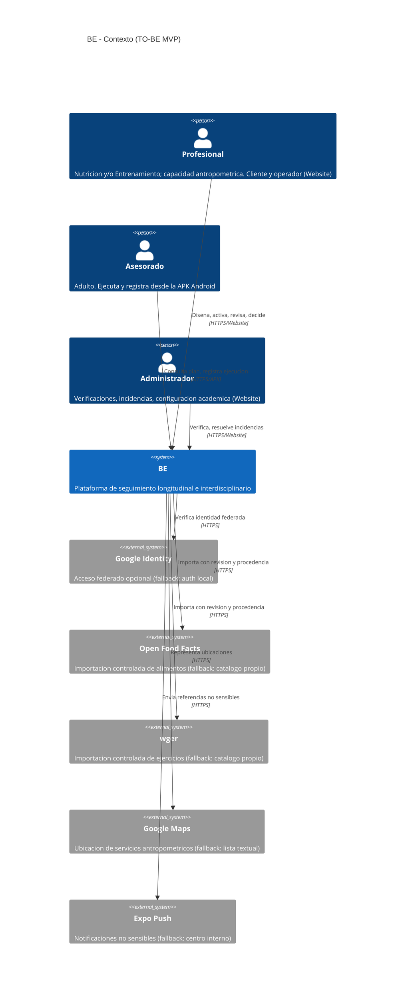
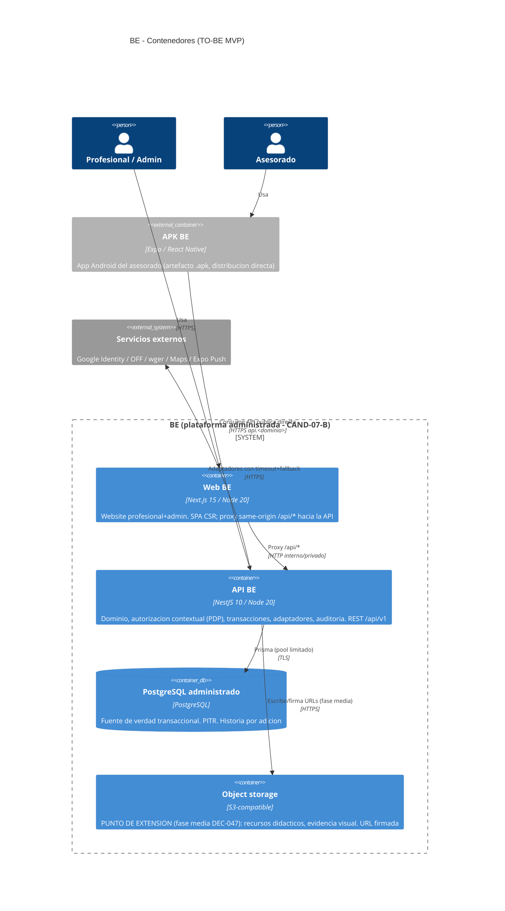
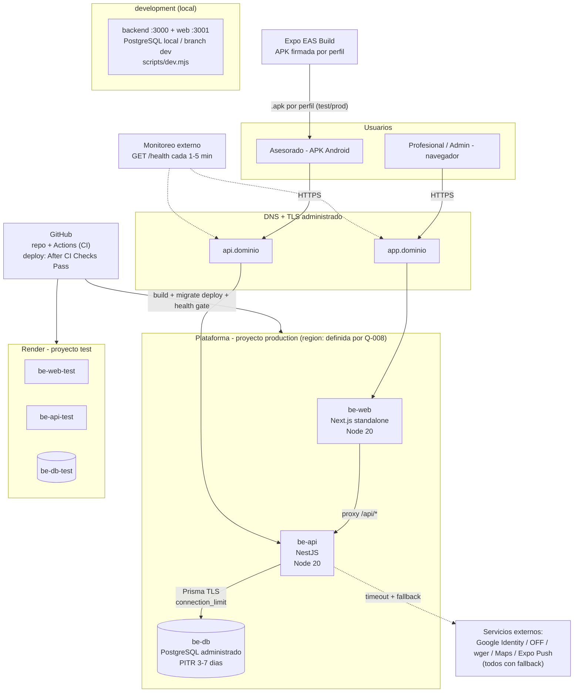

# 07 — Arquitectura y Despliegue de BE

> **Proyecto:** BE — Plataforma integrada de inteligencia en salud
> **Código documental:** `BE-LEG-07`
> **Versión:** `0.1.11`
> **Estado:** `APROBADO` — **RATIFICACIÓN FINAL DE DIRECCIÓN · DERIVACIÓN ADMINISTRATIVA DE v0.1.10 SIN CAMBIO NORMATIVO**. Dirección ratificó BE-LEG-07 v0.1.10 (SHA-256 `82a9da29c702fd3d6719a3a4e6cb0420ed1e6909c5dcea794fe7f2959ed4121c`) el 2026-08-29, después de la verificación cruzada final que cerró `M-CR-02`. Esta v0.1.11 solo normaliza estado, custodia y cierre para la canonización autorizada por `ACTA-DIR-020`. Los gates operativos abiertos **NO impiden** el cierre documental, pero **sí impiden** usar Render con el primer dato real (§0.2, §31.10)
> **Fecha de redacción:** v0.1 2026-08-17 · v0.1.1 2026-08-21 · v0.1.2 2026-08-22 · v0.1.3 2026-08-22 · v0.1.4 2026-08-22 · v0.1.5 2026-08-22 · v0.1.6 2026-08-26 · v0.1.7 2026-08-28 (materialización de Q-008) · v0.1.8 2026-08-29 (ajuste documental post-contrarrevisión externa de v0.1.7) · v0.1.9 2026-08-29 (materialización administrativa de la aprobación final de Dirección) · v0.1.10 2026-08-29 (ajuste correctivo post-revisión cruzada de v0.1.9) · **v0.1.11 2026-08-29** (ratificación final y normalización administrativa pre-canonización)
> **Responsable de dirección:** Elian Gastón Bufi
> **Redacción técnica base:** Claude Code (v0.1–v0.1.7) · **Ajuste documental v0.1.8, materialización administrativa v0.1.9, ajuste correctivo v0.1.10 y normalización administrativa v0.1.11:** ChatGPT (OpenAI), bajo instrucción de Dirección · **Revisión cruzada independiente:** Claude común sobre v0.1.9 y verificación de cierre de v0.1.10
> **Nivel de rigor:** **COMPLETO POR RESOLUCIÓN DE DIRECCIÓN** (CAND-07-GOV-A aprobada; elevación desde el nivel intermedio del 00 §6.2; se registra consumo de **1 sesión** de la reserva de Dirección del 00 §7.2)
> **Gate de destino:** `G4` — **ABIERTO**. `G3` quedó **CERRADO Y REGULARIZADO** por `ACTA-DIR-019`
> **Pregunta bloqueante propia:** **Q-008 — RESUELTA POR DIRECCIÓN** (2026-08-28, §31.10): `Render-first / AWS-ready`, con **Render Frankfurt** como plataforma inicial **condicionada a dos gates abiertos** y **AWS `eu-central-1`** como fallback previo al primer dato real y ruta de evolución
> **Canon previsto:** `docs/legajo/07_Arquitectura_y_Despliegue.md`
> **Canonización:** **AUTORIZADA POR `ACTA-DIR-020`**. Esta versión está `APROBADO`; la única copia canónica es la que quede materializada en Git en `docs/legajo/07_Arquitectura_y_Despliegue.md` mediante el commit autorizado y verificado. La autorización de canonización **no** autoriza implementación ni uso de datos reales (00 §3.2)
> **Lo que esta versión NO hace:** no canoniza · no commitea · no autoriza implementación · no habilita datos reales · no reinterpreta Q-003/Q-004/Q-005 (resueltas por `ACTA-DIR-019`) · no modifica la política del 08 · no toca entidades ni invariantes del 06 · no fija endpoints del 09 ni UI del 10 · no declara pruebas ejecutadas del 11A

---

## 0. Control documental

### 0.1 Identidad

| Campo | Valor |
|---|---|
| Documento | `07_Arquitectura_y_Despliegue.md` (`BE-LEG-07`) |
| Propiedad temática (00 §4.1) | Arquitectura, ambientes y despliegue |
| Pregunta bloqueante propia | **Q-008 — Plataforma de despliegue** (responsable: Arquitectura; método: comparativa técnica; gate límite: G4). **Estado: RESUELTA POR DIRECCIÓN** el 2026-08-28 — §31.10 |
| Decisiones vinculantes preexistentes que este documento materializa | DEC-007 (zona horaria) · DEC-008 (ambientes separados) · DEC-009 (despliegue reproducible antes de pilotos) |

### 0.2 Estado

`APROBADO` (taxonomía única de 00 §5). Dirección ratificó BE-LEG-07 v0.1.10 el 2026-08-29 después de la verificación cruzada final; esta v0.1.11 es una derivación exclusivamente administrativa para reflejar ese estado y preparar la canonización autorizada por `ACTA-DIR-020`. **Q-008 / CAND-07-B** permanece RESUELTA Y APROBADA desde 2026-08-28 (§31.10); `CAND-07-A`, `CAND-07-C…K`, `CAND-07-GOV-A` y la estrategia §56/§56.1 permanecen aprobadas/ratificadas. La aprobación documental **NO** autoriza implementación ni uso de datos reales. `G4` permanece **ABIERTO**: por 00 §8 requiere también 09 y 10 aprobados y validación inicial con usuarios.

**Tres estados distintos — no se vuelven a mezclar:**

| Estado | Qué significa | Situación en v0.1.10 |
|---|---|---|
| **Aprobación/canonización documental del BE-LEG-07** | Dirección acepta el contenido normativo y luego se ejecuta el acto Git correspondiente | **APROBADO Y RATIFICADO.** `ACTA-DIR-020` autoriza el acto Git. La canonicidad se determina por la presencia byte-idéntica de esta versión en la ruta canónica del repositorio. Los gates `G-Q008-1`/`G-Q008-2` no bloquean el cierre documental |
| **Autorización de implementación** | Se habilita ejecutar cambios de infraestructura/código/transición P0 | **NO OTORGADA** por este documento; requiere acto separado |
| **Ready-for-Real-Data / primer dato real en Render** | Se habilita operar información real de salud en la plataforma elegida | **BLOQUEADO** mientras `G-Q008-1`, `G-Q008-2`, las condiciones aplicables de §31.8 y el gate del 08 §42 no estén satisfechos con evidencia |

**Consecuencia:** un BE-LEG-07 aprobado puede describir una arquitectura **condicionada** cuyos gates operativos todavía estén abiertos. Si alguno de los dos gates de Q-008 falla, Render no recibe datos reales y se materializa AWS `eu-central-1` **antes del primer dato real** (§31.10, §32). Eso no invalida ni impide canonizar la decisión arquitectónica documentada.

### 0.3 Fuente canónica

La única versión canónica del legajo es la almacenada en Git en `docs/legajo/` sobre la rama documental aprobada (00 §3.1). Esta v0.1.11 está **APROBADA** y su canonización fue **AUTORIZADA por `ACTA-DIR-020`**; solo es canónica cuando estos bytes exactos quedan materializados y verificados en `docs/legajo/07_Arquitectura_y_Despliegue.md`.

### 0.4 Commit de referencia

| Campo | Valor |
|---|---|
| Rama | `docs/canonical-legajo-to-be` |
| HEAD de la redacción **v0.1** | `933be6f1133a31cf400497a44a6805b5404a76b9` (canonización de BE-LEG-06 / ACTA-DIR-018 §4) |
| **HEAD de la revisión v0.1.1** | **`cd651beedd08c91a0bf50402928114db618320e4`** — canonización de BE-LEG-08 v0.1.4 y regularización de G3 (`ACTA-DIR-019`); verificado al iniciar |
| **BE-LEG-08 canónico consumido** | `docs/legajo/08_Seguridad_Privacidad_y_Gobernanza.md` · SHA-256 `21d8e639a49b81cf1b679b4146aeaebd3306544c3c4e0c298d47893fbd1f0e6e` — **leído del repositorio, no de memoria** |
| Working tree al iniciar v0.1.1 | Solo los 2 artefactos BORRADOR del propio 07, sin trackear |
| Fecha de extracción de evidencia v0.1 | `2026-08-17T00:38:58Z` |
| **Fecha de extracción de evidencia v0.1.1** | **`2026-08-21`** — toda la investigación de plataformas de esta versión está fechada a este día; los datos de 2026-08-16 quedan como histórico de v0.1 y **no se reutilizan como vigentes** |

El AS-IS de código citado en este documento corresponde al SHA auditado `ae3cfc07…` y fue **verificado como vigente a `933be6f`**: `git log --stat ae3cfc0..933be6f -- src web prisma test` devuelve vacío (los 7 commits del rango tocan exclusivamente `docs/`). Las citas archivo:línea de código valen como estado actual.

### 0.5 Custodia

- Redacción bajo el precedente vinculante de ensamblado (ACTA-DIR-018 §2.3): **ninguna fuente fue reconstruida desde memoria**; lo no legible se declara `NO EVIDENCIADO` (única ocurrencia: `.env.example`, bloqueado por permisos de la sesión — §5).
- Esta materialización administrativa no ejecuta Git: sin commit, push, merge, PR, tag, amend ni movimiento de rama. La autorización de canonización se instrumentará en el acta final de cierre pre-Git.
- SHA-256 del artefacto: se calcula al cierre y se registra **fuera** del documento, porque un documento no puede contener su propio hash. La cadena histórica conserva sus registros por versión; **el registro de v0.1.8** es `_work/07/BE_LEG_07_REGISTRO_DE_TRABAJO_v0.1.8_2026-08-29.md`; v0.1.9 se preserva byte-idéntica en `_work/07/BE_LEG_07_v0.1.9_PRE_REVISION_CRUZADA_CLAUDE_2026-08-29.md`; el hash de v0.1.10 se registra en el manifiesto externo del paquete de cierre.

### 0.5-bis Congelamiento y cadena de custodia de versiones

**Régimen vigente:** cada versión se **cierra**, se calcula su SHA-256 y **ese hash identifica la versión sometida a contrarrevisión**. Cualquier edición posterior produce una versión nueva con entrada propia en §0.6 — nunca una variante del mismo número. El régimen nació de un hallazgo: durante la revisión adversarial interna de v0.1.1 el archivo **se modificó mientras era leído**, y el panel lo marcó bloqueante porque un contrarrevisor no podía fijarse a una versión.

**Cadena de custodia — cada eslabón es byte-idéntico y verificable:**

| Versión | Preservada en | SHA-256 |
|---|---|---|
| **v0.1** (pre-08 canónico) | `_work/07/BE_LEG_07_v0.1_PRE_08_CANONICO.md` | `780fdb770233774a598d41131dbee45926105d46b11ab1a0665b7b3dba765397` |
| **v0.1.1** (sometida a 1ª contrarrevisión externa) | `_work/07/BE_LEG_07_v0.1.1_PRE_CONTRARREVISION_EXTERNA_2026-08-22.md` | `ba286420b40b6c8b44cccb587f3642814132a9b8fae4427d05c31020774b892b` |
| **v0.1.2** (sometida a 2ª contrarrevisión externa) | `_work/07/BE_LEG_07_v0.1.2_PRE_SEGUNDA_CONTRARREVISION_EXTERNA_2026-08-22.md` | `f39066729f57b91d58dd313495e37eac048b41102200612276ae0e2c379af681` |
| **v0.1.3** (sometida a contrarrevisión final) | `_work/07/BE_LEG_07_v0.1.3_PRE_CONTRARREVISION_FINAL_2026-08-22.md` | `59b46fde05072b34074638ef9535fbb429648e68f29f32c1b98016c2e5813b78` |
| **v0.1.4** (sometida a contrarrevisión de cierre) | `_work/07/BE_LEG_07_v0.1.4_PRE_CONTRARREVISION_CIERRE_2026-08-22.md` | `1300c353625bb9877ba851905ac7e05dd69e571b355868ebd5ad6969f22d0e54` |
| **v0.1.5** (sometida a contrarrevisión externa final) | `_work/07/BE_LEG_07_v0.1.5_PRE_CONTRARREVISION_EXTERNA_FINAL_2026-08-26.md` | `5015492a0c2ee3fbcdc868d91ab45093f2bc5e13d5c6cd6d58449d0075cde4db` |
| **v0.1.6** (previa a la resolución de Q-008) | `_work/07/BE_LEG_07_v0.1.6_PRE_RESOLUCION_Q008_2026-08-28.md` | `6c821339315d55be38182d35e00a92e4853bffe590a8e2465c0bbb92eb091ef9` |
| **v0.1.7** (sometida a contrarrevisión externa post-Q-008) | `_work/07/BE_LEG_07_v0.1.7_PRE_AJUSTE_ADMINISTRATIVO_2026-08-29.md` | `faf8170a5b4e391d9d192fa96d970498776ec9514f81dc3c61fc413faf5aa321` |
| **v0.1.8** (candidata final aprobada por Dirección) | `_work/07/BE_LEG_07_v0.1.8_PRE_APROBACION_FINAL_2026-08-29.md` | `63be059beccef7f7d9e7a07e9a7c9f70611ae8bb4aae50943b5a178c6f80938a` |
| **v0.1.9** (sometida a revisión cruzada pre-canonización) | `_work/07/BE_LEG_07_v0.1.9_PRE_REVISION_CRUZADA_CLAUDE_2026-08-29.md` | `4ecd2baf043856fa113d100c428248a2399e6265f5dcb989d7d64f4bb41184d8` |
| **v0.1.10** (sometida a verificación final y ratificada por Dirección) | `_work/07/BE_LEG_07_v0.1.10_PRE_RATIFICACION_FINAL_2026-08-29.md` | `82a9da29c702fd3d6719a3a4e6cb0420ed1e6909c5dcea794fe7f2959ed4121c` |
| **v0.1.11** (ratificación final y normalización administrativa; esta versión) | — | Se calcula al cierre y se registra **fuera** del documento (§0.5) |

**Estado de v0.1.11: APROBADA y CONGELADA para canonización autorizada por `ACTA-DIR-020` (2026-08-29).** La v0.1.10 ratificada se preserva byte-idéntica como antecedente inmediato; no hay cambios normativos.

> **CAMBIO DE PROCEDIMIENTO EN v0.1.4 (`M-07-FIN-02`).** Hasta v0.1.3 la revisión adversarial interna se ejecutaba sobre una **copia estable** tomada antes de las últimas correcciones, y el documento **declaraba** que el archivo final difería del snapshot. La contrarrevisión final observó —con razón— que **declarar una edición posterior no la vuelve revisada**, y lo probó: una de las respuestas de la 3ª ronda (*"no quedan dependencias de `seq`"*) era **falsa sobre los bytes finales**.
>
> **Régimen vigente desde v0.1.4:** el maestro se **congela primero**, se calcula su SHA-256, y **la revisión adversarial se ejecuta sobre ese hash exacto**. **El maestro no se edita después de la revisión.** Si la revisión encuentra un defecto, se corrige, se vuelve a congelar y **se vuelve a revisar sobre el hash nuevo** — nunca se parchea un artefacto ya declarado apto.

### 0.6 Historial

| Versión | Fecha | Cambio |
|---|---|---|
| 0.1 | 2026-08-17 | Primera versión integral para contrarrevisión externa. Sin versiones previas. |
| **0.1.1** | **2026-08-21** | **Revisión post-canonización del BE-LEG-08.** Se consumen los 10 impactos vinculantes del 08 §47 (I-1…I-10); se cierra `H-07-GOV-01` por regularización de `ACTA-DIR-019`; se corrigen la inferencia "ADR aprobado ⇒ DEC" y el lenguaje de canonización propia; los ADR pasan a candidatas locales **CAND-07-A…J** con crosswalk; se separan **PITR / RPO / RTO**; se rehace la comparativa de plataformas de Q-008 **incluyendo Google Cloud**, omitido en v0.1; se recalculan costos con topología completa en escenarios S0/S1/S2; se agrega el mecanismo físico de la **matriz de pertinencia** (I-10); se incorporan **deletion ledger + replay post-restore**, sesiones revocables/MFA como bloqueantes, y auditoría con versión de consentimiento y de matriz. Detalle: `_work/07/BE_LEG_07_CORRECCION_POST_08_2026-08-21.md`. **La v0.1 se preserva byte-idéntica** en `_work/07/BE_LEG_07_v0.1_PRE_08_CANONICO.md` (SHA-256 `780fdb770233774a598d41131dbee45926105d46b11ab1a0665b7b3dba765397`) |
| **0.1.2** | **2026-08-22** | **Corrección post-contrarrevisión externa** (`NO CONFORME PARA APROBACIÓN — CORREGIBLE SIN REDISEÑO ESTRUCTURAL`: 1 bloqueante, 8 mayores, 4 menores). **Bloqueante `B-07-EXT-01`:** el anti-resurrección tenía una ventana de hasta 24 h; se sustituye el mecanismo por un **recovery deletion journal** con escritura anticipada fuera del dominio de fallo de PostgreSQL (**§46-bis**, `CAND-07-K`, `T-15`). **Q-008:** toda la aritmética pasa a **fuente única con script** (`M-07-EXT-01/02/03`) — la afirmación *"dos de las tres perturbaciones invierten"* era falsa contra la propia tabla; es **una**. **Evidencia AWS:** soporte reclasificado a **VERIFICADO/CONDICIONAL** y backups cross-region confirmados como **opt-in con destino elegido** (`M-07-EXT-04`, **§31.4-ter**). **HDS** retirada de todo argumento de transferencia (`M-07-EXT-05`). **Costos:** se publica el **TCO S1** con los componentes obligatorios, no el subtotal (`M-07-EXT-06`, **§31.5-bis**). **§32–§53** rotuladas **PERFIL FÍSICO A — RENDER** con su consecuencia de gobierno (`M-07-EXT-07`). **Telemetría:** se retira la afirmación universal y se clasifica por proveedor (`M-07-EXT-08`). Se agrega **§53-bis** (`Render-first / AWS-ready`) por encargo de Dirección. **Ningún score de la matriz fue modificado.** Detalle: `_work/07/BE_LEG_07_CORRECCION_POST_CONTRARREVISION_EXTERNA_v0.1.2_2026-08-22.md`. **La v0.1.1 se preserva byte-idéntica** en `_work/07/BE_LEG_07_v0.1.1_PRE_CONTRARREVISION_EXTERNA_2026-08-22.md` (SHA-256 `ba286420b40b6c8b44cccb587f3642814132a9b8fae4427d05c31020774b892b`) |
| **0.1.3** | **2026-08-22** | **Corrección quirúrgica post-segunda contrarrevisión externa** (`NO CONFORME TODAVÍA PARA RESOLUCIÓN DE Q-008 — CORREGIBLE QUIRÚRGICAMENTE, SIN REDISEÑO`: **0 bloqueantes**, 5 mayores, 3 menores). **`M-07-EXT2-01`:** se retira la lógica *"procesamiento primario en EE.UU. ⇒ veto"*, jurídicamente incorrecta — la AAIP contempla mecanismos para jurisdicciones no adecuadas (Cláusulas Contractuales Modelo, NCV, art. 12, consentimiento expreso); la pregunta pasa a ser si BE puede **materializar** uno (§53-bis.1, §31.4-bis). **`M-07-EXT2-02`:** §31.8-1 deja de preguntar a AWS por soporte y backups **como si fueran desconocidos**; las preguntas se reformulan **por proveedor**. **`M-07-EXT2-03`:** se separa **capacidad del proveedor** (AWS S3 Object Lock **VERIFICADA**) de **configuración de BE** (**NO IMPLEMENTADA**) — **§46-bis.7-bis**. **`M-07-EXT2-04`:** se retira *"una cuenta comprometida se lleva base y journal"*, que ignoraba el modo *compliance*; el matiz pasa a una tabla de **threat model**. **`M-07-EXT2-05`:** se resuelve la contradicción *append-only vs `estado` mutable* — **el journal guarda intenciones inmutables y el estado vive en PostgreSQL**; y el orden pasa de un contador a **`ULID`/`UUIDv7`** (**§46-bis.5**, **§46-bis.5-bis**). Menores: *"no lo son"* → *"no cubiertos por el compromiso"* · *"las ocho"* → **las doce** · el HMAC se describe como **pseudonimización, no anonimización**. **Ningún score fue modificado.** Detalle: `_work/07/BE_LEG_07_CORRECCION_POST_2A_CONTRARREVISION_v0.1.3_2026-08-22.md`. **La v0.1.2 se preserva byte-idéntica** en `_work/07/BE_LEG_07_v0.1.2_PRE_SEGUNDA_CONTRARREVISION_EXTERNA_2026-08-22.md` (SHA-256 `f39066729f57b91d58dd313495e37eac048b41102200612276ae0e2c379af681`) |
| **0.1.4** | **2026-08-22** | **Corrección quirúrgica post-contrarrevisión FINAL** (`NO CONFORME PARA RESOLUCIÓN DE Q-008 NI PARA APROBACIÓN`: **1 bloqueante** · 2 mayores · 4 menores). **`B-07-FIN-01` — el bloqueante reabría el anti-resurrección:** el replay leía *"asientos con `ts > punto_restaurado`"*, predicado **incompatible con la escritura anticipada** del propio diseño. Un punto de restore ubicado **entre `ASENTADA` y `APLICADA`** dejaba la intención fuera del rango y **el dato resucitaba**, sin necesidad de deriva de reloj. **El replay pasa a leer TODAS las intenciones vigentes bajo R-17, sin filtro temporal** (§46-bis.9); `ts` e `id` quedan como datos de auditoría y orden, **nunca como condición de corrección**; el barrido alcanzó también a §46.1 paso 3 y al runbook R-6. **`M-07-FIN-01`:** se retiran los dos usos vigentes de `seq` (§46-bis.9 y la señal de `R-07-26`, que era **imposible de instrumentar**). **`M-07-FIN-02`:** cambia el **procedimiento de revisión interna** — se ejecuta sobre los bytes finales congelados (§0.5-bis). Menores: *"v0.1.3 con PERFIL FÍSICO B"* → sin número · `CAND-07-A…J` → **A…K** en las dos ocurrencias vigentes · resultados del replay `APLICADO`/`NO_OP`/`NO_RESUELTO` **persistidos en PostgreSQL**, nunca en el journal (**§46-bis.9-bis**) · la pregunta 7-ter enumera **las cinco** vías de la AAIP. **§62 suma la obligación 23:** restore **entre `ASENTADA` y `APLICADA`**, con prueba de regresión contra la reintroducción de un filtro temporal. **Ningún score modificado.** Detalle: `_work/07/BE_LEG_07_CORRECCION_POST_CONTRARREVISION_FINAL_v0.1.4_2026-08-22.md`. **La v0.1.3 se preserva byte-idéntica** en `_work/07/BE_LEG_07_v0.1.3_PRE_CONTRARREVISION_FINAL_2026-08-22.md` (SHA-256 `59b46fde05072b34074638ef9535fbb429648e68f29f32c1b98016c2e5813b78`) |
| **0.1.5** | **2026-08-22** | **Corrección quirúrgica post-contrarrevisión de CIERRE** (`NO CONFORME PARA CIERRE NI PARA RESOLUCIÓN FORMAL DE Q-008`: **0 bloqueantes** · 2 mayores · 1 menor). La contrarrevisión **aceptó los 7 hallazgos anteriores como cerrados**, confirmó `B-07-FIN-01` cerrado y verificó que la matriz de Q-008 es **byte-idéntica** entre v0.1.3 y v0.1.4. **`M-07-CIE-01` — la dependencia temporal sobrevivió en dos lugares consumibles:** la tabla normativa del asiento seguía definiendo `ts` como *"Corte respecto del punto restaurado"* —**contradicción viva con §46-bis.9**, y la tabla es la parte que una implementación lee— y la obligación §62-19 pretendía probar la escritura anticipada **comparando timestamps**, lo que **no prueba causalidad ni durabilidad** y admite falso positivo. Se corrige el campo, se agrega **§46-bis.5-ter** distinguiendo el `corte` **de la orden** (vigente) del filtro **retirado**, y **§62-19 se reescribe para probar orden causal** con dos pruebas de falla inyectada. **`M-07-CIE-02` — `NO_OP` y `NO_RESUELTO` eran indistinguibles:** el asiento no identificaba su generación de `claveReplay`, de modo que *"falta la clave"* y *"el recurso no existe"* producían **el mismo observable**. Se agrega el campo **`claveReplayId`**, un **keyring fuera del dominio de fallo de PostgreSQL**, la **verificación de disponibilidad como paso 0** del replay, y las obligaciones **§62-24/25**; la rotación **deja de ser excepcional**. **`m-07-CIE-01`:** la evidencia del drill mezclaba ledger con journal — normalizada a **intenciones** con sus tres resultados y las divergencias de conciliación. **Ningún score modificado.** Detalle: `_work/07/BE_LEG_07_CORRECCION_POST_CIERRE_v0.1.5_2026-08-22.md`. **La v0.1.4 se preserva byte-idéntica** en `_work/07/BE_LEG_07_v0.1.4_PRE_CONTRARREVISION_CIERRE_2026-08-22.md` (SHA-256 `1300c353625bb9877ba851905ac7e05dd69e571b355868ebd5ad6969f22d0e54`) |
| **0.1.6** | **2026-08-26** | **Corrección quirúrgica post-contrarrevisión externa FINAL** (`NO CONFORME PARA CIERRE, APROBACIÓN NI RESOLUCIÓN FORMAL DE Q-008`: **1 bloqueante** · 1 mayor · 2 menores). **`B-07-EXTF-01` — `claveReplayId` identificaba la generación pero NO demostraba la autenticidad del material:** una generación **presente con el material sustituido** producía cero coincidencias y la tabla de v0.1.5 la clasificaba **`NO_OP`**, habilitando el switch con una supresión sin reaplicar — **el bloqueante original por una tercera puerta**. Se fija el **invariante** (`claveReplayId` resuelve a una versión histórica **inmutable y verificable**), se adopta un **compromiso de clave** `HMAC(K_N, "…/replay-keycheck/v1/kN")` almacenado como objeto inmutable en el **mismo almacén WORM que el journal**, con **regla de unicidad** (cero o más de un compromiso ⇒ `NO_RESUELTO`), la **tabla de clasificación pasa de 3 a 4 filas** y el **paso 0 verifica presencia Y autenticidad** (**§46-bis.6-ter**, **§62-26**). **`M-07-EXTF-01`:** se normalizan las cinco superficies operativas que aún decían *"replay del deletion ledger"* —título de §46, regla dura de §46, RTO de §47.2, `R-07-17` y la frontera con 11A— a **replay desde el journal + conciliación contra el ledger restaurado**. Menores: §0.2 deja de exigir una futura *"v0.1.3"*; §66 sincroniza la cadena de custodia (decía *"cuatro eslabones"* y ya iban seis). **Ningún score modificado; bloque §31.2–§31.10 byte-idéntico.** Detalle: `_work/07/BE_LEG_07_CORRECCION_POST_CONTRARREVISION_EXTERNA_FINAL_v0.1.6_2026-08-26.md`. **La v0.1.5 se preserva byte-idéntica** en `_work/07/BE_LEG_07_v0.1.5_PRE_CONTRARREVISION_EXTERNA_FINAL_2026-08-26.md` (SHA-256 `5015492a0c2ee3fbcdc868d91ab45093f2bc5e13d5c6cd6d58449d0075cde4db`) |
| **0.1.7** | **2026-08-28** | **Materialización de la resolución de Q-008 por Dirección.** **Q-008 pasa de `PROPUESTA` a `RESUELTA / APROBADA POR DIRECCIÓN`**: estrategia **`Render-first / AWS-ready`**, con **Render Frankfurt** como plataforma inicial del primer entorno con datos reales, **condicionada a dos gates ABIERTOS** —`VJR-2` y **WORM validado**— y con **AWS `eu-central-1`** como **fallback previo al primer dato real** si cualquiera falla, y como **ruta de evolución** por triggers objetivos (§31.10, §31.10-bis). **§32–§53 se normalizan**: dejan de ser *"el perfil de una de dos opciones"* y pasan a ser **la arquitectura física inicial seleccionada**, con AWS reposicionado como fallback y evolución, no como alternativa simultánea (§32). **Nueva §26-bis**: separación normativa **desarrollo · demo · Ready-for-Real-Data**, con la regla dura de que **ningún entorno gratuito o de demostración está habilitado para información real de salud**, y la declaración de que Q-008 **no canoniza** a Neon, Vercel ni ningún proveedor gratuito. **Nueva §46-bis.6-quater**: régimen normativo del **ciclo de vida del compromiso WORM** (L-1…L-6) y precisión de que `claveReplayId` **identifica** la generación mientras el **compromiso demuestra** la autenticidad — son dos piezas. **Corregida la clasificación de `R-07-28`**: *"el recurso no existe"* **NO** es un caso de `NO_RESUELTO` sino de `NO_OP`. En el paquete entonces visible se recontaron **5 rondas · 35 hallazgos** y **8 versiones de custodia**; v0.1.8 repara la evidencia externa faltante y corrige el conteo global (§67). **Ningún score, TCO ni matriz modificados.** Detalle: `_work/07/BE_LEG_07_CORRECCION_RESOLUCION_Q008_v0.1.7_2026-08-28.md`. **La v0.1.6 se preserva byte-idéntica** en `_work/07/BE_LEG_07_v0.1.6_PRE_RESOLUCION_Q008_2026-08-28.md` (SHA-256 `6c821339315d55be38182d35e00a92e4853bffe590a8e2465c0bbb92eb091ef9`) |
| **0.1.8** | **2026-08-29** | **Ajuste documental post-contrarrevisión externa de v0.1.7.** Se corrigen **5 hallazgos** (0 bloqueantes · 3 mayores · 2 menores) sin reabrir Q-008 ni arquitectura: (1) desarrollo/demo pasan a **exclusivamente sintéticos**, sin vía implícita de datasets anonimizados; (2) se separan formalmente **aprobación documental / autorización de implementación / Ready-for-Real-Data**; (3) se eliminan estados vivos que todavía trataban Q-008 como propuesta o pendiente; (4) se corrige la cadena de custodia a **9 versiones** en v0.1.8 (8 previas + actual); (5) se limpia la duplicación de §31.10-bis. Además se repara una brecha de procedencia: la contrarrevisión externa de v0.1.6, que existía en conversación pero no había sido materializada como auxiliar, se formaliza **ex post sin sumar una ronda nueva**. Conteo actual: **7 rondas externas · 44 hallazgos**. **Ningún score, TCO, sensibilidad, arquitectura ni mecanismo de recovery fue modificado.** La v0.1.7 se preserva byte-idéntica en `_work/07/BE_LEG_07_v0.1.7_PRE_AJUSTE_ADMINISTRATIVO_2026-08-29.md` (SHA-256 `faf8170a5b4e391d9d192fa96d970498776ec9514f81dc3c61fc413faf5aa321`). |
| **0.1.9** | **2026-08-29** | **Materialización administrativa de la aprobación final de Dirección.** Dirección aprueba el contenido normativo de v0.1.8, ratifica Q-008 ya resuelta, aprueba `CAND-07-A…K` y `CAND-07-GOV-A`, ratifica la estrategia de convergencia §56/§56.1 y el orden `C1→C2→C3`, eleva formalmente el 07 a **rigor completo** y registra el consumo de **1 sesión** de la reserva de Dirección (00 §6.2/§7.2). No se modifican scores, TCO, sensibilidad, arquitectura lógica, recovery, portabilidad ni gates de datos reales. La aprobación **no** autoriza implementación ni datos reales y **no cierra G4**, que requiere 09, 10 y validación inicial con usuarios (00 §8). La v0.1.8 queda preservada byte-idéntica con SHA-256 `63be059b…f80938a`. |
| **0.1.10** | **2026-08-29** | **Ajuste correctivo post-revisión cruzada de v0.1.9.** La revisión cruzada independiente de Claude dio `NO CONFORME` con **3 mayores · 3 menores · 3 observaciones**, sin reabrir Q-008, arquitectura ni la aprobación de candidatas. Se corrigen: contradicción sobre rigor/reserva (`M-CR-01`); materialización de los seis artefactos de custodia citados (`M-CR-02`); residuos de ratificación de `CAND-07-A` (`M-CR-03`); estado de `CAND-07-E` (`m-CR-01`); cadena de revisión interna (`m-CR-02`); predecesora inmediata (`m-CR-03`); render de la tabla de historial (`O-CR-01`); naturaleza de v0.1.9/v0.1.10 (`O-CR-02`); y nota de 26 obligaciones (`O-CR-03`). **Ningún score, TCO, sensibilidad, arquitectura, recovery, gate ni decisión aprobada fue modificado.** La v0.1.9 se preserva byte-idéntica con SHA-256 `4ecd2baf043856fa113d100c428248a2399e6265f5dcb989d7d64f4bb41184d8`. |
| **0.1.11** | **2026-08-29** | **Ratificación final y normalización administrativa pre-canonización.** Claude común cerró el único control material pendiente de v0.1.10 (`M-CR-02`) con **9/9 archivos presentes, 10/10 hashes correctos y maestro exacto `82a9da29…`**, y emitió `CONFORME PARA RATIFICACIÓN FINAL Y ACTA-DIR-020`. Dirección aprobó explícitamente BE-LEG-07 v0.1.10. Esta v0.1.11 cambia únicamente estado, custodia y referencias de cierre para reflejar la aprobación y la autorización de canonización; **no modifica Q-008, candidatas, scores, TCO, arquitectura, recovery, gates ni autorización de implementación/datos reales**. La v0.1.10 se preserva byte-idéntica en `_work/07/BE_LEG_07_v0.1.10_PRE_RATIFICACION_FINAL_2026-08-29.md`. |

### 0.6-duodecies Naturaleza de la revisión v0.1.11

**Derivación administrativa de cierre.** No introduce una nueva decisión ni reabre la revisión técnica. Su antecedente normativo es v0.1.10, ratificada expresamente por Dirección después de que Claude común cerrara `M-CR-02` y declarara `CONFORME PARA RATIFICACIÓN FINAL Y ACTA-DIR-020`.

**Cambios permitidos en v0.1.11:** estado `APROBADO`; referencia a `ACTA-DIR-020`; preservación de v0.1.10; actualización de cadena de custodia, historial, próximos pasos y cierre. **Todo cambio fuera de esas superficies invalida esta derivación y obliga a abortar la canonización.**

**Estado:** `APROBADO`. Canonización Git autorizada por `ACTA-DIR-020`; implementación y datos reales continúan no autorizados.

### 0.6-undecies Naturaleza de la revisión v0.1.10

**Ajuste correctivo de cierre, no rediseño.** La revisión cruzada de v0.1.9 verificó 10/10 hashes del paquete y confirmó íntegros Q-008, los scores y el diff sustantivo, pero detectó tres contradicciones mayores de estado/custodia y seis observaciones menores/editoriales. Esta versión corrige las nueve sin modificar decisiones aprobadas.

**Causa común:** un cambio de estado había sido materializado donde se declaraba, pero sobrevivía con el estado anterior donde se consumía. Como contramedida de cierre se ejecutó un barrido por identificadores `CAND-07-*` y por expresiones `PROPUESTA`, `se PROPONE`, `candidata`, `requiere ratificación`, `sujeto a ratificación` y `pendiente de Dirección`, abriendo cada coincidencia vigente. Las apariciones históricas rotuladas se preservan.

**Custodia materializada:** los seis artefactos que v0.1.9 citaba pero no incluía en su paquete se incorporan físicamente en `_work/07/` con hashes registrados en el manifiesto de v0.1.10. La revisión cruzada de v0.1.9 se preserva como `_work/07/BE_LEG_07_REVISION_CRUZADA_CLAUDE_v0.1.9_2026-08-29.md`.

**Estado:** esta v0.1.10 queda `EN REVISIÓN` únicamente hasta una verificación de cierre sobre sus bytes congelados. Q-008 y las candidatas aprobadas no se reabren.

### 0.6-decies Naturaleza de la revisión v0.1.9

**Materialización administrativa de una aprobación ya otorgada.** v0.1.9 no reabrió arquitectura: trasladó al maestro las decisiones que Dirección aprobó el 2026-08-29, mantuvo Q-008 intacta y separó aprobación, canonización Git, implementación y habilitación de datos reales.

**Revisión cruzada pre-canonización.** Esa versión fue el objeto de la revisión independiente de Claude que detectó `M-CR-01…03`, `m-CR-01…03` y `O-CR-01…03`. Por esa razón v0.1.9 no se canonizó y queda preservada byte-idéntica como predecesora de esta corrección.

### 0.6-novies Naturaleza de la revisión v0.1.8

**Corrección documental dirigida, no rediseño.** La contrarrevisión externa de v0.1.7 no reabrió Q-008, scores, TCO, arquitectura lógica, recovery ni portabilidad. Encontró cinco defectos de estado/gobierno y consistencia operativa; esta versión los corrige sobre el maestro y conserva la v0.1.7 byte-idéntica.

**Cambio de método de producción documental.** A partir de esta versión, el ajuste escrito fue ejecutado por **ChatGPT** a pedido de Dirección, en lugar de encadenar otra iteración de Claude Code. Esto no modifica la autoridad documental: Dirección sigue aprobando; Git sigue siendo un acto separado; y los agentes de código quedan reservados preferentemente para integración/verificación del repositorio y desarrollo de software.

**Brecha de procedencia reparada.** La revisión externa de v0.1.6 sí ocurrió y produjo cuatro observaciones, pero no se entregó entonces como archivo autónomo al productor. Eso explica por qué v0.1.7 contó solo la evidencia visible en el repo (5 rondas · 35 hallazgos). v0.1.8 materializa esa revisión ex post, sin inventar una nueva ronda, y suma también la contrarrevisión formal de v0.1.7: **7 rondas externas · 44 hallazgos**.

**Regla de cierre:** los gates de datos reales son **preoperacionales**, no documentales. Un gate abierto puede impedir operar Render con información real sin impedir que Dirección apruebe el documento que define exactamente esa condición.

### 0.6-octies Naturaleza de la revisión v0.1.7

**No es una corrección: es una materialización.** Las seis versiones anteriores respondieron a hallazgos. **Esta responde a una decisión de Dirección**, y por eso su naturaleza es distinta: no corrige defectos, **fija en el documento lo que Dirección resolvió** y normaliza las superficies que estaban escritas suponiendo la decisión pendiente.

**Lo que NO cambió, y es casi todo:** la arquitectura lógica · el modelo de dominio · los mecanismos de §22 · el recovery deletion journal · la matriz de pertinencia · sesiones y MFA · **los 36 scores de Q-008, el TCO, la sensibilidad y la estrategia de portabilidad**. El bloque §31.2–§31.10-bis conserva **íntegro** el análisis comparativo, ahora como **rastro de la evidencia sobre la que se decidió**, no como decisión pendiente.

**Un residuo de v0.1.6 que esta versión corrige, y conviene no minimizar:** la señal temprana de `R-07-28` listaba *"el recurso no existe"* entre los casos de `NO_RESUELTO`. **Era el error simétrico del que la contrarrevisión de cierre había encontrado** — v0.1.5 clasificaba de más como `NO_OP` y ocultaba pérdidas de clave; esta redacción clasificaba de más como `NO_RESUELTO` y **habría bloqueado recuperaciones legítimas de forma indefinida**. Los dos errores son graves y apuntan en direcciones opuestas: por eso §46-bis.6-quater exige **la prueba negativa y la positiva**, y declara que **ninguna vale sin la otra**.

**Discrepancia de procedencia, explicada y corregida en v0.1.8:** al producir v0.1.7 el paquete visible para Claude Code contenía evidencia formal de **5 rondas · 35 hallazgos**. La **6ª contrarrevisión externa de v0.1.6 sí había ocurrido en la conversación**, con 4 hallazgos, pero no se le había entregado como artefacto autónomo; por eso el productor no podía sostener 6/39 desde el repo. v0.1.8 formaliza ex post esa evidencia sin contarla dos veces y agrega la contrarrevisión de v0.1.7; el conteo vigente queda en §67.

### 0.6-septies Naturaleza de la revisión v0.1.6

**Corrección quirúrgica. La arquitectura no se reabre y Q-008 no se toca.** La contrarrevisión externa final confirmó cerrados los defectos de causalidad temporal de v0.1.4, verificó el bloque Q-008 **byte-idéntico** y reprodujo el cálculo sin cambios.

**El bloqueante es la quinta aparición del mismo patrón, y la más instructiva:**

> **Una corrección cierra la pregunta que le hicieron y deja abierta la que sigue.**

`M-07-CIE-02` preguntaba *"¿cómo distinguís `NO_OP` de `NO_RESUELTO`?"*. La respuesta —identificar la generación— fue correcta **para esa pregunta**. Pero introdujo una nueva: *"¿y cómo sabés que el material de esa generación es el correcto?"*. **v0.1.5 la contestó con una frase —"presente e íntegra"— en lugar de un mecanismo**, y una frase no es una garantía verificable.

**Lo que esto enseña sobre el método:** las tres primeras rondas encontraron **contradicciones** —cosas escritas en dos lugares de forma incompatible—, detectables con barrido. Las dos últimas encontraron **huecos**: propiedades enunciadas sin forma de probarlas. **Un barrido de texto no los ve.** Los ve alguien que toma cada garantía y pregunta *"¿con qué la demostrás?"*. Es exactamente lo que aporta una contrarrevisión externa y lo que la revisión interna, sobre su propio diseño, tiende a no ver.

### 0.6-sexies Naturaleza de la revisión v0.1.5

**Corrección quirúrgica. Cero bloqueantes.** La contrarrevisión de cierre dio por conformes la arquitectura base, el consumo de `I-1…I-10`, la cadena de custodia, la semántica *append-only*, el retiro de `seq`, el replay total bajo R-17, la prueba `ASENTADA`↔`APLICADA`, y **toda Q-008** — cuyo bloque §31.2–§31.10 verificó **byte-idéntico** entre v0.1.3 y v0.1.4.

**Los dos hallazgos mayores comparten una raíz, y es la cuarta variante del mismo patrón:**

> **Una regla se adopta en el lugar donde se explica, y sobrevive en el lugar donde se consume.**

| Dónde estaba la regla nueva | Dónde sobrevivió la vieja |
|---|---|
| §46-bis.9: *"`ts` … nunca condición de corrección"* | **§46-bis.5**, la tabla de campos — que es lo que lee una implementación |
| §46-bis.4: la escritura anticipada como propiedad | **§62-19**, la prueba — que comparaba relojes en lugar de orden causal |

**Y `M-07-CIE-02` es de otra especie, más difícil:** no era una contradicción entre secciones sino **una ambigüedad que ninguna sección declaraba**. El mecanismo permitía rotar claves y exigía clasificar resultados, pero **no había forma de decidir entre dos clasificaciones opuestas** cuando el observable era el mismo. **Nadie lo había escrito mal; faltaba escribirlo.**

**Contramedida sumada:** al corregir una regla, revisar además **la tabla de campos y la obligación de prueba correspondientes** — porque son las dos superficies que una implementación consume y la prosa explicativa no.

### 0.6-quinquies Naturaleza de la revisión v0.1.4

**Corrección quirúrgica. La arquitectura no se reabre: el bloqueante estaba en el PROCEDIMIENTO, no en el diseño.**

El almacenamiento anticipado de intenciones —el mecanismo que v0.1.2 introdujo para cerrar `B-07-EXT-01`— **era correcto y se preserva sin cambios**. Lo que fallaba era el **criterio de selección del replay**, que descartaba por comparación temporal exactamente la intención que la escritura anticipada existe para salvar. **Un mecanismo correcto anulado por su propio procedimiento de lectura.**

**Lo que esta ronda deja como lección, y es la tercera vez que aparece el mismo patrón:**

| Ronda | Defecto | Causa común |
|---|---|---|
| `ADV2-01` | Una lectura de sensibilidad contradecía su tabla a tres párrafos | Corregir la cifra y no la narrativa |
| `M-07-EXT2-01…05` | Cinco contradicciones entre secciones nuevas y viejas | Agregar sección y no barrer las anteriores |
| **`B-07-FIN-01` + `M-07-FIN-01`** | El filtro temporal y dos usos de `seq` **sobrevivieron a la corrección que los volvía inválidos** | **Corregir la definición y no el algoritmo que la consume** |

**Contramedida adoptada:** cuando una corrección retira un campo o cambia una regla, **el barrido se hace por el nombre del campo y por la frase, en todo el artefacto**, y el resultado del barrido se registra. En esta pasada eso encontró el filtro temporal en **tres** lugares —§46-bis.9, §46.1 paso 3 y el runbook R-6— cuando la contrarrevisión había señalado uno.

### 0.6-quater Naturaleza de la revisión v0.1.3

**Corrección quirúrgica sobre el artefacto congelado. Cero bloqueantes: la arquitectura no se reabre.** La segunda contrarrevisión externa dio por **satisfactoriamente corregido** el bloqueante de v0.1.1 y confirmó como correctos y no reabribles: arquitectura base · monolito modular · PostgreSQL · OCI · I-1…I-10 · el recovery journal **como mecanismo** · el TCO · la matriz `3,85 / 3,71 / 3,33 / 3,30` · el margen `0,14` · la sensibilidad `1/3` · la shortlist Render/AWS · `Render-first / AWS-ready` como hipótesis · el descarte de Render Object Storage en alfa para el journal.

**Los cinco hallazgos mayores eran, todos, contradicciones internas del propio documento** — no defectos de diseño:

| Contradicción | Entre |
|---|---|
| `M-07-EXT2-01` | La conclusión jurídica sobre Render **y el régimen argentino real** |
| `M-07-EXT2-02` | §31.8-1 *"los tres flujos que ningún candidato publica"* **y** §31.4-ter, que ya documentaba dos de los tres para AWS |
| `M-07-EXT2-03` | §31.8-9 *"Object Lock NO VERIFICADO en ninguno"* **y** §46-bis.8, que lo usaba como ventaja de la opción B |
| `M-07-EXT2-04` | El threat model del journal **y** lo que el modo *compliance* efectivamente garantiza |
| `M-07-EXT2-05` | `J-1` *"append-only"* **y** un campo `estado` que cambiaba en el mismo asiento |

**Patrón, y vale registrarlo:** las cinco nacieron de **agregar una sección nueva sin barrer las secciones viejas que la contradicen**. Es el mismo defecto que produjo `ADV2-01` en la ronda anterior. La contramedida aplicada en esta pasada fue **buscar cada afirmación por texto antes de darla por corregida**, no confiar en la memoria de dónde estaba escrita.

### 0.6-ter Naturaleza de la revisión v0.1.2

**Corrige el borrador congelado; no lo rehace.** La contrarrevisión externa calificó la arquitectura núcleo como **adecuada y a preservar**, y estimó preservable **más del 90 %** del contenido. Se preservan sin reabrir: monolito modular · PostgreSQL como frontera transaccional · OCI · expand→migrate→contract · separación de ambientes · sin Redis/Kubernetes/broker por defecto · sesiones revocables · MFA como gate · auditoría bloqueante · matriz de pertinencia física · I-1…I-10 · retiro/evaluación del runtime Next dedicado · restore a instancia nueva · distinción PITR/RPO/RTO · **shortlist de Q-008** · Fly y GCP como alternativas estudiadas y no finalistas · portabilidad · proporcionalidad.

**Lo que cambia es de tres clases, y conviene no confundirlas:**

| Clase | Qué se tocó | Alcance |
|---|---|---|
| **Mecanismo** | El anti-resurrección (§45, §46, **§46-bis**) | **Cambio real de arquitectura.** Es el único |
| **Fundamento** | C1 de AWS, base de cálculo de C5 de Fly, papel de HDS, clasificación de telemetría | Los **scores no se movieron**; se movió lo que los sostiene |
| **Coherencia** | Aritmética con fuente única, TCO en lugar de subtotal, conteos, rótulos de versión, sincronización de auxiliares | El documento decía cosas distintas en lugares distintos |

**Nada de esto se corrigió inflando el documento con lenguaje defensivo.** Donde un hallazgo no se pudo cerrar —el costo del ambiente `test`, el `Object Lock` del proveedor, la rotación de `claveReplay`, la supresión dentro de los backups históricos— **se declara abierto con su propietario**, que es lo que el hallazgo merece.

### 0.6-bis Naturaleza de la revisión v0.1.1

Esta versión **corrige el borrador existente; no lo rehace**. La arquitectura de v0.1 —monolito modular NestJS, Next.js web, PostgreSQL como frontera transaccional, ACID local, constraints como invariantes, idempotencia, historia por adición, expand→migrate→contract, API stateless, ambientes separados, secretos fuera de Git, deploy reproducible, health checks, rollback, observabilidad proporcional, auditoría ≠ logs técnicos, backup + restore drill, portabilidad OCI/PostgreSQL, sin Redis/Kubernetes/broker por defecto, escalado vertical primero, convergencia incremental— **se preserva**. Lo que cambia es lo que el 08 canónico obliga a cambiar y lo que la revisión encontró mal fundado.

### 0.7 Alcance de la versión

Primera versión completa del TO-BE de arquitectura y despliegue: contexto, drivers, ASR, escenarios de calidad, principios, AS-IS contrastado, arquitectura objetivo C4, persistencia, integridad, ambientes, configuración, networking, salud, **resolución y materialización de Q-008**, topología y pipeline de despliegue, migraciones, rollback, observabilidad, confiabilidad, backup/restore con RPO/RTO propuestos, capacidad, operación, costos, portabilidad, riesgos, transición AS-IS→TO-BE, candidatas locales (CAND-07-A…K + CAND-07-GOV-A), fronteras con 08/09/10/11A/12 y matriz de trazabilidad. Quedan fuera: todo lo enumerado en §3 (fronteras) y las materias diferidas que se listan con su propietario.

---

## 1. Propósito

Definir la arquitectura que BE necesita para implementar de manera **verificable, operable, evolutiva y económicamente razonable** el producto definido por los documentos canónicos 02–06, preservando su semántica, calidad y trazabilidad; y resolver **Q-008** (plataforma de despliegue) mediante comparativa técnica con evidencia primaria. Este documento es la fuente de verdad TO-BE para: componentes y fronteras técnicas, topología lógica, entornos, infraestructura, despliegue, operación técnica, observabilidad arquitectónica, confiabilidad, escalabilidad, releases, migraciones (perspectiva de despliegue), recuperación, portabilidad, decisiones de plataforma y transición AS-IS → TO-BE.

## 2. Resumen ejecutivo

1. **Estilo confirmado, no re-arquitectura.** BE se mantiene como **monolito modular NestJS + Prisma + PostgreSQL** con frontend web Next.js y una APK Android (Expo/React Native, hoy AUSENTE — es la brecha de canal más urgente). La auditoría AS-IS calificó la arquitectura de código como "sólida y coherente"; el TO-BE es evolución dirigida por causas raíz confirmadas, no reescritura (CAND-07-A aprobada).
2. **La brecha dominante no es de código sino de operación.** El repositorio no contiene **ningún** artefacto de despliegue (sin Dockerfile, sin config de plataforma, sin `prisma migrate deploy` en CI, sin CORS/helmet/shutdown hooks, sin backups gobernados). DEC-009 exige exactamente eso antes de pilotos. Este documento convierte DEC-008/DEC-009 en arquitectura verificable (§26–§39).
3. **Q-008 — la comparativa se rehízo entera y el resultado cambió.** La de v0.1 no era reutilizable: subestimaba el costo de Render **~3×**, descartaba AWS por la razón equivocada (**App Runner cerró a clientes nuevos el 2026-04-30**, no es un problema de región) y omitía GCP. Con fuentes oficiales al **2026-08-21** y **TCO completo**, el piloto real S1 cuesta **USD 70–112/mes** según opción (§31.5-bis) — no 13–21, y tampoco los **36–89** que publicaba v0.1.1, que eran el **subtotal de plataforma** sin el ambiente `test`, el storage externo ni el journal. La comparativa produjo una **SHORTLIST DE DOS** —sin ganador matemático único—, porque los dos primeros quedan a **0,14 puntos** (Render 3,85 · AWS 3,71) y **una de las tres perturbaciones plausibles de los pesos invierte el orden, por 0,0025**: **(A) Render Frankfurt** —gana en operabilidad para un solo operador y costo— y **(B) AWS `eu-central-1` con ECS Express Mode** —gana en postura de cumplimiento verificable: único con backups regionales confirmados, soporte con jurisdicciones publicadas y compuerta del cliente, PITR de hasta 35 días y **S3 con Object Lock en región** para el journal de §46-bis—. **La certificación HDS de AWS no se computa como ventaja de transferencia** (§31.7). **Ninguna de las dos satisface CB-3 hoy.** **Dirección resolvió Q-008 el 2026-08-28** (§31.10): **`Render-first / AWS-ready`** — Render Frankfurt como plataforma inicial **condicionada a dos gates abiertos** (`VJR-2` y **WORM validado**), y **AWS `eu-central-1`** como **fallback previo al primer dato real** si cualquiera falla, y como ruta de evolución por triggers objetivos. **La elección era una priorización, no un cálculo** —la matriz no distingue entre los dos primeros— y por eso la tomó Dirección. Ver §31 y **CAND-07-B**.
3-bis. **"Elegir región adecuada" no cierra la evaluación de transferencias — y ahora hay evidencia contractual.** El DPA de **Render** declara que *"las operaciones primarias de procesamiento tienen lugar en Estados Unidos"*; el de **Railway** dice lo mismo; el Privacy Statement de **Fly.io** **no cubre** la ubicación del contenido del cliente; las SCCs de **AWS** se activan por **aplicabilidad del GDPR**, no por región; y **Google declara que la Ley 25.326 no le aplica**. La regla del 08 §35.1 queda **empíricamente confirmada**. Tres flujos —jurisdicción del soporte, destino de telemetría y ubicación de backups— quedaron **NO VERIFICADOS en fuente oficial para casi todos los candidatos**: son preguntas por escrito y **condición previa al primer dato real** (§31.8).
4. **El dominio canónico manda sobre el vocabulario del código.** BE-LEG-06 no conoce `EventoSalud`, `health_coach` ni el schema Prisma actual; la reconciliación dominio-canónico ↔ implementación no tiene dueño declarado en el legajo. Este documento la registra como **hallazgo (H-07-DOM-01)**, propone la estrategia de convergencia por fases (§56) y adopta el vocabulario del 06 para todo el TO-BE.
5. **Mecanismos, no promesas.** Cada invariante exigente del 06 (activación atómica con instantánea, unicidades condicionales, idempotencia de ejecución, capacidad determinista, corrección trazable, autorización contextual, auditoría bloqueante) queda mapeado a un mecanismo concreto de PostgreSQL/Prisma/NestJS (§22), con su obligación de verificación delegada a 11A (§62).
6. **Gobierno: regularizado.** La divergencia 00 ↔ ACTA-DIR-018 sobre G3 que v0.1 registró como **H-07-GOV-01** quedó **CERRADA POR REGULARIZACIÓN POSTERIOR** (`ACTA-DIR-019`, 2026-08-21): el 08 fue aprobado y canonizado, **Q-003/Q-004/Q-005 están RESUELTAS**, y **G3 está cerrado conforme al régimen del 00**. **Q-008 también quedó RESUELTA POR DIRECCIÓN el 2026-08-28**; lo que sigue abierto es **G4**, que además requiere 09 y 10 aprobados y validación inicial con usuarios (00 §8). La **elevación de rigor** del 07 quedó resuelta por Dirección el 2026-08-29: **CAND-07-GOV-A APROBADA**, rigor completo con consumo explícito de 1 sesión de reserva (§6.2) — y se corrige la inferencia de v0.1 según la cual resolver Q-008 "implica emitir una DEC", que no está sustentada por el 00.
7. **El 08 canónico se consume, no se reinterpreta.** Los **10 impactos vinculantes** del 08 §47 (I-1…I-10) se procesan uno por uno en la matriz §59-bis: transferencias evaluadas **por flujo** y no por región (I-1), DPA con subencargados y jurisdicciones (I-2), **deletion ledger + replay post-restore** antes de volver a producción (I-3) —**terminología lógica heredada del 08**; su materialización física en el 07 es **replay desde el recovery deletion journal + conciliación posterior contra el ledger restaurado** (§46-bis)—, sesiones revocables y MFA como **bloqueantes** y no "P1" (I-4), auditoría con versión de consentimiento **y de matriz de pertinencia** (I-5/I-10), dimensionamiento de la retención de auditoría (I-6), fotos (I-7), ambientes (I-8), **PAUSADO/FINALIZADO sin lectura** como cambio de política en la convergencia (I-9) y el **mecanismo físico de la matriz de pertinencia** (I-10, §31-bis).

8. **El anti-resurrección se rediseñó: era una promesa con una ventana de 24 h.** La contrarrevisión externa encontró —correctamente— que apoyar la garantía del 08 §18 en el export del ledger que acompaña al **dump diario** deja un hueco: entre el dump y el incidente, una supresión ya **confirmada al titular** puede perderse con la base, y el restore la resucita. v0.1.1 conocía el hueco y lo **declaraba**; declararlo no es cerrarlo. **§46-bis** lo cierra **por construcción**, no por procedimiento: el asiento va a un **journal duradero fuera del dominio de fallo de PostgreSQL** *antes* de que la supresión toque la base, de modo que el único modo de falla que queda es el **recuperable** (un asiento sin aplicar, que el replay aplica) en lugar del irreparable (una supresión aplicada sin asiento). Cuesta **USD 1–3/mes** y no agrega broker, cola ni microservicio. Consecuencia que Dirección debe ver: **Render no tiene almacenamiento de objetos en disponibilidad general** —está en alfa con lista de espera— así que la opción A obliga a un **cuarto proveedor** para esta pieza (§46-bis.8). Ver **CAND-07-K** y **T-15**.
9. **Render-first / AWS-ready: la hipótesis SOBREVIVE, condicionada — y la condición decisiva es una gestión con plazo, no una fatalidad.** Por encargo de Dirección se intentó **refutar** la hipótesis, no confirmarla (§53-bis). Cinco intentos; ninguno la mata para la etapa de tesis/piloto pequeño. El más fuerte es el DPA de Render **§6.1**, que declara que el **procesamiento primario ocurre en EE.UU.** — cláusula contractual que elegir Frankfurt no deroga. **Pero eso NO lo vuelve jurídicamente inviable**: la AAIP contempla transferencias a jurisdicciones no adecuadas mediante **Cláusulas Contractuales Modelo** (Disp. 60/2016, Res. 198/2023), **Normas Corporativas Vinculantes** (Res. 159/2018), excepciones del **art. 12** o **consentimiento expreso** `[NORMA VIGENTE 2026-08-22]`. La pregunta correcta —y es **VJR-2**, no del 07— es **si BE puede materializar uno de esos mecanismos para los flujos efectivos de Render y sus transferencias ulteriores**. Hay una vía publicada: su DPA **§6.6.4 permite pedir la firma de un acuerdo separado**. Si no se instrumenta antes del primer dato real, Render no puede recibirlo. **Los otros once triggers (§53-bis.4) son evolutivos y planificables; este es binario y con plazo.**

## 3. Alcance y fronteras documentales

Este documento **decide** sobre su propiedad temática y **no invade** la ajena. Tabla completa de fronteras en §53 (boundary review); resumen vinculante:

| Materia | Decide 07 | Propietario |
|---|---|---|
| Entidades, estados, invariantes, reglas de dominio | NO — se consumen del 06 | BE-LEG-06 |
| Consentimiento, retención, lectura residual, cuotas de media, políticas de acceso (Q-003/Q-004/Q-005 — **RESUELTAS**) | NO — **se consumen del 08 canónico** (§59) | BE-LEG-08 |
| Endpoints, payloads, códigos, contratos, idempotencia contractual | NO — se habilitan capacidades | BE-LEG-09 |
| Pantallas, navegación, accesibilidad aplicada | NO | BE-LEG-10 |
| Suite de pruebas y criterios de ejecución | NO — se emiten obligaciones verificables | BE-LEG-11A |
| Trazabilidad global y evidencia | NO — se emite en formato consumible | BE-LEG-12 / 11B |
| Estilo arquitectónico, componentes, topología, ambientes, plataforma (Q-008), build/deploy/rollback, migraciones (despliegue), observabilidad, backups/restore, capacidad, operación, costos, portabilidad | **SÍ** | **BE-LEG-07** |

## 4. Autoridad y precedencia

1. **Nivel A — Dirección:** BE-LEG-00 v0.2.1 (APROBADO) y las actas de dirección vigentes, en especial ACTA-DIR-018 (posterior al 00 en el tiempo; la secuencia temporal se registra en §6 sin editar documentos anteriores).
2. **Nivel B — Núcleo normativo vinculante:** BE-LEG-04 v0.4.1 (67 RF, 38 RNF), BE-LEG-05 v0.14 (53 UC + 5 TR), BE-LEG-06 v0.1 (14 bloques; 71 T-06, 210 INV-06, 201 REG-06, TR-01…05). Este documento **no puede alterarlos**: si una arquitectura conveniente viola una regla de 04/05/06, la arquitectura está mal.
3. **Nivel C — Contexto:** BE-LEG-02 y BE-LEG-03 v0.2.1 (visión, MVP, actores, escala, costos).
4. **Nivel D — Decisiones vigentes:** DEC-001…DEC-017 (iniciales y de G1), DEC-042…DEC-047.
5. **Nivel E — AS-IS auditado:** `docs/auditoria-sistema/**` @ `ae3cfc0` (verificado vigente para código a `933be6f`).
6. **Nivel F — Implementación observada:** código real a `933be6f`.
7. **Nivel G — Legacy:** `docs/arquitectura/**` (Maestro v2.2, ADR-15…22, serie visual, SPIKE-001) — insumo técnico, nunca autoridad normativa.
8. **Nivel H — Investigación externa:** fuentes primarias oficiales, fechadas, con nivel de confianza (§31.4).

Toda afirmación de este documento se clasifica con las etiquetas: `[CANONICO]`, `[ACTA/DIRECCION]`, `[AS-IS AUDITADO]`, `[IMPLEMENTACION OBSERVADA]`, `[LEGACY/HISTORICO]`, `[INVESTIGACION EXTERNA]`, `[INFERENCIA]`, `[PROPUESTA TO-BE]`.

## 5. Registro de fuentes

| Fuente | Rol | Estado de lectura |
|---|---|---|
| `docs/legajo/00_Gobierno_del_Legajo.md` v0.2.1 | Gobierno | Leído íntegro |
| `docs/legajo/ACTA_DIR_018_APROBACION_BE_LEG_06_Y_CANONIZACION_G3.md` | Acta vigente G3 | Leído íntegro (de primera mano por el redactor) |
| ACTA-DIR-006 / ACTA-DIR-008 / VERIFICACION_CUSTODIA_G1 / REV-001..003 / VER-G1-001 | Actas y revisiones históricas | Leídos |
| `docs/legajo/02_…` y `03_…` v0.2.1 | Visión y negocio | Leídos íntegros |
| `docs/legajo/04_Requerimientos_RF_RNF.md` v0.4.1 | RF/RNF | Leído íntegro (38 RNF extraídos uno por uno) |
| `docs/legajo/05_Casos_de_Uso_e_Historias.md` v0.14 | Comportamiento | Leído por barrido dirigido sobre sus 16.391 líneas (inventario completo de 53 UC + extracción de consecuencias arquitectónicas con cita) |
| `docs/legajo/BE_LEG_06_v0_1_MAESTRO_MODELO_DE_DOMINIO.md` + `BE_LEG_06_v0_1_1_ARQUITECTURA_CORREGIDA.md` + auditoría del maestro | Dominio | Leídos (maestro por bloques; arquitectura v0.1.1 íntegra) |
| DEC-042…DEC-047 | Decisiones | Leídos íntegros |
| `docs/auditoria-sistema/**` (00, 07, 08, 09, 11, 12, 13, 13A selectivo, 14) | AS-IS auditado | Leídos |
| Código: `package.json`/locks, `prisma/**`, `src/**`, `test/**`, `web/**`, `.github/workflows/ci.yml`, `scripts/dev.mjs` | Implementación | Inspeccionados; versiones citadas desde lockfiles |
| `docs/arquitectura/**` completo | Legacy | Leído y contrastado contra código |
| Documentación oficial de Railway, Render, Fly.io, Vercel, Neon, Supabase, AWS (páginas y Price List API) | Q-008 **v0.1 — HISTÓRICO** | Consultada 2026-08-16. **NO se reutiliza como vigente en v0.1.1** (R-07-11: el mercado PaaS se mueve; Render reestructuró planes en abril de 2026) |

**Fuentes agregadas en v0.1.1 (fecha real de ejecución: 2026-08-21):**

| Fuente | Rol | Estado de lectura |
|---|---|---|
| **`docs/legajo/08_Seguridad_Privacidad_y_Gobernanza.md` v0.1.4 CANÓNICO** — SHA-256 `21d8e639…f0e6e` | **Autoridad vinculante** | **Leído del repositorio**, no de memoria. Secciones del 08 extraídas una por una: **08 §11-bis** (pertinencia), §12, §14, §16, §18, §21, §25, §26, §29, §33, §35, §42, §47, §50.1 |

> **Convención de referencias de este documento (v0.1.1):** un `§N` sin prefijo refiere a **una sección de este mismo documento (07)**. Las secciones de otros documentos se citan **siempre calificadas**: `08 §35.1`, `00 §6.2`, `07 §56` cuando la ambigüedad fuera posible. Las secciones intercaladas de esta revisión llevan sufijo `-bis` (**§20-bis**, **§31-bis**, **§43-bis**, **§59-bis**) y son propias del 07 — no deben confundirse con el **08 §11-bis**, que es la política de pertinencia del documento canónico de seguridad.
| `docs/legajo/revisiones/ACTA_DIR_019_APROBACION_BE_LEG_08_Y_REGULARIZACION_G3.md` — SHA-256 `59cd7eba…c3685` | Acta vigente que regulariza G3 | Leída íntegra |
| `docs/legajo/revisiones/BE_LEG_08_CONTRARREVISION_FINAL_v0.1.3_2026-08-21.md` | Evidencia de la aprobación del 08 | Leída |
| Documentación oficial de **Render** (pricing, docs, DPA, trust, privacy, terms) | Q-008 | Consultada **2026-08-21**; detalle con URL, fecha y confianza en `_work/07/BE_LEG_07_Q008_FUENTES_2026-08-21.md` |
| Documentación oficial de **Google Cloud** (Cloud Run, Cloud SQL, pricing, CDPA, subprocesadores) | Q-008 | Consultada **2026-08-21** |
| Documentación oficial de **Fly.io** (pricing, MPG, flyctl, legal, subprocesadores, compliance) | Q-008 | Consultada **2026-08-21** |
| Documentación oficial de **AWS** (regional services, App Runner, RDS, Fargate, pricing, DPA) | Q-008 | Consultada **2026-08-21** |
| Documentación oficial de **Railway** (regions, pricing, plans, PostgreSQL, PITR, DPA, trust) | Q-008 | Consultada **2026-08-21** |
| Código del frontend: `web/src/app/**`, `web/next.config.mjs`, `web/src/lib/api/client.ts` | Topología web (§20-bis) | Inspeccionado a `cd651be` — conteo de componentes cliente/servidor, ausencia de route handlers y server actions verificada por búsqueda |
| `.env.example` | Configuración esperada | **RESUELTO en v0.1.1 — el hueco de v0.1 era evitable.** El archivo existe en la raíz (223 bytes) y se leyó: declara `DATABASE_URL`, `JWT_SECRET` y `JWT_EXPIRES_IN=1d`, con la advertencia *"NO commitear .env"*. **Coincide con lo que `validateEnv` exige** (`DATABASE_URL`, `JWT_SECRET`) y confirma el TTL de 1 día citado en §13.3 y §43-bis. `web/.env.example` sí no existe. *(Texto histórico de v0.1: "NO EVIDENCIADO — lectura bloqueada por los permisos de la sesión; las variables esperadas se derivaron del código (`validateEnv`, greps de `process.env`").)* |

## 6. Hallazgos de gobierno y supuestos

### 6.1 H-07-GOV-01 — Divergencia entre BE-LEG-00 y ACTA-DIR-018 sobre G3 y el orden 06→08→07

> ## ESTADO: **CERRADO POR REGULARIZACIÓN POSTERIOR** (`ACTA-DIR-019`, 2026-08-21)
>
> **Qué lo cerró.** `ACTA-DIR-019` §7 reconoció formalmente la divergencia, la calificó como **clausura anticipada/incompleta de G3**, aprobó `BE-LEG-08 v0.1.4`, resolvió **Q-003, Q-004 y Q-005**, ratificó CAND-08-A…J y declaró **G3 REGULARIZADO Y CERRADO** conforme al régimen del 00, efectivo con el commit `cd651be` ya ejecutado y verificado. La aprobación de BE-LEG-06 por `ACTA-DIR-018` **permanece plenamente vigente**; su declaración de cierre de G3 se conserva como hecho histórico.
>
> **Qué significa para este documento.** Las tres condiciones que hacían condicional al 07 desaparecieron: el 08 **existe y es canónico**, las tres preguntas bloqueantes **están resueltas**, y el orden de gobierno **está regularizado**. Por lo tanto, en v0.1.1:
> - se **elimina como estado actual** toda formulación equivalente a "08 pendiente", "Q-003/004/005 estacionadas" o "G3 irregular";
> - las materias que v0.1 estacionaba en el 08 ya **tienen respuesta canónica** y se consumen (§59 y matriz de impactos §59-bis);
> - lo que sigue abierto es **G4** y **Q-008**, que son propiedad de este documento.
>
> **El hallazgo histórico NO se borra.** El texto original de v0.1 se conserva íntegro abajo, como registro de lo que efectivamente se detectó y del criterio con que se operó mientras la divergencia estuvo viva. Borrarlo destruiría la trazabilidad de por qué el 07 se redactó antes que el 08.

**Texto histórico de v0.1 (2026-08-17) — se conserva sin modificar:**

- **Fuentes que divergen:** `[CANONICO]` 00 §6.1 (orden `…06 → 08 → 07…`), 00 §8 (G3 = "06 **y 08** aprobados", clausura `{00,02,03,04,05,06,08}`), 00 §8.5 (ningún gate cierra con preguntas ABIERTAS cuyo gate límite sea ese gate; Q-003/004/005 tienen gate límite G3 en 00 §12.1) — contra `[ACTA/DIRECCION]` ACTA-DIR-018 §1 y §5 ("cerrando G3" con el commit `933be6f`; "DOCUMENTOS PENDIENTES: 07 A 12"; "PREGUNTAS ABIERTAS: Q-003/Q-004/Q-005 → 08 · Q-008 → 07") — y la **instrucción actual de Dirección** que ordena desarrollar el 07 ahora.
- **Naturaleza:** el acta, posterior, produjo un estado (G3 cerrado con 08 pendiente y tres Q de gate límite G3 abiertas estacionadas en 08) que el texto vigente del 00 no admite, sin invocar un CR sustantivo que redefina G3 (que por 00 §18.2/§18.4 sería un cambio Major del 00).
- **Efecto:** (a) el 07 se redacta antes que el 08, invirtiendo el orden del 00; (b) decisiones del 07 con insumo de seguridad (residencia de datos, retención, cuotas de media, lectura residual) quedan **condicionadas** a un 08 inexistente; (c) una contrarrevisión que aplique el 00 literalmente puede impugnar la base del 07.
- **Criterio operativo adoptado para ESTA redacción:** se sigue la actuación posterior de Dirección (ACTA-DIR-018 + instrucción actual). El 07 se redacta ahora, estacionando explícitamente toda materia del 08 (tabla §59) y marcando como **condición arquitectónica** cada decisión que el 08 pueda alterar (§31.8, §31.9).
- **Sin modificación silenciosa:** este hallazgo NO corrige el 00, NO inventa una versión nueva y NO afirma que la discrepancia dejó de existir. Su resolución (acta o CR sustantivo sobre el 00) pertenece a Dirección.

### 6.2 H-07-GOV-02 — Elevación de rigor: RESUELTA POR DIRECCIÓN

**Corrección de v0.1.1 — la inferencia "Q-008 implica DEC" no está sustentada.** La v0.1 afirmaba: *"Resolver Q-008 implica emitir una DEC nueva (ADR-024/DEC propuesta de plataforma)"*. Eso **no surge del BE-LEG-00**: el 00 no establece que resolver una pregunta bloqueante genere automáticamente una DEC, ni que un ADR aprobado se convierta en DEC (ver §6.3). La resolución de Q-008 podía formalizarse por acta, DEC o aprobación documental; **Dirección la resolvió expresamente el 2026-08-28 y la ratificó al aprobar el paquete final del 07 el 2026-08-29**, sin crear una DEC global. El instrumento pertenece a Dirección, no a este documento.

Lo que **sí** es verificable: el 00 §6.2 clasifica al 07 como rigor intermedio y ordena elevarlo a rigor completo si introduce una decisión crítica (§18.2: cambio que afecte "una DEC; un requisito; un gate; seguridad; dominio; datos"). La elección de plataforma **toca seguridad y datos** (residencia, transferencias, recuperación), de modo que la elevación es plausible — pero **quién la declara y si consume reserva de dirección (00 §6.2, §7.2) es competencia de Dirección**.

**Resolución final de Dirección (2026-08-29):**

> **CAND-07-GOV-A — APROBADA.** BE-LEG-07 cierra con **RIGOR COMPLETO** porque Q-008 y las capacidades de recovery, transferencias, seguridad y datos alcanzan la criticidad prevista por 00 §18.2. La elevación desde el rigor intermedio **consume 1 sesión de la reserva de Dirección** conforme 00 §6.2 y §7.2. La elevación no reabre ni amplía el alcance del documento: reconoce formalmente el nivel de proceso que efectivamente fue aplicado.
>
> **Efecto de gobierno:** `H-07-GOV-02` queda **CERRADO POR RESOLUCIÓN DE DIRECCIÓN**. El consumo se registra como asignación explícita a la elevación de rigor del 07; este documento no recalcula el saldo global de reserva consumido por otros legajos.

**Sin declaración encubierta:** esta versión **reconoce** la elevación a **RIGOR COMPLETO** y el consumo de **1 sesión** de reserva ya resueltos por Dirección en `CAND-07-GOV-A`. Esa resolución **no** declara cerrado G4, **no** autoriza implementación y **no** habilita datos reales.

### 6.3 H-07-GOV-03 — La familia ADR: CERRADO sin tocar el gobierno global

> ## ESTADO: **CERRADO en v0.1.1** — por eliminación de la causa, no por modificación del canon.

**El problema real.** `[CANONICO]` `referencias.yml` no incluye `ADR` en `allowed_references` (ni como origen ni como destino). La v0.1 emitía `ADR-023…ADR-030` referenciando DEC/Q/RF/RNF y concluía que hacía falta un **CR de ampliación** del esquema canónico antes de que el validador v1 (00 §16.2) pudiera procesar el 07.

**Corrección de v0.1.1 — la causa se elimina, no se pide cambiar el canon.** El defecto no era la matriz de referencias: era que el 07 emitiera identificadores de una familia global que el gobierno no tiene declarada, y que además insinuara que aprobarlos crearía DEC automáticamente (§6.2). Resolución adoptada:

1. Las decisiones propuestas del 07 pasan a **identificadores LOCALES `CAND-07-A … CAND-07-J`** (más `CAND-07-GOV-A`, §6.2).
2. **`CAND-07-*` NO es un identificador canónico global.** No se registra en `identificadores.yml`, no participa del grafo de `referencias.yml`, y **no crea ninguna DEC al aprobarse**. Es una lista de decisiones que el 07 somete a Dirección; el instrumento con que Dirección las formalice es competencia suya.
3. Cada candidata conserva **formato mini-ADR completo** (contexto, problema, alternativas, decisión, fundamento, consecuencias, riesgos, reversibilidad, señales de revisión, trazabilidad) — se pierde el prefijo global, no el rigor.
4. **NO se modifica `referencias.yml` ni `identificadores.yml`** en esta tarea. Con los IDs locales, el 07 deja de requerir el CR de ampliación para ser procesable.
5. Se preserva el **crosswalk histórico** `ADR-023…ADR-030 (v0.1) → CAND-07-A…H (v0.1.1)` en §58, para que ninguna referencia externa a la numeración vieja quede huérfana.

**Lo que queda abierto (no lo decide el 07):** si Dirección quiere una familia `ADR` canónica en el futuro, ese es un CR sobre el gobierno documental, con su propia clase según 00 §18. Este documento **no lo pide ni lo presupone**.

### 6.4 H-07-GOV-04 — Estado de DEC-047 fuera de la taxonomía

**Re-verificación en el canon posterior a `ACTA-DIR-019` (2026-08-21):** se revisó `ACTA-DIR-019` y el 08 canónico buscando una regularización del vocabulario de DEC-047. **No la hay**: `ACTA-DIR-019` §5 declara expresamente que *"esta acta no asigna IDs DEC globales y no altera la numeración de decisiones existente"*, y el 08 consume DEC-047 sin pronunciarse sobre su estado. `[AS-IS DOCUMENTAL]`

Por lo tanto el hallazgo **sigue vigente y sin resolver**: DEC-047 declara `EMITIDA — PARA REGISTRO`, estado inexistente en el ciclo DEC del 00 §13.1, mientras `ACTA-DIR-018` §5 la lista entre las "DECISIONES VIGENTES".

**Tratamiento en v0.1.1, conforme a la instrucción de Dirección:**
- se **registra la observación** y se mantiene el criterio conservador de v0.1: DEC-047 se consume como vigente a efectos de §25 (almacenamiento de objetos) y del catálogo de recursos didácticos;
- **el 07 no corrige DEC-047** — no es su propiedad temática y hacerlo sería modificar una decisión desde un documento que no la gobierna;
- **este hallazgo NO bloquea Q-008** ni ninguna otra resolución de este documento: no hay dependencia entre el vocabulario de estado de DEC-047 y la elección de plataforma.

### 6.5 H-07-DOM-01 — Brecha dominio canónico 06 ↔ implementación observada, sin dueño declarado

`[CANONICO]` BE-LEG-06 no contiene ninguna ocurrencia de `EventoSalud` ni del schema Prisma actual (PROH-06-01 le prohíbe fijar ORM/tablas); `[IMPLEMENTACION OBSERVADA]` el schema real (45 modelos) usa nomenclatura y agregados que no corresponden 1:1 al dominio canónico (`Cuenta` vs Identidad BE; `AsignacionProfesional` vs Vínculo por Alcance; especialidad `health_coach` vs "exclusivamente Nutrición y Entrenamiento" M:2769 + capacidad antropométrica transversal DEC-044). Ningún documento previo del legajo declaraba la estrategia de reconciliación. Este documento la fija en §56 (convergencia por fases, clasificación PRESERVAR/REFACTORIZAR/REEMPLAZAR/RETIRAR conforme 02 §19.1) y **Dirección la ratifica el 2026-08-29**. Mientras tanto, el vocabulario TO-BE de este documento es el del 06; el vocabulario del código se cita solo como AS-IS.

### 6.6 Supuestos declarados

| # | Supuesto | Base |
|---|---|---|
| S-1 | La escala de diseño es la del MVP/piloto canónico: ~12 usuarios humanos totales, concurrencia de un dígito | `[CANONICO]` 03 §28, 02 §15.5; `[INFERENCIA]` declarada |
| S-2 | BE-LEG-08 no exige hoy residencia local de datos; la geografía comercial (Argentina/AMBA) la insinúa pero ningún documento canónico la fija | `[CANONICO]` 03 §5.2-5.3; búsqueda exhaustiva sin cláusula de residencia; `[INFERENCIA]` |
| S-3 | El presupuesto operativo es de proyecto de tesis unipersonal (~15 hs/semana; sin ingresos hasta post-MVP) | `[CANONICO]` 02 §20, 03 §3.1 |
| S-4 | Los "recursos supuestos" aprobados incluyen hosting, Google Cloud (APIs de identidad/mapas) y Expo | `[CANONICO]` 02 §20 |
| S-5 | **Actualizado en v0.1.1:** los precios y capacidades de proveedores son **snapshot al 2026-08-21**, re-verificados enteros con fuentes oficiales. Los de 2026-08-16 quedaron como histórico de v0.1 y **no se reutilizan** (§0.4). La decisión documental ya fue aprobada; **precios, planes y capacidades deben re-verificarse antes de contratar/gastar y antes del primer dato real**, además de los triggers de §31.9 — el mercado se mueve (R-07-11) y esta revisión encontró tres hechos cambiados en cinco días de diferencia | `[INVESTIGACION EXTERNA]` §31.4, §31.5 |

## 7. Contexto arquitectónico

**Qué es BE** `[CANONICO]`: plataforma SaaS B2B2C de seguimiento longitudinal e interdisciplinario (nutrición + entrenamiento + antropometría transversal). El profesional es cliente/pagador y opera desde el **Website**; el asesorado adulto usa una **APK Android** gratuita; el administrador gobierna verificaciones e incidencias; el Proveedor BE opera la infraestructura (02 §6.4, 03 §2).

**Criterio técnico de éxito del MVP** `[CANONICO]` (02 §15.2 y 04 §8.1): Website desplegado · **APK instalable en dispositivo Android físico** · backend desplegado · **PostgreSQL persistente** · configuración por ambiente · integraciones mediante adaptadores con fallback (Open Food Facts y wger como compromiso académico; Google Identity/Maps alta prioridad; Expo Push condicionado) · datos sintéticos/anonimizados/autorizados. **Lectura operativa del 07:** esa formulación canónica no habilita datasets reales anonimizados en desarrollo/demo; por decisión de Dirección materializada en §26-bis, **desarrollo y demo usan exclusivamente sintéticos**.

**Escala real** (anti-sobrediseño): validación con 8 profesionales + 4 asesorados; piloto de 1–2 profesionales con 2–4 asesorados (03 §28). No existe en el canon ninguna proyección mayor. Diseñar para clustering, colas o réplicas contradiría el riesgo de sobrediseño señalado por DEC-009 y RSK-001.

**Restricciones temporales:** fecha objetivo interna 27-08-2026 (+ reserva 28–31/08) `[CANONICO]` 02 §18.2; capacidad ~15 hs/semana. Todo el TO-BE de este documento está faseado para ser ejecutable en esa ventana (P0 de transición en §57) — lo diferible se difiere con propietario.

**AS-IS en una frase** `[AS-IS AUDITADO]`: un monolito modular NestJS sano en su interior (grafo acíclico, transversales bien cableados, motores puros, harness de integración excelente) con **cero superficie de despliegue** y un canal mobile ausente.

## 8. Drivers

| ID | Driver | Fuente |
|---|---|---|
| DRV-01 | Cerrar el circuito nutricional (Q-000/DEC-012, 12 condiciones) y el de entrenamiento con evidencia E2E entre Website, APK, backend y PostgreSQL persistente | 04 §8 regla 4; 02 §15 |
| DRV-02 | DEC-009: despliegue reproducible (artefactos, variables, healthchecks, migraciones, rollback) **antes de pilotos** | 00 §13.3 |
| DRV-03 | DEC-008: ambientes development/test/production separados (el AS-IS histórico llegó a desarrollar contra una branch `production` — H-GOV-01 de la auditoría) | 00 §13.3; auditoría RC-14 |
| DRV-04 | Datos de salud bajo Ley 25.326/AAIP (DEC-011): integridad, trazabilidad, auditoría, minimización — como condiciones de producto | 00 §13.3, §14 |
| DRV-05 | Preservar la semántica del 06: historia por adición, instantáneas reproducibles, corrección trazable, autorización contextual, honestidad longitudinal | 06 B-06, TR-01…05 |
| DRV-06 | Presupuesto y operación unipersonal: simplicidad operativa y costo previsible dominan sobre sofisticación | 02 §20; 03 §23 |
| DRV-07 | Reversibilidad: **el 08 ya es canónico y NO exige residencia local** — exige mecanismo documentado y **evaluación por flujo** (§35.1). El driver se mantiene por otra razón: los flujos no verificados, un resultado adverso de VJR-2 o un cambio de subprocesador **pueden obligar a mover de proveedor o de región**, y en varias plataformas la región **no se puede cambiar in-place**. Las decisiones de plataforma deben ser de bajo costo de salida | 08 §35; §31.4-bis; R-07-13/14/20 |
| DRV-08 | Defensa académica: ventanas de disponibilidad, versión congelada, contingencia demostrada (RNF-AVA-001, RSK-010) | 04; 02 §21 |

## 9. Requisitos arquitectónicamente significativos (ASR)

Fuente primaria: los 38 RNF del 04 (27 P0) más los RF con consecuencia estructural y las reglas del 06/05. La matriz completa RNF→mecanismo está en §64; acá se consolidan los ASR que **condicionan la forma** de la arquitectura. Cada ASR cita fuente canónica, impacto y el mecanismo/decisión que lo satisface (con su sección).

| ASR | Necesidad (fuente) | Impacto arquitectónico | Satisfecho por |
|---|---|---|---|
| ASR-01 Atomicidad de operaciones de dominio | "completa o sin efectos parciales" (RNF-DAT-001); activación de plan todo-o-nada con orden instantánea→vigencia (REG-06-104, M:1523-1531); revisión+continuidad+auditoría sin cierre parcial (UC-P13 E10) | Transacciones ACID locales sobre una única base; frontera transaccional estricta; sin distribución de escrituras | §22.1; CAND-07-A |
| ASR-02 Unicidades condicionales bajo concurrencia | ~13 unicidades lógicas con ámbito/estado/ventana (INV-06-22/44/51/74/110/114/123/92/147…; RF-031/041) | Índices únicos parciales en PostgreSQL como defensa final + verificación transaccional; P2002→409 | §22.2 |
| ASR-03 Idempotencia de escrituras de ejecución | reintento no duplica (RNF-REC-002; REG-06-107/115; UC-P12 V04/E04) | Clave natural (asesorado+versión activada+ocurrencia) con constraint en DB; conflicto → resultado existente/409 recuperable | §22.3 |
| ASR-04 Concurrencia optimista estandarizada | patrón "detectar estado concurrente → no declarar éxito → exigir reconsulta" en 8+ UC; borrador validado==confirmado (UC-P11) | UN mecanismo único: versión de fila (`updatedAt` monotónico hoy; columna `version` TO-BE), `updateMany` condicional, 409 | §22.4 |
| ASR-05 Historia por adición (inmutabilidad) | versiones emitidas/instantáneas/originales jamás se mutan; vista efectiva por relación, nunca por timestamp (INV-06-11…17; REG-06-16) | Almacenamiento append-only para hechos emitidos; sin UPDATE destructivo; consultas de reconstrucción histórica | §21.4; §22.5 |
| ASR-06 Autorización contextual central (PDP) | 7 dimensiones evaluadas en CADA operación protegida, sin decisiones obsoletas tras revocación (UC-I02 E03; TR-02; RF-021; RNF-SEC-001) | Punto de decisión único en backend (guard+servicio de permisos ampliado), evaluación por request sin caché (o con invalidación inmediata); idéntico para Website y APK | §19.3; §22.6 |
| ASR-07 Auditoría bloqueante y verificable | cuando el control es obligatorio, sin auditoría no hay operación (UC-I02 E06, UC-I03); atribución actor/momento/operación/sujeto/resultado (RNF-SEC-005) | Escritura de auditoría EN la misma transacción que la operación sensible (deja de ser fire-and-forget); persistencia en DB (retención de logs de PaaS es 7–30 días: insuficiente) | §22.7; §41 |
| ASR-08 Ambientes separados | RNF-SEC-004 P0 + DEC-008; despliegue identifica el ambiente | Tres ambientes con datos/config/credenciales propios; guard anti-producción también en suite unitaria | §26 |
| ASR-09 Despliegue reproducible | DEC-009; RNF-MAN-003 (migraciones); RNF-PORT-001 (APK build reproducible) | Artefacto inmutable ligado a commit SHA; migraciones como fase explícita del deploy; rollback definido; pipeline APK (EAS) | §32–§39 |
| ASR-10 Resiliencia ante terceros | caída de Google/OFF/wger/Maps/Push no bloquea el núcleo (RF-059; RNF-PERF-003; UC-I08/TR-04); recuperación del tercero no sobrescribe datos manuales | Capa de puertos/adaptadores con timeout + fallback observable + procedencia; sin sincronización destructiva | §23 |
| ASR-11 Backups y restore demostrable | RNF-REC-001 (restauración probada ANTES de datos autorizados; RPO/RTO definidos por 07/11A) | PostgreSQL administrado con PITR; restore a instancia nueva; drill documentado; RPO/RTO propuestos | §45–§47 |
| ASR-12 Salud observable | distinguir servicio operativo de dependencia caída (RNF-OBS-002); durabilidad tras reinicio (RNF-AVA-002) | Liveness ≠ readiness; health sin secretos; verificación de migraciones al arranque | §30; §40 |
| ASR-13 Rendimiento con presupuesto | objetivo candidato p95 ≤ 1 s lecturas / ≤ 1,5 s escrituras, excl. latencia externa (RNF-PERF-001); estado ≤ 1 s / contenido ≤ 3 s (RNF-PERF-002) | **07 los adopta como objetivos iniciales aprobados**; 11A debe medirlos/calibrarlos con el perfil de carga declarado. Colocalización API↔DB (§31); sin caches prematuros | §49 |
| ASR-14 Consistencia temporal | zona `America/Argentina/Buenos_Aires` (DEC-007; RNF-INT-002); doble temporalidad ocurrencia/registro (CONV-06-05); ventanas/gracia deterministas (REG-06-87/91) | Almacenamiento de instantes en UTC + evaluación de reglas en la zona canónica; motor temporal lazy-first (§24) | §22.8; §24 |
| ASR-15 Sesiones revocables | cierre de cuenta invalida sesiones activas (UC-P27); revocación recalcula operaciones futuras (RNF-PRI-002) | JWT corto + refresh rotativo con revocación server-side (TO-BE); re-validación fina por request ya existente se preserva | §43-bis; §22.6 |
| ASR-16 Honestidad longitudinal | SIN_DATO ≠ 0; sin interpolación (REG-06-165/166) | Restricción sobre servicios de series/read models: los huecos viajan hasta la UI; prohibición de agregaciones que imputen | §21.5 |
| ASR-17 Media con licencia y procedencia | DEC-047: recursos didácticos con licencia obligatoria, evidencia visual de ingesta; formato/resolución/tratamiento → 07/09 | Object storage S3-compatible con URL firmada (faseado; punto de extensión ahora, implementación cuando el alcance de media entre) | §25 |
| ASR-18 Trazabilidad documental | RNF-OBS-003 (requisito↔decisión↔diseño↔prueba recorrible) | Matriz §64 + ADRs con referencias; formato consumible por 12 | §63–§64 |

**Metrización honesta:** de los 38 RNF solo RNF-PERF-001/002 traen métrica cuantitativa como "objetivo candidato". Dirección **aprueba en este 07 objetivos iniciales** de rendimiento (§49) y recuperación (§47), pero su validación empírica pertenece a 11A: una medición que los contradiga obliga a recalibrar de forma trazable, no a presentarlos como hechos ya demostrados.

## 10. Escenarios de atributos de calidad

Formato: fuente del estímulo → estímulo → entorno → artefacto → respuesta → medida. Seleccionados por condicionar la arquitectura (no exhaustivos; la verificación es obligación de 11A — §62).

| ID | Escenario | Respuesta exigida | Medida propuesta |
|---|---|---|---|
| ESC-01 Disponibilidad | Usuario → request durante reinicio del proceso backend → producción → API | El supervisor de la plataforma reinicia; requests en vuelo fallan con error contractual `{error:{code}}`; sin estados parciales (ASR-01); al volver, cero operaciones confirmadas perdidas (RNF-AVA-002) | Recuperación < 60 s; 0 escrituras confirmadas perdidas |
| ESC-02 Fallo de base | Backend → PostgreSQL inaccesible → producción → API+health | Readiness falla → plataforma saca de tráfico; `/health` reporta 503 `DB_UNAVAILABLE` (mecanismo ya existente); sin éxito falso (RNF-REL-001) | Detección ≤ 30 s; el health distingue app viva de DB caída (RNF-OBS-002) |
| ESC-03 Deploy | Push a main aprobado → CI+CD → test→prod | Build → migraciones (`prisma migrate deploy` como fase previa) → health → tráfico; si health no pasa, no hay switch | Deploy sin downtime perceptible; migración fallida = deploy abortado sin tráfico a la versión nueva |
| ESC-04 Rollback | Defecto crítico detectado post-deploy → producción | Rollback de aplicación al artefacto anterior (1 acción); schema sigue política expand→contract (§38): la versión anterior es compatible | App revertida ≤ 10 min; sin rollback destructivo de schema |
| ESC-05 Concurrencia | Dos activaciones simultáneas del mismo plan / dos aperturas de Proceso equivalente → producción → transacción de activación | Una gana; la otra recibe 409 recuperable; unicidad garantizada por constraint (ASR-02/04) | 0 duplicados con N clientes concurrentes (test 11A) |
| ESC-06 Reintento APK | Asesorado reintenta confirmación de ejecución tras timeout (red móvil) → APK→API | El reintento devuelve el resultado vigente; sin hecho duplicado observable (ASR-03; UC-P12 V04) | 0 duplicados bajo reintento; respuesta idempotente |
| ESC-07 Restore | Operador ejecuta drill de restauración → ambiente seguro | PITR a instante t; instancia NUEVA; verificación de integridad; producción intacta | RTO ≤ 4 h, RPO ≤ 24 h (propuestos §47); drill documentado antes del primer dato autorizado (RNF-REC-001) |
| ESC-08 Tercero caído | Open Food Facts / wger no responde → profesional diseña plan | Timeout con presupuesto; fallback observable (catálogo propio + carga manual); sin éxito falso de la integración | Núcleo operable al 100% sin el tercero (RF-059) |
| ESC-09 Ventana de defensa | Defensa académica → carga demo → producción congelada | Versión congelada identificada por SHA; checklist previo; contingencia (RSK-010: datos demo + video) | 0 defectos críticos abiertos; disponibilidad total en la ventana (RNF-AVA-001) |
| ESC-10 Modificación | Nueva vertical/futuro módulo → repositorio | Alta de módulo NestJS sin tocar el núcleo transversal (patrón de módulos §19); frontera declarada | Cambio aislado a su módulo + wiring en AppModule |
| ESC-11 Revocación en caliente | Asesorado revoca consentimiento mientras el profesional opera → producción → PDP | La siguiente operación protegida se deniega; sin reutilización de decisión obsoleta (UC-I02 E03) | Corte efectivo ≤ 1 request posterior (evaluación por request, §22.6) |
| ESC-12 Secreto comprometido | JWT_SECRET expuesto → producción | Rotación de secreto (write-only en plataforma) + redeploy; sesiones activas invalidadas (expiración corta + revocación §43-bis) | Rotación ≤ 1 h con runbook §51 |

## 11. Restricciones

| Tipo | Restricción | Fuente |
|---|---|---|
| Producto | Sin pagos reales, sin facturación, sin wearables, sin iOS, sin offline integral, sin multi-idioma, sin menores, sin marketplace | 02 §14; 03 §3.1 |
| Dominio | No redefinir el 06 (canonizado); vocabulario canónico T-06; estados exactos de máquinas | ACTA-018 §3 |
| Secuencia | Sin cambios de modelos persistentes/autorización/consentimiento/retención antes de superar G3 (formalmente cerrado por acta); sin UI canónica antes de G4; implementación en ramas funcionales tras G4 | 00 §8.1–§9 |
| Seguridad | Q-003/004/005, retención, cuotas de media, políticas de acceso → 08 | ACTA-018 §2.4; DEC-047 §4.6 |
| Datos | Zona horaria `America/Argentina/Buenos_Aires`; migraciones aditivas; cero destructivas sobre datos de salud | DEC-007; harness |
| Económica | Presupuesto de tesis; costo previsible; sin dependencia de servicios pagos sin alternativa | 02 §20; 03 §34 |
| Temporal | Ejecutable antes del 27-08-2026 con ~15 hs/semana; recorte P2→visual→P1, nunca P0 en silencio | 04 §3.4 |
| Técnica heredada | Stack TypeScript único; NestJS+Prisma+PostgreSQL+Next.js como incumbentes (costo de cambio real, no autoridad); Expo para APK | código; 02 §20 |

## 12. Principios arquitectónicos

| # | Principio | Razón | Consecuencia práctica | Trade-off |
|---|---|---|---|---|
| P-01 | **Monolito modular antes que distribución** | Escala de un dígito; equipo unipersonal; ASR-01 exige atomicidad multi-agregado | Un proceso backend; transacciones ACID locales; módulos con fronteras explícitas | Menos aislamiento de fallas; se acepta a esta escala |
| P-02 | **El dominio canónico manda** | 06 vinculante (ACTA-018 §3) | Vocabulario T-06 en TO-BE; el código converge hacia el dominio, no al revés (§56) | Doble vocabulario transitorio AS-IS/TO-BE |
| P-03 | **Historia por adición** | INV-06-11…20; Ley 25.326 trazabilidad | Hechos emitidos nunca se mutan; vista efectiva por relación; migraciones aditivas | Crecimiento de almacenamiento; consultas más elaboradas |
| P-04 | **Estado persistente fuera de procesos efímeros** | Reinicios/redeploys frecuentes en PaaS | Backend stateless (JWT+DB); cero estado de negocio en memoria/disco local; media en object storage (cuando aplique) | Cada request paga ida a DB; aceptable a esta escala |
| P-05 | **Reproducibilidad end-to-end** | DEC-009; RNF-PORT-001; RNF-DAT-005 | Artefacto=f(commit); migraciones versionadas y ejecutadas como fase; APK identificada por versión/SHA; cálculos con método+versión | Disciplina de pipeline; menos "hotfix a mano" |
| P-06 | **Configuración por ambiente, secretos write-only** | RNF-SEC-002/004; DEC-008 | 12-factor; `validateEnv` como contrato de arranque; secretos solo en el gestor de la plataforma | Config duplicada por ambiente (mitigada por IaC ligera) |
| P-07 | **Observabilidad por diseño, sin NOC** | RNF-OBS-001/002; operación unipersonal | Logs estructurados con correlación; health liveness/readiness; monitoreo externo simple; auditoría en DB | Sin APM/tracing distribuido en MVP (punto de extensión) |
| P-08 | **Defensa en profundidad transaccional** | AS-IS probado (guard temprano + re-validación en transacción + constraint en DB) | Toda garantía de negocio tiene su última defensa en PostgreSQL (constraint/índice parcial) | Índices adicionales; vale el costo |
| P-09 | **Proporcionalidad y reversibilidad** | DEC-009 (riesgo de sobrediseño); DRV-07 | Nada entra al baseline "por si escala"; cada componente responde a un problema de HOY; decisiones de plataforma con costo de salida bajo y trigger de revisión | Puede requerir evolución posterior planificada |
| P-10 | **Núcleo operable sin terceros** | RF-059; TR-04; 02 §13.5 | Puertos/adaptadores con fallback observable; catálogo propio como fuente primaria; sin sincronización destructiva | Duplicación controlada de datos externos (con procedencia) |

---

## 13. AS-IS

Estado real del sistema a `933be6f` (código idéntico al SHA auditado `ae3cfc0` — §0.4). Etiqueta por defecto de esta sección: `[IMPLEMENTACION OBSERVADA]`; los juicios de la auditoría se citan como `[AS-IS AUDITADO]`.

### 13.1 Stack

| Capa | Tecnología | Versión instalada (lockfile) |
|---|---|---|
| Backend | NestJS (common/core/platform-express) | **10.4.22** (declarado ^10.4.4) |
| ORM | Prisma + @prisma/client | **5.22.0** (declarado ^5.20.0) |
| Base | PostgreSQL (provider `postgresql`, `env("DATABASE_URL")`) — operada hoy en Neon (reintentos de cold start P1001 en `prisma.service.ts:20-47`) | — |
| Lenguaje | TypeScript | **5.9.3** backend y web |
| Auth | @nestjs/jwt 10.2.0 + bcryptjs 2.4.3 | — |
| Validación | class-validator 0.14.4 / class-transformer 0.5.1 | — |
| Test backend | Jest 29.7.0 + ts-jest; @testcontainers/postgresql 10.28.0 | — |
| Frontend | Next.js **15.5.19** (App Router) + React **19.2.7** | declarados ^15.1.0/^19.0.0 |
| Estado remoto | TanStack Query **5.101.0** | — |
| UI | Radix UI + Tailwind CSS **4.3.1** (vía @tailwindcss/postcss, sin tailwind.config) + tokens DTCG→style-dictionary 4.4.0 | — |
| Test frontend | Vitest 2.1.9 + Testing Library (jsdom) | — |
| Mobile | **AUSENTE** — no existe `mobile/` ni artefacto Expo/React Native | RNF-PORT-001 en riesgo temprano `[CANONICO]` 04 §9 |
| Runtime | Node: **sin `engines`** en package.json; fijado solo en CI (Node 20) | brecha de pinning |

Nota de custodia de versiones: package.json declara rangos caret; las versiones reales provienen de los lockfiles (los rangos ya derivaron: ^10.4.4→10.4.22, ^5.20→5.22, ^15.1→15.5.19).

### 13.2 Backend

- **Bootstrap** (`src/main.ts:6-29`): prefijo `api/v1` (exclude `health`), `ValidationPipe` global `{whitelist, forbidNonWhitelisted, transform}`, `AllExceptionsFilter` global, puerto `PORT ?? 3000`. **Ausentes:** `enableCors`, helmet, `enableShutdownHooks`, rate limiting, logger estructurado.
- **Config** (`app.module.ts:22-37`): `validateEnv` exige `DATABASE_URL` y `JWT_SECRET` al arranque; ConfigModule global.
- **Módulos** (10 + Prisma @Global): Auth (guards+interceptor globales), Health, Permisos, EventosSalud, Mediciones (motor puro sin controller), Nutricion, Entrenamiento, Objetivos, Asesorados, Asignaciones. **Grafo acíclico confirmado** `[AS-IS AUDITADO]`; el ciclo potencial Nutricion↔EventosSalud se evita proveyendo `CalculoNutricionalService` como provider directo en EventosSaludModule (dos instancias del motor puro — inocuo, wiring duplicado, ARQ-02).
- **Seguridad transversal:** `JwtAuthGuard` global (arma `ActorContext {cuentaId, rolSistema, perfilId?, profesionalId?}`), `RolesGuard` (filtro grueso), ABAC fino en `PermisosService` dentro del service/transacción, `AuditoriaAccesoInterceptor` global **fire-and-forget** (solo éxitos, solo requests con `asesoradoId` en query/body/params), `AllExceptionsFilter` con contrato `{error:{code,message,details?}}` y mapa fijo status→code (incl. 503 `DB_UNAVAILABLE`).
- **Puerta de escritura:** `EventosSaludService.crearEvento` y 7 métodos hermanos crean detalle+`EventoSalud` en una `$transaction` (patrón núcleo). **Dos excepciones vigentes sin decisión escrita** `[AS-IS AUDITADO]` ARQ-01: `NutricionService.activarBorrador` crea el evento con `tx.eventoSalud.create` directo (`nutricion.service.ts:657`; atomicidad y autoría preservadas, centralización rota) y `ObjetivosService` escribe `ObjetivoAsesorado` fuera del índice (excepción declarada correcta: una meta no es un acontecimiento).
- **Concurrencia implementada:** lock optimista por `updatedAt` monotónico + `updateMany` condicional (count===1 → sigue; 0 → 409) + índices únicos parciales como última defensa (`uq_plan_nutri_activo` etc.), probado en `nutricion-concurrencia.int-spec.ts`.
- **Idempotencia diaria de adherencia:** check-then-act (`findFirst`+`create`) **ANTES** de la `$transaction`, sin constraint de DB que la respalde, y con `fechaEvento` provisto por el cliente definiendo la ventana `[AS-IS AUDITADO]` RC-13/DOM-05/API-05 — cadena de integridad a resolver junta (§22.3).

### 13.3 Frontend

- SPA client-side servida por Next (App Router): 37 archivos `"use client"`; todo fetching es CSR con TanStack Query; sin Server Actions ni SSR con datos; los únicos server components son el root layout y la raíz (redirect a /login).
- **Acoplamiento por proxy:** el navegador habla solo con el origen del front (`API_PREFIX="/api/v1"` relativo); `next.config.mjs` reescribe `/api/:path*` → `API_PROXY_TARGET ?? http://localhost:3000`. El server Next es hoy un **reverse proxy obligatorio** de la API. Sin CORS (mismo origen).
- **Sesión:** JWT solo en memoria (`session.ts`) — recarga = re-login; decisión MVP declarada en código, refresh diferido a "pre-producción". Sin `middleware.ts`: la guarda es client-side y se autodeclara "guarda de UX, no de seguridad".
- **Build:** `next build` default (sin `output: 'standalone'` ni export); runtime de producción requiere Node (`next start -p 3001`). `outputFileTracingRoot` ya fijado (repo con doble lockfile).
- **Contrato:** ~60 tipos duplicados a mano (`types.ts`, 563 líneas) sin codegen; concurrencia optimista ya expuesta (`expectedUpdatedAt` en activación).
- **Tokens de diseño:** DTCG json → style-dictionary → `tokens.css` (versionado; el build de CI no depende de regenerarlo).

### 13.4 Persistencia

- **45 modelos, 17 enums**; 14 migraciones aditivas; `migration_lock` provider postgresql; FKs `onDelete: Restrict` (ADR-12 legacy); `asesoradoId` denormalizado en planes para índices parciales (ADR-14 legacy).
- **5 índices únicos parciales** por SQL manual (migración `20260611114430`): asignación activa única, líder activo único, plan nutricional/entrenamiento ACTIVO único, email único vivo.
- Snapshot de activación implementado como tabla `PlanNutricionSnapshot {schemaVersion Int, payload Json}` 1:1. Su forma física difiere del ADR-17 legacy y **queda ratificada como forma vigente por `CAND-07-A`, APROBADA POR DIRECCIÓN** (§15, §58.1). El principio funcional del ADR-17 —activar congela; el catálogo vivo no altera historia— permanece.
- `EstadoPlan` real: `{BORRADOR, ACTIVO, FINALIZADO}`; FINALIZADO sin transición implementada; sin CANCELADO/REEMPLAZADO ni `reemplazaAId` (decididos en ADR-16 legacy, nunca construidos).
- El schema cita como fuente `docs/BE_Diseno_Integral_Backend_v1_2.md` ("CONTRATO CONGELADO v1.2") — un documento pre-legajo cuya precedencia frente al canon no está declarada (insumo de H-07-DOM-01).

### 13.5 CI

`.github/workflows/ci.yml` (único workflow): backend = install → `prisma generate` → `prisma validate` → unit tests → typecheck integración → build → `git diff --check`; frontend = install → test → typecheck → build. Node 20 en ambos. **NO corre** la integración PostgreSQL (declarado en el propio yml: falta base segura de CI), ni lint, ni coverage, ni build Docker, ni escaneo, ni deploy. `DATABASE_URL` falsa declarada como tal. **No existe ningún workflow de despliegue.**

### 13.6 Entornos

- No hay ambientes formales. Desarrollo local: backend :3000 + web :3001 (`scripts/dev.mjs`).
- **H-GOV-01 de la auditoría (P2, vigente):** el `.env` local histórico apunta a la branch Neon `production`; la suite unitaria no tiene guard anti-producción (el aislamiento depende de la disciplina de mockear). La ruta de integración sí está blindada (guard de 3 reglas + schemas `be_test_*` descartables).
- El único "ambiente de test" real es el harness de integración: schema efímero por corrida + `migrate deploy` + teardown verificable + guard anti-producción; ruta Testcontainers experimental.

### 13.7 Despliegue

**Cero artefactos** `[AS-IS AUDITADO]` ARQ-04 (P2, confirmado): sin Dockerfile/compose, sin config de plataforma (vercel/render/fly/Procfile), sin `prisma migrate deploy` en scripts de arranque ni CI; `start:prod` = `node dist/main` pelado. El despliegue depende por completo de configuración externa no versionada. No hay dominio, TLS, CDN ni edge definidos. La APK no tiene pipeline (no existe el paquete mobile).

### 13.8 Observabilidad

`Logger` de Nest por defecto en 4 archivos; sin logging estructurado ni request logging; sin métricas, tracing ni alertas; health check único (`GET /health` → `SELECT 1`; DB caída → 503 `DB_UNAVAILABLE`) sin distinción liveness/readiness; auditoría de acceso en DB pero best-effort y ciega a endpoints keyed por planId/eventoId (RC-08).

### 13.9 Operación

Sin runbooks, sin backups gobernados (los que existan son los implícitos del proveedor de DB actual, no gobernados por el repo), sin restore probado, sin gestión de secretos más allá de `.env` local, sin rotación, sin monitoreo. Operación = "correr local". Apagado no graceful (sin shutdown hooks ni `$disconnect`).

### 13.10 Fortalezas (a preservar, no reescribir)

1. Grafo de módulos acíclico con wiring de seguridad en un solo punto (AuthModule). 2. Puerta transaccional del índice con autoría del token en los 9 sitios de escritura, sin excepción. 3. Motores de cálculo puros, deterministas y testeables. 4. Lock optimista + constraint parcial como defensa final (probado con PostgreSQL real). 5. Harness de integración con guard anti-producción — calificado "excelente" por la auditoría. 6. Contrato de error uniforme y anti-enumeración (404/mensajes neutros). 7. Frontend con cliente HTTP único, estados completos y concurrencia optimista expuesta. 8. Alta de asesorado con token de activación hasheado (SHA-256) y transacción completa.

### 13.11 Brechas (consolidadas por la auditoría, vigentes)

| # | Brecha | Ref. auditoría |
|---|---|---|
| B-1 | Cero artefactos/pipeline de despliegue; migraciones sin fase de deploy | ARQ-04 / RC-14 |
| B-2 | Canal APK ausente (criterio P0 del MVP) | 04 §9 |
| B-3 | Runtime sin endurecer: CORS/helmet/shutdown/rate-limit/refresh ausentes | ARQ-05 / SEG-07/09 |
| B-4 | Idempotencia sin constraint + fecha del cliente + sin validación plan↔dueño | RC-13 (DOM-05/CIRCA-04/05, API-05) |
| B-5 | Auditoría de acceso best-effort, write-only, resource-blind | RC-08 |
| B-6 | Consentimiento nunca evaluado como gate (declarado vs runtime) | RC-04 |
| B-7 | Sin tests HTTP/e2e; CI sin integración PostgreSQL | RC-06 (TST-01/02, GOB-10) |
| B-8 | Entorno de datos dev = branch production; suite unitaria sin guard | H-GOV-01 |
| B-9 | Doble writer del índice sin decisión escrita; docstring inexacto | ARQ-01 |
| B-10 | Contrato front↔back duplicado a mano sin verificación | ARQ-03 / RC-11 |
| B-11 | Brecha dominio canónico 06 ↔ schema/vocabulario implementado | H-07-DOM-01 (este doc) |

## 14. Matriz AS-IS / TO-BE

Contraste obligatorio (00 §6.2). "AS-IS = aceptable y se conserva" cuando la evidencia lo justifica.

| Área | AS-IS (fuente §13) | Juicio | TO-BE | Brecha/Acción (§57) | Prio | Riesgo | Dependencia |
|---|---|---|---|---|---|---|---|
| Estilo arquitectónico | Monolito modular NestJS acíclico | **Aceptable — se conserva** | Ídem, con fronteras re-ancladas al dominio 06 | Declarativa (CAND-07-A) | P1 | Bajo | — |
| Módulos backend | 10 módulos sanos; doble writer del índice | Aceptable con corrección | Puerta lógica formalizada (§19.2); método dedicado de emisión en transacción | T-09 | P2 | Bajo | — |
| Frontend web | SPA CSR + proxy Next; sin standalone | Aceptable con ajuste | Mismo modelo + `output: 'standalone'` + headers de seguridad + var de build documentada | T-05 | P1 | Bajo | Q-008 |
| Canal APK | AUSENTE | **Insuficiente (P0 MVP)** | App Expo/React Native consumiendo la API pública directa; pipeline EAS; hitos M0–M4 | T-04 | **P0** | Alto | §29 topología |
| Persistencia | PostgreSQL (Neon), 45 modelos, migraciones aditivas, índices parciales | Aceptable — se conserva el patrón | PostgreSQL **administrado con PITR** en la plataforma elegida; convergencia al dominio 06 por fases | T-02, §56 | P1 | Medio | Q-008; Dirección (H-07-DOM-01) |
| Configuración | validateEnv (2 vars); .env local | Base correcta, incompleta | 12-factor ampliado; catálogo de variables §27; secretos write-only | T-03 | P1 | Bajo | Q-008 |
| Entornos | Inexistentes; dev contra branch production | **Inaceptable** | dev/test/prod separados (§26) + guard anti-prod unitario | T-01 | **P0** | Alto | Q-008 |
| Infraestructura | Ninguna versionada | Inaceptable (DEC-009) | Plataforma administrada + config declarativa versionada | T-02 | **P0** | Medio | Q-008 |
| CI | Unit+typecheck+build | Base correcta, incompleta | + integración PostgreSQL (Testcontainers) + gate de deploy | T-07 | P1 | Medio | — |
| Despliegue | Manual/inexistente | Inaceptable | Pipeline CD con fases build→migrate→health→switch; §32–§37 | T-02 | **P0** | Medio | Q-008 |
| Secretos | .env local; sin gestor | Insuficiente | Gestor de la plataforma (write-only) + rotación runbook | T-03 | P1 | Medio | Q-008 |
| Observabilidad | Logger default; sin métricas/alertas | Insuficiente | Logs estructurados + correlación + monitoreo externo + panel plataforma (§40–§42) | T-08 | P1 | Medio | Q-008 |
| Logging | 4 archivos, texto libre | Insuficiente | JSON estructurado, requestId, sin secretos/salud | T-08 | P1 | Bajo | — |
| Métricas | Ninguna | Insuficiente | Las de plataforma + health externo; sin APM en MVP | T-08 | P2 | Bajo | Q-008 |
| Backups | No gobernados | **Inaceptable para datos autorizados** | PITR administrado + drill de restore + RPO/RTO (§45–§47) | T-06 | **P0** (condición RNF-REC-001) | Alto | Q-008 |
| Health checks | /health único (SELECT 1) | Base correcta | Liveness ≠ readiness + versión + estado de migraciones (§30) | T-05 | P1 | Bajo | — |
| Migraciones (deploy) | Sin fase; manuales | Inaceptable | `prisma migrate deploy` como fase pre-tráfico; expand→contract (§38) | T-02 | **P0** | Medio | Q-008 |
| Rollback | Inexistente | Inaceptable | Rollback de app (plataforma) + política de schema compatible (§39) | T-02 | P1 | Medio | Q-008 |
| Recursos externos | Sin adaptadores implementados (OFF/wger/Google/Maps/Push pendientes) | Pendiente de alcance | Capa de puertos/adaptadores con fallback (§23) | T-10 | P1 (OFF/wger = compromiso académico) | Medio | 09 |
| Tests de integración | Harness excelente, fuera de CI | Aceptable + integrar | En CI (Testcontainers) + primer e2e HTTP con app completa | T-07 | P1 | Medio | — |
| Almacenamiento de archivos | Solo `storageKey` persistido; sin storage real | Diferido correcto | Object storage S3-compatible con URL firmada, faseado (§25) | T-11 | P2 | Bajo | 08 (cuotas/retención) |
| Networking | localhost + proxy dev | Inexistente en prod | Dominios + TLS administrado + topología §29 | T-02 | **P0** | Medio | Q-008 |
| Escalado | N/A | Aceptable no escalar | 1 instancia backend stateless; escala vertical primero; §48 | Declarativa | P3 | Bajo | — |
| Capacidad | Sin perfil declarado | Insuficiente (RNF-SCA-001 delega a 07/11A) | Perfil de carga piloto declarado (§48) | §48 | P2 | Bajo | — |
| Operación | Sin runbooks | Insuficiente | Modelo operativo mínimo + 8 runbooks (§50–§51) | T-12 | P1 | Medio | Q-008 |

---

## 15. Arquitectura objetivo

**Estilo:** monolito modular desplegado como pocos contenedores administrados, con una única base PostgreSQL administrada como fuente de verdad transaccional. Evaluación formal de alternativas:

| Criterio (BE real) | Monolito modular | Servicios separados (2–4) | Microservicios |
|---|---|---|---|
| Atomicidad multi-agregado (ASR-01: activación = versión+instantánea+capacidad+Proceso+evento) | Transacción ACID local — trivial | Sagas/compensación — complejidad injustificada | Ídem, peor |
| Equipo/operación (1 persona, 15 hs/sem) | 1 pipeline, 1 log, 1 deploy | 2–4 de todo | N de todo |
| Escala (un dígito concurrente) | Sobra | Sobra con costo | Absurdo |
| Transacciones del 06 (REG-06-104, cascadas de cierre) | Nativas | Distribuidas | Distribuidas |
| Velocidad de cambio pre-G4→G6 | Máxima | Media | Mínima |
| Costo | Mínimo | 2–4× | ≥5× |

**Decisión (CAND-07-A, APROBADA POR DIRECCIÓN):** monolito modular NestJS. No es una elección por inercia: es la única forma que satisface ASR-01 sin maquinaria de compensación, al costo que S-3 permite. Los **no-objetivos** del Maestro legacy se ratifican para el TO-BE del MVP: sin microservicios, sin event sourcing, sin CQRS completo, sin broker de mensajería. **Señales objetivas que justificarían extraer un módulo en el futuro** (criterios de revisión de ADR-023): (a) un dominio con carga sostenida ≥10× el resto que exija escalado independiente; (b) un requisito de aislamiento de fallas o de datos que una transacción local no pueda dar; (c) equipo ≥3 personas con ownership por dominio; (d) una vertical con ciclo de release incompatible con el del núcleo. Ninguna existe hoy.

**Componentes del sistema TO-BE (unidades desplegables):**

1. **API BE** — backend NestJS (contenedor Node 20). Toda la lógica de dominio, autorización contextual, transacciones, adaptadores, auditoría.
2. **Web BE** — Next.js en runtime Node (contenedor; `output: 'standalone'`), sirviendo el Website del profesional/admin y proxyando `/api/*` a la API (modelo same-origin preservado).
3. **APK BE** — aplicación Expo/React Native (artefacto .apk distribuido fuera de stores), consumiendo la **API pública directa** por HTTPS (las apps nativas no usan CORS; requieren la URL base de la API como configuración de build).
4. **PostgreSQL administrado** — única base transaccional, con PITR.
5. **Object storage S3-compatible** — *punto de extensión faseado* para media (DEC-047); no se aprovisiona hasta que el alcance de media entre (§25).
6. **Servicios externos** vía adaptadores: Google Identity, Open Food Facts, wger, Google Maps, Expo Push — todos opcionales con fallback (§23).
7. **Monitoreo externo** — chequeo de health desde fuera de la plataforma (§42).

La forma física del snapshot implementada (`PlanNutricionSnapshot` payload JSON + `schemaVersion`) **queda adoptada como forma vigente** para la Instantánea reproducible del 06 (T-06-21), y la forma por-ítem del ADR-17 legacy queda superada en este punto por **`CAND-07-A`, APROBADA POR DIRECCIÓN** (§58.1). **El 07 no canoniza por escribir**: la decisión está aprobada, pero su incorporación canónica depende del acto Git previsto por el 00. El principio del ADR-17 —activar congela, el catálogo vivo no altera historia— permanece intacto.

## 16. C4 — Nivel 1: Contexto



**Fronteras:** los tres actores humanos entran por HTTPS con TLS administrado; ningún actor accede a la base ni al storage directamente. Los cinco sistemas externos son **opcionales por diseño** (ASR-10): su caída degrada de forma observable, nunca bloquea crear/consultar/ejecutar/revisar un plan (RF-059). La dirección de dependencia es siempre BE→externo; ningún externo llama a BE en el MVP (sin webhooks).

## 17. C4 — Nivel 2: Contenedores



**Decisiones de este nivel:**
- **Dos entradas, un solo plano de decisión.** El Website entra por el proxy del Web BE (same-origin, sin CORS); la APK entra directo a `api.<dominio>` (TLS; CORS no aplica a apps nativas). Toda autorización se decide en la API (ASR-06) — RNF-SEC-001 exige el mismo resultado por cualquier canal.
- **CORS pasa a ser obligatorio** en la API solo si se sirve algún cliente browser desde otro origen; con el modelo proxy no lo es, pero se configura **allowlist explícita por ambiente** de todos modos (defensa ante evolución; nunca `*`) — corrige ARQ-05.
- El objeto storage no existe hasta la fase de media: se declara el contrato (S3-compatible + URL firmada) para no re-arquitecturar (P-09).
- No hay más contenedores: sin Redis, sin cola, sin worker — ningún workload del 05 los exige (§24) y P-09 lo prohíbe sin problema presente.

## 18. C4 — Nivel 3: Componentes del backend

```mermaid
C4Component
  title API BE - Componentes (TO-BE)
  Container_Boundary(api, "API BE (NestJS)") {
    Component(edge, "Borde HTTP", "Guards + Pipes + Filter + Interceptors", "JwtAuthGuard -> RolesGuard -> ValidationPipe -> AllExceptionsFilter; correlacion de request; rate limiting")
    Component(pdp, "Autorizacion contextual (PDP)", "PermisosService ampliado", "TR-02: 7 dimensiones por operacion protegida; denegacion conservadora; anti-enumeracion")
    Component(id, "Identidad y acceso", "modulo", "Identidad BE, metodos de acceso, sesiones (refresh/revocacion TO-BE), cierre de cuenta")
    Component(vinc, "Vinculos y consentimiento", "modulo", "Solicitud/Vinculo por Alcance, consentimiento versionado, revocacion")
    Component(verif, "Verificacion profesional", "modulo", "Alcances, evidencia versionada, maquina PENDIENTE/VERIFICADO/RECHAZADO/SUSPENDIDO (DEC-042)")
    Component(cap, "Habilitacion y capacidad", "modulo", "Computo determinista de asesorado activo, admision, gracia (REG-06-89/91)")
    Component(nut, "Nutricion", "modulo", "Evaluacion, objetivo, plan (Version/Instantanea), ingesta (DEC-046)")
    Component(ent, "Entrenamiento", "modulo", "Plan Bloque->Sesion->Prescripcion, ejecucion real, zonas (DEC-046/047)")
    Component(antro, "Antropometria", "modulo", "Mediciones vs calculos derivados, grafo de recalculo, publicacion limitada (DEC-044)")
    Component(rev, "Revision y continuidad", "modulo", "Revision valida (DEC-043), taxonomia de 6 resultados, ContinuidadOCierreAplicado")
    Component(proc, "Procesos operativos", "modulo", "Apertura/cierre, cascadas por vinculo/cuenta")
    Component(read, "Proyecciones (read models)", "servicios de lectura", "Cartera, timeline, dashboard, progreso APK - derivadas, sin autoridad (B-11)")
    Component(analit, "Analitica TVCC-30", "modulo", "UC-S01 reproducible on-read (B-12)")
    Component(motores, "Motores de calculo puros", "servicios sin estado", "antropometrico, nutricional, rendimiento - deterministas, modulo compartido unico")
    Component(emision, "Emision de acontecimientos", "servicio nucleo", "Puerta logica: evento+detalle en la MISMA transaccion; unica implementacion invocable en tx (resuelve ARQ-01)")
    Component(audit, "Auditoria de acceso", "interceptor + servicio", "Bloqueante en operaciones sensibles (en tx); resource-aware; denegaciones")
    Component(adapt, "Puertos y adaptadores", "modulos de integracion", "GoogleIdentity/OFF/wger/Maps/Push: timeout, fallback observable, procedencia")
    Component(temp, "Motor temporal", "servicio", "Zona canonica, ventanas, gracia, caducidades (evaluacion lazy on-read)")
  }
  ComponentDb(db2, "PostgreSQL", "Prisma", "")
  Rel(edge, pdp, "invoca por request protegida")
  Rel(nut, emision, "emite en tx")
  Rel(ent, emision, "emite en tx")
  Rel(antro, emision, "emite en tx")
  Rel(rev, emision, "emite en tx")
  Rel(proc, emision, "emite en tx")
  Rel(emision, db2, "")
  Rel(read, db2, "solo lectura")
  Rel(nut, motores, "calcula")
  Rel(ent, motores, "calcula")
  Rel(antro, motores, "calcula")
  Rel(nut, adapt, "importa con fallback")
  Rel(ent, adapt, "importa con fallback")
  Rel(cap, temp, "ventanas/gracia")
  Rel(pdp, db2, "consulta contexto vigente")
  Rel(audit, db2, "escribe en tx")
```



**Cross-cutting:** borde HTTP (guards/pipes/filter — preservado del AS-IS), PDP (ASR-06), auditoría (ASR-07), motor temporal (ASR-14), emisión de acontecimientos (frontera transaccional — ADR-021 legacy consumido: revalidar todo dentro de la tx, cálculo puro en memoria, sin I/O externo dentro de la tx). **Frontera transaccional** = el límite del componente de emisión: toda operación que muta agregados y publica acontecimientos ocurre en UNA transacción Prisma.

## 19. Fronteras modulares

Los módulos TO-BE derivan de las 13 áreas del dominio canónico (BE-LEG-06 v0.1.1 §6–7: M-00…M-12), no de las carpetas actuales. Contraste con los 10 módulos de código:

| Área 06 | Módulo TO-BE | Módulo(s) AS-IS que convergen | Datos que gobierna (conceptual) | Dependencias salientes permitidas |
|---|---|---|---|---|
| M-01 Identidad | `identidad` | auth, asesorados (parte) | Identidad BE, métodos de acceso, estado de cuenta, cierre | pdp, emision |
| M-02 Verificación | `verificacion` | (nuevo; seed suple hoy) | Perfil profesional, Alcances, solicitudes de verificación, evidencia | pdp, emision |
| M-03 Vínculo/consentimiento | `vinculos` | asignaciones | Solicitud/Vínculo por Alcance, consentimiento versionado | pdp, emision |
| M-04 Procesos | `procesos` | (embebido hoy en planes) | Proceso operativo, cascadas de cierre | pdp, emision |
| M-05 Capacidad | `capacidad` | (nuevo) | Habilitaciones, bandas, gracia, cómputo de ocupación | temporal |
| M-06 Patrón común | transversal (`emision` + tipos) | eventos-salud (núcleo) | Versión/Instantánea/Corrección/Procedencia | prisma |
| M-07 Nutrición | `nutricion` | nutricion | Evaluación, objetivo, plan, ingesta, catálogo propio | motores, adaptadores, emision, pdp |
| M-08 Entrenamiento | `entrenamiento` | entrenamiento | Plan, ejecución real, zonas musculares | ídem |
| M-09 Antropometría | `antropometria` | mediciones (motor) + parte de eventos-salud | Mediciones, cálculos derivados, grafo, publicación | ídem |
| M-10 Revisión | `revision` | (nuevo; objetivos converge parcialmente) | Revisión válida, resultado, próxima acción | pdp, emision |
| M-11 Proyecciones | `proyecciones` | consultas de eventos-salud/nutricion | Read models (sin autoridad, INV-06-183) | prisma (solo lectura), pdp |
| M-12 Analítica | `analitica` | (nuevo) | TVCC-30 reproducible | proyecciones, temporal |
| Transversales | `pdp`, `auditoria`, `temporal`, `motores`, `adaptadores/*` | permisos, audit, mediciones, — | — | — |

**Reglas de dependencia (vinculantes para el TO-BE):**
1. Prohibidos los ciclos (estado AS-IS a preservar); la DI de NestJS + revisión en CI los detectan.
2. Los módulos de dominio no se importan entre sí para **escribir**: la escritura compuesta pasa por `emision` en una única transacción (resuelve ARQ-01 con una **puerta lógica**: la excepción de `ObjetivosService` se reevalúa al converger a M-10, y `activarBorrador` invoca el método de emisión en su misma tx en lugar de `tx.eventoSalud.create` directo).
3. `proyecciones` es solo-lectura: jamás escribe ni es fuente de verdad (INV-06-183); toda proyección aplica el PDP por dato/conjunto (autorización parcial ≠ acceso global).
4. Los `motores` son puros: sin Prisma, sin I/O, un solo módulo compartido (corrige ARQ-02).
5. `adaptadores/*` no conocen el dominio: exponen puertos; el dominio conserva procedencia (TR-04).
6. **Convergencia, no big-bang:** la tabla mapea el destino; la transición es por fases (§56) con clasificación PRESERVAR/REFACTORIZAR/REEMPLAZAR/RETIRAR (02 §19.1).

## 20. Arquitectura frontend

- **Rol:** el Web BE es la consola del profesional/administrador; la APK es la superficie del asesorado (ACC-003: la APK no replica sin adaptación el expediente profesional — el diseño de pantallas es del 10).
- **Modelo de renderizado (se conserva):** SPA CSR con TanStack Query; el backend es la única fuente de verdad; sin SSR con datos en MVP (el token en memoria no está disponible en el server; adoptar SSR autenticado exigiría cookies httpOnly — cambio arquitectónico explícitamente NO propuesto ahora, revisar junto a refresh tokens §43-bis).
- **Topología:** el server Next conserva el rol de reverse proxy same-origin (`/api/*` → API interna). `API_PROXY_TARGET` pasa a ser **variable documentada de despliegue**; nota técnica verificada: los rewrites se materializan en build → cambiar el destino exige rebuild o validación explícita en runtime (restricción registrada; aceptable porque el destino por ambiente es estable).
- **Build TO-BE:** `output: 'standalone'` (imagen mínima; `outputFileTracingRoot` ya está correcto), headers de seguridad (CSP/HSTS/X-Frame-Options) en `next.config` o en el edge de la plataforma.
- **Sesión:** JWT en memoria se conserva para el MVP (decisión declarada en código y ratificada acá) **hasta** la introducción del refresh rotativo (§43-bis), que moverá el refresh a almacenamiento seguro (cookie httpOnly para web; SecureStore para APK) — diseño detallado en 08/09.
- **APK (nueva):** Expo/React Native; misma API `/api/v1` con base URL de build por ambiente; distribución directa del artefacto .apk (sin stores en MVP); actualizaciones por reinstalación (OTA de Expo como opción futura, no baseline). Hitos M0–M4 del 02 §19.3 gobiernan su incorporación.
- **Contrato:** se registra como decisión pendiente del 09 el mecanismo anti-drift (codegen OpenAPI vs disciplina manual); el 07 solo exige que **exista** (RNF-MAN-002) y aporta el gate de CI correspondiente cuando el 09 lo defina.
- NO se diseñan pantallas ni navegación (frontera con 10).

### 20-bis. ¿El runtime dinámico de Next es requisito o accidente? (revisión v0.1.1)

**Por qué se pregunta.** La topología de v0.1 asume dos runtimes Node en producción (web + API). A precios reales (§31), **el segundo runtime es un costo fijo mensual permanente**. Antes de pagarlo hay que verificar si aporta valor o si es una herencia del entorno de desarrollo.

**Evidencia del AS-IS, verificada en el código a `cd651be`:**

| Hecho | Evidencia |
|---|---|
| **11 de 13** páginas/layouts son `'use client'` | Marcado explícito en cada archivo de `web/src/app/**` |
| Los únicos 2 componentes de servidor son el **layout raíz** y una página que solo hace `redirect("/login")` | `web/src/app/layout.tsx`, `web/src/app/page.tsx` |
| **Cero route handlers** (`route.ts`) | Búsqueda en `web/src/app/**` → sin resultados |
| **Cero server actions** (`'use server'`) | Búsqueda en `web/src` → sin resultados |
| **Cero data fetching de servidor** | El estado remoto es TanStack Query desde el cliente |
| El cliente HTTP usa **rutas relativas** `"/api/v1"` | `web/src/lib/api/client.ts:36,87` |
| La **única** función de servidor real es el proxy | `web/next.config.mjs` → `rewrites()`: `/api/:path*` → `API_PROXY_TARGET` |
| El JWT vive **solo en memoria del navegador** | `web/src/lib/api/session.ts` — el servidor nunca lo ve, de modo que **SSR autenticado es imposible por diseño** |

> **Conclusión: el runtime dinámico de Next NO es un requisito de producto. Es, hoy, un reverse proxy de un solo `rewrite`.** El valor que aporta es real pero acotado: **same-origin** — el navegador habla con un único origen, no hay CORS y no hay preflight. Eso simplifica seguridad y es una buena razón; **no es la única forma de conseguirlo**.

**Opciones de topología:**

| | **A. Runtime Next (status quo)** | **B. Export estático + CORS** | **C. Estático + ruteo de plataforma** |
|---|---|---|---|
| Qué corre | Proceso Node sirviendo SPA + proxy | Archivos estáticos en CDN/host estático | Archivos estáticos + regla de ruteo `/api/*` → servicio API |
| Same-origin | **Sí** | **No** — exige CORS allowlist y URL absoluta de API | **Sí** — el ruteo lo resuelve el borde |
| Runtimes Node en producción | **2** | **1** | **1** |
| Costo del web | Precio de una instancia | Suele ser **$0** en host estático | Suele ser **$0** en host estático |
| Cambio en el cliente | Ninguno | **Sí**: URL absoluta + manejo de CORS | Ninguno (sigue usando `/api/v1`) |
| Superficie de ataque | Un proceso más que mantener y parchear | Menor | Menor |
| Dependencia de la plataforma | Baja | Baja | **Media** — requiere que el proveedor ofrezca ruteo por path |

**CAND-07-J — APROBADA CONDICIONADA:** evaluar el retiro del runtime Next dedicado, **con orden de preferencia C → A → B**, condicionado a build y verificación de plataforma:

1. **C es la mejor si la plataforma elegida ofrece ruteo por path** hacia un servicio distinto. Conserva same-origin, elimina un runtime y suele eliminar el costo del front. Es la opción que se persigue.
2. **A (status quo) es el fallback aceptable** si la plataforma no ofrece ese ruteo. No es un error: el proxy funciona y el costo es conocido.
3. **B se descarta salvo necesidad**, porque cambia el cliente y agrega CORS —superficie nueva— para ahorrar lo mismo que C ahorra sin tocar nada.

**Verificaciones pendientes antes de decidir (NO resueltas en esta versión):**
- ¿La app compila con `output: 'export'`? El `redirect()` del componente de servidor en `page.tsx` **no es compatible con export estático** y habría que reemplazarlo por una redirección de cliente o de ruteo — cambio trivial, pero **no verificado por build**.
- ¿La plataforma finalista soporta ruteo por path desde un sitio estático hacia un servicio? **Depende de Q-008** — se resuelve junto con la plataforma, no antes.
- ¿Los headers de seguridad (CSP/HSTS/X-Frame-Options) se pueden fijar en el host estático elegido? Hoy están previstos en `next.config`.

**Regla de decisión declarada:** esta candidata **no bloquea** Q-008 ni la implementación. Si la verificación falla o la plataforma no coopera, se mantiene A sin penalidad arquitectónica. Lo que sí se prohíbe es **pagar el segundo runtime sin haber preguntado si hacía falta** — que es exactamente lo que v0.1 hacía por omisión.

## 21. Arquitectura de persistencia

Sin invadir el 06 (dominio conceptual) ni redefinir el schema en esta tarea (prohibido por la misión):

1. **Motor:** PostgreSQL administrado (CAND-07-D). Versión objetivo: la mayor estable soportada por la plataforma elegida y compatible con Prisma 5.22 (Render: PG 13–18, default 18; el harness de tests usa `postgres:16-alpine` — alinear la versión de test a la de producción es obligación del pipeline, §35).
2. **Conexión:** pool de Prisma con `connection_limit` explícito en la URL (dimensionado en §48); **dos connection strings** cuando la plataforma use pooler transaccional (runtime pooled vs migraciones por conexión directa — restricción PgBouncer verificada; en Render con conexión directa alcanza una).
3. **Transacciones:** `$transaction` como frontera única (§18); aislamiento default (Read Committed) + estrategia de §22 (constraints + locks optimistas) — no se requiere Serializable global; los puntos que exigen serialización (admisión de capacidad REG-06-91) la obtienen por lock puntual (§22.9).
4. **Historia por adición (ASR-05):** los hechos emitidos (versiones, instantáneas, acontecimientos, correcciones, consentimientos, auditoría) se escriben una vez y no se actualizan; el estado mutable vive en agregados con máquinas de estado del 06. La "vista efectiva" se computa por relaciones (cadena de corrección), nunca por timestamp.
5. **Honestidad longitudinal (ASR-16):** las consultas de series distinguen REGISTRADO de SIN_DATO; prohibido interpolar/imputar en SQL o servicios; los huecos llegan al contrato (09) y a la UI (10).
6. **Índices:** los 5 índices únicos parciales existentes se preservan; las unicidades del 06 aún sin constraint (idempotencia de ejecución, Proceso ABIERTO único, solicitud PENDIENTE única, etc.) se materializan por migraciones aditivas en la convergencia (§22.2, §56). Índices de lectura longitudinal existentes se conservan.
7. **Migraciones:** se **adopta** el flujo actual (aditivas, SQL revisado, índices parciales por SQL manual, skill `/migrate`) como mecanismo oficial por **`CAND-07-E`, APROBADA POR DIRECCIÓN** — decisión aprobada, todavía no canónica por mera escritura; ejecución en despliegue según §38.
8. **Separación por ambiente:** una base (o branch/instancia) por ambiente; prohibido conceptualmente que development use production como base habitual (DEC-008; B-8) — materialización en §26.
9. **Retención/supresión:** políticas → 08. La arquitectura garantiza que sean **implementables**: borrado/anonimización dirigidos por política sin romper FKs (Restrict) ni la cadena de corrección — capacidad, no política.
10. **Brecha declarada (H-07-DOM-01):** el schema físico actual implementa el dominio pre-legajo; la convergencia semántica al 06 es el eje de la fase de transición (§56), por migraciones aditivas, nunca big-bang.

## 22. Integridad, transacciones e idempotencia

Mapa mecanismo→invariante. El 06 fija la regla; el 07 fija **cómo la plataforma la preserva**; el contrato es del 09 y la prueba del 11A.

### 22.1 Transacción de activación (REG-06-104, UC-P11/P16)
Una única `$transaction`: revalidar borrador (versión reclamada == confirmada, `updateMany` condicional) → verificar admisión de capacidad (§22.9) → **preservar Instantánea** (payload reproducible + `schemaVersion`) → conmutar vigencia única (constraint parcial como defensa final; P2002→409) → emitir acontecimiento completo → commit. Orden vinculante: instantánea ANTES de vigencia (M:1523-1531); si cualquier paso falla, rollback total y la vigencia previa permanece. Sin I/O externo dentro de la tx (frontera ADR-021 consumida). AS-IS ya implementa este patrón para nutrición; el TO-BE lo generaliza a entrenamiento y lo re-encauza por `emision`.

### 22.2 Unicidades condicionales (ASR-02)
Regla operativa (P-08): **toda unicidad de negocio del 06 termina en un constraint/índice único (parcial cuando el ámbito es condicional) en PostgreSQL**; el chequeo aplicativo es UX temprana, el constraint es la garantía. Inventario a materializar en la convergencia (cada uno = migración aditiva): solicitud de vínculo equivalente PENDIENTE única (REG-06-44), Proceso ABIERTO único por profesional+asesorado+Alcance (REG-06-78), versión efectiva única por plan (INV-06-110 — ya cubierta por `uq_plan_*_activo`), ejecución única por ocurrencia (REG-06-107/115 — **nueva**, ver 22.3), trayectoria de verificación PENDIENTE única (REG-06-35), recurso curado vigente único (REG-06-135), perfil único por identidad (INV-06-22/35). Violación → 409 recuperable con contrato del 09.

### 22.3 Idempotencia de escrituras de ejecución (ASR-03; resuelve B-4/RC-13)
- Clave natural del 06: asesorado + Versión activada + ocurrencia/período planificado (REG-06-107/115). Mecanismo TO-BE: **índice único (parcial si aplica) sobre esa clave** + inserción dentro de la tx + traducción P2002→respuesta idempotente (devolver el resultado vigente — conducta UC-P12 V04/E04) o 409 según contrato del 09.
- **La ventana temporal la computa el servidor** (motor temporal, zona DEC-007): se elimina la definición de ventana por `fechaEvento` del cliente (API-05); la fecha del cliente queda como dato declarativo de ocurrencia, no como clave de idempotencia.
- La escritura valida **pertenencia plan↔asesorado dentro de la tx** (cierra CIRCA-05).
- El 06 delega la "concurrencia técnica" sin dueño entre 09/11A: **este documento la reclama para el 07** (mecanismo), dejando contrato a 09 y prueba a 11A.

### 22.4 Concurrencia optimista estandarizada (ASR-04)
UN mecanismo para todo lifecycle server-owned (8+ UC lo exigen): versión de fila + `updateMany` condicional + 409 con instrucción de reconsulta. El AS-IS usa `updatedAt` monotónico (probado); el TO-BE admite migrar a columna `version Int` explícita durante la convergencia (más robusta ante resolución de timestamps) — decisión de detalle en la fase T-09, sin cambiar la semántica.

### 22.5 Corrección trazable (ASR-05)
Cadena original→correcciones con vista efectiva por relación (REG-06-14/15/16). El TO-BE adopta el **vocabulario del 06** (cadena de corrección), reconociendo que el mecanismo AS-IS (`VIGENTE/ANULADO` + `anulaEventoId`, ADR-04 legacy, hoy solo biometría) es una instancia compatible en intención que converge en fase (§56): la generalización a todos los dominios correge la asimetría actual. Recalculo selectivo de derivados afectados como resultados nuevos (grafo antropométrico, REG-06-159/161).

### 22.6 Autorización contextual (ASR-06) y revocación en caliente
PDP único en backend: evaluación de las 7 dimensiones **por request**, sin caché de decisiones en MVP (elimina de raíz el problema de decisiones obsoletas — UC-I02 E03; el costo por request es aceptable a escala S-1: 2–4 consultas indexadas). Si el rendimiento futuro exigiera caché, la condición vinculante es invalidación inmediata por revocación/finalización/suspensión (registrada como restricción para esa evolución). Denegación conservadora y anti-enumeración se preservan del AS-IS. La evaluación de **consentimiento vigente** entra al PDP (cierra B-6/RC-04) con la política de alcance que defina el 08 — el 07 provee el punto de aplicación; el 08 la semántica.

### 22.7 Auditoría bloqueante (ASR-07; resuelve B-5/RC-08)
En operaciones sensibles con control obligatorio, la fila de auditoría se escribe **dentro de la misma transacción**: sin auditoría no hay operación (UC-I02 E06/UC-I03). Cambios respecto del AS-IS: deja de ser fire-and-forget para escrituras sensibles; resuelve el sujeto desde el **recurso** (planId/eventoId→asesorado) y no solo de la request; registra **denegaciones** (403) y, cuando exista, EXPORTACIÓN. Las lecturas de bajo riesgo pueden mantener registro post-commit. La auditoría vive en la base (la retención de logs de plataforma es de días — insuficiente para una señal con valor probatorio), **con retención definida por el 08 §16 (R-09)**.

**Contenido mínimo del asiento — actualizado en v0.1.1 por los impactos I-5 e I-10.** El 08 canónico §29 fija qué debe poder reconstruirse; el 07 garantiza que haya dónde guardarlo:

| Campo | Origen | Por qué es obligatorio |
|---|---|---|
| Actor (pseudorreferenciado por ID) | Token, nunca del cliente | Trazabilidad de autoría |
| **Sujeto real del dato** | Resuelto desde el recurso, no del path | Cierre estructural de IDOR (08 §27.7) |
| Alcance y **categoría** de dato | Decisión del PDP | Permite auditar acceso por pertinencia |
| Resultado (permitido / **denegado** + motivo) | Decisión del PDP | Las denegaciones son señal de seguridad, no ruido |
| **Versión de consentimiento aplicable** | Evidencia del B2 vigente | **I-5**: reconstruir bajo qué texto se autorizó (REG-06-50) |
| **Versión de matriz de pertinencia** | La versión que resolvió la decisión | **I-10**: sin esto no se puede auditar por qué se permitió lo que se permitió |
| requestId | Correlación | Une auditoría con el log técnico sin mezclarlos |

**Prohibición dura (08 §29):** el asiento guarda **IDs y categoría, jamás contenido C4**. La historia clínica no se duplica dentro de la auditoría. Y la auditoría es **append-only a nivel de aplicación**: ningún flujo de producto emite `UPDATE` ni `DELETE` sobre ella (clase C6 del 08 §10).

**Regla de acople (I-5):** si el asiento obligatorio **no persiste, la operación no se confirma**. Es una consecuencia directa de escribirlo en la misma transacción — no un chequeo adicional que pueda olvidarse.

**Lo que sigue siendo del 08:** la **lista concreta** de operaciones con auditoría obligatoria y su **retención** (R-09). El 07 provee el mecanismo y su dimensionamiento (§48.3); no decide la política.

### 22.8 Temporalidad (ASR-14)
Instantes en UTC; reglas de negocio evaluadas en `America/Argentina/Buenos_Aires` (DEC-007); doble temporalidad ocurrencia/registro en todo acontecimiento (CONV-06-05). Cálculos longitudinales declaran período+zona (RNF-DAT-005; REG-06-195).

### 22.9 Admisión de capacidad determinista (REG-06-91)
La decisión de admisión se toma contra ocupación proyectada **serializada por profesional**: lock de fila del registro de capacidad del profesional (SELECT … FOR UPDATE vía Prisma `$queryRaw` o unique constraint auxiliar) dentro de la tx de apertura/activación — dos admisiones concurrentes no exceden el límite. La sobreocupación legal (reducción de banda, retorno de gracia — REG-06-93/95) no se "corrige": el cómputo es determinista y la regla del 06 manda.

### 22.10 Cascadas de consistencia
Finalizar Vínculo / cerrar cuenta cierran los Procesos del alcance (REG-06-70; INV-06-80/81; UC-P27). Mecanismo TO-BE: **transacción única** (monolito, misma base — no hay razón para sagas); los eventos de dominio se emiten como hechos en la misma tx (registro durable consumible por B-11/B-12 — el "event log" es la tabla de acontecimientos, no un broker).

### 22.11 Qué NO se promete
Sin exactly-once entre sistemas (los adaptadores usan reintentos + idempotencia del lado BE); sin transacciones distribuidas; sin CDC. El monolito+ACID hace innecesarias esas promesas y este documento no las afirma.

## 23. Integraciones externas

Inventario cerrado del MVP (04 §6.8; 02 §13.4-13.5) — patrón único de **puertos y adaptadores** con: timeout con presupuesto (§49), sin reintentos dentro de transacciones, fallback observable (nunca éxito falso — REG-06-100), procedencia conservada (RNF-INT-003/RF-060), y prohibición de sobrescribir datos manuales en la recuperación (UC-I08).

| Integración | Prioridad | Propósito | Modo | Fallback obligatorio | Notas |
|---|---|---|---|---|---|
| Open Food Facts | **P0 académico** | Importación controlada de alimentos | Sync bajo demanda con revisión humana (UC-I07) | Catálogo propio + carga manual | Licencia/atribución conservada (DEC-047/TR-04) |
| wger | **P0 académico** | Importación controlada de ejercicios | Ídem | Ídem | Ídem |
| Google Identity | P1 | Acceso federado | Sync en login | **Auth local siempre disponible**; sin identidad paralela | BE sigue siendo fuente de identidad (RF-003) |
| Google Maps | P1 | Representación de ubicación de servicios antropométricos | Render en cliente + geocoding puntual | Lista + ubicación textual (RF-051) | Sin reservas/rankings |
| Expo Push | P2 (recortable) | Notificación no sensible | Envío post-commit best-effort | Centro interno de novedades (RF-061) | Sin datos de salud en el payload (REG-06-30); fallo no elimina la novedad |
| Correo (recuperación) | Condicionado | Pruebas temporales de acceso | — | Contingencia asistida documentada | **Proveedor NO fijado por el canon** (05: no se presupone canal); si se activa, entra por adaptador con las mismas reglas — decisión conjunta 08/09 |

Criticidad: **ninguna integración es crítica para el núcleo** (RF-059). Rate limits de terceros: respetados por el modo de uso (importación bajo demanda con revisión humana, no crawling). Secretos de proveedor por ambiente (§28). Observabilidad: cada adaptador loguea resultado/fallback con correlación, sin payloads sensibles.

## 24. Procesamiento asíncrono

**Veredicto: no se introduce infraestructura asíncrona en el MVP.** Evidencia: ningún UC del 05 exige procesamiento asíncrono obligatorio (push es P2 con fallback pull; correo no presupuesto; TVCC-30 es cálculo a demanda reproducible — UC-S01). Los comportamientos temporales del 06 se resuelven con **evaluación lazy on-read**:

| Necesidad temporal | Mecanismo TO-BE (sin jobs) |
|---|---|
| Fin de período de gracia (REG-06-87/88) | El cómputo de ocupación evalúa el intervalo al momento de decidir (determinista; no requiere "expirar" nada) |
| Caducidad de solicitudes (plazo → política 08) | Predicado evaluado on-read (`PENDIENTE` + plazo vencido ⇒ tratada como caducada) + transición explícita perezosa al tocarla; si 08 exige caducidad *notificada*, se revisa |
| Revisión pendiente (REG-06-150) | Predicado sobre t, computado en la consulta |
| Recalculo de derivados tras corrección | Sincrónico en la operación de corrección (alcance acotado por el grafo de dependencias) |

**Punto de extensión declarado:** si 08/09 introducen un workload que lo exija (emails salientes, expiraciones notificadas, informes), el primer escalón es un **cron administrado de la plataforma** llamando un endpoint interno idempotente — nunca un broker como primer paso (P-09). Expo Push se envía post-commit, best-effort, fuera de transacción, con la novedad interna como fuente de verdad.

## 25. Almacenamiento de objetos

**El dominio lo requiere (faseado):** DEC-047 introduce recursos didácticos con licencia obligatoria, evidencia visual de ingesta y atlas de porciones; el AS-IS ya persiste `storageKey` sin storage real (fotos S5). **Decisión (CAND-07-G, APROBADA POR DIRECCIÓN):**
- Contrato arquitectónico: object storage **S3-compatible** (portabilidad máxima), acceso SIEMPRE mediado por la API con **URL firmada con expiración** (nunca bucket público), metadatos de dominio (licencia, procedencia, autoría, versión) en PostgreSQL — el objeto es el binario, la verdad es la base.
- **Nunca** filesystem del contenedor (efímero — P-04).
- Faseo: NO se aprovisiona en el baseline del MVP; se activa cuando el alcance de media entre (los RF de evidencia visual son opcionales/condicionados). Formato/resolución/tratamiento técnico: definición operativa junto al 09 cuando se active (DEC-047 §4.6); cuotas/retención/acceso → 08.
- Backup/redundancia: la durabilidad del objeto la da el proveedor; el manifiesto (base) entra en el backup normal; lifecycle técnico (limpieza de huérfanos) como tarea operativa documentada al activar.

### 25.1 Requisitos de activación exigidos por el 08 (impacto I-7)

El 08 canónico §21 convierte lo que v0.1 trataba como buenas prácticas en **condiciones de activación verificables**. La función de media **no se habilita** sin todas ellas:

| # | Requisito | Origen |
|---|---|---|
| 1 | **Bucket privado** — nunca público ni indexable | 08 §21.4 |
| 2 | Acceso **exclusivamente mediado por la API** con **URL firmada de corta duración**: `[PROPUESTA BE ≤ 15 min]` | 08 §21.4 |
| 3 | **EXIF depurado al ingerir** — metadata mínima; el EXIF puede contener geolocalización y modelo de dispositivo | 08 §21.4 |
| 4 | Cifrado at-rest del proveedor | 08 §21.4 |
| 5 | Backup dentro del régimen del 08 §18 | 08 §21.4 |
| 6 | **Supresión efectiva alcanza derivados y miniaturas** — una foto borrada no puede sobrevivir como thumbnail | 08 §17, §21.4 |
| 7 | Acceso a evidencia visual = **acceso sensible auditable** (§22.7) | 08 §21.5 |
| 8 | Información destacada al capturar/subir (obligación de UI del 10) | 08 §21.3 |

**Consecuencias arquitectónicas concretas:**
- El **borrado de derivados** obliga a que el manifiesto en PostgreSQL registre **todos** los objetos generados a partir de un original (original + miniaturas + variantes), no solo el original. Si el manifiesto no los conoce, no se pueden borrar — y la supresión sería incompleta.
- La **depuración de EXIF** ocurre **al ingerir**, del lado del servidor. Confiar en que el cliente lo haga no es un control.
- La región del bucket es **una decisión de transferencia internacional propia** (08 §35.1), independiente de la región de compute y de base. Un bucket de objetos con fotos de asesorados en otra jurisdicción es un flujo más a evaluar — **no se hereda la evaluación de la plataforma**.
- **Ninguno de estos requisitos aplica al MVP** porque la función no se activa (§25, faseo). Son **condición de entrada**, verificable en el gate del 08 §42 cond. 17 si la función llega a habilitarse.

---

## 26. Ambientes

Materialización de DEC-008 + RNF-SEC-004 (**CAND-07-C, APROBADA POR DIRECCIÓN**). **Tres ambientes; staging NO se agrega**: a escala S-1 no resuelve ningún riesgo que `test` no cubra, duplica costo y contradice P-09 (si los pilotos crecieran a multi-tenant real, re-evaluar — señal registrada en ADR-025).

| Atributo | development | test | production |
|---|---|---|---|
| Objetivo | Construir | Verificar integración/aceptación y ensayar despliegues | Operar validación, piloto y defensa |
| Ubicación | Local (backend :3000 + web :3001 + `scripts/dev.mjs`) | Plataforma (servicio efímero o proyecto separado) + CI (Testcontainers) | Plataforma |
| Base de datos | PostgreSQL local o branch/instancia dev — **nunca la de producción** (B-8) | Schema efímero `be_test_*` (harness, CI) + instancia/branch test para ensayo de deploy | Instancia administrada con PITR |
| Datos permitidos | **Sintéticos exclusivamente** (seed dev) | **Sintéticos exclusivamente** | **Sintéticos mientras no esté habilitado Ready-for-Real-Data**; datos reales autorizados SOLO después de los gates aplicables del 08/07 y con restore probado (RNF-REC-001). El criterio de 02 §15.2 no se interpreta como habilitación de datasets reales anonimizados para demo (§26-bis) |
| Secretos | Locales (.env, fuera de Git) | De CI/plataforma, propios | Del gestor de la plataforma, propios, write-only |
| Dominios/TLS | localhost | subdominio de plataforma | `app.<dominio>` + `api.<dominio>` con TLS administrado |
| Migraciones | `prisma migrate dev` | `migrate deploy` (harness/CI/ensayo) | `migrate deploy` como fase del pipeline (§38) |
| Acceso | Desarrollador | Desarrollador + CI | Mínimo privilegio (§44) |
| Identificación | `APP_ENV=development` | `APP_ENV=test` | `APP_ENV=production` — el despliegue **identifica el ambiente** (RNF-SEC-004) y el health lo expone (§30) |
| Logs | Consola | Plataforma/CI (efímeros) | Plataforma + auditoría en DB |

**Reglas duras:** prohibido conceptualmente que development apunte a la base de production (corrección definitiva de B-8: branch/instancia dev dedicada + **guard anti-producción extendido a la suite unitaria** vía setupFile — corrección Fase 0 de RC-14); las pruebas jamás corren contra production (el guard existente lo impide por diseño y se conserva); ninguna credencial cruza ambientes; el seed demo jamás se ejecuta en production (guard de ambiente en el propio seed — mecanismo nuevo, T-01).

### 26.1 Confirmación contra el 08 canónico (impacto I-8)

El 08 §33 fija la **política de datos por ambiente**; el 07 la materializa. Contraste punto por punto:

| Exigencia del 08 §33 | Estado en este diseño | Resultado |
|---|---|---|
| `development` → **solo sintéticos**; prohibido apuntar a la base de production | Fila "Datos permitidos" + regla dura de §26 | **CUMPLE** |
| `test` → **solo sintéticos**; los backups productivos **no** son dataset de prueba | Schema efímero `be_test_*` + instancia test; §45 declara los backups de uso exclusivo de recuperación | **CUMPLE** |
| `production` → datos reales **solo tras el gate Ready-for-Real-Data** | Fila "Datos permitidos": datos autorizados solo con restore probado (RNF-REC-001) — que es la cond. 10 del gate | **CUMPLE** |
| **Guard anti-producción en la suite unitaria** | Corrección de Fase 0 (§57 / T-01), extendida a la suite unitaria vía `setupFile` | **CUMPLE** |
| **El seed rechaza production** | Guard de ambiente en el seed (§57 / T-01) | **CUMPLE** |
| **Separación total de credenciales** por ambiente | Fila "Secretos" + §28 (write-only por ambiente, sin cruce) | **CUMPLE** |
| Sin "copias productivas de cortesía" en equipos locales | Regla dura de §26 + §45 (los backups no son dataset operativo) | **CUMPLE** |
| El 08 §33 contempla debugging con sintéticos o **anonimización real** (no pseudonimización casera) | El 07 adopta en esta etapa una regla **más estricta por decisión de Dirección**: si hiciera falta un dataset representativo para desarrollo/demo, **se genera sintético**; el uso de datasets anonimizados requiere decisión separada (§26-bis) | **CUMPLE** |

> **I-8 se consume SIN CAMBIOS de diseño.** El 08 §47 lo marca como "Confirmado; sin cambios" y esta verificación lo ratifica punto por punto. Lo único que se agrega en v0.1.1 es la **trazabilidad explícita** al 08 §33, para que un contrarrevisor pueda verificar la correspondencia sin reconstruirla.

**Matiz honesto:** el cumplimiento es **de diseño**, no de implementación. Los guards anti-producción de la suite y del seed son tareas **pendientes** (§57, Fase 0), no capacidades vigentes. El 08 §43 las inventaría como gap; este documento no las declara resueltas.

## 26-bis. Desarrollo y demo NO son datos reales (v0.1.7)

> **Agregado al materializar Q-008.** La resolución de §31.10 elige la plataforma del **primer entorno con datos reales**. No dice nada sobre dónde se desarrolla ni dónde se demuestra, y **confundir esos tres planos es la forma más fácil de que información de salud real termine en un tier gratuito.**

### 26-bis.1 Los tres planos, y qué los separa

| Plano | Qué datos admite | Gobierno aplicable |
|---|---|---|
| **Desarrollo local** | **Sintéticos**, generados por seed. Nunca datos reales, ni siquiera "de prueba con un caso real" | DEC-008; guard anti-producción en la suite (T-01) |
| **Demostración / pruebas** | **Exclusivamente datos sintéticos**. Incluye defensa de tesis, demos a terceros y pruebas de integración. **No se admiten datasets derivados de personas reales por la vía de llamarlos “anonimizados”** | Ídem, más la restricción operativa del checklist de piloto (§46.2) |
| **Ready-for-Real-Data** | Información real de salud de personas | **Las 24 condiciones del gate del 08 §42** + los dos gates de Q-008 (§31.10) + las doce condiciones de §31.8 |

> **REGLA DURA.** **Ningún entorno gratuito, de demostración o de evaluación está habilitado para información real de salud** — sin importar quién lo provea, qué tan buenas sean sus garantías técnicas ni qué tan corto sea el plazo. **El salto al tercer plano es un acto de gobierno con evidencia**, no una configuración.
>
> **Datasets anonimizados:** el 07 **no los habilita para desarrollo/demo en esta etapa**. Si en el futuro Dirección quisiera usarlos, deberá existir una decisión separada con criterios verificables de anonimización irreversible, procedencia, revisión y aprobación. Hasta entonces, **desarrollo y demo = sintéticos solamente**.

### 26-bis.2 Proveedores de demo: documentables, NO canonizados

Los *free tiers* y proveedores de demostración **pueden documentarse como opciones operativas** para los dos primeros planos. **No forman parte de Q-008 y no se canonizan.**

| | |
|---|---|
| **Sí es admisible** | Usar un tier gratuito para desarrollo o una demo con datos sintéticos, si conviene operativamente |
| **NO es admisible** | Presentarlo como parte de la arquitectura resuelta; inferir que "si sirve para la demo, sirve para el piloto"; o cargarle un solo registro real |

**Se declara expresamente que Q-008 NO canoniza a Neon, Vercel ni ningún otro proveedor gratuito.** La comparativa de §31.3 los evaluó y los descartó **como plataforma primaria** con causa registrada; esa evaluación no se reabre y tampoco se convierte en un aval para otro uso.

> **Por qué esta sección existe.** El documento ya declaraba tres ambientes (dev · test · production, DEC-008) y el gate del 08 §42. Lo que faltaba era decir en voz alta que **un ambiente llamado "production" no está habilitado para datos reales por llamarse así**: lo habilita el gate, y hoy **ninguna de sus 24 condiciones está cumplida**.

## 27. Configuración

- **12-factor:** toda configuración por variables de entorno; `validateEnv` (contrato de arranque existente) se **amplía** para el TO-BE: la app no arranca con configuración incompleta para su `APP_ENV`.
- **Catálogo de variables TO-BE (backend):** `APP_ENV` (nuevo), `PORT`, `DATABASE_URL` (runtime; pooled si aplica), `DATABASE_URL_MIGRATIONS` (directa, solo pipeline — §21.2), `JWT_SECRET`, `JWT_EXPIRES_IN`, `CORS_ALLOWED_ORIGINS` (allowlist por ambiente; vacía = solo same-origin), y por adaptador cuando se activen: `GOOGLE_IDENTITY_*`, `OFF_*`, `WGER_*`, `MAPS_*`, `EXPO_PUSH_*` (con flag de habilitación por integración — apagable sin redeploy de código). **Web:** `API_PROXY_TARGET` (documentada como variable de build/deploy). **APK:** `API_BASE_URL` por perfil de build EAS. Test: `TEST_DATABASE_URL`, `ALLOW_DEDICATED_TEST_*` (existentes, se conservan).
- `.env.example` de raíz y de `web/` se actualizan como documentación ejecutable del catálogo (el actual quedó NO EVIDENCIADO en esta sesión: verificarlo en la implementación).
- Valores públicos vs privados: el bundle del navegador no recibe ninguna variable (estado actual: cero `NEXT_PUBLIC_*` — se preserva); la APK solo embebe `API_BASE_URL` (público por naturaleza); todo lo demás es backend-only.
- La configuración se inyecta en runtime (backend) y en build (rewrites de Next, APK) — la diferencia queda documentada para el runbook de cambio de destino (§20).

## 28. Secretos

- **Almacenamiento:** gestor de la plataforma elegida, por servicio y por ambiente, **write-only** tras el alta (capacidad verificada en los candidatos de §31: variables selladas de Railway / env vars+secret files de Render / vault write-only de Fly). Nunca en Git (RNF-SEC-002; el `.gitignore` ya excluye `.env*` — se conserva).
- **Inventario mínimo:** `DATABASE_URL(+_MIGRATIONS)`, `JWT_SECRET` (+ los del refresh cuando exista), credenciales de adaptadores, token de EAS/Expo (pipeline APK), credenciales del monitoreo externo. Cada secreto con propietario y ambiente registrados (inventario en el repo SIN valores).
- **Rotación:** runbook §51 (rotar en plataforma → redeploy → verificación); `JWT_SECRET` rotado invalida sesiones (aceptable; con refresh §43-bis, rotación escalonada). Disparadores: exposición sospechada, baja de acceso, cadencia anual mínima.
- **CI:** los secretos de CI (p.ej. token de deploy, TEST_DATABASE_URL si se usara branch dedicada) viven en GitHub Actions Secrets; la CI no imprime valores (los guards del harness ya redactan URLs — se conserva).
- Logs sin secretos (RNF-OBS-001): regla de sanitización en el logger estructurado (§41).

## 29. Networking, edge, DNS y TLS

Topología mínima sin red corporativa inventada (la plataforma abstrae la red interna; se documenta qué garantiza y qué no):

- **Entradas públicas (2):** `app.<dominio>` → Web BE (Next standalone; sirve el Website y proxya `/api/*` hacia la API por red interna/privada de la plataforma cuando exista, o por HTTPS público en su defecto); `api.<dominio>` → API BE (**exposición pública directa obligatoria: la APK consume la API sin pasar por el Web** — cambio de topología respecto del AS-IS solo-web).
- **DNS:** dos registros CNAME/A al proveedor; dominio del proyecto (decisión menor de Dirección; hasta entonces, subdominios de plataforma con TLS incluido).
- **TLS:** administrado por la plataforma (emisión/renovación automática; verificado en candidatos). TLS también en la conexión a PostgreSQL (obligatorio en los administrados evaluados).
- **CORS/origins:** el Website opera same-origin (proxy) → sin CORS para el flujo principal; la API configura allowlist explícita por ambiente para cualquier origen browser adicional; **nunca `*`**. La APK no usa CORS (cliente nativo).
- **Base privada o restringida:** la base no se expone al público; acceso solo desde la plataforma + operador (mínimo privilegio §44); si el proveedor ofrece allowlist de IP, se restringe (Render la trae con default abierto → **cerrarla** es paso del runbook de alta).
- **Headers de seguridad:** HSTS, X-Content-Type-Options, X-Frame-Options/CSP en el Web (Next config o edge); helmet en la API (T-05).
- **Egress:** solo hacia los 5 externos del inventario §23; sin túneles ni VPC compleja (la plataforma no la requiere y P-09 la prohíbe sin necesidad).
- **Rate limiting:** en la API (throttler de Nest) con umbrales definidos junto a 08 (RNF-SEC-003); el edge del proveedor puede sumar el suyo (documentar qué garantiza cada capa).

## 30. Health checks

Se separan dos significados (hoy colapsados en `/health`):

| Endpoint | Significado | Chequea | Uso |
|---|---|---|---|
| `/health/live` (liveness) | El proceso responde | Nada externo (event loop vivo) | Supervisor de plataforma: reinicio si no responde |
| `/health/ready` (readiness) | Puede servir tráfico | Conexión a PostgreSQL (SELECT 1, timeout corto) + **migraciones al día** (comparación `_prisma_migrations` vs migraciones embebidas en el artefacto) | Gate de deploy (§36) + routing |
| `/health` (compat) | Alias de readiness (contrato AS-IS con 503 `DB_UNAVAILABLE` se conserva) | ídem | Monitoreo externo (§42) |

Reglas: la señal expone ambiente (`APP_ENV`), **versión desplegada (commit SHA + build)** — respuesta a "¿qué versión está en producción?" — y estado de dependencias **sin secretos** (RNF-OBS-002). Readiness NO incluye a los terceros opcionales (una caída de OFF/wger/Maps/Push no debe sacar de servicio al núcleo — anti-patrón explícitamente evitado; RF-059). El health del Web es el propio de Next (responder 200 en `/`) + el gate real es el readiness de la API.

## 31. Q-008 — Plataforma de despliegue

> **Q-008 — RESUELTA POR DIRECCIÓN** el 2026-08-28 (§31.10). Esta sección conserva **íntegra** la comparativa que sostuvo la decisión: es el **rastro de la evidencia**, no un análisis pendiente. **Resolver Q-008 —ni aprobar/canonizar el 07— cierra G4 por sí solo**: conforme 00 §8, G4 permanece abierto hasta contar también con **09 y 10 aprobados y validación inicial con usuarios**. Tampoco habilita datos reales, que dependen de los **dos gates abiertos** de §31.10 y del gate del 08 §42.
>
> **La comparativa de v0.1 fue descartada entera y rehecha con fuentes oficiales al 2026-08-21.** No por antigüedad genérica: porque **tres de sus hechos decisivos cambiaron o eran erróneos** (§31.0). Los datos del 2026-08-16 quedan como histórico y **no se reutilizan**.

### 31.0 Por qué la comparativa de v0.1 no era reutilizable

| Hecho de v0.1 | Qué pasó realmente | Impacto |
|---|---|---|
| *"Render ≈ USD 13–21/mes"* | **Subestimado ~3×.** Contaba las instancias y omitía el plan de workspace, el storage de la base (que se cobra **siempre aparte**) y el plan que habilita una ventana de PITR utilizable. El costo real de un piloto con backups reales es **USD 36–61/mes** | La comparación de costos estaba sesgada a favor del candidato elegido |
| *"AWS App Runner: no existe en `sa-east-1`"* | **Cierto pero irrelevante: App Runner cerró a clientes nuevos el 2026-04-30.** No está disponible en **ninguna** región para un proyecto nuevo | AWS fue descartado por la razón equivocada; su producto real hoy es otro (ECS Express Mode) y hay que evaluarlo |
| *"GCP: no fue investigado con fuentes primarias → no elegible"* | La propia v0.1 lo reconocía como omisión metodológica | Se subsana: GCP se evalúa en serio, con sus ventajas y sus desventajas reales |

**Lección registrada (H-07-COR-01):** una comparativa de plataformas **caduca por hechos, no por calendario**. La regla que se adopta es re-verificarla entera antes de cualquier aprobación, no actualizar los números que uno recuerda.

### 31.1 Necesidades (derivadas del canon, no de proveedores)

1. Runtime Node para dos servicios (API NestJS + Web Next) `[IMPLEMENTACION OBSERVADA]` — con la salvedad de §20-bis: el runtime del web puede no ser necesario.
2. **PostgreSQL administrado** con backups automáticos, PITR y restore a instancia nueva (RNF-REC-001; datos de salud — operar la base a mano es anti-requisito para un equipo unipersonal).
3. Ciclo DEC-009 completo: artefactos reproducibles, secretos por ambiente, health checks, **migraciones como fase previa al tráfico**, rollback.
4. DEC-008: 3 ambientes separados.
5. TLS + dominio propio; logs y métricas suficientes; costo previsible de tesis (S-3); operación viable por **una persona**; lock-in bajo (DRV-07).
6. **Transferencias gobernables conforme al 08 §35** — nuevo en v0.1.1 y **decisivo**.

### 31.1-bis Criterios bloqueantes `CB-1…CB-7`

> **Nota de nomenclatura (v0.1.1):** estos criterios se identifican **`CB-n`**, no `B-n`. El prefijo `B-` ya está tomado dos veces en este documento —las **brechas del AS-IS** (§13.11: B-1 "cero artefactos de despliegue", B-11 "brecha dominio↔schema") y los **componentes** de §18/§19— y la colisión hacía ambiguo un enunciado como *"falla B-1"*. Detectado por la revisión adversarial interna.

Un candidato queda **fuera** si no puede cumplir razonablemente alguno de estos. No se compensan con puntaje:

| # | Criterio bloqueante | Origen |
|---|---|---|
| CB-1 | PostgreSQL **administrado** (o composición profesional equivalente) con backups y **PITR** | RNF-REC-001; 08 §42 cond. 10 |
| CB-2 | **DPA evaluable**, con **lista de subencargados y sus jurisdicciones**, aviso previo y derecho de objeción/salida | **08 §47 I-2** |
| CB-3 | Transferencias **gobernables por flujo** (§31.4-bis) — ver la aclaración de naturaleza abajo | **08 §35.1, I-1** |
| CB-4 | Deploy reproducible + **migraciones antes del tráfico** + health check + rollback | DEC-009 |
| CB-5 | TLS, secretos por ambiente, networking seguro API↔DB | 08 §31/§32 |
| CB-6 | **Export PostgreSQL estándar** y salida sin lock-in | DRV-07 |
| CB-7 | Operación viable por **una persona** | S-3 |

> **Declaración explícita exigida por el 08 §47 I-2: SOC 2, ISO 27001 y las certificaciones sectoriales (HDS incluida) NO son mecanismos de transferencia internacional.** Son atestaciones de controles. Ningún candidato satisface CB-3 exhibiendo certificaciones; CB-3 se satisface con **mecanismo contractual y flujos verificados**.

**Naturaleza de CB-3 — precisión necesaria.** CB-1, CB-2 y CB-4 a CB-7 son **eliminatorios en la selección**: un candidato que no los cumple no entra a la comparativa. **CB-3 no puede operar así, y decir lo contrario sería incoherente con la evidencia de §31.4-bis:** al día de hoy **ningún candidato lo satisface**, porque los tres flujos de soporte, telemetría y backups **no están publicados** por casi ninguno. Si CB-3 fuera eliminatorio en la selección, la lista de finalistas quedaría vacía y Q-008 no tendría respuesta posible.

> **CB-3 es una CONDICIÓN SUSPENSIVA DE LA HABILITACIÓN PARA DATOS REALES, no un filtro de entrada ni un impedimento para que Dirección seleccione una arquitectura condicionada.** No elimina candidatos de la comparativa: **impide habilitar el proveedor seleccionado para datos reales** hasta que sus flujos estén verificados. Es exactamente como opera en §31.8 (condiciones 1 y 2) y en el gate del 08 §42 cond. 15/16.
>
> Consecuencia práctica, dicha sin rodeos: **los dos finalistas evaluados en §31.10 no satisfacen CB-3 mientras esos flujos sigan abiertos**. Dirección ya resolvió Q-008 mediante una **selección condicionada** (`Render-first / AWS-ready`): Render está elegido, pero **no está habilitado para datos reales** hasta cerrar los gates aplicables; AWS permanece como fallback/evolución según §31.10.

### 31.2 Criterios ponderados y pesos

Pesos fijados **antes** de puntuar, conforme a la base sugerida por Dirección:

| Criterio | Peso | Justificación |
|---|---|---|
| C1 Seguridad / privacidad / **transferencias** | **20** | Es el eje que el 08 volvió vinculante (I-1/I-2). Datos sensibles de salud |
| C2 **Operabilidad con equipo mínimo** | **17** | S-3: el tiempo del único operador es el recurso más escaso del proyecto |
| C3 Recuperación (PITR, restore, drill) | **15** | RNF-REC-001 + gate del 08 |
| C4 Deploy / migración / rollback | **12** | DEC-009 |
| C5 **Costo total S1** | **12** | Presupuesto de tesis sin ingresos |
| C6 Latencia / regiones | **8** | Usuarios en AMBA; ninguna plataforma tiene región argentina |
| C7 Portabilidad | **6** | DRV-07; todos son OCI + PostgreSQL |
| C8 Observabilidad | **5** | Proporcional; la auditoría vive en la base (§22.7) |
| C9 Escalabilidad suficiente | **5** | S-1 no exige nada especial |
| **TOTAL** | **100** | |

**Regla de honestidad:** cada score se sostiene con evidencia citada. Donde no hay evidencia, se marca `NO VERIFICADO` y **el candidato no recibe crédito por lo que no pudo demostrar**.

### 31.3 Screening y shortlist

**Evaluados con fuentes oficiales (2026-08-21):** Render · Google Cloud (Cloud Run + Cloud SQL) · Fly.io (Machines + Managed Postgres) · AWS (ECS Express Mode + RDS) · Railway.

**Descartes con causa:**

| Candidato | Motivo del descarte | Criterio |
|---|---|---|
| **Railway** | **Su PostgreSQL es explícitamente *"unmanaged: you have total control over their configuration and maintenance"***; los backups vienen **apagados por defecto**; **restaurar destruye los backups posteriores** y **borrar el volumen borra todos los backups**. Además su lista de subprocesadores está **detrás de un muro de acceso, con 5 logos sin jurisdicciones** | **Falla CB-1 y CB-2** |
| **AWS App Runner** | **Cerrado a clientes nuevos desde el 2026-04-30.** No es elegible para un proyecto nuevo en ninguna región | No disponible |
| **Vercel / Neon / Supabase como composición** | Fragmentan la operación en 3 consolas y rompen la colocalización API↔DB, que a decenas de queries por request importa más que 1 RTT del navegador. Se descartan como primaria; **Neon queda anotado** como pieza valiosa (branching dev/test) si el split se reconsiderara | CB-7 |
| **Kubernetes / ECS armado a mano** | ~20–25 recursos a definir y mantener en IaC para 2 servicios. Desproporcionado (P-09). Queda como evolución si el producto escala | CB-7 |

**Finalistas: Render · Google Cloud · Fly.io · AWS (ECS Express Mode).**

> **Nota sobre Railway:** su descarte no es por precio — es el más barato de todos (~USD 23/mes en S1). Es por **CB-1**: para datos de salud bajo un operador único, un PostgreSQL que el propio proveedor declara no administrado y cuyo restore destruye el historial de backups **contradice de frente el invariante "trazabilidad antes que edición silenciosa"**. También tiene el mérito de la ventana de PITR más larga (~4 semanas con pgBackRest) y un DPA público con SCCs citadas por número de decisión — mejor que varios finalistas en ese punto. Se descarta por el criterio correcto, no por inferioridad general.

### 31.4 Evidencia comparada

Todo `[INVESTIGACION EXTERNA]`, fuente oficial, consulta **2026-08-21**, con **re-verificación de los datos impugnados el 2026-08-22**. URLs completas en `_work/07/BE_LEG_07_Q008_FUENTES_2026-08-21.md` (base) y `_work/07/BE_LEG_07_Q008_FUENTES_v0.1.2_2026-08-22.md` (re-verificación, aditivo).

| Eje | **Render** | **Google Cloud** | **Fly.io** | **AWS (ECS Express)** |
|---|---|---|---|---|
| Regiones útiles | Frankfurt · **sin Sudamérica** | `europe-west3` · `southamerica-east1` | **`fra` · `gru`** | `eu-central-1` · `sa-east-1` |
| PostgreSQL | Administrado, PG 13–18 | Cloud SQL administrado, PG 9.6–18 | Managed Postgres v2 (GA), PG 16 | RDS administrado |
| **Ventana de PITR** | **3 días (Hobby) / 7 (Pro+)** — máximo publicado | 7 d (Enterprise) / 14–35 (Ent. Plus) | **Existe (`--pitr-time`); ventana NO DOCUMENTADA** | **Hasta 35 días** |
| Migraciones pre-tráfico | **Pre-deploy command nativo** (timeout 30 min) | **Cloud Run Job** (build → job → deploy) | **`release_command`** (timeout 5 min; **detiene el deploy si falla**) | **Sin primitiva nativa** — task one-off a construir |
| Health checks | **Continuos**: 15 s fuera de routing / 60 s restart | Startup + liveness probes | Checks continuos por Machine | Target group + alarma 5XX |
| Rollback | 1-click por artefacto (5/15/30 builds según plan) | **Revisiones inmutables + traffic splitting** (`update-traffic`) | **NO VERIFICADO** (hay historial; no se halló comando de rollback) | Canario + rollback por alarma |
| **SLA de uptime** | **Ninguno publicado** bajo Enterprise | Run 99,95 %; **SQL solo con HA + ≥1 vCPU dedicada** | **99,9 % solo Enterprise ($2.500+/mes)** | Estándar de AWS |
| Costo fijo oculto | Storage de DB siempre aparte | **Load Balancer obligatorio $18,25** (no hay domain mapping en esas regiones) | MPG **no escala a cero**: piso $38 | **ALB $19,71–24,82** (compartible) |
| Operación (piezas) | **1 consola** | **~20 superficies de configuración** | 2–3 | ~10 con Express Mode |
| Cambio de región | **Imposible in-place** — recrear y migrar | Recrear | Recrear | Recrear |

**Datos con reserva declarada:** la ventana de PITR de Fly MPG **no está documentada** (la única cifra circulante es de un usuario en un foro, sin confirmación de staff — **no se usa**); el rollback de Fly no pudo verificarse; el mínimo de CPU de ECS Express Mode no está publicado y **si rechazara valores por debajo de 1 vCPU, el costo de Fargate en S0/S1 se multiplica ~4×**.

### 31.4-bis Matriz de transferencias POR FLUJO (impacto I-1 del 08)

**Esta es la sección que el 08 §35.1 vuelve obligatoria.** La regla que la gobierna, textual del canon: *"Elegir una región primaria en jurisdicción considerada adecuada reduce la complejidad regulatoria de la ubicación primaria, pero NO sustituye la revisión de subprocesadores y transferencias ulteriores."*

> **Prohibido en este documento afirmar que "Frankfurt ⇒ todo queda en la UE".** No es una cautela retórica: es **contractualmente falso** en al menos dos candidatos, según sus propios DPA.

| # | Flujo | Render | Google Cloud | Fly.io | AWS |
|---|---|---|---|---|---|
| 1 | **Región de compute** | Frankfurt ✔ | `europe-west3` ✔ | `fra` / `gru` ✔ | `eu-central-1` / `sa-east-1` ✔ |
| 2 | **Región de DB** | Frankfurt ✔ (misma región obligatoria para red privada) | ✔ | ✔ (MPGv2 en ambas) | ✔ |
| 3 | **Jurisdicción del soporte** | **NO VERIFICADO** | **Verificado y es un problema:** *"global follow-the-sun model"*, ~45 países | **Verificado y es un problema:** *"engineers all over the World"* | **VERIFICADO / CONDICIONAL** (corregido en v0.1.2 — ver §31.4-ter) |
| 4 | **Telemetría / logs de plataforma** | **NO VERIFICADO** (subprocesador de analítica es entidad EE.UU.) | **Logging regionalizable pero NO por defecto** (`_Default` nace `global`); **`_Required` es global irreversible**; **Monitoring NO es regionalizable** | **NO VERIFICADO**; subprocesadores de observabilidad todos EE.UU. | **Fuera del compromiso regional:** el DPA cubre *Customer Data*; metadata y telemetría quedan excluidas |
| 5 | **Backups / réplicas** | **NO VERIFICADO** (solo el standby de HA está confirmado en la misma región) | **Default = MULTI-REGIÓN**; se fija con `--backup-location` **solo al crear**, no retroactivamente | **NO VERIFICADO** para `fra`/`gru` (staff confirmó otro patrón para otra región) | **VERIFICADO: misma región por defecto.** La réplica cross-region **se habilita expresamente y el cliente elige el destino** — re-verificado 2026-08-22, ver §31.4-ter. **Desde `sa-east-1` los únicos destinos posibles son EE.UU.** |
| 6 | **Subprocesadores con jurisdicción** | 4, todos *"Entity Country: United States"* — y *Entity Country* es el **país de constitución, no la ubicación del procesamiento** | **38 terceros + 76 entidades del grupo, ~55 jurisdicciones**, actualizado 2026-08-20 | **31 con propósito y país** — 28 EE.UU. **Incluye Anthropic (*"AI-assisted log analysis"*) y OpenAI** | ~65 entidades con jurisdicción |
| 7 | **Transferencias ulteriores** | DPA §4.1: **autorización general escrita** | CDPA §11.1: autorización general | **NO VERIFICADO** (DPA tras login) | DPA §12.2 |
| 8 | **Aviso previo / objeción** | **10 días, y el aviso es OPT-IN**: hay que suscribirse o no llega | **30 días**; objetar = **rescindir**, no vetar | **NO VERIFICADO** — la página de subprocesadores no describe mecanismo | **30 días**; objetar = rescindir, dejar de usar o mover región |
| 9 | **DPA y mecanismo** | Público. **SCCs 2021/914, módulos 1–4.** §6.6.4 permite pedir firma separada | **CDPA público, aceptación automática. SCCs Módulo 2** + anexos UK/Suiza. **Sin claim de DPF** | **Pre-firmado, pero el texto está tras login: no se pudo verificar si incluye SCCs** | **Incorporado automáticamente**, sin firma. **Pero §12.2: las SCCs aplican a *"Customer Data subject to the GDPR"*** |
| 10 | **Portabilidad de salida** | `pg_dump` estándar + `render.yaml` | `pg_dump` + **transferencia de salida gratuita** documentada | `pg_dump` estándar, endpoints públicos | Snapshot/export; egress $0,09–0,15/GB |

**Los cuatro hallazgos que esta matriz produce y que ninguna comparativa por región habría encontrado:**

1. **Dos DPA declaran, con palabras casi idénticas, que el procesamiento primario ocurre en EE.UU.** Render §6.1: *"Customer acknowledges that Company's primary processing operations take place in the United States, and that the transfer of Customer's Personal Data to the United States is necessary for the provision of the Services."* Railway dice lo mismo. **Elegir Frankfurt no deroga una cláusula contractual.**
2. **El Privacy Statement de Fly.io no cubre la ubicación del contenido del cliente**: *"Information in your applications belongs to you, and you are responsible for it."* La garantía, si existe, está en un DPA que no es público.
3. **Las SCCs de AWS se activan por aplicabilidad del GDPR, no por ubicación del servidor.** Un SaaS argentino con asesorados argentinos podría **no activarlas ni eligiendo Frankfurt**.
4. **Google declara expresamente que la Ley 25.326 no le aplica**: *"we believe that the PDPL is not applicable to Google in connection with the provision of Google Cloud services. If a customer determines that the PDPL is applicable to them, it is their responsibility to ensure their compliance."*

**Consecuencia transversal (H-07-COR-03), precisada en v0.1.3:** ninguna de las cuatro plataformas publica instrumentos para el régimen argentino. Lo que ofrecen son **SCCs europeas**, que **no** son las Cláusulas Contractuales Modelo de la AAIP. **Eso NO significa que la transferencia sea imposible:** `[NORMA VIGENTE 2026-08-22]` la AAIP contempla transferencias a jurisdicciones no adecuadas mediante sus **Cláusulas Contractuales Modelo** (Disp. DNPDP 60/2016 · Res. AAIP 198/2023), **Normas Corporativas Vinculantes** (Res. AAIP 159/2018), las **excepciones del art. 12** de la Ley 25.326, el **consentimiento expreso** del titular, o un **contrato no estándar sometido a aprobación de la AAIP dentro de los 30 días**. **Cuál de esos mecanismos corresponde a BE, y si el proveedor lo aceptará, es `VJR-2` del 08 — no lo decide el 07.** Lo que el 07 sí registra es que **la vía contractual existe y es gestionable**, y que la ausencia de un instrumento argentino publicado por el proveedor **no equivale a inviabilidad jurídica**. Condiciona la aprobación; no la clausura.

**Consecuencia de diseño inmediata:** con proveedores de IA en la cadena de subprocesadores de al menos un candidato, y **sin garantía de regionalidad de la telemetría en ninguno**, **la sanitización de logs deja de ser higiene y pasa a ser un control de transferencia internacional**. Ningún identificador de asesorado, medición ni contenido de nota puede llegar a `stdout`. Refuerza `rules/seguridad-gobernanza.md` §6 y la regla §30 de este documento.

> **Corrección de v0.1.2 (`M-07-EXT-08`).** v0.1.1 escribía *"telemetría que sale de la región en todos"*. **Eso convertía una ausencia de garantía en un hecho probado, y la evidencia no lo sostiene.** Los cuatro candidatos están en estados distintos —uno lo excluye expresamente, uno lo regionaliza parcialmente, dos no lo publican— y afirmar lo mismo de todos es el error inverso al que este documento le imputa a v0.1. La formulación correcta está en §31.4-ter. **La obligación de sanitizar no cambia; cambia su fundamento fáctico**, y un fundamento falso es una deuda aunque la conclusión sea correcta.

### 31.4-ter Telemetría, control plane y soporte — clasificación por proveedor (v0.1.2)

`[INVESTIGACION EXTERNA]` — re-verificación con fuentes oficiales el **2026-08-22**. Sustituye la afirmación universal de v0.1.1.

**Categorías usadas** (no son sinónimos y la diferencia importa): `REGIONAL` = el proveedor compromete la región · `REGIONALIZABLE` = puede fijarse, pero **no por defecto** · `GLOBAL / CONTROL PLANE` = fuera de la región por diseño · `EXCLUIDO DEL COMPROMISO` = el proveedor declara expresamente que su compromiso de residencia **no** lo cubre · `NO VERIFICADO` = no publicado.

| Proveedor | Telemetría / logs de plataforma | Soporte | Backups |
|---|---|---|---|
| **AWS** | **EXCLUIDO DEL COMPROMISO** — el DPA cubre *Customer Data*; metadata y telemetría quedan fuera | **VERIFICADO / CONDICIONAL** | **REGIONAL** por defecto; cross-region **opt-in con destino elegido** |
| **Render** | **NO VERIFICADO** — el subprocesador de analítica es entidad EE.UU. | **NO VERIFICADO** | **NO VERIFICADO** |
| **Google Cloud** | **REGIONALIZABLE con excepciones duras**: `_Default` nace `global`; **`_Required` es global irreversible**; **Monitoring no es regionalizable** | **GLOBAL** — *"follow-the-sun"*, ~45 países | **MULTI-REGIÓN por defecto**; fijable **solo al crear** |
| **Fly.io** | **NO VERIFICADO** — subprocesadores de observabilidad todos EE.UU. | **GLOBAL** — *"engineers all over the World"* | **NO VERIFICADO** para `fra`/`gru` |

**Conclusión válida, y es más débil que la de v0.1.1 a propósito:**

> **La regionalidad de la telemetría y del control plane NO puede asumirse por haber elegido una región primaria.** Debe verificarse **proveedor por proveedor**; y mientras no haya garantía, los logs se **minimizan y sanitizan**. Esa obligación no depende de cuál sea la respuesta: rige incluso si el proveedor termina confirmando regionalidad, porque el control es de defensa en profundidad.

**Precisión sobre el caso de AWS, que no es el mejor de la tabla aunque lo parezca.** *"Excluido del compromiso"* es una respuesta **verificada y negativa**: se sabe, y lo que se sabe es que la metadata no está cubierta. Frente a un `NO VERIFICADO`, es preferible para decidir —no hay sorpresa— pero **no es mejor postura de cumplimiento**: es la misma exposición, conocida. Este documento no le da crédito por transparencia como si fuera protección.

**Sobre el soporte de AWS — reclasificación con fundamento (`M-07-EXT-04`).** v0.1.1 lo marcaba `NO VERIFICADO como restringido`. La lista oficial de subencargados de AWS —**actualizada el 2026-07-28**, re-verificada el 2026-08-22— sí publica las entidades de soporte iniciado por el cliente y sus ubicaciones (EE.UU., Sudáfrica, India, Irlanda, Australia, Canadá, Francia, Alemania, Italia, Hong Kong, Japón, Corea, Taiwán, Costa Rica, Egipto) y declara, textual:

> *"These entities do not process Customer Data unless the customer agrees to share Customer Data in the course of requesting support."*

**Qué significa exactamente, y qué no:**

| Sí significa | NO significa |
|---|---|
| El soporte es **multijurisdiccional** y las jurisdicciones están **publicadas** | Que el soporte sea regional |
| El acceso a *Customer Data* es **iniciado por el cliente**: hay una compuerta que BE controla | Que la metadata y el control plane estén **cubiertos por el compromiso de regionalidad** — **no lo están**, de modo que su regionalidad **no puede asumirse** (fila 1). *(Corregido en v0.1.3, `m-07-EXT2-01`: v0.1.2 decía que **"no lo son"**, convirtiendo una ausencia de garantía contractual en un hecho físico demostrado. No es lo mismo, y la diferencia es la que este documento le exige a todos los demás.)* |
| El estado correcto es **VERIFICADO / CONDICIONAL**, no *desconocido* | Que CB-3 esté satisfecho: **VJR-2 y la telemetría siguen abiertas** |

**Política BE que se deriva y es obligatoria** (nueva en v0.1.2, va a §62 y a §51): **no se adjunta, pega ni transcribe información de clase C4 en un ticket de soporte de ningún proveedor.** Si un diagnóstico lo exigiera, es un **procedimiento excepcional gobernado** —motivo escrito, alcance mínimo, plazo, asiento de auditoría— equiparable al *break-glass* de `rules/seguridad-gobernanza.md` §4. Lo que el proveedor declara es que **la compuerta la abre el cliente**; el control existe **solo si BE lo ejerce**, y ejercerlo es una decisión operativa, no una propiedad del contrato.

**Sobre los backups de AWS.** Re-verificado el 2026-08-22 en la documentación oficial de RDS: la réplica de backups automatizados a otra región es una capacidad que **se configura expresamente** y en la que **el cliente elige el destino** — *"you can configure your Amazon RDS database instance to replicate snapshots and transaction logs to a destination AWS Region of your choice"*. **No es un movimiento inevitable ni un default.** Desde `eu-central-1` los destinos disponibles incluyen EE.UU., pero **solo si se habilita**; desde `sa-east-1` los únicos destinos posibles son EE.UU. **Consecuencia operativa: no habilitar la réplica cross-region es una decisión de configuración que hay que tomar y verificar** — se agrega a §31.8.

### 31.5 Costos — subtotal de plataforma por candidato

> **Rótulo corregido en v0.1.2.** Esta sección publica el **subtotal de plataforma**: comparable entre candidatos y verificado, pero **no** es el costo del piloto. El **TCO S1** está en **§31.5-bis** y **es la cifra que este documento cita en todas las demás secciones**.

**Topología contada en el subtotal, en todos los casos:** web Next.js + API NestJS + PostgreSQL administrado + storage + backups/PITR + red (balanceador o equivalente) + registry + build + secretos + logs + egress + dominio/TLS. **Nada de "desde $X".** **NO incluye** las tres líneas obligatorias de abajo, que sí entran al TCO.

**Tres líneas que faltaban y se agregan tras la revisión adversarial interna** — el mismo defecto que este documento le imputa a v0.1, cometido de nuevo:

| Línea omitida | Por qué debe contarse | Impacto en el total |
|---|---|---|
| **Ambiente `test`** | DEC-008 lo **exige** y §32 lo lista en la topología objetivo. No es opcional | **≈ USD 0–15/mes** según plataforma. Mitigable: en varias se puede apagar fuera de los ciclos de prueba, y en algunas el plan ya incluye un segundo ambiente. **Se declara como rango, no como cero** |
| **Pipeline EAS/Expo (APK)** | Es tarea **P0** del roadmap (T-04) y canal obligatorio del MVP | **USD 0** con el tier gratuito de EAS para el volumen de builds del MVP `[SUPUESTO]`. Se declara explícitamente en cero **con su justificación**, no por omisión |
| **Storage externo cifrado: dumps + recovery deletion journal** | §45 lo introduce y **el compromiso `RPO ≤ 24 h` depende de él**; y desde v0.1.2 el **recovery deletion journal** (§46-bis) vive acá y es **la garantía anti-resurrección del 08 §18**. Sin esta línea, ni el RPO ni el anti-resurrección existen | **≈ USD 1–3/mes** para el volumen de S1 (decenas de GB en objetos estándar; el journal en sí pesa kilobytes). **Es la línea que más importa de las tres**: es barata, es obligatoria y **en Render exige un proveedor adicional** (§46-bis.8) |

> **Corrección de v0.1.2 (`M-07-EXT-06`) — y es la más incómoda de las ocho.** v0.1.1 titulaba esta sección *"Costos con topología completa"*, reconocía tres líneas obligatorias que no estaba contando, decía *"súmense al comparar contra una factura real"*… **y después seguía publicando el subtotal como "costo real del piloto" en el resumen ejecutivo, en §31.10 y en §52.** Es el mismo defecto que este documento le imputa a v0.1 —contar la instancia y olvidar el resto— cometido una tercera vez, ahora **sabiéndolo**. La contrarrevisión externa lo señaló y no admite defensa.
>
> **Regla adoptada:** o los totales incluyen todo lo que el documento declara obligatorio, o **no se llaman "costo del piloto"**. En v0.1.2 se hacen **las dos cosas**: se publica el **subtotal de plataforma** (verificado, comparable) **y** el **TCO S1** (que es la cifra que va a la factura), y **la cifra que el documento cita fuera de esta sección es el TCO**.

**Efecto sobre el orden:** las tres líneas son sustancialmente comunes a los cuatro candidatos, de modo que **el TCO no altera el ranking ni los scores de C5**. Cambia el número absoluto, que es lo que hay que presupuestar.

**Supuestos declarados (no medidos sobre BE):** S0 ≈ 5 usuarios y 20k requests/mes · S1 ≈ 35 usuarios y 200k requests/mes · S2 ≈ 170 usuarios y 1M requests/mes · egress 2/15/60 GB · 730 h/mes · precios de lista en USD sin impuestos argentinos.

| Plataforma / región | **S0 demo** | **S1 piloto** | **S2 operación** | Nota decisiva |
|---|---|---|---|---|
| **Render — Frankfurt (Hobby)** | **$0** *(no apto: la DB free expira a los 30 días y no tiene PITR)* | **$36** | — | PITR de **solo 3 días** en Hobby |
| **Render — Frankfurt (Pro)** | — | **$61** | **$146** | PITR 7 días · **sin SLA** |
| **Fly.io — `fra`** | **$42** | **$57** | **$120** (+$29 soporte) | **El 76–97 % del costo es la DB** ($38 piso, no escala a cero) |
| **Fly.io — `gru`** | **$42** | **$61** | **$131** (+$29 soporte) | Compute +29 % vs `fra`; MPG y storage no varían |
| **AWS — `eu-central-1`** | **$70** | **$89** | **$205** | Sin NAT (subnets públicas). Con NAT: **+$31/mes** |
| **AWS — `sa-east-1`** | **$99** | **$128** | **$313** | **42–53 % más caro que Frankfurt** |
| **GCP — `europe-west3`** (con SLA: HA obligatoria) | **$12** | **$163** (+$29 soporte) | **$334** (+$29) | **La DB con SLA es el 79 % del total** |
| **GCP — `europe-west3`** (sin SLA, single-zone) | $12 | **$100** | — | Tener SLA cuesta **+$63/mes** |
| **GCP — `southamerica-east1`** (con SLA) | $15 | **$195** (+$29) | **$400** (+$29) | ~17 % más caro que Frankfurt |
| *(Railway — descartado por CB-1/CB-2)* | *$5* | *$23* | *$67* | *El más barato; falla criterios bloqueantes* |

#### 31.5-bis TCO S1 — la cifra que va a la factura (nueva en v0.1.2)

La tabla anterior es el **subtotal de plataforma**: comparable entre candidatos, verificado con precios oficiales al 2026-08-21, y **no es el costo del piloto**. El **TCO S1** suma las tres líneas obligatorias:

| Candidato | Subtotal plataforma | + Ambiente `test` | + Storage (dumps + journal) | + EAS/Expo | **TCO S1** |
|---|---|---|---|---|---|
| **Render Frankfurt (Pro)** | $61 | **+$8–19** `[SUPUESTO]` | **+$1–3** (proveedor externo — §46-bis.8) | $0 `[SUPUESTO]` | **≈ $70–83** |
| **AWS `eu-central-1`** | $89 | **+$10–20** `[SUPUESTO]` | **+$1–3** (S3 misma región) | $0 `[SUPUESTO]` | **≈ $100–112** |
| **Fly `gru`** | $61 | **+$10–20** `[SUPUESTO]` | **+$1–3** | $0 `[SUPUESTO]` | **≈ $72–84** |
| **GCP `europe-west3`** (sin SLA) | $100 | **+$12–25** `[SUPUESTO]` | **+$1–3** (GCS) | $0 `[SUPUESTO]` | **≈ $113–128** |
| *Render Frankfurt (Hobby)* | *$36* | *+$8–19* | *+$1–3* | *$0* | ***≈ $45–58*** — *no apto: PITR de 3 días* |

**Estado de verificación de cada línea, sin redondear la incomodidad:**

| Línea | Estado | Fundamento |
|---|---|---|
| Subtotal de plataforma | **VERIFICADO** con fuentes oficiales al 2026-08-21 | §31.4, `_work/07/…FUENTES…` |
| Storage de objetos | **VERIFICADO** como orden de magnitud | Tarifas públicas de objeto estándar; volumen S1 estimado en decenas de GB |
| **Ambiente `test`** | **`[SUPUESTO]` — NO re-verificado línea por línea el 2026-08-22** | La página de precios de Render es **JS-only** y no es consultable por fetch (`R-07-11`, ya registrado). El rango se deriva de que un `test` es sustancialmente **una segunda base administrada mínima + un servicio de API**, y de que **en las cuatro plataformas puede suspenderse fuera de los ciclos de prueba** |
| EAS/Expo | **`[SUPUESTO]` declarado en cero** | Tier gratuito de EAS para el volumen de builds del MVP. Se declara en cero **con su justificación**, no por omisión |

> **Por qué se publica un rango y no un número.** Inventar una cifra exacta para el ambiente `test` sin haberla re-verificado sería reproducir en v0.1.2 el defecto que esta misma sección corrige. **El rango es el dato honesto disponible**; cerrarlo es una de las condiciones de §31.8.

**Dato verificado que sí se cierra (2026-08-22):** el almacenamiento de Render Postgres se factura **aparte del cómputo, a USD 0,30/GB/mes**, y el tier gratuito es de **256 MB con límite de 30 días** — lo que confirma que **un ambiente `test` persistente en Render no puede apoyarse en el tier gratuito** y por lo tanto **no es cero**.

**Lecturas que cambian la decisión:**

1. **La base de datos domina todo.** En Fly es el 76–97 % del costo; en GCP con SLA, el 79 %. El compute es casi ruido a escala S-1. **Optimizar el runtime del web (§20-bis) mueve poco; elegir bien la base mueve todo.**
2. **GCP tiene el S0 más barato y el S1 más caro.** El salto S0→S1 es de **~13×** y no lo causa el tráfico: lo causan la **HA obligatoria para tener SLA** y el **Load Balancer obligatorio** (porque ninguna de sus dos regiones soporta domain mapping de Cloud Run).
3. **Elegir Sudamérica cuesta caro y no compra adecuación.** AWS `sa-east-1` es 42–53 % más caro que Frankfurt; GCP São Paulo ~17 % más; Fly `gru` ~6–9 % más. Y **Brasil no está en la lista de países adecuados de la Res. AAIP 34/2019** (08 §35): São Paulo exige el **mismo escenario B** que EE.UU. **La cercanía compra latencia, no encuadre jurídico.**
4. **Ninguno de los costos incluye impuestos argentinos** sobre servicios digitales del exterior. Sobre cualquiera de estas cifras hay que sumar lo que aplique del lado del emisor de la tarjeta — no publicado por ningún proveedor.

### 31.6 Comparativa ponderada

Scores 1–5. Cada uno se sostiene con la evidencia de §31.4 y §31.4-bis. **Donde un candidato no pudo demostrar algo, no recibe crédito.**

| Criterio (peso) | **Render FRA** | **GCP FRA** | **Fly `gru`** | **AWS `eu-central-1`** |
|---|---|---|---|---|
| C1 Seguridad/privacidad/transferencias (20) | 3 — DPA público con SCCs, pero **§6.1 declara procesamiento primario en EE.UU.**; 3 flujos NO VERIFICADOS; solo 4 subprocesadores, opacos | 3 — CDPA sólido, subprocesadores excelentes, Access Transparency gratis; **pero Monitoring no regionalizable, backups multi-región por defecto (y sin multi-región sudamericana documentada) y Google declara que la 25.326 no le aplica** | 3 — **mejor transparencia de subprocesadores**, pero **DPA no público** y **proveedores de IA en la cadena** | **4** — el único con **backups en región verificados** (cross-region es opt-in con destino elegido) y **soporte VERIFICADO/CONDICIONAL** con jurisdicciones publicadas y compuerta controlada por el cliente (§31.4-ter); DPA automático con SCCs; PITR largo. **NO llega a 5, por dos razones que la evidencia nueva no toca**: (a) su §12.2 condiciona las SCCs a *"Customer Data subject to the GDPR"* —encuadre dudoso para un SaaS argentino, VJR-2— y (b) la telemetría está **expresamente excluida** del compromiso de *Customer Data*, que es peor que desconocida: es conocida y negativa. **HDS no suma acá ni en ninguna celda**: es certificación sectorial, no mecanismo de transferencia (§31.1-bis) |
| C2 Operabilidad con 1 persona (17) | **5** — una consola, todo nativo | 2 — **~20 superficies**; 3 con consecuencias irreversibles | 4 — CLI coherente, pocas piezas | 3 — Express Mode reduce mucho, pero **no cubre la base**: VPC, subnet group, SG e instancia RDS son tuyos |
| C3 Recuperación (15) | 3 — administrado y probado, pero **PITR tope 7 días** | 4 — PITR 7–35 d, HA madura | 2 — PITR existe pero **ventana no documentada**; **parches de seguridad declarados "under development"** | **5** — **PITR hasta 35 días**, logs a S3 cada 5 min, restore a instancia nueva |
| C4 Deploy/migración/rollback (12) | **5** — pre-deploy command + health continuo + rollback 1-click | 4 — Jobs + revisiones inmutables + traffic splitting; rollback no instantáneo | 3 — `release_command` sólido, **rollback NO VERIFICADO** | 3 — canario y rollback por alarma, pero **sin primitiva de migración**: hay que construirla |
| C5 Costo S1 (12) — **normalizado**, ver nota | **5** — $61 | 2 — $100 | 4 — $61 en `gru` (+$29 si se toma soporte) | 3 — $89 |
| C6 Latencia/regiones (8) | 2 — solo Frankfurt (~11.000 km) | 3 — Frankfurt o São Paulo | **4** — **`gru`, la más cercana** | 3 — Frankfurt o São Paulo |
| C7 Portabilidad (6) | 4 | **5** — salida gratuita documentada | 4 | 4 |
| C8 Observabilidad (5) | 3 — logs 7–14 d; **descarta líneas a 6.000/min** | **5** — 50 GiB/mes gratis, 30 d retención | 3 — sin alerting nativo | 4 |
| C9 Escalabilidad (5) | 4 | **5** | 4 | **5** |
| **TOTAL PONDERADO** | **3,85** | **3,30** | **3,33** | **3,71** |

> **FUENTE ÚNICA DE LA ARITMÉTICA (nueva en v0.1.2 — cierra `M-07-EXT-01/02/03` y la contramedida de `H-07-COR-07`).** Los totales, el margen y las tres sensibilidades **se calculan con un único script** y su salida verbatim vive en `_work/07/BE_LEG_07_Q008_CALCULO_PONDERADO_v0.1.2_2026-08-22.md`. **Ningún número de Q-008 —en este documento, en `CAND-07-B` o en cualquier auxiliar— puede diferir de esa salida.**
>
> **Por qué existe esta regla.** En v0.1.1 la aritmética se transcribió a mano en cuatro lugares y quedaron **tres márgenes distintos para la misma matriz** (0,04 · 0,06 · 0,14) y una afirmación de sensibilidad que la propia tabla contigua desmentía. El hallazgo `H-07-COR-07`, que existía **para documentar la eliminación de una matemática falsa**, había vuelto a quedar matemáticamente falso. Un documento que se corrige a sí mismo con números que tampoco cierran no es riguroso: es ruidoso.

**Nota de normalización de C5.** (a) *Base sin SLA (corregida en v0.1.1):* una versión previa puntuaba a GCP con su configuración **con SLA** ($163, que exige HA obligatoria) contra un Render **sin SLA** ($61) — asimetría que castigaba a GCP por ofrecer algo que Render no tiene. C5 se puntúa sobre configuraciones equivalentes, **todas sin SLA**. (b) *Región de Fly (corregida en v0.1.2):* v0.1.1 rotulaba la columna **`gru`** pero puntuaba C5 con el precio de **`fra`** ($57) — dos regiones distintas en la misma columna. Se corrige a **`gru` = $61**. **Se mantiene en 4 y no sube a 5** pese a igualar el precio de Render, porque el soporte de Fly es un adicional de **$29/mes** que en el workspace Pro de Render está incluido. Con ese criterio: Render $61 · Fly $61 (`gru`) · AWS $89 · GCP $100 *(single-zone)*. La fila "GCP con SLA/HA = $163" sigue en §31.5 como **dato de costo**, no como base de puntuación.

**Nota sobre C1 de AWS — el score no se movió, el fundamento sí (v0.1.2, `M-07-EXT-04/05`).** Recorrido completo, porque la celda ya cambió dos veces: v0.1.1 le asignaba **5** apoyándose en la certificación **HDS**, y la revisión adversarial interna lo bajó a **4** por incoherencia con §31.1-bis. La contrarrevisión externa encontró que **HDS seguía contaminando la narrativa** en §31.7 y §31.10 aunque el score ya no dependiera de ella, y que **el soporte de AWS estaba subestimado como NO VERIFICADO** existiendo documentación oficial. Ambas cosas se corrigen. **El resultado es 4, igual que antes, y eso es un resultado, no una omisión:**

| Lo que mejora | Lo que sigue bloqueando el 5 |
|---|---|
| Soporte pasa a **VERIFICADO/CONDICIONAL** con jurisdicciones publicadas y compuerta del cliente | Telemetría **expresamente excluida** del compromiso de *Customer Data* |
| Backups regionales confirmados: cross-region es **opt-in con destino elegido** | DPA §12.2 condiciona las SCCs a datos *"subject to the GDPR"* — **VJR-2 abierta** |
| Se retira HDS de todo argumento de transferencia | Ningún candidato satisface CB-3 hoy (§31.1-bis) |

**Se declara expresamente que no se subió el score.** Mejor **evidencia** sobre un flujo no es mejor **mecanismo** de transferencia, y la regla de §31.2 premia lo demostrado, no lo publicado.

### 31.7 Sensibilidad

Método: al subir un peso en 10 puntos, **los demás se prorratean** para que la suma siga siendo 100 — de otro modo los totales no serían comparables entre escenarios.

| Escenario | Orden resultante | ¿Cambia el ganador? |
|---|---|---|
| **BASE** | **Render 3,85** · AWS 3,71 · Fly 3,33 · GCP 3,30 | — |
| **Costo +10** (C5: 12 → 22) | **Render 3,98** · AWS 3,63 · Fly 3,41 · GCP 3,15 | **NO** — Render **amplía** su ventaja |
| **Privacidad +10** (C1: 20 → 30) | **AWS 3,75** · Render 3,74 · Fly 3,29 · GCP 3,26 | **SÍ — se invierte, por 0,01** |
| **Latencia Argentina +10** (C6: 8 → 18) | **Render 3,65** · AWS 3,63 · Fly 3,40 · GCP 3,27 | **NO — por 0,02** |

**Cuatro lecturas** *(todas derivadas de la fuente única; ninguna cifra de este bloque se transcribió a mano):*

1. **El resultado no es robusto — y `1 de 3` perturbaciones lo invierte, no 2.** Render gana en la base por **0,14** sobre AWS; el escenario de privacidad **lo invierte por 0,0025** y el de latencia lo sostiene **por 0,016**. Con márgenes de esa magnitud, **la matriz no distingue entre Render y AWS**: distingue a esos dos del resto. Tratarla como un veredicto sería fingir una precisión que no tiene.
2. **Solo el costo consolida a Render.** Es el único eje donde amplía distancia (a **0,35**) — coherente con que su ventaja real es operativa y económica, no de cumplimiento.
3. **Subir el peso de la latencia NO rescata a Fly `gru`, y tampoco invierte el orden.** `gru` es la región más cercana, pero los demás scores de Fly —recuperación (parches *"under development"*), rollback no verificado, DPA no público— son **demasiado bajos para que la cercanía los compense**: Fly es **tercero en la base (3,33) y sigue tercero con latencia +10 (3,40)**, nunca cerca del primero. **Priorizar latencia no lleva a Fly — y tampoco lleva a AWS**, que queda segundo por 0,016. *(v0.1.1 escribía acá "termina cuarto→tercero": Fly ya era tercero en la base. Corregido en v0.1.2.)*
4. **Los scores de C1 y C5 son el eje sensible, y ambos tienen su fundamento declarado.** La conclusión depende de dos juicios cualitativos —cuánto descuenta un flujo no verificado, y cómo se normaliza el costo entre configuraciones con y sin SLA— que están **declarados y son discutibles**. **Un contrarrevisor que mueva C1 de AWS de 4 a 5 invierte el orden en la base**, no solo en un escenario. **Eso no es una debilidad del análisis: es su resultado**, y es la razón por la que §31.10 propone una shortlist en lugar de un ganador.

**El eje real de la decisión no es técnico, es de prioridad:**

> **Si lo escaso es el tiempo del operador → Render.** Si lo escaso es la capacidad de demostrar el encuadre de transferencia ante una contrarrevisión o una auditoría → **AWS `eu-central-1`**, que es el único candidato con **backups regionales verificados** (cross-region opt-in con destino elegido), **soporte con jurisdicciones publicadas y compuerta controlada por el cliente** y DPA automático con SCCs.
>
> **Esa priorización es una decisión de Dirección, no de arquitectura.** Este documento la explicita en lugar de resolverla por default.

> **HDS, dicho una sola vez y en el lugar correcto (`M-07-EXT-05`).** AWS obtuvo **HDSv2** en abril de 2026 y Frankfurt está entre las regiones elegibles. Es una **señal fuerte de madurez y de controles de seguridad para alojamiento de datos de salud**, y como tal se registra. **No es, y este documento no la usará como, evidencia de licitud de una transferencia internacional bajo la Ley 25.326**: es una certificación sectorial **francesa**, no un mecanismo del régimen argentino ni de la Res. AAIP 34/2019. v0.1.1 enunciaba correctamente la regla en §31.1-bis y **acto seguido la violaba** en §31.7 y §31.10 usando HDS para sostener la *"capacidad de demostrar el encuadre"* de AWS. **Queda como señal secundaria de assurance, fuera de todo argumento de transferencia.** Si la ventaja de AWS en ese eje es real, tiene que sostenerse —y se sostiene— con regionalidad del *Customer Content*, regionalidad de backups, control del acceso remoto, transparencia de subencargados y DPA. No con un sello.

### 31.7-bis Latencia — NO MEDIDA

**Ninguna cifra de latencia de este documento es una medición.** v0.1 estimaba "~120–190 ms" hacia Virginia; esa estimación **se retira**. Ningún proveedor publica latencias, y no se inventan.

| Región | Distancia aproximada desde AMBA | Estado |
|---|---|---|
| Frankfurt / `europe-west3` / `fra` / `eu-central-1` | ~11.000 km | **NO MEDIDO** — expectativa geográfica: la peor de las opciones |
| São Paulo / `gru` / `sa-east-1` / `southamerica-east1` | ~1.700 km | **NO MEDIDO** — expectativa geográfica: la mejor disponible |
| Virginia / Ohio (Render) | ~8.500 km | **NO MEDIDO** |

**EXP propuesto (no ejecutado; requiere autorización de Dirección):** desplegar un `/health` mínimo y un endpoint de lectura simple contra la base en las **dos regiones finalistas**, tomar **20–50 muestras desde AMBA** en horarios distintos, reportar **p50 y p95** y el **cold start** si aplica. **Sin datos reales y sin gasto no autorizado** — con los tiers de demo alcanza. Es un experimento de horas, no de días, y convertiría C6 de expectativa en dato.

### 31.8 Condiciones previas a aprobar la plataforma

**Ninguna de estas es opcional. Ninguna se declara cumplida por este documento.**

1. **Preguntas por escrito al proveedor finalista — DISTINTAS SEGÚN EL PROVEEDOR** (corregido en v0.1.3, `M-07-EXT2-02`).

   > **Qué estaba mal.** v0.1.2 pedía las mismas tres preguntas *"sobre los tres flujos que ningún candidato publica"*. **Era falso para AWS**, y lo desmentía la propia §31.4-ter dos páginas antes: su soporte está **VERIFICADO/CONDICIONAL** y sus backups son **REGIONALES por defecto**. Preguntar por escrito lo que el proveedor ya publicó **borra evidencia obtenida** y hace parecer que los dos finalistas están en el mismo estado de opacidad. No lo están.

   | Finalista | Lo que sigue REALMENTE abierto y va por escrito | Lo que ya NO se pregunta |
   |---|---|---|
   | **Render** | (a) jurisdicción desde la que el **soporte** accede a la infraestructura; (b) región de **telemetría, logs y métricas**; (c) región de los **backups** (PITR y exports) y si puede fijarse; (d) **los mismos tres flujos del proveedor externo de almacenamiento de objetos** que el journal obliga a contratar (§46-bis.8) — es un subencargado más, con su propio DPA | — |
   | **AWS** | (a) región de **telemetría y control plane**, hoy **excluidos del compromiso** de *Customer Data*; (b) **mecanismo contractual aplicable al régimen argentino** (VJR-2); (c) cualquier flujo auxiliar no cubierto por el DPA | **Soporte y backups**: ya documentados. Para estos dos, lo pendiente **no es una pregunta sino una verificación de configuración y de política** — condiciones 10 y 12 |

   **Sin las respuestas abiertas no hay aprobación de plataforma para datos reales** (08 §42 cond. 15 y 16). **CB-3 sigue siendo condición suspensiva para los dos**; lo que cambia es que la evidencia ya obtenida **no se descarta**.
2. **DPA verificado en texto íntegro**, con lista de subencargados y jurisdicciones, breach ≤72 h, aviso previo y derecho de objeción/salida (I-2).
3. **Suscripción al feed de subprocesadores el día 1** — los avisos suelen ser opt-in (R-07-14, runbook R-10).
4. **Decisión de región tomada antes del primer dato real**: en varias plataformas la región **no se puede cambiar** y la migración es una recreación manual (R-07-20).
5. **EXP de latencia** (§31.7-bis) si Dirección lo autoriza, o aceptación explícita de decidir sin medición.
6. **Cierre de la allowlist de la base**: varios proveedores la dejan abierta por defecto al alta.
7. **Verificación del piso de recursos** del candidato elegido (p. ej. el mínimo de CPU de ECS Express Mode, no publicado: si rechaza valores bajo 1 vCPU, el costo de S0/S1 se multiplica ~4×).
8. **VJR-2 del 08** — la suficiencia de las SCCs europeas frente al régimen argentino no la resuelve este documento.

**Condiciones agregadas en v0.1.2** (derivadas del bloqueante y de la re-verificación de fuentes):

9. **Alojamiento del recovery deletion journal resuelto y CONFIGURADO** (§46-bis.7, §46-bis.7-bis): bucket privado, cifrado, con versionado y **retención WORM efectivamente aplicada**. *(Corregido en v0.1.3, `M-07-EXT2-03`: v0.1.2 decía "`Object Lock`/WORM NO VERIFICADO en ninguno", lo que contradecía a §46-bis.8 y a la documentación oficial de AWS.)* **Lo que se exige es la configuración, no la capacidad:**
   - **AWS S3** — capacidad **VERIFICADA** (Object Lock, modos *governance* y *compliance*). Pendiente: **bucket creado, modo *compliance* con retención declarada, y prueba de que un borrado es rechazado**.
   - **Render** — el proveedor externo **todavía no está seleccionado**, de modo que la capacidad WORM está **PENDIENTE** hasta elegirlo. Incluye evaluar su DPA, jurisdicción y aviso de cambios **como un subencargado más** (I-2) y sumarlo a la matriz de §31.4-bis.

   **Sin journal duradero y con retención probada no hay primer dato real**: es la capacidad que sostiene el 08 §18.
10. **Réplica cross-region de backups explícitamente deshabilitada y verificada** en el candidato elegido. No es un default peligroso —es opt-in— pero **es una configuración que hay que tomar, no omitir**, y su estado debe constar por escrito antes del primer dato real.
11. **Costo del ambiente `test` cerrado con cifra verificada** (§31.5-bis): hoy es un rango `[SUPUESTO]`. No bloquea la elección de plataforma, pero **bloquea publicar un presupuesto como si fuera exacto**.
12. **Procedimiento de soporte gobernado** (§31.4-ter): política escrita de **no compartir clase C4 en tickets** y procedimiento excepcional documentado para el caso en que un diagnóstico lo exija. La compuerta que el proveedor declara **solo protege si BE la ejerce**.

### 31.9 Triggers de re-evaluación

Se re-evalúa la plataforma si: (a) **cambia cualquiera de los flujos (3)–(7) de §31.4-bis** — no solo la región primaria: también soporte, telemetría, backups, subprocesadores o transferencias ulteriores (esto **amplía** el trigger de v0.1, que solo contemplaba "residencia SA"); (b) **VJR-2** concluye que el instrumento ofrecido no sirve para el régimen argentino; (c) el costo real supera **2×** lo presupuestado durante 2 meses; (d) el proveedor degrada PITR, health o rollback del plan usado; (e) la latencia medida incumple el presupuesto p95; (f) la escala supera el perfil S-1 de forma sostenida; (g) aparece una región en Argentina o una jurisdicción adecuada más cercana.

### 31.10 Q-008 — RESOLUCIÓN DE DIRECCIÓN

> # ✅ Q-008 — RESUELTA POR DIRECCIÓN
>
> **Estado: `RESUELTA / APROBADA POR DIRECCIÓN`** (2026-08-28). Deja de ser `PROPUESTA`.
>
> ## La decisión
>
> > **BE adopta una estrategia `Render-first / AWS-ready`.**
> >
> > **La plataforma inicial para el primer entorno con datos reales es Render, región Frankfurt**, condicionada a **dos gates**:
> >
> > **G-Q008-1 · `VJR-2`** — poder **materializar un mecanismo argentino válido** para los flujos efectivos de transferencia internacional de Render y **sus transferencias ulteriores**.
> >
> > **G-Q008-2 · WORM** — disponer de **object storage externo con capacidad WORM validada** para el recovery deletion journal (§46-bis.7-bis).
> >
> > **Si cualquiera de los dos gates falla, Render NO puede recibir el primer dato real** y debe utilizarse **AWS `eu-central-1` antes del primer dato real**.
> >
> > **AWS `eu-central-1` queda además definida como ruta de evolución**, activable por **triggers objetivos** de arquitectura, seguridad, operación, cumplimiento, escala, networking, HA/DR, costos o necesidades B2B (§53-bis.4).
>
> ## Regla dura de migración
>
> > **NO se migra a AWS por percepción de mayor "profesionalismo".** Toda migración responde a un **trigger objetivo** de §53-bis.4, con su evidencia registrada. Y a la inversa: **un trigger disparado no se ignora por comodidad.**
>
> ## Qué NO decide esta resolución
>
> **No declara cumplido ningún gate.** Los dos gates de arriba están **ABIERTOS**, y con ellos las doce condiciones de §31.8. **Ninguna condición del gate *Ready-for-Real-Data* del 08 §42 se declara cumplida por esta resolución.** Aprobar la plataforma **no es** aprobar su uso con datos reales: son dos actos distintos y el segundo no ha ocurrido.
>
> **Tampoco autoriza implementación.** La ejecución de la transición P0 (§57) requiere autorización separada de Dirección.
>
> ## Trazabilidad — sobre qué evidencia se resolvió
>
> La decisión se apoya en la comparativa de §31.4–§31.7, que **no cambia y se conserva íntegra abajo** como rastro: la matriz ponderada (Render 3,85 · AWS 3,71 · Fly 3,33 · GCP 3,30), el margen de **0,14**, la sensibilidad de **1 de 3** inversiones, el TCO de §31.5-bis y la evaluación de transferencias por flujo de §31.4-bis. **Los scores no se movieron desde que la matriz quedó fijada en v0.1.1** y su fuente única es reproducible.
>
> **Lo que la matriz decía y sigue diciendo:** con márgenes de esa magnitud **no distingue entre Render y AWS** — distingue a esos dos del resto. **Por eso la elección era una priorización, y por eso la tomó Dirección y no la arquitectura.** El eje declarado fue el de §31.7: *tiempo del operador* frente a *capacidad de demostrar el encuadre*. La forma condicionada resuelve la tensión ordenando ambos en el tiempo en lugar de elegir uno y descartar el otro.

### 31.10-bis Análisis que sostuvo la decisión (se conserva como evidencia)

> **Este bloque es el rastro de la evidencia, no una decisión pendiente.** Describía la shortlist de dos que Dirección resolvió en §31.10.
>
> Los dos primeros quedaron a **0,14 puntos** (Render 3,85 · AWS 3,71) y **una de las tres perturbaciones plausibles de los pesos invierte el orden a favor de AWS, por 0,0025** (§31.7).
>
> **Corrección de v0.1.2 (`M-07-EXT-01`):** v0.1.1 afirmaba acá *"dos de las tres perturbaciones"*. **Era falso contra su propia tabla de §31.7**, que muestra una sola inversión (privacidad +10). Verificado con la fuente única de `_work/07/BE_LEG_07_Q008_CALCULO_PONDERADO_v0.1.2_2026-08-22.md`. **El error exageraba la fragilidad de Render y por lo tanto empujaba hacia AWS** — la dirección del sesgo se declara porque importa: no era un redondeo, era un argumento.
>
> **Opción A — Render, región Frankfurt.** Plataforma unificada: API + Web + PostgreSQL administrado con PITR. **TCO S1 ≈ USD 70–83/mes** (plan Pro, PITR 7 días; §31.5-bis). El plan Hobby (**TCO ≈ USD 45–58**, PITR 3 días) **no se recomienda para datos de salud**: tres días de ventana no cubren un descubrimiento tardío. **Gana en:** operabilidad con un solo operador (una consola, pre-deploy command nativo para migraciones, health continuo con auto-restart, rollback 1-click) y costo. **Pierde en:** ventana de PITR (tope 7 días, la más corta de los finalistas), ausencia de SLA publicado, sin región sudamericana, región irreversible, un DPA que **declara expresamente que el procesamiento primario ocurre en EE.UU.**, y —**nuevo en v0.1.2**— la **ausencia de almacenamiento de objetos en disponibilidad general**, que obliga a incorporar un **cuarto proveedor** para alojar el recovery deletion journal que el 08 §18 vuelve obligatorio (§46-bis.8): un subencargado más, un flujo más en CB-3, una verificación más.
>
> **Opción B — AWS, región `eu-central-1`, con ECS Express Mode + RDS PostgreSQL.** **TCO S1 ≈ USD 100–112/mes** (subnets públicas, sin NAT; §31.5-bis). **Gana en:** postura de cumplimiento **verificable** — único candidato con **backups en la región verificados documentalmente** (la réplica cross-region **se habilita expresamente y con destino elegido**), **soporte con jurisdicciones publicadas y acceso a *Customer Data* iniciado por el cliente** (§31.4-ter), DPA incorporado automáticamente con SCCs, **PITR de hasta 35 días**, y —**nuevo en v0.1.2**— **S3 en la misma región con Object Lock**, que materializa el recovery deletion journal (§46-bis) **sin proveedor adicional y con retención inmutable verificable**. **Pierde en:** costo (**+35–43 % sobre el TCO de A**), complejidad operativa (Express Mode no cubre la base: VPC, subnet group, security group e instancia RDS quedan a cargo del operador) y **ausencia de primitiva de migración pre-tráfico** — hay que construir un task one-off.
>
> **Lo que NO se le acredita a B:** su certificación **HDS** no entra en este cuadro como ventaja de transferencia (§31.7); y su telemetría está **expresamente excluida** del compromiso de *Customer Data*, de modo que **B tampoco satisface CB-3 hoy**.
>
> **Cómo se planteó la elección entre A y B — rastro histórico pre-resolución.** El análisis previo establecía que, si Dirección priorizaba **el tiempo del operador** (S-3: 15 h/semana, recurso más escaso), la respuesta era **A**; y si priorizaba **poder demostrar el encuadre de transferencia** ante contrarrevisión o auditoría, la respuesta era **B**. **Ese análisis no tomaba la decisión; Dirección ya la tomó en §31.10:** `Render-first / AWS-ready`, con A condicionada y B como fallback/evolución.
>
> **Tercera opción documentada, no propuesta: Fly.io `gru`.** Es la región más cercana a Argentina y la de mejor transparencia de subprocesadores. **No se propone** por dos razones concretas: su documentación oficial declara los **parches de seguridad y upgrades de versión de Managed Postgres como *"under development"*** —difícil de sostener para datos de salud bajo el deber de seguridad del art. 9 de la Ley 25.326— y su **DPA no es público**, de modo que no pudo verificarse si incluye SCCs ni si garantiza residencia del contenido. **Si ambas cosas se resuelven, `gru` vuelve a la mesa**, y con peso: es la única forma de ganar latencia real. Advertencia que la acompaña: **Brasil no es jurisdicción adecuada** (Res. AAIP 34/2019), así que `gru` exige el mismo mecanismo contractual que EE.UU. — compra latencia, no encuadre.
>
> **Región propuesta en ambas opciones: Frankfurt / `eu-central-1` (UE).** Fundamento: es **jurisdicción adecuada** según la Res. AAIP 34/2019 recogida por el 08 §35, lo que la ubica en el **escenario A** del 08 §35.2 para la ubicación primaria. **Con la advertencia expresa de que eso NO cierra la evaluación** (08 §35.1): los flujos de soporte, telemetría y backups siguen sin verificar en la mayoría de los candidatos, y **el DPA de Render declara procesamiento primario en EE.UU.**, lo que en sustancia acerca esa opción al escenario B. Elegir la UE **reduce exposición; no la elimina**, y este documento no afirma lo contrario.
>
> **Costo declarado con honestidad — cifra corregida en v0.1.2 (`M-07-EXT-06`).** El **TCO S1** de las dos finalistas es **USD 70–83/mes (Opción A)** y **USD 100–112/mes (Opción B)** (§31.5-bis). v0.1.1 publicaba acá **USD 36–89**, que era el **subtotal de plataforma** y no incluía el ambiente `test`, el storage externo ni el journal — componentes que el propio documento declaraba obligatorios. **El error de v0.1 era de ~3×; el de v0.1.1 era de ~15–25 %, y de la misma naturaleza.** El componente del ambiente `test` sigue siendo un rango `[SUPUESTO]` no re-verificado y cerrarlo es condición de §31.8.
>
> **Esta forma condicionada es la que Dirección adoptó** (§31.10). Se conserva acá el razonamiento que la sostuvo: ordena los dos gates en el tiempo, los hace **verificables antes** del primer dato real, y deja explícito que **el plan B no es una migración futura sino una alternativa inmediata** si los gates no se cumplen.
>
> **Condiciones:** **§31.8, las doce condiciones** — ninguna cumplida. *(Corregido en v0.1.3, `m-07-EXT2-02`: v0.1.2 seguía diciendo "las ocho" después de haber agregado cuatro. Conteo re-verificado sobre la sección real.)* **Triggers:** §31.9 y §53-bis.4. **Candidatas:** **CAND-07-B** y **CAND-07-K** (§58).

## 31-bis. Mecanismo físico de la matriz de pertinencia (impacto I-10 del 08)

### 31-bis.1 Qué pide el 08 y qué le toca al 07

El 08 canónico §11-bis.4-bis especifica la matriz como **política**: unidad de clasificación (categoría de dato del 08 §11), forma lógica `alcance × categoría → { permitido, nivel_de_detalle }`, ausencia de fila = **deny**, propietario **Dirección por acta**, versionada y auditada, aplicada en el PDP **después** de las 7 dimensiones canónicas del 06. Y es explícito en lo que **no** es: *"no es entidad de dominio · no es módulo · no es Alcance · no es una categoría de `EventoSalud` · no modifica la taxonomía del BE-LEG-06 · no es un permiso otorgable en runtime"*.

**Lo que el 08 NO decide y le corresponde a este documento: dónde vive físicamente esa configuración y cómo se cambia con seguridad.** Eso es infraestructura, no dominio — y por lo tanto propiedad del 07.

**Restricción heredada, literal:** la configuración debe ser *"desplegable y modificable **sin migración de datos ni reconstrucción de Vínculos/Alcances/historia**"*, y la vista mínima **no debe duplicar la historia como segunda fuente de verdad**.

### 31-bis.2 Requisitos derivados (lo que el mecanismo tiene que cumplir)

| # | Requisito | Origen |
|---|---|---|
| M-1 | **Allowlist**: ausencia de fila ⇒ deny | 08 §11-bis.4-bis |
| M-2 | **Versionada**: cada estado de la matriz tiene identidad estable y citable | 08 §11-bis.4-bis |
| M-3 | **Auditable**: todo cambio deja asiento (versión anterior→nueva, alcance, categoría, fundamento, acta, actor) | 08 §29 |
| M-4 | **Server-side**: la decide el PDP, nunca el cliente ni la UI | 08 §42 cond. 4 |
| M-5 | La **decisión de acceso registra qué versión de matriz** la resolvió | 08 §11-bis.4-bis, I-5 |
| M-6 | **Reducción de acceso: efecto inmediato** | 08 §11-bis.4-ter.5 |
| M-7 | **Ampliación de acceso: NO amplía consentimientos ya aceptados** — exige nueva versión B2 y nueva aceptación del titular | 08 §11-bis.4-ter.5, §12.2 |
| M-8 | **Rollback de política**: se puede volver a una versión anterior de la matriz | Operabilidad (§39) |
| M-9 | Cambio **sin migrar datos** ni tocar Vínculos/Alcances/historia | 08 §47 I-10 |
| M-10 | **No es segunda fuente de verdad**: la vista pertinente se deriva de la historia, no la copia | 08 §47 I-10 |
| M-11 | Proporcional a **un operador**, sin UI de administración en el MVP | §50, P-09 |

### 31-bis.3 Alternativas de mecanismo físico

**Opción A — Configuración versionada en PostgreSQL.** Dos tablas de infraestructura: una de **versiones de matriz** (append-only: id, versión, fecha, fundamento, acta que la respalda, actor) y una de **filas** (versión, alcance, categoría, permitido, nivel_de_detalle). El PDP consulta la versión vigente. El cambio se aplica insertando una versión nueva y marcándola vigente — **nunca actualizando filas en su lugar**.

**Opción B — Archivo declarativo versionado en el repositorio.** La matriz vive como YAML/JSON en Git, se despliega con la imagen y se carga en memoria al arrancar. El versionado es el de Git; la auditoría es el historial de commits.

**Opción C — Híbrido: archivo en Git como fuente de autoría, cargado a PostgreSQL en el despliegue.** El archivo es lo que se revisa y aprueba; un paso del deploy lo materializa como una versión nueva en la base, que es lo que el PDP lee y lo que la auditoría cita.

### 31-bis.4 Comparación

| Criterio | A — DB | B — Archivo en Git | C — Híbrido |
|---|---|---|---|
| **M-1 allowlist** | Sí | Sí | Sí |
| **M-2 versionada** | Sí, explícita | Sí (commit SHA) | Sí, doble |
| **M-3 auditable** | Sí, en la misma base que la auditoría | Parcial: el historial vive **fuera** del sistema; la auditoría no puede citarlo por FK | Sí |
| **M-5 la decisión cita la versión** | **Trivial** (FK a la versión) | **Difícil**: habría que persistir el SHA en cada asiento y confiar en que coincida con lo desplegado | Trivial |
| **M-6 reducción inmediata** | **Sí, sin deploy** — es un cambio de datos | **No**: exige commit + build + deploy. Una reducción de acceso urgente queda a merced del pipeline | Sí (la reducción puede aplicarse directo y luego reconciliarse) |
| **M-8 rollback de política** | Sí (marcar vigente una versión anterior) | Sí (revert + deploy) | Sí |
| **Revisión previa al cambio** | Débil: un `UPDATE` no pasa por revisión de código | **Fuerte**: pull request, diff legible, revisión | Fuerte |
| **Riesgo de deriva entre ambientes** | Real: test y production pueden divergir sin que se note | Nulo: el archivo viaja con la imagen | Bajo (el deploy reconcilia) |
| **M-11 simplicidad para 1 operador** | Alta (un script) | Alta (editar un archivo) | **Media**: dos lugares y un paso de sincronización |
| **Acoplamiento a la plataforma** | Ninguno (es PostgreSQL) | Ninguno | Ninguno |

**Lectura honesta de la comparación.** La opción B tiene la mejor propiedad de gobierno —**nada cambia sin pasar por una revisión con diff**— y es la más barata. Pero falla en dos requisitos que el 08 impone como duros: **M-5** (que cada decisión de acceso cite la versión de matriz que la resolvió, verificable dentro del sistema) y sobre todo **M-6**: si una validación jurídica obliga a **quitar** una categoría, con la opción B esa reducción de acceso depende de un ciclo de build y deploy. Para una reducción de exposición de datos sensibles, esa latencia es el defecto, no un detalle.

### 31-bis.5 Decisión aprobada — CAND-07-I

> **APROBADA POR DIRECCIÓN: opción A, con la disciplina de revisión de B injertada por proceso.**
>
> La matriz de pertinencia se persiste como **configuración operativa versionada en PostgreSQL**, server-side, en tablas de **infraestructura** (no de dominio), con **historial append-only**. Se modifica por **script controlado y versionado en el repositorio** —no por UI de administración, que **no existe en el MVP**— de modo que el cambio igualmente pasa por revisión de código antes de ejecutarse. El script es el artefacto revisable; la base es la fuente de verdad que el PDP lee y que la auditoría cita.

**Forma física propuesta** (esquema conceptual — el detalle de columnas es implementación, no canon):

```text
matriz_pertinencia_version        (infraestructura, append-only)
  id · version · vigente · creada_en · fundamento · acta_ref · actor
       └─ nunca se UPDATE-a una versión: se inserta una nueva y se conmuta la vigente

matriz_pertinencia_fila           (infraestructura, append-only por versión)
  version_id · alcance · categoria · permitido · nivel_de_detalle
       └─ ausencia de fila = DENY  (M-1)
       └─ nivel_de_detalle ∈ { RESUMEN_FUNCIONAL, COMPLETO_DEL_ALCANCE }

auditoria_acceso  (ya existe; §22.7)
  … + version_matriz_id   ← la decisión cita qué matriz la resolvió  (M-5)
     + version_consentimiento_ref ← y qué versión de B2  (I-5)
```

**Por qué esto NO viola la prohibición del 08.** No se crea ninguna entidad de dominio: no hay agregado nuevo, no hay Alcance nuevo, no hay categoría de acontecimiento nueva, no se toca la taxonomía del 06. Son **tablas de configuración de infraestructura**, del mismo orden que la matriz `EspecialidadPermiso` que el seed ya usa hoy. La analogía es exacta y está en el propio 08 §11-bis.4-bis.

**Por qué NO es una segunda fuente de verdad (M-10).** La matriz dice **qué se puede mostrar**; **no almacena datos de salud**. La vista pertinente se **deriva** de la historia aplicando el filtro — no la copia ni la resume en una tabla paralela. Si la matriz se borrara entera, no se perdería un solo dato del asesorado: se perdería el permiso de verlos, que es exactamente lo que debe pasar (deny por ausencia).

### 31-bis.6 Ciclo de cambio de la matriz (materializa 08 §11-bis.4-ter)

```text
1. Propuesta fundada (categoría, alcance, nivel, por qué es necesaria)
2. Validación jurídica (VJR-1/VJR-4) y/o disciplinar (VD-1) cuando corresponda
3. ACTA DE DIRECCIÓN                        ← sin acta no hay cambio
4. Script de cambio → pull request → revisión de código
5. Ejecución: INSERT de versión nueva + filas; conmutación de "vigente"
6. Asiento de auditoría del cambio (§22.7)
7. Efecto:
     ¿REDUCE acceso?  → inmediato, sin nueva aceptación (es más protector)
     ¿AMPLÍA acceso?  → NO habilita nada sobre los B2 ya aceptados:
                        se publica nueva versión de B2, se informa al titular,
                        y los vínculos existentes conservan el perfil anterior
                        hasta que el titular ACEPTE la versión nueva
```

> **La regla M-7 es la más fácil de violar en la implementación y la más grave.** Si el PDP resolviera con "la matriz vigente" a secas, una ampliación aprobada por Dirección **ampliaría silenciosamente** el acceso sobre consentimientos que el titular aceptó bajo una matriz más estrecha. El 08 §11-bis.4-ter lo prohíbe expresamente. Materialización obligatoria: **la decisión de acceso se resuelve con el mínimo entre la matriz vigente y la matriz que el titular aceptó en su B2** — por eso la evidencia de consentimiento persiste la versión/perfil de matriz autorizado (08 §12.2), y por eso la auditoría registra ambas versiones. Obligación de prueba para 11A: caso **A-5** del 08 §50.1.

### 31-bis.7 Consecuencias de despliegue

- **Sin migración de datos** al cambiar la política: es INSERT en tablas de configuración (M-9).
- **Sin infraestructura nueva**: no exige Redis, ni un servicio de policy, ni un motor de reglas. Es PostgreSQL, que ya está en la topología.
- **Arranque**: la matriz vigente puede cachearse en memoria del proceso, **con invalidación explícita** al conmutar versión. Si el rendimiento no lo exige —y a escala S-1 no lo exige— la lectura directa es preferible: menos estado, menos formas de equivocarse (coherente con §22.6, que prohíbe caché de decisiones de autorización).
- **Ambientes**: la matriz de `test` es sintética e independiente de `production` (§26); el script de cambio es el mismo, los datos no.

*Trazabilidad: 08 §11-bis (política), 08 §47 I-10 (impacto), 08 §12.2 (evidencia de consentimiento), 08 §29 (auditoría), 08 §42 cond. 4 y 23 (gate), 08 §50.1 A-4/A-5 (pruebas). Candidata: **CAND-07-I** (§58).*

---

## 32. Topología de despliegue objetivo

> # ARQUITECTURA FÍSICA INICIAL — RENDER FRANKFURT
>
> **Normalizado en v0.1.7 tras la resolución de Q-008 por Dirección (§31.10).** §32 a §53 dejan de ser *"el perfil de una de dos opciones pendientes"* y pasan a ser **la arquitectura física inicial seleccionada** para el primer entorno con datos reales.
>
> **Condicionada a los dos gates de §31.10, que están ABIERTOS:**
>
> | Gate | Qué exige | Estado |
> |---|---|---|
> | **G-Q008-1 · `VJR-2`** | Mecanismo argentino válido y materializable para los flujos efectivos de Render y sus transferencias ulteriores | **ABIERTO** |
> | **G-Q008-2 · WORM** | Object storage externo con capacidad WORM **validada** para el recovery deletion journal (§46-bis.7-bis) | **ABIERTO** |
>
> > **Si cualquiera de los dos falla, esta arquitectura física NO recibe el primer dato real** y se materializa la de AWS `eu-central-1` **antes** de ese hito. **No es una migración futura: es un fallback previo.**
>
> ## El papel de AWS `eu-central-1` — ya no es una alternativa simultánea
>
> | Rol | Cuándo | Qué exige del 07 |
> |---|---|---|
> | **Fallback previo al primer dato real** | Si falla G-Q008-1 o G-Q008-2 | Materializar §32, §33, §37, §39, §44, §48, §51 y §53 para ECS Express Mode + RDS **antes** de ese hito |
> | **Ruta de evolución** | Ante un **trigger objetivo** de §53-bis.4 | Lo mismo, con el plazo que el trigger permita |
>
> **Regla dura:** **no se migra por percepción de mayor "profesionalismo"** (§31.10). Cada migración responde a un trigger con su evidencia registrada.
>
> ## Lo que NO se escribe todavía, y por qué
>
> **NO se materializa el perfil físico de AWS mientras los dos gates sigan abiertos y sin resolver en contra.** Escribir veinte páginas de una arquitectura que probablemente no se use es desproporcionado (P-09) y multiplica las superficies donde los documentos pueden contradecirse — el defecto que costó cinco rondas de contrarrevisión corregir. **Se materializa cuando un gate falle, no antes.**
>
> ## Lo que no depende de la plataforma — y es el grueso
>
> Imagen OCI · PostgreSQL administrado con PITR · migraciones como fase previa al tráfico · health checks · rollback · ambientes separados · secretos por ambiente · **el recovery deletion journal de §46-bis** · la matriz de pertinencia de §31-bis · las sesiones y MFA de §43-bis · la totalidad de §22. **Todo eso sobrevive intacto a un cambio de plataforma**, y es la razón por la que el fallback es viable (§53-bis).
>
> **Lo que sí cambiaría con AWS:** la fase de migraciones deja de ser primitiva nativa y pasa a ser **task one-off construido** (§31.4); el balanceador es componente explícito y facturado; la topología suma VPC, subnet group y security group; y el journal pasa de un proveedor externo a **S3 en la misma región** (§46-bis.8) — la única de las cuatro diferencias que **mejora** la postura.
>

| Servicio | Artefacto | Runtime | Expuesto | Salud |
|---|---|---|---|---|
| `be-api` (production) | Imagen Docker `api@<sha>` | Node 20, 1 instancia (512 MB–2 GB) | `api.<dominio>` (público: APK + proxy del web) | `/health/live`, `/health/ready` |
| `be-web` (production) | Imagen Docker `web@<sha>` (Next standalone) | Node 20, 1 instancia (512 MB) | `app.<dominio>` (público) | `GET /` 200 |
| `be-db` (production) | Render PostgreSQL Basic | administrado | privado (allowlist) | del proveedor |
| Proyecto `test` | mismos tres, tamaño mínimo | — | subdominios de plataforma | ídem |
| APK | `be-<version>-<sha>.apk` (EAS build) | Android físico | consume `api.<dominio>` | versión visible en la app |
| Monitoreo externo | chequeo HTTP de `/health` + `app.<dominio>` | SaaS gratuito (p.ej. UptimeRobot) | — | alerta por correo |

## 33. Diagrama de despliegue



Nota: la migración (`prisma migrate deploy`, conexión directa) corre como **pre-deploy command** de `be-api`; el switch de tráfico solo ocurre con readiness OK (§36).

---

## 34. Build y artefactos

- **Qué se construye:** (1) imagen OCI de la API (Dockerfile multi-stage: install → `prisma generate` → `nest build` → runtime Node 20 slim con `dist/` + migraciones embebidas); (2) imagen OCI del Web (Dockerfile multi-stage con `next build` `output: 'standalone'`); (3) APK por perfil EAS (`test`/`production`) con `API_BASE_URL` embebida y versión visible.
- **Identidad:** toda instancia es asociable a `commit SHA + build + fecha + ambiente` — expuesta por `/health` (§30) y por la pantalla "acerca de" de la APK. Se rechaza el patrón "producción ejecuta lo último de main" sin identidad: producción ejecuta un **artefacto inmutable** promovido.
- **Inmutabilidad y promoción:** la imagen que pasó por test es la misma que va a production (misma digest; solo cambia la configuración). En Render el rebuild-por-deploy es aceptable en MVP (el artefacto retenido habilita rollback); la promoción por digest queda como endurecimiento P2.
- **Reproducibilidad:** `npm ci` con lockfiles; `engines` fijado en package.json (nuevo — cierra la deriva de Node); versiones citadas del lock; el Dockerfile es la definición ejecutable del runtime (elimina la dependencia de config externa no versionada — ARQ-04).
- **APK:** build EAS reproducible por perfil; artefacto identificado (RNF-PORT-001: "versión de defensa identificada"); firma gestionada por EAS con credenciales en el gestor de secretos.

## 35. CI (verificación)

Pipeline TO-BE sobre GitHub Actions (extiende el existente; cada etapa justificada):

| Etapa | Contenido | Estado |
|---|---|---|
| Install reproducible | `npm ci` raíz + web (cache) | existente |
| Prisma | `generate` + `validate` | existente |
| Unit backend | `npm test` (con **guard anti-producción como setupFile** — nuevo, cierra B-8) | ampliado |
| Typecheck | `typecheck:integration` + `tsc` web | existente |
| **Integración PostgreSQL** | `npm run test:integration` vía **Testcontainers** (`postgres:16-alpine` alineado a la versión de prod) — el harness ya lo soporta; Actions provee Docker | **nuevo (T-07)** |
| **e2e HTTP mínimo** | AppModule completo (guards+pipe+filter+interceptor+prefijo) con supertest: 401/403/400/shape `{error:{code}}`/fila de auditoría/aislamiento A↔B | **nuevo (T-07; obligación RC-06)** |
| Build | `nest build` + `next build` + build de imágenes Docker | ampliado |
| Higiene | `git diff --check` | existente |
| APK (por tag/manual) | EAS build perfil test | **nuevo (T-04)** |

No se agrega: lint headless (no configurado hoy — decisión previa documentada; typecheck+build son el gate real), coverage gate (medición sí cuando 11A fije umbral), escaneo de dependencias (deseable P2 — `npm audit` informativo).

## 36. CD (entrega)

- **Diferencia CI/CD:** CI verifica cada push/PR; **CD entrega**: test automático, production **explícita**.
- **Triggers por ambiente:** `test` ← auto-deploy "After CI Checks Pass" sobre main; `production` ← **promoción manual explícita** (acción del operador en la plataforma o workflow_dispatch con confirmación). Justificación: madurez del proyecto + RNF-AVA-001 (ventanas de defensa exigen control humano del momento de despliegue); auto-deploy a producción se re-evalúa post-G6.
- **Fases del deploy (ambos ambientes):** build/imagen → **pre-deploy: `prisma migrate deploy`** (conexión directa; timeout amplio; si falla, el deploy aborta y la versión anterior sigue) → arranque instancia nueva → **readiness gate** (§30) → switch de tráfico → instancia anterior drenada (SIGTERM + shutdown hooks — nuevo, T-05) → verificación post-deploy (smoke §37).
- **Deployment ≠ release:** desplegar el artefacto no habilita funcionalidades nuevas por sí; los flags de integración (§27) permiten apagar capacidades sin redeploy. Sin feature-flags de producto en MVP (P-09).

## 37. Estrategia de release

- **Mecanismo:** rolling/recreate simple de la plataforma con readiness gate (una instancia: brevísima ventana con instancia nueva en paralelo — el "zero-downtime" de Render). **No** blue/green ni canary: sin tráfico ni réplicas que lo justifiquen (P-09); la seguridad la dan el gate de readiness + smoke + rollback rápido.
- **Smoke post-deploy (runbook §51):** `/health/ready` 200 con SHA esperado → login demo → una lectura núcleo (cartera) → una escritura sintética reversible en test (en production: solo lecturas) → revisar logs 10 min.
- **Ventanas:** despliegues a production fuera de ventanas de validación/defensa; **freeze** desde 48 h antes de cada ventana (RNF-AVA-001; RSK-010: versión congelada identificada + datos demo + video de respaldo como contingencia institucionalizada).

## 38. Migraciones (perspectiva de despliegue)

- **Generación/revisión:** `prisma migrate dev` en development + revisión del SQL (skill `/migrate` del harness: aditivas, sin DROP/TRUNCATE sobre datos de salud, índices parciales por SQL manual) — flujo existente **adoptado por CAND-07-E, aprobada por Dirección**.
- **Ejecución:** SOLO el pipeline ejecuta `migrate deploy` en test/production (fase pre-deploy; conexión directa §21.2). Nunca `migrate dev`/`db push`/`reset` fuera de development (el hook anti-destructivo del harness ya bloquea reset — se conserva).
- **Compatibilidad y orden:** patrón **expand → migrate → contract**: (1) expand: cambios aditivos compatibles con la versión N−1 del código; (2) deploy del código N; (3) contract: retiros SOLO cuando ninguna versión desplegable los usa, en migración posterior. Consecuencia: la ventana entre migración y switch nunca rompe a la versión vigente, y el rollback de app no exige rollback de schema.
- **Fallo de migración:** deploy abortado; la app vigente sigue (compatibilidad expand). Migración parcialmente aplicada: Prisma la marca fallida → runbook §51 (diagnóstico; `migrate resolve` documentado; restore como último recurso).
- **Migraciones destructivas:** prohibidas sobre datos de salud (harness); si un contract exige retiro de columnas con datos, exige: respaldo previo verificado + acta/CR según 00 §18.
- **Múltiples instancias:** no aplica (1 instancia); si escalara, `migrate deploy` ya serializa por advisory lock de Prisma — anotado para esa evolución.
- **Datos existentes:** backfills como migraciones aditivas separadas, probadas en test desde copia (RNF-MAN-003: "ambiente limpio y copia representativa").

## 39. Rollback

- **De aplicación:** rollback 1-click de la plataforma al artefacto anterior (retenido). Precondición estructural: expand→contract garantiza que el schema vigente soporta la versión N−1. Tiempo objetivo: ≤10 min (ESC-04).
- **De schema:** NO se hace rollback destructivo de schema; una migración expand es inocua para N−1 (se deja); un contract mal aplicado se corrige **hacia adelante** (nueva migración) o, en catástrofe, restore PITR (§46) con su costo declarado (RPO).
- **De datos:** correcciones de datos siempre hacia adelante (historia por adición — P-03); restore solo ante corrupción/incidente mayor.
- **Separación explícita:** rollback de aplicación (frecuente, barato) ≠ rollback de schema (excepcional, gobernado) ≠ restore de datos (incidente). El runbook §51 los distingue.
- **Escenarios ensayados (obligación 11A/§62):** app con defecto → rollback app; migración fallida pre-switch → abort automático; contract prematuro → migración correctiva hacia adelante.

## 40. Observabilidad

Mínima operable (P-07), sin NOC: **logs estructurados** (§41) + **health separado** (§30) + **métricas de plataforma** (CPU/RAM/req) + **monitoreo externo** (§42) + **auditoría de dominio en DB** (§22.7 — señal regulatoria, no telemetría). Preguntas que el sistema debe poder responder y con qué señal:

| Pregunta | Señal |
|---|---|
| ¿Está disponible? | Monitoreo externo sobre `/health` + `app.<dominio>` |
| ¿Está degradado? | Readiness (DB) + tasa de errores en logs + latencia del monitoreo externo |
| ¿Qué versión está desplegada? | `/health` (SHA+build) + historial de deploys de la plataforma |
| ¿La base está accesible? | Readiness + panel del proveedor |
| ¿Las migraciones están al día? | Readiness (comparación de migraciones §30) |
| ¿Aumentaron errores? | Logs estructurados filtrables por nivel/código; revisión diaria + alerta externa de caída |
| ¿Latencia anormal? | Tiempos del monitoreo externo + `durationMs` en logs de request |
| ¿Falló un deployment? | Estado del deploy + gate de readiness + smoke |
| ¿Conexiones agotadas? | Errores P2024/timeouts de pool en logs + métricas de DB del proveedor |
| ¿Reinicios? | Eventos de instancia de la plataforma |

**Trazas distribuidas / OpenTelemetry:** NO en el MVP — un solo servicio sincrónico; la correlación por `requestId` responde lo que un trace respondería. Punto de extensión anotado (si aparecieran ≥2 servicios o workers).

## 41. Logging

- **Formato:** JSON estructurado (logger de Nest con serializador JSON o pino): `timestamp, level, requestId, actor (cuentaId, NUNCA nombre/datos de salud), método, ruta plantillada, status, durationMs, code de error, mensaje`.
- **Correlación:** `requestId` generado en el borde (o tomado del header de la plataforma), propagado a todos los logs de la request y devuelto en errores 5xx para soporte (RNF-OBS-001: "una solicitud fallida puede correlacionarse").
- **Prohibiciones (RNF-OBS-001/SEC-002):** sin secretos, sin tokens, sin payloads de salud, sin PII innecesaria; sanitizador central en el filtro/logger; los errores 5xx al cliente siguen sin filtrar internos (contrato AS-IS preservado).
- **Retención:** la de la plataforma (7–30 días) es suficiente para diagnóstico; **todo lo que exija retención larga (auditoría de acceso) vive en la base**, jamás en logs (§22.7).
- **Eventos de despliegue:** el pipeline registra deploy/rollback/migración con SHA (historial de la plataforma + log del workflow).

## 42. Métricas y alertas

- **42.1 Métricas:** las del proveedor (CPU/RAM/red/instancia; DB: conexiones/storage/IOPS). Sin APM en MVP. Métricas de producto (TVCC-30) NO son telemetría: se computan del dominio (B-12) — prohibido mezclarlas con la observabilidad técnica.
- **42.2 Alertas (mínimas):** monitoreo externo: caída de `/health` o de `app.<dominio>` ≥2 chequeos → correo/notificación al operador; plataforma: fallo de deploy → notificación nativa; revisión manual diaria del panel durante pilotos (esfuerzo acorde a S-3). Sin alerting de métricas finas en MVP (nadie lo atendería 24/7; honestidad operativa §43).
- **42.3 → RECLASIFICADO en v0.1.1: ver §43-bis.** El paquete de sesiones y endurecimiento **dejó de ser un calendario indicativo**. El 08 canónico §42 lo convierte en **condición bloqueante** del primer dato real (impacto I-4). Se trata como capacidad arquitectónica en §43-bis, no como ítem de agenda. Texto histórico de v0.1: *el paquete refresh rotativo + revocación server-side + rate limiting + MFA admin (RNF-SEC-002/003; ASR-15) se implementa antes del primer piloto con datos autorizados (fase P1 de §57).*

## 43-bis. Sesiones revocables y MFA — capacidad bloqueante (impacto I-4 del 08)

### 43-bis.1 Cambio de estatus

El 08 canónico §42 lista como **condiciones del gate Ready-for-Real-Data**: cond. 6 *"MFA admin + MFA profesional operativos"* y cond. 7 *"Sesiones revocables (los 3 actores)"*, ambas con estado AS-IS **Gap G-7 / G-9**. Y §26.4 del 08 fija la regla que manda sobre el diseño:

> *"La revocación de **consentimiento o vínculo NO depende de la expiración de sesión**: la autorización se evalúa por operación, de modo que el corte es efectivo aunque la sesión siga viva — la sesión autentica, no autoriza."*

**Consecuencia arquitectónica:** el corte de acceso **ya está resuelto** por el PDP sin caché (§22.6) — una revocación de consentimiento surte efecto en la operación siguiente aunque el JWT viva. Lo que las sesiones revocables agregan es distinto y también obligatorio: **invalidar la credencial misma** ante cierre de cuenta, cambio de credencial, suspensión de verificación profesional, revocación de MFA o rotación de secretos (08 §26.3).

### 43-bis.2 Mecanismo — comparación sin Redis por defecto

| | **A. Tabla de sesiones/refresh en PostgreSQL** | **B. `tokenVersion` por cuenta** | **C. Redis** |
|---|---|---|---|
| Cómo revoca | Se marca la fila revocada; el refresh falla | Se incrementa el contador; todo token con versión anterior queda inválido | Se borra la clave |
| Granularidad | **Por sesión** (cerrar un dispositivo) | Todo o nada por cuenta | Por sesión |
| Costo por request | Solo en el **refresh**, no en cada request (el access token sigue siendo corto y stateless) | Una lectura del contador (cacheable en el propio JWT si se acepta latencia de propagación) | Una lectura de red |
| Infraestructura nueva | **Ninguna** — PostgreSQL ya está | **Ninguna** | **Sí: un servicio más que operar, respaldar y pagar** |
| Cierre de cuenta (UC-P27) | Sí | Sí | Sí |
| Step-up / MFA | Se registra en la sesión | No lo soporta bien | Sí |
| Persistencia ante reinicio | Sí (durable) | Sí | Depende de configuración |

> **APROBADA POR DIRECCIÓN (CAND-07-D ampliada): opción A, con B como refuerzo barato.** Una tabla de sesiones/refresh en PostgreSQL cubre revocación por sesión, cierre de cuenta, step-up y MFA sin agregar un servicio. `tokenVersion` se suma como interruptor de emergencia de coste casi nulo ("invalidar todo lo de esta cuenta ya"). **Redis se rechaza para el MVP**: no hay causa raíz —el volumen es S-1 y PostgreSQL absorbe el tráfico de refresh sin esfuerzo— y agregarlo violaría P-09 y el principio de no introducir infraestructura sin problema presente. Se reconsidera solo si aparece una causa real medida (p. ej. tasa de refresh que impacte la base), no por estética.

### 43-bis.3 Lo que el 07 fija y lo que no

**Fija (capacidad):** que exista almacenamiento durable de sesiones/refresh; que la revocación sea **server-side** y **no dependa del TTL del JWT**; que MFA y step-up tengan dónde registrarse; que la rotación de `JWT_SECRET` invalide sesiones de forma controlada (§28).

**No fija (es del 09):** el contrato HTTP del login/refresh/logout, los TTL concretos, el formato del token, el mecanismo de MFA (TOTP vs otro) y las respuestas de error. El 08 §25 ya fijó la **política** (MFA obligatorio para admin y para profesional antes de datos reales; opcional para el asesorado); el 07 solo garantiza que la plataforma y la persistencia lo soporten.

**Criterio de plataforma derivado:** ninguna de las opciones exige nada especial del proveedor — es una tabla más en PostgreSQL. **Esto significa que I-4 no discrimina entre candidatos de Q-008** y por eso no aparece como criterio ponderado en §31.2.

**Mientras tanto** (corrección de texto v0.1.1 — este párrafo había quedado corrupto por una edición): el MVP de validación **con datos sintéticos** opera con el modelo actual (access token de 1 día + re-validación de autorización por request), declarado como **riesgo aceptado temporalmente** (R-07-08). Eso es admisible **solo mientras no haya datos reales**: el 08 §42 lo convierte en bloqueante del piloto. El diseño fino (dónde vive el refresh, umbrales anti-abuso) es de 08/09; el 07 reserva el espacio arquitectónico (tabla de sesiones revocables en DB + throttler en el borde).

## 43. Confiabilidad

- **Modelo honesto:** topología de instancia única por servicio → **sin alta disponibilidad**; el objetivo es **recuperación rápida** (supervisor + readiness + rollback + restore), no continuidad ininterrumpida. Se declara: disponibilidad por **ventanas** (RNF-AVA-001) con checklist y freeze, no un % de uptime que nadie puede demostrar sin redundancia. SPOFs: instancia API, instancia Web, base administrada (mitigada por PITR+restore), DNS/TLS del proveedor.
- **Durabilidad (RNF-AVA-002):** una operación confirmada está commiteada en PostgreSQL; los reinicios no pierden confirmados (stateless + ACID). El apagado graceful (shutdown hooks + `$disconnect` — T-05) evita conexiones colgadas y cortes a mitad de request.
- **Anti-falso-éxito (RNF-REL-001):** ninguna respuesta de éxito sin confirmación de persistencia (patrón ya vigente; el filtro y los servicios lo preservan).

## 44. Gestión de fallos

| Clase de fallo | Prevención | Detección | Contención | Recuperación |
|---|---|---|---|---|
| Proceso API cae | supervisión de plataforma | liveness | reinicio automático | reinicio + revisión de logs |
| API colgada (viva pero inútil) | timeouts internos | monitoreo externo (latencia/timeout) | restart manual/auto (Render reinicia por health) | runbook §51 |
| DB inaccesible | reintentos de arranque (cold start — existente) | readiness 503 `DB_UNAVAILABLE` | fuera de tráfico; sin éxito falso | esperar/restaurar; panel proveedor |
| Migración fallida | expand→contract + prueba en test | fase pre-deploy aborta | versión vigente sigue | `migrate resolve`/corrección hacia adelante |
| Deploy defectuoso | CI + smoke | gate readiness + smoke + logs 10 min | no-switch / rollback | rollback 1-click |
| Tercero caído | timeout con presupuesto + flags | log de adaptador + fallback observable | núcleo sigue (RF-059) | reactivación automática al volver |
| Pool agotado | `connection_limit` dimensionado | errores P2024 en logs | 503 contractual | revisar fugas/subir límite |
| Certificado/DNS | TLS administrado (renovación auto) | monitoreo externo | — | panel proveedor |
| Variable mal configurada | `validateEnv` ampliado (no arranca) | fallo de arranque visible en deploy | el deploy no completa (readiness) | corregir y redeploy |
| Secreto comprometido | write-only + mínimo privilegio | revisión/aviso | rotación §28 | runbook §51 |
| Storage de objetos (fase media) | URL firmada + acceso mediado | errores de adaptador | funcionalidad de media degrada, núcleo sigue | reintento/reconciliación de manifiesto |
| Pérdida de datos / corrupción | ACID + constraints + append-only | integridad en lecturas/quejas | freeze de escrituras (runbook) | restore PITR §46 |

## 45. Backups

- **Qué:** la base production completa (única fuente de verdad transaccional). El proyecto test no exige backup (datos sintéticos reproducibles por seed). Objetos (fase media): durabilidad del proveedor + manifiesto en la base.
- **Mecanismo (tres capas, no una):**
  1. **PITR administrado del proveedor** — ventana según plan. Q-008 ya seleccionó Render de forma condicionada; **la ventana efectiva queda determinada por el plan/tier que se contrate y se re-verifica preoperacionalmente**, sin convertir este objetivo en una medición. Cubre el incidente reciente con pérdida de minutos.
  2. **Export lógico (`pg_dump`) periódico** guardado **fuera de la plataforma** — es lo que hace verificable el compromiso `RPO ≤ 24 h` (§47.2) y la defensa contra el riesgo de proveedor único. Frecuencia propuesta: **diaria** en piloto real; por evento crítico en demo.
  3. **Recovery deletion journal — escritura anticipada, duradera y fuera del dominio de fallo de la base** (§46-bis). **Es la capa que garantiza el anti-resurrección**, y es nueva en v0.1.2: hasta v0.1.1 esa garantía se apoyaba en el export del ledger junto al dump diario, lo que dejaba una **ventana de hasta 24 h** en la que una supresión ya confirmada al titular podía perderse. La contrarrevisión externa lo clasificó **BLOQUEANTE** (`B-07-EXT-01`) y tenía razón: declarar el hueco no es cerrarlo.
  4. **Export del ledger en base junto con cada dump** — se **conserva**, pero degradado a **segunda defensa**. Ya no es la fuente de las supresiones confirmadas (lo es el journal de la capa 3); sirve para reconciliar y para detectar divergencias entre el journal y el estado de la base.
- **Frecuencia/retención técnica propuesta:** PITR continuo (ventana del plan) + dumps diarios/por evento con retención 30 días + **journal de supresiones append-only, escrito ANTES de aplicar cada supresión** (retención R-17) + ledger acompañante del dump.
- **Subordinación a la política del 08 (impacto I-3):** la retención **técnica** de backups queda subordinada a la matriz de retención del 08 §16 (R-01…R-17) y al régimen del 08 §18. En particular: los backups **no son un dataset operativo ni de desarrollo** (08 §33), los dumps externos van **cifrados y con acceso restringido**, y su expiración es automática. El 07 provee el mecanismo; **la política es del 08 y no se reinterpreta acá**.
- **Responsable:** el operador (Dirección) — §50. **Dependencia declarada:** el PITR es capacidad del proveedor; el dump lógico es la porción bajo control propio.

## 46. Restore (con replay desde el recovery deletion journal — impacto I-3 del 08)

### 46.1 Procedimiento obligatorio

El 08 canónico §18 exige una **protección anti-resurrección**: un restore no puede devolver a la vida datos que el titular suprimió después del punto restaurado. Eso convierte el restore en un procedimiento de **siete pasos**, y el orden **no es negociable**:

```text
1. RESTORE      → PITR a una INSTANCIA NUEVA y AISLADA (nunca sobre production)
2. AISLAR       → la instancia restaurada no recibe tráfico de producto
3. REPLAY       → re-aplicar TODAS las intenciones de supresión/anonimización
                  vigentes bajo R-17 desde el recovery deletion journal.
                  SIN filtro temporal (§46-bis.9 — corrección B-07-FIN-01)
4. VERIFICAR    → integridad (conteos por agregado, migraciones al día, muestra
                  de lecturas núcleo) + verificación de que el replay se aplicó
5. DECIDIR      → switch controlado o descarte del ensayo
6. SWITCH       → cambiar DATABASE_URL + redeploy
7. REGISTRAR    → asiento en la auditoría (§22.7) y en el registro de drills
```

> **Regla dura (I-3):** **una instancia restaurada NO vuelve a producción antes del paso 3.** Sin **replay verificado de TODAS las intenciones vigentes desde el recovery deletion journal** —y su conciliación posterior contra el deletion ledger restaurado— el restore está prohibido como operación de producción. *(Formulación normalizada en v0.1.6, `M-07-EXTF-01`: v0.1.5 decía "replay verificado del ledger", y el ledger restaurado llega **truncado al punto restaurado** — implementarlo literalmente reintroduce la limitación que el journal existe para cerrar.)* Esto es política del 08, no preferencia del 07.

**Qué implica arquitectónicamente** — es lo que el 07 debe dejar soportado:
- el **deletion ledger** vive en la misma base (tabla append-only: categoría · referencia de replay · fecha · fundamento — **nunca el contenido suprimido**), de modo que el propio restore lo trae consigo hasta el punto restaurado;
- las supresiones que la instancia restaurada **no trae aplicadas** deben poder reconstruirse — y **reconstruirlas NO significa seleccionarlas por fecha**: el replay las aplica todas y las ya aplicadas resultan `NO_OP` (§46-bis.9). **Corrección v0.1.2 (`B-07-EXT-01`):** ese insumo **NO puede ser el export que acompaña al dump diario**, porque el dump es periódico y la supresión es instantánea. El insumo del replay es el **recovery deletion journal** de **§46-bis**, escrito **antes** de aplicar la supresión y alojado fuera del dominio de fallo de la base;
- el replay debe ser **idempotente** (re-ejecutarlo no rompe nada) y **verificable** (deja constancia, **en PostgreSQL**, de cuántas intenciones resultaron `APLICADO`, `NO_OP` y `NO_RESUELTO` — §46-bis.9-bis);
- el ledger y el journal son clase **C6** del 08 §10 y su retención es **R-17**: la mínima que garantice el anti-resurrección, no la de la auditoría general.

> **Precisión sobre el paso 3, corregida en v0.1.4 (`B-07-FIN-01`).** El replay consume el **journal** (§46-bis), no el ledger restaurado. **Y lo consume ENTERO**: v0.1.3 decía que *"el journal aporta todo lo posterior a ese punto"*, lo que insinuaba una selección por tiempo — **y esa selección era el defecto**. El ledger restaurado sirve para **conciliar** (paso 6), no para acotar qué se reaplica. **El replay lee todas las intenciones vigentes bajo R-17 y no compara nada contra el punto restaurado** (§46-bis.9).

### 46.2 Drill

- **Obligatorio antes del primer uso de datos autorizados** (RNF-REC-001 — condición dura, y condición 10 del gate Ready-for-Real-Data del 08 §42). Luego: **trimestral** y antes de cada ventana de defensa.
- **El drill incluye el replay** (paso 3). Un drill que solo restaure y verifique conteos **no satisface I-3** y no cuenta como cumplido.
- Evidencia registrada por drill *(normalizada en v0.1.5 — `m-07-CIE-01`)*: fecha · punto restaurado · **total de INTENCIONES del recovery journal leídas** · **cantidad `APLICADO`** · **cantidad `NO_OP`** · **cantidad `NO_RESUELTO`** · **divergencias de la conciliación ledger↔journal** · **verificación de disponibilidad e integridad de TODOS los compromisos WORM referenciados** (§46-bis.6-quater L-6) · verificaciones ejecutadas · **RTO medido real** · resultado. Consumible por 11A/11B.

> **Precisión terminológica que la contrarrevisión de cierre exigió.** v0.1.4 pedía *"cantidad de asientos de **ledger** re-aplicados"*, pero **el ledger no es la fuente que se reaplica: se concilia** (§46-bis.9, paso 6). Lo que se reaplica son **intenciones del recovery journal**. Mantener los dos nombres separados no es purismo: **el ledger vive en la base que se acaba de restaurar y por eso no puede ser la fuente de verdad del replay** — confundirlos es el camino de vuelta al defecto original.
- **Alternativa legítima declarada:** si el drill no se ejecutó, el sistema solo opera con **datos sintéticos**. El eventual uso de datasets anonimizados requeriría una decisión separada y **no está habilitado por este 07** — restricción operativa del checklist de piloto.

## 46-bis. Recovery deletion journal — cierre del bloqueante `B-07-EXT-01` (nueva en v0.1.2)

### 46-bis.1 La propiedad que el 07 fija

> **REGLA DURA.** BE **no declara una supresión COMPLETA** —ni se la confirma al titular— mientras la
> instrucción mínima necesaria para **reaplicarla después de un restore** no esté **duraderamente
> registrada fuera del punto de recuperación de PostgreSQL**.
>
> Enunciado equivalente, que es el que se prueba: **no existe ningún instante en el que el titular
> haya recibido "suprimido" y BE no pueda reconstruir esa supresión tras perder la base.**

Esto es una **propiedad arquitectónica**, no un procedimiento. El 07 la fija; el 09 decide la
transacción concreta, el endpoint, los reintentos y el manejo de errores (§46-bis.9).

### 46-bis.2 Por qué el mecanismo de v0.1.1 no la cumplía

v0.1.1 tenía: *deletion ledger en PostgreSQL* + *export del ledger junto con cada dump diario*. La
contrarrevisión externa construyó el contraejemplo y es correcto:

| Hora | Evento | Estado del anti-resurrección |
|---|---|---|
| 00:00 | Dump diario + export del ledger | Consistente |
| 10:00 | El titular suprime. BE aplica y **le confirma** | La supresión existe **solo** en la base |
| 15:00 | Se pierde/corrompe la base | — |
| 15:30 | Restore al último punto sano, anterior a las 10:00 | **El dato suprimido vuelve a existir** |
| — | El export externo disponible es el de 00:00 | **No contiene la supresión de las 10:00** |

**Ventana de exposición: hasta 24 h.** La v0.1.1 la conocía —la propia revisión adversarial interna la
registró como `ADV-07-12`— y la **declaró** en lugar de cerrarla. Declarar un hueco es honestidad;
dejarlo abierto en una capacidad que el 08 §18 exige es un defecto de arquitectura. **La corrección no
es documental: cambia el mecanismo.**

### 46-bis.3 Requisitos del mecanismo

| # | Requisito | Origen |
|---|---|---|
| J-1 | **Append-only ESTRICTO**: un asiento se escribe **una vez** y no se modifica ni se borra dentro de su retención. **Sin excepciones y sin campos mutables** (§46-bis.5) | 08 §18 |
| J-2 | **Fuera del dominio de fallo de la base restaurable**: perder o retroceder PostgreSQL no debe afectarlo | `B-07-EXT-01` |
| J-3 | **Escritura anticipada**: el asiento es duradero **antes** de que la supresión se aplique en la base | §46-bis.4 |
| J-4 | **Contenido mínimo**: nunca contenido de salud (clase **C4** del 08 §10) | 08 §10, principio de minimización |
| J-5 | **Referencia de replay estable**: resoluble contra una base restaurada | §46-bis.6 |
| J-6 | **Orden verificable sin estado compartido**: identificador ordenable por tiempo (`ULID`/`UUIDv7`), **no un contador que viva en PostgreSQL y pueda retroceder con un restore** (§46-bis.5-bis) | replay trazable |
| J-7 | **Idempotente**: reaplicar un asiento ya aplicado es un no-op registrado, no un error | §46.1 paso 3 |
| J-8 | **Cifrado en reposo + acceso restringido** al operador y al proceso de restore | 08 §31/§32 |
| J-9 | **Retención R-17** | 08 §16 |
| J-10 | **Exportable y portable** entre proveedores | DRV-07, CB-6 |
| J-11 | **Restaurable con independencia de PostgreSQL** | J-2 |
| J-12 | **Proporcionado**: sin broker, sin cola distribuida, sin microservicio | P-09, S-3 |

### 46-bis.4 El orden de operaciones es lo que cierra la ventana

Estados de una supresión y la **única** secuencia admitida:

```text
SOLICITADA   → el titular ejerce el derecho (08 §19)
     ↓
ASENTADA     → asiento duradero en el journal externo   ← [J-3] ESTE PASO VA PRIMERO
     ↓
APLICADA     → la supresión se ejecuta en PostgreSQL (+ asiento en el ledger en base)
     ↓
COMPLETA     → recién acá se le confirma al titular
```

> **Dónde vive este estado (precisión de v0.1.3 — `M-07-EXT2-05`).** Estos cuatro estados son de la **solicitud de supresión** y viven en **PostgreSQL**, no en el journal. **El journal no registra estados: registra intenciones, y lo hace por el solo hecho de que el asiento exista.** "ASENTADA" significa exactamente *"el objeto está escrito y es duradero"* — no un campo que alguien actualiza después. Confundir las dos cosas fue el defecto de v0.1.2.

**Por qué este orden y no el inverso.** Los dos modos de falla no son simétricos:

| Falla | Con journal-primero (adoptado) | Con base-primero (rechazado) |
|---|---|---|
| Corte entre asiento y aplicación | El journal tiene un asiento **no aplicado**. El replay lo aplica. Idempotente → seguro | — |
| Corte entre aplicación y asiento | — | La supresión existe **solo** en la base. Un restore la pierde → **resurrección** |

El único costo del orden adoptado es la posibilidad de un asiento que describe una supresión que nunca
llegó a aplicarse. **Ese error es reparable y benigno**: el replay lo aplica, o lo registra como no-op
si ya no hay nada que suprimir. El error del orden inverso es **irreparable**, y es precisamente el
que el 08 §18 prohíbe. **Se elige el modo de falla recuperable.**

> **Esto no es un outbox.** Un outbox publica *después* de confirmar en la base. Acá el asiento va
> *antes*, y por eso la analogía correcta es un **write-ahead log de intención**: lo mismo que hace
> PostgreSQL con su propio WAL, por la misma razón.

### 46-bis.5 Contenido de un asiento

**Lo que lleva** (y nada más):

> **CORRECCIÓN DE v0.1.3 (`M-07-EXT2-05`) — el asiento NO lleva estado.** v0.1.2 declaraba el journal **append-only** (J-1) y en el mismo cuadro le daba al asiento un campo `estado` que pasaba de `ASENTADA` a `APLICADA`. **Las dos cosas no pueden ser ciertas a la vez**, y sobre un objeto con retención WORM el `UPDATE` es directamente **imposible**: en modo *compliance* una versión protegida no puede sobrescribirse ni borrarse (§46-bis.7-bis). La contradicción era real y se resuelve por separación de responsabilidades, no por una máquina de estados más elaborada.
>
> **Regla adoptada — la más simple que satisface el 08:**
>
> | Dónde | Qué guarda | Naturaleza |
> |---|---|---|
> | **Journal externo** | **INTENCIONES asentadas**, y nada más | **Inmutable**. Un asiento se escribe una vez y no se toca nunca |
> | **PostgreSQL** (ledger + auditoría §22.7) | **Aplicación y resultado**: qué se aplicó, cuándo, con qué efecto | Mutable, transaccional, y **se pierde con la base** — por eso no es la garantía |
>
> **Por qué esta división es la correcta y no una comodidad.** El journal existe para responder **una** pregunta: *"¿qué supresiones hay que reaplicar después de un restore?"*. Para responderla **no hace falta saber cuáles ya se aplicaron** — el replay es idempotente y una intención ya aplicada resulta en un **no-op registrado** (§46-bis.9). Guardar el estado de aplicación en el journal no agregaba capacidad: agregaba mutabilidad, que es exactamente lo que J-1 prohíbe.
>
> **`SUPRESION_APLICADA` como evento adicional queda descartado en el 07** — sería un segundo objeto inmutable, admisible, pero no aporta nada al replay y duplica en un almacén externo información que la auditoría en PostgreSQL ya lleva. **Si el 09 encontrara una necesidad concreta, se agrega como evento nuevo, nunca como `UPDATE`.**

| Campo | Contenido | Por qué es el mínimo |
|---|---|---|
| `id` | **ULID / UUIDv7** — ordenable por tiempo, generado en el emisor (§46-bis.5-bis) | Orden de lectura sin contador global (J-6) |
| `ts` | Instante UTC **aproximado** de emisión | **AUDITORÍA y orden de lectura, NADA MÁS.** No participa de la selección del replay ni de ninguna decisión de corrección (§46-bis.5-ter) |
| `claveReplayId` | **Identificador NO SECRETO de la generación de `claveReplay`** con la que se derivaron las referencias de este asiento — p. ej. `k3` | **Nuevo en v0.1.5.** Hace **decidible** la diferencia entre `NO_OP` y `NO_RESUELTO` (§46-bis.6-bis). No revela la clave |
| `tipo` | `SUPRESION_ALCANCE` \| `SUPRESION_REGISTRO` \| `ANONIMIZACION` | Determina la forma del replay |
| `sujetoRef` | **Referencia pseudonimizada** del titular (§46-bis.6) | No es el `id`, no es el email, no es el nombre |
| `alcance` | Dominio/categoría del 08 §11 | Necesario para re-ejecutar la orden |
| `corte` | Instante hasta el cual **la orden del titular alcanza** | Hace la orden declarativa y re-ejecutable — **ver la advertencia de abajo** |
| `recursoRef[]` | Solo en `SUPRESION_REGISTRO`: referencias pseudonimizadas de los registros | Caso selectivo |
| `fundamento` | Código del derecho ejercido (08 §19) | Trazabilidad |

**El asiento NO lleva:** estado de aplicación · resultado · contadores · nada que pueda cambiar después de escrito.

### 46-bis.5-ter `ts` y `corte` NO son filtros del replay — precisión de v0.1.5

**Corrección de `M-07-CIE-01`.** v0.1.4 declaraba correctamente en §46-bis.9 que *"`ts` e `id` son datos de AUDITORÍA y de ORDEN DE LECTURA, nunca condición de corrección"* — **y en la tabla de campos de arriba seguía definiendo `ts` como "Corte respecto del punto restaurado"**. Era una **contradicción viva, no histórica**: la tabla de campos es la parte **consumible por implementación**, y conservaba exactamente la semántica de corte que `B-07-FIN-01` retiró. Quien implementara leyendo la tabla habría reconstruido el bloqueante.

**Hay dos "cortes" en este mecanismo y confundirlos fue el defecto. No son lo mismo:**

| | `corte` del asiento | El filtro **retirado** |
|---|---|---|
| Qué es | **Parte de la orden del titular**: *"suprimir lo del alcance A anterior a T"* | Una comparación entre `ts` y el punto restaurado |
| De dónde sale | Del **derecho ejercido** (08 §19) | Del procedimiento de recuperación |
| Cuándo se evalúa | **Al aplicar** la orden, contra los datos | **Al seleccionar** qué intenciones leer |
| Estado | **VIGENTE y necesario** — sin él la orden declarativa no es re-ejecutable | **PROHIBIDO** (§46-bis.9) |

> **Regla dura:** **ninguna decisión sobre QUÉ INTENCIONES SE LEEN puede depender de `ts`, de `corte`, ni de comparación alguna con el punto restaurado.** El replay lee **todas** las intenciones vigentes bajo R-17. `corte` se evalúa **después**, dentro de la aplicación de cada orden, y contra los **datos**, nunca contra el punto de recuperación.

### 46-bis.5-bis Orden del replay — sin contador global y sin retroceso

**El problema que v0.1.2 no resolvió (`M-07-EXT2-05`, segunda parte).** Un `seq` entero monótono necesita un contador, y el lugar natural del contador es PostgreSQL — **que es justamente lo que puede perderse y retroceder con un restore**. Un contador que retrocede produce identificadores repetidos y un orden que ya no es total. Es la misma circularidad que §46-bis.6 resolvió para el pseudónimo.

**Solución adoptada: `ULID` (o `UUIDv7`) generado por el emisor.**

| Propiedad | Por qué alcanza |
|---|---|
| Incorpora **timestamp de milisegundo** en el prefijo | Ordena lexicográficamente por tiempo — listar el bucket ya devuelve el orden |
| El sufijo aleatorio **forma parte del identificador** | Dos asientos del mismo milisegundo tienen un desempate **estable y verificable**, no dependiente de quién los lea |
| Se genera **en el emisor**, sin estado compartido | No hay contador que perder, ni coordinador que operar (J-12) |
| Es el **nombre del objeto** en el almacén | El orden no se reconstruye: se lee |

**Por qué NO hace falta un orden total perfecto — y conviene decirlo, porque es lo que evita sobre-diseñar.** El replay aplica **supresiones**, que son **idempotentes y conmutativas en su efecto**: suprimir el alcance A y después el B deja el mismo estado que hacerlo al revés, y reaplicar cualquiera de las dos no cambia nada. **El orden importa para la trazabilidad y para la lectura humana del journal, no para la corrección del estado final.** Por eso un identificador ordenable por tiempo es suficiente y **no se introduce ningún coordinador distribuido, ni broker, ni secuencia centralizada**.

**Deriva de reloj — y por qué la afirmación de v0.1.3 era prematura (`B-07-FIN-01`).** Un reloj adelantado o atrasado puede alterar el orden aparente de dos asientos cercanos. v0.1.3 declaraba que *"eso no compromete el resultado del replay"* — **pero eso era falso mientras `ts` gobernara la selección**, porque un error de reloj podía sacar una intención del rango leído. La contrarrevisión final lo señaló con razón.

> **La afirmación recién es válida a partir de v0.1.4, y su validez DEPENDE de la regla de §46-bis.9:** como el replay **no filtra por tiempo** y lee **todas** las intenciones vigentes bajo R-17, ningún error de reloj puede excluir una intención del replay. La deriva pasa a afectar **solo el orden de lectura**, y el orden no altera el estado final porque las supresiones son conmutativas en su efecto.

Mitigación proporcional que se mantiene: el emisor es único (un backend) y el `ts` del asiento se contrasta contra el del almacén de objetos en el drill. **Ese contraste es una señal de salud del reloj y NADA MÁS** — precisión de v0.1.5: **no prueba la escritura anticipada**, que se prueba por **orden causal** (§62-19), ni participa de la selección del replay. **No se propone NTP gestionado ni relojes lógicos**: sería desproporcionado para el efecto que tiene *una vez retirado el filtro temporal*.

**Lo que NO lleva, nunca:** valores de mediciones, texto de notas, nombres, emails, documentos,
fotos, ni ningún dato de clase **C4**. Un asiento dice *"suprimir el alcance A del sujeto opaco X
hasta el instante T"*; **nunca dice qué contenía**.

### 46-bis.6 La referencia de replay — el hueco que v0.1.1 dejó abierto

`ADV-07-12` declaró sin resolver *"cómo resolver el pseudónimo hacia el recurso restaurado"*. El
problema es real: un pseudónimo generado por la aplicación se resuelve con una tabla de mapeo **que
vive en la misma base que se acaba de perder**. Circular.

**Solución adoptada — referencia derivada, no almacenada:**

```text
refOpaca(entidad, id) = HMAC-SHA256( claveReplay , "<entidad>:<id>" )
```

- `claveReplay` vive en el **gestor de secretos**, no en la base y no en el journal;
- resolver es **recomputar**: se recorren los candidatos de la base restaurada y se compara el HMAC.
  A escala S1 (≈35 titulares) y S2 (≈170) es una pasada trivial; sigue siendo viable con órdenes de
  magnitud más;
- el journal por sí solo **no es directamente identificable**: sin `claveReplay` cada referencia es un opaco de 32 bytes;
- es **estable a través del restore**, porque se deriva de la clave primaria, que el snapshot ya trae.

**Regla de precedencia que reduce el problema casi a cero:** el tipo `SUPRESION_ALCANCE` es
**declarativo** —*"todo lo del alcance A del sujeto X anterior a T"*— y por lo tanto **no necesita
enumerar registros**. Solo el caso selectivo (`SUPRESION_REGISTRO`) usa `recursoRef[]`. La forma
declarativa es la preferente **y la que además resuelve el borde de los registros creados después del
punto restaurado**: si no existen en la instancia restaurada, la orden simplemente no los alcanza, y
eso es correcto — nunca existieron en esa línea temporal.

> **PSEUDONIMIZACIÓN, NO ANONIMIZACIÓN — precisión de v0.1.3 (`m-07-EXT2-03`).** La referencia opaca es **pseudonimizada, no anónima**, y la diferencia no es terminológica: **BE conserva `claveReplay`**, de modo que la reidentificación es posible para quien controla el dato. Por lo tanto el journal **sigue siendo información de gobierno de clase C6** y **dato personal potencialmente reidentificable bajo control de BE**: conserva su retención R-17, su cifrado, su restricción de acceso y su tratamiento como dato sujeto a la Ley 25.326. **Nada en este mecanismo saca al journal del régimen de protección de datos** — el HMAC reduce el daño de una exposición, no convierte el contenido en anónimo. Redacciones anteriores decían que el journal *"no identifica a nadie"*, lo que insinuaba anonimización y era una imprecisión conceptual con consecuencias regulatorias.

> **Rotación de `claveReplay` — RÉGIMEN DEROGADO EN v0.1.5, se conserva para entender el cambio.** Lo que sigue describe la restricción de v0.1.4, que existía **solo porque el asiento no identificaba su generación de clave**. Con `claveReplayId` (§46-bis.6-bis) **la rotación deja de ser excepcional**: los asientos anteriores siguen siendo resolubles mientras su generación permanezca en el keyring bajo R-17. **La única condición vigente es no retirar una generación mientras existan asientos que la referencien.** Texto derogado:
> clave es de **rotación excepcional** y, si se rota, se conserva la anterior mientras haya asientos
> vigentes bajo retención R-17. Declarado como restricción operativa, no como detalle: es la única
> dependencia dura del mecanismo.

### 46-bis.6-bis Generación de clave y decidibilidad de `NO_OP` vs `NO_RESUELTO` (v0.1.5)

**Corrección de `M-07-CIE-02`.** El asiento guardaba referencias HMAC pero **no guardaba con qué generación de `claveReplay` se habían derivado**. Al mismo tiempo, §46-bis.6 admite rotación y ordena conservar las claves anteriores. El resultado es que **dos casos distintos producen el mismo observable**:

| Caso real | Lo que ve el resolver | Resultado que corresponde |
|---|---|---|
| El recurso fue creado **después** del punto restaurado y no existe en la instancia | Ningún candidato coincide con la referencia | **`NO_OP`** — correcto, nunca existió en esa línea temporal |
| El asiento se firmó con una **clave anterior que ya no está disponible** | Ningún candidato coincide con la referencia | **`NO_RESUELTO`** — hay que **abortar el switch** |

**Y la consecuencia de no poder distinguirlos es grave en las dos direcciones:**

- clasificar toda ausencia como `NO_OP` **oculta una pérdida de clave** y devuelve a producción una instancia con supresiones sin reaplicar — es `B-07-EXT-01` otra vez, por otra puerta;
- clasificar toda ausencia como `NO_RESUELTO` hace que **un caso legítimo posterior al restore bloquee la recuperación indefinidamente**.

**No alcanza con conservar las claves "por política": hay que vincular cada asiento con su generación.**

#### Mecanismo adoptado

**1. Identificador de generación en el asiento.** Cada asiento lleva `claveReplayId` — un identificador **no secreto** de la generación usada (`k1`, `k2`, `k3`…). Es un campo más del asiento inmutable (§46-bis.5) y **no revela material criptográfico**.

**2. Keyring fuera del dominio de fallo de PostgreSQL.** Todas las generaciones **vigentes bajo R-17** viven en el gestor de secretos, con la misma custodia que el secreto de firma de JWT. **Nunca en la base**, por la misma razón que el journal no vive ahí: se perdería junto con lo que tiene que reparar.

**3. Verificación de disponibilidad Y AUTENTICIDAD ANTES de empezar el replay.** El procedimiento comprueba, para **todas** las generaciones referenciadas por las intenciones a reaplicar, **dos cosas distintas**: que estén **presentes** en el keyring, y que el material recuperado sea **demostrablemente el histórico correcto** (§46-bis.6-ter). **Si falta una, o si su autenticidad no puede demostrarse, el replay no empieza** — se escala como incidente en lugar de producir una clasificación que no se puede sostener.

> **Corrección de v0.1.6 (`B-07-EXTF-01`).** v0.1.5 decía aquí *"presentes y son íntegras"* **sin definir con qué mecanismo se demuestra la integridad**. Presencia y autenticidad son **propiedades distintas**, y confundirlas dejaba abierto un caso de falla determinista: una generación presente **con el material sustituido** produce cero coincidencias y —según la tabla de v0.1.5— terminaba en **`NO_OP`**, habilitando el switch con una supresión sin reaplicar. **Era el bloqueante original por una tercera puerta.**

#### Semántica de clasificación — decidible y verificable

| # | Condición | Resultado |
|---|---|---|
| 1 | La generación declarada está **ausente** del keyring | **`NO_RESUELTO`** → **aborta el switch** |
| 2 | La generación **está presente pero su autenticidad NO puede demostrarse** — material sustituido, corrupto o sin compromiso verificable (§46-bis.6-ter) | **`NO_RESUELTO`** → **aborta el switch**. **Nunca `NO_OP`** |
| 3 | Generación **auténtica** **y** existe candidato coincidente | **`APLICADO`** (o `NO_OP` idempotente si ya estaba suprimido) |
| 4 | Generación **auténtica** **y** ningún candidato coincide | **`NO_OP`** — el recurso no existe en esta línea temporal |

> **La fila 2 es la que agrega v0.1.6, y es la que vuelve decidible el cuadro.** Sin ella, las filas 2 y 4 producen **el mismo observable** —ningún candidato coincide— y el procedimiento **falla abierto**: clasifica como no-op una pérdida de clave. **Solo se llega a la fila 4 después de haber probado la autenticidad de la generación**, nunca por descarte.

> **La diferencia entre las dos últimas filas es exactamente lo que el `claveReplayId` vuelve demostrable.** Sin él, ambas se ven igual desde afuera; con él, *"no encontré nada"* pasa a ser una conclusión **verificable** en lugar de una suposición.

**4. Rotación.** Rotar emite una generación nueva; **los asientos anteriores conservan la suya** y siguen siendo resolubles mientras su generación permanezca en el keyring bajo R-17. Esto **deroga la restricción de v0.1.4** —*"rotación excepcional"*— que existía solo porque no había forma de saber qué asiento usaba qué clave. **Rotar deja de ser peligroso y pasa a ser una operación normal con una condición: no retirar una generación mientras existan asientos vigentes que la referencien.**

**5. Alternativas admisibles.** El mecanismo puede ser otro —una referencia que incorpore la generación en su propia estructura, por ejemplo— siempre que cumpla lo mismo: **que la clasificación sea decidible y verificable**, y que el material criptográfico no viaje en el asiento. Lo que **no** es admisible es dejar la ambigüedad declarada como aceptable.

**Obligaciones de verificación asociadas:** **§62-24** (rotación `K1→K2` con asientos vigentes de ambas generaciones) y **§62-25** (prueba negativa: falta `K1`, el switch **debe abortar**).

### 46-bis.6-ter Autenticidad del material de clave — compromiso inmutable (v0.1.6)

**Corrección del bloqueante `B-07-EXTF-01`.** `claveReplayId` responde **"¿qué generación debería usar?"**. **No responde "¿el material que recuperé para esa generación es el correcto?"** — y esa segunda pregunta es la que decide si el anti-resurrección funciona.

**El caso de falla, determinista y sin atacante sofisticado:**

| Paso | Hecho |
|---|---|
| 1 | Una intención histórica se escribe con `K1` y `claveReplayId = k1`; el asiento conserva `HMAC(K1, entidad:id)` |
| 2 | Por error operativo, corrupción o sustitución, el keyring **conserva la etiqueta `k1`** pero su material pasa a ser `K1'` — sintácticamente válida y distinta |
| 3 | Ocurre un restore que devuelve el dato que debía seguir suprimido |
| 4 | El paso 0 encuentra `k1` **presente**. v0.1.5 no tenía con qué detectar `K1' ≠ K1` |
| 5 | El resolver recorre candidatos con `HMAC(K1', …)`: **ninguno coincide** |
| 6 | La tabla de v0.1.5 clasificaba *"clave presente + sin candidato"* como **`NO_OP`** |
| 7 | Cero `NO_RESUELTO` → **el switch se habilita y el dato resucita en silencio** |

> **INVARIANTE QUE EL 07 FIJA.** Toda `claveReplayId` debe resolver a una **versión histórica inmutable y verificable** del material criptográfico. **Antes de cualquier replay, el sistema debe poder DEMOSTRAR que el material recuperado corresponde exactamente a la generación declarada.** Si no puede demostrarlo, la generación es **`NO_RESUELTO`** y **el switch aborta**.
>
> **"Presente e íntegra" no es un mecanismo.** Mientras no exista un vínculo comprobable entre el identificador de generación y el material, la garantía es una afirmación, no una propiedad.

#### Mecanismo adoptado — compromiso de clave

Al **crear** una generación, y **antes** de que ningún asiento la referencie, se emite un **compromiso no secreto**:

```text
compromiso(kN) = HMAC-SHA256( K_N , "BE-LEG-07/replay-keycheck/v1/" + kN )
```

**Se almacena como objeto inmutable en el MISMO almacén WORM que el journal** (§46-bis.7-bis), bajo retención en modo *compliance*.

| Propiedad | Por qué se cumple |
|---|---|
| **No revela la clave** | Es un HMAC sobre una constante conocida: función unidireccional del material. Es la construcción estándar de un *key check value* |
| **Ata la etiqueta al material** | `kN` va **dentro** del mensaje: un compromiso no puede reutilizarse para otra generación |
| **No se puede reescribir** | Vive bajo la misma retención WORM que protege al journal — quien sustituya la clave **no puede sustituir el compromiso** |
| **Sobrevive a la pérdida de PostgreSQL** | Está fuera del dominio de fallo de la base, por la misma razón que el journal (J-2) |
| **Es portable** | Solo requiere HMAC-SHA256. Sin API propietaria (J-10) |

**Verificación, en el paso 0 del replay:** se recomputa el compromiso con el material recuperado y se compara con el objeto almacenado. **Cualquier discrepancia ⇒ `NO_RESUELTO` ⇒ aborta.**

**Regla de unicidad, que cierra la puerta de al lado:** una generación con **cero compromisos** o con **más de uno** es **`NO_RESUELTO`**. Sin ella, quien no puede reescribir el compromiso original podría **agregar un segundo** y volver ambigua la verificación. **La ambigüedad se trata como falla, nunca se resuelve eligiendo.**

#### Alternativa admisible

Un **identificador de versión inmutable del gestor de secretos** —cuando el proveedor garantice que las versiones históricas **no pueden sobrescribirse**— satisface el invariante y es aceptable. **Se prefiere el compromiso** por dos razones concretas: es **portable** entre proveedores, y **no depende de una garantía que hoy está NO VERIFICADA** en los dos finalistas, igual que el `Object Lock` (§31.8-9).

Cualquier otro mecanismo es admisible **si detecta el caso "clave presente pero sustituida"**. Lo que no es admisible es dejar la propiedad enunciada sin forma de probarla.

#### Lo que este mecanismo NO cierra — declarado

1. **Pérdida simultánea del material y del compromiso.** El compromiso prueba autenticidad; **no reconstruye** una clave perdida. Ese caso es `NO_RESUELTO` y **debe serlo**: el sistema falla cerrado.
2. **Compromiso del propio almacén WORM.** Es el mismo supuesto de confianza que ya sostiene al journal (§46-bis.8): si el almacén cae, cae toda la garantía, no solo esta pieza.
3. **Verificación de `Object Lock` en el proveedor finalista:** sigue **NO VERIFICADA** (§31.8-9). El compromiso **hereda esa condición** — su inmutabilidad depende de que la retención WORM esté efectivamente configurada.

### 46-bis.6-quater Ciclo de vida del compromiso WORM — régimen normativo (v0.1.7)

> **El modelo, dicho una vez y sin ambigüedad:** `claveReplayId` **identifica la generación**; el **compromiso WORM demuestra la autenticidad del material** de esa generación. **Son dos piezas y hacen falta las dos.** Atribuirle la demostrabilidad al identificador solo —como hacía v0.1.5— deja abierto el caso de la clave sustituida.

**Obligaciones normativas del compromiso, por etapa del ciclo:**

| # | Etapa | Obligación |
|---|---|---|
| **L-1** | **Creación** | Se emite **de forma inmutable**, con retención WORM, **antes** de que ningún asiento referencie esa generación. Un asiento que referencie una generación sin compromiso previo es un **defecto de emisión**, no un caso a resolver en el replay |
| **L-2** | **Función** | Permite **autenticar el material histórico** de esa generación: recomputar y comparar. Nada más — no cifra, no firma asientos, no participa de la resolución de referencias |
| **L-3** | **Conservación** | **Debe conservarse durante todo el período en que exista CUALQUIER intención bajo R-17 que referencie esa generación.** Su retención **no** es la de la clave ni la del backup: es la de las intenciones que dependen de ella |
| **L-4** | **Disponibilidad e inmutabilidad continuas** | **No puede perder disponibilidad ni inmutabilidad mientras una intención vigente pueda requerir replay.** Perder el compromiso **equivale a perder la clave**: ambas terminan en `NO_RESUELTO` |
| **L-5** | **Retiro** | Una generación y su compromiso se retiran **solo cuando ninguna intención bajo R-17 la referencia**. Es la misma condición que gobierna el retiro de la clave (§46-bis.6-bis punto 4) — **se retiran juntos o no se retira ninguno** |
| **L-6** | **Verificación** | **Forma parte de las pruebas de restore/recovery**: el drill de §46.2 verifica la disponibilidad e integridad de **todos** los compromisos referenciados, no solo de las claves |

> **L-3 y L-5 son la misma regla vista desde los dos extremos, y conviene no separarlas:** el compromiso vive exactamente lo que vive la última intención que lo necesita. Ni menos —porque entonces el replay no puede probar autenticidad— ni indefinidamente —porque el 08 §16 no admite retenciones sin fundamento.

#### Pruebas exigidas — negativa y positiva, y hacen falta las dos

| | Escenario | Resultado exigido |
|---|---|---|
| **Negativa** | `claveReplayId=k1` **existe** en el keyring **+ material de k1 sustituido o no auténtico** | **`NO_RESUELTO` → ABORTAR el switch.** Nunca `NO_OP` |
| **Positiva** | Generación presente **+ autenticidad verificada** **+ recurso inexistente** en la instancia restaurada | **`NO_OP`.** Nunca `NO_RESUELTO` |

> **Ninguna de las dos vale sin la otra.** La negativa sola la pasaría un sistema que devuelve `NO_RESUELTO` para todo —y ese sistema bloquearía indefinidamente toda recuperación legítima—. La positiva sola la pasaría el sistema defectuoso de v0.1.5. **Es el par lo que demuestra que la clasificación distingue.** Formalizadas en **§62-26**.

#### Qué es y qué NO es `NO_RESUELTO`

**`NO_RESUELTO` se reserva a las situaciones en que el resultado del replay NO PUEDE DEMOSTRARSE DE FORMA SEGURA.** Comprende: generación o material ausente · material no auténtico · compromiso ausente o duplicado · **cualquier otra condición que impida resolver determinísticamente la intención**.

> **NO comprende "el recurso no existe".** Con la generación presente y su autenticidad verificada, un recurso inexistente en la instancia restaurada es **`NO_OP`** — el caso legítimo de una intención posterior al punto restaurado. **Clasificarlo como `NO_RESUELTO` bloquearía recuperaciones válidas de forma indefinida**, que es el error simétrico —y igual de grave— al que introducía v0.1.5 en la otra dirección.

### 46-bis.7 Dónde vive físicamente — alternativas y decisión

| | **A — Almacenamiento de objetos privado** | **B — Journal administrado externo** | **C — Segunda base gestionada** |
|---|---|---|---|
| Forma | Un objeto por asiento (o micro-lote) en bucket privado con versionado y, si existe, **retención WORM/Object Lock** | Servicio de log/journal del proveedor | PostgreSQL chico separado, solo para el journal |
| J-2 (fuera del dominio de fallo) | **Sí** — servicio distinto, durabilidad independiente | Sí | **Parcial** — sigue siendo una base; comparte modo de falla y operación |
| J-1 (append-only real) | **Sí** con Object Lock; por convención si no está | Según producto | Por convención (la app puede borrar) |
| J-12 (proporcionalidad) | **Alta** — no agrega infraestructura conceptual | Media | **Baja** — duplica la superficie a operar y costear |
| J-10 (portabilidad) | **Alta** — API S3 es estándar de hecho | Baja (propietario) | Alta |
| Costo S1 | **≈ USD 1–3/mes** | Variable | ≈ USD 8–20/mes |

**Decisión APROBADA — CAND-07-K: A, almacenamiento de objetos privado, con versionado y retención WORM donde el
proveedor la ofrezca.** Es la única que satisface J-1, J-2, J-10 y J-12 simultáneamente. La selección
concreta del proveedor y la validación WORM siguen siendo preoperacionales (§31.10, §65).

**Rechazos con causa:** **B** viola J-10 (lock-in en el componente que justamente garantiza la
salida). **C** viola J-12 y, sobre todo, **debilita J-2**: poner el seguro de una base en otra base
del mismo operador no es independencia de dominio de fallo, es duplicación de la misma clase de falla.

**Explícitamente NO se introduce:** Kafka · RabbitMQ · Redis · EventBridge · ningún broker · ningún
microservicio. El mecanismo es *escribir un objeto antes de un `DELETE`*.

### 46-bis.7-bis Retención WORM — capacidad del proveedor vs. configuración de BE (v0.1.3)

**Corrección de `M-07-EXT2-03`.** v0.1.2 declaraba en §31.8-9 que el `Object Lock`/WORM estaba *"NO VERIFICADO en ninguno"*, y al mismo tiempo lo usaba en §31.10 y §46-bis.8 como ventaja concreta de la opción B. **Las dos afirmaciones no podían ser ciertas a la vez.** El error era de categoría: mezclaba **lo que el proveedor ofrece** con **lo que BE tiene configurado**. Son estados distintos y se separan.

| | **Capacidad del proveedor** | **Configuración efectiva de BE** |
|---|---|---|
| **AWS S3** | **VERIFICADA** `[INVESTIGACION EXTERNA 2026-08-22]` — Object Lock con modelo WORM, dos modos (*governance* y *compliance*), *legal holds*, y requisito de versionado en el bucket | **NO IMPLEMENTADA / NO VERIFICADA** — el bucket no existe, la política de retención no está fijada y no se probó |
| **Render** | **PENDIENTE** — el proveedor externo de objetos **todavía no está seleccionado** (§46-bis.8), de modo que no hay capacidad que verificar | **NO IMPLEMENTADA** |
| **GCP** | *Bucket Lock* documentado; no re-verificado en detalle porque GCP no es finalista | **NO IMPLEMENTADA** |

**Lo que la condición de *Ready-for-Real-Data* debe exigir es la segunda columna, no la primera.** Verificar que AWS ofrece Object Lock es leer su documentación; lo que hace falta antes del primer dato real es **el bucket creado, con retención declarada, y una prueba de que un borrado es efectivamente rechazado**. Fingir que la capacidad de AWS es desconocida no era prudencia: era ruido que degradaba la comparación.

**Evidencia oficial re-verificada el 2026-08-22:**

> *"In compliance mode, a protected object version can't be overwritten or deleted by any user, including the root user in your AWS account. When an object is locked in compliance mode, its retention mode can't be changed, and its retention period can't be shortened."*

Y una precisión que AWS documenta y que **conviene no omitir aunque incomode al argumento**:

> *"The only way to delete an object under the compliance mode before its retention date expires is to delete the associated AWS account."*

**Consecuencia de diseño para el journal:** el modo *compliance* es el adecuado —el journal es la garantía anti-resurrección y no debe poder alterarse ni siquiera con credenciales de administrador— y **es compatible con el diseño append-only de §46-bis.5**, porque Object Lock *"[doesn't] prevent new versions of the object from being created"*: escribir asientos nuevos siempre es posible; alterar los existentes, no. **Es exactamente la semántica que J-1 pide.**

### 46-bis.8 Consecuencia por plataforma — y un hallazgo que afecta a Q-008

El bloqueante no cuesta lo mismo en las dos finalistas, y esto **no estaba en v0.1.1**:

| Plataforma | Cómo se materializa el journal | Evaluación |
|---|---|---|
| **AWS `eu-central-1`** | **S3 en la misma región**, con versionado y **Object Lock** (WORM real), IAM propio, sin proveedor adicional | **Nativo, en región, un solo proveedor.** Es la materialización más simple y la única con retención inmutable verificable |
| **Render Frankfurt** | **Render NO tiene almacenamiento de objetos en disponibilidad general.** `[INVESTIGACION EXTERNA 2026-08-22]` Su Object Storage está **en ALFA con lista de espera** desde marzo de 2026, y la única alternativa nativa es **MinIO autohospedado sobre un Render Disk** | **Requiere un proveedor externo** (véase abajo) |
| **GCP `europe-west3`** | Cloud Storage en región, con *bucket lock* | Nativo, en región |
| **Fly `gru`** | Tigris (S3-compatible, partner) — **NO VERIFICADO** para residencia y retención | Sin verificar |

**Las dos alternativas nativas de Render se rechazan, y por el mismo criterio que este documento ya
aplicó a otro candidato:**

1. **MinIO sobre un Render Disk — rechazado por autocontradicción.** El disco vive **dentro** del
   dominio de fallo de Render y se respalda con **un snapshot cada 24 h**. Reproduce exactamente la
   ventana de 24 h que este mecanismo existe para cerrar. Viola J-2 de frente.
2. **Render Object Storage (alfa) — rechazado por madurez.** Este documento descartó a Fly.io como
   propuesta porque sus parches de seguridad de Managed Postgres están declarados *"under
   development"* (§31.10). **El mismo estándar aplicado consistentemente** impide alojar la garantía
   anti-resurrección de datos de salud en un servicio en alfa con lista de espera. Sostener lo
   contrario sería aplicar dos varas.

> **Consecuencia para la hipótesis Render-first (`M-07-EXT-04` no la vio; esta pasada sí):** elegir
> Render **obliga a incorporar un cuarto proveedor** (almacenamiento de objetos S3-compatible de un
> tercero) para una pieza que el 08 §18 vuelve obligatoria. Eso **no descalifica a Render**, pero
> tuvo tres costos que Dirección **consideró al resolver Q-008** y que permanecen como implicancias operativas:
>
> 1. **un subencargado más**, con su propio DPA, su jurisdicción y su aviso de cambios — se suma a la
>    lista de CB-2 y **agrega un flujo a la matriz de CB-3** (§31.4-bis);
> 2. **una consola más**, lo que erosiona parte de la ventaja de operabilidad que sostiene el score
>    C2=5 de Render;
> 3. **una verificación más** antes del primer dato real (§31.8).
>
> **Matiz en sentido contrario — reformulado en v0.1.3 (`M-07-EXT2-04`), porque la versión anterior
> era falsa.** v0.1.2 afirmaba que un almacén de terceros es *"más fuerte"* porque *"una cuenta
> comprometida se lleva base y journal a la vez"*. **Esa afirmación ignora Object Lock en modo
> *compliance*, y la documentación oficial la contradice**: una versión protegida *"can't be
> overwritten or deleted by any user, including the root user"*, y su retención *"can't be
> shortened"*. Un atacante con credenciales de administrador —incluso root— **no puede borrar el
> journal** durante la retención. Presentar la separación de proveedores como superioridad general
> era exactamente el tipo de conclusión no demostrada que este documento se exige no emitir.
>
> **Formulación correcta, que no resuelve la comparación sino que la condiciona al threat model:**
>
> | Riesgo | Almacén de terceros | S3 + Object Lock *compliance* |
> |---|---|---|
> | Borrado/alteración con credenciales comprometidas | Protege si el segundo proveedor tiene credenciales distintas | **Protege: ni root puede borrar durante la retención** |
> | Fallo administrativo del proveedor (suspensión de cuenta, error de facturación, disputa) | **Protege** — son dos relaciones comerciales distintas | No protege |
> | Fallo correlacionado del proveedor (incidente que afecta varios servicios a la vez) | **Protege** | No protege |
> | **Eliminación de la cuenta AWS** | **Protege** | **NO protege** — AWS documenta que borrar la cuenta es *"the only way to delete an object under the compliance mode before its retention date expires"* |
> | Complejidad operativa y superficie de gobierno | Peor: un subencargado más | Mejor: un solo proveedor |
>
> **La superioridad depende del threat model y de la configuración de IAM y de Object Lock; no se
> presume en ninguna dirección.** Lo que sí se puede afirmar es más acotado: la separación de
> proveedores cubre **fallo administrativo, fallo correlacionado y pérdida de la cuenta**, que Object
> Lock no cubre; y Object Lock cubre **compromiso de credenciales dentro de la cuenta**, que la
> separación por sí sola no garantiza. Son coberturas **distintas**, no una mejor que la otra.

**Efecto sobre el score:** ninguno en esta versión. C2 de Render **se mantiene en 5** porque la línea
de almacenamiento externo **ya estaba contada para todos los candidatos** en v0.1.1 (§31.5, dumps
fuera de la plataforma): el journal se aloja en el mismo bucket y no agrega una consola que no
estuviera ya prevista. Lo que sí cambia es que ese componente pasa de *conveniente* a **obligatorio**,
y eso se refleja en el TCO (§31.5) y en las condiciones (§31.8), no en la matriz.

### 46-bis.9 Procedimiento de replay

> # ⚠ CORRECCIÓN BLOQUEANTE DE v0.1.4 (`B-07-FIN-01`) — el filtro temporal reabría la ventana
>
> v0.1.3 ordenaba leer *"asientos del journal con `ts > punto_restaurado`"*. **Ese predicado es
> incompatible con la escritura anticipada que el propio diseño adopta**, y la contrarrevisión final
> lo demostró con un contraejemplo **determinista, sin deriva de reloj**:
>
> | Momento | Hecho |
> |---|---|
> | `10:00:00.000` | La intención queda **`ASENTADA`** en el journal — `ts = 10:00:00.000` |
> | `10:00:00.250` | **Punto de recuperación** de PostgreSQL |
> | `10:00:00.500` | La supresión queda **`APLICADA`** en PostgreSQL y se le confirma al titular |
> | — | Se pierde la base y se restaura a `10:00:00.250` |
> | — | **La instancia restaurada CONTIENE el dato**, porque la mutación ocurrió después del punto |
> | — | El asiento tiene `ts = 10:00:00.000`, que **NO cumple** `ts > 10:00:00.250` |
> | — | **El replay lo excluye y el dato resucita** |
>
> **La ventana existe por construcción entre `ASENTADA` y `APLICADA`** — es decir, la crea el mismo
> orden de operaciones que §46-bis.4 adopta para cerrar el bloqueante original. **El diseño del
> almacenamiento era correcto; el criterio de selección del replay lo anulaba.** `B-07-EXT-01` estaba
> **reabierto en el procedimiento de recuperación**, y este documento no lo había visto en tres
> rondas de revisión.
>
> **Regla vigente: el replay NO filtra por tiempo.**

```text
0. CLAVES    → para TODAS las generaciones de claveReplay referenciadas por las
               intenciones a reaplicar, verificar DOS propiedades distintas:
               (a) PRESENCIA en el keyring, y
               (b) AUTENTICIDAD: que el material recuperado sea demostrablemente
                   el historico correcto, contra su compromiso de clave
                   inmutable (§46-bis.6-ter).
               Si falta una, o si su autenticidad no puede demostrarse:
               NO SE INICIA el replay. Incidente, no clasificacion.
1. LEER      → TODAS las intenciones vigentes bajo R-17. SIN filtro temporal.
               Orden de lectura por `id` (ULID), solo para trazabilidad.
2. RESOLVER  → por cada intención, recomputar refOpaca con la generación que el
               propio asiento declara en claveReplayId, sobre la instancia
               restaurada
3. APLICAR   → SUPRESION_ALCANCE: re-ejecutar la orden declarativa, evaluando su
               campo `corte` contra los DATOS (nunca contra el punto restaurado)
               SUPRESION_REGISTRO: suprimir los recursos resueltos
               ANONIMIZACION: re-ejecutar la transformación
4. REGISTRAR → resultado por intención, PERSISTIDO EN PostgreSQL (§46-bis.9-bis):
               APLICADO | NO_OP (clave OK y sin candidato) | NO_RESUELTO (clave
               ausente o inválida)
5. VERIFICAR → cero resultados NO_RESUELTO
6. CONCILIAR → comparar el journal contra el ledger en base; divergencia = incidente
```

**Por qué el replay total es seguro, y por qué es además la opción proporcional:**

| Propiedad | Consecuencia |
|---|---|
| Las supresiones son **idempotentes** | Reaplicar una ya aplicada es un **`NO_OP` registrado**, no un error |
| Son **conmutativas en su efecto** (§46-bis.5-bis) | El orden de aplicación no altera el estado final |
| Las creadas después del punto restaurado **no existen** en la instancia | La orden no las alcanza: `NO_OP`. Es correcto — nunca existieron en esa línea temporal |
| El volumen del journal a escala S0/S1/S2 es de **kilobytes** | Releer todo cuesta segundos. **No hay razón de rendimiento para filtrar** |

> **`ts` e `id` son datos de AUDITORÍA y de ORDEN DE LECTURA, nunca condición de corrección.**
> Ninguna decisión sobre *qué se reaplica* puede depender de una comparación temporal. Esta regla es
> la que cierra `B-07-FIN-01` y **no admite excepciones de optimización**.

**Ventana de tolerancia temporal: PROHIBIDA.** Resolver esto con un margen (*"leer desde
`punto_restaurado − N segundos`"*) sería sustituir una garantía por una conjetura sobre cuánto puede
demorar la secuencia `ASENTADA → APLICADA`. **Ese margen no es demostrable** y volvería a dejar una
ventana, más chica y más difícil de detectar. Si en el futuro el volumen del journal hiciera costoso
el replay total, la optimización exigirá un **mecanismo externo verificable** —por ejemplo, un
registro duradero de qué intenciones ya fueron confirmadas como aplicadas **fuera** del dominio de
fallo de la base— y no una heurística de reloj. **Para el MVP, el replay total es la solución
proporcional y la única demostrable.**

> **Condición de aceptación del paso 5, y es dura:** **un solo resultado `NO_RESUELTO` aborta el
> switch a producción.** No se restaura "casi bien". Si una intención no puede resolverse, hay un
> incidente de gobierno de datos que se escala antes de devolver servicio, no después.

### 46-bis.9-bis Dónde se registran los resultados del replay

**Corrección de `m-07-FIN-03`.** v0.1.3 hablaba de *"asientos en estado `NO RESUELTO`"*, lo que se
leía como si el journal tuviera un estado mutable — **contradiciendo la semántica inmutable que
§46-bis.5 acababa de fijar**. Era una imprecisión de redacción, pero sobre este mecanismo la
redacción es el diseño.

| Qué | Dónde vive | Naturaleza |
|---|---|---|
| **La intención** | Journal externo | **Inmutable.** No tiene estado y no lo adquiere nunca |
| **El resultado del replay** (`APLICADO` / `NO_OP` / `NO_RESUELTO`) | **PostgreSQL** — ledger de supresiones + asiento de auditoría (§22.7) | Mutable, transaccional, y **reconstruible re-ejecutando el replay** |
| **La evidencia del drill** | Registro de drills (§46.2) | Cantidad por resultado + RTO medido |

> **El replay NUNCA escribe en el journal.** Ni para marcar, ni para tildar, ni para anotar que ya
> procesó algo. **El journal es de solo escritura de intenciones nuevas y de solo lectura para todo
> lo demás** — que es exactamente lo que la retención WORM en modo *compliance* impone de todos
> modos (§46-bis.7-bis).

### 46-bis.10 Qué fija el 07 y qué NO

**Fija el 07** (es infraestructura): la propiedad de §46-bis.1 · el orden de §46-bis.4 · el contenido
mínimo de §46-bis.5 · la estrategia de referencia de §46-bis.6 · el alojamiento de §46-bis.7 · el
procedimiento de §46-bis.9 · el costo (§31.5).

**Decide el 09** (es aplicación): la transacción exacta y su manejo de errores · el endpoint del
derecho de supresión · los reintentos y el backoff ante indisponibilidad del journal · la máquina de
estados concreta · el formato de serialización del asiento.

**Decide el 08 y el 07 NO reinterpreta:** qué se suprime, con qué fundamento, en qué plazo y con qué
retención (R-17).

> **Regla de indisponibilidad del journal — es del 07 porque es una propiedad, no un detalle:** si el
> journal no está disponible, la supresión **no se aplica y no se confirma**; queda `SOLICITADA` y se
> reintenta. **Nunca** se aplica en la base "y se asienta después". El plazo del 08 §19 sigue
> corriendo, así que una indisponibilidad prolongada es un **incidente**, no una demora tolerable.

### 46-bis.11 Huecos que este mecanismo NO cierra — declarados

1. **`ADV-07-12` punto 3 (alcance de T-06) — CERRADO** en §57: T-06 pasa a incluir el journal, su
   escritura anticipada y el replay verificado; un drill sin replay sigue sin contar.
2. **Rotación de `claveReplay`** (§46-bis.6-bis): la **restricción operativa dura vigente** es **no retirar una generación mientras existan asientos bajo R-17 que la referencien**. *(Precisión de v0.1.6: el régimen de "rotación excepcional" quedó **derogado** en v0.1.5 al identificar la generación en cada asiento; esta línea describía la restricción sin nombrarla y podía leerse como supervivencia del régimen viejo.)* Sin automatización propuesta.
3. **Supresión en los backups mismos**: el journal garantiza que una **instancia restaurada** no
   resucite datos. **No** reescribe los dumps históricos ni el PITR del proveedor — eso es
   materialmente imposible sobre un snapshot inmutable. La política que lo gobierna es del 08 (§16
   R-01…R-17, §18): los backups no son dataset operativo, expiran, y el replay se aplica **al
   restaurar**. **Se declara explícitamente para que nadie lea "anti-resurrección" como "supresión
   retroactiva del backup".**
4. **Configuración efectiva de la retención WORM**: la **capacidad** de AWS S3 está **VERIFICADA** y la de Render **PENDIENTE de elegir proveedor** (§46-bis.7-bis); lo que falta en ambos casos es el **bucket creado, con retención aplicada y borrado probado como rechazado**. Condición §31.8-9.
5. **Deriva de reloj** en el orden de lectura de los asientos (§46-bis.5-bis): **sin impacto en la corrección del replay a partir de v0.1.4**, porque el replay dejó de filtrar por tiempo (§46-bis.9). Sin mitigación propuesta más allá del contraste en el drill. *(En v0.1.3 esta declaración era prematura: con el filtro `ts` vigente, la deriva sí podía excluir una intención.)*

## 47. PITR, RPO y RTO — tres cosas distintas

### 47.1 Corrección conceptual (v0.1.1)

La v0.1 mezclaba la **ventana de PITR** del proveedor con el **RPO**. Son magnitudes diferentes y confundirlas produce una promesa de recuperación falsa:

| Concepto | Qué mide | Quién lo fija | Ejemplo |
|---|---|---|---|
| **Ventana de PITR** (*recovery window*) | **Cuán atrás en el tiempo** puede elegirse un punto de restauración | El **proveedor**, por plan contratado | "PITR de 7 días" = puedo restaurar a cualquier instante de los últimos 7 días |
| **RPO** (*Recovery Point Objective*) | **Cuánta pérdida de datos** es aceptable ante un incidente | **BE**, como compromiso de producto | "RPO ≤ 24 h" = nunca perdemos más de un día de registros |
| **RTO** (*Recovery Time Objective*) | **Cuánto tiempo** tarda el servicio en volver | **BE**, calibrado por drill | "RTO ≤ 4 h" = de la decisión de restaurar al servicio operativo |

> **Una ventana de PITR de 3 o 7 días NO significa un RPO de 3 o 7 días.** Al revés: una ventana **larga** mejora la capacidad de elegir el punto; el **RPO** lo determina la granularidad de la recuperación y el retraso de replicación, que en un PITR continuo es de **minutos o segundos**, no de días. La ventana dice *hasta cuándo puedo volver*; el RPO dice *cuánto pierdo cuando vuelvo*.

**Consecuencia práctica:** una ventana corta (p. ej. 1 día) es un riesgo distinto del RPO — es el riesgo de **descubrir tarde** el problema. Si una corrupción o un borrado accidental se detecta al quinto día y la ventana es de 3, el PITR ya no sirve **por más bueno que sea el RPO**. Por eso el diseño combina PITR **con** dumps lógicos externos (§45): la ventana cubre el incidente reciente; el dump cubre el descubrimiento tardío.

### 47.2 Objetivos arquitectónicos aprobados

El 04 no fija valores (delegación explícita a 07/11A). **Dirección aprueba estos valores como objetivos arquitectónicos iniciales del 07**. Su demostrabilidad y calibración pertenecen a 11A: una medición real que los contradiga exige ajuste trazable, no maquillaje del resultado.

| Objetivo | Valor propuesto | Mecanismo que lo sostiene | Cómo se prueba |
|---|---|---|---|
| **RPO ≤ 24 h GARANTIZADO** | Compromiso conservador. El valor **técnico esperado** es de minutos (PITR continuo), pero se compromete lo que se puede **sostener y demostrar** | (a) PITR continuo del PostgreSQL administrado — cubre el caso normal con pérdida de minutos; (b) **dump lógico diario** exportado fuera de la plataforma — es lo que hace que 24 h sea un piso garantizado aunque el PITR del proveedor falle o la ventana se haya vencido | Drill (§46): se restaura a un punto elegido y se mide la diferencia real entre el último dato recuperado y el momento del incidente simulado |
| **RTO ≤ 4 h OBJETIVO** | Objetivo, no garantía: depende de una persona ejecutando un runbook | Restore a instancia nueva + **replay desde el recovery deletion journal** + **conciliación contra el ledger restaurado** + verificación + switch, con runbook escrito (§51) y credenciales accesibles | Drill (§46) cronometrado extremo a extremo, **incluyendo el paso de replay**. El RTO declarado se **corrige con la medición**, no al revés |

**Honestidad declarada:** el RTO ≤ 4 h supone que el operador está disponible. Con **un solo operador** (R-08-11 del 08), la indisponibilidad de esa persona es el factor dominante del RTO real — mayor que cualquier característica técnica de la plataforma. La mitigación es organizativa (persona de confianza + acceso de emergencia auditado), no arquitectónica, y está registrada en §54.

**Dependencia de plataforma:** la ventana de PITR concreta y su costo son un **criterio de selección** de Q-008 (§31), no un dato que este documento pueda fijar antes de elegir plataforma. Ambos objetivos se verifican con el drill y se ajustan con evidencia — obligación de 11A (§62).

## 48. Capacidad y escalabilidad

- **Perfil de carga piloto declarado (cumple RNF-SCA-001):** ≤12 usuarios totales; concurrencia pico ≤5; escrituras: decenas/día (ejecuciones diarias de 2–4 asesorados + operaciones de 1–2 profesionales); lecturas: cientos/día (dashboard/cartera); dataset año 1: miles de filas por tabla de hechos, MB — no GB `[INFERENCIA declarada sobre 03 §28]`. **Dimensionamiento:** API 512 MB–1 GB / 0.5 vCPU; Web 512 MB; DB tier mínimo administrado; `connection_limit` explícito ≈ 10 (muy por debajo del límite 100 del tier chico de Render).
- **Escalado:** vertical primero (subir tier: minutos); horizontal posible por diseño (API stateless — P-04) pero **no configurado** (sin réplicas, sin autoscaling); disparadores para re-visitar: p95 sostenido fuera de presupuesto con CPU saturada, o conexiones agotadas con pool bien dimensionado.
- **No entra al baseline:** Redis/caché (ninguna consulta lo justifica a este volumen), colas (§24), réplicas de lectura, CDN dedicado (la SPA la sirve Next; assets mínimos). Cada uno tiene su señal de entrada documentada (P-09): caché ← p95 de lecturas núcleo fuera de presupuesto por CPU de DB; cola ← primer workload asíncrono obligatorio de 08/09; CDN ← usuarios fuera de AR o assets pesados (media fase DEC-047).
- **Límites del proveedor** relevantes anotados: conexiones por tier de DB, bandwidth incluido, retención de artefactos para rollback. Q-008 ya seleccionó Render de forma condicionada; **los valores efectivos se concretan al elegir el plan/tier y se vuelven a verificar antes de contratar y antes del primer dato real** (§31).

### 48.3 Dimensionamiento de la auditoría (impacto I-6 del 08)

El 08 §16 propone para R-09 una retención de **5 años** `[PARÁMETRO sujeto a VJR]` y suma a la clase C6 la auditoría de acceso, el ciclo de break-glass, la bitácora del operador y la evidencia de incidentes. La pregunta que I-6 obliga a responder es simple: **¿PostgreSQL aguanta eso, o hace falta un almacén separado?**

**Estimación con el perfil declarado (S-1: ≤12 usuarios, decenas de escrituras/día, cientos de lecturas/día):**

| Supuesto | Valor | Base |
|---|---|---|
| Eventos auditables por día | **~500** (cientos de lecturas sensibles + decenas de escrituras + denegaciones + eventos de identidad) | Perfil de carga §48 + lista de eventos del 08 §29 |
| Tamaño medio por fila | **~350 bytes** (IDs, enums, timestamps, requestId, dos referencias de versión — **sin contenido**) | Contenido mínimo §22.7 |
| Crecimiento diario | ~175 KB | 500 × 350 B |
| **Crecimiento anual** | **~64 MB** | 175 KB × 365 |
| **A 5 años (R-09 propuesto)** | **~320 MB** | Sin compresión ni particionado |

**Conclusión: PostgreSQL alcanza holgadamente. NO se crea un almacén separado.** 320 MB en cinco años es irrelevante para cualquier tier administrado razonable, y separar la auditoría en otro sistema tendría un costo alto en lo que más importa: **la escritura transaccional en la misma transacción de negocio** (§22.7) dejaría de ser posible, que es justamente lo que el 08 exige. Mover la auditoría fuera de PostgreSQL **rompería I-5**.

**Margen de error declarado:** si el perfil real resultara **20× mayor** (10 000 eventos/día), serían ~6,4 GB a 5 años — todavía manejable con índices adecuados y, llegado el caso, **particionado por rango de fecha**, que es una técnica nativa de PostgreSQL y no infraestructura nueva. El disparador para revisar es el **volumen medido**, no la fecha.

**Consecuencia para Q-008:** el tamaño de la auditoría **no discrimina entre plataformas** a esta escala; sí importa que el plan de base elegido permita **crecer el storage sin migración** — criterio incorporado a §31.

## 49. Performance

- **Presupuestos aprobados como objetivos iniciales del 07:** p95 ≤ 1 s lecturas internas núcleo / p95 ≤ 1,5 s escrituras núcleo, **excluyendo latencia externa identificada** (RNF-PERF-001); estado inicial ≤ 1 s / contenido principal ≤ 3 s en el dispositivo/red de prueba documentados (RNF-PERF-002). **Validación obligatoria:** medición real del recorrido núcleo desde AR contra la región elegida ANTES del baseline operativo (§31.8); si la latencia de red consume el presupuesto, se ajusta con fundamento y control de cambio (nunca silenciosamente).
- **Rutas críticas identificadas:** activación de plan (transacción más pesada — snapshot+capacidad+emisión), dashboard/timeline (lecturas compuestas con PDP), registro de ejecución APK (latencia percibida en red móvil), TVCC-30 (agregación reproducible on-read).
- **Tácticas (en orden, solo con evidencia de necesidad):** índices correctos (ya existen los longitudinales) → evitar N+1 con `include` medidos → paginación obligatoria en listados (contrato 09) → proyecciones materializadas de B-11 SOLO si la medición lo exige (el 06 lo permite; hoy on-read).
- **Sin mediciones previas:** se declara — no existen números históricos; la primera línea base la produce 11A con el perfil §48. **Presupuesto de terceros (RNF-PERF-003):** timeout por adaptador 3 s (interactivo) / 10 s (importación), 1 reintento con backoff fuera de transacción, luego fallback — números iniciales propuestos, ajustables con evidencia.
- Prohibido: microoptimización especulativa, caches sin medición, números inventados como "hechos".

---

## 50. Modelo operativo

Equipo real: **una persona** (Dirección/operación) + agentes de implementación bajo instrucción. Roles operativos: el operador administra plataforma, base, secretos y despliegues a production; CI automatiza verificación; nadie más tiene acceso (§44 mínimo privilegio: cuentas propias, sin credenciales compartidas, recuperación de acceso documentada — 2FA en GitHub/plataforma/registrador de dominio). Cadencia: revisión diaria del panel durante pilotos; semanal fuera de ellos. La gobernanza fina de accesos (break-glass, auditoría de operadores) se completa en 08.

## 51. Runbooks mínimos

Concreción post-Q-008 (**CAND-07-B ya está aprobada**; estos runbooks se vuelven accionables cuando Dirección autorice la implementación; cada uno se ensaya al menos una vez antes del primer piloto — obligación §62):

*(Corrección de formato v0.1.1: la tabla de v0.1 declaraba 3 columnas y las filas traían 2 — defecto heredado, subsanado acá.)*

| Runbook | Núcleo del procedimiento |
|---|---|
| R-1 Deploy a production | Verificar CI verde + freeze no activo → promoción explícita → observar fase migrate → readiness OK (SHA esperado) → smoke §37 → logs 10 min |
| R-2 Rollback de aplicación | Detectar defecto → rollback 1-click al artefacto anterior → readiness+smoke → registrar incidente y causa → corrección hacia adelante |
| R-3 Migración fallida | Deploy abortado automático → leer log de `migrate deploy` → si quedó marcada fallida: diagnóstico, `migrate resolve` documentado o migración correctiva → NUNCA reset/destructivo |
| R-4 Incidente de backend | Alerta externa → panel: ¿instancia viva? ¿readiness? → logs por requestId → restart si colgada → si defecto de versión: R-2 |
| R-5 Incidente de base | Readiness 503 DB_UNAVAILABLE → panel del proveedor (storage/conexiones/estado) → si agotamiento de pool: revisar fugas → si corrupción/pérdida: R-6 |
| **R-6 Restore** *(actualizado v0.1.1 — I-3)* | Freeze de escrituras (apagar tráfico o modo mantenimiento) → restore PITR **a instancia nueva y aislada** → **REPLAY: re-aplicar TODAS las intenciones vigentes bajo R-17 desde el recovery deletion journal, SIN filtro temporal (§46.1 paso 3, §46-bis.9 — NO NEGOCIABLE)** → verificación de integridad **+ verificación de que el replay se aplicó** → switch de `DATABASE_URL` + redeploy → asiento de auditoría → post-mortem con **RPO/RTO reales medidos**. **Prohibido volver a producción sin el replay.** |
| **R-9 Cambio de la matriz de pertinencia** *(nuevo v0.1.1 — I-10)* | Acta de Dirección → script revisado por PR → INSERT de versión nueva + filas → conmutar `vigente` → asiento de auditoría → **si REDUCE acceso: efecto inmediato; si AMPLÍA: publicar nueva versión B2 e informar, sin habilitar nada hasta que el titular acepte** (§31-bis.6) |
| **R-10 Alta/cambio de subprocesador del proveedor** *(nuevo v0.1.1 — I-2)* | Aviso recibido (requiere **suscripción previa al feed del proveedor** — R-07-14) → evaluar jurisdicción del nuevo subencargado contra la matriz §31.4-bis → si cambia el encuadre de transferencia: escalar a Dirección/08 → ejercer objeción o salida dentro del plazo contractual → registrar la decisión |
| R-7 Secreto comprometido | Identificar alcance → rotar en gestor (write-only) → redeploy → invalidar sesiones (rotación JWT_SECRET) → revisar auditoría de acceso → registrar |
| R-8 Proveedor degradado | Confirmar con status del proveedor → si tercero opcional: verificar fallback observable activo (nada que hacer: RF-059) → si plataforma/DB: comunicar, esperar o activar contingencia de ventana (RSK-010) |

## 52. Costos

**Actualizado en v0.1.1 con precios oficiales al 2026-08-21; cifras de S1 recorregidas en v0.1.2 al TCO completo.** Los números de v0.1 (USD 13–30) estaban **subestimados ~3×** por no contar el plan de workspace, el storage de la base y el plan que habilita una ventana de PITR utilizable; los de v0.1.1 seguían **subestimados ~15–25 %** por publicar el subtotal de plataforma como si fuera el costo del piloto (`M-07-EXT-06`). **Las cifras de S1 de esta tabla son TCO** (§31.5-bis). Desglose línea por línea y por candidato: **§31.5** y `_work/07/BE_LEG_07_Q008_COMPARATIVA_PLATAFORMAS_v0.1.2_2026-08-22.md`.

| Escenario | Composición | Estimación mensual |
|---|---|---|
| Desarrollo | Local + PostgreSQL local; CI en GitHub Actions free tier; dominio prorrateado | ≈ USD 0–5 |
| **S0 — demo sintética** | Según plataforma: GCP ≈ 12 · Fly ≈ 42 · Render ≈ 0 *(no apto: la DB gratuita expira a los 30 días y no tiene PITR)* · AWS ≈ 70 | **≈ USD 12–70** |
| **S1 — piloto real (propuesto)** | **TCO completo** (§31.5-bis): plataforma + ambiente `test` + storage de dumps y **recovery deletion journal** + EAS. **Opción A** Render Frankfurt Pro ≈ **70–83** · **Opción B** AWS `eu-central-1` ≈ **100–112** | **≈ USD 70–112** *(shortlist)* |
| **S2 — operación pequeña** | Con holgura de recursos | ≈ USD 120–334 según plataforma |
| Piso no evitable | La **base de datos administrada** es el 76–97 % del costo en varios candidatos; el compute es casi ruido a escala S-1 | — |

**Supuestos declarados (no medidos sobre BE):** S0 ≈5 usuarios/20k requests · S1 ≈35 usuarios/200k · S2 ≈170 usuarios/1M · egress 2/15/60 GB · 730 h/mes · **precios de lista en USD sin impuestos argentinos** sobre servicios digitales del exterior, que **ningún proveedor publica** y que hay que sumar del lado del emisor de la tarjeta. Las **tarifas unitarias son oficiales y fechadas**; la **agregación es una estimación** (R-07-15).

Fijos: plataforma+DB+dominio+balanceador donde aplique. Variables: bandwidth, builds, logs. Costo NO monetario contabilizado: horas de operación (~1–2 h/semana en régimen) — y es **el recurso más escaso** (S-3), razón por la que C2 pesa 17 en §31.2. Regla: cualquier desvío >2× dispara revisión (§31.9-b).

## 53. Portabilidad y lock-in

| Capa | Elección | Lock-in | Salida |
|---|---|---|---|
| Runtime | Node 20 + imágenes OCI (Dockerfiles versionados) | **Bajo** | Cualquier host OCI |
| Base | PostgreSQL estándar (sin extensiones propietarias; Prisma) | **Bajo** | `pg_dump`/restore a cualquier Postgres |
| Deploy | Render (config declarativa + pipeline reproducible fuera de features exclusivos — condición §31.8-4) | **Medio-bajo** | Re-crear pipeline/envs en otro host (horas-días) |
| Secretos | Gestor de plataforma | Bajo (inventario en repo sin valores) | Re-cargar en el nuevo gestor |
| Observabilidad | Logs/métricas de plataforma + monitoreo externo neutral | Bajo | El monitoreo externo sobrevive a la migración |
| TLS/DNS | Administrado + registrador propio | Bajo | Cambiar CNAME |
| Storage objetos (fase media) | Contrato S3-compatible | Bajo por diseño | Sync de bucket |
| APK | Expo/EAS | Medio (build service) | Build local de Expo posible |

El lock-in no se demoniza: el gestor administrado ahorra exactamente el trabajo que S-3 no puede pagar. La portabilidad real la garantizan los artefactos OCI + Postgres estándar + este documento (la topología es re-creable de cero leyéndolo — DEC-009).

## 53-bis. Estrategia de salida a AWS — la hipótesis `Render-first / AWS-ready` (nueva en v0.1.2)

> **Naturaleza de esta sección.** Dirección expresó una **hipótesis estratégica preferida** —Render Frankfurt como plataforma inicial, con arquitectura portable y AWS como ruta de evolución— y encargó **intentar refutarla**, no confirmarla. Esta sección es ese intento, y **se conserva sin retoques**: es la evidencia adversarial sobre la que Dirección resolvió Q-008 el 2026-08-28 (§31.10). **Su valor está justamente en no haber sido escrita para confirmar la decisión que después se tomó** — cinco intentos de refutación, cuatro no refutados, todos registrados con su resultado.

### 53-bis.1 Veredicto: **SOBREVIVE, CONDICIONADA** — y una condición no depende de BE

| | |
|---|---|
| **Estado** | **SOBREVIVE** para la etapa tesis/piloto pequeño |
| **Condicionada a** | (a) almacén de objetos con **retención WORM configurada y probada** (§46-bis.7-bis, §31.8-9); (b) respuestas escritas de los flujos abiertos de Render (§31.8-1); (c) **VJR-2** |
| **Refutación más fuerte encontrada** | **El DPA de Render §6.1 declara que el procesamiento primario ocurre en EE.UU.** Es una cláusula contractual, no una configuración: **elegir Frankfurt no la deroga** |
| **Por qué no alcanza para refutarla hoy** | Ningún candidato satisface CB-3, y el gate *Ready-for-Real-Data* del 08 §42 **no está superado por ninguno**. La etapa actual es sintética |

> **CORRECCIÓN JURÍDICA DE v0.1.3 (`M-07-EXT2-01`) — v0.1.2 formulaba esto mal, y el error tenía consecuencias sobre la comparación.** v0.1.2 decía que si VJR-2 exigía *"un encuadre demostrable de la ubicación primaria de procesamiento"*, la cláusula §6.1 operaría como **veto retroactivo**. **Eso presupone que procesar en un país no adecuado hace inviable al proveedor, y el régimen argentino no funciona así.**
>
> **Evidencia oficial `[NORMA VIGENTE]` re-verificada el 2026-08-22 (AAIP, transferencias internacionales).** La transferencia a jurisdicciones **no adecuadas** está expresamente contemplada mediante mecanismos adicionales:
>
> | Mecanismo | Instrumento |
> |---|---|
> | **Excepciones del art. 12** de la Ley 25.326 | cooperación judicial · intercambio de datos médicos para tratamiento o investigación epidemiológica · transferencias bancarias/bursátiles · tratados ratificados · cooperación entre organismos de inteligencia |
> | **Consentimiento expreso** del titular para esa transferencia | Ley 25.326 |
> | **Cláusulas Contractuales Modelo** | **Disp. DNPDP 60/2016** y **Res. AAIP 198/2023** — modelos aprobados, gratuitos, para responsable↔responsable y responsable↔encargado |
> | **Normas Corporativas Vinculantes** | **Res. AAIP 159/2018** — estándares mínimos para grupos multinacionales, sin aprobación previa si siguen los lineamientos |
> | **Contratos no estándar** | sometidos a **aprobación de la AAIP dentro de los 30 días** de suscriptos, documentando los apartamientos del modelo |
>
> **Por lo tanto: `procesamiento primario en EE.UU.` NO implica `proveedor jurídicamente inviable`.** La pregunta correcta no es dónde ocurre físicamente el procesamiento primario, sino:
>
> > **si los flujos concretos de Render pueden quedar cubiertos por un mecanismo válido y materializable bajo el régimen argentino aplicable a BE.**
>
> **Formulación vigente, que reemplaza la de "veto":**
>
> > **VJR-2 puede volver a Render no apto para datos reales si BE no logra materializar un mecanismo argentino válido para las transferencias efectivas a EE.UU. y para las transferencias ulteriores del proveedor.**
>
> **Qué se mantiene sin cambios, porque sigue siendo cierto:** el DPA §6.1 es un **hecho contractual relevante** y no se minimiza · **VJR-2 sigue siendo un gate** del primer dato real · el resultado **puede obligar a cambiar de proveedor** · la decisión **no la toma el 07**.
>
> **Dato favorable a la materialización, que v0.1.2 tenía y no conectó:** el DPA de Render **§6.6.4 permite solicitar la firma de un acuerdo separado** (§31.4-bis, fila 9). Ese es precisamente el camino por el que una **Cláusula Contractual Modelo** de la AAIP podría instrumentarse. **No se afirma que Render vaya a firmarla** —eso es una gestión, no un hecho— pero la vía contractual **existe y está publicada**, lo que convierte la pregunta en operativa en lugar de estructural.

**El hallazgo que Dirección consideró al decidir, reformulado:** la condición (c) **no es un trigger evolutivo como los demás**. Los once triggers restantes de §53-bis.4 responden a señales del propio proyecto —carga, costo, incidentes— y son planificables. **Este depende de un dictamen jurídico externo sobre si el mecanismo puede instrumentarse**, y su resultado es binario: o se materializa antes del primer dato real, o Render no puede recibir datos reales. **Es una gestión con plazo, no una fatalidad** — y por eso la hipótesis sobrevive *condicionada* y no *validada*.

### 53-bis.2 Los cinco intentos de refutación y qué pasó con cada uno

| # | Intento de refutación | Resultado |
|---|---|---|
| 1 | **§6.1 del DPA: procesamiento primario en EE.UU.** | **PARCIALMENTE REFUTADA en v0.1.3.** El hecho contractual es cierto y se mantiene, pero **no implica inviabilidad jurídica**: la AAIP contempla transferencias a jurisdicciones no adecuadas mediante Cláusulas Contractuales Modelo, Normas Corporativas Vinculantes, excepciones del art. 12 o consentimiento expreso (§53-bis.1). Lo que queda abierto es si BE puede **materializar** uno de esos mecanismos para los flujos efectivos de Render — **VJR-2** |
| 2 | **Sin almacenamiento de objetos GA** → cuarto proveedor obligatorio para el journal (§46-bis.8) | **NO REFUTADA.** Agrega un subencargado, un flujo CB-3 y una consola. Costo real, no fatal; y en independencia de dominio de fallo es incluso una ventaja |
| 3 | **PITR tope 7 días**, el más corto de los finalistas | **NO REFUTADA.** Mitigada —no eliminada— por los dumps externos diarios, que cubren el descubrimiento tardío (§47.1) |
| 4 | **Sin SLA publicado** y **región irreversible** | **NO REFUTADA.** Aceptable en S0/S1; se vuelve material en S2 |
| 5 | **"Migrar después sale más caro que empezar bien"** | **PARCIALMENTE REFUTADA.** El costo de migración está acotado y es planificable (§53-bis.5) *porque* la arquitectura es portable. Lo que **no** está acotado es el momento: la migración caería en el período de mayor carga del proyecto |

**Lo que este ejercicio NO encontró:** ningún hecho que haga a Render **inadecuado** para una etapa de tesis con datos sintéticos y un piloto pequeño. La hipótesis no se sostiene por falta de examen.

### 53-bis.3 Qué se mantiene deliberadamente portable — y qué NO usar

**A. Migra sin rediseño** (es el grueso, y es lo que hace viable la hipótesis):

| Componente | Por qué migra sin rediseño |
|---|---|
| Imagen OCI de la API | Dockerfile versionado; cualquier host OCI |
| Esquema y datos PostgreSQL | PostgreSQL estándar **sin extensiones propietarias**; `pg_dump`/restore |
| Migraciones Prisma | Fase declarativa, independiente del proveedor |
| Contratos HTTP `/api/v1` | El cliente no sabe dónde corre el backend |
| Variables y secretos | Catálogo §27 sin valores en repo; se recargan en cualquier gestor |
| Dominio/DNS | Registrador propio; se cambia un CNAME |
| **Recovery deletion journal** | **Objetos S3-compatibles** — el formato es portable por diseño (J-10, §46-bis.3) |
| Auditoría y matriz de pertinencia | **Viven en PostgreSQL**, no en servicios de plataforma (§22.7, §31-bis) |
| Sesiones revocables | Tabla en PostgreSQL, **no Redis** (§43-bis) |
| Storage de objetos de producto | Detrás de adaptador con contrato S3-compatible (§25) |

**B. Requiere adaptación** (declarado, no minimizado):

| De Render | A AWS | Naturaleza |
|---|---|---|
| Web Service | ECS Express Mode / Fargate | Reconstruir definición de servicio |
| Render Postgres | RDS PostgreSQL | Recrear instancia + restore |
| Red privada implícita | VPC + subnets + security groups | **Componente nuevo a diseñar y operar** |
| Secretos de plataforma | Secrets Manager / SSM | Recarga + cambio de acceso |
| Logs/métricas | CloudWatch | Reconfigurar, no reescribir |
| **Pre-deploy command** | **Task one-off construido** | **La única pérdida de primitiva** (§31.4) |
| Rollback 1-click | Canario + alarma | Cambio de procedimiento operativo |

> **`portable` ≠ `cero trabajo`.** Significa: **no se reescribe el dominio, ni la API, ni el modelo de datos.** Sí se reconstruye la envoltura de infraestructura. Llamar a esto "migración automática" sería falso.

**C. Qué NO usar de Render, aunque esté disponible y sea cómodo:**

| Prohibido | Por qué |
|---|---|
| **Object Storage en alfa** para el journal | §46-bis.8: madurez insuficiente para datos de salud; y crearía lock-in en la pieza que garantiza la salida |
| **Render Key Value / Redis** como estado autoritativo | §43-bis fija sesiones en PostgreSQL. Un caché puede existir; **una verdad, no** |
| Cron jobs de plataforma con lógica de negocio | La lógica va en la aplicación; el scheduler es reemplazable |
| Extensiones de PostgreSQL exclusivas del proveedor | Rompe CB-6 y el `pg_dump` portable |
| Blueprints como **única** definición de infraestructura | Válido como conveniencia; el documento §32–§53 debe seguir bastando para recrear la topología (DEC-009) |

**D. Aceptable como conveniencia, sin lock-in material:** pre-deploy command, health checks nativos, rollback por artefacto, TLS/dominios administrados, build desde repo. **Todos tienen equivalente funcional en AWS**; su pérdida cambia el procedimiento, no la arquitectura.

### 53-bis.4 Triggers de reevaluación y migración

| Trigger | Señal / métrica | Umbral | Acción |
|---|---|---|---|
| **No se logra materializar un mecanismo argentino válido para los flujos de Render** | Dictamen VJR-2 + resultado de la gestión contractual (art. 12 · consentimiento expreso · Cláusulas Contractuales Modelo · NCV · contrato con aprobación AAIP) | Binario, **antes del primer dato real** | **MIGRAR** — la vía contractual existe (DPA §6.6.4); si no se instrumenta, no hay mitigación técnica |
| Respuesta de CB-3 insatisfactoria | Respuestas escritas de §31.8-1 | Binario | **REEVALUAR** antes del primer dato real |
| Necesidad de HA/DR más exigente | RTO objetivo < 4 h, o exigencia de HA | Cualitativo | **REEVALUAR** — Render no publica SLA |
| Requisito B2B/compliance de un tercero | Cliente institucional exige certificación o residencia | Binario | **REEVALUAR** |
| Ventana de PITR insuficiente | Un incidente real descubierto **fuera** de los 7 días | 1 evento | **MIGRAR** — evidencia directa |
| Costo converge | TCO Render ≥ TCO AWS para topología equivalente, sostenido | 2 meses | **REEVALUAR** |
| Private networking avanzado | Necesidad de VPC/peering/endpoints privados | Cualitativo | **MIGRAR** |
| Control IAM fino | >1 operador con separación de privilegios | ≥2 personas | **REEVALUAR** |
| Crecimiento sostenido | Perfil > S-1 de forma sostenida | 3 meses | **REEVALUAR** |
| Latencia | p95 medido incumple presupuesto | **`TRIGGER CUALITATIVO A VALIDAR`** — no hay presupuesto p95 fijado ni medición (§31.7-bis) | **REEVALUAR** |
| Región argentina o jurisdicción adecuada más cercana | Anuncio de proveedor | Binario | **REEVALUAR** |
| Límite técnico u operativo de Render | Incidente atribuible a la plataforma | 2 eventos con impacto | **REEVALUAR** |

> **Regla dura:** **no se migra "porque AWS es más profesional".** Cada migración responde a un trigger de esta tabla, con su evidencia registrada. Y a la inversa: **un trigger disparado no se ignora por comodidad.**

### 53-bis.5 Procedimiento conceptual de replataformado (alto nivel, NO runbook)

```text
preparar destino (VPC, RDS, ECS, S3, secretos)
  → restaurar esquema y validar migraciones Prisma al día
  → copiar storage de objetos y el recovery deletion journal
  → smoke + integración contra el destino, sin tráfico real
  → sincronización final (freeze breve o réplica lógica)
  → cutover DNS
  → verificación post-cutover (health, lecturas núcleo, auditoría, replay de prueba)
  → ventana de rollback con el origen intacto
  → retiro seguro del origen (solo tras vencer la ventana)
```

**Tres precisiones que este documento sí fija:**
1. **El journal se copia ANTES del cutover y se verifica DESPUÉS** — es la garantía anti-resurrección y no puede quedar a mitad de camino entre dos proveedores.
2. **La ventana de rollback no se cierra hasta un drill de restore exitoso en el destino** (§46.2).
3. **El origen no se elimina**: se retira. Las retenciones del 08 §16 siguen corriendo.

**Lo que NO fija el 07:** duración de la ventana, mecanismo exacto de sincronización final, orden de los servicios. Eso es un runbook, y se escribe cuando exista el trigger — no antes.

## 54. Riesgos

| ID | Riesgo | Causa | Impacto | Prob. | Mitigación | Señal temprana | Propietario | Estado |
|---|---|---|---|---|---|---|---|---|
| R-07-01 | Canal APK llega tarde/no instalable (RSK-006 heredado) | Pipeline mobile inexistente | P0 del MVP incumplido | Media-alta | Hitos M0/M1 tempranos; EAS desde fase P0 de transición | M0 no logrado en 1ª semana | 07/Dirección | ABIERTO |
| R-07-02 | Migración de convergencia al 06 desestabiliza lo construido (RSK-004) | Brecha H-07-DOM-01 | Retrabajo/migraciones repetidas | Media | Fases §56; aditivas; caracterización previa; no big-bang (P-09) | Migraciones correctivas encadenadas | 07 | ABIERTO |
| R-07-03 | Deploy diverge de local (RSK-008, P4×I5 en 02) | Cero artefactos AS-IS | Falla en validación/defensa | Alta si se difiere | Desplegar T-02 ANTES de construir más features; smoke continuo | "funciona local, falla en test env" | 07 | ABIERTO |
| R-07-04 | BE-LEG-08 exige residencia SA post-decisión | Orden 07 antes que 08 (H-07-GOV-01) | Migración de plataforma | Baja-media | Trigger §31.9-a con plan B verificado; reversibilidad C7 | Redacción del 08 | Dirección/08 | ABIERTO |
| R-07-05 | Costo real del proveedor supera presupuesto | Precios no verificables por fetch (Render JS-only) | Presión sobre S-3 | Baja | Re-verificación de precio/plan **antes de contratar o gastar** y antes del primer dato real; límites de gasto | 1ª factura | Dirección | ABIERTO |
| R-07-06 | Backup no probado al llegar datos autorizados | Drill diferido por calendario | Violación RNF-REC-001 | Media | Drill como gate del checklist de piloto (§46); alternativa sintéticos | Piloto agendado sin drill registrado | 07/11A | ABIERTO |
| R-07-07 | Latencia AR→región elegida consume el presupuesto p95 | La plataforma inicial condicionada quedó en Frankfurt y la latencia AMBA→Frankfurt sigue NO MEDIDA | Ajuste de presupuestos o activación de un trigger de re-evaluación antes de datos reales | Baja-media | EXP de latencia §31.7-bis **antes del primer dato real**; si el resultado es inaceptable, aplicar §31.9 antes del cutover | Medición preoperacional | 07/11A | ABIERTO |
| R-07-08 | Ventana sin refresh/rate-limit durante validación sintética | Endurecimiento faseado (§43-bis) | Superficie de sesión débil temporal | Media | Solo datos sintéticos hasta P1; declarado y con fecha | Piloto con datos autorizados sin P1 completo | 07/08 | **ACEPTADO TEMPORAL** |
| R-07-09 | Auditoría bloqueante degrada disponibilidad de operaciones sensibles | Acople auditoría↔operación (ASR-07) | Fallos de escritura si auditoría falla | Baja (misma DB/tx) | Es el comportamiento EXIGIDO por el 06; lista de "obligatorias" la fija 08 | Errores de auditoría en logs | 08 | ABIERTO |
| R-07-10 | Drift de contrato front↔back sin codegen | Tipos duplicados (B-10) | Errores integradores | Media | Decisión anti-drift en 09; e2e HTTP mínimo lo amortigua | Fallos e2e | 09 | ABIERTO |
| R-07-11 | Deriva de precios/planes de proveedores | Mercado PaaS volátil (Render reestructuró 04/2026) | Números del doc quedan viejos | Alta (certeza) | Todo dato fechado como snapshot; **re-verificación precontratación/preoperacional y por trigger** | — | 07 | GESTIONADO |
| R-07-12 | Validador documental no procesa referencias ADR | referencias.yml sin familia ADR (H-07-GOV-03) | Trazabilidad no verificable automáticamente | Alta | CR de ampliación previo a canonizar el 07 | Corrida del validador | Dirección/12 | ABIERTO |

### 54.1 Actualización de riesgos en v0.1.1

**Riesgos que cambian de estado por la canonización del 08:**

| ID | Cambio | Motivo |
|---|---|---|
| **R-07-04** ("BE-LEG-08 exige residencia SA post-decisión") | **CERRADO — la hipótesis no se materializó.** El 08 canónico §35 **no exige residencia sudamericana ni argentina**: exige mecanismo documentado y **evaluación por flujo**. Se reemplaza por R-07-13/R-07-14, que son los riesgos reales | 08 §35.1/§35.2 |
| **R-07-05** ("costo real supera presupuesto") | **MATERIALIZADO, no potencial.** La verificación con fuentes oficiales al 2026-08-21 mostró que la estimación de v0.1 (USD 13–21) **subestimaba el costo real** de una topología con backups y PITR utilizables. Deja de ser un riesgo a vigilar y pasa a ser un dato corregido (§31.5) | Investigación 2026-08-21 |
| **R-07-08** ("ventana sin refresh/rate-limit") | **AGRAVADO en criticidad.** Ya no es una ventana tolerable de calendario: el 08 §42 lo hace **bloqueante**. Mitigación única: no hay datos reales hasta cerrarlo (§43-bis) | 08 §42 cond. 6/7, I-4 |
| **R-07-12** ("validador no procesa ADR") | **CERRADO.** Resuelto por eliminación de la causa: los IDs pasan a locales `CAND-07-*` y no requieren familia canónica (§6.3, §58.0) | v0.1.1 |

**Riesgos nuevos (v0.1.1):**

| ID | Riesgo | Causa | Impacto | Prob. | Mitigación | Señal temprana | Propietario |
|---|---|---|---|---|---|---|---|
| **R-07-13** | **La región elegida no resuelve la transferencia**: se elige una jurisdicción adecuada y se asume el problema cerrado, cuando soporte, telemetría, backups y subprocesadores siguen en otra jurisdicción | Confundir "región primaria" con "flujo de datos" — el error que el 08 §35.1 prohíbe expresamente | Transferencia internacional sin mecanismo válido (infracción grave, 08 §35) | **Alta si no se controla** | Matriz de 10 flujos por candidato (§31.4-bis); ningún candidato se aprueba con flujos NO VERIFICADOS; preguntas por escrito al proveedor antes del dato real | Un DPA que declare procesamiento primario en otra jurisdicción | Dirección + 08 |
| **R-07-14** | **Transferencia ulterior no evaluada**: el proveedor cambia o agrega un subprocesador en otra jurisdicción y nadie se entera | Los avisos de subprocesador suelen ser **opt-in**: si nadie se suscribe, no llega la notificación | Pérdida silenciosa del encuadre de transferencia | Media | **Suscripción a la lista de subprocesadores el día 1** como tarea operativa (§51); revisión periódica de la matriz §31.4-bis | Aviso del proveedor / cambio en su página de trust | Operador |
| **R-07-15** | **Costo mayor al estimado** por contar topología incompleta (contar la instancia y olvidar workspace, storage, egress, build minutes, balanceador) | Los precios "desde $X" no son costos totales | Presión sobre S-3; decisión tomada sobre números falsos | **Alta** (es el error clásico) | Costeo por topología completa en S0/S1/S2 con desglose línea por línea (§31.5); regla de desvío >2× (§31.9) | Factura real ≠ estimación | Dirección |
| **R-07-16** | **Cold start / agotamiento de conexiones** si la plataforma elegida usa compute serverless con Prisma | Prisma mantiene un pool por proceso; N instancias efímeras × pool = saturación del `max_connections` del tier chico | Errores intermitentes bajo carga, difíciles de diagnosticar | Media-alta **si se elige serverless** | Criterio de evaluación explícito en §31 (pooling/pooler administrado); si el finalista es serverless, el pooler es **condición**, no opcional | Errores `too many connections` | 07/09 |
| **R-07-17** | **Restore que resucita datos suprimidos** | Se restaura y se vuelve a producción sin re-aplicar las intenciones vigentes del **recovery deletion journal** | **Violación directa del 08 §18**: datos que el titular hizo suprimir vuelven a existir | Media (es un error de procedimiento, no de tecnología) | Procedimiento de 7 pasos con replay obligatorio (§46.1); el drill **incluye** el replay o no cuenta | Drill sin paso de replay registrado | Operador |
| **R-07-18** | **Pertinencia hardcodeada**: el filtro del 08 §11-bis se implementa como condicionales en el código en lugar de configuración versionada | Es el atajo natural cuando hay apuro | Una reducción de acceso exigida por validación jurídica requiere **deploy**; y la decisión no puede citar qué versión la resolvió (rompe I-5) | Media | Mecanismo físico definido (§31-bis) con la matriz como dato, no como código; prueba de inversión de matriz (08 §50.1) | Cambio de política que requiere un commit | 07/09 |
| **R-07-19** | **Ampliación silenciosa de consentimiento**: al ampliar la matriz, el PDP resuelve con "la vigente" y amplía acceso sobre B2 ya aceptados | Es el defecto más fácil de introducir y el más difícil de detectar | Acceso a categorías que el titular **nunca autorizó** — viola 08 §11-bis.4-ter | **Media-alta** | Regla del mínimo entre matriz vigente y matriz aceptada (§31-bis.6); prueba A-5 del 08 §50.1 | Un titular ve categorías nuevas sin haber re-aceptado | 07/09/11A |
| **R-07-20** | **Migración región→región subestimada** | Varias plataformas **no permiten cambiar la región** de un servicio o base ya creados: obligan a recrear y migrar a mano | Ventana de indisponibilidad no planificada; en el peor caso, con datos reales ya cargados | Media | Tratar la elección de región como **prácticamente irreversible**: decidirla antes del primer dato real y verificar el procedimiento de migración por candidato (§31.4-bis punto 10) | Descubrir la limitación después de cargar datos | Dirección |
| **R-07-21** | **Observabilidad insuficiente para la señal regulatoria** | Los logs de plataforma retienen días, no años, y algunos proveedores descartan líneas por rate limit | Pérdida de evidencia; confusión entre log técnico y auditoría | Media | La auditoría vive **en PostgreSQL**, nunca en logs (§22.7, §48.3); los logs son para diagnóstico | Buscar un acceso de hace 3 meses y no encontrarlo | 07 |
| **R-07-22** | **Operador único** indisponible durante un incidente o un plazo legal | Estructura del proyecto (S-3) | RTO real muy superior al objetivo; plazos de derechos incumplidos (10 días corridos / 5 hábiles del 08 §19) | Baja por evento, **alta acumulada** | Es el R-08-11 del 08. Mitigación **organizativa**: persona de confianza + acceso de emergencia auditado. **No hay mitigación arquitectónica** — se declara, no se disimula | — | Dirección |
| **R-07-23** | **Proxy Next accidental**: se paga un segundo runtime en producción sin que aporte función | Herencia del entorno de desarrollo (§20-bis) | Costo fijo evitable + superficie de ataque innecesaria | Media | CAND-07-J con verificación previa; si la plataforma no coopera, se mantiene el proxy **con la decisión declarada**, no por inercia | — | 07 |
| **R-07-24** | **Crecimiento de la auditoría** más allá de lo dimensionado | Perfil de carga real distinto al declarado | Costo de storage; degradación de consultas | Baja | Dimensionamiento §48.3 con margen 20×; disparador por **volumen medido**, no por fecha; particionado nativo si hiciera falta | Tabla de auditoría creciendo fuera de estimación | 07 |
| **R-07-25** | **Lock-in** por adoptar servicios propietarios del proveedor más allá de compute + PostgreSQL | Comodidad de features gestionadas | Costo de salida alto justo cuando hace falta salir | Baja (por diseño) | Regla vigente: solo se usan **OCI + PostgreSQL estándar**; todo lo demás es reemplazable. La portabilidad es criterio ponderado de §31 | Aparición de una dependencia sin equivalente | 07 |

### 54.2 Riesgos nuevos y cambios de estado en v0.1.2

**Cambios de estado por la contrarrevisión externa:**

| ID | Cambio | Motivo |
|---|---|---|
| **R-07-17** ("restore que resucita datos suprimidos") | **AGRAVADO y luego MITIGADO.** Dejó de ser solo un riesgo de *procedimiento*: la contrarrevisión probó que el **mecanismo** de v0.1.1 tenía una ventana estructural de hasta 24 h (`B-07-EXT-01`). Con §46-bis el riesgo vuelve a ser de procedimiento —ejecutar el replay— y no de diseño | `B-07-EXT-01` |
| **R-07-11** ("deriva de precios") | **MATERIALIZADO otra vez.** La página de precios de Render sigue sin ser consultable por fetch, lo que impidió cerrar el costo del ambiente `test` el 2026-08-22 (§31.5-bis). El riesgo tiene ahora una **consecuencia concreta y declarada**, no hipotética | v0.1.2 |

**Riesgos nuevos:**

| ID | Riesgo | Causa | Impacto | Prob. | Mitigación | Señal temprana | Propietario |
|---|---|---|---|---|---|---|---|
| **R-07-26** | **Journal indisponible convertido en demora silenciosa**: ante un fallo del almacén de objetos, la supresión se aplica igual "y se asienta después" | Es el atajo natural bajo presión de plazo: el 08 §19 corre en días corridos y el operador quiere cumplirlo | **Reintroduce el bloqueante completo.** Una supresión aplicada sin asiento previo es exactamente el caso que resucita tras un restore | **Media-alta** — la presión de plazo es real | Regla dura de §46-bis.10: sin journal, la supresión queda `SOLICITADA` y se reintenta; **nunca** se aplica primero. Una indisponibilidad prolongada es **incidente**, no demora | **Una supresión aplicada en PostgreSQL sin objeto de intención duradero previo en el journal** — se detecta conciliando el ledger contra el journal (§46-bis.9, paso 6). *(Corregido en v0.1.4, `M-07-FIN-01`: v0.1.3 declaraba como señal *"supresiones aplicadas con `seq` posterior al `ts` de aplicación"*, que referenciaba un campo ya retirado y era **imposible de instrumentar**.)* | 07/09 |
| **R-07-27** | **Cuarto proveedor sin gobierno**: el almacén de objetos externo que Render obliga a contratar se incorpora como detalle técnico y **no** se evalúa como subencargado | Es infraestructura "de plomería", y la plomería no suele pasar por revisión de transferencias | Un subencargado que aloja clase **C6** queda fuera de I-2, de CB-2 y de la matriz de §31.4-bis | **Media** | Condición §31.8-9: DPA, jurisdicción y aviso de cambios evaluados **antes** del primer dato real; se suma a la matriz de flujos | Un bucket contratado sin ficha de subencargado | Dirección |
| **R-07-28** | **Pérdida de una generación de `claveReplay`**: sin ella, los asientos que la referencian dejan de ser resolubles | El keyring vive en el gestor de secretos, fuera de la base — que es justamente lo que lo hace útil | El anti-resurrección deja de funcionar para esos asientos. **Agravado en v0.1.4 porque además era INDETECTABLE**: la ausencia de clave y el recurso inexistente producían el mismo observable | Baja, **impacto alto** | Custodia del keyring con el mismo rigor que el secreto de firma de JWT; **`claveReplayId` en cada asiento**; **compromiso de clave inmutable por generación** en el almacén WORM (§46-bis.6-ter); **verificación de PRESENCIA Y AUTENTICIDAD de TODAS las generaciones antes de iniciar el replay**; no retirar una generación con asientos vigentes que la referencien; verificación en cada drill | **Un `NO_RESUELTO` en el drill.** *(Clasificación corregida en v0.1.7: `NO_RESUELTO` cubre **exclusivamente** los casos en que el resultado del replay **no puede demostrarse de forma segura** — generación ausente, material no auténtico, o cualquier otra condición que impida resolver determinísticamente la intención. **"El recurso no existe" NO es uno de ellos**: con la generación presente y su autenticidad verificada, ese caso es **`NO_OP`**, y confundirlo bloquearía indefinidamente recuperaciones legítimas.)* | Operador |
| **R-07-29** | **Una autorización de implementación se lee como si los gates de Q-008 estuvieran cumplidos.** *(El riesgo cambió de forma en v0.1.7: ya no es que se implemente una plataforma que nadie eligió —Dirección eligió— sino que se confunda **elegir la plataforma** con **habilitarla para datos reales**.)* | Son dos actos distintos y el segundo no ocurrió; el documento es largo y los gates viven en §31.10 y §32 | **Datos reales sobre una plataforma cuyos gates de transferencia y WORM siguen abiertos** — exactamente lo que el 08 §42 prohíbe | Media | Gates rotulados **ABIERTOS** en §31.10, §32 y §65.2-1; **§26-bis** separa demo de Ready-for-Real-Data; estado del documento declarado **APROBADO**, con implementación y datos reales expresamente separados | Una autorización de implementación que no cite la resolución de Q-008 | Dirección |

## 55. Deuda técnica

Heredada y reconocida (no se oculta bajo el TO-BE): doble writer del índice sin decisión escrita (B-9 → T-09); corrección trazable solo en biometría (→ convergencia); `PlanNutricion.eventoId` legacy conviviendo con `planNutricionId` (etapa 8 de ADR-19 legacy, pendiente → T-09); tipos front duplicados (B-10 → 09); comentarios/docstrings desactualizados (docstring "única puerta", actor-context); `rules/db.md`/`backend.md` del harness describen mecanismos que no existen (corrección documental RC-10, fuera del legajo); lint no headless; ausencia de `engines` (→ T-02); tests del front concentrados en nutrición. Cada ítem tiene destino en §56–§57 o propietario externo declarado.

## 56. Transición AS-IS → TO-BE

**Estrategia de convergencia APROBADA POR DIRECCIÓN (2026-08-29; encuadra H-07-DOM-01):** el sistema actual se declara **implementación provisional pre-canon**; converge al dominio 06 por fases aditivas, clasificando cada módulo PRESERVAR / REFACTORIZAR / REEMPLAZAR / RETIRAR (02 §19.1: "ni costo hundido ni reescritura estética"), en el orden del circuito: primero lo que Q-000/DEC-012 exige demostrar (nutrición), después entrenamiento (tras demostrar Q-000 — DEC-010), después el resto. **No big-bang** (§49 de la misión): nada se reescribe en una ola; la funcionalidad se preserva mientras la brecha se reduce. Clasificación inicial **ratificada por Dirección**:

| Activo AS-IS | Clasificación | Destino |
|---|---|---|
| Núcleo transaccional (puerta+$transaction), lock optimista, índices parciales, motores puros, harness integración, borde HTTP, contrato de error | **PRESERVAR** | Base del TO-BE |
| PermisosService | REFACTORIZAR | → PDP 7 dimensiones (+consentimiento) §22.6 |
| AuditoriaAccesoInterceptor | REFACTORIZAR | → auditoría bloqueante resource-aware §22.7 |
| NutricionService.activarBorrador (elusión) | REFACTORIZAR | → invoca `emision` en su misma tx (T-09) |
| Corrección solo-biometría | REFACTORIZAR | → cadena de corrección generalizada (vocabulario 06) |
| Idempotencia check-then-act + fecha del cliente | **REEMPLAZAR** | → constraint + ventana del servidor §22.3 |
| Especialidad `health_coach`, seed pre-canon | REEMPLAZAR/RETIRAR | → Alcances del 06 (Nutrición/Entrenamiento + capacidad antropométrica DEC-044) |
| `PlanNutricion.eventoId` legacy | RETIRAR | contract diferido (expand→contract §38) |
| Vocabulario `EventoSalud` en TO-BE | RETIRAR del discurso | El acontecimiento del 06 es el concepto; el nombre físico de tablas se decide en la convergencia, por migraciones aditivas |

### 56.1 Convergencia derivada del BE-LEG-08 canónico (agregada en v0.1.1)

**Alcance de esta sección:** §56 decide **orden y estrategia de migración**. No redefine la semántica del 06 ni la política del 08 — solo dice en qué orden se cierra la brecha y con qué clasificación.

**Advertencia de naturaleza (impacto I-9):** varias de las filas siguientes **no son bugs**. Son **cambios de política** resueltos por el 08 canónico que modifican el comportamiento observable del sistema. Tratarlas como correcciones cosméticas sería subestimar su impacto: cambian quién ve qué.

| Activo AS-IS | Clasificación | Destino | Naturaleza |
|---|---|---|---|
| **Ventana de lectura post-vínculo** (`permisos.service.ts:193-198`: `[fechaInicio, fechaFin ?? HOY]`, incluye el defecto SEG-10) | **REEMPLAZAR** | Derogada. `FINALIZADO` ⇒ **ningún** acceso posterior (08 §14.1, Q-005) | **CAMBIO DE POLÍTICA** (I-9) — gap G-13 del 08 |
| **`PAUSADO` tratado como `ACTIVO`** (`permisos.service.ts:187-191`: la condición admite ambos y otorga acceso pleno) | **REEMPLAZAR** | `PAUSADO` ⇒ **sin lectura** mientras dure la pausa, reversible por reanudación (08 §14.1) | **CAMBIO DE POLÍTICA** (I-9) — gap G-17 del 08 |
| Consentimiento registrado pero **no consultado** en la autorización | **REEMPLAZAR** | El consentimiento vigente entra como **dimensión del PDP**, evaluada por operación | **CAMBIO DE POLÍTICA** — gaps G-1/G-2 del 08 |
| Consentimiento con 2 tipos y versión `'v1'` placeholder (`auth.service.ts:36-38`) | **REEMPLAZAR** | Taxonomía del 08 §12.4 + evidencia §12.2 (versión de texto, hash, alcance, profesional, finalidad, **versión/perfil de matriz autorizado**) | Estructural — gap G-3 |
| **Matriz de pertinencia** | **NUEVO** | Configuración versionada en PostgreSQL + filtro en el PDP (§31-bis) | Capacidad nueva (I-10) |
| **Versión de B2 y versión de matriz en la auditoría** | **ADAPTAR** | Dos referencias nuevas en el asiento (§22.7) | Ampliación (I-5/I-10) — gap G-15 |
| **Deletion ledger + recovery journal + replay post-restore** | **NUEVO** | Tabla append-only en la base + **journal externo con escritura anticipada** (§46-bis) + export con cada dump como segunda defensa + paso obligatorio del restore (§46) | Capacidad nueva (I-3), reforzada en v0.1.2 por `B-07-EXT-01` |
| **Sesiones revocables + MFA** | **NUEVO** | Tabla de sesiones/refresh + `tokenVersion` + step-up (§43-bis) | Capacidad nueva bloqueante (I-4) — gaps G-7/G-9 |
| **Verificación profesional booleana** (`schema.prisma:211-214`: `habilitado Boolean`) | **REEMPLAZAR** | Estados `PENDIENTE/VERIFICADO/RECHAZADO/SUSPENDIDO` (DEC-005). El 08 §14.1 y §27.6 **mandan cortar acceso** ante SUSPENDIDA/RECHAZADA — estados que hoy no existen | **CAMBIO DE POLÍTICA** — gap G-12 del 08 |

**Orden propuesto de la convergencia.** No es alfabético ni por comodidad: **primero lo que corta accesos indebidos**, después lo que agrega capacidad.

```text
Fase C1 — CORTAR (cambios de política que restringen)
  PAUSADO sin lectura · FINALIZADO sin lectura residual ·
  consentimiento como dimensión del PDP · estados de verificación profesional
      → efecto: el sistema deja de permitir lo que el 08 prohíbe
      → prueba obligatoria: negativas de 11A (08 §50.1 N-4, N-5)

Fase C2 — REGISTRAR (trazabilidad de lo que ya se decide)
  evidencia de consentimiento completa · versión de B2 y de matriz en auditoría ·
  auditoría bloqueante resource-aware
      → efecto: se puede demostrar por qué se permitió cada acceso

Fase C3 — HABILITAR (capacidad nueva)
  matriz de pertinencia · sesiones revocables + MFA
  recovery deletion journal + replay (+ conciliacion del ledger)
      → efecto: el acceso pertinente EXISTE y es gobernable;
        el restore deja de poder resucitar datos suprimidos
```

**Por qué este orden.** C1 antes que C3 es deliberado: mientras la matriz de pertinencia no exista, el default conservador del 08 §11-bis.4 **deniega**, de modo que cortar primero no deja al profesional peor de lo que ya está — lo deja igual, pero sin accesos indebidos. Habilitar la matriz antes de cortar, en cambio, ampliaría acceso sobre un sistema que todavía no respeta `PAUSADO`. **Ninguna fase es big-bang** y ninguna reescribe el sistema: son cambios aditivos sobre el núcleo que §56 clasifica como PRESERVAR.

## 57. Roadmap arquitectónico

Prioridad arquitectónica ≠ sprint autorizado: **nada de esto se implementa sin autorización de Dirección** (más aún bajo DEC-001/010). Cada transición: cambio → razón → dependencia → riesgo → validación.

**P0 — Prerrequisitos bloqueantes (antes de cualquier piloto; ejecutables en la ventana al 27-08):**
- T-01 Ambientes seguros: branch/instancia dev dedicada + guard anti-prod en suite unitaria + guard de ambiente en seed (B-8/RC-14-F0) → valida: unit suite aborta contra URL productiva.
- T-02 Despliegue reproducible mínimo (DEC-009): Dockerfiles (API standalone-web) + `engines` + proyectos test/production en la plataforma aprobada + fase `migrate deploy` + readiness §30 + TLS/dominios → valida: deploy de test end-to-end + R-1 ensayado. **Dependencia: autorización de implementación posterior a la aprobación documental del 07; CAND-07-B ya está aprobada.**
- T-03 Configuración/secretos: catálogo §27 + `validateEnv` ampliado + `.env.example` actualizados → valida: arranque falla con config incompleta.
- T-04 Pipeline APK M0/M1: proyecto Expo + build EAS test instalable consumiendo `api.<dominio>` de test (RNF-PORT-001; RSK-006) → valida: M0/M1 en dispositivo físico.
- T-06 Backups gobernados **(ampliada en v0.1.1 — I-3; ampliada otra vez en v0.1.2 — `B-07-EXT-01`)**: PITR activo + **dump lógico periódico exportado fuera de la plataforma** + **recovery deletion journal operativo con escritura anticipada** (§46-bis: bucket privado cifrado con versionado, orden `ASENTADA → APLICADA → COMPLETA`, `claveReplay` en el gestor de secretos) + **export del ledger acompañando al dump como segunda defensa** + primer drill §46 **con el paso de replay incluido** (o restricción operativa a sintéticos) → valida: drill documentado **con cantidad de intenciones `APLICADO`, cantidad de `NO_OP`, cero `NO_RESUELTO` y RTO medido** (resultados persistidos en PostgreSQL — §46-bis.9-bis). **El cierre del alcance de T-06 era el tercer hueco declarado de `ADV-07-12` y queda cerrado acá.**

**P1 — Necesarios para piloto (con datos autorizados):**
- T-05 Endurecimiento de runtime: helmet + CORS allowlist + shutdown hooks/$disconnect + rate limiting básico + refresh rotativo/revocación (**§43-bis**) → valida: e2e de headers/límites;
- **T-10 Sesiones revocables y MFA (nueva en v0.1.1 — I-4; BLOQUEANTE del primer dato real):** tabla de sesiones/refresh en PostgreSQL + `tokenVersion` por cuenta + **MFA para admin y profesional** + step-up de admin (§43-bis) → valida: revocación efectiva **con token vigente**; enrolamiento/des-enrolamiento; cierre de cuenta invalida sesiones. **Condiciones 6 y 7 del gate del 08 §42** — sin esto no hay datos reales, no es una mejora opcional;
- **T-11 Matriz de pertinencia (nueva en v0.1.1 — I-10; BLOQUEANTE):** tablas de configuración versionadas + filtro en el PDP **después** de las 7 dimensiones + script de cambio revisado por PR + asiento de auditoría del cambio (§31-bis) → valida: las 20 pruebas del 08 §50.1, incluida la de inversión de matriz y **A-5** (una ampliación no habilita nada hasta la re-aceptación). **Condiciones 4 y 23 del gate del 08 §42**;
- **T-12 Auditoría con versión de consentimiento y de matriz (nueva en v0.1.1 — I-5):** ampliación del asiento (§22.7) → valida: la decisión de acceso es reconstruible;
- **T-13 Corte de accesos por estado (nueva en v0.1.1 — I-9 + gate §42-24):** `PAUSADO` y `FINALIZADO` sin lectura residual + estados de verificación profesional `PENDIENTE/VERIFICADO/RECHAZADO/SUSPENDIDO` → valida: pruebas negativas N-5. **Es la fase C1 de §56.1 y va primero: corta accesos indebidos antes de habilitar capacidad nueva**; corte de sesión.
- T-07 Verificación de circuito: integración PostgreSQL en CI (Testcontainers) + primer e2e HTTP con app completa (RC-06) → valida: CI roja ante regresión de guard/contrato.
- T-08 Observabilidad: logs estructurados con requestId + monitoreo externo + alertas de caída → valida: incidente simulado detectado.
- T-09 Integridad del índice y de escritura: puerta lógica única (`emision`) + constraints de idempotencia/unicidades faltantes + ventana del servidor + validación plan↔dueño (RC-13/B-9) → valida: tests de concurrencia reales.
- **T-14 Adaptadores académicos** *(era `T-10` en v0.1.1 — **colisión de identificador** con "T-10 Sesiones revocables y MFA", detectada y corregida en v0.1.2)*: OFF + wger con fallback observable (compromiso P0 académico) → valida: pruebas de caída (regla 6 de aceptación del 04).
- **T-15 Recovery deletion journal (nueva en v0.1.2 — `B-07-EXT-01`; BLOQUEANTE del primer dato real):** almacén de objetos contratado y verificado (`Object Lock` donde exista) + escritura anticipada del asiento + procedimiento de replay §46-bis.9 + custodia de `claveReplay` → valida: **drill de restore con replay TOTAL de las intenciones vigentes bajo R-17 y cero resultados `NO_RESUELTO`** · prueba negativa de que **una supresión no se confirma si el journal está caído** · y **la prueba del punto de restore ubicado ENTRE `ASENTADA` y `APLICADA`** (§62-23), que es la que `B-07-FIN-01` dejó al descubierto. Sin esto no hay datos reales — es la capacidad que sostiene el 08 §18.

**P2 — Operación robusta:** promoción por digest; auditoría bloqueante completa resource-aware + denegaciones (con lista de 08); escaneo de dependencias; coverage con umbral 11A; Google Identity/Maps/Push según prioridad de alcance; drill trimestral.

**P3 — Evolución:** convergencia completa de vocabulario/schema al 06 (fases restantes); object storage (media DEC-047); caché/réplicas/CDN solo por señal (§48); re-evaluación de plataforma por triggers; extracción de módulos solo por señales de CAND-07-A.

## 58. Candidatas de decisión del 07 (`CAND-07-*`)

### 58.0 Régimen de identificadores (corrección v0.1.1 — cierra H-07-GOV-03)

**Qué cambió y por qué.** La v0.1 emitía `ADR-023…ADR-030` como identificadores de una familia global (`ADR`) que **el gobierno documental no tiene declarada** en `referencias.yml`, y afirmaba que *"la aprobación crea la DEC correspondiente"* — regla que **no está sustentada por el BE-LEG-00**. Ambas cosas se corrigen:

| Regla vigente en v0.1.1 | Consecuencia |
|---|---|
| Las decisiones propuestas del 07 usan identificadores **LOCALES** `CAND-07-A … CAND-07-J` (+ `CAND-07-GOV-A`, §6.2) | El 07 deja de emitir IDs de una familia global no habilitada |
| **`CAND-07-*` NO es un ID canónico** | No se registra en `identificadores.yml`, no participa del grafo de `referencias.yml` |
| **Aprobar una candidata NO crea una DEC automáticamente** | El instrumento de formalización (acta, DEC, aprobación documental) lo elige **Dirección** |
| **NO se modifica `referencias.yml` ni `identificadores.yml`** | El 07 ya no requiere un CR de ampliación para ser procesable |
| Cada candidata conserva **formato mini-ADR completo** | Se pierde el prefijo global, no el rigor de la decisión |

**Crosswalk histórico v0.1 → v0.1.1** (para que ninguna referencia externa a la numeración anterior quede huérfana):

| v0.1 (histórico, no reutilizar) | v0.1.1 (vigente) | Materia |
|---|---|---|
| ADR-023 | **CAND-07-A** | Estilo arquitectónico: monolito modular |
| ADR-024 | **CAND-07-B** | Plataforma de despliegue (resuelve Q-008) |
| ADR-025 | **CAND-07-C** | Modelo de entornos |
| ADR-026 | **CAND-07-D** | Persistencia administrada y recuperación |
| ADR-027 | **CAND-07-E** | Build, entrega y migraciones |
| ADR-029 | **CAND-07-F** | Observabilidad mínima |
| ADR-028 | **CAND-07-G** | Almacenamiento de objetos / media |
| ADR-030 | **CAND-07-H** | Configuración y secretos |
| — (nueva en v0.1.1) | **CAND-07-I** | **Mecanismo físico de la matriz de pertinencia** (I-10 del 08) |
| — (nueva en v0.1.1) | **CAND-07-J** | **Topología web: retiro del runtime Next dedicado** |
| — (nueva en v0.1.2) | **CAND-07-K** | **Recovery deletion journal** — cierra el bloqueante `B-07-EXT-01` |
| — (nueva en v0.1.1) | **CAND-07-GOV-A** | Rigor de cierre del 07 (§6.2) |

**Sobre la numeración legacy:** los `ADR-15…22` de la etapa previa al legajo se mantienen como historia; la reserva informal "ADR-23 = perfiles contextuales" del Maestro legacy §26 nunca se materializó y se deja constancia únicamente a efectos de trazabilidad. **Este documento no reserva ni consume numeración ADR global.**

**Estado de las candidatas: APROBADAS POR DIRECCIÓN.** `CAND-07-B / Q-008` fue aprobada el **2026-08-28** (§31.10); `CAND-07-A`, `CAND-07-C…K` y `CAND-07-GOV-A` fueron aprobadas el **2026-08-29**. `CAND-07-J` queda **aprobada condicionada a verificación**: autoriza evaluar C→A→B, no fuerza el retiro del runtime Next sin build y evidencia. Los identificadores `CAND-07-*` siguen siendo locales: su aprobación **no crea DEC globales automáticamente**; quedan formalizados por la aprobación documental y el acta de Dirección (§58.0).

### 58.1 Catálogo de candidatas

**CAND-07-A (ex ADR-023) — Estilo arquitectónico: monolito modular como decisión (no como inercia).** Contexto: código AS-IS monolítico sano; escala S-1; ASR-01. Problema: fijar el estilo TO-BE y los criterios objetivos de partición futura. Alternativas: monolito modular / servicios separados / microservicios (§15). Decisión **aprobada**: monolito modular NestJS, módulos re-anclados al dominio 06 (§19), transacciones ACID locales como mecanismo de consistencia; se **ratifica** además la forma física real del snapshot (tabla payload JSON + schemaVersion) como vigente, dando por superada la forma por-ítem del ADR-017 legacy. Fundamento: única opción que cumple ASR-01 al costo S-3. Consecuencias +: atomicidad trivial, 1 pipeline, costo mínimo. Consecuencias −: sin aislamiento de fallas por dominio; escalado solo global. Riesgos: R-07-02. Reversibilidad: alta (fronteras modulares = costuras de extracción). Señales de revisión: §15 (a–d). Trazabilidad: ASR-01/02, RNF-DAT-001, REG-06-104, P-01.

**CAND-07-B (ex ADR-024) — Plataforma de despliegue. `APROBADA POR DIRECCIÓN` el 2026-08-28 (§31.10): `Render-first / AWS-ready`, con Render Frankfurt como plataforma inicial condicionada a dos gates abiertos, y AWS `eu-central-1` como fallback previo al primer dato real y ruta de evolución. El texto que sigue describe la shortlist que se sometió a Dirección y se conserva como rastro de la evidencia sobre la que se resolvió.** *(Regenerada íntegramente en v0.1.2 desde la fuente única `_work/07/BE_LEG_07_Q008_CALCULO_PONDERADO_v0.1.2_2026-08-22.md`. La redacción de v0.1.1 conservaba números y conclusiones de una corrida anterior — `M-07-EXT-02`.)* Contexto/problema/alternativas/evidencia/sensibilidad: §31 completo. **HISTÓRICO / PRE-RESOLUCIÓN:** la propuesta sometida a Dirección no presentaba un ganador matemático único. Se sometieron dos opciones separadas por **0,14 puntos** (Render FRA **3,85** · AWS `eu-central-1` **3,71**), con **una** de las tres perturbaciones plausibles de los pesos invirtiendo el orden —privacidad +10, por **0,0025**— mientras costo +10 amplía la ventaja de Render a 0,35 y latencia +10 la sostiene por 0,016: **(A) Render Frankfurt** (**TCO S1 ≈ USD 70–83**; gana en operabilidad con un solo operador y costo; pierde en ventana de PITR, ausencia de SLA, un DPA que declara procesamiento primario en EE.UU. y la **ausencia de almacenamiento de objetos GA**, que obliga a un cuarto proveedor para el journal de §46-bis) y **(B) AWS `eu-central-1` + ECS Express Mode + RDS** (**TCO S1 ≈ USD 100–112**; gana en cumplimiento verificable —backups regionales confirmados con cross-region opt-in, soporte con jurisdicciones publicadas y compuerta del cliente, PITR hasta 35 días, **S3 con Object Lock en región para el journal**— y pierde en costo, complejidad y ausencia de primitiva de migración). **HDS NO se computa como ventaja de transferencia en ninguna de las dos** (§31.7, `M-07-EXT-05`). Fundamento de someter ambas: la evidencia **no sostiene** una decisión cerrada, y elegir entre A y B es **una priorización de Dirección** (tiempo del operador vs. capacidad de demostrar el encuadre), no un cálculo de arquitectura. Tercera opción documentada y **no propuesta**: Fly.io `gru` — la más cercana a Argentina, descartada mientras sus parches de seguridad de Managed Postgres sigan declarados *under development* y su DPA no sea público; **Brasil además no es jurisdicción adecuada**, así que compra latencia, no encuadre. Consecuencias +: en A, pipeline DEC-009 en días y una sola consola; en B, postura de cumplimiento defendible ante contrarrevisión. Consecuencias −: en A, PITR tope 7 días, sin SLA y un subencargado extra; en B, **+35–43 % sobre el TCO de A** y la base a cargo del operador. **Ninguna de las dos satisface CB-3 hoy.** Riesgos: R-07-13/14/15/16/20/27. Reversibilidad: alta (OCI + `pg_dump` en ambas; §53-bis). Condiciones: **§31.8, las doce** — ninguna cumplida. Señales de revisión: §31.9 y los triggers de §53-bis.4. Trazabilidad: Q-008, DEC-008/009, RNF-REC-001, RNF-SEC-004, **08 §35 y §47 I-1/I-2**.

**CAND-07-C (ex ADR-025) — Modelo de entornos: dev local / test en plataforma / production; sin staging.** Contexto: DEC-008; B-8. Problema: materializar la separación al menor costo operativo. Alternativas: 3 ambientes en plataforma / staging adicional / dev compartido. Decisión: §26; dev es local con base dedicada; test es el ambiente de plataforma + CI efímero; sin staging (razón §26). Consecuencias +: costo mínimo, aislamiento real de datos. −: ensayo de deploy recae en test (aceptado). Riesgos: deriva test/prod de configuración (mitigada por Dockerfiles+catálogo §27). Reversibilidad: total. Señales: pilotos multi-tenant reales → evaluar staging. Trazabilidad: DEC-008, RNF-SEC-004, H-GOV-01 auditoría.

**CAND-07-D (ex ADR-026) — Persistencia administrada: PostgreSQL gestionado con PITR ≥3 días y restore a instancia nueva.** Contexto: datos de salud; RNF-REC-001; operación unipersonal. Problema: quién opera la base. Alternativas: administrado / self-managed en contenedor (descartado: Railway-style, mantenimiento propio y restore destructivo) / serverless separado (Neon — valioso pero rompe colocalización si la plataforma no está en su región). Decisión: el Postgres del MVP es un servicio administrado con PITR y restore a instancia nueva; export lógico complementario por eventos críticos (§45). Consecuencias +: parches/backups delegados; drill demostrable. −: costo del tier administrado; dependencia del proveedor (mitigada por dumps). Riesgos: R-07-06. Reversibilidad: alta (pg_dump). Señales: cambio de plataforma (CAND-07-B) la arrastra. Trazabilidad: RNF-REC-001/002, RNF-AVA-002, ASR-11.

**CAND-07-E (ex ADR-027) — Build y entrega: imágenes OCI por SHA, migraciones como fase, promoción explícita a production.** Contexto: ARQ-04 (cero artefactos); DEC-009. Problema: reproducibilidad e identidad de lo desplegado. Alternativas: buildpacks/Nixpacks del proveedor (menos control/portabilidad) / OCI versionado en repo (elegida) / IaC completa (Terraform — desproporcionada P-09 para 2 servicios: el nivel de IaC del MVP es "Dockerfiles + config declarativa del proveedor versionada"). Decisión: §34–§37 (CI ampliada con integración+e2e; CD test auto / prod manual; expand→migrate→contract; rollback de app sin rollback de schema). Consecuencias +: DEC-009 verificable; rollback seguro. −: disciplina de pipeline; rebuild-por-deploy en MVP (endurecimiento P2). Riesgos: R-07-03. Reversibilidad: alta. Señales: equipo >1 → revisar promoción; multi-instancia → revisar serialización de migraciones. Trazabilidad: DEC-009, RNF-MAN-003, RNF-PORT-001, ESC-03/04.

**CAND-07-G (ex ADR-028) — Almacenamiento de objetos S3-compatible, faseado, con URL firmada y verdad en la base.** §25. Estado adicional: la activación de la fase media requiere definición conjunta con 08 (cuotas/retención) y 09 (formato). Trazabilidad: DEC-047 §4.6, ASR-17, SEG-08 auditoría.

**CAND-07-F (ex ADR-029) — Observabilidad mínima: logs estructurados + health separado + monitoreo externo + auditoría en DB; sin APM/tracing en MVP.** §40–§42. Fundamento: P-07; retención de logs de plataforma insuficiente para señal regulatoria → auditoría vive en PostgreSQL. Señales de revisión: segundo servicio o worker → evaluar OpenTelemetry. Trazabilidad: RNF-OBS-001/002, RNF-SEC-005, ASR-07/12.

**CAND-07-H (ex ADR-030) — Configuración y secretos: 12-factor con validación de arranque y secretos write-only por ambiente.** §27–§28. Trazabilidad: RNF-SEC-002/004, DEC-008, ESC-12.

**CAND-07-I (nueva en v0.1.1) — Mecanismo físico de la matriz de pertinencia (materializa el impacto I-10 del 08).** Contexto: el 08 §11-bis define la matriz como **política** (`alcance × categoría → {permitido, nivel_de_detalle}`, allowlist, versionada, auditada, propietario Dirección) y prohíbe expresamente que sea entidad de dominio, módulo, Alcance o categoría de acontecimiento; pero **no decide dónde vive físicamente ni cómo se cambia con seguridad** — eso es infraestructura y por lo tanto propiedad del 07. Problema: satisfacer 11 requisitos duros (§31-bis.2), entre ellos que **la decisión de acceso cite la versión de matriz que la resolvió** y que **una reducción de acceso aplique de inmediato**. Alternativas evaluadas: (A) configuración versionada en PostgreSQL · (B) archivo declarativo versionado en Git · (C) híbrido. **Decisión aprobada: A, con la disciplina de revisión de B injertada por proceso** — tablas de infraestructura append-only en PostgreSQL, modificadas por **script versionado y revisado por PR**, sin UI de administración en el MVP. Fundamento del rechazo de B, que tenía la mejor propiedad de gobierno: falla el requisito M-6 — con el archivo en Git, **una reducción de acceso exigida por validación jurídica quedaría a merced de un ciclo de build y deploy**, y para reducir exposición de datos sensibles esa latencia es el defecto. Consecuencias +: cambio de política **sin migración de datos**, sin infraestructura nueva, auditable por FK desde el propio asiento. Consecuencias −: un `UPDATE` no pasa por revisión de código por sí solo — de ahí que el script sea obligatorio; y riesgo de deriva entre ambientes, mitigado porque `test` es sintético e independiente. **Riesgo asociado y subrayado: R-07-19** (ampliación silenciosa de consentimiento) — la regla obligatoria es resolver con el **mínimo entre la matriz vigente y la matriz que el titular aceptó en su B2**. Reversibilidad: total (es configuración). Trazabilidad: 08 §11-bis, §12.2, §29, §42 cond. 4 y 23, §47 I-10, §50.1 A-4/A-5. Detalle: **§31-bis**.

**CAND-07-J (nueva en v0.1.1) — Topología web: evaluar el retiro del runtime Next dedicado.** Contexto: la topología de v0.1 asume dos runtimes Node en producción, y el segundo es un **costo fijo mensual permanente**. Evidencia del AS-IS verificada en código a `cd651be`: **11 de 13** páginas/layouts son `'use client'`; los únicos componentes de servidor son el layout raíz y una página que solo hace `redirect()`; **cero route handlers**, **cero server actions**, cero data fetching de servidor; el JWT vive solo en memoria del navegador, de modo que **SSR autenticado es imposible por diseño**; y la única función real del servidor Next es un **`rewrite` de `/api/*`**. Problema: decidir si ese runtime se paga o se retira. Alternativas: (A) mantener el proxy · (B) export estático + CORS · (C) estático + ruteo por path de la plataforma. **Decisión aprobada condicionada: preferencia C → A → B, sujeta a verificación.** C conserva el same-origin, elimina un runtime y suele eliminar el costo del front; A es el **fallback aceptable y sin penalidad** si la plataforma no ofrece ruteo por path; B se descarta salvo necesidad, porque cambia el cliente y agrega CORS —superficie nueva— para ahorrar lo mismo que C ahorra sin tocar nada. Verificaciones pendientes declaradas: que la app compile con `output: 'export'` (el `redirect()` del componente de servidor **no es compatible** y habría que reemplazarlo — cambio trivial, **no verificado por build**), que la plataforma finalista soporte ruteo por path, y que los headers de seguridad puedan fijarse en el host estático. **Esta candidata NO bloquea Q-008 ni la implementación.** Riesgo que la motiva: **R-07-23**. Lo único que se prohíbe es **pagar el segundo runtime sin haber preguntado si hacía falta**. Detalle: **§20-bis**.

**CAND-07-K (nueva en v0.1.2) — Recovery deletion journal: almacenamiento de objetos append-only fuera del dominio de fallo de PostgreSQL.** Contexto: el 08 §18 exige protección anti-resurrección y el 07 debe **proveer la capacidad**, no solo el procedimiento. Problema: v0.1.1 apoyaba esa garantía en el export del ledger que acompaña al dump diario, lo que dejaba una **ventana de hasta 24 h** en la que una supresión ya confirmada al titular podía perderse con la base — clasificado **BLOQUEANTE** (`B-07-EXT-01`) por la contrarrevisión externa del 2026-08-22, y ya detectado sin cerrar por la revisión adversarial interna (`ADV-07-12`). Alternativas evaluadas: **(A) almacenamiento de objetos privado** con versionado y retención WORM · **(B) journal administrado externo del proveedor** · **(C) segunda base gestionada** (§46-bis.7). **Decisión aprobada: A**, con la regla de orden **`ASENTADA → APLICADA → COMPLETA`** — el asiento es duradero **antes** de que la supresión toque la base, y el titular recibe confirmación **después** de ambas. **Semántica fijada en v0.1.3 (`M-07-EXT2-05`): el journal guarda INTENCIONES INMUTABLES y nada más; el estado de aplicación vive en PostgreSQL.** El asiento no tiene campos mutables —se escribe una vez y no se toca— y su identificador es un **`ULID`/`UUIDv7` generado por el emisor**, no un contador que pueda retroceder con un restore (§46-bis.5, §46-bis.5-bis). **Retención WORM: modo *compliance*** — capacidad **verificada** en AWS S3, **pendiente de elegir proveedor** en Render (§46-bis.7-bis). Fundamento del rechazo de C, que era la opción intuitiva: poner el seguro de una base **en otra base** del mismo operador no es independencia de dominio de fallo, es duplicar la misma clase de falla; además viola la proporcionalidad (P-09). Fundamento del rechazo de B: lock-in propietario **en la pieza que garantiza la salida** (CB-6, J-10). Consecuencias +: cierra la ventana **por construcción**, no por procedimiento; el modo de falla que quedaba es el **recuperable** (asiento sin aplicar → replay idempotente) en lugar del irreparable (aplicado sin asiento → resurrección); no agrega broker, cola ni microservicio. Consecuencias −: introduce una dependencia dura en la custodia de `claveReplay` (**R-07-28**) y, **dado que Dirección eligió Render de forma condicionada, obliga a contratar un cuarto proveedor antes del primer dato real** porque Render no tiene almacenamiento de objetos en disponibilidad general —su servicio está en **alfa con lista de espera** desde marzo de 2026— y la alternativa de MinIO sobre un Render Disk **reproduce exactamente la ventana de 24 h** que este mecanismo existe para cerrar (§46-bis.8, **R-07-27**). Riesgos: R-07-17/26/27/28. Reversibilidad: alta (objetos S3-compatibles, formato propio, portable por diseño). Condiciones: §31.8-9 (`Object Lock` verificado, DPA del almacén evaluado). Tarea: **T-15** (§57). Trazabilidad: 08 §18, §16 R-17, §10 clase C6, §42; `B-07-EXT-01`; `ADV-07-12`. Detalle: **§46-bis**.

**CAND-07-GOV-A (nueva en v0.1.1) — Rigor de cierre del 07. `APROBADA POR DIRECCIÓN` el 2026-08-29.** BE-LEG-07 cierra con **RIGOR COMPLETO** por tocar seguridad y datos al resolver Q-008 y sus capacidades asociadas. La elevación desde rigor intermedio **consume 1 sesión de la reserva de Dirección** conforme 00 §6.2/§7.2. No crea una DEC global ni autoriza implementación. Detalle: **§6.2**.

## 59. Frontera con BE-LEG-08 — el 08 ya es canónico

**Cambio de naturaleza en v0.1.1.** En v0.1 esta sección era una lista de **espera**: materias estacionadas en un 08 que no existía. Hoy el 08 **es canónico** (`21d8e639…`, commit `cd651be`, `ACTA-DIR-019`) y **Q-003/Q-004/Q-005 están RESUELTAS**. La sección deja de ser una lista de pendientes y pasa a ser una **tabla de consumo**: qué decidió el 08 y qué capacidad concreta debe proveer el 07 para materializarlo.

La regla de división de trabajo no cambia: **el 08 decide políticas; el 07 provee capacidades.** El 07 no reinterpreta ni matiza ninguna política del 08.

### 59.1 Preguntas bloqueantes: resueltas y consumidas

| Pregunta | Resolución canónica (08 + ACTA-DIR-019) | Capacidad que el 07 debe proveer | Sección |
|---|---|---|---|
| **Q-003** — alcance del consentimiento | **RESUELTA.** Modelo de dos relaciones. Para acceso profesional: `profesional × Alcance × finalidad × categorías pertinentes`, versionado y revocable. Aceptar términos ≠ autorizar tratamiento sensible ≠ autorizar a un profesional | PDP que evalúa **consentimiento vigente por operación** (no por sesión) + persistencia de la **evidencia** del acto con versión de texto y hash + **versión de matriz de pertinencia** autorizada en ese acto | §22.6, §22.7, §31-bis |
| **Q-004** — retención | **RESUELTA.** Por categoría × finalidad (`R-01…R-17`), sin plazo global. Revocar B2 corta acceso pero **no destruye** la historia; revocar A3 dispara el flujo del 08 §13/§16/§17 | Supresión/anonimización **dirigidas por política** sin romper FKs `Restrict` ni la historia por adición + **deletion ledger** + retención técnica de backups subordinada (§45) | §21.9, §45, §46 |
| **Q-005** — lectura tras finalizar vínculo | **RESUELTA.** Ni `PAUSADO` ni `FINALIZADO` ni consentimiento revocado conservan lectura residual. **No existe ventana de 30/60/90 días** | El PDP evalúa **estado del vínculo por operación**; la ventana de lectura del AS-IS (`permisos.service.ts:193-198`) se **deroga** — entra a la convergencia como **cambio de política**, no como bugfix | §22.6, §56 |

### 59.2 Lo que el 08 dejó explícitamente al 07

| Materia | Qué decidió el 08 | Qué debe hacer el 07 |
|---|---|---|
| Transferencias internacionales | Evaluación **por flujo**, no por región; tres escenarios A/B/C; `TRANSFERENCIA_INT` **no** es requisito universal (08 §35.1/§35.2) | Elegir plataforma **y región** con los 10 puntos de flujo documentados por candidato (§31.4-bis) |
| DPA y subencargados | Obligatorio antes del dato real, con lista de subencargados y jurisdicciones, aviso previo y derecho de objeción (08 §34) | Condición de gate: **la selección arquitectónica condicionada puede estar aprobada, pero la plataforma no se habilita para datos reales sin DPA y flujos evaluados** |
| Auditoría | Bloqueante donde es obligatoria; con actor, sujeto real, Alcance, categoría, resultado, **versión de consentimiento** y **versión de matriz** (08 §29) | Mecanismo transaccional resource-aware (§22.7) y dimensionamiento de su crecimiento (§48) |
| Matriz de pertinencia | Allowlist versionada y auditable; reducción inmediata; **ampliación exige nueva versión B2 + nueva aceptación** (08 §11-bis.4-bis/4-ter) | **Mecanismo físico** que lo soporte sin migrar historia (§31-bis) |
| Sesiones y MFA | **Bloqueantes** del gate Ready-for-Real-Data (08 §42, cond. 6 y 7) | Capacidad de revocación server-side y step-up (§43-bis) |
| Media / fotos | Bucket privado, URL firmada ≤15 min, EXIF depurado, supresión con derivados (08 §21) | Requisitos de activación de la fase media (§25) |
| Ambientes | dev/test sintéticos; production solo post-gate; guards (08 §33) | Confirmado sin cambios (§26) |
| Umbrales anti-abuso | Rate limiting con respuestas neutras (08 §24.5/§38) | Capacidad en el borde; **los umbrales concretos son del 08/09**, no del 07 |

### 59.3 Lo que sigue siendo del 08 y el 07 NO decide

El régimen del **gate Ready-for-Real-Data** (08 §42, 24 condiciones), las **VJR-1…VJR-10** y **VD-1**, la clasificación de información (C1…C6), la matriz de retención (R-01…R-17) y el contenido concreto de la matriz de pertinencia. El 07 los **consume como restricciones**; no los altera, no los interpreta y no declara ninguno cumplido.

**Nota de precedencia:** donde este documento y el 08 canónico parezcan divergir, **manda el 08**. Si un lector encuentra una divergencia real, es un defecto de este documento y debe reportarse como tal.

---

## 59-bis. Matriz de consumo de los 10 impactos del BE-LEG-08 §47

Leída del **08 canónico del repositorio** (`21d8e639…`), no de memoria. Cobertura: **10/10**.

| # | Impacto del 08 | Sección 07 afectada | Modificación aplicada en v0.1.1 | Evidencia | Estado |
|---|---|---|---|---|---|
| **I-1** | Transferencias por flujo; la región primaria **no cierra** la evaluación; `TRANSFERENCIA_INT` no universal | §31 (Q-008) | Q-008 **reabierta y rehecha**. La comparativa incorpora una **matriz de 10 puntos de flujo por candidato** (compute, DB, soporte, telemetría, backups, subprocesadores, transferencias ulteriores, DPA, mecanismo contractual, salida). Se prohíbe explícitamente la afirmación "Frankfurt ⇒ todo queda en la UE". El trigger de revisión se amplía a cualquier cambio en los flujos (b)–(f) | §31.4-bis, §31.9 | **CONSUMIDO** |
| **I-2** | DPA por proveedor con subencargados, jurisdicciones, aviso y salida | §31.8 | Convertido en **criterio bloqueante de habilitación para datos reales** (§31.1-bis/§31.8). La selección Render-first quedó aprobada de forma condicionada; **SOC 2 ≠ mecanismo de transferencia** | §31.1-bis, §31.8 | **CONSUMIDO** |
| **I-3** | Deletion ledger + **replay post-restore** obligatorio | §45–§47 | §46 reescrita: procedimiento de 7 pasos con el replay como paso 3 **no negociable**; el drill **incluye** el replay o no cuenta. **Reforzado en v0.1.2 (`B-07-EXT-01`):** la fuente del replay deja de ser el export que acompaña al dump —que dejaba una ventana de hasta 24 h— y pasa a ser el **recovery deletion journal** con escritura anticipada fuera del dominio de fallo de la base (**§46-bis**) | §45, §46.1, §46.2, **§46-bis** | **CONSUMIDO** |
| **I-4** | Sesiones revocables + MFA: **bloqueantes**, no "P1" | §42.3 (roadmap de v0.1) → §43-bis | Reclasificados de calendario indicativo a **condición bloqueante** del primer dato real; capacidad técnica especificada (§43-bis) con comparación de mecanismos **sin Redis por defecto** | §43-bis, §57 | **CONSUMIDO** |
| **I-5** | Auditoría bloqueante y resource-aware, con versión de consentimiento | §22.7 | Confirmado y **ampliado**: el asiento incorpora además la **versión de matriz de pertinencia** que resolvió la decisión (I-10). Regla dura: si el asiento obligatorio no persiste, **la operación no se confirma** | §22.7 | **CONSUMIDO** |
| **I-6** | Dimensionar la retención de auditoría R-09 | §48 | Dimensionamiento explícito (eventos/día × tamaño × horizonte) con la conclusión de **no crear un almacén separado** si PostgreSQL alcanza | §48.3 | **CONSUMIDO** |
| **I-7** | Fotos: bucket privado, URL ≤15 min, EXIF, derivados | §25 | Incorporados como **requisitos de activación** de la fase media, verificables antes de habilitar la función | §25 | **CONSUMIDO** |
| **I-8** | Ambientes: guards anti-producción | §26 | **Confirmado sin cambios** — el diseño de v0.1 ya lo satisfacía; se explicita la trazabilidad al 08 §33 | §26 | **CONSUMIDO (sin cambio)** |
| **I-9** | `PAUSADO`/`FINALIZADO` sin lectura: **cambio de política**, no bugfix | §56 (convergencia) | La corrección de `permisos.service.ts` (G-13/G-17 del 08) se reclasifica en la tabla de convergencia como **cambio de política con impacto de comportamiento**, con prueba negativa exigida | §56 | **CONSUMIDO** |
| **I-10** | Matriz de pertinencia `Alcance × categoría → permitido/nivel_de_detalle` | PDP / configuración de política | **§31-bis** con mecanismo físico aprobado: comparación de 3 opciones, opción A + disciplina de B, esquema, ciclo de cambio, y regla de que **una ampliación de matriz NO amplía un B2 ya aceptado** | §31-bis | **CONSUMIDO / APROBADO** |

## 60. Frontera con BE-LEG-09

Lo que el 07 fija (y el 09 no puede contradecir): REST sobre HTTPS con prefijo versionado `/api/v1` (vigente); contrato de error `{error:{code,message,details?}}` con mapa status→code (incl. 503 `DB_UNAVAILABLE`); paginación obligatoria en listados; idempotencia observable de escrituras de ejecución respaldada por constraint (el **contrato** del conflicto — 409 vs respuesta idempotente — lo elige el 09 dentro de la conducta del 05); concurrencia optimista expuesta (versión esperada en payload); compatibilidad como atributo (cambios incompatibles ⇒ v2). Lo que se difiere íntegro al 09: catálogo de endpoints, schemas request/response, códigos exhaustivos, OpenAPI, mecanismo anti-drift de tipos (R-07-10), semántica de reintentos por endpoint, y la decisión no-op vs 422 en re-activación (divergencia ADR-021 legacy vs implementación — registrada acá, se resuelve en 09 con el 05 como norma).

## 61. Frontera con BE-LEG-10

El 07 fija: dos superficies (Website profesional/admin; APK asesorado) con el mismo plano de autorización; modelo CSR + proxy same-origin (web) y API directa (APK); presupuesto de percepción (RNF-PERF-002) como restricción de diseño de pantallas; los huecos SIN_DATO llegan a la UI (ASR-16). Todo lo demás (IA de pantallas, navegación, accesibilidad aplicada, matriz de dispositivos) es del 10.

## 62. Obligaciones verificables que 11A deberá probar

1. Deploy reproducible: de repo limpio a test operativo usando SOLO artefactos versionados + catálogo §27 (DEC-009).
2. Fase de migraciones: deploy con migración fallida → abort sin afectar la versión vigente (ESC-03; R-3 ensayado).
3. Rollback: R-2 ensayado con verificación de compatibilidad de schema (ESC-04).
4. Restore: drill §46 con RPO/RTO medidos vs §47 (gate para datos autorizados — RNF-REC-001).
5. Health: liveness vs readiness diferenciados; DB caída → 503 `DB_UNAVAILABLE` sin éxito falso (RNF-OBS-002; ESC-02).
6. Aislamiento de ambientes: suite unitaria aborta contra URL productiva; seed rechaza production; credenciales no cruzan (RNF-SEC-004).
7. Concurrencia e idempotencia REALES contra PostgreSQL: activación concurrente (una gana, 409 la otra), reintento de ejecución sin duplicado con constraint (ESC-05/06; RC-13).
8. Autorización contextual E2E por HTTP con app completa: positivos/negativos/revocación en caliente (ESC-11; RNF-SEC-001; cierre de TST-01).
9. Auditoría: fila real en PostgreSQL por operación sensible y por denegación; fallo de auditoría bloquea la operación obligatoria (ASR-07; cierre de TST-02).
10. Resiliencia de adaptadores: caída simulada de OFF/wger → fallback observable, núcleo operativo, procedencia conservada (regla 6 del 04).
11. Presupuestos de §49 medidos con el perfil §48 desde AR (confirmación RNF-PERF-001/002).
12. Secretos: ausencia en logs/repos/respuestas (RNF-SEC-002; ESC-12 parcial).

**Obligaciones agregadas en v0.1.1 — derivan de los impactos del 08 §47 y sin ellas cuatro impactos se declararían consumidos sin llegar nunca a verificación:**

13. **Replay de supresiones (I-3).** El drill de §46 **incluye el paso 3 o no cuenta**: restore a instancia aislada → replay **desde el recovery deletion journal de §46-bis** → verificación → switch. Evidencia exigida: **total de intenciones leídas** y cantidades de **`APLICADO`**, **`NO_OP`** y **`NO_RESUELTO`**, más **divergencias de conciliación ledger↔journal** y **RTO medido real**. Prueba negativa: una instancia restaurada **sin** replay no debe poder promoverse a producción. *(Reemplaza y amplía el ítem 4, que solo pedía RPO/RTO. Actualizada en v0.1.2: la fuente del replay es el journal, no el export que acompaña al dump.)*
14. **Sesiones revocables y MFA (I-4).** Revocación server-side efectiva **con el token todavía vigente**; invalidación ante cierre de cuenta, cambio de credencial, suspensión de verificación profesional y rotación de secretos; enrolamiento/des-enrolamiento de MFA y **step-up** de admin. Condiciones 6 y 7 del gate del 08 §42.
15. **Auditoría con las dos versiones (I-5 + I-10).** Cada asiento de operación sensible registra **versión de consentimiento aplicable** y **versión de matriz de pertinencia** que resolvió la decisión. Prueba negativa: si el asiento obligatorio no persiste, **la operación no se confirma**.
16. **Matriz de pertinencia (I-10) — las 20 pruebas del 08 §50.1.** Los 6 casos positivos (P-1…P-6), los 9 negativos (N-1…N-9) y los 5 de ausencia/cambio de política (A-1…A-5). Incluye obligatoriamente:
    - **prueba de inversión de matriz**: al invertirla, los casos P/N **deben cambiar de resultado**; si alguno no cambia, la prueba no está midiendo la política;
    - **A-1 vs A-2 indistinguibles**: "no cargó" y "cargó y no autorizó" deben producir **resultado observable idéntico**;
    - **A-5 — la más importante**: una **ampliación** de la matriz **NO habilita nada** sobre los B2 ya aceptados hasta que el titular acepte la nueva versión. Es la materialización de M-7 y del riesgo R-07-19.
17. **`PAUSADO` y `FINALIZADO` sin lectura residual (I-9).** Pruebas negativas N-5 del 08 §50.1 sobre ambos estados, verificando que la ventana del AS-IS quedó derogada.
18. **Estados de verificación profesional (gate §42 cond. 24).** `SUSPENDIDA`/`RECHAZADA` cortan toda operación sensible de inmediato.

**Obligaciones agregadas en v0.1.2 — cierran el bloqueante `B-07-EXT-01` y la política de soporte de `M-07-EXT-04`:**

19. **Escritura anticipada del journal — probada por ORDEN CAUSAL, no por timestamps (`B-07-EXT-01`; reescrita en v0.1.5 por `M-07-CIE-01`).**

    > **Por qué cambió.** v0.1.4 pedía verificar que el asiento tuviera **`ts` anterior** a la mutación. **Esa comparación no prueba ni causalidad ni durabilidad**, y admite un falso positivo: si el emisor sella `ts` en memoria en `T0`, un defecto de asincronía aplica la mutación en `T1` y el objeto recién se vuelve duradero en `T2`, entonces `ts(T0) < mutación(T1)` **se cumple** y sin embargo **`J-3` fue violado** — el journal no era duradero cuando la base ya había cambiado. La prueba habría pasado con el bloqueante abierto.

    **Lo que hay que probar es el orden causal:** el **acuse de durabilidad** del `PUT` en el almacén de objetos ocurre **antes** de que se inicie —o al menos antes de que se confirme— la mutación en PostgreSQL. **Se prueba con instrumentación del orden real de las operaciones, no comparando dos relojes.**

    **Pruebas negativas exigidas, y son las que importan:**
    - **Almacén caído:** la supresión **no se aplica en la base y no se le confirma al titular** — queda `SOLICITADA` y se reintenta (R-07-26).
    - **Falla inyectada entre el acuse duradero del journal y la mutación:** al reintentar o al reaplicar, el resultado debe converger sin duplicar ni perder la supresión (idempotencia).
    - **Escritura del journal demorada o asíncrona:** **debe impedir la mutación.** Si la mutación ocurre igual, el bloqueante está reabierto — sin importar qué digan los `ts`.
20. **Resolubilidad del replay (§46-bis.6).** En cada drill, **cero resultados `NO_RESUELTO`** — el resultado es del **replay** y se persiste en PostgreSQL (§46-bis.9-bis); **el journal no tiene estado** (`m-07-FIN-03`). Prueba de borde exigida: una intención cuyo recurso **no existe en la instancia restaurada**, **con su generación de clave presente y válida**, debe registrar **`NO_OP`**, no error ni `NO_RESUELTO`. Prueba de custodia: verificar que **todas las generaciones referenciadas** resuelven las intenciones vigentes bajo R-17 (R-07-28, §46-bis.6-bis).
21. **Ausencia de ventana anti-resurrección, medida y no declarada.** Escenario completo: suprimir → confirmar al titular → **perder la base sin dump intermedio** → restaurar a un punto anterior → replay → verificar que el dato **no volvió**. Es la prueba que v0.1.1 no podía pasar, y es la razón de existir de §46-bis.
22. **Gobierno del soporte y de la réplica (§31.4-ter, §31.8-10/12).** Evidencia de la política escrita de **no compartir clase C4 en tickets de soporte** y de su procedimiento excepcional; y **constancia de que la réplica cross-region de backups está deshabilitada** en el candidato elegido. Ambas son verificaciones de configuración y de proceso, no de código — y por eso son las que más fácil se omiten.

**Obligación agregada en v0.1.4 — cierra el bloqueante `B-07-FIN-01`:**

23. **Restore con el punto de recuperación ubicado ENTRE `ASENTADA` y `APLICADA` — la prueba que faltaba.** Secuencia exacta: (a) escribir la intención en el journal; (b) tomar el punto de recuperación; (c) aplicar la supresión en PostgreSQL y confirmársela al titular; (d) restaurar **al punto (b)**, de modo que **la instancia restaurada contiene el dato**; (e) ejecutar el replay; (f) **verificar que el dato NO volvió**.
    - **Es distinta de la obligación 21**, donde el punto de restore es anterior a la intención. Acá el punto cae **dentro** de la ventana que la escritura anticipada crea por construcción, y es **exactamente el caso que un replay filtrado por `ts` deja pasar**.
    - **Prueba de regresión exigida:** si alguien reintrodujera un filtro temporal en el replay, **esta prueba debe fallar**. Si pasa con el filtro puesto, no está midiendo lo que dice medir.
    - Verificación complementaria: **el journal no fue escrito durante el replay** (§46-bis.9-bis) — ni marcas, ni tildes, ni estado.

**Obligaciones agregadas en v0.1.5 — cierran `M-07-CIE-02`:**

24. **Rotación de `claveReplay` con asientos de dos generaciones.** Rotar `K1 → K2` dejando **asientos vigentes de ambas** bajo R-17, y ejecutar un replay completo: **las dos generaciones deben resolver**, cada asiento con la que declara en su `claveReplayId`. Verificación complementaria: el paso 0 de §46-bis.9 confirma **presencia Y autenticidad** de **ambas** generaciones —contra su compromiso inmutable (§46-bis.6-ter)— antes de empezar.
25. **Prueba negativa 1/2 — generación AUSENTE.** Retirar `K1` del keyring dejando asientos que la referencian, y verificar que:
    - el replay **NO se inicia** (paso 0 de §46-bis.9), o si se inicia, esos asientos resultan **`NO_RESUELTO`**;
    - **el switch a producción ABORTA**;
    - **en ningún caso se clasifican como `NO_OP`.** Si el sistema los da por no-op, **está ocultando una pérdida de clave** y el anti-resurrección quedó abierto sin aviso — que es exactamente el defecto que `M-07-CIE-02` encontró.
    - Contraprueba obligatoria en el mismo escenario: una intención cuyo recurso **no existe** pero **con su generación presente y auténtica** debe seguir dando **`NO_OP`**. Si las dos situaciones producen el mismo resultado, la prueba no está midiendo la distinción.

**Obligación agregada en v0.1.6 — cierra `B-07-EXTF-01`:**

26. **Prueba negativa 2/2 — generación PRESENTE pero material INCORRECTO. Es la que faltaba, y la más importante de las dos.** Mantener `claveReplayId = k1` **disponible en el keyring** y **reemplazar o corromper el material de K1** por otro valor criptográficamente válido. Verificar que:
    - el **paso 0** detecta la discrepancia contra el compromiso inmutable (§46-bis.6-ter) y **el replay no se inicia**; o, si se inicia, esas intenciones resultan **`NO_RESUELTO`**;
    - **el switch a producción ABORTA** y se registra como **incidente**;
    - **BAJO NINGUNA CIRCUNSTANCIA el escenario termina en `NO_OP`.** Si termina así, el procedimiento **falla abierto**: está clasificando una sustitución de clave como "no había nada que suprimir", y el anti-resurrección quedó abierto sin aviso.
    - **Variantes exigidas:** compromiso **ausente** para una generación referenciada ⇒ `NO_RESUELTO`; **más de un compromiso** para la misma generación ⇒ `NO_RESUELTO` (regla de unicidad de §46-bis.6-ter).
    - **PRUEBA POSITIVA, obligatoria y del mismo peso que la negativa:** con la generación **presente y su autenticidad verificada**, un recurso **realmente inexistente** en la instancia restaurada da **`NO_OP`** — **nunca `NO_RESUELTO`**. Sin ella, la obligación la pasaría también un sistema que devuelve `NO_RESUELTO` para todo, y ese sistema **bloquearía indefinidamente toda recuperación legítima**. **Es el par lo que demuestra que la clasificación distingue** (§46-bis.6-quater).
    - **Ciclo de vida (§46-bis.6-quater):** verificar que el compromiso de una generación **sigue disponible e inmutable** mientras exista cualquier intención bajo R-17 que la referencie, y que **clave y compromiso se retiran juntos**, nunca por separado.

No se redactan los casos de prueba: son del 11A. **Lo que el 07 sí hace es no dejar ninguna capacidad nueva sin obligación de verificación** — un impacto "consumido" en el diseño y no probado en 11A es un impacto no consumido.

## 63. Integración futura con BE-LEG-12

Este documento emite en formato consumible: **candidatas locales `CAND-07-A…K` y `CAND-07-GOV-A`** con referencias a DEC/Q/RF/RNF/REG/INV; hallazgos `H-07-*`; riesgos `R-07-*`; matriz §64; matriz de consumo del 08 §59-bis. **Corrección v0.1.1:** los identificadores dejaron de ser de la familia global `ADR` — son **locales, no canónicos y no crean DEC** (§58.0), de modo que **el CR de `referencias.yml` que v0.1 anticipaba ya no es necesario** y H-07-GOV-03 quedó cerrado. No se construye sistema paralelo de gestión ni se modifican los esquemas canónicos (`referencias.yml` e `identificadores.yml` **no fueron tocados**).

## 64. Matriz de trazabilidad

Selección completa de los elementos canónicos con consecuencia arquitectónica (los RNF sin fila se satisfacen por herencia de los mecanismos listados; la matriz exhaustiva RNF×mecanismo es consumible por 12 a partir de §9 + esta tabla):

| Origen canónico | → Decisión/mecanismo 07 | → Componente | → Verificación futura |
|---|---|---|---|
| DEC-008; RNF-SEC-004 | CAND-07-C §26 | Ambientes + guards | 11A-6 |
| DEC-009 | CAND-07-E §32–§39 | Pipeline+health+rollback | 11A-1/2/3 |
| DEC-007; RNF-INT-002; REG-06-195 | §22.8 motor temporal | `temporal` | 11A-7 (ventanas) |
| Q-008; RNF (mecanismos) | CAND-07-B §31 | Plataforma | §31.8 verificaciones |
| RNF-SEC-001; RF-021; TR-02; UC-I02 | §22.6 PDP | `pdp` | 11A-8 |
| RNF-SEC-002/003 | §27–§28; §43-bis | Config/secretos/borde | 11A-12 |
| RNF-SEC-005; TR-03; UC-I03 | §22.7 auditoría bloqueante | `auditoria` | 11A-9 |
| RNF-PRI-002; UC-P08; TR-05 | §22.6 revocación en caliente | `pdp`+`vinculos` | 11A-8 |
| RNF-PERF-001/002/003 | §49 presupuestos+timeouts | Borde+adaptadores | 11A-11 |
| RNF-AVA-001/002; RSK-010 | §37 ventanas/freeze; §43 durabilidad | CD+plataforma | 11A-1/5 |
| RNF-REC-001 | CAND-07-D §45–§47 | DB administrada+drill | 11A-4 |
| RNF-REC-002; REG-06-107/115; UC-P12 | §22.3 idempotencia con constraint | `emision`+DB | 11A-7 |
| RNF-REL-001 | §43 anti-falso-éxito | Servicios+filtro | 11A-8 |
| RNF-PORT-001; 02 §19.3 | §34 APK/EAS; T-04 | Pipeline APK | M0–M4 |
| RNF-MAN-002/003 | §35 CI; §38 migraciones | Pipeline | 11A-1/2 |
| RNF-OBS-001/002/003 | §41 logs; §30 health; §63 | Observabilidad | 11A-5 |
| RNF-INT-001/003; RF-059/060; UC-I07/I08; TR-04 | §23 puertos/adaptadores | `adaptadores/*` | 11A-10 |
| RNF-SCA-001/002; RF-066 | §48 perfil+capacidad configurable | `capacidad` | 11A-11 |
| RNF-DAT-001; REG-06-104/65/77 | §22.1 transacción de activación | `emision` | 11A-7 |
| RNF-DAT-002/003/005; INV-06-11…20; UC-I12/I09 | §21.4 historia por adición; §22.5 corrección | Persistencia | 11A-7 |
| REG-06-44/78/35/135; INV-06-22/35/74/110/147 | §22.2 unicidades→constraints | DB | 11A-7 |
| REG-06-89/91/93/95; UC-I10 | §22.9 admisión serializada | `capacidad` | 11A-7 |
| REG-06-70; INV-06-80/81; UC-P27 | §22.10 cascadas en tx | `procesos` | 11A-8 |
| REG-06-165/166 | §21.5 honestidad longitudinal | `proyecciones` | 11A (series) |
| DEC-042/043/044/045/046 | §18–§19 módulos verificación/revisión/antropometría | Módulos | 11A-8 |
| DEC-047 §4.6 | CAND-07-G §25 | Object storage (faseado) | al activar |
| B-11 (8 proyecciones); INV-06-183 | §19 regla 3 read models | `proyecciones` | 11A-8 |
| UC-S01; RF-058; RNF-DAT-005 | §24 TVCC-30 on-read reproducible | `analitica` | 11A |
| RF-002/003/005; UC-P26/27/E05/E09 | §43-bis sesiones; §23 Google Identity | `identidad` | 11A-8 |

Cobertura inversa (código sin requisito / requisitos sin código): la produce la convergencia §56 con la caracterización previa — obligación registrada, no resuelta acá.

## 65. Hallazgos y preguntas abiertas del documento

### 65.1 Estado de los hallazgos de gobierno

| Hallazgo | Estado en v0.1.1 | Cómo se cerró / por qué sigue abierto |
|---|---|---|
| **H-07-GOV-01** — divergencia 00 ↔ ACTA-DIR-018 sobre G3 | **CERRADO POR REGULARIZACIÓN POSTERIOR** | `ACTA-DIR-019` aprobó el 08, resolvió Q-003/004/005 y declaró G3 regularizado (§6.1) |
| **H-07-GOV-02** — elevación de rigor | **CERRADO POR DIRECCIÓN** | `CAND-07-GOV-A` aprobada el 2026-08-29: rigor completo + consumo registrado de 1 sesión de reserva (00 §6.2/§7.2) |
| **H-07-GOV-03** — `referencias.yml` sin familia ADR | **CERRADO** | Por eliminación de la causa: IDs locales `CAND-07-*`, sin tocar el gobierno global (§6.3, §58.0) |
| **H-07-GOV-04** — estado de DEC-047 fuera de taxonomía | **ABIERTO — re-verificado, no resuelto** | Re-verificado contra el canon post-`ACTA-DIR-019`: **la irregularidad persiste**. Se registra como observación; el 07 no corrige DEC-047 y esto **no bloquea Q-008** (§6.4) |
| **H-07-DOM-01** — brecha dominio 06 ↔ implementación | **ABIERTO — estrategia aprobada, ejecución pendiente** | Dirección ratifica §56/§56.1 y el orden C1→C2→C3. El hallazgo solo se cerrará materialmente cuando la implementación converja al TO-BE |

**Hallazgos de proceso nuevos de esta revisión** (detalle en `_work/07/BE_LEG_07_REGISTRO_DE_TRABAJO_2026-08-21.md` §3):

| Hallazgo | Qué dice | Por qué importa |
|---|---|---|
| **H-07-COR-01** | La comparativa de plataformas de v0.1 **caducó por hechos, no por calendario**: el costo de Render estaba subestimado ~3×, AWS App Runner **cerró a clientes nuevos** y GCP nunca se investigó | Regla adoptada: una comparativa de plataformas **se re-verifica entera** antes de cualquier aprobación; no se actualizan los números que uno recuerda |
| **H-07-COR-02** | La regla del 08 §35.1 quedó **empíricamente confirmada**: los DPA de Render y Railway declaran procesamiento primario en EE.UU.; el de Fly no cubre la ubicación del contenido; las SCCs de AWS se activan por aplicabilidad del GDPR, no por región; y Google declara que la Ley 25.326 **no le aplica** | Deja de ser un supuesto del 08 y pasa a ser un hecho citable con evidencia contractual |
| **H-07-COR-03** | Hay **proveedores de IA en la cadena de subprocesadores** de al menos un candidato, uno con propósito de *análisis de logs* | La **sanitización de logs** deja de ser higiene y pasa a ser **control de transferencia internacional** (§30, `rules/seguridad-gobernanza.md` §6) |
| **H-07-COR-04** | **La elección de región es prácticamente irreversible** en varias plataformas: no se puede cambiar in-place; hay que recrear y migrar a mano | La región debe decidirse **antes del primer dato real**, no después (R-07-20) |
| **H-07-COR-05** | Un candidato declara por escrito, en un producto **administrado**, que los **parches de seguridad y upgrades de versión** siguen *"under development"* | Para datos de salud bajo el deber de seguridad del art. 9 de la Ley 25.326, eso es un hallazgo de gobernanza que **debe quedar escrito, no promediado dentro de un score** |
| **H-07-COR-06** | La tabla de runbooks de v0.1 declaraba 3 columnas y sus filas traían 2 | Revela que **v0.1 no pasó una validación estructural de tablas**; v0.1.1 la incorporó como control de autoverificación |
| **H-07-COR-07** | **Error aritmético propio en la matriz ponderada de §31.6**, detectado y corregido antes del cierre de v0.1.1: los totales publicados no correspondían a los scores y pesos declarados. **`REDACTADO DE NUEVO EN v0.1.2` — y la razón es incómoda:** la redacción de v0.1.1 de este mismo hallazgo citaba un margen de **0,06** y afirmaba que el escenario de latencia **invertía a favor de AWS**. Ambas cifras eran de una corrida **intermedia**, superada por la corrección de C1 y C5 del propio v0.1.1. **El hallazgo que existía para documentar la eliminación de una matemática falsa había vuelto a quedar matemáticamente falso** (`M-07-EXT-03`). **Valores vigentes, de la fuente única:** margen **0,14** · latencia +10 **NO invierte** (Render 3,6489 vs AWS 3,6328) · **una** de las tres perturbaciones invierte | Una matriz mal sumada **es** convertir opinión en matemática falsa. Y corregirla a mano en cuatro lugares **reproduce el defecto en vez de cerrarlo**. **Contramedida definitiva (v0.1.2):** existe **un único script** cuya salida verbatim vive en `_work/07/BE_LEG_07_Q008_CALCULO_PONDERADO_v0.1.2_2026-08-22.md`; todo total, margen, sensibilidad y texto derivado sale de ahí, y el documento **prohíbe** cifras que no aparezcan en esa salida |

### 65.2 Preguntas abiertas con propietario

**Para Dirección / operación — estado posterior a la aprobación del 2026-08-29:**
1. **Q-008 / CAND-07-B — RESUELTA.** `Render-first / AWS-ready` permanece aprobada. Gates `G-Q008-1` (`VJR-2`) y `G-Q008-2` (WORM validado) siguen **ABIERTOS** y bloquean datos reales en Render.
2. **CAND-07-GOV-A — RESUELTA.** Rigor completo; consumo explícito de 1 sesión de reserva.
3. **Estrategia de convergencia §56/§56.1 — RATIFICADA.** Orden aprobado: **C1 cortar accesos indebidos → C2 registrar/demostrar → C3 habilitar nuevas capacidades**. La aprobación documental no inicia la implementación.
4. **CAND-07-I — APROBADA.** Matriz de pertinencia físicamente versionada en PostgreSQL, con disciplina de cambio por script/PR y mínima versión autorizada.
5. **CAND-07-J — APROBADA CONDICIONADA.** Se autoriza evaluar C→A→B; el retiro del runtime Next solo ocurre si build, ruteo y headers lo demuestran.
6. **CAND-07-K — APROBADA.** Recovery deletion journal externo/WORM según §46-bis. La selección/contratación concreta del proveedor sigue siendo preoperacional y no está autorizada por esta aprobación documental.
7. **Pendientes preoperacionales, no preguntas de diseño:** consultas escritas de flujos no publicados (§31.4-bis), `VJR-2`, validación WORM, dominio/DNS/TLS, cierre manual del costo de `test` y eventual EXP de latencia. Se resuelven antes de los gates que correspondan; no reabren el 07 salvo contradicción material.

**Para BE-LEG-08 (ya canónico — son consultas, no pendientes):**
8. La **lista concreta** de operaciones con auditoría obligatoria y la **retención definitiva** de R-09 siguen siendo del 08; el 07 dimensionó el mecanismo (§48.3) asumiendo la propuesta de 5 años.

**Para BE-LEG-09:**
9. Contrato del conflicto idempotente (409 vs no-op) y mecanismo anti-drift de tipos.
10. Contrato HTTP de sesiones/refresh/MFA sobre la capacidad que fija §43-bis.

**Para BE-LEG-11A:**
11. Confirmación de los presupuestos de §49 y de **RPO/RTO §47.2 con medición real de drill**, incluyendo el **replay desde el recovery deletion journal y su conciliación posterior contra el ledger restaurado**.
12. **EXP de latencia** desde AMBA hacia las regiones finalistas (§31.7-bis), si Dirección lo autoriza.

**Ya no aplica:** la pregunta de v0.1 sobre el CR de `referencias.yml` quedó sin objeto al adoptar identificadores locales (§6.3).

## 66. Autoevaluación (DoD documental, 00 §21)

| Criterio | Estado | Evidencia |
|---|---|---|
| Cumple su propósito (fuente TO-BE de arquitectura/despliegue + Q-008 por comparativa) | CUMPLE | §15–§39; §31 |
| Respeta el nivel de rigor | **CUMPLE — RIGOR COMPLETO** | §6.2; CAND-07-GOV-A aprobada; 1 sesión de reserva registrada |
| Diferencia AS-IS y TO-BE | CUMPLE | §13–§14 + etiquetas |
| Distingue hechos, propuestas y decisiones | CUMPLE | 8 etiquetas; **CAND-07-A…K y CAND-07-GOV-A = APROBADAS POR DIRECCIÓN**; CAND-07-J conserva condición de verificación |
| No contradice baselines (02–06, **08 canónico**; DEC vigentes) | **CUMPLE CON OBSERVACIONES** | §3–§4; fronteras §59–§61; matriz §59-bis. **Observación cerrada en v0.1.7.** Entre v0.1.2 y v0.1.6, §32–§53 materializaban **una sola** de las dos opciones de la shortlist mientras la decisión seguía abierta — una **consecuencia de gobierno** (`M-07-EXT-07`), no una advertencia de lectura. **Dirección resolvió Q-008 el 2026-08-28** y esas secciones pasaron a ser la **arquitectura física inicial seleccionada** (§32). **Lo que queda no es una contradicción sino una condición**: si alguno de los dos gates falla, §32–§53 deben rehacerse para AWS **antes del primer dato real** — y eso está declarado, fechado y con propietario |
| Registra preguntas | CUMPLE | §65 |
| Criterios verificables | CUMPLE | **§62 (26 obligaciones)**; ESC-01…12. *(Recontado automáticamente en cada versión: v0.1.4 agregó la 23 —cierra `B-07-FIN-01`—; v0.1.5 agregó la 24 y 25 —cierran `M-07-CIE-02`—; v0.1.6 agregó la **26**, que cierra `B-07-EXTF-01` con autenticidad de `claveReplay` y las pruebas negativa/positiva correspondientes.)* |
| Revisión requerida | **CUMPLE CON VERIFICACIÓN DE CIERRE** | La contrarrevisión externa de v0.1.7 se consumió en v0.1.8; la corrección fue verificada de forma dirigida sobre el diff y los invariantes cuantitativos. La aprobación final sigue siendo de Dirección |
| Aprobación | **CUMPLE** | **Dirección — 2026-08-29** |
| Canonización en Git | PENDIENTE | Acta + operación autorizada separada |
| **Consume el 08 canónico — BE-LEG-08 v0.1.4** | **CUMPLE** | **10/10 impactos** procesados en §59-bis, leídos del repositorio (`21d8e639a49b81cf1b679b4146aeaebd3306544c3c4e0c298d47893fbd1f0e6e`, commit `cd651be`, `ACTA-DIR-019`), no de memoria. *(v0.1.1 rotulaba el canon como "v0.1.1" — era la versión del 07, no la del 08. Corregido: `m-07-EXT-02`.)* |
| **No reinterpreta Q-003/004/005** | **CUMPLE** | §59.1 las consume como resueltas; ninguna sección las matiza |
| **No canoniza por escribir** | **CUMPLE** | §58.0: candidatas locales aprobadas por Dirección, sin creación automática de DEC. La canonización sigue dependiendo del commit documental verificado |
| **Revisión adversarial interna ejecutada** | **CUMPLE** | **1ª ronda (v0.1.1):** `APTO CON CORRECCIONES` — `_work/07/BE_LEG_07_REVISION_INTERNA_ADVERSARIAL_2026-08-21.md`. **2ª (v0.1.2):** `_work/07/BE_LEG_07_REVISION_INTERNA_ADVERSARIAL_v0.1.2_2026-08-22.md`. **3ª (v0.1.3):** `_work/07/BE_LEG_07_REVISION_INTERNA_ADVERSARIAL_v0.1.3_2026-08-22.md`; su respuesta 7 resultó falsa sobre los bytes finales (`M-07-FIN-02`). **4ª (v0.1.4):** primera sobre artefacto final congelado. **5ª (v0.1.5):** ídem. **6ª (v0.1.6):** ídem. **7ª (v0.1.7):** `_work/07/BE_LEG_07_REVISION_INTERNA_ADVERSARIAL_v0.1.7_2026-08-28.md`, ejecutada sobre `faf8170a…` y con veredicto APTO. **v0.1.8/v0.1.9:** verificaciones dirigidas del autor, expresamente no equivalentes a revisión independiente; v0.1.9 recibió además revisión cruzada independiente de Claude (`_work/07/BE_LEG_07_REVISION_CRUZADA_CLAUDE_v0.1.9_2026-08-29.md`). |
| **Contrarrevisión externa final consumida (v0.1.6)** | **CUMPLE** | **4/4 hallazgos procesados**: 1 bloqueante + 1 mayor + 2 menores. Registro: `_work/07/BE_LEG_07_CORRECCION_POST_CONTRARREVISION_EXTERNA_FINAL_v0.1.6_2026-08-26.md` |
| **Contrarrevisión externa de v0.1.7 consumida en v0.1.8** | **CUMPLE** | **5/5 hallazgos procesados**: 0 bloqueantes + 3 mayores + 2 menores. Informe: `_work/07/BE_LEG_07_CONTRARREVISION_EXTERNA_v0.1.7_2026-08-28.md`; corrección: `_work/07/BE_LEG_07_AJUSTE_DOCUMENTAL_v0.1.8_2026-08-29.md` |
| **Revisión cruzada independiente de v0.1.9 consumida en v0.1.10** | **CUMPLE** | **9/9 observaciones procesadas**: 3 mayores + 3 menores + 3 observaciones. Informe byte-preservado: `_work/07/BE_LEG_07_REVISION_CRUZADA_CLAUDE_v0.1.9_2026-08-29.md`; ajuste: `_work/07/BE_LEG_07_AJUSTE_POST_REVISION_CRUZADA_v0.1.10_2026-08-29.md`. La revisión confirmó Q-008 íntegra y no reabrió arquitectura ni decisiones. |
| **La autenticidad del material de clave es demostrable** | **CUMPLE** | **§46-bis.6-ter**: invariante fijado · **compromiso de clave inmutable** en el almacén WORM · regla de unicidad · tabla de clasificación de **4 filas** · paso 0 verifica **presencia Y autenticidad** · **§62-26** con sus variantes y contraprueba |
| **Journal = replay · Ledger = conciliación, en TODAS las superficies** | **CUMPLE** | Normalizadas las 5 operativas: título §46 · regla dura §46 · RTO §47.2 · `R-07-17` · frontera 11A §65 |
| **Contrarrevisión de cierre consumida (v0.1.5)** | **CUMPLE** | **3/3 hallazgos procesados**: 0 bloqueantes + 2 mayores + 1 menor. La contrarrevisión **aceptó como cerrados los 7 anteriores** y verificó Q-008 byte-idéntica. Registro: `_work/07/BE_LEG_07_CORRECCION_POST_CIERRE_v0.1.5_2026-08-22.md` |
| **`ts` no participa de ninguna decisión de corrección** | **CUMPLE** | **§46-bis.5** (campo redefinido) · **§46-bis.5-ter** (distingue el `corte` **de la orden**, vigente, del filtro **retirado**) · **§62-19** prueba **orden causal**, no comparación de relojes · barrido leído coincidencia por coincidencia |
| **`NO_OP` y `NO_RESUELTO` son decidibles** | **CUMPLE** | **§46-bis.6-bis + §46-bis.6-ter**: `claveReplayId` **identifica la generación**; el **compromiso WORM demuestra la autenticidad del material** de esa generación — **son dos piezas, no una** · keyring fuera del dominio de fallo de PostgreSQL · **paso 0 verifica presencia Y autenticidad** · **semántica de cuatro filas** · obligaciones **§62-24/25/26** con contraprueba |
| **Ledger y journal conservan roles distintos** | **CUMPLE** | §46.2 y §62-13 normalizados a **intenciones**: el journal **se reaplica**, el ledger **se concilia** |
| **Artefacto congelado con hash** | **CUMPLE** | §0.5-bis, con **cadena de custodia de doce versiones (v0.1 … v0.1.11)**: **once previas preservadas/verificables** y la actual con SHA-256 registrado fuera del documento. Desde v0.1.4 la revisión se fija a bytes congelados |
| **Contrarrevisión final consumida (v0.1.4)** | **CUMPLE** | **7/7 hallazgos procesados**: 1 bloqueante + 2 mayores + 4 menores. Registro: `_work/07/BE_LEG_07_CORRECCION_POST_CONTRARREVISION_FINAL_v0.1.4_2026-08-22.md` |
| **`B-07-FIN-01` cerrado: el replay no filtra por tiempo** | **CUMPLE** | **§46-bis.9** con el contraejemplo determinista que lo probó · **§46-bis.9-bis** (dónde se persisten los resultados) · barrido en **§46.1 paso 3** y en el **runbook R-6** · **§62-23** con prueba de regresión: *si se reintroduce un filtro temporal, esa prueba debe fallar* |
| **Ninguna referencia viva a `seq`** | **CUMPLE** | Retirados los dos usos vigentes (§46-bis.9 y la señal de `R-07-26`). Verificado por barrido: las ocurrencias restantes son **históricas y explícitas** |
| **Distingue PITR / RPO / RTO** | **CUMPLE** | §47.1 con tabla comparativa y la regla explícita "ventana ≠ RPO" |
| **Evalúa transferencias por flujo** | **CUMPLE** | §31.4-bis: 10 puntos por candidato; los no publicados se marcan NO VERIFICADO |
| **Costos con topología completa** | **CUMPLE CON OBSERVACIÓN** | §31.5 + **§31.5-bis (TCO S1)**. *(v0.1.1 declaraba CUMPLE mientras excluía de la cifra publicada tres componentes que ella misma llamaba obligatorios — `M-07-EXT-06`. Corregido: la cifra citada fuera de §31.5 es el **TCO**.)* **Observación:** el costo del ambiente `test` sigue siendo un rango `[SUPUESTO]` no re-verificable por fetch (`R-07-11`); cerrarlo es la condición §31.8-11 |
| **GCP evaluado** | **CUMPLE** | Omisión de v0.1 subsanada (§31.3); **26 fuentes oficiales** en el registro (corrección de la revisión adversarial interna) |
| **Contrarrevisión externa consumida (v0.1.2)** | **CUMPLE** | **13/13 hallazgos procesados**: 1 bloqueante + 8 mayores + 4 menores. Registro: `_work/07/BE_LEG_07_CORRECCION_POST_CONTRARREVISION_EXTERNA_v0.1.2_2026-08-22.md` |
| **Bloqueante `B-07-EXT-01` cerrado en arquitectura, no en prosa** | **CUMPLE** | **§46-bis**: mecanismo, orden de operaciones que cierra la ventana **por construcción**, estrategia de referencia de replay, alojamiento comparado, costo y **huecos residuales declarados**. Candidata **CAND-07-K**; tarea **T-15**; obligaciones **§62-19…21** |
| **Aritmética de Q-008 con fuente única** | **CUMPLE** | `_work/07/BE_LEG_07_Q008_CALCULO_PONDERADO_v0.1.2_2026-08-22.md` — script + salida verbatim. Contramedida de `H-07-COR-07`, que había vuelto a quedar matemáticamente falso |
| **Hipótesis `Render-first / AWS-ready` sometida a refutación** | **CUMPLE** | **§53-bis**: veredicto **SOBREVIVE CONDICIONADA**, 5 intentos de refutación con su resultado, componentes portables, qué NO usar, y **12 triggers** con métrica y acción. La refutación más fuerte (**DPA §6.1**) queda **parcialmente refutada** en v0.1.3: el hecho contractual se mantiene, pero la AAIP contempla mecanismos para jurisdicciones no adecuadas, de modo que lo abierto es **si BE puede materializar uno** — VJR-2, con plazo |
| **Ningún score movido para sostener una preferencia** | **CUMPLE** | Los 36 valores son **idénticos desde v0.1.1**; en v0.1.2 cambiaron dos **fundamentos** (C1 AWS, base de cálculo de C5 Fly) y en **v0.1.3 no cambió ninguno**. Verificado re-ejecutando el mismo script: **salida byte-idéntica** a la de v0.1.2 (`124b1085…` sobre el contenido normalizado) |
| **Segunda contrarrevisión externa consumida (v0.1.3)** | **CUMPLE** | **8/8 hallazgos procesados**: **0 bloqueantes** + 5 mayores + 3 menores. Registro: `_work/07/BE_LEG_07_CORRECCION_POST_2A_CONTRARREVISION_v0.1.3_2026-08-22.md` |
| **El journal tiene una semántica única y coherente** | **CUMPLE** | **§46-bis.5**: *append-only* **estricto**, sin campos mutables. El estado de aplicación vive en **PostgreSQL**, no en el journal. Resuelve la contradicción `J-1` ↔ `estado` que detectó `M-07-EXT2-05` |
| **El orden del replay no depende de estado que pueda retroceder** | **CUMPLE** | **§46-bis.5-bis**: `ULID`/`UUIDv7` generado por el emisor, sin contador en PostgreSQL. Y se declara **por qué el orden total perfecto no es una dependencia de corrección** — las supresiones son idempotentes y conmutativas en su efecto |
| **Capacidad del proveedor separada de configuración de BE** | **CUMPLE** | **§46-bis.7-bis**: AWS S3 Object Lock **capacidad VERIFICADA** · **configuración de BE NO IMPLEMENTADA** · Render **PENDIENTE de elegir proveedor**. Corrige la contradicción entre §31.8-9 y §46-bis.8 |
| **Ninguna afirmación jurídica excede a la norma** | **CUMPLE** | **§53-bis.1** y **§31.4-bis**: se retira *"EE.UU. ⇒ veto"*. El régimen argentino contempla mecanismos para jurisdicciones no adecuadas `[NORMA VIGENTE]`; **qué mecanismo aplica a BE es `VJR-2`, y el 07 no lo decide** |

## 67. Próximos pasos

1. **Verificación de cierre: CUMPLIDA.** Claude común verificó v0.1.10 congelada; 11/12 controles quedaron conformes en la primera pasada y el único control material pendiente (`M-CR-02`) quedó **CERRADO** en la verificación única posterior: 9/9 archivos presentes, 10/10 hashes correctos y maestro `82a9da29…` exacto. Veredicto final: **`CONFORME PARA RATIFICACIÓN FINAL Y ACTA-DIR-020`**.
2. **Ratificación: CUMPLIDA.** Dirección aprobó explícitamente BE-LEG-07 v0.1.10 el 2026-08-29. `ACTA-DIR-020` registra esa aprobación, autoriza esta derivación administrativa v0.1.11 y habilita **un único commit local de canonización**, sujeto a verificación de parent y hashes. La canonicidad nace del commit verificado.
3. **G4 permanece ABIERTO.** Aprobar/canonizar 07 no lo cierra: según 00 §8 todavía requiere **09 y 10 aprobados + validación inicial con usuarios**. El siguiente documento activo es **BE-LEG-09**.
4. **Pendientes preoperacionales:** `VJR-2`, WORM externo validado, flujos no publicados, dominio/DNS/TLS, costo exacto de `test` y eventual EXP de latencia. Bloquean los actos operativos que correspondan, **no reabren el 07** salvo evidencia contradictoria.
5. **Implementación separada:** la estrategia §56/§56.1 está aprobada, pero ningún cambio de infraestructura o código se ejecuta por esta aprobación. La implementación canónica se rige por los gates del 00.
6. **BE-LEG-09 y BE-LEG-10** consumen §60–§61, más §31-bis (matriz), §43-bis (sesiones/MFA) y las obligaciones de prueba que después pasan a 11A.

**Historial de contrarrevisión externa — trazabilidad corregida en v0.1.8 y materializada en el paquete de v0.1.10.** Antes de la revisión de v0.1.7 existían **6 rondas externas y 39 hallazgos**: las cinco rondas documentadas hasta v0.1.5 sumaban 35, y la revisión externa de v0.1.6 agregó 4 (formalizada ex post en `_work/07/BE_LEG_07_CONTRARREVISION_EXTERNA_v0.1.6_FORMALIZADA_2026-08-29.md`; **no es una ronda nueva, sino la materialización de evidencia que había quedado solo en conversación**). La contrarrevisión externa de v0.1.7 agregó **5 hallazgos**. **Total histórico de contrarrevisión externa: 7 rondas · 44 hallazgos.** Separadamente, la revisión cruzada extraordinaria de v0.1.9 produjo **3 mayores · 3 menores · 3 observaciones**, procesadas en v0.1.10; no se suma artificialmente al conteo de las siete contrarrevisiones externas porque pertenece a una fase de revisión cruzada distinta.

**Recordatorio de límite:** ninguna de las condiciones del gate **Ready-for-Real-Data** del 08 §42 se declara cumplida por este documento. El 07 provee capacidades; el cumplimiento se verifica con evidencia, y hoy no existe.

---

*Fin de BE-LEG-07 v0.1.11 — **APROBADO POR DIRECCIÓN** (2026-08-29) · v0.1.10 RATIFICADA · VERIFICACIÓN CRUZADA FINAL CONFORME · CANONIZACIÓN GIT AUTORIZADA POR `ACTA-DIR-020`.*
*Los gates `G-Q008-1` y `G-Q008-2` permanecen **ABIERTOS** y bloquean el primer dato real en Render; **no bloquean la aprobación/canonización documental** del 07.*
*Q-008: **RESUELTA POR DIRECCIÓN** (2026-08-28, §31.10). CAND-07-A…K y CAND-07-GOV-A: **APROBADAS POR DIRECCIÓN** (CAND-J condicionada a verificación). Estrategia §56/§56.1: **RATIFICADA**. Autorización de implementación: **NO**. Datos reales en Render: **NO** mientras los gates sigan abiertos. Commit de canonización: **AUTORIZADO POR ACTA-DIR-020, AÚN NO EJECUTADO EN ESTA COPIA DE TRABAJO**. Push: **NO AUTORIZADO**.*
*SHA-256 del artefacto v0.1.11: registrado fuera del documento en el manifiesto de canonización (un documento no puede contener su propio hash).*
*La **predecesora inmediata v0.1.10** se conserva byte-idéntica en `_work/07/BE_LEG_07_v0.1.10_PRE_RATIFICACION_FINAL_2026-08-29.md` — SHA-256 `82a9da29c702fd3d6719a3a4e6cb0420ed1e6909c5dcea794fe7f2959ed4121c`.*
*La v0.1.9 se conserva byte-idéntica en `_work/07/BE_LEG_07_v0.1.9_PRE_REVISION_CRUZADA_CLAUDE_2026-08-29.md` — SHA-256 `4ecd2baf043856fa113d100c428248a2399e6265f5dcb989d7d64f4bb41184d8`.*
*La v0.1.8 se conserva byte-idéntica en `_work/07/BE_LEG_07_v0.1.8_PRE_APROBACION_FINAL_2026-08-29.md` — SHA-256 `63be059beccef7f7d9e7a07e9a7c9f70611ae8bb4aae50943b5a178c6f80938a`.*
*La v0.1 se conserva byte-idéntica en `_work/07/BE_LEG_07_v0.1_PRE_08_CANONICO.md` — SHA-256 `780fdb770233774a598d41131dbee45926105d46b11ab1a0665b7b3dba765397`.*
*La v0.1.1 se conserva byte-idéntica en `_work/07/BE_LEG_07_v0.1.1_PRE_CONTRARREVISION_EXTERNA_2026-08-22.md` — SHA-256 `ba286420b40b6c8b44cccb587f3642814132a9b8fae4427d05c31020774b892b`.*
