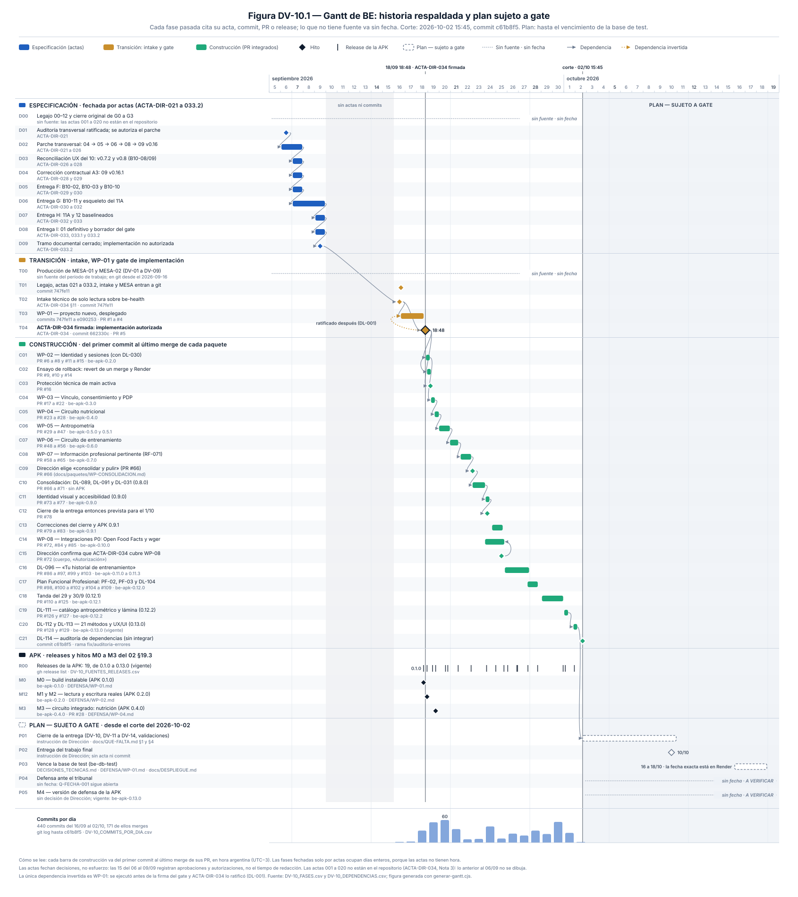

# DV-10 · Gantt de BE — historia respaldada y plan sujeto a gate

> **Entregable:** punto 10 de `Entregables.pdf` (no versionado: ver `docs/fuente_escolar/LEEME.md`).
> **Norma:** `docs/mesa/MESA_02/NORMAS/BE_MESA_02_ESTANDAR_DE_CALIDAD_POR_ENTREGABLE_2026-09-11.md`, apartado DV-10 y checklist §6.
> **Corte:** 2026-10-02 15:45 (hora argentina), commit `c61b8f5`, rama `fix/auditoria-errores`.
> **Fuentes:** las actas de `docs/actas/`, la historia de git y los PR integrados y releases de GitHub, consultados en modo lectura (`git log`, `gh pr list --state merged`, `gh release list`).
> **Qué no hace:** no modifica el legajo ni los demás entregables. No compromete funciones que Dirección no decidió.

La nota de una página para el tribunal está en [`NOTA_METODOLOGICA_DV-10.md`](NOTA_METODOLOGICA_DV-10.md).

---

## 1. Cómo se lee

- **Dos tramos.**
  - La **historia** va en barras y hitos llenos, con un color por grupo: especificación, transición y construcción.
  - El **plan** va con borde punteado, sobre una banda gris, con el rótulo **«PLAN — SUJETO A GATE»**. Empieza en el corte del 2026-10-02.
- **Regla de fuente.** Cada barra o hito pasado cita al menos una de estas fuentes:
  - un acta de `docs/actas/`, con la fecha en el nombre del archivo y en el texto;
  - un commit;
  - un PR integrado;
  - un release.

  Lo que no tiene fuente va como «sin fuente · sin fecha» o figura en la tabla de omisiones (§9). Ninguna fecha pasada sale de la memoria ni de una estimación.
- **Hora argentina (UTC−3).** `gh` devuelve las horas en UTC y acá se convierten. Por ejemplo, el PR #6 figura integrado el 2026-09-19T01:12Z, que en Buenos Aires es el 2026-09-18 a las 22:12. Algunos documentos del repositorio usan la fecha UTC: `docs/DESPLIEGUE.md` fecha el ensayo de rollback el 2026-09-19, y en hora argentina fue el 18.
- **Extremos de cada barra.**
  - Una fase de construcción va del primer commit de sus PR hasta el último merge.
  - Una fase fechada solo por actas ocupa días enteros, porque las actas no tienen hora.
  - Un hito con hora (columna `hora` del CSV) se ubica en el minuto de su fuente. Si no tiene hora, va a mitad del día.
- **Qué fechan las actas.** Fechan decisiones, no esfuerzo: registran aprobaciones y autorizaciones, no cuánto llevó redactar cada documento.
- **Qué fecha git.** Git fecha publicaciones. Las actas 021 a 033.2 entraron a git juntas el 2026-09-16 (commit `747fe11`): git prueba que ya existían ese día y que no cambiaron desde entonces (`docs/MANIFEST.sha256`). La fecha de cada acta es la que declara ella misma.

## 2. Archivos

| Archivo | Qué es |
|---|---|
| `DV-10_GANTT.svg` | La figura DV-10.1. Cada marca lleva un `<title>` con fase, fechas, fuente y estado, que el navegador muestra al pasar el puntero |
| `DV-10_FASES.csv` | La tabla anexa completa: fase, fechas, fuente y estado, más las columnas que verifica el generador (`actas`, `prs`, `commits`, `releases`, `citas`) |
| `DV-10_DEPENDENCIAS.csv` | Las 27 dependencias, cada una con su fuente |
| `DV-10_FUENTES_PR.csv` | Los 129 PR integrados al corte: primer commit, integración y forma del merge |
| `DV-10_FUENTES_RELEASES.csv` | Los 19 releases de la APK, con hora de publicación y commit del tag |
| `DV-10_COMMITS_POR_DIA.csv` | Commits por día hasta el corte (440, de los cuales 171 son merges) |
| `DV-10_VERIFICACION.txt` | El resultado de cada control falsable, uno por línea |
| `capturar-fuentes-git.cjs` | Vuelve a capturar las tres fuentes anteriores, con `git` y `gh` en modo lectura. Con el mismo corte da lo mismo, salvo la columna `latest_al_capturar`, que cambia si se publica otra APK |
| `generar-gantt.cjs` | Lee los CSV, verifica cada fuente y escribe la figura, la verificación y las tablas de este documento. No tiene dependencias |
| `NOTA_METODOLOGICA_DV-10.md` | La nota de una página para el tribunal |

Para regenerar todo, desde la raíz del repositorio (los dos scripts andan con Node 20 o 22):

```bash
node docs/mesa/MESA_02/DV-10/capturar-fuentes-git.cjs   # opcional: vuelve a leer git y GitHub
node docs/mesa/MESA_02/DV-10/generar-gantt.cjs          # figura, verificación y tablas; sale con 1 si algo falla
```

## 3. La figura



Lo que hay que mirar primero:
1. **Las tres franjas de la historia.**
   - Especificación: del 06 al 09/09, quince actas.
   - Transición: del 16 al 18/09, con el intake, WP-01 y el gate.
   - Construcción: del 18/09 al 02/10, con un paquete detrás de otro y una APK por paquete.
2. **La línea vertical del 18/09 a las 18:48.** Es ACTA-DIR-034: separa lo especificado de lo construido. La definición de WP-02 entra a git a las 20:05 del mismo día.
3. **La única flecha punteada ámbar.** WP-01 se ejecutó antes de la firma y el acta lo ratificó (DL-001).
4. **El hueco gris del 10 al 15/09.** No hay actas ni commits.
5. **El plan.** Dos fechas fijas (la entrega del 10/10 y el vencimiento de la base entre el 16 y el 18/10) y dos incógnitas (la defensa y la versión de defensa de la APK).

## 4. Tabla anexa: fase → fechas → fuente → estado

La misma tabla, con las columnas que verifica el generador, está en `DV-10_FASES.csv`.

<!-- generado:tabla-fases:inicio -->
| ID | Tramo | Fase | Fechas | Fuente | Estado |
|---|---|---|---|---|---|
| D00 | historia | Elaboración del legajo 00–12 hasta el 2026-09-05 y cierre original de los gates G0 a G3 (00 §8; 02 §18) | sin fecha | Sin fuente admitida. Las actas ACTA-DIR-001 a 020 que lo aprobaron no están en el repositorio (ACTA-DIR-034 §14, Nota 3). Los encabezados del legajo declaran fechas (00: 2026-07-18; 02 y 03: 2026-07-27; 07 v0.1.11: 2026-08-29), pero no son actas ni commits | sin fuente · sin fecha |
| D01 | historia | Ratificación de la Auditoría de Impacto Transversal v0.2.1 y autorización del parche documental (CAP-MET, CAP-DAT, ANT-DRAFT, ANT-VOID) | 2026-09-06 | ACTA-DIR-021 (2026-09-06), §2 a §6 | ratificada |
| D02 | historia | Parche transversal del legajo: BE-LEG-04 v0.4.2.1, 05 v0.15, 06 v0.1.1, 08 v0.1.5 y 09 v0.16, cada uno contrarrevisado y aprobado documentalmente | 2026-09-06 → 2026-09-07 | ACTA-DIR-021 (autoriza, 2026-09-06) y ACTA-DIR-022 a 026 (aprueban 04, 05, 06, 08 y 09 v0.16, 2026-09-07) | aprobado documentalmente |
| D03 | historia | BE-LEG-10 v0.7.2 (reconciliación transversal UX) y v0.8 (cartera, dashboard, timeline, coordinación y proyecciones) | 2026-09-07 | ACTA-DIR-026 (autoriza v0.7.2), ACTA-DIR-027 (aprueba v0.7.2 y autoriza v0.8) y ACTA-DIR-028 (aprueba v0.8), todas del 2026-09-07 | aprobado documentalmente |
| D04 | historia | Hallazgo H-09-10-A3-01 (faltaban las operaciones de A3) y corrección aditiva BE-LEG-09 v0.16.1: API-CON-05 a 08, de 118 a 122 operaciones P0 | 2026-09-07 | ACTA-DIR-028 §2 a §4 (hallazgo y autorización) y ACTA-DIR-029 §1 (aprobación), 2026-09-07 | aprobado documentalmente |
| D05 | historia | Entrega F del 10: acceso, onboarding y cuenta; profesional, verificación y administración; accesibilidad, copy y responsive | 2026-09-07 | ACTA-DIR-029 §4 (autoriza) y ACTA-DIR-030 §1 (aprueba), 2026-09-07 | aprobada documentalmente |
| D06 | historia | Entrega G: convergencia de prototipos B10-11 y esqueleto del 11A, con la corrección menor de trazabilidad de RF-069 (H-10-G-RF069-01) | 2026-09-07 → 2026-09-09 | ACTA-DIR-030 (autoriza, 2026-09-07), ACTA-DIR-031 (devuelve por RF-069, 2026-09-07) y ACTA-DIR-032 (aprueba, emitida el 2026-09-09) | aprobada documentalmente |
| D07 | historia | Entrega H: plan y estrategia de pruebas (11A v1.0-H) y trazabilidad y control de calidad (12 v1.0-H), baselineados | 2026-09-09 | ACTA-DIR-032 §4 (autoriza) y ACTA-DIR-033 §2 (aprueba y baselinea), 2026-09-09 | aprobada y baselineada |
| D08 | historia | Entrega I: BE-LEG-01 v1.0-I y paquete de gate de implementación (borrador de ACTA-DIR-034 v0.1.1, con MENOR-01 de rollback) | 2026-09-09 | ACTA-DIR-033 §4 (autoriza), ACTA-DIR-033.1 (MENOR-01) y ACTA-DIR-033.2 §3 (aprueba), 2026-09-09 | aprobada documentalmente |
| D09 | historia | Cierre del tramo documental pre-implementación: gate documental para construcción satisfecho, implementación no autorizada | 2026-09-09 | ACTA-DIR-033.2 §6 y §11 (2026-09-09) | cerrado |
| T00 | historia | Matriz de cobertura MESA-01, estándar de calidad y entregables DV-01 a DV-09 de MESA-02 | sin fecha | Sin acta ni commit del período de trabajo. Los nombres de archivo llevan 2026-09-10 y 2026-09-11, pero no son actas. Todo entró a git el 2026-09-16 (747fe11) | sin fuente · sin fecha |
| T01 | historia | Primer commit del repositorio: legajo 00–12, actas ACTA-DIR-021 a 033.2 con el borrador del gate, intake y MESA-01/02, verificados por SHA-256 | 2026-09-16 15:04 | commit 747fe11 (2026-09-16 15:04) | publicado; se verifica en cada push contra docs/MANIFEST.sha256 |
| T02 | historia | Intake técnico de solo lectura sobre el repositorio anterior be-health: 0 coincidencias exactas de schema y 21 conflictos estructurales; Dirección decide no usarlo como base | 2026-09-16 | ACTA-DIR-034 §11 («EJECUTADO 2026-09-16»); docs/intake/INTAKE_01.md, en git desde 747fe11 | ejecutado |
| T03 | historia | WP-01: monorepo nuevo con API /health, website y APK placeholder, CI/CD y despliegue en Render; ejecutado por orden de Dirección antes de la firma del gate (DL-001) | 2026-09-16 → 2026-09-18 | Commits 747fe11 (2026-09-16) a e090253 (PR #4, 2026-09-18); release be-apk-0.1.0; ACTA-DIR-034 §14, Nota 2 | cumplido; ratificado por ACTA-DIR-034 |
| T04 | historia | Gate de implementación: ACTA-DIR-034 v1.0 firmada; autoriza WP-01 a WP-07, cada uno con su definición por IDs antes del primer commit | 2026-09-18 18:48 | ACTA-DIR-034 v1.0 (2026-09-18); commit 662330c (18:48) y PR #5 (18:50) | firmada |
| C01 | historia | WP-02 · Identidad y sesiones: registro con A1 y A2 separados, login neutral, cuenta y cierre; incluye DL-030 (el website llama a la API directo, con CORS, para que la API vea la IP real) | 2026-09-18 → 2026-09-19 | PR #6 a #8 y #11 a #15 (definición b9242a3, 2026-09-18 20:05; último merge 2026-09-19 01:43); release be-apk-0.2.0 | integrado en main |
| C02 | historia | Ensayo de rollback exigido por ACTA-DIR-034 §12: git revert -m 1 de un merge publicado (PR #9 y #10) y rollback de be-api en Render (parte 2, registrada en el PR #14) | 2026-09-18 → 2026-09-19 | PR #9 y #10 (2026-09-18 22:29 y 22:34) y PR #14 (2026-09-19 01:24); EVIDENCIA/ENSAYO-ROLLBACK/ | ejecutado (partes 1 y 2) |
| C03 | historia | Protección de main: PR obligatorio, cuatro checks de CI y rama al día, sin excepción para administradores (pendiente en ACTA-DIR-034 §5) | 2026-09-19 05:37 | PR #16 (2026-09-19 05:37); docs/DESPLIEGUE.md, «Rollback» | activa |
| C04 | historia | WP-03 · Vínculo, consentimiento y PDP: solicitud y aceptación del vínculo por alcance, consentimiento B2 por finalidad y punto único de decisión de autorización | 2026-09-19 | PR #17 (definición, 06:55) a #22 (13:06), 2026-09-19; release be-apk-0.3.0 | integrado en main |
| C05 | historia | WP-04 · Circuito nutricional: plan del profesional en el website, registro de comidas del asesorado en la APK y revisión, con versiones inmutables | 2026-09-19 | PR #23 (definición, 14:51) a #28 (capturas del APK en Android, 23:24), 2026-09-19; release be-apk-0.4.0 | integrado en main |
| C06 | historia | WP-05 · Antropometría: evaluación en preparación y registrada, corrección y anulación de mediciones (anulada ≠ borrada), evolución, métodos versionados y cálculo reproducible | 2026-09-19 → 2026-09-20 | PR #29 (definición, 2026-09-19 23:59) a #47 (2026-09-20 22:42); releases be-apk-0.5.0 y be-apk-0.5.1 | integrado en main |
| C07 | historia | WP-06 · Circuito de entrenamiento: evaluación, objetivo, catálogo, plan con validación y activación, ejecución y revisión (26 operaciones) | 2026-09-20 → 2026-09-21 | PR #48 (definición, 2026-09-20 23:11) a #56 (2026-09-21 16:22); release be-apk-0.6.0 | integrado en main |
| C08 | historia | WP-07 · Información profesional pertinente (RF-071): plantillas, solicitudes y respuestas autoinformadas (API-FRM-01 a 08) | 2026-09-21 → 2026-09-22 | PR #58 (definición, 2026-09-21 21:35) a #65 (2026-09-22 19:49); release be-apk-0.7.0 | integrado en main |
| C09 | historia | Decisión de Dirección del 2026-09-22: consolidar y pulir hasta la entrega en lugar de abrir WP-08, WP-09 y WP-10 | 2026-09-22 22:48 | docs/paquetes/WP-CONSOLIDACION.md, registrada en el primer commit del PR #66 (2026-09-22 22:48) | decidida |
| C10 | historia | Consolidación: historia propia del asesorado en entrenamiento (DL-089), nutrición y antropometría en website y APK (DL-091) y contenido factual del dashboard (DL-031); versión 0.8.0, sin APK propia | 2026-09-22 → 2026-09-24 | PR #66 (2026-09-22 22:48) a #71 (2026-09-24 01:14) | integrado en main |
| C11 | historia | Identidad visual y accesibilidad: tokens verificados, cara pública, espacio profesional, APK oscura y figura antropométrica; versión 0.9.0 | 2026-09-24 | PR #73 (definición, 03:34) a #77 (05:31), 2026-09-24; release be-apk-0.9.0 | integrado en main |
| C12 | historia | Cierre de la entrega entonces prevista para el 2026-10-01: evidencia, guía de demo, capturas y despliegue al día | 2026-09-24 06:01 | PR #78 (2026-09-24 06:01) | cerrado; la entrega se movió después al 2026-10-10 |
| C13 | historia | Correcciones posteriores a la revisión de cierre (registrar guarda antes, resumen vigente del dashboard, guía de capturas) y APK 0.9.1 (formularios: Sí/No se elige) | 2026-09-24 → 2026-09-25 | PR #79 (2026-09-24) a #83 (2026-09-25 14:34); release be-apk-0.9.1 | integrado en main |
| C14 | historia | WP-08 · Integraciones P0: importación controlada desde Open Food Facts (RF-028) y wger (RF-038), con procedencia conservada y respaldo ante caída del proveedor | 2026-09-24 → 2026-09-25 | PR #72 (primer commit 2026-09-24 01:20, merge 2026-09-25 17:08), #84 y #85; release be-apk-0.10.0 | integrado en main |
| C15 | historia | Dirección confirma, en el PR #72, que la autorización de ACTA-DIR-034 cubre WP-08; recién entonces se integra | 2026-09-25 | PR #72, sección «Autorización» del cuerpo: «Dirección confirmó el 2026-09-25…» (gh pr view 72) | confirmada |
| C16 | historia | DL-096 · «Tu historial de entrenamiento»: el asesorado ve sus planes y ejecuciones históricas desde la APK; correcciones de la validación en teléfono (0.11.1 a 0.11.3) | 2026-09-25 → 2026-09-27 | PR #86 (primer commit 2026-09-25 19:13) a #103 (2026-09-27 22:28); releases be-apk-0.11.0 a 0.11.3 | integrado en main |
| C17 | historia | Plan Funcional Profesional: propuesta PF-01/PF-02, plantilla de antecedentes y citas en la evaluación (PF-02), lo planificado completo (PF-03, incremento 1) y errores por campo (DL-104); APK 0.12.0 | 2026-09-27 → 2026-09-28 | PR #98 (primer commit 2026-09-27 19:15) a #109 (2026-09-28 16:49); release be-apk-0.12.0 | integrado en main |
| C18 | historia | Tanda del 29 y 30/9: correcciones de series y formularios, comparación planificado/registrado, evolución antropométrica visual, apariencia del website, cartera, plantillas, «Mis habituales» y temas de la APK; APK 0.12.1 | 2026-09-29 → 2026-09-30 | PR #110 (primer commit 2026-09-29 01:41) a #125 (2026-09-30 22:42); release be-apk-0.12.1 | integrado en main |
| C19 | historia | DL-111 · Catálogo antropométrico de BE con 40 métodos, lámina del compositor en el website y figura con resultados en la APK 0.12.2 | 2026-10-01 | PR #126 (primer commit 00:59, merge 02:46) y #127 (03:19), 2026-10-01; release be-apk-0.12.2 | integrado en main |
| C20 | historia | DL-112 y DL-113 · Purga del catálogo a 21 métodos vigentes y UX/UI del website y de la APK (barra inferior, figura en SVG, menos texto); APK 0.13.0, la vigente | 2026-10-01 | PR #128 (primer commit 20:32, merge 21:51) y #129 (22:33), 2026-10-01; release be-apk-0.13.0 | integrado en main |
| C21 | historia | DL-114 · La auditoría de dependencias deja de aprobar con un informe ilegible o un error de npm; commit en la rama fix/auditoria-errores, sin integrar al corte | 2026-10-02 15:45 | commit c61b8f5 (2026-10-02 15:45), rama fix/auditoria-errores | en curso, sin integrar |
| R00 | historia | Releases permanentes de la APK en GitHub, de be-apk-0.1.0 a be-apk-0.13.0 (la 0.8.0 no tuvo APK) | 2026-09-18 → 2026-10-01 | gh release list (19 releases); DV-10_FUENTES_RELEASES.csv | publicadas; la vigente es be-apk-0.13.0 |
| M0 | historia | M0 de 02 §19.3, build instalable: la APK 0.1.0 se publicó y Dirección la instaló y abrió en un Android físico | 2026-09-18 14:57 | Release be-apk-0.1.0 (2026-09-18 14:57); DEFENSA/WP-01.md (instalada el 2026-09-18); fotos del teléfono en el PR #16 | cumplido |
| M12 | historia | M1 y M2 de 02 §19.3: la APK 0.2.0, en el Android de Dirección, crea una cuenta en la API de test (escritura) y lee su estado y A3 (lectura). Real quiere decir contra la API desplegada, siempre con datos sintéticos | 2026-09-18 22:24 | Release be-apk-0.2.0 (2026-09-18 22:24); DEFENSA/WP-02.md (prueba en el teléfono, 2026-09-18 de 23:49 a 23:54); capturas en el PR #14 | cumplido |
| M3 | historia | M3 de 02 §19.3: circuito nutricional de punta a punta (website del profesional, APK del asesorado y revisión), con 11 capturas en un Android real | 2026-09-19 16:34 | Release be-apk-0.4.0 (2026-09-19 16:34); DEFENSA/WP-04.md; capturas en el PR #28 (23:24) | cumplido |
| P01 | plan | Cierre de la entrega: DV-10 y DV-11 a DV-14 al día, validación en el teléfono de las APK 0.12.0 a 0.13.0 y ratificaciones que esperan a Dirección (DL-111, DL-112 y DL-113) | 2026-10-02 → 2026-10-10 | Instrucción de Dirección (entrega el 2026-10-10); pendientes en docs/QUE-FALTA.md §1 y §4 | PLAN — SUJETO A GATE |
| P02 | plan | Entrega del trabajo final a la escuela | 2026-10-10 | Instrucción de Dirección. Sin acta ni commit: el repositorio todavía dice 2026-10-01 (README.md y EVIDENCIA/ENTREGA/LEEME.md) | PLAN — SUJETO A GATE · fecha a registrar |
| P03 | plan | La base de datos gratuita de Render que usa el ambiente test vence entre el 16 y el 18/10; después hay 14 días de gracia | 2026-10-16 → 2026-10-18 | Tres estimaciones en el repositorio: DECISIONES_TECNICAS.md §3 (~2026-10-16), DEFENSA/WP-01.md (≈ 2026-10-17) y docs/DESPLIEGUE.md (cerca del 2026-10-18); la fecha exacta está en el dashboard de Render | A VERIFICAR (rango) |
| P04 | plan | Defensa del trabajo final ante el tribunal | sin fecha · A VERIFICAR | Sin fecha en el repositorio. La pregunta Q-FECHA-001 (02 §20) sigue abierta para la defensa | A VERIFICAR |
| P05 | plan | M4 de 02 §19.3: versión de defensa de la APK | sin fecha · A VERIFICAR | Sin decisión de Dirección. La vigente es be-apk-0.13.0, publicada y todavía sin validar en el teléfono | A VERIFICAR |
<!-- generado:tabla-fases:fin -->

## 5. Hitos

### 5.1 Gates G0 a G6

El estándar pide «hitos G0–G3». Los gates están definidos en el legajo: el 00 §8 los define con su clausura y el 02 §18 repite los nombres. Lo que falta es la fecha de cierre de los cuatro primeros con una fuente del repositorio.

| Gate | Definición (00 §8) | Qué dicen las fuentes del repositorio | En el Gantt |
|---|---|---|---|
| **G0** · Gobierno operativo | 00 aprobado | El 00 se declara «APROBADO», con fecha 2026-07-18 en su encabezado. El acta que lo aprobó no está en el repositorio | Sin fecha (D00) |
| **G1** · Producto definido | 02 y 03 aprobados; Q-000, Q-001, Q-009 y Q-010 resueltas | El 02 y el 03 declaran aprobación el 2026-07-27, sin acta en el repositorio | Sin fecha (D00) |
| **G2** · Comportamiento definido | 04 y 05 aprobados; plan de reclutamiento; Q-002 y Q-006 resueltas | El 04 dice «G2 — cerrado en la baseline». Las baselines (04 v0.4.1, 05 v0.14) no tienen acta en el repositorio. Las versiones parchadas se aprobaron el 2026-09-07 (ACTA-DIR-022 y 023) | Sin fecha de cierre. El parche está en D02 |
| **G3** · Fundamentos definidos | 06 y 08 aprobados | El 07 dice «`G3` quedó CERRADO Y REGULARIZADO por `ACTA-DIR-019`», y esa acta no está en el repositorio. Los parches del 06 y el 08 se aprobaron el 2026-09-07 (ACTA-DIR-024 y 025) | Sin fecha de cierre. El parche está en D02 |
| **G4** · Solución diseñada | 07, 09 y 10 aprobados; validación inicial con usuarios; Q-002 y Q-006 confirmadas | El 07 se declara ratificado el 2026-08-29, sin acta en el repositorio. El 09 v0.16.1 se aprobó el 2026-09-07 (ACTA-DIR-029) y el 10 se cerró el 2026-09-09 (ACTA-DIR-032 §8 y ACTA-DIR-033.2 §5). **Ninguna acta del repositorio declara cerrado G4 ni registra la validación inicial con usuarios** | No se dibuja como hito |
| **G5** · Implementación verificable autorizada (en el 02: «Verificación preparada») | 11A y estructura de 12 baselineadas | ACTA-DIR-033 §3 (2026-09-09): «queda satisfecha la condición documental necesaria para preparar el gate de implementación verificable». ACTA-DIR-033.2 §6 aclara que eso no equivale a una implementación autorizada, que llegó con ACTA-DIR-034 el 2026-09-18. **Las actas no usan el nombre G5:** la correspondencia es de este DV-10 | D09 (condición documental) y T04 (autorización) |
| **G6** · Cierre y aceptación | 11B, 01 y 12 completos; evidencia y trazabilidad cerradas | No alcanzado: ACTA-DIR-033.2 §4 lo excluye expresamente. La entrega del 10/10 no equivale a G6 | Sin fecha: Dirección no la planificó |

### 5.2 Hitos de la APK, M0 a M4 (02 §19.3): previsto contra ocurrido

El 02 §19.3 nombra los hitos sin definirlos ni fecharlos, y el RSK-006 pide «alcanzar M0 y M1 tempranamente». El criterio de cada fila es de este DV-10. «Real» quiere decir contra la API desplegada en `test`, siempre con datos sintéticos: los datos reales siguen sin autorizar (ACTA-DIR-034 §4).

| Hito | Criterio usado acá | Ocurrido | Fuente | Estado |
|---|---|---|---|---|
| **M0** · build instalable | Una APK publicada que se instala y abre en un Android físico | APK 0.1.0, publicada el 2026-09-18 a las 14:57 e instalada por Dirección ese día | release `be-apk-0.1.0` · `DEFENSA/WP-01.md` · fotos en el PR #16 | cumplido |
| **M1** · lectura real | La APK instalada lee datos de la API desplegada | APK 0.2.0, en el Android de Dirección, muestra el estado de la cuenta y A3 «No otorgado», el 2026-09-18 entre las 23:49 y las 23:54 | release `be-apk-0.2.0` · `DEFENSA/WP-02.md` · capturas en el PR #14 | cumplido |
| **M2** · escritura real | La APK instalada escribe en la API desplegada | En la misma prueba crea una cuenta con A1 y A2 separados | ídem | cumplido |
| **M3** · circuito integrado | El circuito nutricional cerrado del 00 §11 (Q-000), con la APK como canal del asesorado | Website del profesional, APK 0.4.0 del asesorado y revisión, con 11 capturas en un Android real el 2026-09-19 | release `be-apk-0.4.0` · `DEFENSA/WP-04.md` · PR #28 | cumplido |
| **M4** · versión de defensa | La versión que Dirección congele para la defensa | Sin decisión. La vigente es `be-apk-0.13.0`, publicada el 2026-10-01 y todavía sin validar en el teléfono | `EVIDENCIA/PUBLICACION-0.13.0/LEEME.md` | **A VERIFICAR** |

Los hitos M0 a M2 se alcanzaron el tercer día de la construcción (primer commit: 2026-09-16) y M3 al día siguiente.

### 5.3 M5 a M9

El estándar nombra «M0–M9», pero el legajo solo define M0 a M4 (02 §19.3). Ni el legajo ni las actas definen M5 a M9: una búsqueda en `docs/` no los encuentra fuera del propio estándar. No se inventan.

## 6. Comparación con la planificación original

| # | Qué se planificó | Qué pasó | Lectura |
|---|---|---|---|
| 1 | El roadmap completo, de G0 a G6, contra una fecha objetivo interna del **2026-08-27**, con reserva hasta el 31/08. «No constituye una fecha institucional confirmada» (02 §18.2) | El tramo documental cerró el **2026-09-09** (ACTA-DIR-033.2), la construcción empezó el **2026-09-16** (`747fe11`) y la entrega quedó para el **2026-10-10** por decisión de Dirección | **Desviado.** Lo que muestran las actas del último tramo: la auditoría del 2026-09-06 reabrió en cadena 04 → 05 → 06 → 08 → 09 → 10 (ACTA-DIR-021), y aparecieron dos hallazgos que hubo que corregir antes de cerrar (ACTA-DIR-028 y 031). Lo ocurrido entre el 27/08 y el 06/09 no tiene actas en el repositorio |
| 2 | Presupuesto documental de 35 a 37 sesiones (27 de documentos, 4 de reserva y 4 a 6 experimentales), con horizonte nominal de 5 semanas y 6 con contingencia (00 §7.4) | No hay registro de sesiones. Si se toma la fecha que declara el 00 (2026-07-18), el tramo documental duró 53 días, unas 7,6 semanas, hasta el 2026-09-09 | **Desviado, con salvedad:** la fecha de inicio es la declarada en el encabezado del 00, sin acta |
| 3 | Convergencia del código existente: clasificar cada módulo como preservar, refactorizar, reemplazar o retirar (02 §19.1), con el supuesto de «recuperación parcial del código existente» (02 §20) | El intake del 2026-09-16 encontró 0 coincidencias exactas de schema y 21 conflictos estructurales, y Dirección decidió no usar `be-health` como base (ACTA-DIR-034 §11) | **Desviado, con fundamento:** reemplazo total por un proyecto nuevo (WP-01) |
| 4 | Nutrición como primer circuito (02 §19.2; DEC-002 del 00) | WP-04, el circuito nutricional, fue el primer dominio, el 2026-09-19, antes de antropometría (WP-05) y entrenamiento (WP-06) | **Cumplido** |
| 5 | APK temprana: M0 y M1 tempranamente (02 §19.3; RSK-006) | M0 a M2 el 2026-09-18, tercer día de la construcción; M3 el 2026-09-19 | **Cumplido** |
| 6 | Confirmar antes del Gantt definitivo: fecha de entrega, fecha de defensa, plazo de revisión del tutor, fecha límite para pedir mesa y requisito de APIs externas (02 §18.2; Q-FECHA-001 y Q-API-001 en el 02 §20) | Entrega: 2026-10-10 por instrucción de Dirección, pero el repositorio todavía dice 2026-10-01 (`README.md`, `EVIDENCIA/ENTREGA/LEEME.md`). Defensa, plazo del tutor y límite para pedir mesa: sin dato. APIs externas: el 04 fija dos (Open Food Facts y wger), implementadas en WP-08 (PR #72, 2026-09-25) | **Parcial.** Defensa, plazo del tutor y límite de mesa quedan **A VERIFICAR** |
| 7 | MVP con las dos verticales completas (02 §19.2) y el alcance del 02 §11, que incluye administración mínima (§11.2) | Al corte faltan 22 de las 122 operaciones P0 del 09 (`docs/QUE-FALTA.md` §2). Entre ellas están el alta y la verificación de profesionales con rol administrador (WP-09) y el resto del seguimiento profesional (WP-10). El 2026-09-22 Dirección eligió consolidar en lugar de abrir WP-08, WP-09 y WP-10 (`docs/paquetes/WP-CONSOLIDACION.md`); WP-08 se hizo igual, con su confirmación del 2026-09-25 | **Desviado por decisión de Dirección**, declarado en el repositorio |
| 8 | Entrega el 2026-10-01 (`README.md`; `EVIDENCIA/ENTREGA/LEEME.md`; `docs/paquetes/WP-CONSOLIDACION.md`) | Pasó al 2026-10-10 por decisión de Dirección | **Desviado.** Falta registrar el cambio en el repositorio (§11) |

## 7. Dependencias

Una dependencia **FS** dice que la fase de destino no podía empezar antes de que terminara la de origen. **SS** compara los dos comienzos y **FF** los dos finales. **INVERTIDA** marca una dependencia que no se respetó y se regularizó después.

`generar-gantt.cjs` comprueba cada una con las fechas de sus fuentes: usa minutos si las dos puntas los tienen y, si no, días. La central es T04 → C01: la implementación no podía empezar antes de ACTA-DIR-034. El acta entra a git a las 18:48 del 2026-09-18 (`662330c`, PR #5 a las 18:50), y la definición de WP-02 a las 20:05 (`b9242a3`).

<!-- generado:tabla-dependencias:inicio -->
| De → a | Tipo | Resultado en las fuentes | Fuente de la dependencia |
|---|---|---|---|
| D01 → D02 | FS | se cumple | ACTA-DIR-021 §4 y §5: autoriza el parche en orden 04 → 05 → 06 → 08 → 09 → 10 → 11A → 12 |
| D02 → D03 | FS | se cumple | ACTA-DIR-026 §3: aprobado el 09 v0.16, se autoriza la reconciliación UX del 10 |
| D03 → D04 | FS | se cumple | ACTA-DIR-028 §2 a §4: al abrir B10-02 aparece el hallazgo H-09-10-A3-01 y se autoriza el 09 v0.16.1 |
| D04 → D05 | FS | se cumple | ACTA-DIR-028 §5 y ACTA-DIR-029 §4: B10-02 y B10-03 no cierran hasta aprobar el 09 v0.16.1 |
| D05 → D06 | FS | se cumple | ACTA-DIR-030 §2: aprobada la Entrega F, se autoriza la G |
| D06 → D07 | FS | se cumple | ACTA-DIR-032 §4: aprobada la Entrega G, se autoriza la H |
| D07 → D08 | FS | se cumple | ACTA-DIR-033 §4: aprobada la Entrega H, se autoriza la I |
| D08 → D09 | FS | se cumple | ACTA-DIR-033.2 §3 y §11: aprobada la Entrega I, se cierra el tramo documental |
| D09 → T02 | FS | se cumple | ACTA-DIR-033.2 §9: la siguiente fase posible es el intake técnico de solo lectura · Entre el 2026-09-10 y el 15 no hay actas ni commits |
| T02 → T03 | FS | se cumple | ACTA-DIR-034 §11: el intake llevó a no usar be-health como base; DEFENSA/WP-01.md: mandato de Dirección del 2026-09-16 |
| T02 → T04 | FS | se cumple | ACTA-DIR-034 §14, Nota 1: el gate se completa con la evidencia del intake del 2026-09-16 |
| T04 → T03 | INVERTIDA | invertida, como se declaró | ACTA-DIR-034 §14, Nota 2, y docs/DEUDA_LEGAJO.md DL-001: WP-01 se ejecutó antes de la firma y el acta lo ratificó · Es la única dependencia que no se respetó; se declaró y se regularizó |
| T04 → C01 | FS | se cumple | ACTA-DIR-034 §3: implementación autorizada de WP-01 a WP-07, cada paquete con su definición por IDs antes del primer commit · El acta entra a git a las 18:48 y la definición de WP-02 (b9242a3) a las 20:05 del mismo día |
| C01 → C02 | SS | se cumple | ACTA-DIR-034 §12: el ensayo de rollback va después del primer merge de WP-02 y antes de cerrarlo · Primer merge de WP-02: PR #7, 21:38; ensayo: PR #9, 22:25; cierre de WP-02: PR #15, 01:43 |
| T04 → C03 | FS | se cumple | ACTA-DIR-034 §5: la protección técnica de main queda pendiente, con plan |
| C01 → C04 | FS | se cumple | docs/paquetes/WP-03.md: WP-03 reutiliza piezas de WP-02 (T-06-23, T-06-24 y T-06-N08) |
| C04 → C05 | FS | se cumple | docs/paquetes/WP-04.md: todas las operaciones de nutrición pasan por el PDP de WP-03 |
| C05 → C06 | FS | se cumple | docs/paquetes/WP-04.md, encabezado: al cerrar WP-04, Dirección deja el orden de los dominios al ejecutor; docs/paquetes/WP-05.md reutiliza el patrón de corrección de WP-04 |
| C06 → C07 | FS | se cumple | docs/paquetes/WP-04.md, encabezado: «WP-05 es antropometría y WP-06, entrenamiento»; docs/paquetes/WP-06.md: «la misma cadena que WP-05» |
| C07 → C08 | FS | se cumple | docs/paquetes/WP-07.md: RF-071 lo encontró la auditoría de UX del cierre de WP-06 (DL-090) |
| C08 → C09 | FS | se cumple | docs/paquetes/WP-CONSOLIDACION.md: cerrado WP-07, Dirección elige consolidar en lugar de abrir WP-08, WP-09 y WP-10 |
| C09 → C10 | FS | se cumple | docs/paquetes/WP-CONSOLIDACION.md: «Autorizado por Dirección el 2026-09-22 al elegir “consolidar y pulir”»; el orden de los pasos (cerrar WP-07, consolidar, identidad visual, cierre) está en docs/paquetes/WP-IDENTIDAD-VISUAL.md |
| C10 → C11 | FS | se cumple | docs/paquetes/WP-IDENTIDAD-VISUAL.md: la identidad visual es el paso 3 del plan del 2026-09-22 |
| C11 → C12 | FS | se cumple | EVIDENCIA/ENTREGA/LEEME.md: el cierre de la entrega es el paso 4 del plan del 2026-09-22 |
| C15 → C14 | FF | se cumple | docs/paquetes/WP-08.md (D-A) y PR #72: el código se prepara completo, pero la integración espera la confirmación de Dirección |
| C19 → C20 | FS | se cumple | docs/DEUDA_LEGAJO.md, DL-112: la purga reduce a 21 métodos el catálogo de 40 que dejó DL-111 |
| C20 → P01 | FS | se cumple | docs/DESPLIEGUE.md: la APK 0.13.0 es la vigente, y la demo y las láminas se arman sobre ella |
<!-- generado:tabla-dependencias:fin -->

Otra regla que se puede verificar con los PR: cada paquete de WP-02 a WP-07 empezó con su definición por IDs antes del código, como exige ACTA-DIR-034 §3. Qué se verificó en `DV-10_FUENTES_PR.csv`:
- WP-02: el commit de definición `b9242a3` (20:05) es anterior al primer commit de código `ca67c5c` (20:44).
- WP-03 a WP-07: el PR de definición se integró antes del primer commit del primer PR de código (#17 → #19, #23 → #24, #29 → #30, #48 → #49, #58 → #59).

WP-08 llevó la definición y el código en el mismo PR, a propósito (`docs/paquetes/WP-08.md`, D-A).

## 8. Plan — sujeto a gate (desde el 2026-10-02)

| ID | Qué | Cuándo | Fuente | Qué no compromete |
|---|---|---|---|---|
| P01 | Cierre de la entrega. Incluye este DV-10, DV-11 a DV-14 al día, la validación en el teléfono de las APK 0.12.0 a 0.13.0 y las ratificaciones que esperan a Dirección (DL-111, DL-112 y DL-113) | del 2026-10-02 al 2026-10-10 | instrucción de Dirección; `docs/QUE-FALTA.md` §1 y §4 | Ninguna función nueva. Solo se cierra lo integrado y lo que Dirección tiene que validar o ratificar |
| P02 | Entrega del trabajo final | 2026-10-10 | instrucción de Dirección; **sin acta ni commit** | — |
| P03 | Vence la base `be-db-test` del plan gratuito de Render | entre el 2026-10-16 y el 18, **A VERIFICAR**. Hay tres estimaciones en el repositorio: ~16/10 (`DECISIONES_TECNICAS.md`), ≈ 17/10 (`DEFENSA/WP-01.md`) y cerca del 18/10 (`docs/DESPLIEGUE.md`). La fecha exacta está en el dashboard de Render | ver columna anterior | Después hay 14 días de gracia. Si la defensa es posterior al vencimiento, hay que pasar la base a un plan pago o recrearla. Recrearla obliga a volver a registrar las cuentas demo, a un PR de configuración y a rehacer el escenario (`docs/DESPLIEGUE.md`, «Límites del plan gratuito») |
| P04 | Defensa ante el tribunal | **A VERIFICAR** | Q-FECHA-001 (02 §20) sigue abierta | — |
| P05 | M4, la versión de defensa de la APK | **A VERIFICAR** | sin decisión de Dirección | — |

Quedan fuera del plan, porque Dirección no los decidió: WP-09 (alta y verificación de profesionales con rol administrador), el resto de WP-10 y cualquier otra función de `docs/QUE-FALTA.md` §2 y §3. G6 tampoco se planifica.

Una fecha más, fuera del eje de la figura: la excepción de auditoría de dependencias de DL-114 vence el 2026-10-31, y es provisoria y a ratificar (`docs/DEUDA_LEGAJO.md`).

## 9. Omisiones

| # | Qué no se dibuja (o se dibuja sin fecha) | Por qué | Lo que se sabe y dónde |
|---|---|---|---|
| 1 | La elaboración del legajo 00–12 y el cierre original de G0 a G3 (fila D00) | Las actas que lo aprobaron no están en el repositorio. El legajo y las actas presentes citan ACTA-DIR-006 a 011 y 013 a 020, y ninguna está (ACTA-DIR-034 §14, Nota 3) | Fechas que declaran los encabezados, **sin acta ni commit**: 00, 2026-07-18; 02 y 03, 2026-07-27; baseline del 06, 2026-08-16; 08 v0.1.4, 2026-08-21; 07 v0.1.11, 2026-08-29; fragmentos del 09 v0.7 a v0.13 y v0.15, 2026-08-31 |
| 2 | La producción de MESA-01 y MESA-02 (fila T00) | No hay acta ni commit del período de trabajo. Los nombres de archivo llevan 2026-09-10 y 2026-09-11, pero no son actas | Todo entró a git el 2026-09-16 (`747fe11`) |
| 3 | Del 2026-09-10 al 2026-09-15 | Sin actas ni commits: no se puede afirmar qué se hizo | Banda gris en la figura |
| 4 | Los PR de WP-01 del 16 y 17/09 | Están en el repositorio anterior, archivado como `be-archivo-wp01` (`docs/DESPLIEGUE.md`, «Historia del Blueprint») | Se citan sus commits (`747fe11` a `e090253`), que siguen en la historia |
| 5 | El PR #57 (favicon del isotipo, 2026-09-21) | Cambio menor fuera de paquete, que no altera ninguna fase. `generar-gantt.cjs` lo informa como único PR sin fase | `DV-10_FUENTES_PR.csv` |
| 6 | La hora de las decisiones de Dirección (C09, C15 y P02) | No está registrada | C09 va a la hora en que se registró en git; C15 y P02, a mitad del día |
| 7 | El esfuerzo en horas | No hay registro de horas ni de sesiones | El Gantt muestra calendario. Los commits por día son una señal de actividad, no de horas |
| 8 | M5 a M9 | No están definidos en el legajo ni en las actas | §5.3 |
| 9 | El cierre de G4 | Ninguna acta lo declara | §5.1 |

## 10. Verificación falsable

`generar-gantt.cjs` controla esto y escribe cada resultado en `DV-10_VERIFICACION.txt`:

- **Actas.** Cada acta citada existe en `docs/actas/`, y su texto repite la fecha del nombre del archivo.
- **PR.** Cada PR citado está entre los integrados.
- **Commits.** Cada commit citado está en la historia de git; su fecha se lee con `git log`.
- **Releases.** Cada release citado existe.
- **Barras.** Las fechas de cada barra coinciden exactamente con la envolvente de sus fuentes: la más temprana y la más tardía.
- **Hitos.** Cada hito cae dentro de sus fuentes, y su hora, si la tiene, es la de una de ellas.
- **Citas.** Cada cita textual aparece tal cual en el archivo que cita.
- **Plan.** Ninguna fila del plan arranca antes del corte ni se apoya en fuentes pasadas, y todas llevan «PLAN — SUJETO A GATE» o «A VERIFICAR».
- **Dependencias.** Las fechas de las fuentes respetan cada una. La invertida tiene que seguir invertida.
- **Cobertura.** Cada PR integrado tiene fase o se informa.

<!-- generado:verificacion:inicio -->
```text
Fases: 45 (historia fechada 38, historia sin fecha 2, plan 5)
Fases pasadas fechadas con fuente: 38 de 38
Dependencias: 27 (26 se cumplen, 1 invertida declarada, 0 fallan)
PR integrados con fase: 128 de 129 (sin fase: #57)
Controles: 121 OK · 0 FALLA · 1 AVISO
```
<!-- generado:verificacion:fin -->

Lo que se verificó a mano el 2026-10-02, fuera del script:
- **La cita de C15.** Está en el cuerpo del PR #72, sección «Autorización», no en un archivo. Se leyó con `gh pr view 72 --json body`: «Dirección confirmó el 2026-09-25, en este PR, que la autorización de implementación cubre WP-08».
- **Las cifras de la nota metodológica:**
  - **69 RF activos:** 71 IDs distintos en el 04, menos RF-016 y RF-063, retirados según ACTA-DIR-032 §6.
  - **38 RNF:** IDs distintos en el 04.
  - **56 UC:** 33 P, 13 I, 9 E y 1 S, IDs distintos en el 05.
  - **122 operaciones P0:** el inventario `09_AUX/INVENTARIO_API_P0_…_122_OPERACIONES` tiene 124 IDs, y 2 de ellos son P1.
  - **114 deudas** en la tabla de `docs/DEUDA_LEGAJO.md`.
  - **209/209 unidades del 06:** cifra declarada por el propio 06, no recontada.

## 11. Prueba de tribunal

1. **¿Qué pregunta del tribunal responde esta figura?** «¿Cómo usaron el tiempo y qué dependía de qué?». Responde que la construcción no empezó hasta cerrar la especificación y firmar el gate, con una sola excepción declarada: WP-01. También muestra que, después del gate, los seis paquetes centrales (WP-02 a WP-07) entraron en unos cuatro días, cada uno con su APK.
2. **¿Qué pregunta obvia deja sin responder, y dónde está la respuesta?** «¿Qué pasó en los dos meses de documentación anteriores al 06/09?». El repositorio no tiene las actas de ese período. La tabla de omisiones (§9) da las fechas que declaran los encabezados del legajo, marcadas como no verificadas, y la nota metodológica explica lo que se puede afirmar. La segunda pregunta obvia, «¿cuántas horas?», tampoco tiene registro (§9, fila 7).
3. **¿Un analista que no conoce BE puede explicar el proceso desde esta figura en dos minutos?** **Sí.**
   - Tres franjas: una especificación aprobada por actas del 06 al 09/09; una transición con el intake, WP-01 y el gate, del 16 al 18/09; y una construcción por paquetes desde el 18/09, con la APK desde el primer día.
   - Una línea que separa lo especificado de lo construido.
   - Un plan con dos fechas fijas y dos incógnitas.

## 12. Checklist §6 del estándar

| Casilla | Estado | Cómo |
|---|---|---|
| Contenido completo o tabla de omisiones con motivo | ✅ | 45 filas (38 de historia fechada, 2 sin fuente, 5 de plan) y la tabla de omisiones (§9) |
| Cada elemento con fuente exacta en CSV de trazabilidad | ✅ | `DV-10_FASES.csv` y `DV-10_DEPENDENCIAS.csv`; las fuentes de git y GitHub, en los tres CSV de captura |
| Documentación textual que acompaña al diagrama | ✅ | Este documento y la nota metodológica |
| Figura índice con conexiones entre vistas | No aplica | Hay una sola vista; la figura ya es el índice de todas las fases y sus dependencias |
| Verificado contra `MESA_02_CORRESPONDENCIA.csv` | No aplica | Esa tabla cruza entidades del dominio (T-06); el Gantt no nombra entidades. Los nombres de paquete salen tal cual de sus fichas y PR |
| Composición: énfasis en raíz, tamaño proporcional, lienzo ajustado, ≥ 60 % de ocupación | ✅ con una salvedad | La raíz es ACTA-DIR-034: rombo 1,4 veces mayor, borde de 2,2 px, rótulo en negrita y línea vertical. Las barras miden su duración real. El lienzo termina en el último elemento. El 60 % de ocupación es una medida para cajas: en un Gantt las barras son finas por diseño, así que no se aplica literalmente |
| Anotaciones en los puntos que el tribunal cuestionaría | ✅ | Dos en la figura: «sin actas ni commits» sobre el hueco y «ratificado después (DL-001)» sobre la dependencia invertida. Las tres notas al pie explican cómo se lee |
| Verificación falsable ejecutada y publicada con resultados reales | ✅ | `DV-10_VERIFICACION.txt` (§10) |
| Prueba de tribunal: las tres preguntas por escrito, con «sí» en la tercera | ✅ | §11 |

## 13. Lo que tiene que decidir Dirección

1. **Registrar la fecha de entrega del 2026-10-10.** `README.md` y `EVIDENCIA/ENTREGA/LEEME.md` todavía dicen 2026-10-01, y ningún commit ni acta registra el cambio. Hasta que se registre, P02 se apoya solo en la instrucción.
2. **Fecha de la defensa (Q-FECHA-001).** Si cae después del vencimiento de la base (16 a 18/10), hay que decidir entre pasarla a un plan pago o recrearla.
3. **Fecha exacta de vencimiento de `be-db-test`.** Está en el dashboard de Render; el repositorio solo tiene tres estimaciones.
4. **Las actas ACTA-DIR-001 a 020.** Si existen fuera del repositorio, incorporarlas permitiría fechar G0 a G3 y el tramo documental previo, que hoy figura sin fecha.
5. **Cuál es la versión de defensa de la APK (M4).**
6. **Plazo de revisión del tutor y fecha límite para pedir mesa** (02 §18.2): sin dato en el repositorio.
7. **El criterio de M1, M2 y M3 (§5.2).** Si no lo acepta, las filas M12 y M3 se rehacen.
