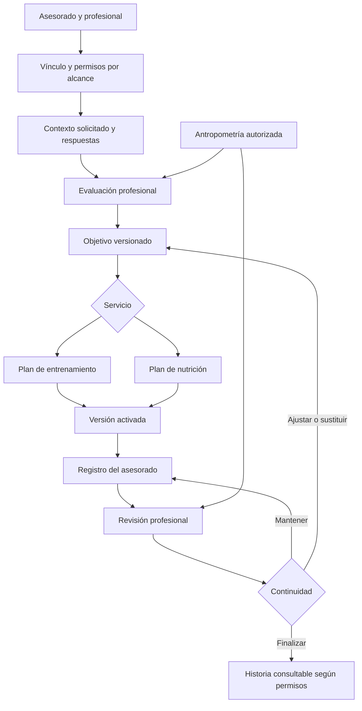
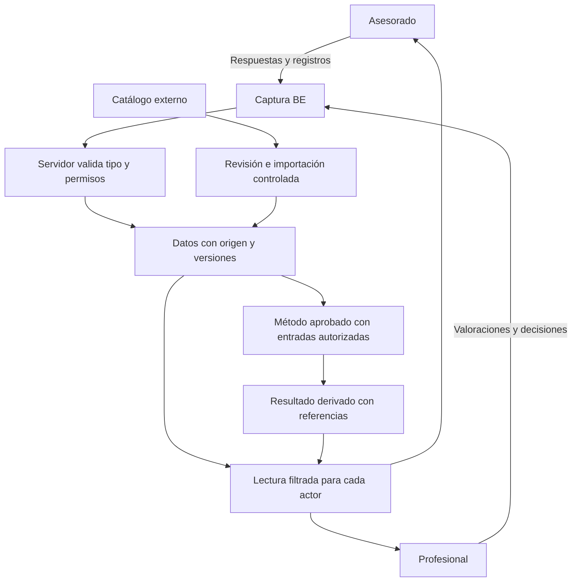
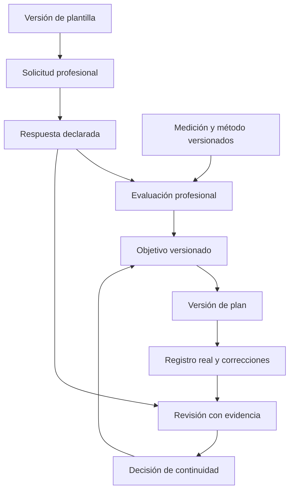

# Plan de desarrollo funcional y datos profesionales de BE

**Versión:** 1.0 propuesta para revisión de Dirección.  
**Fecha de corte:** 26 de septiembre de 2026, hora de Buenos Aires.  
**Preparado para:** Elián Bufi, Dirección de BE, y Claude Code como ejecutor técnico.  
**Autoría:** propuesta de análisis elaborada por Codex a pedido de Dirección.  
**Base de código consultada:** `Elian-Bufi/be`, commit `46fd1fae7d1c58a38d89987037bf38b255c7c2d0`.  
**Propósito:** convertir la visión de BE en paquetes verificables de producto, con datos, formularios, permisos, procesos y criterios de aceptación suficientes para preparar el desarrollo.

Este documento propone profundizar los circuitos existentes de nutrición, entrenamiento y antropometría, empezando por el contexto que necesita cada profesional. La recomendación es cerrar el defecto actual del historial, construir un primer recorrido completo de contexto a revisión y ampliar por entregas pequeñas. No se propone rehacer la aplicación ni acumular pantallas sin una decisión profesional que las justifique.

El pedido de Dirección autoriza elaborar esta propuesta. **No convierte automáticamente los campos nuevos, contenidos clínicos, cambios de permisos o funciones de inteligencia en requisitos aprobados para producción.** Claude debe reutilizar el código vigente y presentar el delta del paquete seleccionado antes de implementarlo. Los identificadores `PF`, `DAT`, `TRN`, `NUT`, `ANT`, `F`, `CA` y `DEC` de este archivo son locales a la propuesta; no sustituyen los RF, UC, API ni DL del legajo.

**Guía de lectura:** para decidir el próximo trabajo, leer las secciones 1, 12 y 15. Para profundizar los servicios, leer de la 6 a la 9. Para desarrollar y auditar, usar las secciones 4, 5, 10, 13, 14 y 16. El documento contiene 104 conceptos de datos, un banco de 58 preguntas, tres mapas de proceso o información, nueve paquetes y 24 escenarios de verificación. Son un menú priorizado de diseño; no un formulario único ni una lista para implementar de una vez.

## 1 Lectura ejecutiva y decisiones de producto

BE debe ayudar al profesional a comprender a la persona, justificar una decisión, emitir un plan comprensible, registrar lo ocurrido y revisarlo con evidencia. Una lista más extensa de campos solo agrega valor si cada campo modifica una decisión o mejora una experiencia concreta.

La siguiente unidad de trabajo recomendada es **PF-02 Contexto de entrenamiento conectado con la evaluación**, después de una base acotada de campos y permisos PF-01. Es el circuito que ya estamos probando en el teléfono y permite validar el patrón completo antes de repetirlo en nutrición.

### 1.1 Resultados que buscamos

1. El asesorado explica qué busca, qué puede sostener y qué dificultades encuentra, sin repetir la misma información en todos los módulos.
2. El profesional recibe el contexto pertinente, con fecha y procedencia; distingue lo confirmado de lo pendiente de revisar.
3. Cada objetivo y plan tiene fundamento, versión y responsable; las recomendaciones no aparecen como decisiones automáticas del sistema.
4. Lo registrado se compara con la indicación que correspondía en ese momento, conservando omisiones y sustituciones sin inventar cumplimiento.
5. La revisión concluye en una acción concreta y trazable: mantener, ajustar, sustituir, reprogramar, cambiar objetivo o finalizar.
6. Dirección puede abrir un mapa y saber qué requisito motivó una función, qué datos utiliza, qué pruebas la cubren y qué sigue pendiente.

### 1.2 Orden recomendado

| Tramo | Resultado | Condición de salida |
|---|---|---|
| Estabilización | Historial utilizable y evidencia de entrega coherente | Casos del defecto comprobados sobre la APK correcta |
| Base de contexto | Diccionario mínimo, finalidad y permisos por campo | Paquete de campos aprobado y contratos compatibles |
| Entrenamiento profundo | Contexto, evaluación, objetivo, planificación, ejecución y revisión conectados | Un caso sintético completo reconstruible |
| Nutrición profunda | Contexto alimentario y restricciones conectados con el plan y su revisión | Un caso sintético completo, sin falsos totales |
| Medición y coordinación | Antropometría comparable y coordinación entre alcances autorizados | Procedencia y visibilidad correctas en todo el recorrido |
| Inteligencia supervisada | Ayudas útiles, explicables y evaluadas | Mejora demostrada frente al flujo sin ayuda automática |

No se fija una fecha de entrega de estas ampliaciones sin estimar cada paquete sobre el repositorio. La entrega académica mencionada para el 1 de octubre conserva un alcance de estabilización y demostración: este plan aporta dirección y especificación; no promete desplegar toda la visión para esa fecha.

### 1.3 Qué no vamos a hacer dentro de este plan

No se incorporan como alcance inmediato pagos, chat general, turnos, wearables, prescripción farmacológica, diagnóstico automatizado ni nuevas especialidades clínicas. Tampoco un generador libre de formularios, un puntaje de salud, una calificación de adherencia o un algoritmo que ajuste planes sin intervención profesional. Si una de estas capacidades se prioriza, necesita su propio caso de negocio, modelo de permisos y paquete aprobado.

## 2 Línea base verificada y diferencias con la visión

La revisión de código permite afirmar que existen los contratos y las reglas indicadas abajo; no certifica por sí sola cada experiencia en un dispositivo. Los documentos antiguos contienen encabezados y estados históricos. Deben leerse junto con las decisiones y el código, sin borrar su historia ni tratar todo el texto como estado vigente.

### 2.1 Lo que ya hay

| Área | Evidencia vigente consultada | Profundidad que falta definir o conectar |
|---|---|---|
| Nutrición | Evaluación con datos y fuente; objetivo con energía y macronutrientes; plan por días tipo, comidas, opciones e ítems; ingestas y revisión [S04, S10] | Contexto profesional estructurado, objetivos no reducidos a cantidades, uso de formularios desde la evaluación y catálogo profesional validado |
| Entrenamiento | Evaluación, objetivo textual versionado, bloques, microciclos opcionales, sesiones, series, intensidad, ejecución, corrección y revisión [S06, S09, S14] | Contexto tipado, restricciones operativas, modalidades adicionales y decisiones de progresión mejor asistidas |
| Antropometría | Evaluaciones, mediciones con protocolo, correcciones, anulaciones, comparabilidad y cálculos con procedencia [S05, S12, S13] | Contenido profesional de protocolos y métodos, condiciones de toma mejor estructuradas y coordinación explícita |
| Formularios | Plantillas versionadas; solicitud profesional; respuesta del asesorado; rectificación; tipos TEXT, NUMBER y BOOLEAN [S07, S11, S15] | Opciones tipadas, fechas, listas, condicionales y conexión con las pantallas de cada dominio |
| Permisos | A3, vínculo, alcance, B2 y evaluación de permisos por operación [S03, S15] | Matriz de pertinencia por campo respaldada por revisión profesional y jurídica |
| Perfil propio | Entidad creada, sin campos de contenido aprobados según DL-009 [S08] | Decidir qué pertenece al perfil y qué es una respuesta contextual a una solicitud |
| Historial | Lecturas propias y correcciones de navegación, fechas y área inferior; PF-00 debe terminar la validación [S08, S16] | Selector de período y paginación quedan separados del defecto actual |

### 2.2 Hallazgos que cambian el plan

**Formularios limitados.** El catálogo actual es sintético. Los contratos aceptan solo texto, número y booleano. Una propuesta con selección múltiple, fecha, grupos repetibles o campos condicionales necesita ampliación explícita; no puede enviarse hoy como si ya estuviera soportada. Una solicitud admite hasta 60 campos; los formularios de esta propuesta se mantienen por debajo de ese límite. [S07, S11]

**Pertinencia provisional.** La matriz actual permite las cuatro categorías en los tres alcances como clasificación de demostración. El control efectivo sigue en el servidor, pero esa matriz no constituye una validación clínica de qué debe ver cada profesión. Además, `profileSourceRef` todavía es una referencia opaca sin comprobar íntegramente propiedad y compatibilidad, deuda declarada en DL-095. PF-01 debe resolver ese límite antes de ofrecer reutilización automática del perfil. [S08, S15]

**Restricciones de cálculo.** Entrenamiento admite criterio de intensidad RIR o porcentaje de RM, o ninguno; el esfuerzo percibido pertenece a la ejecución. No hay autorización actual para convertir RPE en un tercer criterio, generar puntajes ni agregar cálculos de volumen o marcas como hechos ya aprobados. Nutrición no tiene un puntaje de adherencia. [S09, S10, S14]

**Objetivo nutricional acoplado.** El contrato actual exige requerimiento energético y distribución de macronutrientes. Un objetivo exclusivamente conductual no cabe de forma honesta si obligamos al profesional a completar números innecesarios. PF-04 debe decidir una ampliación compatible en lugar de inventar calorías para satisfacer el formulario. [S10]

**Modalidad de intercambios.** El contrato nombra `EXCHANGE_PORTIONS`, pero la modalidad se rechaza como no disponible. Mostrarla en un selector no la convierte en una funcionalidad implementada. Su activación queda fuera de la primera profundización. [S10]

**Versión y publicación son hechos distintos.** El commit de corte ya incluye el versionado móvil 0.11.2 del PR #95; eso no prueba que la APK estuviera publicada o validada en ese instante. El último defecto aprobado corrige la construcción del período en Buenos Aires. El cierre operativo debe consultar el estado real al comenzar PF-00.

## 3 Servicios y procesos que debe sostener el producto

### 3.1 Entrenamiento profesional

Servicio propuesto: evaluación inicial, definición de objetivos y restricciones, planificación por versiones, acompañamiento del registro, revisión de evidencia y continuidad. La experiencia debe permitir adaptar el plan a equipamiento, tiempo, experiencia y contexto del asesorado. El software no declara aptitud médica ni convierte la ausencia de respuestas en ausencia de riesgo.

**Resultado del servicio:** una persona sabe qué realizar y qué registrar; el profesional puede explicar por qué lo indicó y qué cambió después. El catálogo de ejercicios, sus zonas musculares y el material didáctico apoyan ese servicio sin sustituir criterio profesional.

### 3.2 Nutrición profesional

Servicio propuesto: evaluación alimentaria y de contexto, objetivo acordado, planificación realizable, registro flexible de ingestas y revisión. Las preferencias, disponibilidad, presupuesto, cultura alimentaria y síntomas declarados pueden modificar la estrategia; no todo objetivo debe consistir en bajar de peso ni todo registro necesita pesar alimentos.

**Resultado del servicio:** una pauta comprensible y posible de sostener, con alternativas revisadas por el profesional y una revisión que distingue lo prescripto, lo informado y lo desconocido. Las fórmulas son métodos versionados; una estimación no se presenta como medición ni como diagnóstico.

### 3.3 Antropometría

Servicio transversal que puede existir dentro de un seguimiento o como evaluación puntual, sin convertirlo en una tercera especialidad. La capacidad de realizar antropometría, el alcance autorizado y el acceso a la persona se comprueban por separado. Una medición puntual no abre automáticamente un proceso de nutrición o entrenamiento. [S02, S05]

**Resultado del servicio:** mediciones con técnica y procedencia identificables, cálculos reproducibles cuando corresponda y evolución que compara solo lo comparable.

### 3.4 Coordinación entre profesionales

Una persona puede trabajar con profesionales distintos y autorizar alcances diferentes. El producto debe comunicar lo necesario para coordinar sin abrir una historia completa por defecto. Ejemplo propuesto: compartir una limitación operativa revisada para el entrenamiento, sin mostrar al entrenador todo el relato clínico de nutrición que la originó. El contenido de esa proyección debe definirse manualmente y autorizarse; el MVP no puede resumir automáticamente texto libre sensible. [S03, S07]

### 3.5 Mapa del proceso principal



El diagrama es una vista conceptual, no una modificación de las máquinas de estado vigentes. Reprogramar o cambiar objetivo se resuelve con las operaciones existentes y sus precondiciones. La activación crea o conserva la instantánea prevista por el contrato; no se agrega aquí un nuevo acto de aceptación del asesorado.

### 3.6 Un flujo de datos separado del flujo de trabajo



La auditoría registra metadatos de las operaciones. No debe copiar todos los contenidos sensibles a logs ni convertirse en una segunda base de salud. La futura inteligencia solo puede consumir la lectura ya filtrada para el actor y la finalidad concretos.

## 4 Contrato de datos común

### 4.1 Diccionario y convenciones

Los nombres técnicos en esta propuesta son candidatos. Antes de crear un campo, Claude debe buscar su equivalente existente y conservar un solo concepto por significado. Las unidades se muestran junto al valor; se acepta la coma decimal en la captura y se normaliza de manera explícita. Los máximos de longitud y cardinalidad propuestos son límites técnicos, no intervalos clínicos de normalidad.

Estados de una especificación: **REUTILIZAR** si existe un contrato equivalente; **AMPLIAR** si se profundiza algo existente; **NUEVO** si requiere decisión y contrato propios; **FUTURO** si no entra en los primeros paquetes. Estos estados describen el plan, no el despliegue.

Obligatoriedad: **R** requerido para el acto indicado; **C** requerido si se cumple la condición; **O** opcional. Una respuesta de salud puede ofrecer “No sé” o “Prefiero conversarlo”; el producto distingue esas elecciones del dato omitido. Una negativa a responder no se convierte en “No”, en un valor cero ni en un consentimiento implícito.

### 4.2 Metadatos que acompañan los datos

| ID y concepto | Tipo lógico | Regla propuesta |
|---|---|---|
| DAT-01 Titular | Referencia a identidad | R. Lo resuelve el servidor; el cliente no puede cambiar el dueño |
| DAT-02 Autor y actor | Referencia y rol efectivo | R. Distinguir quién informó, quién capturó y quién revisó |
| DAT-03 Alcance y finalidad | Alcance vigente y finalidad de solicitud | R. Persistir el contexto; comprobar autorización actual al leer |
| DAT-04 Código de concepto | Código estable y versión de definición | R para campos estructurados. El rótulo puede cambiar sin reinterpretar valores históricos |
| DAT-05 Valor y unidad | Unión tipada | C según el concepto. No usar texto para esconder cantidades o unidades |
| DAT-06 Estado de respuesta | Dato informado o motivo de ausencia | AMPLIAR. Separar desconocido, no aplica y prefiere conversarlo; sin convertirlos en diagnósticos |
| DAT-07 Procedencia | Fuente y referencia | R. Mantener vocabularios del dominio y mapeo explícito entre REPORTED y SELF_REPORTED |
| DAT-08 Fecha del hecho | Instante o fecha civil según concepto | R cuando hay hecho temporal. No sustituirla por la fecha de carga |
| DAT-09 Fecha de registro | Instante UTC del servidor | R. No editable por el cliente |
| DAT-10 Zona temporal | Identificador IANA o política de zona | C para interpretar días u horarios. No deducirla de un offset aislado |
| DAT-11 Versión y antecedente | Referencias de sucesión | R para contenido que admite rectificación. Original y sucesor reconstruibles |
| DAT-12 Fuente concreta | Solicitud, respuesta, medición o corrida | C cuando se reutiliza. Verificar titular, tipo, estado y acceso |
| DAT-13 Revisión profesional | Revisor, fecha y observación | NUEVO cuando corresponda. Revisado no transforma una declaración en medición |
| DAT-14 Vigencia declarada | Desde, hasta y confirmación | AMPLIAR. La antigüedad se muestra; el dato no desaparece por vencer |
| DAT-15 Método | Identidad y versión del método | C para derivados, con entradas, unidades, redondeo y restricciones |
| DAT-16 Motivo de cambio | Texto y referencia anterior | R para corrección o rectificación; no para cada pulsación de un borrador |

Estos conceptos ya existen parcialmente y de manera distinta en cada dominio. No se propone crear una tabla universal que reemplace todas las entidades. El diccionario permite reconciliar semántica y migrar de forma deliberada.

### 4.3 Distinciones que deben ser visibles

- **Declarado:** la persona cuenta un hecho. Ejemplo: “mi peso es 80 kg”.
- **Observado:** un profesional registra una observación y su contexto.
- **Medido:** existe una toma con instrumento o procedimiento identificable, si aplica.
- **Calculado:** se conserva el método y las entradas; una fórmula puede ser inaplicable.
- **Propuesto por IA:** candidato revisable, nunca fuente clínica original ni decisión efectiva.

Si dos fuentes se contradicen, se muestran ambas con su fecha y origen. Un profesional puede adoptar una como referencia para una decisión; no se borra la otra ni se calcula un promedio automático.

### 4.4 Fechas y reloj

La fecha de una sesión es una fecha civil `YYYY-MM-DD`; `recordedAt` es un instante. Las ventanas de historial se construyen en la zona que usa la operación del servidor. El corte actual usa Buenos Aires; no se cambia a la zona del dispositivo sin revisar contratos y series históricas.

PF-01 debe inventariar todos los generadores y formateadores de fechas. El caso real de las 21 h se convierte en prueba transversal: antes y después del cambio de día UTC, del cambio de día civil y en zonas de dispositivo distintas. Una futura zona configurable requiere decidir su alcance por persona o proceso y conservar la zona histórica de los hechos existentes. Un reloj del teléfono incorrecto se trata aparte de un error de zona.

### 4.5 Integridad y concurrencia

Las escrituras relevantes conservan idempotencia y versión esperada. Antes de repetir una respuesta idempotente, el servidor reevalúa los permisos exigidos. Un conflicto no se resuelve sobrescribiendo la última versión en silencio. Los borradores pueden guardar progreso, pero no adquieren autoridad de registro confirmado. El cliente antiguo debe poder seguir leyendo el contrato que conoce o recibir una incompatibilidad controlada.

## 5 Actores y permisos

El profesional no obtiene acceso por tener una especialidad, pagar un paquete o conocer un identificador. La combinación de verificación, capacidad, vínculo, alcance, consentimiento y operación determina lo que puede hacer. El administrador no recibe lectura ordinaria del contenido de salud. [S02, S03]

### 5.1 Matriz funcional propuesta

| Recurso o acción | Asesorado titular | Profesional pertinente | Otro profesional y administración |
|---|---|---|---|
| Responder una solicitud | Si la solicitud sigue siendo respondible | Lee según permiso actual; no responde por la persona | Sin acceso por defecto |
| Evaluar y definir un plan | Consulta lo revelable; no firma como profesional | Autoriza el servidor en el alcance correspondiente | Sin acceso por defecto |
| Registrar ejecución o ingesta | Según operación y condiciones vigentes | Consulta evidencia autorizada | Sin acceso por defecto |
| Consultar historia propia | A3 vigente y sesión válida en las lecturas identificadas | B2 y condiciones de lectura actuales | No hereda acceso |
| Corregir o rectificar | Solo operaciones habilitadas para el titular | Solo sus operaciones profesionales permitidas | Sin edición administrativa del contenido |
| Consultar antropometría | Lectura propia según contrato | Capacidad y alcance antropométrico pertinentes | Nutrición o entrenamiento no bastan por sí solos |
| Ver explicación de dato no revelable | Mensaje neutral | Mensaje neutral según contrato | No exponer existencia ni motivo reservado |
| Usar ayuda de IA futura | Solo para finalidad aprobada | Mismos permisos sobre cada entrada y salida | No existe una cuenta IA con acceso global |

La historia propia con A3 no implica que el asesorado pueda seguir creando o corrigiendo registros cuando otras precondiciones dejan de cumplirse. Cada operación mantiene su regla. El fin del vínculo no borra la historia, y la revocación tampoco habilita una lectura profesional a través de resúmenes, exportaciones o caches.

### 5.2 Pertinencia por campo

La matriz nueva debe contener: código, categoría, finalidad, alcance solicitante, tipo de profesional, nivel de detalle, condición de acceso y fundamento. Por defecto, un campo nuevo no se comparte entre alcances. Los datos de horarios pueden reutilizarse mediante confirmación; antecedentes clínicos, medicación, embarazo o relación con la comida requieren justificación y revisión específicas.

Para un entrenador no sanitario, la propuesta es priorizar **restricciones operativas expresamente comunicadas** y no desplegar una historia clínica completa. Ni un rol llamado “health coach” ni B2 resuelven por sí solos el alcance profesional o la base jurídica. Las validaciones pendientes del legajo siguen pendientes. La primera implementación continúa con datos sintéticos hasta definir el paso a uso real. [S03, S08, X05]

### 5.3 Reutilización sin duplicación silenciosa

El profesional solicita un concepto, BE detecta una respuesta propia reutilizable y la persona confirma “Sigue vigente” o “Cambió”. Esa confirmación es un acto nuevo con vínculo a la fuente. Si la fuente no es verificable, se pide una respuesta nueva; no se confía en `profileSourceRef` solo porque trae un identificador. La reutilización entre solicitudes no transmite automáticamente la autorización del profesional anterior.

## 6 Profundidad del servicio de entrenamiento

### 6.1 Contexto y evaluación

El formulario inicial F-TRN-01 alimenta la evaluación como evidencia declarada. El profesional revisa sus respuestas, registra lo observado y determina qué información adicional es pertinente. La evaluación debe poder documentar experiencia, disponibilidad, equipamiento, restricciones, pruebas realizadas y punto de partida sin convertirse en una ficha médica indiscriminada.

| ID y campo candidato | Tipo y captura | Uso y reglas |
|---|---|---|
| TRN-01 Motivo y resultado esperado | Texto 1000, asesorado O | Traducir el deseo a un objetivo; no asignar un diagnóstico |
| TRN-02 Historia de práctica | Años o meses y texto, asesorado O | Distinguir experiencia acumulada de continuidad reciente |
| TRN-03 Actividad actual | Lista de modalidad, frecuencia y duración | Declaración sobre un período explícito; no derivar condición física automáticamente |
| TRN-04 Disponibilidad | Días, minutos por sesión y variabilidad | Propuesta nueva de opciones y rangos; no registrar horarios exactos sin utilidad |
| TRN-05 Entorno y equipamiento | Lista versionada y texto adicional | Filtrar opciones de planificación; equipamiento disponible no es técnica dominada |
| TRN-06 Preferencias y barreras | Opciones más texto | Fundamentar adherencia práctica sin crear un puntaje |
| TRN-07 Restricciones comunicadas | Texto acotado, vigencia y fuente | Solo información pertinente. “Sin respuesta” no equivale a “sin restricciones” |
| TRN-08 Molestia relevante declarada | Localización, actividad asociada y texto | Ramificada, opcional y revisada; no diagnosticar lesión ni indicar tratamiento |
| TRN-09 Recuperación contextual | Sueño declarado, turnos y otras cargas | Datos autoinformados con período; compartir solo lo necesario |
| TRN-10 Prueba profesional | Protocolo, fecha, condiciones y resultados | NUEVO contenido estructurado; no inventar tests obligatorios para todas las personas |
| TRN-11 Competencia observada | Tarea, observación y autor | Texto profesional; sin semáforo automático de calidad técnica |
| TRN-12 Evidencia adoptada | Referencias a respuestas, mediciones o pruebas | AMPLIAR referencias existentes y validar revelabilidad |

**Objetivo de interfaz:** al abrir la evaluación, el profesional debe ver “Disponible”, “Necesita confirmación” o “No solicitado” para los conceptos que su proceso requiere. Si hay un dato no revelable, se conserva el mensaje neutral definido por permisos; no se filtra su existencia mediante esa lista.

### 6.2 Objetivos

Se conserva el enunciado, la evaluación de origen, la vigencia y el fundamento actuales. Se propone agregar, opcionalmente, categoría de intención, indicador elegido, referencia inicial y condición de revisión. Las categorías sugeridas son fuerza, capacidad aeróbica, habilidad, participación, rendimiento deportivo y cambio de composición corporal; son propuestas de catálogo, no diagnósticos ni promesas de resultado.

Un objetivo cuantitativo exige nombre de indicador, unidad, método de medición, valor inicial con fuente, meta acordada y horizonte. Si el indicador no tiene método aprobado, el objetivo puede permanecer cualitativo. No se exige una meta de peso a quien busca fuerza o regularidad. Los cambios producen una versión nueva.

### 6.3 Catálogo y planificación

| ID y campo candidato | Estado | Definición y validación |
|---|---|---|
| TRN-13 Ejercicio y versión | REUTILIZAR | Prescribir una versión; el catálogo futuro no cambia el plan histórico |
| TRN-14 Zonas musculares | REUTILIZAR alcance existente | Roles principal y secundario; sin porcentajes inventados de activación |
| TRN-15 Equipamiento y variante | AMPLIAR | Variante explícita, contexto y procedencia; no inferir equivalencia por parecido de nombres |
| TRN-16 Instrucciones y material | AMPLIAR | Texto profesional, URL y licencia cuando corresponda; no importar material sin revisión |
| TRN-17 Bloque y microciclo | REUTILIZAR | Propósito y orden; microciclo opcional; sesiones directas o agrupadas, no ambos a la vez |
| TRN-18 Sesión | REUTILIZAR | Nombre, instrucciones, orden y vínculo con la versión de plan |
| TRN-19 Series y repeticiones | REUTILIZAR | Valor o rango; orden estable y nota por serie |
| TRN-20 Intensidad indicada | REUTILIZAR | RIR o porcentaje de RM, o sin criterio; un criterio por prescripción |
| TRN-21 Referencia de RM | AMPLIAR | Fuente, fecha, ejercicio/variante y método si es estimada; no calcular RM sin método aprobado |
| TRN-22 Carga sugerida | REUTILIZAR | Valor con kg o lb; complemento de intensidad, no tercer criterio |
| TRN-23 Descanso | AMPLIAR parámetro existente | Segundos o rango con semántica explícita; no parsear notas libres para extraerlo |
| TRN-24 Tempo y ejecución | AMPLIAR | Fases definidas por catálogo versionado o texto; un código como 3010 requiere explicación visible |
| TRN-25 Alternativa preaprobada | NUEVO | Ejercicio sustituto, condición y responsable; conservar indicado y realizado |
| TRN-26 Duración y distancia | FUTURO cercano | Minutos, segundos, metros o kilómetros, según modalidad; contrato específico antes de admitirlos |
| TRN-27 Agrupación de ejercicios | FUTURO cercano | Superserie o circuito con orden, rondas y descanso; no simularlo duplicando sesiones |
| TRN-28 Propuesta de progresión | NUEVO | Condición revisable, evidencia requerida y acción profesional; nunca modificación automática |

La primera profundización mantiene el circuito de fuerza ya existente. Cardio, movilidad y circuitos se modelan como ampliaciones con parámetros propios; no se fuerzan en el campo “repeticiones” ni se improvisa otra API sin reconciliar las entidades actuales.

### 6.4 Ejecución y experiencia del asesorado

| ID y campo candidato | Estado | Definición y regla |
|---|---|---|
| TRN-29 Ocurrencia y fecha | REUTILIZAR | Identificador emitido por servidor, sesión y fecha civil |
| TRN-30 Condición registrada | REUTILIZAR | Realizada, realizada con desvío o no realizada; ausencia de registro es distinta |
| TRN-31 Ejercicio realizado | REUTILIZAR | Referencia propia, conservando prescripción de origen |
| TRN-32 Serie real | REUTILIZAR | Índice, carga con unidad, repeticiones, RIR y esfuerzo percibido cuando se informan |
| TRN-33 Escala de esfuerzo | AMPLIAR | Identificador y anclajes de la escala; no convertir RIR en esfuerzo percibido por una resta automática |
| TRN-34 Duración real | NUEVO | Minutos con fuente manual o temporizador explícita; no estimar por tiempo que la pantalla quedó abierta |
| TRN-35 Motivo y observación | AMPLIAR | Texto u opciones revisadas: tiempo, equipamiento, preferencia, molestia u otro; opcional |
| TRN-36 Contexto posterior | NUEVO y opcional | Dificultad percibida y comentario breve; no una encuesta larga después de cada serie |
| TRN-37 Corrección | REUTILIZAR | Original, sucesor, autor, instante y motivo; conservar la navegación de origen |

El registro mínimo debe seguir siendo rápido. La persona puede confirmar una sesión sin completar métricas opcionales. La interfaz muestra qué fue indicado y qué se hizo, sin colorear toda desviación como error. Si registra sin conexión en un futuro paquete, la sincronización requiere diseño propio de conflicto y revocación; no se considera disponible hoy.

### 6.5 Revisión y progresión

La revisión reúne el objetivo vigente, la planificación aplicable, registros disponibles, cambios de contexto y observaciones. El profesional decide continuidad y fundamento. Como ampliación, se propone registrar indicador revisado, evidencia citada, razón del ajuste, fecha o condición de próxima revisión y qué quiere confirmar con el asesorado.

La frase “se puede aumentar la carga” sería una propuesta del profesional o una sugerencia futura de ayuda validada. No se activa solo porque el usuario completó un número de repeticiones. Un dato faltante de RIR permanece faltante; no se infiere que una serie fue efectiva o cercana al fallo.

**CA-TRN-01:** un profesional puede solicitar F-TRN-01 desde la evaluación, recibirlo y citar respuestas concretas en su fundamento.  
**CA-TRN-02:** una sustitución conserva ambas referencias, incluida la versión histórica.  
**CA-TRN-03:** actualizar el catálogo o la disponibilidad del asesorado no modifica una sesión registrada.  
**CA-TRN-04:** el historial y el detalle coinciden en fecha y regresan al origen desde enlace, Android y retorno tras corrección.  
**CA-TRN-05:** un ajuste propuesto necesita una acción profesional antes de cambiar la planificación efectiva.

## 7 Profundización del servicio de nutrición

### 7.1 Contexto que necesita el profesional

El contexto alimentario combina lo que la persona busca, sus condiciones de vida, lo que suele comer y las circunstancias que pueden modificar una indicación. BE debe permitir una evaluación pertinente sin convertir el alta en un interrogatorio clínico universal. Los datos sensibles adicionales se solicitan para una finalidad concreta, con revisión profesional del contenido.

| ID y campo candidato | Estado y tipo | Uso y regla propuesta |
|---|---|---|
| NUT-01 Motivo y expectativas | NUEVO; texto y prioridad | Qué quiere resolver la persona y qué consideraría una mejora |
| NUT-02 Experiencias previas | NUEVO; texto breve | Qué intentó, qué pudo sostener y qué le resultó difícil; evitar juicios sobre voluntad |
| NUT-03 Organización diaria | NUEVO; franjas horarias | Trabajo, estudio, turnos y momentos posibles para comer; no exigir la dirección laboral |
| NUT-04 Acceso a alimentos | NUEVO; opciones y comentario | Disponibilidad y dificultad percibida; no solicitar ingresos exactos por defecto |
| NUT-05 Cocina y conservación | NUEVO; opciones múltiples | Equipamiento disponible, tiempo para cocinar, compra y conservación |
| NUT-06 Preferencias y cultura | NUEVO; opciones y texto | Alimentos preferidos, evitados, prácticas culturales o religiosas relevantes; no inferir afiliaciones |
| NUT-07 Alergia declarada | NUEVO; lista estructurada | Alimento o sustancia, declaración del asesorado y revisión profesional; separada de intolerancia y preferencia |
| NUT-08 Intolerancia o dificultad declarada | NUEVO; lista y comentario | Registrar tal como se informa, sin confirmar diagnósticos automáticamente |
| NUT-09 Situación de salud pertinente | NUEVO; campo restringido | Información que la persona desea comunicar al nutricionista y origen de la declaración |
| NUT-10 Medicación o suplemento informado | NUEVO; lista restringida | Nombre informado, cantidad y unidad si se conocen, frecuencia y fuente; sin recomendar cambios |
| NUT-11 Experiencia al comer | NUEVO; texto opcional | Apetito, comodidad y dificultades percibidas; no producir diagnósticos mediante respuestas aisladas |
| NUT-12 Hidratación habitual | NUEVO; cantidad aproximada y unidad | Contexto declarado, con período de referencia; no asignar una meta universal |
| NUT-13 Patrón habitual | AMPLIAR evaluación; relato estructurable | Día de referencia y variación habitual; distinguir recuerdo, registro contemporáneo y estimación |
| NUT-14 Preferencia de seguimiento | NUEVO; opción revisable | Registro breve, cantidades aproximadas o detalle cuando resulte pertinente; no obligar a pesar alimentos |

Para NUT-07 a NUT-10, la propuesta debe pasar revisión profesional antes de usarse con personas reales. El sistema permite “No sé” y “Prefiero conversarlo”. Una lista vacía no permite afirmar “sin alergias”. Si un catálogo no tiene información de alérgenos, se muestra información no disponible; nunca se etiqueta un alimento como seguro por ausencia de datos.

### 7.2 Evaluación y objetivo

La evaluación enlaza respuestas, observaciones y mediciones identificables. Puede incluir una valoración profesional y un problema nutricional formulado por el profesional dentro de sus incumbencias. Incorporar terminologías clínicas o un diagnóstico nutricional codificado exigiría seleccionar un sistema, revisar sus condiciones de uso y aprobar su alcance; no se deduce de esta propuesta. El proceso de evaluación, intervención y seguimiento es coherente con el marco profesional de atención nutricional, usado aquí como orientación de proceso. [X02]

| ID y campo candidato | Estado | Definición y criterio |
|---|---|---|
| NUT-15 Síntesis profesional | AMPLIAR | Texto escrito por el profesional, con referencias; no resumen automático del texto libre |
| NUT-16 Limitaciones de la evidencia | NUEVO | Datos faltantes, aproximados o desactualizados que importan para decidir |
| NUT-17 Tipo de objetivo | NUEVO | Propuesta: conductual, cuantitativo o combinado; reconciliar con contrato vigente |
| NUT-18 Acuerdo y prioridad | AMPLIAR | Qué se busca, por qué importa y cómo se revisará; no inventar una aprobación electrónica del asesorado |
| NUT-19 Meta conductual | NUEVO | Acción observable, contexto, frecuencia propuesta y fecha de revisión; sin calificar automáticamente a la persona |
| NUT-20 Energía y macronutrientes | REUTILIZAR | kcal por día y gramos por día o proporción energética según contrato; solo cuando correspondan al tipo de objetivo aprobado |
| NUT-21 Método y fundamento | REUTILIZAR y profundizar | Método versionado, entradas referenciadas, supuestos y decisión de adopción del resultado |
| NUT-22 Indicadores de revisión | NUEVO | Cambios observables elegidos por el profesional, fuente y periodicidad; no un puntaje compuesto predeterminado |

La ampliación de NUT-17 necesita una unión de contrato explícita: los objetivos cuantitativos conservan sus requerimientos actuales; los conductuales tienen sus propios campos mínimos. No se resuelve convirtiendo arbitrariamente todos los números en opcionales ni guardando cero. Debe incluir migración compatible o ausencia de migración justificada, validación del cliente y lectura de versiones anteriores.

### 7.3 Plan alimentario utilizable

| ID y campo candidato | Estado | Definición y regla |
|---|---|---|
| NUT-23 Día tipo | REUTILIZAR | Por ejemplo rutina habitual o jornada distinta; no inferir entrenamiento a partir del nombre |
| NUT-24 Comida y franja sugerida | REUTILIZAR y ampliar | Nombre comprensible; horario opcional o intervalo, sin imponer una hora exacta a todos |
| NUT-25 Opción y componentes | REUTILIZAR | Alternativas identificables, cada una con ítems y versión del catálogo |
| NUT-26 Cantidad y preparación | REUTILIZAR | g, ml o unidad según soporte vigente; crudo, cocido o adquirido; no mezclar pesos de estados distintos |
| NUT-27 Medida doméstica | NUEVO | Referencia versionada y conversión documentada si existe; “una taza” no tiene un peso universal |
| NUT-28 Instrucción práctica | AMPLIAR | Preparación, organización o conservación pertinente, revisada por el profesional |
| NUT-29 Sustitución revisada | NUEVO | Alternativa explícita, condición y autor; no equivalencia automática entre alimentos por calorías |
| NUT-30 Información nutricional | REUTILIZAR y profundizar | Fuente, versión, base de cantidad, preparación y nutrientes conocidos; diferenciar cero de desconocido |
| NUT-31 Compatibilidad alimentaria | NUEVO | Verificación asistida contra restricciones declaradas; resultado explicable y revisión humana |
| NUT-32 Vigencia e historial | REUTILIZAR | Instantánea activada, versión y referencias; actualizar un alimento no reescribe el plan anterior |

Antes de mostrar totales debe definirse qué nutrientes y componentes están cubiertos. Si falta información de un ítem, el total se identifica como parcial o se omite; no se completa con cero. La comparación entre una estimación y otra conserva ambos métodos y unidades. OFF puede aportar datos con procedencia, pero no reemplaza una curación profesional del catálogo ni demuestra por sí solo su idoneidad clínica.

Las porciones por intercambios quedan como paquete posterior: requieren sistema de equivalencias, versiones, grupos, unidades, reglas profesionales y compatibilidad con lo ya prescripto. No se desbloquean solo quitando la validación `EXCHANGE_MODE_NOT_AVAILABLE`.

### 7.4 Registro y revisión

| ID y campo candidato | Estado | Definición y regla |
|---|---|---|
| NUT-33 Fecha e ingesta | REUTILIZAR | Ocurrencia o registro fuera del plan, con fecha civil y momento cuando se conoce |
| NUT-34 Qué se consumió | REUTILIZAR | Opción indicada, alternativa, catálogo o descripción libre según contrato |
| NUT-35 Cantidad informada | REUTILIZAR y ampliar | Valor, unidad y calidad de la estimación; no obligar a convertir un relato en gramos |
| NUT-36 Contexto del registro | NUEVO y opcional | Facilidad, dificultad práctica y comentario, sin cuestionario después de cada comida |
| NUT-37 No consumido y no registrado | REUTILIZAR | Son estados informativos distintos; no convertir silencio en omisión de ingesta |
| NUT-38 Corrección | REUTILIZAR | Original y sucesor visibles con autor, instante y motivo |
| NUT-39 Revisión profesional | REUTILIZAR y profundizar | Evidencia, interpretación, limitaciones, decisión y próxima revisión |

La revisión propone respuestas concretas: simplificar preparación, cambiar alternativas, adecuar horarios, revisar una meta o solicitar contexto faltante. Un cambio del peso corporal no se atribuye automáticamente al plan ni se usa como único resultado del servicio.

**CA-NUT-01:** un objetivo conductual aprobado puede existir sin energía inventada ni campos numéricos ficticios.  
**CA-NUT-02:** alergia declarada, intolerancia y preferencia se conservan como conceptos distintos y con acceso pertinente.  
**CA-NUT-03:** un alimento sin dato nutricional no aporta un cero silencioso a un total.  
**CA-NUT-04:** la vista de evolución distingue ausencia de registro de ingesta no consumida.  
**CA-NUT-05:** una sustitución o ajuste cambia una versión futura mediante acto profesional y conserva el historial previo.

## 8 Antropometría y contexto transversal

### 8.1 Datos propuestos

La antropometría aporta observaciones y resultados derivados con técnica y límites explícitos. No se propone obtener toda medición posible en cada encuentro; cada protocolo define qué necesita para una finalidad. Antes de agregar un campo debe comprobarse si ya es representable en las mediciones o referencias existentes.

| ID y campo candidato | Estado | Definición y regla |
|---|---|---|
| ANT-01 Finalidad del encuentro | REUTILIZAR y precisar | Evaluación puntual o apoyo a un proceso autorizado; no abrir proceso automáticamente |
| ANT-02 Protocolo | REUTILIZAR | Identificador y versión, medidas requeridas y condiciones de comparación |
| ANT-03 Fecha y contexto de toma | REUTILIZAR y ampliar | Instante o fecha según contrato, lugar de tipo general y condiciones relevantes |
| ANT-04 Medición | REUTILIZAR | Concepto, valor y unidad; medido, declarado o derivado explícitamente |
| ANT-05 Instrumento | AMPLIAR si falta equivalencia | Tipo y referencia, resolución y control registrado cuando el protocolo lo requiera |
| ANT-06 Sitio y lateralidad | NUEVO según protocolo | Códigos definidos por protocolo; no texto libre si afecta comparabilidad |
| ANT-07 Repeticiones | AMPLIAR según protocolo | Valores individuales y regla de resultado del protocolo; conservar originales |
| ANT-08 Condiciones | NUEVO según pertinencia | Preparación y circunstancias que afecten interpretación, sin preguntas universales innecesarias |
| ANT-09 Motivo de dato ausente | NUEVO | No tomado, no pertinente, no disponible u otro motivo; no registrar cero |
| ANT-10 Método de cálculo | REUTILIZAR | Versión, entradas, unidades, ámbito de validez y propósito aprobado |
| ANT-11 Comparabilidad | REUTILIZAR | Grupo o criterio vigente, diferencias y limitaciones; no unir curvas incompatibles |
| ANT-12 Devolución y uso | AMPLIAR | Interpretación profesional, referencias adoptadas y explicación para la persona |

Edad, sexo u otras variables de una fórmula se solicitan solo cuando un método aprobado las necesita y define su significado. No se confunden identidad de género y variable utilizada por una fórmula, ni se adivina una a partir de la otra. Si no se dispone de una entrada requerida, se informa que ese método no puede ejecutarse; el sistema no la inventa.

### 8.2 Coordinación autorizada

Una medición se ofrece como referencia al profesional autorizado, con procedencia y limitaciones. Adoptarla en una evaluación es un acto distinto de capturarla. Un resultado calculado no otorga acceso a sus fuentes ni prolonga un permiso revocado.

Se propone una síntesis compartible escrita y revisada por el profesional, con alcance, destinatario y finalidad definidos. Ejemplo: “restricción operativa a considerar en la planificación”, acompañada de responsable y fecha de revisión. Su contenido y visibilidad requieren decisión explícita; no se fabrica automáticamente a partir de notas privadas de otra especialidad.

**CA-ANT-01:** una medición autodeclarada no se presenta como toma profesional.  
**CA-ANT-02:** el mismo conjunto de entradas y versión de método produce un resultado reproducible.  
**CA-ANT-03:** el gráfico señala incompatibilidad de protocolos en vez de presentar una única evolución engañosa.  
**CA-ANT-04:** perder acceso a una fuente no permite recuperar su contenido a través de una corrida de cálculo.

## 9 Formularios y banco de preguntas

### 9.1 Diseño de la experiencia

Los formularios son solicitudes breves y pertinentes, emitidas por el profesional dentro de su alcance. No se envía todo el banco al crear la cuenta. Se propone una entrada de contexto, seguida por preguntas del área y por actualizaciones cortas cuando cambie algo o haya una revisión. Antes de responder se muestra quién solicita, para qué y quién podrá consultar según los permisos vigentes.

Cada pregunta tiene código estable, versión de texto, tipo, opciones cuando corresponda, condición de presentación y regla de obligatoriedad. La versión solicitada queda fijada al emitir la solicitud; editar una plantilla no altera una solicitud pendiente ni una respuesta histórica. Los códigos con guiones usados aquí son identificadores editoriales: el `fieldCode` técnico deberá cumplir el patrón vigente, por ejemplo `trn_available_days`.

**R significa respuesta requerida para este formulario, no divulgación obligatoria de un dato sensible.** En preguntas pertinentes se habilita “No sé”, “No aplica” o “Prefiero conversarlo”. **O significa opcional.** **C significa condicionada a una respuesta previa o a la selección profesional.** Las escalas subjetivas solo se incorporan con anclajes claros; no se les atribuye validación clínica por utilizar números.

Las selecciones simples y múltiples propuestas son una ampliación respecto de TEXT, NUMBER y BOOLEAN. Las primeras entregas pueden usar los tipos actuales si mantienen significado y experiencia; no se guarda una lista separada por comas para simular un campo multiselección. Se recomienda agregar primero selección simple y múltiple con códigos estables. Fechas, grupos repetibles y adjuntos se incorporan únicamente cuando un paquete concreto los necesite.

Este banco contiene preguntas originales de producto, no un instrumento clínico validado. El cribado previo a actividad física debe integrarse al proceso de valoración y no reducirse a una puntuación automática. Si se decide adoptar un instrumento reconocido, se revisan versión, población, permisos de uso y aplicación completa según su responsable; no se copia parcialmente y se lo llama validado. [X03]

### 9.2 F-COM-01 Contexto inicial de la persona

**Momento:** primer proceso que lo necesita. **Destinatario:** profesional solicitante autorizado; “común” describe la reutilización conceptual, no una apertura a todas las áreas. **Reutilización:** mostrar una respuesta anterior pertinente, con fecha, y pedir confirmación. No constituye por sí mismo el perfil aprobado que falta en DL-009.

**COM-Q01 · Qué te gustaría lograr con este acompañamiento.**  
Respuesta: texto breve, R. Sirve para registrar la expectativa en palabras de la persona y contrastarla con el objetivo profesional. Se revisa al iniciar un nuevo objetivo.

**COM-Q02 · Qué cambio te gustaría notar primero en tu vida cotidiana.**  
Respuesta: texto, O. Identifica una prioridad concreta y evita reducir todo resultado al peso o a una marca deportiva.

**COM-Q03 · Cómo se organiza una semana habitual para vos.**  
Respuesta: opciones de rutina y comentario, R. Orienta disponibilidad; no requiere empleador, domicilio ni agenda completa.

**COM-Q04 · Qué suele dificultarte sostener una rutina.**  
Respuesta: selección múltiple de tiempo, recursos, organización, comodidad, otra situación o ninguna; O. Las opciones describen barreras y no atribuyen falta de compromiso.

**COM-Q05 · Qué apoyo tenés y qué preferís resolver por tu cuenta.**  
Respuesta: texto, O. Ayuda a definir apoyos prácticos; no solicita nombres de terceros.

**COM-Q06 · Hay algo que necesitemos adaptar para que puedas usar las indicaciones o la aplicación.**  
Respuesta: texto u opciones de accesibilidad, O. Permite adaptar lectura, instrucciones y captura sin exigir un diagnóstico.

**COM-Q07 · Cómo preferís revisar avances con tu profesional.**  
Respuesta: opciones compatibles con el servicio y comentario, O. Registra una preferencia, no promete chat, disponibilidad permanente ni un plazo de respuesta no acordado.

**COM-Q08 · Qué cambió desde la última vez que respondiste.**  
Respuesta: confirmación de continuidad o comentario, C al reutilizar. Genera una respuesta nueva con referencia a la anterior; no modifica la respuesta histórica.

### 9.3 F-TRN-01 Contexto inicial de entrenamiento

**Momento:** antes o durante la evaluación inicial. **Destinatario:** profesional de entrenamiento autorizado. **Contenido sensible:** preguntas 9 a 12 solo con finalidad y pertinencia revisadas. No sustituyen una evaluación de aptitud.

**TRN-Q01 · Qué te gustaría poder hacer o mejorar con el entrenamiento.**  
Respuesta: texto, R. Se vincula con TRN-01 y el futuro objetivo; una expectativa de la persona no se transforma automáticamente en prescripción.

**TRN-Q02 · Qué actividad venís haciendo y desde hace cuánto.**  
Respuesta: texto y duración aproximada opcional, R. Describe experiencia reciente; no clasifica automáticamente como principiante o avanzado.

**TRN-Q03 · Cuántos días por semana podrías reservar de manera realista.**  
Respuesta: número entero entre 0 y 7, R. Es disponibilidad, no una recomendación de frecuencia. Cero es una respuesta válida para conversar alternativas.

**TRN-Q04 · Qué días o franjas te suelen resultar posibles.**  
Respuesta: selección múltiple y comentario, O. Permite programar sin exigir un calendario personal completo.

**TRN-Q05 · Cuánto tiempo podrías dedicar a cada sesión.**  
Respuesta: minutos aproximados o intervalo, R. Debe indicar la unidad y permitir conversar si aún no lo sabe.

**TRN-Q06 · Dónde entrenarías y con qué equipamiento contás.**  
Respuesta: lugar de tipo general y selección múltiple de equipamiento, R. No requiere dirección exacta. La selección alimenta alternativas revisadas, no sustituciones automáticas.

**TRN-Q07 · Qué actividades disfrutás y cuáles preferís evitar.**  
Respuesta: texto, O. Separa gusto de restricción profesional o de salud; ambos pueden modificar el plan por razones distintas.

**TRN-Q08 · Cómo te resulta seguir instrucciones o registrar ejercicios.**  
Respuesta: opciones y comentario, O. Orienta demostraciones, lenguaje y cantidad de datos solicitados.

**TRN-Q09 · Hay alguna indicación profesional vigente que debamos considerar para entrenar.**  
Respuesta: sí, no, no sé o prefiero conversarlo, C. Si responde sí, comentario opcional con fecha y fuente declarada. El entrenador revisa; BE no valida una autorización médica.

**TRN-Q10 · Hay movimientos o actividades que hoy te generan molestias o dificultad.**  
Respuesta: selección simple y comentario, C. Registra la declaración y su contexto; no diagnostica lesión ni estima gravedad por una palabra aislada.

**TRN-Q11 · Hubo una interrupción reciente de tu actividad que quieras comentar.**  
Respuesta: texto, O. Permite explicar una vuelta al entrenamiento sin exigir detalles clínicos innecesarios.

**TRN-Q12 · Hay otra circunstancia de salud que prefieras conversar antes de definir el plan.**  
Respuesta: sí, no o prefiero conversarlo; O. Una elección de conversar crea una necesidad de revisión visible para el profesional, no una aptitud negativa o positiva automática.

**TRN-Q13 · Cómo describirías tu descanso y recuperación habitual.**  
Respuesta: texto u opciones con período de referencia, O. Es contexto subjetivo; no diagnostica trastornos del sueño ni determina una carga.

**TRN-Q14 · Qué te ayudaría a sostener las primeras semanas.**  
Respuesta: texto, O. Se usa para acordar una estrategia práctica y una primera revisión.

### 9.4 F-TRN-02 Contexto breve de una sesión y F-TRN-03 Revisión

F-TRN-02 se propone como complemento opcional al registro existente, evitando una solicitud formal de formulario por cada serie. Antes de implementarlo hay que decidir si son campos de ejecución o una solicitud vinculada; no duplicar ambas capturas.

**SES-Q01 · Hay algo distinto hoy que quieras comunicar antes de realizar la sesión.**  
Respuesta: sin cambios o comentario, O. La aplicación no promete monitoreo inmediato; el mensaje y el procedimiento ante una situación de salud requieren contenido profesional aprobado.

**SES-Q02 · Tuviste que cambiar algo de lo indicado.**  
Respuesta: sí o no, con motivo opcional, C si la condición registrada señala un desvío. Conecta con la sustitución o el registro real existente.

**SES-Q03 · Cómo te resultó la sesión en relación con lo que esperabas.**  
Respuesta: más fácil, similar, más difícil o no puedo compararla; O. Apoya la revisión y no reemplaza RIR ni esfuerzo por serie.

**SES-Q04 · Qué te gustaría que revise tu profesional antes de la próxima sesión.**  
Respuesta: texto, O. No crea una promesa de atención en tiempo real.

**REV-TRN-Q01 · Qué pudiste sostener y qué necesitás cambiar.**  
Respuesta: texto, R en F-TRN-03. Se revisa junto con registros disponibles, sin completar automáticamente los ausentes.

**REV-TRN-Q02 · Cambió tu disponibilidad, equipamiento o alguna limitación informada.**  
Respuesta: selección múltiple y detalles condicionados, R. Cada cambio conserva fecha y procedencia; no reescribe planes previos.

**REV-TRN-Q03 · Seguís priorizando el mismo objetivo.**  
Respuesta: sí, quiero ajustarlo o prefiero conversarlo, R. Motiva una conversación; solo el acto profesional correspondiente cambia el objetivo vigente.

### 9.5 F-NUT-01 Contexto inicial de nutrición

**Momento:** evaluación inicial. **Destinatario:** nutricionista autorizado. **Forma:** bloques cortos de rutina, recursos, preferencias y contexto pertinente; los bloques sensibles pueden diferirse para una conversación.

**NUT-Q01 · Qué te gustaría mejorar con este acompañamiento nutricional.**  
Respuesta: texto, R. Orienta motivo y prioridad sin asumir pérdida de peso.

**NUT-Q02 · Qué intentaste antes y qué te resultó útil o difícil.**  
Respuesta: texto, O. Evita repetir estrategias incompatibles con la experiencia de la persona.

**NUT-Q03 · Cómo suelen organizarse tus comidas en un día habitual.**  
Respuesta: relato por momentos, R. No exige una lista exacta ni convierte el recuerdo en un registro medido.

**NUT-Q04 · Qué cambia en días de trabajo, descanso o entrenamiento.**  
Respuesta: texto, O. Sirve para diseñar días tipo cuando realmente aportan valor.

**NUT-Q05 · Quién suele comprar y preparar lo que comés.**  
Respuesta: yo, compartido, otra persona o varía, O. No pide identificar a terceros; orienta organización.

**NUT-Q06 · Qué tiempo y recursos tenés para cocinar y conservar alimentos.**  
Respuesta: opciones y comentario, R. Se usa para proponer preparaciones posibles, sin presumir equipamiento.

**NUT-Q07 · Hay alimentos que te cuesta conseguir o sostener en tu presupuesto.**  
Respuesta: selección simple y comentario, O. No solicita ingresos exactos ni usa la dificultad económica como calificación.

**NUT-Q08 · Qué alimentos o preparaciones preferís y cuáles no te gustan.**  
Respuesta: texto o lista, O. Son preferencias; no se mezclan con alergias.

**NUT-Q09 · Seguís alguna práctica alimentaria que quieras que respetemos.**  
Respuesta: texto u opciones, O. Permite expresar preferencias culturales o personales sin exigir identificar una religión.

**NUT-Q10 · Te informaron alguna alergia alimentaria que debamos considerar.**  
Respuesta: sí, no, no sé o prefiero conversarlo, C por pertinencia. Si corresponde, alimento o sustancia y fuente declarada; revisión profesional obligatoria antes de usarlo como restricción confirmada.

**NUT-Q11 · Hay alimentos que te generan dificultad o que evitás por otro motivo.**  
Respuesta: texto, O. Conserva el relato sin etiquetar automáticamente intolerancia o enfermedad.

**NUT-Q12 · Hay alguna situación de salud o indicación vigente que quieras conversar con tu nutricionista.**  
Respuesta: selección simple y detalle opcional, C. El contenido solo se comparte dentro del alcance autorizado.

**NUT-Q13 · Usás algún medicamento o suplemento que quieras informar para esta evaluación.**  
Respuesta: sí, no, no sé o prefiero conversarlo; detalle opcional, C. Si se informa cantidad, requiere unidad. No se generan recomendaciones de suspensión o cambio.

**NUT-Q14 · Cómo te está resultando comer en cuanto a apetito, comodidad o dificultades.**  
Respuesta: texto, O. Abre una conversación; no es un cribado validado de trastornos alimentarios ni genera un diagnóstico.

**NUT-Q15 · Qué bebidas solés tomar y cómo estimarías la cantidad en un día habitual.**  
Respuesta: texto y cantidades opcionales con unidad, O. Se registra como aproximación, sin imponer una meta automática.

**NUT-Q16 · Qué forma de registro te resultaría más llevadera.**  
Respuesta: descripción breve, cantidades aproximadas, detalle cuando haga falta o prefiero conversarlo, O. La preferencia se acuerda con el profesional; no habilita una función aún inexistente.

**NUT-Q17 · Qué cambio pequeño te parece posible comenzar ahora.**  
Respuesta: texto, O. Insumo para una meta conductual si se aprueba la ampliación de objetivos.

### 9.6 F-NUT-02 Revisión alimentaria

**Momento:** frecuencia acordada en la revisión; “semanal” puede ser una opción, no una obligación universal. No se pregunta lo que ya puede leerse de registros autorizados, salvo para confirmar o interpretar.

**REV-NUT-Q01 · Qué parte de la propuesta te resultó fácil de sostener.**  
Respuesta: texto, R. Identifica recursos que conviene mantener.

**REV-NUT-Q02 · Qué parte te resultó difícil y en qué situaciones.**  
Respuesta: opciones y comentario, R. Distingue tiempo, acceso, gusto, organización y otras circunstancias.

**REV-NUT-Q03 · Las opciones y cantidades te resultaron comprensibles y prácticas.**  
Respuesta: selección simple y detalle, R. Detecta problemas de indicación y presentación; no concluye que hubo falta de adherencia.

**REV-NUT-Q04 · Cambió alguna preferencia, disponibilidad o situación que debamos considerar.**  
Respuesta: selección simple y comentario, R. Dispara revisión de contexto sin alterar registros anteriores.

**REV-NUT-Q05 · Hay algo de tu experiencia al comer que quieras conversar.**  
Respuesta: texto, O. Visible para el nutricionista autorizado; no se comparte en otro alcance por defecto.

**REV-NUT-Q06 · Qué preferís mantener y qué te gustaría ajustar para el próximo período.**  
Respuesta: texto, R. Alimenta la decisión profesional y la próxima versión del plan.

### 9.7 F-ANT-01 Contexto de la evaluación antropométrica

**Momento:** preparación de un encuentro, si el profesional lo considera pertinente. El formulario no sustituye consentimientos ni registra una medición profesional.

**ANT-Q01 · Qué esperás conocer con esta evaluación.**  
Respuesta: texto, R. Alinea finalidad y devolución con expectativas.

**ANT-Q02 · Tenés una evaluación anterior que quieras mencionar.**  
Respuesta: sí o no y fecha o referencia si se conoce, O. No admite adjuntos hasta aprobar ese soporte; un número declarado no se convierte en medición importada verificada.

**ANT-Q03 · Hay algo que necesitemos adaptar para que estés cómodo durante la toma.**  
Respuesta: texto, O. Orienta accesibilidad, privacidad y comodidad; no requiere justificarlo con un diagnóstico.

**ANT-Q04 · Hay alguna circunstancia relevante para esta toma que quieras conversar.**  
Respuesta: texto, C según protocolo y pertinencia profesional. No se envía una lista clínica universal.

**ANT-Q05 · Cómo preferís recibir la explicación de los resultados.**  
Respuesta: opciones de presentación disponibles y comentario, O. Evita imponer énfasis estético o comparaciones no solicitadas.

**ANT-Q06 · Querés corregir o aclarar algo de lo informado antes del encuentro.**  
Respuesta: texto, O. Se conserva como aclaración o rectificación con referencia; no borra la respuesta previa.

### 9.8 Reglas del motor y criterios de aceptación

Cada solicitud conserva plantilla y versión, campos solicitados, subconjunto requerido, finalidad y actor. Las condiciones se evalúan con reglas declaradas y probadas; ocultar un campo no autoriza borrar una respuesta previa. La rectificación conserva el original y explica qué cambió. Una selección simple usa un código de opción, no el rótulo traducido; una opción retirada sigue siendo legible en respuestas históricas.

Los estados de negocio vigentes siguen siendo `PENDING` y `RESPONDED`. “Respondible” es una proyección de permisos y condiciones, no un tercer estado. Borrador, vencimiento, cancelación, rechazo y recordatorio son decisiones futuras; no se agregan silenciosamente para completar este diseño. Si el primer paquete necesita borrador local, debe definir recuperación, cierre de sesión y eliminación de datos sin inventar una transición de servidor. [S07, S11]

**CA-FOR-01:** el asesorado conoce solicitante y finalidad antes de responder.  
**CA-FOR-02:** la pantalla diferencia no, omitido, desconocido y prefiere conversarlo cuando estén habilitados.  
**CA-FOR-03:** una plantilla nueva no cambia solicitudes o respuestas emitidas con otra versión.  
**CA-FOR-04:** el profesional puede referenciar una respuesta en la evaluación sin copiarla como observación propia.  
**CA-FOR-05:** una referencia de perfil ajena, incompatible o inaccesible se rechaza en servidor.  
**CA-FOR-06:** volver a una evaluación tras recibir el contexto permite continuar el trabajo que motivó la solicitud.  
**CA-FOR-07:** una respuesta de nutrición no se revela a entrenamiento por compartir un nombre de campo o una categoría genérica.

## 10 Modelo de información y contratos

### 10.1 Relaciones que debemos poder reconstruir

El siguiente modelo es conceptual. No pide crear tablas que ya existan ni reemplazar los agregados actuales. Las flechas representan trazabilidad; la revelación de una referencia exige permiso propio.



### 10.2 Responsabilidad de cada conjunto de datos

| Conjunto | Fuente de verdad | Regla de evolución |
|---|---|---|
| Identidad y autorizaciones | Módulos vigentes de identidad y permisos | No duplicar consentimiento en un formulario |
| Plantilla y definición de campo | Catálogo versionado aprobado por BE | Una versión publicada se conserva para interpretar respuestas |
| Solicitud y respuesta | Circuito de formularios existente | Respuesta y rectificación son actos propios, con autor y fuente |
| Perfil propio | Contrato que resuelva DL-009 | No usarlo como depósito universal de toda respuesta sensible |
| Evaluación y objetivo | Agregado del área profesional | Referencias a evidencia, autor y versión; decisiones diferenciadas |
| Plan y prescripción | Versión del plan e instantánea vigente según contrato | Cambiar catálogo o contexto no reescribe lo emitido |
| Registro y corrección | Agregado de ejecución o ingesta | Original y sucesor; sin sobrescritura silenciosa |
| Medición y cálculo | Antropometría y métodos vigentes | Método e insumos reproducibles, revelabilidad por recurso |
| Ayuda inteligente futura | Propuesta identificada como derivada | Caduca o se invalida ante cambios relevantes; no reemplaza fuentes |

### 10.3 Deltas de contrato previstos

| Delta candidato | Qué reutilizar | Qué debe definirse antes de programar |
|---|---|---|
| Selección simple y múltiple | Plantillas y respuestas FRM vigentes | Códigos de opción, cardinalidad, desconocido, compatibilidad con clientes antiguos |
| Respuesta no informada explícita | Semántica actual de opcional omitido | Unión tipada; distinguir ausencia, no sabe y prefiere conversar |
| Solicitud desde evaluación | FRM y evaluación de cada dominio | Referencia al motivo de solicitud y retorno a la evaluación, sin crear un proceso duplicado |
| Reutilización de contexto | Referencias actuales | Propiedad, tipo, estado, versión y permiso; confirmación del titular |
| Objetivo nutricional conductual | Objetivos versionados de nutrición | Variantes, campos requeridos y comportamiento del plan asociado |
| Descanso, tempo y alternativas | Prescripciones de entrenamiento | Qué ya representan parámetros actuales y qué necesita estructura nueva |
| Duración, distancia y circuitos | Planificación y ejecución | Contratos por modalidad y representación de cantidades; paquete independiente |
| Período del historial | Lista propia existente | Selector, rango permitido, paginación si hace falta y conservación del contexto de navegación |
| Coordinación autorizada | Lecturas y permisos vigentes | Proyección mínima, destinatarios y revocación; no transferencia de B2 |

Toda operación nueva debe quedar en contrato de dominio, cliente, OpenAPI, registro de operaciones y prueba de contrato cuando lo exija el repositorio. No se definen aquí nombres de endpoints nuevos como si ya fueran decisiones aprobadas. La estimación de PF-01 debe localizar operaciones reutilizables antes de proponer otra API.

### 10.4 Validaciones técnicas y semánticas

Se validan tipos, longitudes, unidades, referencias, cardinalidad y permisos en servidor. Las validaciones de coherencia profesional son explícitas y distinguen bloqueo técnico de advertencia revisable. Un número fuera de una referencia clínica no se rechaza por defecto como dato imposible; el criterio depende del concepto y de un protocolo aprobado.

Unidades convertibles se normalizan con una conversión documentada, conservando el valor original cuando sea relevante. Redondear para mostrar no altera el dato persistido. Un campo renombrado conserva su código; un cambio de significado crea una versión o concepto nuevo. Antes de retirar opciones se comprueba que los registros históricos sigan interpretándose.

## 11 Inteligencia útil y supervisada

### 11.1 Qué significa inteligente en BE

La primera ventaja debe ser que el sistema relacione bien la información: muestre contexto vigente, detecte qué falta para una tarea, conserve procedencia y ayude a revisar un plan. Eso ya evita errores y trabajo repetido. Los modelos generativos se incorporan después, donde una evaluación demuestre utilidad y se apruebe el tratamiento de los datos.

La recomendación de preservar supervisión humana y responsabilidad está alineada con la orientación de la OMS sobre IA en salud. Esa referencia orienta el diseño; no certifica BE ni valida una función concreta. [X01]

| Nivel propuesto | Ejemplo de utilidad | Condición para habilitar |
|---|---|---|
| I0 Organización determinista | Mostrar contexto confirmado, pendientes y evidencia del período | Permisos correctos y reglas verificables; puede trabajarse sin LLM |
| I1 Cálculo autorizado | Ejecutar un método versionado sobre entradas revelables | Método aprobado, unidades, ámbito de validez y pruebas; no crear fórmulas nuevas por iniciativa del agente |
| I2 Asistencia de redacción | Preparar un borrador con referencias para revisión | Decisión nueva que reconcilie la prohibición actual de resumir texto libre; evaluación y proveedor aprobados |
| I3 Propuestas profesionales | Sugerir alternativas compatibles con restricciones autorizadas | Evidencia suficiente, catálogo controlado, validación por especialistas y confirmación profesional |

No se incluye un nivel de prescripción autónoma. Una sugerencia aceptada se transforma mediante la operación profesional existente, con responsable y fundamento. Nunca se actualiza directamente el plan desde la salida de un modelo.

### 11.2 Primeras ayudas que sí conviene diseñar

1. **Contexto pendiente:** indicar qué conceptos definidos por la tarea faltan o necesitan confirmación, sin revelar datos ocultos ni exigir todo el banco.
2. **Revisión preparada:** reunir versiones, registros y cambios del período, conservando “no registrado” y procedencia.
3. **Coherencia de captura:** advertir unidad ausente, fecha imposible según la operación o referencia incompatible.
4. **Trazabilidad visible:** abrir desde una decisión la evidencia que la respalda, cuando sigue siendo revelable.
5. **Alternativas filtradas:** mostrar opciones de catálogo compatibles con equipamiento o preferencias explícitas; la elección sigue siendo profesional.

Los dos primeros ejemplos deben limitarse inicialmente a datos estructurados y reglas aprobadas. No se genera una síntesis de historias clínicas libres bajo el rótulo de “organización”.

### 11.3 Contrato mínimo de una ayuda generativa futura

Si se aprueba I2, cada propuesta identifica finalidad, actor, referencias y versiones de entradas, modelo y versión, plantilla de instrucciones, instante, salida y estado de revisión. Se define qué metadatos guardar y durante cuánto tiempo, evitando replicar todo el contenido sensible en logs o trazas del proveedor. La conservación, ubicación, uso para entrenamiento del proveedor y eventual transferencia requieren revisión antes de usar datos reales.

Los textos de pacientes, profesionales, catálogos y documentos se tratan como datos, no como instrucciones capaces de cambiar permisos o ejecutar herramientas. El modelo no recibe tokens del usuario ni acceso global a la base. Las salidas se validan contra un esquema, conservan referencias y muestran incertidumbre sin inventar porcentajes de confianza.

Una entrada corregida, un permiso revocado o una versión de plan nueva puede invalidar una sugerencia pendiente. Antes de mostrarla o aplicarla se revalida su contexto. Ante indisponibilidad, el flujo profesional manual sigue funcionando. Deben existir un interruptor de desactivación y límites de costo y latencia acordados.

### 11.4 Cómo decidiremos si ayuda

PF-08 empieza con datos sintéticos y un conjunto de casos aprobado antes de evaluar. Debe incluir evidencia ausente, fuentes contradictorias, unidades distintas, permisos revocados, intentos de instrucción en texto y casos fuera del alcance. Se compara con el flujo sin ayuda: tiempo de revisión, correcciones necesarias, afirmaciones sin respaldo y comprensión del profesional.

No basta una demostración atractiva ni que un segundo modelo diga que la salida es correcta. Se exige revisión por especialistas, criterios escritos y ausencia de filtraciones en los casos de liberación. Pasar esos casos no demuestra seguridad clínica universal. El primer piloto puede limitarse a organización determinista si la generación no aporta una mejora suficiente.

## 12 Ruta de implementación por paquetes

### 12.1 Secuencia y alcance

Cada paquete produce un recorrido visible y termina con evidencia proporcionada al cambio. Los paquetes grandes de esta tabla se dividen en PR de contrato, API y experiencia cuando sea necesario, pero no se declaran terminados hasta conectar el recorrido. El calendario se estima después de revisar el delta; no por cantidad de campos.

| Paquete | Resultado concreto | Dependencia | Fuera del paquete |
|---|---|---|---|
| PF-00 Estabilización del historial | APK correcta, historial cargando y recorridos comprobados | Estado real del PR #95 y publicación | Selector de período, nuevas preguntas, otras modalidades |
| PF-01 Base mínima de contexto | Diccionario inicial, pertinencia por campo y contratos de captura definidos | Decisiones DEC-01 a 04 pertinentes | Resolver todos los campos o reformar toda la arquitectura |
| PF-02 Contexto de entrenamiento | Solicitar, responder, revisar y citar contexto desde evaluación | PF-01 | Nuevas modalidades, IA generativa y puntajes |
| PF-03 Planificación de entrenamiento | Mejor información de ejecución y alternativas dentro de fuerza | PF-02 | Cardio y circuitos si requieren otro contrato |
| PF-04 Contexto y objetivos nutricionales | Formulario pertinente, evaluación y objetivos honestamente representables | Base PF-01 validada y revisión nutricional | Intercambios y totales sin cobertura definida |
| PF-05 Plan y revisión nutricional | Plan práctico, sustituciones y revisión de dificultades | PF-04 | Automatizar cambios de dieta o diagnóstico |
| PF-06 Antropometría y coordinación | Protocolos, comparabilidad y referencias autorizadas utilizables | Métodos y contenido profesional aprobados | Compartir toda la historia entre áreas |
| PF-07 Visión de seguimiento | Vista profesional con contexto, pendientes y trazabilidad; historia con período si se prioriza | Circuitos anteriores disponibles | Puntaje único de salud o adherencia |
| PF-08 Piloto de inteligencia | Una ayuda evaluada y reversible | Datos y permisos estables; decisiones de IA | Prescripción autónoma o despliegue clínico general |

### 12.2 PF-00 y cómo evitar otra cadena interminable

Al iniciar se comprueba commit, APK publicada, firma y versión que está instalada. Para el defecto actual se prueba carga de sesiones después de las 21 h en Buenos Aires, fecha consistente, retorno desde Historial y desde Hoy, retorno tras corrección y controles inferiores accesibles. La combinación entre prueba automatizada de hora y prueba de dispositivo debe quedar explicada; una no se presenta como la otra.

Se separan defectos que impiden ese recorrido de mejoras nuevas. El selector de período y la profundidad clínica no bloquean el cierre del defecto de navegación y fecha. Si se detecta otro problema, se registra con severidad y criterio de inclusión, sin ampliar silenciosamente la entrega. DL-096 se actualiza según la evidencia realmente obtenida y las condiciones de cierre ya acordadas.

Las referencias de entrega deben distinguir API, web y APK. Si solo cambia móvil, no se exige publicar un servidor idéntico para igualar números. Se corrigen referencias vigentes obsoletas y se preserva la evidencia histórica con su versión original.

### 12.3 PF-01 y PF-02 como primer incremento de profundidad

**Unidad inicial propuesta:** experiencia, objetivo declarado, días disponibles, minutos por sesión, equipamiento y preferencias de entrenamiento. Son seis conceptos con utilidad directa. La profundización sensible se incorpora después de revisar pertinencia y contenido, sin declarar aptitud ni relajar las reglas actuales de evaluación.

PF-01 debe entregar el mapeo de esos conceptos a campos existentes, la matriz de acceso y la decisión sobre selección simple y múltiple. Si no hace falta ampliar un tipo para el primer recorrido, se documenta y se reutiliza el actual. La verificación de referencias de perfil se implementa antes de habilitar su reutilización; el primer recorrido puede pedir respuestas nuevas y funcionar sin esa capacidad.

PF-02 entrega las pantallas necesarias: acción “Solicitar contexto” en evaluación, solicitud comprensible para el asesorado, respuestas referenciadas para el profesional y retorno al trabajo pendiente. El formulario no crea B2, no acepta un vínculo y no cambia el objetivo por sí mismo.

**Demostración de salida:** profesional solicita contexto; asesorado responde; profesional ve origen y fecha; adopta dos referencias en su evaluación; define un objetivo y un plan con las operaciones actuales; registra una revisión fundada. Se repite la lectura con otro profesional y con autorización revocada para comprobar límites.

### 12.4 Responsables y colaboración

| Responsabilidad | Responsable propuesto | Evidencia esperada |
|---|---|---|
| Prioridad, alcance y decisiones de producto | Dirección, Elián | Paquete seleccionado y decisiones explícitas |
| Contenido de entrenamiento | Profesional competente designado | Preguntas, protocolos y criterios revisados |
| Contenido nutricional | Profesional de nutrición designado | Pertinencia, catálogo y objetivos revisados |
| Privacidad y condiciones de uso real | Revisión profesional y jurídica pertinente | Decisiones documentadas, sin presumir aprobación por este plan |
| Especificación y auditoría | Codex junto con Dirección | Delta, riesgos concretos, criterios y contraste con evidencia |
| Implementación y verificación técnica | Claude Code | Código, pruebas relevantes, PR y evidencia del recorrido |
| Validación de la experiencia | Dirección y participantes designados | Capturas y resultados sobre artefacto identificado |

Claude puede avanzar en decisiones técnicas reversibles dentro del paquete aprobado. No debe detenerse por cada nombre de variable ni solicitar autorización ya concedida. Sí debe señalar una decisión de producto nueva, una contradicción del legajo o una ampliación de alcance que no pueda resolver con las instrucciones vigentes.

## 13 Casos de uso y matriz de verificación

### 13.1 Casos completos de referencia

**CU-PROP-01 Contexto para planificar entrenamiento.** El profesional autorizado abre una evaluación y solicita seis conceptos. El asesorado responde y puede dejar para conversar lo permitido por el formulario. El profesional revisa procedencia, cita evidencia y continúa la evaluación. Si pierde autorización antes de leer, la respuesta no se revela. Si la solicitud deja de ser respondible, el usuario recibe el estado previsto sin perderse en navegación.

**CU-PROP-02 Cambio de disponibilidad.** La persona confirma que ahora tiene menos tiempo y distinto equipamiento. La actualización queda fechada. El profesional compara con la planificación vigente y decide mantenerla o emitir un ajuste. La versión anterior y las sesiones ya registradas permanecen iguales.

**CU-PROP-03 Objetivo alimentario no cuantitativo.** El nutricionista decide trabajar sobre una conducta concreta y su revisión. Si DEC-05 aprueba la variante, se crea sin calorías ficticias. Si todavía no está implementada, la interfaz no promete ese tipo de objetivo y el paquete registra la limitación.

**CU-PROP-04 Restricción alimentaria y alternativa.** La persona declara una alergia. El nutricionista revisa el contexto y define la restricción pertinente. Al elegir una alternativa, BE muestra la información disponible y las incertidumbres; el profesional decide. Un catálogo incompleto no produce una etiqueta de seguridad.

**CU-PROP-05 Medición para una revisión.** Un profesional habilitado registra una toma según protocolo. Un profesional autorizado la adopta como referencia para su revisión. El sistema conserva procedencia y comparabilidad, y evita recuperar información no revelable mediante resultados derivados.

**CU-PROP-06 Ayuda inteligente futura.** Un profesional pide una ayuda aprobada sobre datos autorizados. La salida cita sus fuentes, separa hechos de propuestas y queda pendiente de revisión. Corregir una fuente o revocar permiso invalida el uso cuando corresponde. Rechazar la sugerencia no modifica el plan.

### 13.2 Matriz de pruebas por riesgo

| ID | Situación | Resultado esperado | Nivel principal |
|---|---|---|---|
| V-01 | Otro titular intenta leer una respuesta o ejecución | Sin revelación de datos ajenos | Integración de permisos |
| V-02 | B2 revocado entre solicitud y lectura profesional | Lectura bloqueada según contrato | Integración |
| V-03 | A3 revocado en lectura propia que lo exige | Acceso suspendido, mensaje correcto | Integración y experiencia |
| V-04 | Referencia de perfil ajena o de tipo incorrecto | Rechazo en servidor | Integración |
| V-05 | Campo opcional omitido, no o desconocido | Estados diferenciados | Contrato y UI |
| V-06 | Plantilla actualizada con solicitud pendiente | Se conserva la versión solicitada | Dominio e integración |
| V-07 | Respuesta rectificada | Original y sucesora reconstruibles | Integración y lectura |
| V-08 | Dos escrituras sobre la misma versión | Conflicto explícito, sin sobrescritura | Integración |
| V-09 | Reintento de confirmación | No duplica el acto; revalida permisos | Integración |
| V-10 | Período a las 21 h de Buenos Aires | Rango civil aceptado por la API | Regresión de tiempo |
| V-11 | Cambio de mes, año, bisiesto y zona del teléfono | Fecha civil conservada | Funciones de producción |
| V-12 | Historial y Hoy abren el mismo detalle | Volver respeta ambos orígenes | Navegación y dispositivo |
| V-13 | Teclado, gestos y navegación de tres botones | Último control alcanzable | Dispositivo |
| V-14 | Unidad ausente o incompatible | Error comprensible antes de confirmar | Contrato y UI |
| V-15 | Catálogo cambia tras activar plan | Historia y prescripción conservadas | Dominio e integración |
| V-16 | No hay registro del período | Vacío comprensible, sin inferir incumplimiento | UI y proyección |
| V-17 | Objetivo conductual | Sin números ficticios ni fallo de cliente antiguo | Contrato e integración |
| V-18 | Información nutricional incompleta | Total parcial identificado o no disponible | Cálculo y UI |
| V-19 | Protocolos no comparables | Advertencia explicada, sin curva falsa | Dominio y visualización |
| V-20 | Formulario largo con texto ampliado o lector de pantalla | Etiquetas, foco, errores y navegación utilizables | Accesibilidad |
| V-21 | Solicitud desde evaluación y retorno | Contexto de trabajo recuperable | Flujo completo |
| V-22 | Fuente de sugerencia cambió o perdió permiso | Revalidación e invalidación pertinentes | Integración de ayuda futura |
| V-23 | Texto intenta instruir al modelo o pedir datos ajenos | No cambia políticas ni ejecuta acciones | Evaluación adversarial futura |
| V-24 | Servicio inteligente indisponible | Flujo manual disponible | Resiliencia futura |

Se eligen las filas afectadas por el paquete y las regresiones necesarias. No se ejecuta toda la matriz por un cambio de copy. Un test debe comprobar comportamiento de producción; no una copia de la función escrita dentro del propio test. CI verde demuestra lo que ejecutó, no sustituye la prueba pendiente de un dispositivo ni una revisión profesional.

## 14 Trazabilidad y seguimiento visual

### 14.1 Una cadena consultable

La cadena propuesta es: **necesidad → requisito o decisión → caso de uso → campos → contrato y pantalla → prueba → evidencia de entrega**. Las relaciones se guardan junto al repositorio; un tablero puede mostrarlas, pero no constituye una segunda verdad que haya que actualizar manualmente con reglas distintas.

| Propuesta | Base existente | Campos o formularios | Paquete y verificación |
|---|---|---|---|
| Pedir contexto pertinente | RF-071, UC-P32 y UC-P33, WP-07 | DAT, F-COM-01 y formularios por área | PF-01/02; CA-FOR, V-01 a 07 y V-21 |
| Usar contexto en evaluación de entrenamiento | WP-06 y contrato de evaluación | TRN-01 a 12, F-TRN-01 | PF-02; CA-TRN-01 |
| Profundizar planificación y ejecución | WP-06, prescripciones y ejecuciones | TRN-13 a 37 | PF-03; CA-TRN-02 a 05 |
| Evaluación alimentaria contextual | RF-026, WP-04 | NUT-01 a 16, F-NUT-01 | PF-04; CA-FOR y CA-NUT-02 |
| Objetivo nutricional conductual | RF-029 como punto de extensión | NUT-17 a 22, DEC-05 | PF-04; CA-NUT-01 y V-17 |
| Plan práctico e historial inmutable | RF-030 a 033, WP-04 | NUT-23 a 38 | PF-05; CA-NUT-03/04 y V-15/18 |
| Revisión de nutrición | RF-034/035, WP-04 | NUT-39, F-NUT-02 | PF-05; CA-NUT-05 |
| Mediciones y métodos | WP-05, contratos ANT y cálculo | ANT-01 a 12, F-ANT-01 | PF-06; CA-ANT |
| Perfil verificable | DL-009 y DL-095 | DAT-12 y CA-FOR-05 | PF-01 si se activa reutilización |
| Historia en el teléfono | DL-096, PR #94 y #95 | Fecha civil y origen de navegación | PF-00; V-10 a 13 |
| Inteligencia supervisada | Restricciones de 08 y decisiones nuevas | Contrato de propuesta futura | PF-08; V-22 a 24 |

Los RF citados son anclajes existentes, no declaraciones de que ya autoricen todas las ampliaciones de su fila. La reconciliación de cada paquete debe indicar qué cambia y registrar la decisión correspondiente. Los IDs locales no se agregan como RF canónicos por iniciativa del agente.

### 14.2 Herramientas de analista que conviene mantener

1. **Mapa de actores y permisos:** matriz de sección 5, ampliada por campo cuando se aprueba un formulario.
2. **Mapa de proceso:** sección 3, con enlaces desde cada etapa al paquete y a su caso de uso.
3. **Flujo de datos:** sección 3.6, separado del recorrido de pantallas y de la máquina de estados.
4. **Diccionario de datos:** códigos, semántica, unidades, fuente, obligatoriedad, finalidad y versión.
5. **Estados:** diagramas extraídos de los estados reales del dominio; no estados imaginados para ilustrar una pantalla.
6. **Tablero de entregas:** propuesto, definido, en implementación, en verificación y entregado; con bloqueo y evidencia visibles.

Se recomienda mantener Mermaid dentro de Markdown para procesos y relaciones, tablas para permisos y diccionarios, y el tablero de tareas del repositorio para el trabajo. Se puede sumar una vista visual navegable después, reutilizando estos datos. No hace falta introducir varias plataformas de documentación para empezar ni trasladar manualmente todo el legajo a otra herramienta.

## 15 Decisiones pendientes con recomendación

Estas decisiones se resuelven al llegar al paquete que depende de ellas. No se necesita contestarlas todas ahora para cerrar el historial. Una recomendación de esta tabla no equivale a una aprobación clínica, jurídica o de Dirección.

| ID | Decisión | Recomendación inicial | Necesaria para |
|---|---|---|---|
| DEC-01 | Población del primer uso real | Definir explícitamente adultos y alcance de acompañamiento; menores y situaciones especiales requieren circuito propio. Hasta resolverlo, seguir con demostración sintética | Paso a uso real |
| DEC-02 | Contenido y responsables profesionales | Designar revisor de entrenamiento y de nutrición; aprobar preguntas por finalidad, sin cuestionario clínico universal | Campos sensibles y protocolos |
| DEC-03 | Perfil frente a respuesta contextual | Empezar por solicitudes; definir perfil mínimo por DL-009 y reutilización verificable por DL-095 | Reutilizar información |
| DEC-04 | Nuevos tipos de formulario | Selección simple y múltiple primero; diferir adjuntos y grupos complejos salvo necesidad demostrada | PF-01/02 |
| DEC-05 | Objetivos nutricionales | Aprobar variantes conductual, cuantitativa y combinada con contratos propios | PF-04 |
| DEC-06 | Pertinencia entre áreas | Matriz por campo y finalidad, con mínimo detalle y sin apertura global entre profesionales | PF-01 y PF-06 |
| DEC-07 | Métodos y catálogos | Contenido versionado con responsable, procedencia y ámbito de aplicación; sin fórmulas nuevas elegidas por el agente | PF-03 a 06 |
| DEC-08 | Primera modalidad ampliada de entrenamiento | Consolidar fuerza; elegir cardio o circuitos por necesidad del servicio, no ambos por anticipación | Después de PF-03 |
| DEC-09 | Período del historial | Paquete separado con selector; paginación según volumen y contrato, sin bloquear el defecto actual | PF-07 si se prioriza |
| DEC-10 | Expectativa de seguimiento | Mostrar cuándo se revisa el servicio; no presentar formularios o registros como monitoreo permanente | Formularios de seguimiento |
| DEC-11 | Primera ayuda inteligente | Empezar por organización estructurada; evaluar LLM solo con una necesidad concreta | PF-08 |
| DEC-12 | Datos reales y proveedor de IA | Decidir finalidad, conservación, tratamiento, accesos y condiciones antes de enviar datos de salud | Uso real de I2/I3 |
| DEC-13 | Intercambios nutricionales | Mantener deshabilitados hasta definir sistema, contenido y reglas profesionales | Paquete posterior a PF-05 |

## 16 Instrucciones de trabajo para Claude Code

### 16.1 Cómo consumir este documento

Este archivo es una propuesta de producto y análisis, no una orden de implementar todo. Al recibir una orden de Dirección, Claude debe identificar el paquete elegido, leer el estado actual del repositorio y reconciliar el plan con código, contratos y decisiones posteriores al commit de corte. Si el código ya resolvió algo, se reutiliza y se actualiza el mapeo; no se duplica para coincidir literalmente con este documento.

Los nombres de campos son conceptos candidatos. Primero se localiza su equivalente y se documenta el delta. No se agregan campos al transporte solo porque aparezcan en una tabla, ni se convierte una referencia de formulario en diagnóstico, consentimiento o dato medido. Las reglas clínicas, nuevos permisos y cambios de alcance se presentan como decisiones concretas cuando faltan; las decisiones técnicas ordinarias se resuelven dentro de la autorización recibida.

### 16.2 Ficha mínima de un paquete

```yaml
package: PF-02
title: Contexto de entrenamiento conectado con evaluacion
status: proposed
baseline_commit: verificar_al_iniciar
business_outcome: Profesional decide con contexto declarado trazable
in_scope:
  - Solicitar seis conceptos iniciales desde evaluacion
  - Responder con plantilla y finalidad visibles
  - Consultar respuestas autorizadas y citarlas como evidencia
out_of_scope:
  - Nuevas modalidades de entrenamiento
  - Diagnostico o prescripcion automatica
  - Reutilizacion de perfil sin validar referencias
decisions_required:
  - Pertinencia de los campos seleccionados
  - Tipos de captura necesarios y compatibilidad
acceptance:
  - CA-FOR-01
  - CA-FOR-04
  - CA-FOR-06
  - CA-FOR-07
  - CA-TRN-01
evidence:
  - Pruebas del flujo y permisos afectados
  - Recorrido visual sobre artefacto identificado
  - Enlaces a contrato, PR y decisiones
```

### 16.3 Primera orden recomendada

> Leé este plan como propuesta y contrastalo con main actual. Prepará la definición concreta de PF-01 y PF-02 para los seis conceptos iniciales de entrenamiento: objetivo declarado, experiencia, días disponibles, minutos por sesión, equipamiento y preferencias. Identificá equivalencias existentes, campos realmente nuevos, contratos afectados, reglas de acceso, pantallas y pruebas. Mostrá el recorrido desde solicitar contexto hasta citarlo en la evaluación. Proponé el menor incremento completo y separá las decisiones de contenido de las decisiones técnicas. En esta orden no implementes cambios funcionales ni modifiques permisos: entregá la ficha de paquete y un diff documental revisable. No bloquees el cierre independiente de PF-00 ni amplíes el paquete a IA, cardio, intercambios o todos los formularios del banco.

La orden de implementación se emite sobre esa ficha concreta. Una vez aprobada, Claude debe completar el alcance autorizado, resolver detalles técnicos y verificarlo sin pedir permiso reiteradamente para acciones ya incluidas. Merge y publicación siguen las autorizaciones vigentes de la sesión y del proyecto.

### 16.4 Informe de entrega que permite auditar rápido

Cada entrega debe indicar resultado para el usuario, delta real, commit y PR, pruebas ejecutadas con resultado, evidencia visual disponible y pendiente, decisiones nuevas y limitaciones concretas. “Implementado”, “CI verde”, “publicado” y “verificado en teléfono” son estados distintos. Una afirmación como “funciona en cualquier zona” exige probar la función y política de tiempo correspondientes, no solo el formateador visible.

Si aparece un hallazgo fuera del paquete, se informa impacto y propuesta de prioridad. Solo entra en la misma entrega si impide su resultado o Dirección amplía el alcance. No se exige una cadena de PR documentales para cada frase: se agrupan cambios coherentes y se preserva trazabilidad sin convertirla en el trabajo principal.

## 17 Fuentes y límites de esta propuesta

### 17.1 Fuentes internas fijadas al corte

Los enlaces siguientes apuntan al commit consultado. Para implementar, Claude debe comparar con main actual. Se consultaron contratos, paquetes y decisiones relevantes; este trabajo no es una auditoría exhaustiva de toda la aplicación ni acredita el estado de cada despliegue.

| Código | Fuente |
|---|---|
| S01 | [Visión y alcance](https://github.com/Elian-Bufi/be/blob/46fd1fae7d1c58a38d89987037bf38b255c7c2d0/docs/legajo/02_Vision_Alcance_y_Plan_Estrategico.md) |
| S02 | [Modelo de negocio](https://github.com/Elian-Bufi/be/blob/46fd1fae7d1c58a38d89987037bf38b255c7c2d0/docs/legajo/03_Modelo_de_Negocio.md) |
| S03 | [Seguridad y permisos del legajo 08](https://github.com/Elian-Bufi/be/blob/46fd1fae7d1c58a38d89987037bf38b255c7c2d0/docs/legajo/08_BE_LEG_08_v0.1.5.md) |
| S04 | [WP-04 Nutrición](https://github.com/Elian-Bufi/be/blob/46fd1fae7d1c58a38d89987037bf38b255c7c2d0/docs/paquetes/WP-04.md) |
| S05 | [WP-05 Antropometría](https://github.com/Elian-Bufi/be/blob/46fd1fae7d1c58a38d89987037bf38b255c7c2d0/docs/paquetes/WP-05.md) |
| S06 | [WP-06 Entrenamiento](https://github.com/Elian-Bufi/be/blob/46fd1fae7d1c58a38d89987037bf38b255c7c2d0/docs/paquetes/WP-06.md) |
| S07 | [WP-07 Formularios y métodos](https://github.com/Elian-Bufi/be/blob/46fd1fae7d1c58a38d89987037bf38b255c7c2d0/docs/paquetes/WP-07.md) |
| S08 | [Decisiones y deuda del legajo](https://github.com/Elian-Bufi/be/blob/46fd1fae7d1c58a38d89987037bf38b255c7c2d0/docs/DEUDA_LEGAJO.md) |
| S09 | [Contratos de entrenamiento](https://github.com/Elian-Bufi/be/blob/46fd1fae7d1c58a38d89987037bf38b255c7c2d0/packages/domain/src/contratos-entrenamiento.ts) |
| S10 | [Contratos de nutrición](https://github.com/Elian-Bufi/be/blob/46fd1fae7d1c58a38d89987037bf38b255c7c2d0/packages/domain/src/contratos-nutricion.ts) |
| S11 | [Contratos de formularios](https://github.com/Elian-Bufi/be/blob/46fd1fae7d1c58a38d89987037bf38b255c7c2d0/packages/domain/src/contratos-formularios.ts) |
| S12 | [Contratos de antropometría](https://github.com/Elian-Bufi/be/blob/46fd1fae7d1c58a38d89987037bf38b255c7c2d0/packages/domain/src/contratos-antropometria.ts) |
| S13 | [Contratos de cálculo](https://github.com/Elian-Bufi/be/blob/46fd1fae7d1c58a38d89987037bf38b255c7c2d0/packages/domain/src/contratos-calculo.ts) |
| S14 | [Dominio de entrenamiento](https://github.com/Elian-Bufi/be/blob/46fd1fae7d1c58a38d89987037bf38b255c7c2d0/packages/domain/src/entrenamiento.ts) |
| S15 | [Dominio de formularios](https://github.com/Elian-Bufi/be/blob/46fd1fae7d1c58a38d89987037bf38b255c7c2d0/packages/domain/src/formularios.ts) |
| S16 | [PR #94 Período civil](https://github.com/Elian-Bufi/be/pull/94) y [PR #95 Versión móvil](https://github.com/Elian-Bufi/be/pull/95) |

### 17.2 Referencias profesionales externas

Las referencias apoyan criterios generales de diseño. No convierten las preguntas propuestas en cuestionarios validados, no aprueban métodos clínicos particulares y no certifican cumplimiento jurídico ni interoperabilidad.

| Código | Referencia y uso acotado |
|---|---|
| X01 | [OMS, principios éticos para IA en salud](https://www.who.int/news/item/28-06-2021-who-issues-first-global-report-on-ai-in-health-and-six-guiding-principles-for-its-design-and-use). Orienta supervisión, responsabilidad y protección de las personas |
| X02 | [Academy of Nutrition and Dietetics, Nutrition Care Process](https://www.eatrightpro.org/practice/nutrition-care-process/ncp-overview). Orienta la continuidad entre evaluación, intervención y seguimiento profesional |
| X03 | [CSEP, cribado previo a actividad física](https://csep.ca/2021/01/20/pre-screening-for-physical-activity/). Referencia para considerar el cribado como parte del proceso; no se reproduce su instrumento |
| X04 | [HL7 FHIR R4, Questionnaire](https://hl7.org/fhir/R4/questionnaire.html). Referencia de separación entre definición de preguntas y respuestas; esta propuesta no declara compatibilidad FHIR |
| X05 | [AAIP, derechos sobre datos personales](https://www.argentina.gob.ar/aaip/datospersonales/derechos). Referencia argentina sobre tratamiento de información y derechos; las decisiones jurídicas del producto requieren revisión específica |

### 17.3 Qué significa aprobar este plan

Aprobar su orientación significa acordar prioridades y usar esta especificación como base de paquetes. Cada campo, formulario y ayuda se vuelve requisito implementable al completar su definición y resolver las decisiones que lo afectan. El avance se mide por recorridos que sirven a la persona y al profesional, con datos confiables y permisos comprobables, y no por cantidad de documentos o pantallas agregados.
