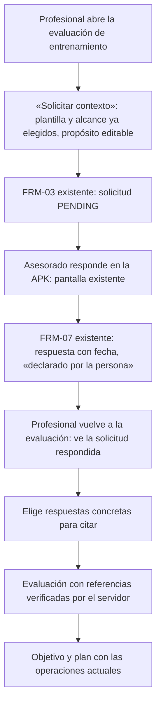

# PF-01 / PF-02 — Ficha: contexto de entrenamiento conectado con la evaluación

> **Estado:** DECISIONES TOMADAS (Dirección, 2026-09-27: D-1 a D-5, registradas como DL-100 a DL-103). La implementación espera la orden de Dirección.
> **Base:** `main` en `13280e6` (2026-09-27), contrastado con el Plan Funcional Profesional v1.1 (`docs/propuestas/BE_Plan_Funcional_Profesional_v1-1.md`, corte `46fd1fa`).
> **Identificadores:** PF, TRN-Q, CA y V son locales al plan. Los anclajes del legajo son **RF-071, UC-P32/UC-P33 (WP-07), WP-06, CAND-10-TRN-A (B10-06 §4), DL-048, DL-095 y DL-009**. Las decisiones nuevas se registran como DL-100 en adelante recién cuando Dirección las apruebe.

```yaml
package: PF-01 + PF-02 (primer incremento)
title: Contexto de entrenamiento conectado con la evaluación
status: decided
baseline_commit: 13280e67ec1a94cac93d8cb4ece62765c116ff39
business_outcome: El profesional de entrenamiento decide con contexto declarado por la persona, con origen y fecha trazables
in_scope:
  - Plantilla «Antecedentes para entrenamiento» con los seis conceptos iniciales
  - «Solicitar contexto» desde la evaluación de entrenamiento, con retorno a la evaluación
  - Citar respuestas concretas como evidencia de la evaluación, verificadas en el servidor
out_of_scope:
  - Selección simple o múltiple (DEC-04), fechas, grupos repetibles y adjuntos
  - Preguntas sensibles (TRN-Q09 a Q12) y cualquier contenido clínico
  - Reutilizar el perfil (profileSourceRef, DL-095) y contenido del perfil propio (DL-009)
  - Nuevas modalidades de entrenamiento, IA, nutrición y antropometría
  - Cambios en la APK: responde cualquier plantilla con los tipos actuales
decisions: [DL-100 (D-1), DL-101 (D-2), DL-102 (D-3), DL-103 (D-4 y D-5)]
acceptance: [CA-FOR-01, CA-FOR-04, CA-FOR-06, CA-FOR-07, CA-TRN-01]
verification: [V-01, V-02, V-06, V-07, V-21]
evidence:
  - Pruebas de integración del flujo y de los permisos afectados
  - Recorrido web (profesional) y en la APK (asesorado), con capturas sobre artefactos identificados
```

## 1 Lo que ya existe y se reutiliza

La capacidad de formularios funciona de punta a punta desde WP-07: el profesional pide en la web, el asesorado responde en la APK y el profesional lee. El legajo ya prevé exactamente este enganche: **CAND-10-TRN-A** (B10-06 §4) propone «Falta información → Solicitar datos» desde la evaluación, con una plantilla «Antecedentes para entrenamiento» (experiencia, disponibilidad, frecuencia, equipamiento…), y recomienda **RATIFICAR**.

| Pieza | Estado en `main` | Dónde |
|---|---|---|
| Plantillas versionadas, solicitud, respuesta y rectificación | Funcionan (FRM-01 a FRM-08) | `contratos-formularios.ts`, `apps/api/src/formularios/` |
| Tipos de campo | Solo `TEXT`, `NUMBER` (número finito, sin rango ni entero) y `BOOLEAN` | `contratos-formularios.ts:29`, `lectura-formularios.ts:67-71` |
| Catálogo de plantillas | Sintético, sembrado por migración: FRM-SALUD y FRM-HABITOS. **No hay plantilla de entrenamiento** | `migrations/20260921220000_…/migration.sql:276-296` |
| Pedido desde la web | Pestaña transversal «Información»: plantilla, campos, requeridos, propósito y alcance | `apps/web/src/app/pro/advisees/forms/pedir.tsx` |
| **Enlace desde la evaluación de entrenamiento** | **No existe** (WP-07.md:185 lo dejó fuera) | `apps/web/src/app/pro/advisees/training/resumen.tsx` |
| Evidencia de la evaluación | `evidenceReferences`: hasta 20 textos **sin validar**; la web siempre manda `[]` | `contratos-entrenamiento.ts:77`, `evaluaciones.service.ts:67`, `resumen.tsx:278` |
| Evidencia tipada | Solo en la **revisión** (`EXECUTION`, `PLAN_VERSION`, `OBJECTIVE_VERSION`, `EVALUATION`); **no hay tipo de respuesta de formulario** | `contratos-nutricion.ts:445-448` |
| Lectura profesional de una respuesta | FRM-05: solo el autor de la solicitud y con el PDP vigente para el alcance de la solicitud; si no, 404 neutral | `solicitudes.service.ts:191-205` |
| Pertinencia por categoría | Matriz 3 × 4 que **permite todo** (DL-095); se evalúa al crear la solicitud | `formularios.ts:69-77`, `solicitudes.service.ts:91-94` |
| Respuesta en la APK | Pantalla genérica: TEXT, NUMBER y selector Sí/No | `apps/mobile/src/pantallas/formularios.tsx` |

## 2 Los seis conceptos: equivalencia y delta

| Concepto (plan) | Existe hoy | Propuesta para el primer incremento | Tipo | Req. |
|---|---|---|---|---|
| Objetivo declarado (TRN-01, TRN-Q01) | No. El objetivo de entrenamiento es del profesional (`contratos-entrenamiento.ts:106`) | `trn_objetivo_declarado` — «Qué te gustaría poder hacer o mejorar con el entrenamiento» · OBJETIVOS_Y_PREFERENCIAS | TEXT | R |
| Experiencia (TRN-02, TRN-Q02) | Parcial: `nivel_de_actividad` (FRM-HABITOS), transversal y ambiguo | `trn_experiencia` — «Qué actividad venís haciendo y desde hace cuánto» · HABITOS_Y_CONTEXTO | TEXT | R |
| Días disponibles (TRN-04, TRN-Q03) | No | `trn_dias_por_semana` — «Cuántos días por semana podrías reservar de manera realista» · unidad «días/semana» · HABITOS_Y_CONTEXTO | NUMBER (1 a 7, entero: DL-101) | R |
| Minutos por sesión (TRN-04, TRN-Q05) | No | `trn_minutos_por_sesion` — «Cuánto tiempo podrías dedicar a cada sesión» · unidad «min» · HABITOS_Y_CONTEXTO | NUMBER (1 a 600, entero: DL-101) | R |
| Equipamiento y lugar (TRN-05, TRN-Q06) | No en BE (wger trae `equipment` en la importación y se descarta) | `trn_lugar_y_equipamiento` — «Dónde entrenarías y con qué equipamiento contás» · HABITOS_Y_CONTEXTO | TEXT (la selección múltiple queda para D-4) | R |
| Preferencias (TRN-06, TRN-Q07) | No | `trn_preferencias` — «Qué actividades disfrutás y cuáles preferís evitar» · OBJETIVOS_Y_PREFERENCIAS | TEXT | O |

- **Plantilla:** `FRM-ENTRENAMIENTO` v1 «Antecedentes para entrenamiento», `domain = ENTRENAMIENTO`, con una sola sección. Seis campos, muy por debajo del tope de 60. Se siembra por una migración de solo agregado, igual que FRM-SALUD y FRM-HABITOS.
- **No es un instrumento clínico ni valida aptitud.** Es contexto declarado por la persona.
- **«No sé» o «Prefiero conversarlo»** no existen hoy como respuesta (V-05). Con los tipos actuales, un campo opcional sin responder queda omitido, y los requeridos se responden con texto. Se documenta como limitación del incremento, no se simula.

## 3 Recorrido propuesto



1. **Solicitar desde la evaluación (CA-FOR-06, V-21).** En la sección de entrenamiento, el botón «Solicitar contexto» abre el pedido existente con la plantilla FRM-ENTRENAMIENTO, el alcance ENTRENAMIENTO y un propósito sugerido («Planificar tu entrenamiento») que el profesional puede editar. Al enviar, vuelve a la evaluación. Usa **FRM-03 sin cambios**: no hay API nueva.
2. **Responder (CA-FOR-01).** La APK ya muestra quién pide y para qué. **No hay cambios en la APK.**
3. **Citar (CA-FOR-04, CA-TRN-01).** En el formulario de evaluación, una sección «Contexto declarado» lista las respuestas de las solicitudes de ENTRENAMIENTO que el profesional puede leer, con fecha. El profesional marca cuáles cita. La evaluación guarda **referencias** a las respuestas, no copias del texto como si fueran observaciones propias.
4. **Leer la evaluación.** Una cita se lee exactamente cuando se lee su evaluación. Las condiciones de la cita (mismo asesorado, Solicitud del mismo profesional, alcance ENTRENAMIENTO) son las de FRM-05, y la evaluación ya exige el PDP de ENTRENAMIENTO. Si se revoca B2 o A3, o se pausa o finaliza el vínculo, la evaluación entera da 404 neutral (V-02): **no hay un aviso por cita**, porque no puede darse el caso de una evaluación legible con una cita ilegible. Si la respuesta se rectificó, se muestra que existe una versión posterior (V-07).
5. **Objetivo y plan:** siguen con TRN-04 a TRN-12 sin cambios. El formulario no crea B2, no acepta vínculos ni cambia el objetivo.

## 4 Deltas por capa

| Capa | Cambio | Tamaño |
|---|---|---|
| Base de datos | Migración de solo agregado: plantilla FRM-ENTRENAMIENTO v1. Si D-3 se aprueba, una columna o una tabla de referencias de la evaluación a respuestas | S / M |
| Dominio (contratos) | DL-101: **sin cambios en las respuestas de FRM** (ver «Compatibilidad»). DL-102: `formResponseReferences[]` (`formResponseId`, `fieldCode`) en la evaluación de entrenamiento, sin tocar `evidenceReferences` | S / M |
| API | Validar las restricciones NUMBER al responder o rectificar. Validar cada referencia citada al crear la evaluación: misma persona, Solicitud del mismo profesional y de alcance ENTRENAMIENTO, campo respondido en la versión vigente, que queda fija. Al leer, la cita se resuelve dentro de la lectura de la evaluación, que ya exige el PDP de ENTRENAMIENTO para ese par. OpenAPI regenerado | M |
| Website | Botón «Solicitar contexto» con retorno; sección «Contexto declarado» en la evaluación; vista de las referencias en el detalle | M |
| APK | **Ninguno en este paquete.** La compatibilidad con la 0.11.x está comprobada por contrato y revisión del código, no en el ambiente desplegado; el mensaje ante un valor fuera de rango queda pendiente (DL-104). Ver «Compatibilidad» | — |
| Servidor desplegado | Sí: cambian API y website | — |

**Compatibilidad con la APK instalada.** Está comprobada **por contrato y por revisión del código** (2026-09-27). **La prueba con la APK respondiendo esta plantilla en el ambiente desplegado sigue pendiente.**
- La APK lee la definición de la plantilla (FRM-02) con esquemas estrictos (`z.strictObject`). Si los campos de FRM-ENTRENAMIENTO trajeran una propiedad nueva, como `minimum`, `maximum` o `integer`, la APK 0.11.x instalada **no podría abrir el formulario**.
- Por eso, en DL-101 las restricciones se guardan en la definición interna de la plantilla y **se validan solo en el servidor** al responder y al rectificar. El rango se le comunica a la persona en el `helpText` del campo («Entre 1 y 7»), que ya existe y se muestra.
- Contrato: la integración de contrato de #100 verifica que FRM-02 de FRM-ENTRENAMIENTO devuelve en cada campo exactamente las seis propiedades del esquema estricto, sin `numberLimits`, y que el cuerpo valida contra ese esquema, que es el que usa la APK.
- Un valor fuera de rango vuelve como `422 FORM_RESPONSE_INVALID` **sin un issue que nombre el campo**: solo trae el código y un mensaje de texto. La APK 0.11.3 no tiene un caso para ese código y muestra el mensaje genérico «El servicio no está disponible en este momento». **La persona no se entera de qué dato corregir ni qué rango se admite**, salvo por el `helpText` que ve antes de responder. Es una limitación de interfaz registrada como **DL-104**, fuera de este paquete y sin APK nueva por ahora.
- La APK **no lee** evaluaciones de entrenamiento, así que DL-102 cambia solo la API y el website, que se despliegan juntos desde el mismo commit.

**Estimación gruesa:** entre tres y cuatro PR (contrato y migración, API, website e integración), sin APK nueva. La estimación fina se hace al aprobar las decisiones.

## 5 Decisiones

> **Decididas por Dirección el 2026-09-27.** D-1: ratificada tal cual (DL-100). D-2: mínimo, máximo y entero; **días de 1 a 7** y minutos de 1 a 600 (DL-101). D-3: opción A (DL-102). D-4 y D-5: solo entrenamiento, equipamiento en texto (DL-103).

### De contenido (Dirección y profesional de entrenamiento: DEC-02)

- **D-1 · Plantilla y textos.** ¿Se ratifica CAND-10-TRN-A con los seis campos, los textos y la obligatoriedad de §2? Recomendación: **sí**. Son preguntas originales de producto, no clínicas; la revisión profesional puede ajustar los textos después con una versión 2 de la plantilla.

### De producto y legajo

- **D-2 · Rango y entero en NUMBER.** Hoy un «días por semana = 9» se acepta. Recomendación: **agregar restricciones opcionales** (`minimum`, `maximum`, `integer`) validadas en el servidor. Es compatible con lo existente, amplía DL-095 y no requiere tipos nuevos.
- **D-3 · Evidencia verificable en la evaluación.** Hay tres opciones:
  - **A (recomendada):** un campo nuevo `formResponseReferences` validado en el servidor.
  - B: reutilizar los textos libres de `evidenceReferences` con una convención. No se valida, así que no cumple CA-FOR-04 de verdad.
  - C: copiar la respuesta como dato `REPORTED` en `assessment`. Confunde la declaración con la observación.
- **D-4 · Equipamiento como texto en este incremento.** La selección simple o múltiple (DEC-04) queda para un paquete propio con catálogo de opciones. Recomendación: **texto ahora**.
- **D-5 · Solo entrenamiento.** Nutrición (F-NUT-01) y antropometría repiten el patrón después, en PF-04 y PF-06. Recomendación: **sí**, validar primero el patrón completo con entrenamiento.

### Técnicas (las resuelvo dentro del paquete aprobado)

- Códigos `trn_*` que cumplen el patrón vigente (`^[a-z][a-z0-9_]{0,63}$`).
- Migración de solo agregado, con procedencia sintética explícita.
- Parámetros de retorno a la evaluación en la navegación de la web.
- Mensajes neutrales reutilizando los existentes.

## 6 Verificación

| ID | Qué se prueba | Nivel |
|---|---|---|
| CA-FOR-01 | El asesorado ve quién pide y para qué antes de responder | APK (existente) y dispositivo |
| CA-FOR-04 / CA-TRN-01 | La evaluación cita respuestas sin copiarlas como observación y el detalle muestra origen y fecha | Integración y website |
| CA-FOR-06 / V-21 | Desde la evaluación se pide contexto y se vuelve a la evaluación | Website |
| CA-FOR-07 | Una respuesta de otro alcance no se puede citar ni leer desde entrenamiento | Integración |
| V-01 | Otro profesional u otro titular no puede citar ni leer la respuesta | Integración |
| V-02 | Si se revoca B2 después de citar, la evaluación entera deja de leerse (404 neutral), así que tampoco se lee lo citado | Integración |
| V-06 | Una solicitud emitida sigue con su versión de plantilla | Integración (existente) |
| V-07 | Una respuesta rectificada después de citarla muestra que tiene sucesora | Integración |
| DL-101 | «0 días», «9 días», «2,5 días» y «-1 min» se rechazan con `422 FORM_RESPONSE_INVALID`. El mensaje comprensible en la APK queda pendiente (DL-104) | Contrato e integración |

**Demostración de salida** (plan §12.3, acotada a este incremento): el profesional solicita el contexto; el asesorado responde en la APK; el profesional vuelve a la evaluación y cita dos respuestas; define objetivo y plan con las operaciones actuales; después se revoca la autorización y la evaluación deja de leerse (404 neutral), sin mostrar lo citado.

## 7 Qué no bloquea

- **PF-00 (DL-096)** quedó **cerrado** el 2026-09-27 con la validación en dispositivo de la APK 0.11.3.
- Este paquete **no toca la APK**, así que no interfiere con la validación en el teléfono.
- Decisiones tomadas; la implementación empieza con la orden de Dirección.
