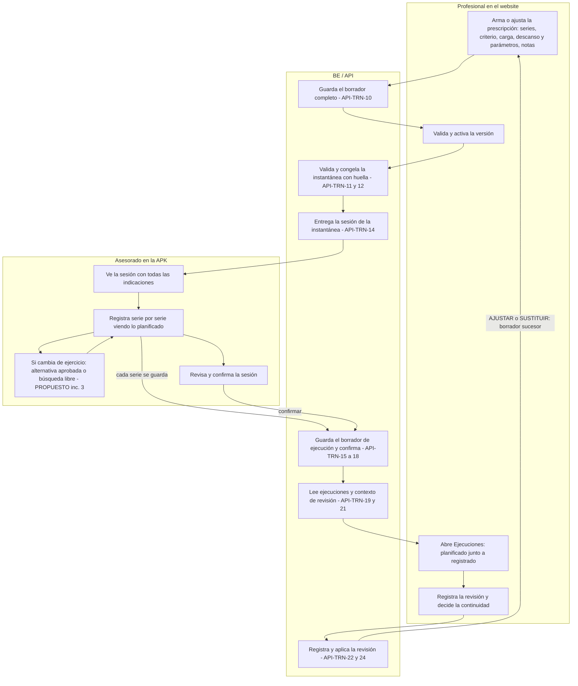
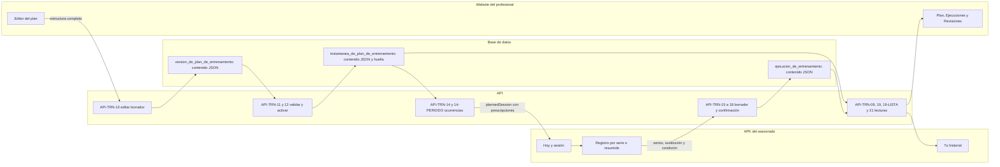
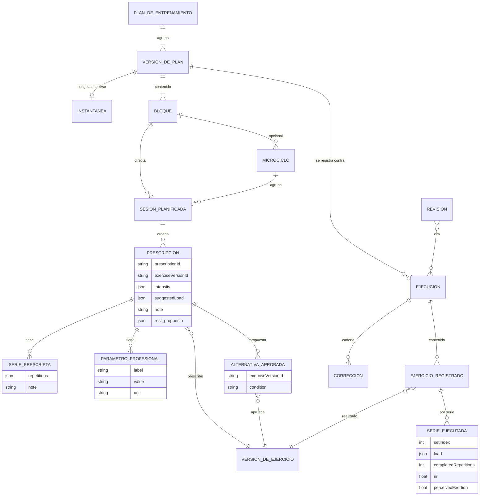
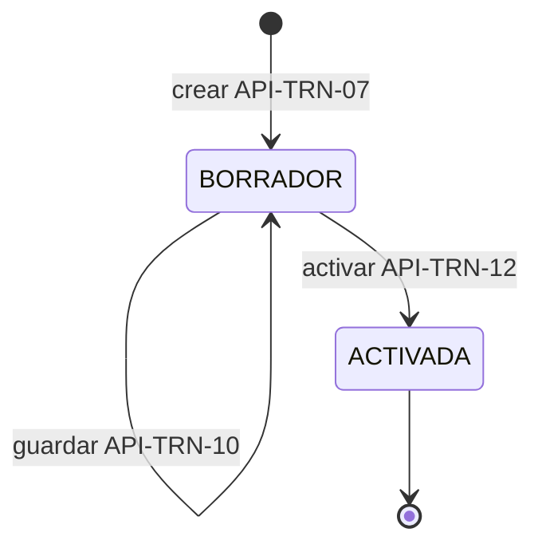
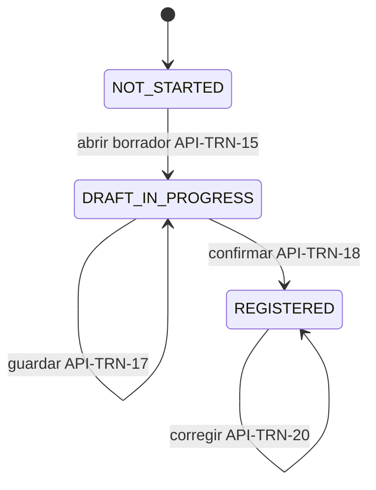

# PF-03 — Ficha: profundización de entrenamiento dentro de fuerza

> **Estado:** PROPUESTA ESPECIFICADA para decisión de Dirección; no implementada.
> **Base:** `main` en `ff2001e` (2026-09-28), contrastado con el Plan Funcional Profesional v1.1 ([`docs/propuestas/BE_Plan_Funcional_Profesional_v1-1.md`](BE_Plan_Funcional_Profesional_v1-1.md), corte `46fd1fa`). La base incluye #100 y #101 de PF-02 (plantilla FRM-ENTRENAMIENTO, límites NUMBER y citas en la evaluación). **No incluye** el #102 (website de PF-02, en auditoría) ni DL-104 (en implementación aparte).
> **Identificadores:**
> - **Locales al plan:** PF-00 a PF-04, TRN-05, TRN-13 a TRN-37, F-TRN-02 (SES-Q01 a SES-Q04), F-TRN-03 (REV-TRN-Q01 a REV-TRN-Q03), CA-TRN-02 a CA-TRN-05, CA-FOR-04, V-05, V-08 a V-16, V-17, DAT-04, DEC-02, DEC-04, DEC-07, DEC-08, DEC-10 y CU-PROP-02.
> - **Locales a esta ficha:** PF03-CU-01 a PF03-CU-08, PF03-CA-01 a PF03-CA-10, PF03-D-1 a PF03-D-9 y PF03-PR-1 a PF03-PR-6. La clave de plantilla `FRM-REVISION-ENTRENAMIENTO` también es local.
> - **Anclajes canónicos del legajo:** RF-040, RF-042, RF-043, RF-045 y RF-046 (04:497-557); UC-P15, UC-P17, UC-E02 y UC-P18 (05:8408, 8908, 9154, 9342); API-TRN-07 a API-TRN-24 (09v10:662-1385), con los desvíos ya declarados API-TRN-14-PERIODO (DL-078) y API-TRN-19-LISTA (DL-096); API-FRM-03 (09:1489); CAND-10-TRN-04, 08, 09, 10 y 14 (B10-06:381, 615, 666, 754, 944); REG-06-111, 112, 117, 128, 129, 130, 134 y 140 (06); TEST-RF-040 a 046, TEST-UC-P17, TEST-UC-P18 y TEST-TRN-001, 003 y 006 (11A).
> - Las decisiones que Dirección apruebe se registran como DL nuevas en [`docs/DEUDA_LEGAJO.md`](../DEUDA_LEGAJO.md), desde el próximo número libre, recién al aprobarlas.

```yaml
package: PF-03
title: Profundización de entrenamiento dentro de fuerza
status: proposed
baseline_commit: ff2001e (main, 2026-09-28)
business_outcome: La persona ve y registra exactamente lo que su profesional planificó, y el profesional revisa lo planificado junto a lo registrado, sin cálculos ni juicios automáticos
in_scope:
  - "Incremento 1 (recomendado): lo planificado, visible y comparable, con el contrato actual, en la web, la APK y la revisión"
  - "Incremento 2 (si se aprueba PF03-D-2): descanso con semántica explícita"
  - "Incremento 3 (si se aprueba PF03-D-4): alternativas preaprobadas por prescripción"
out_of_scope:
  - Cardio, movilidad, circuitos, superseries, duración y distancia (TRN-26, TRN-27; DEC-08)
  - Temporizador de descanso (B10-06 §57, no es P0)
  - Tempo estructurado por fases sin catálogo aprobado (TRN-24; DEC-07)
  - Propuesta de progresión (TRN-28) y cualquier cálculo de RM, volumen, marcas o puntaje
  - Equipamiento, variante, zonas y material didáctico en el catálogo (TRN-14 a TRN-16; DL-081, DL-097, REG-06-134)
  - Duración real (TRN-34) y motivos tipificados con molestia o dolor (TRN-35; dato C4, DL-083)
  - Contexto previo a la sesión (SES-Q01) y registro sin conexión
decisions_required:
  - PF03-D-1 Alcance del primer incremento
  - PF03-D-2 Descanso con semántica
  - PF03-D-3 Tempo
  - PF03-D-4 Alternativas preaprobadas
  - PF03-D-5 Compatibilidad con la APK instalada
  - PF03-D-6 Contexto breve de la sesión (F-TRN-02)
  - PF03-D-7 Revisión con el asesorado (F-TRN-03)
  - PF03-D-8 Contenido y responsable profesional (DEC-02)
  - PF03-D-9 Cobertura formal del paquete
acceptance: [CA-TRN-02, CA-TRN-03, CA-TRN-04, CA-TRN-05, PF03-CA-01 a PF03-CA-10]
verification: [V-08, V-09, V-12, V-14, V-15, V-16]
legajo_anchors:
  rf: [RF-040, RF-042, RF-043, RF-045, RF-046]
  uc: [UC-P15, UC-P17, UC-E02, UC-P18]
  api: [API-TRN-07 a API-TRN-24, API-TRN-14-PERIODO, API-TRN-19-LISTA]
  ux: [CAND-10-TRN-04, CAND-10-TRN-08, CAND-10-TRN-09, CAND-10-TRN-10, CAND-10-TRN-14]
  tests_11a: [TEST-RF-040, TEST-RF-042, TEST-RF-043, TEST-RF-045, TEST-UC-P17, TEST-UC-P18, TEST-TRN-001, TEST-TRN-003, TEST-TRN-006]
evidence:
  - Pruebas unitarias de la presentación de la prescripción y de integración del circuito
  - Recorrido web del profesional y comprobación en la APK, con capturas sobre artefactos identificados
  - Estados implementado, CI, publicado y verificado en teléfono, informados por separado
  - Enlaces a contrato, PR y DL registradas
```

## Cómo leer esta ficha

Cada fila de tabla y cada ítem de lista lleva una de estas tres marcas:

- **EXISTENTE**: está en `main` (`ff2001e`), con enlace al archivo y la línea. Si su forma es provisoria porque la DL que la sostiene sigue abierta, se aclara.
- **APROBADO**: lo fija el legajo aprobado (por ejemplo, el 06 v0.1.1, aprobado por [ACTA-DIR-024](../actas/ACTA_DIR_024_APROBACION_BE_LEG_06_v0.1.1_Y_AUTORIZACION_BE_LEG_08_v0.1.5_2026-09-07.md)) o una decisión de Dirección registrada como DL decidida. El material de entrenamiento del 05 v0.15 y de B10-06 cuenta como aprobado **para implementar** por [DL-074](../DEUDA_LEGAJO.md) (opción A: se implementa y se declara).
- **PROPUESTO**: lo propone el plan («del plan») o esta ficha («de la ficha»). Requiere decisión de Dirección y, si es contenido profesional, revisión del profesional designado (DEC-02).

**Citas.** El código se cita como `ruta:línea`, relativa a la raíz del repo, y el enlace funciona desde `docs/propuestas/`. Los documentos del legajo usan siglas:

| Sigla | Documento |
|---|---|
| 04 | [`docs/legajo/04_BE_LEG_04_v0.4.2.1.md`](../legajo/04_BE_LEG_04_v0.4.2.1.md) |
| 05 | [`docs/legajo/05_BE_LEG_05_v0.15.md`](../legajo/05_BE_LEG_05_v0.15.md) |
| 06 | [`docs/legajo/06_BE_LEG_06_v0.1.1.md`](../legajo/06_BE_LEG_06_v0.1.1.md) |
| 08 | [`docs/legajo/08_BE_LEG_08_v0.1.5.md`](../legajo/08_BE_LEG_08_v0.1.5.md) |
| 09 | [`docs/legajo/09_BE_LEG_09_v0.16.1.md`](../legajo/09_BE_LEG_09_v0.16.1.md) |
| 09v10 | [`docs/legajo/09_AUX/BE_LEG_09_v0.10_CONTRATOS_P0_ENTRENAMIENTO_2026-08-31.md`](../legajo/09_AUX/BE_LEG_09_v0.10_CONTRATOS_P0_ENTRENAMIENTO_2026-08-31.md) |
| B10-06 | [`docs/legajo/10_UX/BE_LEG_10_v0.6_B10_06_ENTRENAMIENTO_UX_P0_TOBE_2026-08-31(1).md`](../legajo/10_UX/BE_LEG_10_v0.6_B10_06_ENTRENAMIENTO_UX_P0_TOBE_2026-08-31%281%29.md) |
| 11A | [`docs/legajo/11A_BE_LEG_11A_v1.0-H.md`](../legajo/11A_BE_LEG_11A_v1.0-H.md) |
| PFP | [`docs/propuestas/BE_Plan_Funcional_Profesional_v1-1.md`](BE_Plan_Funcional_Profesional_v1-1.md) |
| DL | [`docs/DEUDA_LEGAJO.md`](../DEUDA_LEGAJO.md) (las líneas de cada DL están en «Fuentes») |

## a. Resultado para el usuario y problema que resuelve

### Resultado

- **El asesorado** ve en la APK exactamente lo que su profesional planificó: cada serie con sus repeticiones, el criterio con su referencia, la carga sugerida, el descanso y los demás parámetros, las notas y las indicaciones de la sesión. Mientras registra, ve lo planificado para cada serie.
- **El profesional** revisa, ejercicio por ejercicio y serie por serie, lo planificado junto a lo registrado. No hay porcentajes, colores de error ni calificaciones.
- **En incrementos siguientes, si Dirección los aprueba:** un descanso con significado estable y alternativas que el profesional aprueba de antemano. La persona las elige con un toque, y el profesional las distingue de una sustitución libre sin tratar ninguna como error.

### Problema, verificado en `main`

1. **La APK no muestra buena parte de lo que el profesional planificó.** El resumen de la prescripción usa solo las repeticiones de la primera serie: una pirámide 10/8/6 aparece como «3 × 10» ([`apps/mobile/src/pantallas/entrenamiento.tsx:56-67`](../../apps/mobile/src/pantallas/entrenamiento.tsx#L56-L67)). No muestra «Descanso / parámetros», la nota de la prescripción, la nota por serie ni la referencia del %RM. El mismo resumen reducido se usa en «Hoy» ([`entrenamiento.tsx:199-217`](../../apps/mobile/src/pantallas/entrenamiento.tsx#L199-L217)), en la sesión ([`entrenamiento.tsx:621-622`](../../apps/mobile/src/pantallas/entrenamiento.tsx#L621-L622)) y en «Tu historial» ([`apps/mobile/src/pantallas/historial.tsx:158`](../../apps/mobile/src/pantallas/historial.tsx#L158)). Esto choca con **RF-042**: «consultar desde Hoy la sesión planificada vigente y sus indicaciones» (04:515-520). También con **RF-040**, cuya verificación de aceptación dice «unidades y parámetros son interpretables» (04:502), y con el paso 6 de UC-P17, «BE muestra la prescripción aplicable» (05:8992).
2. **La web muestra todo, salvo la nota por serie.** El plan detalla cada serie cuando difieren, la intensidad con su referencia, la carga, los parámetros y la nota de la prescripción ([`apps/web/src/app/pro/advisees/training/plan.tsx:148-169`](../../apps/web/src/app/pro/advisees/training/plan.tsx#L148-L169)); la nota por serie no se usa (punto 5). El código documenta esa vista como «la versión activada tal como la ve el asesorado» (comentario en [`plan.tsx:187`](../../apps/web/src/app/pro/advisees/training/plan.tsx#L187); no es un rótulo en pantalla). Hoy la APK no muestra lo mismo.
3. **Mientras registra por serie, la persona no ve cuántas repeticiones le tocan.** Las series pendientes dicen solo «Serie 2: Pendiente» ([`entrenamiento.tsx:643-646`](../../apps/mobile/src/pantallas/entrenamiento.tsx#L643-L646)). Las indicaciones de la sesión aparecen en la tarjeta de «Hoy», pero no en la pantalla de la sesión ([`entrenamiento.tsx:210`](../../apps/mobile/src/pantallas/entrenamiento.tsx#L210)).
4. **El profesional no puede comparar en un solo lugar.** El detalle de una ejecución muestra lo planificado como «ejercicio · N series», sin repeticiones, intensidad ni parámetros ([`apps/web/src/app/pro/advisees/training/ejecuciones.tsx:178-183`](../../apps/web/src/app/pro/advisees/training/ejecuciones.tsx#L178-L183)). **RF-045** pide comparar «lo planificado con lo ejecutado» (04:542-548).
5. **La nota por serie existe en el contrato, pero nadie la escribe ni la ve.** Está en [`packages/domain/src/contratos-entrenamiento.ts:194`](../../packages/domain/src/contratos-entrenamiento.ts#L194) y el editor la transporta al guardar ([`apps/web/src/app/pro/advisees/training/editor.tsx:50`](../../apps/web/src/app/pro/advisees/training/editor.tsx#L50)). Sin embargo, no tiene campo en el editor ([`editor.tsx:443-470`](../../apps/web/src/app/pro/advisees/training/editor.tsx#L443-L470)) ni aparece en ninguna pantalla.
6. **El descanso no tiene significado propio, el tempo no existe y no hay alternativas preaprobadas.** El descanso es un par libre rótulo–valor–unidad ([`contratos-entrenamiento.ts:200-205`](../../packages/domain/src/contratos-entrenamiento.ts#L200-L205)). Lo único que existe para cambiar de ejercicio es la sustitución libre en la ejecución ([`contratos-entrenamiento.ts:491-505`](../../packages/domain/src/contratos-entrenamiento.ts#L491-L505)).

### Qué pidió Dirección y dónde queda

| Tema | Qué hay hoy | Qué falta | Qué propone esta ficha |
|---|---|---|---|
| Instrucciones de ejecución | **EXISTENTE**: indicaciones de la sesión (hasta 2000 caracteres), nota de la prescripción (1000) y nota por serie (200) en el contrato ([`contratos-entrenamiento.ts:194, 226, 231`](../../packages/domain/src/contratos-entrenamiento.ts#L194)) | La APK no muestra las notas; la nota por serie no se edita; el catálogo no tiene explicación técnica por ejercicio | **PROPUESTO** (inc. 1): mostrar todo y editar la nota por serie. El material por ejercicio queda fuera: exige licencia y versión (**APROBADO**: REG-06-134, 06:4808-4817) y contenido revisado (DEC-07) |
| Descanso | **EXISTENTE** como parámetro libre «Descanso / parámetros» ([`packages/domain/src/copy-entrenamiento.ts:101`](../../packages/domain/src/copy-entrenamiento.ts#L101); forma provisoria de [DL-088](../DEUDA_LEGAJO.md), punto 10) | La APK no lo muestra; no tiene significado estable (TRN-23, PFP:272) | **PROPUESTO**: inc. 1 lo muestra y suma un atajo en el editor; inc. 2 le da semántica (PF03-D-2) |
| Tempo | **EXISTENTE** solo como parámetro libre de texto ([`copy-entrenamiento.ts:101`](../../packages/domain/src/copy-entrenamiento.ts#L101)) | Fases con significado (TRN-24, PFP:273) | **PROPUESTO**: texto explicado con ayuda en el editor. Las fases, solo con catálogo aprobado (PF03-D-3) |
| Equipamiento | **EXISTENTE / APROBADO** como respuesta del asesorado: `trn_lugar_y_equipamiento`, texto requerido ([DL-100](../DEUDA_LEGAJO.md), [DL-103](../DEUDA_LEGAJO.md)). wger lo trae en el candidato y se descarta al importar ([`apps/api/src/entrenamiento/importacion.service.ts:115-134`](../../apps/api/src/entrenamiento/importacion.service.ts#L115-L134)) | El catálogo no tiene equipamiento ni variante ([`prisma/schema.prisma:1661-1676`](../../prisma/schema.prisma#L1661-L1676)) | **PROPUESTO** de la ficha: usar lo declarado para elegir ejercicios y alternativas. Equipamiento en el catálogo (**PROPUESTO del plan**, TRN-15): fuera (DEC-07; [DL-097](../DEUDA_LEGAJO.md)) |
| Alternativas preaprobadas | Solo la sustitución libre (**APROBADO**: REG-06-130, 06:5439-5446) | La relación entre una prescripción y sus sustitutos aprobados (TRN-25, PFP:274) | **PROPUESTO**: inc. 3 (PF03-D-4) |
| Registro de lo realizado | **EXISTENTE** completo: por serie o resumido, condición, sustitución, borrador, confirmación y corrección | Ver lo planificado mientras se registra; dificultad y mensaje de la sesión (F-TRN-02) | **PROPUESTO**: inc. 1 lo primero; F-TRN-02 en PF03-D-6 |
| Revisión profesional | **EXISTENTE**: API-TRN-21 a 24 | Ejecuciones reduce lo planificado; no hay respuesta del asesorado para la revisión (F-TRN-03) | **PROPUESTO**: inc. 1 muestra lo planificado completo; F-TRN-03 en PF03-D-7 |

**Lo que funciona y no se toca.** Estas piezas son **EXISTENTES**, y varias además **APROBADAS**:
- el criterio cerrado de intensidad (REG-06-128/129);
- la sustitución que conserva las dos puntas ([`apps/api/src/entrenamiento/lectura-entrenamiento.ts:251-270`](../../apps/api/src/entrenamiento/lectura-entrenamiento.ts#L251-L270); REG-06-130);
- la separación entre borrador y ejecución registrada;
- la corrección con autoría;
- los seis resultados de revisión, sin séptimo (REG-06-117);
- la instantánea con huella.

PF-03 se apoya en todo eso y no lo reescribe.

## b. Recorrido del profesional y del asesorado



1. **Planificar (EXISTENTE; dos agregados PROPUESTOS en el inc. 1).** El profesional arma la prescripción en el editor que ya existe. Suma la nota por serie y un atajo «Agregar descanso», que precarga el rótulo y la unidad. Guarda, valida y activa con API-TRN-10 a 12 sin cambios.
2. **Consultar (PROPUESTO, inc. 1).** «Hoy» ([`contratos-entrenamiento.ts:439-456`](../../packages/domain/src/contratos-entrenamiento.ts#L439-L456)) ya trae la prescripción completa dentro de `plannedSession` (DL-079). **Solo cambia lo que la APK muestra.**
3. **Registrar (EXISTENTE; lo planificado por serie es PROPUESTO en el inc. 1).** Lo planificado se muestra y **no se precarga como realizado**: «el usuario confirma/edita el valor real. No autocompletar sin visibilidad» (B10-06:1242-1255). Registrar una serie sigue siendo carga, repeticiones, RIR opcional y guardar (B10-06:1225-1240).
4. **Sustituir (EXISTENTE la sustitución libre; alternativa aprobada PROPUESTA en el inc. 3).**
5. **Revisar (EXISTENTE; lo planificado completo en Ejecuciones es PROPUESTO en el inc. 1).** La ejecución ya trae `plannedSession` con cada prescripción ([`contratos-entrenamiento.ts:618`](../../packages/domain/src/contratos-entrenamiento.ts#L618)): el website solo tiene que mostrarla.
6. **Continuidad (EXISTENTE; APROBADO).** AJUSTAR o SUSTITUIR crean un borrador sucesor desde la instantánea ([`apps/api/src/entrenamiento/revisiones.service.ts:320-345`](../../apps/api/src/entrenamiento/revisiones.service.ts#L320-L345)). La versión efectiva no cambia hasta que el profesional activa (CA-TRN-05; REG-06-117).

## c. Casos de uso

Cada caso lleva un ID local de la ficha. Los anclajes del legajo van al lado.

### PF03-CU-01 — Planificar con indicaciones completas (profesional, website)

**Marca:** EXISTENTE, con dos agregados PROPUESTOS del inc. 1. **Anclaje:** UC-P15 (05:8408), RF-040, CAND-10-TRN-04 (B10-06:381-394).

- **Precondiciones:**
  - profesional con ENTRENAMIENTO verificado y habilitado;
  - PDP favorable (vínculo aceptado, B2 y A3 vigentes);
  - objetivo efectivo (API-TRN-06);
  - borrador abierto (API-TRN-07; uno por plan).
- **Camino normal:**
  1. Agrega un bloque, un microciclo opcional y una sesión con sus indicaciones.
  2. Elige un ejercicio del catálogo.
  3. Escribe las repeticiones de cada serie: un número o un rango.
  4. Elige el criterio (%RM o RIR, o ninguno) y el objetivo. Con %RM, puede escribir la referencia.
  5. Carga sugerida opcional.
  6. **PROPUESTO:** «Agregar descanso» precarga el rótulo «Descanso» y la unidad «s», y el profesional escribe el valor. Puede sumar otros parámetros libres, por ejemplo un tempo explicado con palabras.
  7. Nota de la prescripción y, **PROPUESTO**, nota por serie.
  8. Guarda (API-TRN-10), valida (API-TRN-11) y activa (API-TRN-12).
- **Alternativas:**
  - sin criterio de intensidad: es legítimo ([DL-088](../DEUDA_LEGAJO.md), punto 8);
  - series sin repeticiones fijadas;
  - un parámetro de texto («60 a 90»);
  - sucesora desde la versión efectiva (`basedOnPlanId`, [DL-047](../DEUDA_LEGAJO.md)).
- **Errores:**
  - parámetro numérico sin unidad → `400 INVALID_REQUEST` con la ruta ([DL-088](../DEUDA_LEGAJO.md), punto 15);
  - RPE o dos criterios juntos → `422 INTENSITY_CRITERION_INVALID` con su motivo ([`packages/domain/src/plan-de-entrenamiento.ts:84-128`](../../packages/domain/src/plan-de-entrenamiento.ts#L84-L128));
  - versión desactualizada → `409` (V-08);
  - segundo borrador → `409`;
  - ejercicio no disponible → issue `EXERCISE_NOT_AVAILABLE` al validar;
  - otro profesional con plan activo → `409 ACTIVE_PLAN_CONFLICT`.
- **Resultado:** versión activada con instantánea y huella. Lo planificado queda congelado (REG-06-104, 105 y 112).

### PF03-CU-02 — Consultar la sesión con todas sus indicaciones (asesorado, APK)

**Marca:** EXISTENTE la consulta; mostrar todo es PROPUESTO (inc. 1). **Anclaje:** UC-P17, flujo de consulta (05:8986-8993), RF-042, CAND-10-TRN-08.

- **Precondiciones:** sesión válida; versión activada; PDP favorable sobre el profesional del plan.
- **Camino normal:**
  1. La persona abre Entrenamiento.
  2. «Hoy» (API-TRN-14) muestra una tarjeta por sesión con:
     - bloque, microciclo y estado;
     - cada ejercicio con la prescripción completa: series como se planificaron, criterio y referencia, carga sugerida, descanso y parámetros, y notas;
     - las indicaciones de la sesión.
  3. Puede irse sin registrar.
- **Alternativas:**
  - «Registrar otro día»: API-TRN-14-PERIODO, hasta 31 días ([DL-078](../DEUDA_LEGAJO.md));
  - planes en «Tu historial»: API-TRN-08 y 09, con solo A3 ([DL-089](../DEUDA_LEGAJO.md), [DL-096](../DEUDA_LEGAJO.md));
  - una prescripción sin parámetros ni notas no muestra rótulos vacíos.
- **Errores:**
  - `NOT_AVAILABLE` (acceso suspendido) y `NO_ACTIVE_PLAN`, con los mensajes que ya existen;
  - con la APK 0.11.3 la persona sigue viendo el resumen reducido, **sin que nada se rompa**, porque el contrato no cambia.
- **Resultado:** no se crea evidencia (UC-P17 V03, 05:9023-9027).

### PF03-CU-03 — Registrar la sesión viendo lo planificado (asesorado, APK)

**Marca:** EXISTENTE el registro; lo planificado por serie es PROPUESTO (inc. 1). **Anclaje:** UC-P17, flujo de registro, RF-043, CAND-10-TRN-09 (B10-06:664-685).

- **Precondiciones:** las de PF03-CU-02, con una ocurrencia identificable ([DL-077](../DEUDA_LEGAJO.md)).
- **Camino normal:**
  1. «Comenzar sesión» (API-TRN-15). La persona elige cómo registrar: por serie o resumido.
  2. Cada ejercicio muestra «Planificado» completo, y cada serie pendiente muestra lo planificado para esa serie (**PROPUESTO**).
  3. La persona registra:
     - la carga, precargada con la anterior o con la sugerida y con la unidad a la vista ([`entrenamiento.tsx:583-590`](../../apps/mobile/src/pantallas/entrenamiento.tsx#L583-L590));
     - las repeticiones;
     - RIR y esfuerzo, opcionales.
     Cada serie se guarda en el borrador (API-TRN-17).
  4. Elige la condición y, si quiere, escribe el motivo.
  5. Revisa y confirma (API-TRN-18).
- **Alternativas:**
  - registro resumido por ejercicio o por sesión;
  - «No pude realizarla»: `NOT_COMPLETED`, sin datos;
  - sustitución libre;
  - registro en diferido, con la hora declarada;
  - retomar un borrador.
- **Errores:**
  - `SET_WITHOUT_DATA`;
  - `PERFORMED_EXERCISE_INVALID`;
  - `409 EXECUTION_ALREADY_REGISTERED`;
  - conflicto de versión del borrador;
  - `OCCURRED_AT_REQUIRED`;
  - acceso revocado: se niegan las operaciones nuevas.
- **Resultado:** una ejecución inmutable por ocurrencia (REG-06-115), con su granularidad (REG-06-132). Lo planificado no cambia (TEST-TRN-001).

### PF03-CU-04 — Revisar lo planificado junto a lo registrado (profesional, website)

**Marca:** EXISTENTE; lo planificado completo en Ejecuciones es PROPUESTO (inc. 1). **Anclaje:** UC-P18 (05:9342), RF-045, RF-046, CAND-10-TRN-14 (B10-06:942-968).

- **Precondiciones:** PDP favorable. Para registrar la revisión, un Proceso ABIERTO.
- **Camino normal:**
  1. En Ejecuciones, el profesional elige el período y abre un detalle. Por ejercicio ve:
     - lo planificado completo: series, criterio, carga, descanso, parámetros y notas;
     - lo registrado: series, sustitución, resúmenes y corrección vigente.
  2. En Revisiones, abre el contexto (API-TRN-21), elige la evidencia, interpreta, elige el resultado y escribe el fundamento y la próxima acción (API-TRN-22).
  3. Aplica la revisión (API-TRN-24). Si es AJUSTAR o SUSTITUIR, se crea un borrador sucesor. La versión efectiva no cambia hasta activarlo (CA-TRN-05).
- **Alternativas:**
  - período sin registros: «Sin registro», nunca «no realizada» (V-16; [`copy-entrenamiento.ts:187-193`](../../packages/domain/src/copy-entrenamiento.ts#L187-L193));
  - corrección posterior, visible con autor y rol;
  - MANTENER, REPROGRAMAR, CAMBIAR_OBJETIVO o FINALIZAR.
- **Errores:**
  - `404` neutral si se revocó B2 o A3 o se pausó el vínculo;
  - `422 CONTINUITY_ACTION_NOT_APPLICABLE` si ya hay un borrador o el Proceso está cerrado ([`revisiones.service.ts:312-341`](../../apps/api/src/entrenamiento/revisiones.service.ts#L312-L341));
  - un séptimo resultado → `422 REVIEW_RESULT_INVALID`.
- **Resultado:** revisión inmutable con su evidencia y, si corresponde, una versión sucesora.

### PF03-CU-05 — Planificar y ver un descanso con significado explícito

**Marca:** PROPUESTO de la ficha (inc. 2; PF03-D-2). **Anclaje:** RF-040; REG-06-111 («su unidad y significado deben ser identificables», 06:5131); TRN-23.

- **Precondiciones:** las de PF03-CU-01. La APK con el contrato nuevo tiene que estar instalada antes de habilitar la edición (PF03-D-5).
- **Camino normal:**
  1. En la prescripción, «Descanso entre series»: un valor en segundos o un rango (desde–hasta).
  2. Se guarda en su propio campo y se congela al activar.
  3. La APK lo muestra como «Descanso: 90 s» o «Descanso: 60 a 90 s», en «Hoy», en la sesión y entre series.
- **Alternativas:**
  - sin descanso: no se muestra nada, ni un valor por defecto;
  - si ya había un parámetro libre «Descanso», **el profesional** decide pasarlo al campo nuevo. BE no lo convierte solo: «no parsear notas libres» (PFP:272).
- **Errores:** rango invertido, valor no entero o valor no positivo → `400` con la ruta (validación de forma, [DL-088](../DEUDA_LEGAJO.md), punto 15).
- **Resultado:** descanso con unidad y significado estables. Las versiones anteriores se siguen leyendo igual, sin el campo.

### PF03-CU-06 — Alternativas preaprobadas

**Marca:** PROPUESTO del plan (TRN-25, PFP:274); la forma es PROPUESTA de la ficha (inc. 3; PF03-D-4). **Anclaje:** CAND-10-TRN-10 (B10-06:752-782), REG-06-130, INV-06-140, TEST-TRN-003.

- **Precondiciones:**
  - las de PF03-CU-01;
  - las alternativas salen del catálogo que el profesional puede citar y están disponibles;
  - la APK con el contrato nuevo está instalada.
- **Camino normal del profesional:**
  1. En la prescripción, «Alternativas aprobadas»: busca y agrega ejercicios, cada uno con una condición opcional («Si la barra está ocupada»).
  2. Valida y activa. Los nombres quedan congelados en la instantánea.
- **Camino normal del asesorado:**
  1. En la sesión, «Sustituir ejercicio» muestra primero «Alternativas que aprobó tu profesional», con su condición.
  2. Elige una. Queda registrada como sustitución (`performedExerciseVersionId`). Qué series, criterio y carga rigen para la alternativa **no lo fija esta ficha**: es contenido profesional pendiente (PF03-D-8).
- **Alternativas:**
  - la prescripción no tiene alternativas aprobadas: «Sustituir ejercicio» abre directamente la búsqueda libre de hoy ([`entrenamiento.tsx:681-700`](../../apps/mobile/src/pantallas/entrenamiento.tsx#L681-L700));
  - la persona prefiere «Buscar otro ejercicio» aunque haya alternativas: es la sustitución libre, sigue permitida (REG-06-130) y se marca «Sustituido»;
  - cambia de alternativa, o vuelve al ejercicio prescripto, antes de confirmar: el borrador se guarda de nuevo (API-TRN-17). Después de confirmar, solo con una corrección (API-TRN-20);
  - la alternativa se retira del catálogo después de activar: la instantánea no cambia (CA-TRN-03) y el registro la sigue aceptando, porque `citables` no filtra por disponibilidad ([`catalogo.service.ts:132-145`](../../apps/api/src/entrenamiento/catalogo.service.ts#L132-L145); [`ejecuciones.service.ts:763-764`](../../apps/api/src/entrenamiento/ejecuciones.service.ts#L763-L764)). **PROPUESTO** de la ficha: se sigue ofreciendo, como el ejercicio prescripto.
- **Revisión:** Ejecuciones muestra «Planificado: Press de banca · Ejecutado: Press con mancuernas», con la marca «Alternativa aprobada» o «Sustituido» si la sustitución fue libre. Ninguna de las dos se presenta como error (PFP:295).
- **Errores:**
  - alternativa inexistente o ajena → `EXERCISE_REFERENCE_INVALID` al validar;
  - alternativa retirada antes de activar → `EXERCISE_NOT_AVAILABLE` al validar;
  - alternativa repetida o igual al ejercicio prescripto → issue propio (nombre a fijar);
  - con la APK vieja: ver PF03-D-5.
- **Resultado:** se cumple CA-TRN-02 y la instantánea no se toca (INV-06-140).

### PF03-CU-07 — Contexto breve al cerrar la sesión (F-TRN-02)

**Marca:** PROPUESTO del plan (PFP:512-526; PF03-D-6).

- **Precondiciones:** un borrador en curso.
- **Camino normal:**
  1. Al revisar antes de confirmar, aparecen dos preguntas opcionales: cómo le resultó la sesión frente a lo que esperaba, y qué quiere que revise su profesional.
  2. Las respuestas se confirman junto con la ejecución.
- **Alternativas:**
  - no responde: el dato queda ausente, **nunca** «Parecida» por defecto;
  - corrige después con API-TRN-20.
- **Errores:** un valor fuera de las opciones → `422` propio.
- **Resultado:** contexto declarado por la persona, visible en Ejecuciones y en el contexto de revisión, sin puntaje. No reemplaza el RIR ni el esfuerzo por serie (PFP:523).

### PF03-CU-08 — Revisión con lo que cuenta el asesorado (F-TRN-03) y cambio de disponibilidad

**Marca:** PROPUESTO del plan (PFP:528-535; CU-PROP-02, PFP:804; PF03-D-7).

- **Precondiciones:**
  - el #102 integrado, para citar desde la evaluación en la web;
  - la plantilla de revisión aprobada (DEC-02);
  - un Proceso abierto.
- **Camino normal (opción B de PF03-D-7):**
  1. El profesional pide F-TRN-03 con FRM-03, alcance ENTRENAMIENTO.
  2. La persona responde en la pantalla genérica de formularios, que ya existe.
  3. El profesional registra una evaluación nueva que cita las respuestas ([DL-102](../DEUDA_LEGAJO.md)).
  4. La revisión cita esa evaluación con la evidencia `EVALUATION`, que API-TRN-22 ya admite ([`packages/domain/src/contratos-nutricion.ts:445-448`](../../packages/domain/src/contratos-nutricion.ts#L445-L448)).
  5. Si cambió la disponibilidad o el equipamiento, AJUSTAR crea un borrador sucesor. Lo registrado antes no cambia.
- **Alternativas:**
  - la persona no responde: la solicitud queda PENDING y la revisión se registra igual;
  - la persona rectifica después: la cita lo muestra con `laterVersionExists`.
- **Errores:**
  - `404` neutral si se revoca el acceso;
  - plantilla pedida con otro alcance (hallazgo sobre FRM-03 en §i).
- **Resultado:** la revisión se apoya en respuestas citadas y verificables, sin copiarlas como observación propia (CA-FOR-04).

## d. Diccionario de campos

**Notas de la tabla**, para no repetir texto en cada fila:

- **N1 (versionado del plan):** el campo vive en `contenido` del borrador ([`prisma/schema.prisma:1794`](../../prisma/schema.prisma#L1794)) y se congela en la instantánea con huella SHA-256 al activar ([`schema.prisma:1821-1832`](../../prisma/schema.prisma#L1821-L1832)). Después no se edita: se cambia con una sucesora (REG-06-104, 105 y 112). Fecha de vigencia: desde la activación hasta la de su sucesora.
- **N2 (prescripción):**
  - **Captura:** el profesional, en el editor web (API-TRN-10).
  - **Lectura:** el profesional (API-TRN-08 y 09, PDP) y el asesorado en «Hoy», el período, la ejecución y el historial (API-TRN-14, 14-PERIODO, 19, 19-LISTA y 09).
  - **Rectificación:** no hay; se hace una versión sucesora.
- **N3 (ejecución):**
  - **Captura:** el asesorado, en el borrador (API-TRN-17), y confirma (API-TRN-18).
  - **Lectura:** el titular con A3 ([DL-089](../DEUDA_LEGAJO.md)) y el profesional del plan con PDP. El borrador lo ve solo el titular ([`apps/api/src/entrenamiento/ejecuciones.service.ts:689-698`](../../apps/api/src/entrenamiento/ejecuciones.service.ts#L689-L698)).
  - **Rectificación:** corrección con motivo (API-TRN-20), por el asesorado o por el profesional, con autor y rol. La regla es provisoria: [DL-076](../DEUDA_LEGAJO.md) sigue abierta.
- **N4 (fechas de la ejecución):**
  - fecha civil de la ocurrencia en Buenos Aires;
  - `occurredAt` declarada o tomada del borrador si es el mismo día, nunca inventada ([DL-088](../DEUDA_LEGAJO.md), punto 6);
  - `recordedAt` del servidor.

| Concepto | Equivalente existente | Marca | Quién lo declara o registra | Finalidad concreta | Tipo, unidad y validaciones | Obligatoriedad y significado de la ausencia | Fecha, vigencia, procedencia y versionado | Captura / lectura / rectificación |
|---|---|---|---|---|---|---|---|---|
| Indicaciones de la sesión (TRN-18) | `SesionPlanificada.instructions` ([`contratos-entrenamiento.ts:231, 280`](../../packages/domain/src/contratos-entrenamiento.ts#L231)) | **EXISTENTE**. Mostrarlas en la pantalla de sesión: **PROPUESTO** (inc. 1) | Profesional | Lo que vale para toda la sesión (entrada en calor, orden) | Texto de hasta 2000 caracteres | Opcional. Ausente = sin indicaciones | N1 | N2. Hoy la APK las muestra en «Hoy» y en el historial, no en la sesión |
| Series y repeticiones planificadas (TRN-19) | `sets[].repetitions` ([`contratos-entrenamiento.ts:188-194, 220`](../../packages/domain/src/contratos-entrenamiento.ts#L188-L194)) | **EXISTENTE**. **APROBADO** que BE no fija cuántas (09v10:339; INV-06-143) | Profesional | Qué hacer en cada serie | Hasta 20 series. Cada una: entero de 1 a 1000, rango `min ≤ max` o `null` | `null` = «sin repeticiones fijadas», nunca 0 | N1 | N2. La APK hoy resume con la primera serie: defecto que corrige el inc. 1 |
| Nota por serie (TRN-19) | `sets[].note` ([`contratos-entrenamiento.ts:194, 261`](../../packages/domain/src/contratos-entrenamiento.ts#L194)) | **EXISTENTE** en el contrato. Edición y lectura: **PROPUESTO** (inc. 1) | Profesional | Aclarar una serie puntual | Texto de hasta 200 caracteres | Opcional. Ausente = sin nota | N1 | N2. Hoy no se edita ni se muestra |
| Criterio e intensidad (TRN-20) | `intensity` ([`contratos-entrenamiento.ts:212-215, 257-260`](../../packages/domain/src/contratos-entrenamiento.ts#L212-L215)) | **EXISTENTE**; **APROBADO** (REG-06-128 y 129) | Profesional | Cómo dosificar el esfuerzo | `PERCENT_RM` en (0, 100] o `RIR` en [0, 10]. RPE o dos criterios → `422` | `null` = sin criterio, legítimo | N1 | N2 |
| Referencia del %RM (TRN-21) | `intensity.target.reference.description` ([`contratos-entrenamiento.ts:214`](../../packages/domain/src/contratos-entrenamiento.ts#L214)) | **EXISTENTE** como texto. Fuente, fecha y método estructurados: **PROPUESTO del plan**, fuera (DEC-07) | Profesional | Saber sobre qué RM se aplica el porcentaje | Texto de hasta 500 caracteres. BE no calcula el RM (REG-06-129) | Opcional. Ausente = no declarada | N1 | N2. La APK hoy no la muestra |
| Carga sugerida (TRN-22) | `suggestedLoad` ([`contratos-entrenamiento.ts:67, 224`](../../packages/domain/src/contratos-entrenamiento.ts#L67)) | **EXISTENTE**; **APROBADO** como complemento, no como criterio (REG-06-129) | Profesional | Punto de partida de carga | Número ≥ 0, en kg o lb | `null` = sin sugerencia | N1 | N2. Precarga el campo en la APK, visible y editable |
| Descanso y parámetros (TRN-23 hoy) | `professionalParameters[]` ([`contratos-entrenamiento.ts:200-205, 225`](../../packages/domain/src/contratos-entrenamiento.ts#L200-L205)) | **EXISTENTE**, forma provisoria ([DL-088](../DEUDA_LEGAJO.md), punto 10; [DL-080](../DEUDA_LEGAJO.md) abierta). Mostrarlos en la APK: **PROPUESTO** (inc. 1) | Profesional | Descanso u otro parámetro que el profesional quiera indicar | Hasta 12. Rótulo de hasta 60 caracteres; valor de texto (hasta 120) o número; unidad (hasta 20) obligatoria si el valor es número | Opcional. Ausente = no indicado. BE no pone valores por defecto (09v10:339) | N1 | N2 |
| Atajo «Agregar descanso» | Ninguno | **PROPUESTO** de la ficha (inc. 1) | Profesional | Cargar el descanso más rápido y con un rótulo uniforme | Precarga rótulo «Descanso» y unidad «s». Sin significado garantizado | Igual que la fila anterior | N1 | Solo la web |
| Descanso con semántica (TRN-23) | El parámetro libre | **PROPUESTO** de la ficha (inc. 2; PF03-D-2) | Profesional | Significado estable, igual en la web y la APK, reutilizable (un temporizador futuro no es P0: B10-06:1259-1267) | `rest`: `{seconds}` o `{minSeconds, maxSeconds}`, enteros positivos en segundos, con tope técnico a decidir. Nunca se extrae de parámetros ni de notas (PFP:272) | Opcional. Ausente = no indicado, nunca 0 | N1. Una versión anterior sin `rest` se lee igual | N2, con la APK nueva (PF03-D-5) |
| Tempo (TRN-24) | Un parámetro libre de texto | **EXISTENTE** como texto. Estructura por fases: **PROPUESTO del plan**, bloqueado por DEC-07 | Profesional | Ritmo de ejecución | Texto explicado, por ejemplo «bajar en 3 s, subir en 1 s». Un código «3010» sin explicación no alcanza (PFP:273) | Opcional | N1 | N2 |
| Nota de la prescripción (TRN-16, parcial) | `note` ([`contratos-entrenamiento.ts:226, 273`](../../packages/domain/src/contratos-entrenamiento.ts#L226)) | **EXISTENTE**. Mostrarla en la APK: **PROPUESTO** (inc. 1) | Profesional | Consignas técnicas del ejercicio dentro de este plan | Texto de hasta 1000 caracteres | Opcional | N1 | N2 |
| Alternativa preaprobada (TRN-25) | No existe; solo la sustitución libre | **PROPUESTO del plan**; la forma es de la ficha (inc. 3; PF03-D-4) | Profesional, autor de la versión, que es el responsable (TRN-25) | Dar una opción ya revisada si la persona no puede hacer el ejercicio | `approvedAlternatives[]`, hasta 3 (a decidir). Cada una: `{exerciseVersionId, condition}`, con la condición en texto opcional de hasta 300 caracteres. Se valida como el prescripto (citable y disponible), sin repetidos y distinta del prescripto. Si lleva series, criterio o carga propios depende de PF03-D-8 | Opcional. Ausente = no hay alternativas aprobadas; la sustitución libre sigue permitida (REG-06-130) | N1. Los nombres se congelan en la instantánea ([`plan-de-entrenamiento.ts:74-81, 274-285`](../../packages/domain/src/plan-de-entrenamiento.ts#L74-L81)) | N2. La APK las ofrece al sustituir |
| Equipamiento declarado (TRN-05, contexto de TRN-15) | `trn_lugar_y_equipamiento`, TEXT, en FRM-ENTRENAMIENTO ([`prisma/migrations/20260928000000_plantilla_de_entrenamiento/migration.sql:10-21`](../../prisma/migrations/20260928000000_plantilla_de_entrenamiento/migration.sql#L10-L21)) | **EXISTENTE / APROBADO** ([DL-100](../DEUDA_LEGAJO.md), [DL-103](../DEUDA_LEGAJO.md)) | Asesorado (`SELF_REPORTED`) | Elegir ejercicios y alternativas posibles | Texto | Lo decide cada solicitud. «Sin respuesta» no es «sin equipamiento» | Versión de la respuesta; rectificación en cadena; citable desde la evaluación (DL-102) | Captura: APK (FRM-07). Lectura: profesional solicitante (FRM-05). Rectificación: titular (FRM-08) |
| Equipamiento y variante del ejercicio (TRN-15) | No está en el catálogo. wger lo muestra y lo descarta ([`packages/domain/src/contratos-integraciones.ts:66-74`](../../packages/domain/src/contratos-integraciones.ts#L66-L74)) | **PROPUESTO del plan**; fuera (DEC-07, [DL-097](../DEUDA_LEGAJO.md)) | — | Filtrar el catálogo por equipamiento | — | — | Sería versión de ejercicio (catálogo de solo agregado) | — |
| Material didáctico (TRN-16) | `didacticResources`, siempre `[]` ([`contratos-entrenamiento.ts:367-373, 382`](../../packages/domain/src/contratos-entrenamiento.ts#L367-L373)) | **EXISTENTE** solo en el contrato. **APROBADA** la regla de licencia (REG-06-134 y 135). **PROPUESTO del plan**; fuera | — | Explicación técnica visual | Imagen con autoría y licencia obligatoria | — | Versión del recurso | — |
| Ejercicio realizado y sustitución (TRN-31) | `performedExerciseVersionId` y `substituted` ([`contratos-entrenamiento.ts:495-545`](../../packages/domain/src/contratos-entrenamiento.ts#L495-L545)) | **EXISTENTE**; **APROBADO** (REG-06-130; INV-06-140) | Asesorado | Registrar lo que realmente hizo | Una versión citable: lo sembrado o lo del profesional del plan (`PERFORMED_EXERCISE_INVALID`: [`ejecuciones.service.ts:763-764`](../../apps/api/src/entrenamiento/ejecuciones.service.ts#L763-L764)) | Siempre presente. Igual al prescripto = sin sustitución | N4 | N3 |
| «Alternativa aprobada» en lo registrado | Ninguno | **PROPUESTO** de la ficha (inc. 3) | BE lo deriva al mostrar | Que el profesional distinga una alternativa aprobada de una sustitución libre | Se deriva comparando lo realizado con las alternativas de `plannedSession`. **No se guarda** | — | Sale de la instantánea | Lectura en la web y la APK |
| Serie ejecutada (TRN-32) | `sets[]` de la ejecución ([`contratos-entrenamiento.ts:479-485`](../../packages/domain/src/contratos-entrenamiento.ts#L479-L485)) | **EXISTENTE**; **APROBADO** (REG-06-140) | Asesorado | Lo realmente hecho | Carga ≥ 0 en kg o lb; repeticiones de 0 a 1000; RIR de 0 a 20; esfuerzo de 0 a 10. Sin carga ni repeticiones → `SET_WITHOUT_DATA` | Cada dato es opcional. `null` = no registrado, nunca 0 ni inferido | N4 | N3 |
| Escala de esfuerzo (TRN-33) | `perceivedExertion`, de 0 a 10, con la ayuda «cómo sentiste la serie» ([`entrenamiento.tsx:653`](../../apps/mobile/src/pantallas/entrenamiento.tsx#L653)) | **EXISTENTE** ([DL-088](../DEUDA_LEGAJO.md), punto 9). Identificador y anclajes de la escala: **PROPUESTO del plan** (DEC-02) | Asesorado | Contexto subjetivo de la serie | De 0 a 10. Nunca prescripción (REG-06-129) | Opcional | N4 | N3 |
| Condición y motivo (TRN-30, TRN-35) | `sessionCondition` y `reason` ([`contratos-entrenamiento.ts:62, 513-515`](../../packages/domain/src/contratos-entrenamiento.ts#L62)) | **EXISTENTE**; **APROBADO** (REG-06-131). Motivos tipificados: **PROPUESTO del plan**, con «molestia» bloqueada (dato C4, 08:202; [DL-083](../DEUDA_LEGAJO.md)) | Asesorado | Cómo terminó la sesión y por qué | Tres condiciones. Motivo de texto de hasta 1000 caracteres | La condición es obligatoria al confirmar; el motivo, opcional. Sin registro no es `NOT_COMPLETED` | N4 | N3 |
| Resúmenes de ejercicio y de sesión | `executionSummary` y `sessionSummary` ([`contratos-entrenamiento.ts:488-489`](../../packages/domain/src/contratos-entrenamiento.ts#L488-L489)) | **EXISTENTE** | Asesorado | Registro rápido | Texto de hasta 1000 y 2000 caracteres. **Solo en el registro resumido** ([`plan-de-entrenamiento.ts:343-344`](../../packages/domain/src/plan-de-entrenamiento.ts#L343-L344)) | Opcionales | N4 | N3 |
| Dificultad frente a lo esperado (SES-Q03, TRN-36) | No existe | **PROPUESTO del plan** (PF03-D-6) | Asesorado | Contexto para la revisión, sin reemplazar RIR ni esfuerzo | Selección simple con cuatro códigos (§e.2) | Opcional. Ausente = no respondió | N4 | N3. Requiere APK nueva |
| Mensaje para la revisión (SES-Q04) | Parcial: `sessionSummary` solo en el resumido, o `reason`, que es otra cosa | **PROPUESTO del plan** (PF03-D-6) | Asesorado | Pedirle algo al profesional para la próxima revisión | Texto de hasta 500 caracteres | Opcional | N4 | N3 |
| Duración real (TRN-34) | No existe | **PROPUESTO del plan**; fuera del paquete | — | — | Minutos con fuente declarada; nunca el tiempo de pantalla (PFP:290) | — | — | — |
| Corrección (TRN-37) | API-TRN-20 ([`contratos-entrenamiento.ts:587-597, 651`](../../packages/domain/src/contratos-entrenamiento.ts#L587-L597)) | **EXISTENTE**, provisorio ([DL-076](../DEUDA_LEGAJO.md) abierta) | Asesorado o profesional del plan | Corregir sin ocultar el original | Motivo obligatorio (hasta 1000 caracteres) y registro completo. `CORRECTION_WITHOUT_CHANGES` si no cambia nada | — | Cadena lineal con autor, rol e instante | La web del profesional no la ofrece (§i, hallazgos) |
| Revisión: evidencia, resultado y próxima acción | API-TRN-22 ([`contratos-entrenamiento.ts:655-690`](../../packages/domain/src/contratos-entrenamiento.ts#L655-L690)) | **EXISTENTE**; **APROBADO** que no hay séptimo resultado (REG-06-117) | Profesional | Decidir la continuidad con fundamento | Hasta 200 evidencias tipadas (`EXECUTION`, `PLAN_VERSION`, `OBJECTIVE_VERSION`, `EVALUATION`; **sin respuesta de formulario**) y seis resultados | Interpretación y fundamento obligatorios | Inmutable; la aplicación es aparte (API-TRN-24) | Captura y lectura del profesional autor ([`revisiones.service.ts:280-282`](../../apps/api/src/entrenamiento/revisiones.service.ts#L280-L282)) |
| Propuesta de progresión (TRN-28) | No existe; la progresión se registra como AJUSTAR o SUSTITUIR ([`packages/domain/src/entrenamiento.ts:279-281`](../../packages/domain/src/entrenamiento.ts#L279-L281)) | **PROPUESTO del plan**; fuera (REG-06-117; CA-TRN-05) | — | — | Nunca una modificación automática (PFP:277, 301) | — | — | — |

## e. Preguntas y formularios propuestos

### e.1 Textos de pantalla del incremento 1

No son preguntas: son los rótulos que el inc. 1 necesita. **PROPUESTO** de la ficha. Siguen el léxico «Planificado / Ejecutado / Sustituido / Sin registro» ([DL-085](../DEUDA_LEGAJO.md)) y evitan los términos prohibidos ([`copy-entrenamiento.ts:201-221`](../../packages/domain/src/copy-entrenamiento.ts#L201-L221)).

| Lugar | Texto | Regla |
|---|---|---|
| APK, «Hoy», sesión e historial; series iguales | «3 × 10» | EXISTENTE |
| Series distintas | «Serie 1: 10 · Serie 2: 8 · Serie 3: 6» | Igual que la web ([`plan.tsx:154-155`](../../apps/web/src/app/pro/advisees/training/plan.tsx#L154-L155)) |
| Serie sin repeticiones fijadas | «sin repeticiones fijadas» | Igual que la web ([`plan.tsx:151`](../../apps/web/src/app/pro/advisees/training/plan.tsx#L151)) |
| Intensidad con referencia | «75 % RM (1RM estimado por el método que usaste)» | La referencia es texto del profesional. `%` solo como «% RM» |
| Parámetros | «Descanso: 90 s» · «Tempo: bajar en 3 s, subir en 1 s» | Rótulo, valor y unidad tal como los escribió el profesional ([`plan.tsx:166`](../../apps/web/src/app/pro/advisees/training/plan.tsx#L166)) |
| Nota de la prescripción | «Notas: …» | Rótulo existente ([`copy-entrenamiento.ts:102`](../../packages/domain/src/copy-entrenamiento.ts#L102)) |
| Nota por serie | «Serie 2: 8 · pausa de 2 s abajo» | A continuación de la serie |
| Pantalla de sesión, arriba | «Indicaciones de la sesión» | Copy nuevo. Solo aparece si hay indicaciones |
| Serie pendiente, registro por serie | «Serie 2: Pendiente · planificadas 8 repeticiones» (o «8-12») | Se muestra; **no se precarga** en el campo de repeticiones |
| Motivo, en la APK | Rótulo existente «Motivo (opcional)» ([`copy-entrenamiento.ts:166`](../../packages/domain/src/copy-entrenamiento.ts#L166)). Ayuda nueva: «Si cambiaste algo de lo planificado o no pudiste entrenar, podés contar por qué.» | Cubre SES-Q02 con el campo que ya existe |
| Editor web, por serie | «Serie 2: nota (opcional)», hasta 200 caracteres | Campo nuevo sobre `sets[].note` |
| Editor web, parámetros | Botón «Agregar descanso». Ayuda: «Si indicás un tempo, explicalo con palabras: por ejemplo, bajar en 3 segundos y subir en 1. Un código como 3010 solo no alcanza.» | El atajo precarga rótulo y unidad; el valor lo escribe el profesional |
| Web, Ejecuciones | «Planificado» con el texto completo; en cada serie registrada, «· planificadas 8» | Sin porcentajes, sin colores de error, sin «cumplimiento» |

### e.2 F-TRN-02 «Contexto breve de la sesión»

**PROPUESTO del plan** (PFP:512-526).

- **Qué dice el plan.** Evita «una solicitud formal de formulario por cada serie» y pide decidir entre campos de ejecución o una solicitud vinculada, sin duplicar las dos capturas (PFP:514). No elige entre las dos.
- **Por qué la ficha no lo propone como formulario FRM.** Cada solicitud FRM la crea el profesional (API-FRM-03, «Crear solicitud profesional», 09:1489; [`apps/api/src/formularios/solicitudes.service.ts:98-100`](../../apps/api/src/formularios/solicitudes.service.ts#L98-L100)). Pedirlo por cada sesión serían una solicitud y un acto del profesional por ocurrencia. Además, la solicitud tiene solo dos estados, sin cancelar ni caducar ([DL-093](../DEUDA_LEGAJO.md)): cada sesión sin respuesta dejaría una solicitud pendiente.
- **Recomendación (PF03-D-6):** campos opcionales de la ejecución. Hoy la ejecución no tiene selección ni un campo de mensaje, así que dos preguntas necesitan contrato nuevo.

| Pregunta del plan | Rótulo en pantalla | Ayuda | Tipo que propone el plan | Con el contrato actual | R/O | Cuándo se muestra | Estado |
|---|---|---|---|---|---|---|---|
| SES-Q01 | «¿Hay algo distinto hoy que quieras contarle a tu profesional antes de entrenar?» | «Tu profesional lo lee cuando revisa tus registros: no es un aviso inmediato.» | Sin cambios o comentario | No hay campo antes de empezar | O | Antes de «Comenzar sesión» | **PROPUESTO del plan; fuera de este paquete.** Requiere contenido profesional aprobado sobre qué hacer ante una situación de salud (PFP:517) y la matriz de pertinencia ([DL-083](../DEUDA_LEGAJO.md)) |
| SES-Q02 | «Motivo (opcional)», el rótulo que ya existe | La del §e.1 | Sí o no, con motivo; condicionada al desvío | **EXISTENTE:** condición «Realizada con desvío» (`COMPLETED_WITH_DEVIATION`, [`copy-entrenamiento.ts:35`](../../packages/domain/src/copy-entrenamiento.ts#L35)), `reason` y sustitución | O | Siempre. El motivo se escribe antes de elegir la condición ([`entrenamiento.tsx:532-546`](../../apps/mobile/src/pantallas/entrenamiento.tsx#L532-L546)), así que no puede depender de ella | **PROPUESTO**, inc. 1 (solo la ayuda) |
| SES-Q03 | «¿Cómo te resultó la sesión comparada con lo que esperabas?» Opciones: «Más fácil», «Parecida», «Más difícil», «No puedo compararla» | «Es tu impresión general. No reemplaza lo que registraste en cada serie.» | Selección simple | No existe. Campo opcional nuevo con cuatro códigos (`EASIER`, `SIMILAR`, `HARDER`, `NOT_COMPARABLE`) | O | Al revisar antes de confirmar, salvo con «No pude realizarla» | **PROPUESTO** (PF03-D-6) |
| SES-Q04 | «¿Querés que tu profesional revise algo antes de la próxima sesión?» | «Lo lee cuando revisa tus registros. No es un chat ni tiene respuesta inmediata.» | Texto | Parcial: `sessionSummary` solo existe en el registro resumido. Campo opcional nuevo, texto de hasta 500 caracteres | O | Al revisar antes de confirmar, siempre | **PROPUESTO** (PF03-D-6; DEC-10) |

### e.3 F-TRN-03 «Revisión de entrenamiento»

**PROPUESTO del plan** (PFP:528-535). Es un formulario FRM de verdad: lo pide el profesional antes de una revisión.

**Plantilla propuesta:**
- clave local `FRM-REVISION-ENTRENAMIENTO`, versión 1;
- nombre «Revisión de tu entrenamiento»;
- `domain = ENTRENAMIENTO`;
- propósito sugerido: «Preparar la revisión de tu plan de entrenamiento»;
- rótulo de catálogo sintético, como FRM-ENTRENAMIENTO;
- se siembra por una migración de solo agregado, igual que FRM-ENTRENAMIENTO.

**Con los tipos actuales** (TEXT, NUMBER y BOOLEAN: [`packages/domain/src/contratos-formularios.ts:29-30`](../../packages/domain/src/contratos-formularios.ts#L29-L30)):
- la selección múltiple de REV-TRN-Q02 se descompone en BOOLEAN y TEXT;
- la opción «prefiero conversarlo» de REV-TRN-Q03 no tiene un estado propio (V-05; DEC-04);
- la obligatoriedad no vive en la plantilla: la fija cada solicitud, así que la columna R/O es la sugerida.

| Pregunta del plan | `fieldCode` propuesto | Rótulo en pantalla | Ayuda | Tipo actual | Categoría | R/O sugerida | Cuándo se muestra | Limitación |
|---|---|---|---|---|---|---|---|---|
| REV-TRN-Q01 | `trn_rev_sostenido` | «Qué pudiste sostener y qué necesitás cambiar» | «Contá con tus palabras cómo te fue con el plan desde la última revisión.» | TEXT | HABITOS_Y_CONTEXTO | R | Siempre | — |
| REV-TRN-Q02 (disponibilidad) | `trn_rev_cambio_disponibilidad` | «¿Cambiaron los días o el tiempo que tenés para entrenar?» | — | BOOLEAN | HABITOS_Y_CONTEXTO | R | Siempre | El plan propone selección múltiple (DEC-04) |
| REV-TRN-Q02 (equipamiento) | `trn_rev_cambio_equipamiento` | «¿Cambió dónde entrenás o con qué equipamiento contás?» | — | BOOLEAN | HABITOS_Y_CONTEXTO | R | Siempre | Ídem |
| REV-TRN-Q02 (detalle) | `trn_rev_detalle_de_cambios` | «Si algo cambió, contanos qué» | «Días, horarios, lugar o equipamiento.» | TEXT | HABITOS_Y_CONTEXTO | O | Siempre: el campo de plantilla no tiene condición de presentación ([`contratos-formularios.ts:51-58`](../../packages/domain/src/contratos-formularios.ts#L51-L58)), aunque el plan prevé preguntas condicionadas («C», PFP:432) | La ayuda no invita a contar datos de salud |
| REV-TRN-Q02 (limitación informada) | — | — | — | — | — | — | — | **PROPUESTO del plan; fuera de este paquete.** Es dato C4 («dolor, lesiones, restricciones», 08:202): requiere la matriz ([DL-083](../DEUDA_LEGAJO.md)) y DEC-02 |
| REV-TRN-Q03 | `trn_rev_mismo_objetivo` | «¿Seguís priorizando el mismo objetivo?» | — | BOOLEAN | OBJETIVOS_Y_PREFERENCIAS | R | Siempre | «Prefiero conversarlo» no tiene estado propio (V-05) |
| REV-TRN-Q03 (detalle) | `trn_rev_ajuste_de_objetivo` | «Si querés ajustarlo o preferís conversarlo, contanos» | «Solo tu profesional puede cambiar el objetivo del plan.» | TEXT | OBJETIVOS_Y_PREFERENCIAS | O | Siempre | — |

**Resultado del conteo:** el plan trae siete preguntas, cuatro de F-TRN-02 y tres de F-TRN-03. Esta ficha las traduce así:
- **dos campos nuevos de ejecución** (SES-Q03 y SES-Q04);
- **una ayuda sobre un campo existente** (SES-Q02);
- **seis campos de plantilla FRM** (F-TRN-03);
- **dos exclusiones:** SES-Q01 y la parte sensible de REV-TRN-Q02.

## f. Cambios en API, persistencia y pantallas

### f.1 Incremento 1 — Lo planificado, visible y comparable

Es **PROPUESTO**. No cambia el contrato, la base ni la API.

| Capa | Se reutiliza tal cual | Cambia | Nuevo |
|---|---|---|---|
| Base de datos | Todo: `contenido` JSON de la versión y de la instantánea, y las ejecuciones | — | — |
| Dominio (`@be/domain`) | Contratos de entrenamiento **sin cambios**. `numero` y `cantidad` ([`packages/domain/src/formato-numeros.ts:24-60`](../../packages/domain/src/formato-numeros.ts#L24-L60)) | — | Una función compartida de presentación de la prescripción, que hoy está duplicada en la web ([`plan.tsx:148-169`](../../apps/web/src/app/pro/advisees/training/plan.tsx#L148-L169)) y en la APK ([`entrenamiento.tsx:56-67`](../../apps/mobile/src/pantallas/entrenamiento.tsx#L56-L67)). Incluye las notas por serie y tiene prueba unitaria. Es una decisión técnica |
| API | API-TRN-07 a 24, API-TRN-14-PERIODO, API-TRN-19-LISTA y OpenAPI, sin cambios | — | Prueba de integración de ida y vuelta de la nota por serie: PATCH, activar y «Hoy» |
| Website | Editor, Plan, Ejecuciones y Revisiones | Editor: nota por serie, atajo «Agregar descanso» y ayuda de tempo. Plan: muestra las notas por serie. Ejecuciones: lo planificado completo y, en cada serie registrada, lo planificado para esa serie | — |
| APK | Pantallas, navegación, borrador y confirmación | «Hoy», la sesión y el historial usan la presentación completa. La sesión muestra las indicaciones y lo planificado en cada serie pendiente. Ayuda del motivo | Versión 0.12.0 |
| Servidor desplegado | — | Se despliega el website; la API va en el mismo commit, sin cambios funcionales | — |

### f.2 Incrementos 2 y 3 — Descanso con semántica y alternativas preaprobadas

Son **PROPUESTOS**, y cada uno depende de su decisión.

| Capa | Se reutiliza tal cual | Cambia | Nuevo |
|---|---|---|---|
| Base de datos | **Sin migración**: los campos viven en `contenido` de la versión ([`schema.prisma:1794`](../../prisma/schema.prisma#L1794)) y de la instantánea ([`schema.prisma:1824`](../../prisma/schema.prisma#L1824)), y los triggers no leen el JSON ([`prisma/migrations/20260921100000_circuito_de_entrenamiento/migration.sql:513-559`](../../prisma/migrations/20260921100000_circuito_de_entrenamiento/migration.sql#L513-L559)) | — | — |
| Dominio | `ParametroProfesionalSchema`, contratos de ejecución y `EjercicioRegistradoSchema`, sin cambios | `PrescripcionEntradaSchema` y `PrescripcionSchema` ([`contratos-entrenamiento.ts:217-227, 262-274`](../../packages/domain/src/contratos-entrenamiento.ts#L217-L227)): campos opcionales **que se omiten cuando no hay dato**. También cambian `PrescripcionGuardada` y la normalización ([`plan-de-entrenamiento.ts:37-45, 139-198`](../../packages/domain/src/plan-de-entrenamiento.ts#L37-L45)), `referenciasDeEjercicio`, que suma las alternativas ([`:243-245`](../../packages/domain/src/plan-de-entrenamiento.ts#L243-L245)), `construirInstantaneaDeEntrenamiento`, que congela sus nombres ([`:274-285`](../../packages/domain/src/plan-de-entrenamiento.ts#L274-L285)), y el OpenAPI | `rest` y `approvedAlternatives`. Códigos de problema para una alternativa repetida o igual al ejercicio prescripto |
| API | Las operaciones y `citables` ([`apps/api/src/entrenamiento/catalogo.service.ts:132-145`](../../apps/api/src/entrenamiento/catalogo.service.ts#L132-L145)): una alternativa del profesional siempre es citable por su asesorado | `prescripcionApi` resuelve los nombres de las alternativas ([`lectura-entrenamiento.ts:139-152`](../../apps/api/src/entrenamiento/lectura-entrenamiento.ts#L139-L152)). La validación de API-TRN-10, 11 y 12 las incluye | — |
| Website | Buscador de ejercicios del editor ([`editor.tsx:596`](../../apps/web/src/app/pro/advisees/training/editor.tsx#L596)) | `aEntrada` **transporta los campos nuevos** ([`editor.tsx:42-65`](../../apps/web/src/app/pro/advisees/training/editor.tsx#L42-L65)): API-TRN-10 reemplaza la estructura entera ([`apps/api/src/entrenamiento/planes.service.ts:280-290`](../../apps/api/src/entrenamiento/planes.service.ts#L280-L290)), así que sin eso los borra. Plan y Ejecuciones muestran «Alternativa aprobada» | Campo de descanso y selector de alternativas con su condición |
| APK | Sustitución libre ([`entrenamiento.tsx:681-700`](../../apps/mobile/src/pantallas/entrenamiento.tsx#L681-L700)) | Muestra el descanso. Al sustituir, ofrece primero las alternativas aprobadas | Versión 0.13.0, o la misma 0.12.0 si se decide antes de construirla (PF03-D-5) |
| Ejecución y revisión | Contratos sin cambios: «alternativa aprobada» se deriva de `plannedSession`, que ya viaja en la ejecución y en el contexto de revisión | — | — |

**F-TRN-02, si se aprueba PF03-D-6 A:**
- cambian `CambiosDeBorradorDeEjecucionSchema`, `RegistroDeEjecucionSchema` y la entrada de corrección ([`contratos-entrenamiento.ts:509-523, 577-584, 643-651`](../../packages/domain/src/contratos-entrenamiento.ts#L509-L523));
- los datos se guardan en `contenido` de la ejecución o en columnas propias: es una decisión técnica;
- la APK lee sus ejecuciones, así que rige PF03-D-5.

**F-TRN-03, si se aprueba PF03-D-7 B:**
- una migración de solo agregado con la plantilla;
- la web ofrece `EVALUATION` como evidencia de la revisión, que hoy no ofrece ([`apps/web/src/app/pro/advisees/training/revisiones.tsx:131-139`](../../apps/web/src/app/pro/advisees/training/revisiones.tsx#L131-L139));
- depende del #102;
- no cambia la APK.

### f.3 Compatibilidad con la APK instalada

- **El límite (EXISTENTE).** El cliente valida cada respuesta con esquemas estrictos: un campo desconocido devuelve `RESPUESTA_NO_RECONOCIDA` ([`packages/domain/src/cliente-http.ts:216-217`](../../packages/domain/src/cliente-http.ts#L216-L217)). `PrescripcionSchema` viaja en «Hoy», en el período, en la ejecución, en el historial y en el plan. **Sumarle un campo rompe esas cinco lecturas en la APK 0.11.3.** Es el mismo freno que en [DL-099](../DEUDA_LEGAJO.md) y [DL-101](../DEUDA_LEGAJO.md).
- **Incremento 1.** El contrato no cambia, así que la 0.11.3 sigue funcionando igual, con el resumen reducido. La persona ve lo nuevo cuando instala la 0.12.0. Esto se comprueba por contrato (el PR no toca `contratos-entrenamiento.ts`) y en el dispositivo, con la 0.11.3 instalada antes de actualizar.
- **Incrementos 2 y 3.** Los campos nuevos se **omiten** cuando no hay dato. Así, un plan que no los usa se sigue leyendo con la 0.11.3. En cambio, un plan que los usa **no se puede abrir con la 0.11.3** («Hoy» muestra el error genérico). De ahí el orden de despliegue de PF03-D-5 A:
  1. contrato y API;
  2. APK nueva, instalada;
  3. recién entonces, la edición en la web.
- **Coordinación.** DL-104 también necesita una APK. Si las dos llegan a tiempo, conviene una sola construcción.

### f.4 Diagramas

**Flujo de datos** (EXISTENTE; el inc. 1 no agrega flechas, solo muestra más de lo que ya viaja):



**Relaciones principales.** Desde BLOQUE hasta ALTERNATIVA_APROBADA, todo vive dentro del JSON `contenido`: no son tablas. `ALTERNATIVA_APROBADA` y `rest_propuesto` son **PROPUESTOS**; el resto es **EXISTENTE**.



**Estados.** EXISTENTES y sin cambios en PF-03. Las alternativas y el descanso no agregan estados.

La versión de plan ([`packages/domain/src/entrenamiento.ts:38-66`](../../packages/domain/src/entrenamiento.ts#L38-L66)):



La ocurrencia del asesorado ([`contratos-entrenamiento.ts:419`](../../packages/domain/src/contratos-entrenamiento.ts#L419)). No existe un estado «no realizada» por ausencia de registro:



## g. Criterios de aceptación y pruebas

- El plan no asigna filas V a PF-03 (PFP:855). Esta ficha elige V-08, V-09, V-12, V-14, V-15 y V-16.
- «CI verde demuestra lo que ejecutó, no sustituye la prueba pendiente de un dispositivo» (PFP:843). Por eso se informan por separado los estados implementado, CI, publicado y verificado en el teléfono (PFP:945).
- La columna «Inc.» indica el incremento: 1, 2 o 3 son los de esta ficha, y «Reg.» es una regresión de lo que ya existe.

| ID | Criterio | Riesgo concreto | Prueba que lo demuestra | Inc. |
|---|---|---|---|---|
| PF03-CA-01 | La APK muestra cada serie como se planificó. Una pirámide 10/8/6 nunca aparece como «3 × 10» | La persona hace otra cosa que lo planificado (defecto actual, [`entrenamiento.tsx:56-67`](../../apps/mobile/src/pantallas/entrenamiento.tsx#L56-L67)) | **Unitaria** de la función compartida: iguales, distintas, rango, sin repeticiones. **APK:** un plan de prueba con pirámide | 1 |
| PF03-CA-02 | Se ven en «Hoy», en la sesión y en el historial: la referencia del %RM, la carga sugerida, el descanso y los parámetros (texto o número con unidad), la nota de la prescripción y las notas por serie. En la sesión, además, las indicaciones | Una indicación que la persona no ve (RF-042; UC-P17, 05:8992) | **Unitaria** y **APK** con el mismo plan de prueba | 1 |
| PF03-CA-03 | En el registro por serie, cada serie pendiente muestra lo planificado **sin precargarlo**. Registrar sigue siendo carga, repeticiones, RIR opcional y guardar | Más fricción (B10-06:1225-1240) o confundir lo planificado con lo hecho (TEST-TRN-001) | **Recorrido en la APK:** el campo de repeticiones queda vacío | 1 |
| PF03-CA-04 | Guardar desde el editor conserva todo: notas por serie y parámetros; en los inc. 2 y 3, también el descanso y las alternativas | API-TRN-10 reemplaza la estructura entera y el editor borra lo que no transporta | **Integración** de ida y vuelta (PATCH, lectura, activar, «Hoy») y **recorrido web** | 1, 2, 3 |
| PF03-CA-05 | En Ejecuciones, el profesional ve lo planificado completo junto a lo registrado, sin porcentajes, sin colores de error y sin términos prohibidos | Juicio automático o comparación imposible (RF-045; INV-06-153) | [`scripts/copy-pantallas.test.cjs`](../../scripts/copy-pantallas.test.cjs) y **recorrido web** | 1 |
| PF03-CA-06 | La APK 0.11.3 sigue abriendo «Hoy», la sesión, la ejecución y el historial con la API del inc. 1 | Rotura por respuesta estricta | **Contrato:** el diff no toca [`contratos-entrenamiento.ts`](../../packages/domain/src/contratos-entrenamiento.ts). **Dispositivo:** con la 0.11.3, antes de instalar la 0.12.0 | 1 |
| PF03-CA-07 | El descanso con semántica se guarda y se muestra en segundos o como rango, sin valor por defecto. Una versión sin descanso se lee igual, y nada se deriva de parámetros ni de notas | Valor inventado o parseo de texto libre (PFP:272); unidad ausente (V-14) | **Contrato:** forma, rango invertido y unidad fija. **Integración** y **APK** | 2 |
| PF03-CA-08 | Una alternativa aprobada se valida y se congela como el ejercicio prescripto, y la persona la elige al sustituir. La ejecución conserva lo prescripto y lo realizado. La web marca «Alternativa aprobada». La sustitución libre sigue permitida y no es error | Volver error la sustitución libre (REG-06-130) o perder la referencia (CA-TRN-02) | **Integración** (validar, activar, «Hoy», registrar con la alternativa, leer), **APK** y **web** | 3 |
| PF03-CA-09 | Una prescripción sin datos nuevos se devuelve con exactamente sus **diez** propiedades actuales | Romper la 0.11.3 en planes que no usan lo nuevo | **Contrato o integración**, como la de #100 sobre FRM-02 | 2, 3 |
| PF03-CA-10 | La APK con el contrato nuevo está publicada e instalada antes de habilitar la edición en la web | Que alguien sin actualizar no pueda abrir «Hoy» | **Comprobación en la APK** registrada en la entrega, con los estados publicado y verificado por separado | 2, 3 |
| CA-TRN-02 | Una sustitución conserva las dos referencias | Perder lo prescripto | **Integración** existente ([`test/integration/entrenamiento.int-spec.ts:539-551`](../../test/integration/entrenamiento.int-spec.ts#L539-L551)), extendida en el inc. 3 | Reg., 3 |
| CA-TRN-03 / V-15 | Un cambio de catálogo no modifica lo activado ni lo registrado | Reescribir la historia (REG-06-101) | **Integración** existente ([`entrenamiento.int-spec.ts:362`](../../test/integration/entrenamiento.int-spec.ts#L362)); en el inc. 3, también para las alternativas | Reg., 3 |
| CA-TRN-04 / V-12 | El historial y el detalle coinciden y vuelven al origen | Regresión de PF-00 ([DL-096](../DEUDA_LEGAJO.md)) | **Dispositivo**, con la APK nueva | Reg. |
| CA-TRN-05 | Un ajuste necesita un acto profesional antes de cambiar la planificación efectiva | Cambio automático del plan | **Integración** existente ([`entrenamiento.int-spec.ts:808-820`](../../test/integration/entrenamiento.int-spec.ts#L808-L820)) | Reg. |
| V-08 / V-09 | Dos escrituras sobre la misma versión dan conflicto explícito; reintentar la confirmación no duplica | Sobrescritura o registro doble | **Integración** existente: V-08 en [`test/integration/entrenamiento.int-spec.ts:306-312`](../../test/integration/entrenamiento.int-spec.ts#L306-L312) («editar con una versión vieja es VERSION_CONFLICT») y V-09 en [`entrenamiento.int-spec.ts:617-629`](../../test/integration/entrenamiento.int-spec.ts#L617-L629) («un reintento de confirmar no duplica»). Refuerzo en la base: [`test/integration/maquinas-wp06.int-spec.ts:128-141`](../../test/integration/maquinas-wp06.int-spec.ts#L128-L141) (unicidad por ocurrencia, REG-06-115) | Reg. |
| V-16 | Un período sin registro se muestra como «Sin registro» | Inferir incumplimiento | **Recorrido** web y APK | Reg. |

## h. Decisiones pendientes

### De contenido: profesional de entrenamiento designado (DEC-02)

- **PF03-D-8 · Textos y revisor.** ¿Quién aprueba los textos de F-TRN-02 y F-TRN-03, la notación de tempo, los anclajes de la escala de esfuerzo y qué prescripción rige para una alternativa aprobada?
  - **A:** el profesional designado por DEC-02 (PFP:789 y 885), con DEC-07 para lo que sea método. Los textos entran como versión 1 sintética y se pueden ajustar con una versión 2.
  - **B:** Dirección sola. Es más rápido, pero no cumple el criterio de «preguntas aprobadas por finalidad».
  - **Recomendación: A.** El inc. 1 **no depende** de esto: no agrega preguntas ni contenido profesional.
  - **Prescripción de la alternativa (TRN-25; bloquea el contrato del inc. 3).** Es contenido profesional, no una decisión de producto: la referencia del %RM es relativa al ejercicio ([`contratos-entrenamiento.ts:210-214`](../../packages/domain/src/contratos-entrenamiento.ts#L210-L214)), así que heredarla aplicaría un criterio pensado para un ejercicio a otro distinto. Las formas posibles, sin recomendación de la ficha:
    - **i.** la alternativa hereda las series, el criterio y las notas de la prescripción. Contrato más chico; traslada un %RM o una carga a otro ejercicio;
    - **ii.** la alternativa lleva su propia prescripción (series, criterio o ninguno, carga), que el profesional define al aprobarla. Contrato y editor más grandes;
    - **iii.** la alternativa trae solo el ejercicio y la condición, sin prescripción propia: la persona registra lo que hizo. Contrato mínimo; la persona no ve qué hacer con la alternativa.

### De producto y legajo

- **PF03-D-1 · Alcance del primer incremento.**
  - **A:** lo planificado, visible y comparable, con el contrato actual. No hay APK rota, no hay migración, cierra los huecos contra RF-040, RF-042 y RF-045, y lleva dos PR de código.
  - **B:** A más el descanso con semántica. Suma el cambio de contrato y el orden de despliegue de PF03-D-5.
  - **C:** A más las alternativas. Es lo de mayor valor nuevo, pero es el cambio más grande (contrato, validación, instantánea, APK y web).
  - **Recomendación: A.** Es el menor incremento completo: el profesional prescribe en la web, la persona lo ve y lo registra en la APK, y el profesional lo revisa. Sin A, cualquier campo nuevo llegaría a una APK que ni siquiera muestra lo que ya existe.
- **PF03-D-2 · Descanso con semántica (TRN-23).**
  - **A:** un campo `rest` por prescripción: segundos o rango, opcional, sin valor por defecto.
  - **B:** seguir con el parámetro libre y el atajo del inc. 1. Da consistencia visual, pero no semántica garantizada.
  - **C:** reconocer un rótulo reservado («Descanso») como semántico. Es semántica por texto: un cambio de rótulo cambiaría el significado, en contra de DAT-04 (PFP:164) y de PFP:272.
  - **Recomendación: B ya (inc. 1) y A en el inc. 2**, solo si Dirección quiere el significado estable, por ejemplo para un temporizador futuro. **C no.**
- **PF03-D-3 · Tempo (TRN-24).**
  - **A:** texto explicado en un parámetro, con ayuda en el editor. El plan lo admite: «catálogo versionado **o texto**» (PFP:273).
  - **B:** una estructura por fases con una notación de catálogo versionado. Exige DEC-07 y la revisión de PF03-D-8.
  - **Recomendación: A.** B queda para cuando haya catálogo aprobado.
- **PF03-D-4 · Alternativas preaprobadas (TRN-25).**
  - **A:** una lista por prescripción, `{exerciseVersionId, condition}`. Se valida y se congela como el ejercicio prescripto, se ofrece primero al sustituir y la sustitución libre sigue permitida.
  - **B:** escribirlas en la nota. No es verificable y la APK no puede ofrecerlas.
  - **C:** diferirlas.
  - **Recomendación: A en el inc. 3.** Hay dos subdecisiones de producto:
    - **Cuántas:** hasta 3 por prescripción, como tope técnico.
    - **La carga sugerida no se precarga para una alternativa:** la persona escribe la suya. Hoy, al sustituir, se precarga la del ejercicio prescripto ([`entrenamiento.tsx:583-590`](../../apps/mobile/src/pantallas/entrenamiento.tsx#L583-L590)).
  - **Qué prescripción rige para la alternativa** no es de producto: pasa a PF03-D-8, y el inc. 3 no cierra su contrato sin esa respuesta.
- **PF03-D-5 · Compatibilidad con la APK instalada** (vale para los inc. 2 y 3 y para F-TRN-02).
  - **A:** campos opcionales que se omiten si no hay dato, y el orden de despliegue contrato, APK instalada y web. Consecuencia: un plan que use lo nuevo no abre en la 0.11.3.
  - **B:** no tocar las respuestas y proyectar lo nuevo en `professionalParameters`. Sirve para mostrar el descanso, pero no para las alternativas: la APK necesita sus identificadores.
  - **C:** que la APK declare su versión en un encabezado y el servidor adapte la respuesta. Es una decisión transversal nueva, que amplía [DL-022](../DEUDA_LEGAJO.md).
  - **D:** que desde la APK 0.12.0 el cliente **ignore los campos desconocidos en las respuestas**, nunca en los pedidos, que siguen con `400 UNKNOWN_FIELD`. Consecuencia: una APK desactualizada no muestra lo nuevo, pero no se rompe. Cambia la política de esquemas estrictos del cliente y le sirve también a PF-04 (V-17).
  - **Recomendación: A para PF-03.** Además, abrir **D como DL transversal antes de construir la 0.12.0**: si se adopta ahí, los inc. 2 y 3 ya no rompen la 0.12.0.
- **PF03-D-6 · Contexto breve de la sesión (F-TRN-02).**
  - **A:** campos opcionales de la ejecución para SES-Q03 y SES-Q04.
  - **B:** una solicitud FRM vinculada a cada ocurrencia. El plan la deja abierta frente a A, sin duplicar capturas (PFP:514). La ficha no la recomienda por su costo: una solicitud y un acto del profesional por cada ocurrencia (API-FRM-03), y cada sesión sin respuesta deja una solicitud pendiente, porque no hay cancelar ni caducar ([DL-093](../DEUDA_LEGAJO.md)).
  - **C:** no agregar nada y cubrir SES-Q02 con la ayuda del motivo.
  - **Recomendación: C en el inc. 1, y A después de DEC-02 y DEC-10.** SES-Q01 queda fuera: requiere contenido profesional aprobado y DL-083.
- **PF03-D-7 · Revisión con el asesorado (F-TRN-03).**
  - **A:** la plantilla FRM más un tipo de evidencia `FORM_RESPONSE` en la revisión. Es un contrato nuevo de API y web; la APK no lee revisiones.
  - **B:** la plantilla FRM, citada en una evaluación nueva (DL-102), que la revisión cita como `EVALUATION`. No cambia el contrato; solo exige que la web ofrezca `EVALUATION` y depende del #102.
  - **C:** diferirla.
  - **Recomendación: B** cuando se integre el #102, con la parte sensible de REV-TRN-Q02 fuera.
- **PF03-D-9 · Cobertura formal del paquete.** ACTA-DIR-034 autoriza WP-01 a WP-07, con los identificadores declarados antes del primer commit ([`docs/actas/ACTA_DIR_034_v1.0_GATE_IMPLEMENTACION_FIRMADA_2026-09-18.md:93-102`](../actas/ACTA_DIR_034_v1.0_GATE_IMPLEMENTACION_FIRMADA_2026-09-18.md)). No hay un acta que la extienda a los paquetes PF.
  - **A:** registrar la orden de Dirección sobre esta ficha como DL, igual que se hizo con PF-01/02 (DL-100 a 103).
  - **B:** un acta nueva para los paquetes PF.
  - **Recomendación: A.** El bloque `legajo_anchors` del YAML declara los identificadores que exige la condición del acta.

### Técnicas (las resuelvo dentro del paquete aprobado)

- La función compartida de presentación en `@be/domain` y su prueba unitaria.
- Los nombres de los campos nuevos (`rest`, `approvedAlternatives`) y de los códigos de problema.
- El tope técnico de segundos del descanso: es un límite de forma, no un intervalo clínico (PFP:151).
- Omitir las claves en lugar de devolver `null`, con su prueba de propiedades exactas (PF03-CA-09).
- El orden de los PR y el número de versión de la APK.

## i. Primer incremento recomendado y división en PR

**Primer incremento: «Lo planificado, visible y comparable» (PF03-D-1 A).**

Es el menor incremento completo que aporta valor, de punta a punta, **con el contrato actual**:
- el profesional prescribe en la web lo que ya puede, más la nota por serie y el atajo de descanso;
- el asesorado lo ve completo y lo registra viendo lo planificado;
- el profesional lo revisa en Ejecuciones, lo planificado junto a lo registrado.

No hay migración, ni API nueva, ni APK rota. La 0.12.0 es una mejora que la persona instala cuando quiere.

| PR | Alcance | Tamaño | Depende de |
|---|---|---|---|
| **PF03-PR-1** · Dominio y website | La función compartida de presentación, con prueba unitaria. Editor: nota por serie, atajo «Agregar descanso» y ayuda de tempo. Plan: notas por serie. Ejecuciones: lo planificado completo y por serie. Prueba de integración de ida y vuelta de las notas por serie. Prueba de copy | M | — |
| **PF03-PR-2** · APK 0.12.0 | «Hoy», la sesión y el historial con la presentación completa; las indicaciones en la sesión; lo planificado en cada serie pendiente; la ayuda del motivo. Construcción, instalación y comprobación en el dispositivo, también con la 0.11.3 antes de actualizar | M | PR-1 |
| **PF03-PR-3** · Evidencia y registro | Capturas de la web y la APK, estados informados por separado, DL de las decisiones aprobadas y la fila de esta ficha en [`docs/propuestas/LEEME.md`](LEEME.md). Documental: se agrupa con la entrega | S | PR-2 |
| **PF03-PR-4** · Contrato y API (inc. 2 y 3) | `rest` y `approvedAlternatives`, que se omiten si no hay dato; normalización, validación, instantánea y lectura; OpenAPI; pruebas de contrato (PF03-CA-09) y de integración (PF03-CA-07 y 08) | M / L | PF03-D-2, D-4 y D-5; para las alternativas, también PF03-D-8 |
| **PF03-PR-5** · APK 0.13.0 (inc. 2 y 3) | Muestra el descanso; al sustituir, ofrece las alternativas; «Alternativa aprobada» en lo registrado. **Se publica e instala antes del PR-6** | M | PR-4 |
| **PF03-PR-6** · Website (inc. 2 y 3) | Campo de descanso y selector de alternativas, con transporte en `aEntrada`. Plan y Ejecuciones con la marca | M | PR-5 instalada |

**Estimación gruesa.**
- Inc. 1: dos PR de código y uno documental.
- Inc. 2 y 3: tres PR. Si Dirección aprueba solo uno de los dos, se achican.
- F-TRN-02 (PF03-D-6 A) y F-TRN-03 (PF03-D-7 B) van en tandas propias, después.

**Qué no bloquea.**
- El inc. 1 no toca la evaluación ni los formularios, así que **no depende técnicamente del #102**, aunque el plan ubique PF-03 después de PF-02 (PFP:759). F-TRN-03 opción B sí depende del #102.
- DL-104 se implementa aparte. Solo conviene coordinar la construcción de la APK.

### Hallazgos fuera de este paquete, con severidad

Salen de leer el código y no se verificaron con pruebas. No entran en PF-03 salvo que Dirección amplíe el alcance (PFP:947).

- **Media · a decidir.** El asesorado no puede leer sus revisiones de entrenamiento: API-TRN-23 solo la lee el profesional autor ([`revisiones.service.ts:280-282`](../../apps/api/src/entrenamiento/revisiones.service.ts#L280-L282)). Sin embargo, el 08 le da ✔ al titular sobre «Revisiones/decisiones profesionales» (08:205). En nutrición pasa lo mismo.
- **Media.** FRM-03 no compara el `domain` de la plantilla con el `scope` de la solicitud ([`apps/api/src/formularios/solicitudes.service.ts:70-94`](../../apps/api/src/formularios/solicitudes.service.ts#L70-L94)). Una F-TRN-03 se podría pedir con alcance NUTRICIÓN.
- **Baja.** El website no ofrece `EVALUATION` como evidencia de la revisión, aunque la API la admite ([`revisiones.tsx:131-139`](../../apps/web/src/app/pro/advisees/training/revisiones.tsx#L131-L139)). Si se elige PF03-D-7 B, se resuelve ahí.
- **Baja.** El website no ofrece la corrección del profesional, aunque la API la admite ([DL-076](../DEUDA_LEGAJO.md)).
- **Baja.** Cuando la persona tiene planes con más de un profesional de entrenamiento con acceso vigente, el buscador de sustitutos de la APK lista los ejercicios de todos ([`catalogo.service.ts:161-175`](../../apps/api/src/entrenamiento/catalogo.service.ts#L161-L175)). El registro, en cambio, acepta solo los del profesional del plan ([`catalogo.service.ts:132-145`](../../apps/api/src/entrenamiento/catalogo.service.ts#L132-L145)), así que elegir uno de otro da `PERFORMED_EXERCISE_INVALID`. El inc. 3 lo atenúa al ofrecer primero las alternativas.
- **Baja.** La corrección en la APK no permite cambiar el esfuerzo percibido ni el ejercicio realizado ([`entrenamiento.tsx:849-930`](../../apps/mobile/src/pantallas/entrenamiento.tsx#L849-L930)).
- **Baja.** La procedencia de wger no llega a la prescripción ([DL-099](../DEUDA_LEGAJO.md), recomendación A). Es un cambio de respuesta estricta, igual que los inc. 2 y 3: conviene decidirlo junto con PF03-D-5.

## Fuentes

**Propuesta y fichas**
- [`docs/propuestas/BE_Plan_Funcional_Profesional_v1-1.md`](BE_Plan_Funcional_Profesional_v1-1.md):
  - §6.3 y §6.4 (PFP:258-295);
  - §6.5 y CA-TRN (PFP:297-307);
  - tipos de pregunta y preguntas condicionadas (PFP:432-434);
  - F-TRN-02 y F-TRN-03 (PFP:512-535);
  - §10.3 (PFP:685-699);
  - ruta de paquetes (PFP:759);
  - CU-PROP-02 (PFP:804);
  - matriz V (PFP:818-843);
  - trazabilidad (PFP:855);
  - decisiones DEC (PFP:882-896);
  - ficha mínima (PFP:906-935);
  - informe de entrega (PFP:945-947).
- [`docs/propuestas/PF-01-02_contexto-de-entrenamiento.md`](PF-01-02_contexto-de-entrenamiento.md): formato de ficha y compatibilidad de la APK.
- [`docs/propuestas/LEEME.md`](LEEME.md): carácter de las propuestas y de los identificadores locales.

**Decisiones** ([`docs/DEUDA_LEGAJO.md`](../DEUDA_LEGAJO.md))
- DL-022 (:502)
- DL-047 (:1084)
- DL-074 (:1568)
- DL-076 (:1610)
- DL-077 (:1626)
- DL-078 (:1649)
- DL-079 (:1668)
- DL-080 (:1684)
- DL-081 (:1698)
- DL-083 (:1726)
- DL-085 (:1754)
- DL-088 (:1806)
- DL-089 (:1844)
- DL-093 (:1920)
- DL-096 (:1973)
- DL-097 (:1998)
- DL-099 (:2032)
- DL-100 (:2046)
- DL-101 (:2058)
- DL-102 (:2072)
- DL-103 (:2087)
- DL-104 (:2093)

**Legajo**
- **04:** RF-040 (:497), RF-042 (:515), RF-043 (:524), RF-045 (:542), RF-046 (:551).
- **05:** UC-P15 (:8408), UC-P17 (:8908; consulta :8986-8993), UC-E02 (:9154), UC-P18 (:9342).
- **06:**
  - REG-06-101 (:4258), REG-06-104 (:4326), REG-06-105 (:4347);
  - REG-06-111 (:5113), REG-06-112 (:5135), REG-06-115 (:5225), REG-06-117 (:5265);
  - REG-06-128 a 130 (:5411-5446), REG-06-131 (:5450), REG-06-132 (:5464);
  - REG-06-134 y 135 (:4808-4831), REG-06-140 (:5666);
  - INV-06-138 a 143 (:5498-5503), INV-06-153 (:5711).
- **08:** matriz de acceso (:196-205).
- **09:** API-FRM-03 (:1489).
- **09v10:** prescripción (:320-340); API-TRN-07 a 24 (:662-1385); sustitución (:1105-1121).
- **B10-06:**
  - CAND-10-TRN-04 (:379-394), CAND-10-TRN-08 (:613-640), CAND-10-TRN-09 (:664-685);
  - CAND-10-TRN-10 (:752-782), CAND-10-TRN-14 (:942-968);
  - baja fricción, valores repetidos y temporizador (:1225-1267);
  - decisiones candidatas (:1446-1460).
- **11A:** TEST-RF-040 a 046 (:219-225), TEST-UC-P17/P18 (:324-326), TEST-TRN-001 a 006 (:565-570).
- **Actas:** [ACTA-DIR-034](../actas/ACTA_DIR_034_v1.0_GATE_IMPLEMENTACION_FIRMADA_2026-09-18.md) (:93-102) y [ACTA-DIR-024](../actas/ACTA_DIR_024_APROBACION_BE_LEG_06_v0.1.1_Y_AUTORIZACION_BE_LEG_08_v0.1.5_2026-09-07.md).

**Código en `main` (`ff2001e`)**
- **Dominio:**
  - [`packages/domain/src/contratos-entrenamiento.ts`](../../packages/domain/src/contratos-entrenamiento.ts)
  - [`packages/domain/src/plan-de-entrenamiento.ts`](../../packages/domain/src/plan-de-entrenamiento.ts)
  - [`packages/domain/src/entrenamiento.ts`](../../packages/domain/src/entrenamiento.ts)
  - [`packages/domain/src/copy-entrenamiento.ts`](../../packages/domain/src/copy-entrenamiento.ts)
  - [`packages/domain/src/formato-numeros.ts`](../../packages/domain/src/formato-numeros.ts)
  - [`packages/domain/src/cliente-http.ts`](../../packages/domain/src/cliente-http.ts)
  - [`packages/domain/src/contratos-nutricion.ts`](../../packages/domain/src/contratos-nutricion.ts) (evidencia tipada)
  - [`packages/domain/src/contratos-formularios.ts`](../../packages/domain/src/contratos-formularios.ts)
  - [`packages/domain/src/contratos-integraciones.ts`](../../packages/domain/src/contratos-integraciones.ts)
- **API:**
  - [`apps/api/src/entrenamiento/planes.service.ts`](../../apps/api/src/entrenamiento/planes.service.ts)
  - [`apps/api/src/entrenamiento/ejecuciones.service.ts`](../../apps/api/src/entrenamiento/ejecuciones.service.ts)
  - [`apps/api/src/entrenamiento/revisiones.service.ts`](../../apps/api/src/entrenamiento/revisiones.service.ts)
  - [`apps/api/src/entrenamiento/catalogo.service.ts`](../../apps/api/src/entrenamiento/catalogo.service.ts)
  - [`apps/api/src/entrenamiento/lectura-entrenamiento.ts`](../../apps/api/src/entrenamiento/lectura-entrenamiento.ts)
  - [`apps/api/src/entrenamiento/importacion.service.ts`](../../apps/api/src/entrenamiento/importacion.service.ts)
  - [`apps/api/src/formularios/solicitudes.service.ts`](../../apps/api/src/formularios/solicitudes.service.ts)
- **Persistencia:**
  - [`prisma/schema.prisma`](../../prisma/schema.prisma) (:1648-1893)
  - [`prisma/migrations/20260921100000_circuito_de_entrenamiento/migration.sql`](../../prisma/migrations/20260921100000_circuito_de_entrenamiento/migration.sql)
  - [`prisma/migrations/20260928000000_plantilla_de_entrenamiento/migration.sql`](../../prisma/migrations/20260928000000_plantilla_de_entrenamiento/migration.sql)
- **Website:**
  - [`apps/web/src/app/pro/advisees/training/editor.tsx`](../../apps/web/src/app/pro/advisees/training/editor.tsx)
  - [`plan.tsx`](../../apps/web/src/app/pro/advisees/training/plan.tsx)
  - [`ejecuciones.tsx`](../../apps/web/src/app/pro/advisees/training/ejecuciones.tsx)
  - [`revisiones.tsx`](../../apps/web/src/app/pro/advisees/training/revisiones.tsx)
- **APK:**
  - [`apps/mobile/src/pantallas/entrenamiento.tsx`](../../apps/mobile/src/pantallas/entrenamiento.tsx)
  - [`apps/mobile/src/pantallas/historial.tsx`](../../apps/mobile/src/pantallas/historial.tsx)
  - [`apps/mobile/app.config.ts`](../../apps/mobile/app.config.ts) (versión 0.11.3)
- **Pruebas:**
  - [`test/integration/entrenamiento.int-spec.ts`](../../test/integration/entrenamiento.int-spec.ts)
  - [`test/integration/maquinas-wp06.int-spec.ts`](../../test/integration/maquinas-wp06.int-spec.ts)
  - [`scripts/copy-pantallas.test.cjs`](../../scripts/copy-pantallas.test.cjs)
