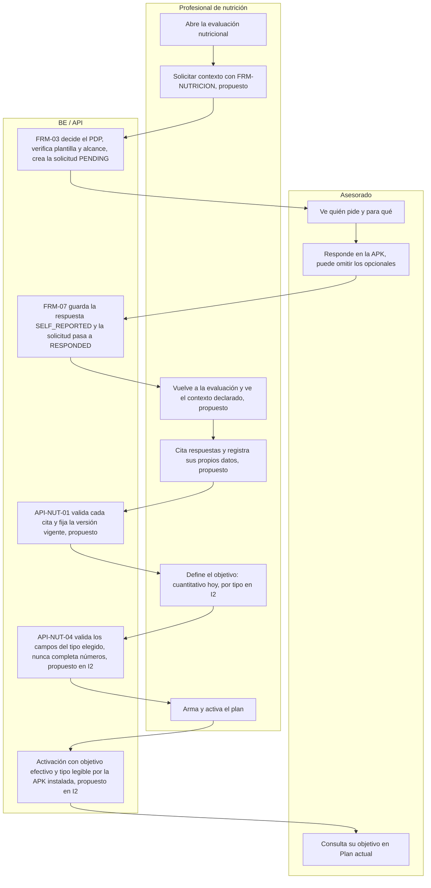
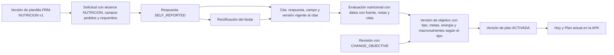
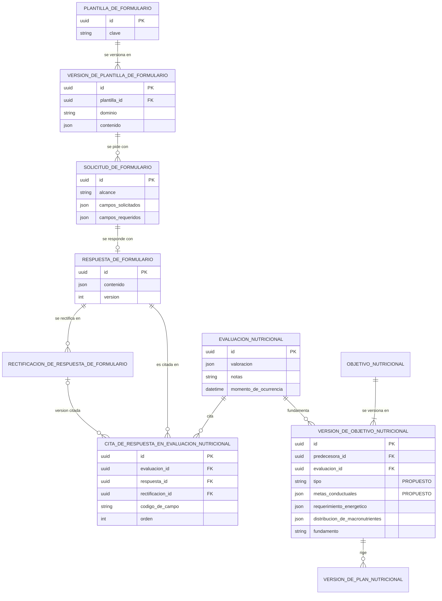
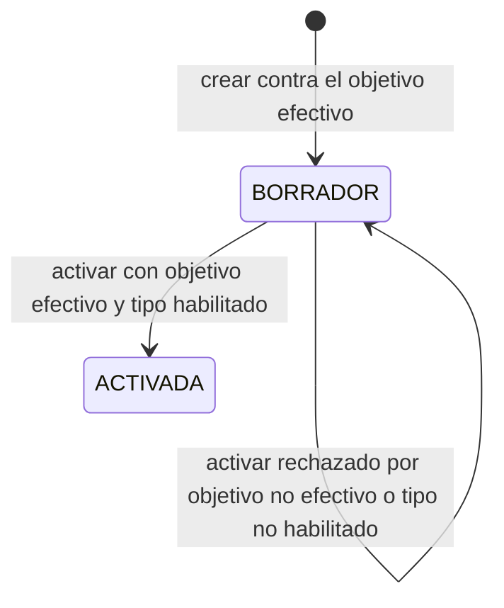

# PF-04 — Ficha: contexto y objetivos nutricionales

> **Estado:** PROPUESTA ESPECIFICADA para decisión de Dirección; no implementada.
> **Base:** `main` en `ff2001e` (2026-09-28), con #100 y #101 integrados. El #102 (website de PF-02: solicitar contexto y citar) está en auditoría, sin integrar, y DL-104 se implementa aparte. Contrastado con el Plan Funcional Profesional v1.1 ([`docs/propuestas/BE_Plan_Funcional_Profesional_v1-1.md`](BE_Plan_Funcional_Profesional_v1-1.md), corte `46fd1fa`).
> **Identificadores:** son **locales al plan** PF, NUT-01 a NUT-22, NUT-Q01 a NUT-Q17, F-NUT-01, DAT, CA, V, DEC y CU-PROP ([`docs/propuestas/LEEME.md:3`](LEEME.md)). Son **locales a esta ficha** PF04-CU-xx, PF04-CA-xx, D-x, T-x, H-x e I1 a I3. Ninguno es del legajo. Los **anclajes canónicos** son RF-026 (`04:360`), RF-029 (`04:387`), RF-071 (`04:266`), UC-P09 (`05:5475`), UC-P32 (`05:15047`), UC-P33 (`05:15197`), API-NUT-01 a 06 (`09v9:325-456`), API-FRM-01 a 08 (`09:1459-1698`), REG-06-97 (`06:4183`), REG-06-98 (`06:4207`), REG-06-102 (`06:4272`), REG-06-109 y 110 (`06:4421`, `06:4437`), REG-06-123 (`06:4629`), REG-06-125 (`06:4651`), INV-06-133 (`06:4690`), REG-06-209 (`06:8485`), CAND-09-NUT-A (`09v9:86`), CAND-10-NUT-02 y 03 (`B10-05:216`, `B10-05:269`), CAND-10-DAT-04 (`ADD5:1286`), TEST-RF-026, TEST-RF-029 y TEST-UC-P09 (`11A:204`, `11A:207`, `11A:314`), y las deudas DL-039, DL-048, DL-052, DL-055, DL-057, DL-095 y DL-100 a DL-104 ([`docs/DEUDA_LEGAJO.md`](../DEUDA_LEGAJO.md)). **B10-05 no tiene un equivalente de CAND-10-TRN-A para nutrición:** el pedido de datos desde la evaluación se ancla en ADD5 §38 (`ADD5:1032-1044`) y CAND-10-DAT-04. Las decisiones que Dirección apruebe se registran como DL nuevas, con el número libre al momento de registrarlas.

```yaml
package: PF-04
title: Contexto y objetivos nutricionales
status: proposed
baseline_commit: ff2001e4090999822541f50288f4b596f75a7dd1
business_outcome: El nutricionista decide con contexto declarado por la persona, citado con origen y fecha, y registra objetivos honestos, sin calorías inventadas
in_scope:
  - I1 · Plantilla FRM-NUTRICION v1 con once preguntas generales y los tipos actuales
  - I1 · «Solicitar contexto» desde la evaluación nutricional, con retorno a la evaluación
  - I1 · Citar respuestas en la evaluación nutricional, verificadas en el servidor (patrón DL-102)
  - I1 · Ver en el website el contenido de una evaluación nutricional, con sus citas
  - I1 · FRM-03 exige que la plantilla sea compatible con el alcance de la solicitud
  - I2 · Objetivo nutricional cuantitativo, conductual o combinado (DEC-05), con lectura de versiones anteriores
  - I2 · APK nueva que lee el objetivo por tipo, y activación de planes con objetivo no cuantitativo recién con esa APK verificada
out_of_scope:
  - Preguntas sensibles NUT-Q09 a NUT-Q14 hasta resolver DEC-02, DEC-04, DAT-06, la matriz de pertinencia y el B2 por categoría (reabrir DL-039); quedan para I3
  - Selección simple o múltiple, fechas, grupos repetibles y condicionales en formularios
  - Diagnóstico nutricional codificado, cribados, fórmulas y cálculo de requerimientos
  - Plan práctico, medidas caseras, sustituciones, totales e intercambios (PF-05 y DEC-13)
  - Evidencia tipada de respuestas de formulario en la revisión (NUT-39, PF-05)
  - Reutilizar el perfil (profileSourceRef, DL-095) y compartir contexto entre alcances
decisions_required:
  - D-1 y D-2 · Plantilla general, avance sin revisor designado (desviación de PFP:760) y separación del bloque sensible (contenido, DEC-02)
  - D-3 y D-4 · Citas en la evaluación nutricional y compatibilidad plantilla-alcance
  - D-5 a D-10 · Objetivo por tipo (DEC-05), lectura de REG-06-123, plan asociado, APK instalada y vista del asesorado
acceptance: [CA-FOR-01, CA-FOR-03, CA-FOR-04, CA-FOR-06, CA-FOR-07, CA-NUT-01, CA-NUT-02 (I3)]
verification: [V-01, V-02, V-03, V-05 (parcial), V-06, V-07, V-17, V-20, V-21]
evidence:
  - Pruebas de contrato e integración del flujo y de los permisos afectados
  - Recorrido web del nutricionista y respuesta en la APK sobre artefactos identificados
  - Comprobación en el teléfono de la APK instalada y de la nueva (I2), informada aparte de CI y de la publicación
```

## Cómo leer esta ficha

Cada fila de tabla y cada punto de lista lleva una de estas tres marcas:

- **EXISTENTE:** está en `main` (`ff2001e`). Se enlaza el archivo con su línea.
- **APROBADO:** lo decidió Dirección (DL decidida, cerrada o simplificación declarada) o lo fija el legajo. Se cita la DL o el documento. Una DL **abierta** no es APROBADO: lo que el código hace mientras tanto figura como EXISTENTE.
- **PROPUESTO:** lo propone el plan («plan») o esta ficha («ficha»). Requiere decisión. Nada PROPUESTO se implementa sin la orden de Dirección ([`docs/propuestas/LEEME.md:10`](LEEME.md)).

La columna «Inc.» indica el incremento: **I1** contexto citado (sin APK nueva), **I2** objetivo por tipo (con APK nueva), **I3** bloque sensible (bloqueado por decisiones previas).

Abreviaturas de documentos, con su ruta desde la raíz del repo. Las citas del código van con la ruta completa.

- **APROBADO** · `04:` = [`docs/legajo/04_BE_LEG_04_v0.4.2.1.md`](../legajo/04_BE_LEG_04_v0.4.2.1.md) · `05:` = [`docs/legajo/05_BE_LEG_05_v0.15.md`](../legajo/05_BE_LEG_05_v0.15.md) · `06:` = [`docs/legajo/06_BE_LEG_06_v0.1.1.md`](../legajo/06_BE_LEG_06_v0.1.1.md) · `08:` = [`docs/legajo/08_BE_LEG_08_v0.1.5.md`](../legajo/08_BE_LEG_08_v0.1.5.md) · `09:` = [`docs/legajo/09_BE_LEG_09_v0.16.1.md`](../legajo/09_BE_LEG_09_v0.16.1.md) · `09v9:` = [`docs/legajo/09_AUX/BE_LEG_09_v0.9_CONTRATOS_P0_NUTRICION_2026-08-31.md`](../legajo/09_AUX/BE_LEG_09_v0.9_CONTRATOS_P0_NUTRICION_2026-08-31.md) · `11A:` = [`docs/legajo/11A_BE_LEG_11A_v1.0-H.md`](../legajo/11A_BE_LEG_11A_v1.0-H.md) · `B10-05:` = [`docs/legajo/10_UX/BE_LEG_10_v0.4_B10_05_NUTRICION_UX_P0_TOBE_2026-08-31(1).md`](../legajo/10_UX/BE_LEG_10_v0.4_B10_05_NUTRICION_UX_P0_TOBE_2026-08-31%281%29.md) · `ADD5:` = [`docs/legajo/10_UX/BE_LEG_10_v0.5_ADENDA_TRANSVERSAL_METODOS_CALCULOS_FORMULARIOS_TOBE_2026-08-31(1).md`](../legajo/10_UX/BE_LEG_10_v0.5_ADENDA_TRANSVERSAL_METODOS_CALCULOS_FORMULARIOS_TOBE_2026-08-31%281%29.md).
- **APROBADO o ABIERTA, según la DL** · `DL:` = [`docs/DEUDA_LEGAJO.md`](../DEUDA_LEGAJO.md).
- **PROPUESTO** · `PFP:` = [`docs/propuestas/BE_Plan_Funcional_Profesional_v1-1.md`](BE_Plan_Funcional_Profesional_v1-1.md) · `FICHA-PF02:` = [`docs/propuestas/PF-01-02_contexto-de-entrenamiento.md`](PF-01-02_contexto-de-entrenamiento.md) (lo decidido sobre ella está en DL-100 a DL-103, que sí son APROBADO).

## a. Resultado para el usuario y problema que resuelve

### Resultado

- **PROPUESTO (plan, `PFP:760`)** «Formulario pertinente, evaluación y objetivos honestamente representables».
- **PROPUESTO (ficha)** El **nutricionista** pide desde la evaluación un contexto breve: qué busca la persona, cómo organiza sus comidas y en qué horarios, quién compra y cocina, con qué recursos, qué le cuesta conseguir, qué prefiere, qué toma, cómo le resultaría registrar y qué cambio pequeño ve posible. Lo lee con fecha y origen, lo **cita** en la evaluación sin copiarlo como observación propia y define un objetivo **conductual** sin inventar calorías.
- **PROPUESTO (ficha)** El **asesorado** responde preguntas cortas en la APK, sabe quién pide y para qué, y en «Plan actual» ve el objetivo tal como lo formuló su nutricionista, sea una conducta, números o ambas cosas.

### Problema

1. **EXISTENTE** · **No hay plantilla de nutrición.** El catálogo tiene dos plantillas transversales: FRM-SALUD, orientada a la práctica física («relevancia directa para la práctica», [`prisma/migrations/20260921220000_formularios_de_informacion_profesional/migration.sql:285`](../../prisma/migrations/20260921220000_formularios_de_informacion_profesional/migration.sql#L285)), y FRM-HABITOS, genérica («Hábitos, rutina y contexto personal relevante para acompañar el proceso», [`:292`](../../prisma/migrations/20260921220000_formularios_de_informacion_profesional/migration.sql#L292)), que pregunta por sueño, actividad y tabaco y nada sobre comidas ([`:276-296`](../../prisma/migrations/20260921220000_formularios_de_informacion_profesional/migration.sql#L276-L296)). Además está FRM-ENTRENAMIENTO ([`prisma/migrations/20260928000000_plantilla_de_entrenamiento/migration.sql:10-21`](../../prisma/migrations/20260928000000_plantilla_de_entrenamiento/migration.sql#L10-L21)). Ninguna pregunta por rutina de comidas, cocina, acceso, preferencias ni bebidas.
2. **EXISTENTE** · **La evaluación nutricional no puede citar respuestas.** Las citas de DL-102 existen solo en entrenamiento: la base exige `alcance = 'ENTRENAMIENTO'` ([`prisma/migrations/20260928010000_citas_de_respuestas_en_evaluacion/migration.sql:56-74`](../../prisma/migrations/20260928010000_citas_de_respuestas_en_evaluacion/migration.sql#L56-L74)) y la API también ([`apps/api/src/entrenamiento/citas-de-respuestas.ts:86`](../../apps/api/src/entrenamiento/citas-de-respuestas.ts#L86)). En nutrición, `evidenceReferences` son textos sin validar ([`packages/domain/src/contratos-nutricion.ts:63`](../../packages/domain/src/contratos-nutricion.ts#L63)) y el website siempre manda `[]` ([`apps/web/src/app/pro/advisees/nutrition/formularios.tsx:80`](../../apps/web/src/app/pro/advisees/nutrition/formularios.tsx#L80)).
3. **EXISTENTE** · **El website no muestra el contenido de una evaluación nutricional**, solo su fecha ([`apps/web/src/app/pro/advisees/nutrition/resumen.tsx:147-148`](../../apps/web/src/app/pro/advisees/nutrition/resumen.tsx#L147-L148); [`apps/web/src/app/pro/advisees/nutrition/formularios.tsx:247`](../../apps/web/src/app/pro/advisees/nutrition/formularios.tsx#L247)). El cliente compartido no tiene método para API-NUT-03 ([`packages/domain/src/cliente-http.ts:413-432`](../../packages/domain/src/cliente-http.ts#L413-L432)).
4. **EXISTENTE** · **El objetivo nutricional obliga a declarar energía y macronutrientes.** Estas son las restricciones exactas en `main`, que esta ficha respeta:

   ```ts
   // packages/domain/src/contratos-nutricion.ts:40-41
   const Texto = (max: number) => z.string().trim().min(1).max(max);
   const TextoOpcional = (max: number) => z.string().trim().max(max).nullable();
   // packages/domain/src/contratos-nutricion.ts:91-108
   export const RequerimientoEnergeticoSchema = z.strictObject({ value: z.number().positive().finite(), unit: z.literal('kcal/day') });
   export const MacronutrienteSchema = z.strictObject({ value: z.number().nonnegative().finite(), unit: z.enum(['g/day', 'energy_share']) });
   export const DistribucionDeMacronutrientesSchema = z.strictObject({ protein: MacronutrienteSchema, carbohydrate: MacronutrienteSchema, fat: MacronutrienteSchema });

   export const ContenidoDeObjetivoSchema = z
     .strictObject({
       evaluationId: IdOpaco,
       effectiveFrom: Instante,
       effectiveUntil: Instante.nullable(),
       estimatedEnergyRequirement: RequerimientoEnergeticoSchema,
       macronutrientDistribution: DistribucionDeMacronutrientesSchema,
       /** Distribución por comida, opcional (06:4635): descripción del profesional. */
       mealDistribution: TextoOpcional(1000),
       /** Obligatorio (09v9:430). */
       rationale: Texto(4000),
       methodStatement: TextoOpcional(1000),
     })
     .refine((o) => o.effectiveUntil === null || o.effectiveUntil > o.effectiveFrom, { message: 'La vigencia termina después de empezar', path: ['effectiveUntil'] });
   ```

   ```sql
   -- prisma/migrations/20260920100000_circuito_nutricional/migration.sql:174-177 y 560-561
   "requerimiento_energetico" JSONB NOT NULL,
   "distribucion_de_macronutrientes" JSONB NOT NULL,
   "distribucion_por_comida" TEXT,
   "fundamento" TEXT NOT NULL,
   ALTER TABLE "version_de_objetivo_nutricional" ADD CONSTRAINT "version_de_objetivo_con_fundamento" CHECK (btrim("fundamento") <> '');
   ALTER TABLE "version_de_objetivo_nutricional" ADD CONSTRAINT "version_de_objetivo_vigencia_coherente" CHECK ("vigente_hasta" IS NULL OR "vigente_hasta" > "vigente_desde");
   ```

   - **EXISTENTE** · La energía es obligatoria y **mayor que cero**, en `kcal/day`. Los tres macronutrientes son obligatorios y **mayores o iguales que cero**, en `g/day` o `energy_share`. BE no verifica que sumen ni que sean coherentes con la energía: el esquema no tiene ningún control de suma ([`packages/domain/src/contratos-nutricion.ts:92-93`](../../packages/domain/src/contratos-nutricion.ts#L92-L93)). Tampoco calcula el requerimiento (INV-06-133, `06:4690`).
   - **EXISTENTE** · El objeto es estricto: un campo no declarado, como un enunciado conductual, se rechaza con `400 UNKNOWN_FIELD` ([`packages/domain/src/contratos-nutricion.ts:2-3`](../../packages/domain/src/contratos-nutricion.ts#L2-L3)). `mealDistribution` y `methodStatement` admiten `null` pero la clave tiene que venir.
   - **EXISTENTE** · La evaluación de referencia tiene que ser del mismo profesional y del mismo asesorado; si no, `422 EVALUATION_NOT_COMPATIBLE` ([`apps/api/src/nutricion/evaluaciones.service.ts:172-180`](../../apps/api/src/nutricion/evaluaciones.service.ts#L172-L180)).
   - **EXISTENTE** · Hay **un solo objetivo por par** profesional–asesorado ([`prisma/schema.prisma:1114`](../../prisma/schema.prisma#L1114)). Sus versiones forman una cadena lineal de solo agregado ([`prisma/migrations/20260920100000_circuito_nutricional/migration.sql:355`](../../prisma/migrations/20260920100000_circuito_nutricional/migration.sql#L355), [`:529`](../../prisma/migrations/20260920100000_circuito_nutricional/migration.sql#L529), [`:589-590`](../../prisma/migrations/20260920100000_circuito_nutricional/migration.sql#L589-L590)). La efectiva es la terminal, no la de fecha más reciente ([`apps/api/src/nutricion/evaluaciones.service.ts:264-268`](../../apps/api/src/nutricion/evaluaciones.service.ts#L264-L268)).
   - **EXISTENTE** · El website exige los cuatro números ([`apps/web/src/app/pro/advisees/nutrition/formularios.tsx:192-195`](../../apps/web/src/app/pro/advisees/nutrition/formularios.tsx#L192-L195)), manda siempre `g/day` y nunca fija «vigente hasta» ([`:200-211`](../../apps/web/src/app/pro/advisees/nutrition/formularios.tsx#L200-L211)).
   - **EXISTENTE** · **Acoplamientos.** Crear y activar un plan exigen el objetivo efectivo ([`apps/api/src/nutricion/planes.service.ts:149`](../../apps/api/src/nutricion/planes.service.ts#L149), [`:369`](../../apps/api/src/nutricion/planes.service.ts#L369), [`:510-514`](../../apps/api/src/nutricion/planes.service.ts#L510-L514)). Validar (API-NUT-11) no rechaza: lo informa como issue `OBJECTIVE_NOT_EFFECTIVE`, con `valid: false` ([`:337`](../../apps/api/src/nutricion/planes.service.ts#L337), [`:466`](../../apps/api/src/nutricion/planes.service.ts#L466)). Sin plan activado no hay Proceso, ni revisión, ni registro de ingesta ([`apps/api/src/nutricion/revisiones.service.ts:200-204`](../../apps/api/src/nutricion/revisiones.service.ts#L200-L204); [`apps/api/src/nutricion/ingestas.service.ts:131-147`](../../apps/api/src/nutricion/ingestas.service.ts#L131-L147)). `CHANGE_OBJECTIVE` exige el objetivo completo ([`packages/domain/src/contratos-nutricion.ts:457`](../../packages/domain/src/contratos-nutricion.ts#L457); [`apps/api/src/nutricion/revisiones.service.ts:190-198`](../../apps/api/src/nutricion/revisiones.service.ts#L190-L198)) y lo guarda en la revisión para emitirlo al aplicarla ([`:294`](../../apps/api/src/nutricion/revisiones.service.ts#L294), [`:326-328`](../../apps/api/src/nutricion/revisiones.service.ts#L326-L328)).
   - **EXISTENTE** · **La APK instalada (0.11.3)** recibe el objetivo del plan activado dentro de «Hoy» ([`apps/api/src/nutricion/ingestas.service.ts:88`](../../apps/api/src/nutricion/ingestas.service.ts#L88), [`:100-107`](../../apps/api/src/nutricion/ingestas.service.ts#L100-L107)), con un esquema estricto que exige energía y macronutrientes ([`packages/domain/src/contratos-nutricion.ts:379-386`](../../packages/domain/src/contratos-nutricion.ts#L379-L386)). Si la respuesta no valida, el cliente devuelve `RESPUESTA_NO_RECONOCIDA` ([`packages/domain/src/cliente-http.ts:216-217`](../../packages/domain/src/cliente-http.ts#L216-L217)). «Plan actual» muestra siempre energía y macronutrientes en gramos ([`apps/mobile/src/pantallas/nutricion.tsx:413-419`](../../apps/mobile/src/pantallas/nutricion.tsx#L413-L419)).

   **Consecuencia.** Hoy un objetivo conductual solo entra escribiéndolo en `rationale` o en `mealDistribution` **junto con números obligatorios**. Es la representación que prohíben `PFP:72`, `PFP:349` y CA-NUT-01 (`PFP:384`). **Esta ficha no la propone ni la admite como atajo.**
5. **PROPUESTO (ficha, D-5)** · **¿El legajo exige esos números? Es ambiguo.** Las citas textuales son APROBADO; la lectura que se hace de ellas, PROPUESTO.
   - **APROBADO** · **Lo que no fija números.** RF-029 pide un objetivo «con vigencia, responsable y relación con la evaluación» (`04:387-392`). UC-P09 dice que «No se fija contenido nutricional concreto en este caso de uso» (`05:5539`) y que «El objetivo no fija valores o fórmulas desde 05» (`05:5546`). REG-06-98 pide evaluación, responsable, vigencia, fundamento y versiones (`06:4207-4220`). El 09 declara solo `rationale` obligatorio (`09v9:433`) y «no fija contenido nutricional profesional, fórmulas, valores ni metodología» (`09v9:32`).
   - **APROBADO** · **Lo que apunta en sentido contrario.** REG-06-123 dice que la especialización nutricional «**permite** estructurar» la versión con energía, macronutrientes y distribución por comida, pero marca «opcional» **solo** la distribución por comida (`06:4631-4637`). CAND-10-NUT-03 lista energía y macronutrientes entre los campos y también marca opcional solo la distribución (`B10-05:287-297`). El ejemplo de request de API-NUT-04 incluye `estimatedEnergyRequirement` y `macronutrientDistribution` (`09v9:414-428`).
   - **PROPUESTO (ficha, D-5)** · **Lectura.** El código hace obligatorios la energía y los macronutrientes; el legajo es ambiguo. El contrato se escribió bajo [DL-055](../DEUDA_LEGAJO.md), que sigue **abierta** (`DL:1221-1255`). Si esos números son estructura permitida u obligatoria es justamente la decisión D-5. Ninguna regla, acta ni DL trata objetivos conductuales.
6. **APROBADO** · **Parte del contexto alimentario es dato de salud.** Todo lo que refiere a salud, hábitos o estado físico es C4 (`08:162`). La matriz del 08 da a Nutrición la evaluación y el objetivo (`08:197`), y las condiciones de salud y la medicación solo «si pertinente» (`08:201-204`). La pertinencia la fija Dirección por acta (`08:306`), y lo dudoso se deniega (`08:293`). **EXISTENTE** · El código no clasifica por campo: el consentimiento es por alcance y finalidad, sin categorías ([DL-039](../DEUDA_LEGAJO.md), `DL:903-931`), y la matriz de formularios permite las cuatro categorías en los tres alcances ([`packages/domain/src/formularios.ts:69-73`](../../packages/domain/src/formularios.ts#L69-L73)). **Por eso las preguntas sensibles no pueden separarse por permiso hoy** y esta ficha las deja para I3.

## b. Recorrido del profesional y del asesorado



1. **PROPUESTO (ficha)** · En Nutrición › Resumen, el nutricionista toca «Solicitar contexto». Se abre el pedido existente con FRM-NUTRICION, alcance NUTRICION y un propósito sugerido que puede editar. Puede quitar preguntas y elegir cuáles son requeridas. Al enviar, vuelve a la evaluación (CA-FOR-06, V-21). Reutiliza el patrón del #102, que debe estar integrado antes.
2. **EXISTENTE** · FRM-03 decide el PDP con el alcance de la solicitud y crea la solicitud `PENDING` con la versión de plantilla fija ([`apps/api/src/formularios/solicitudes.service.ts:63-109`](../../apps/api/src/formularios/solicitudes.service.ts#L63-L109)). **PROPUESTO (ficha, D-4)** · Además exige que la plantilla sea compatible con el alcance.
3. **EXISTENTE** · La APK muestra quién pide y para qué ([`apps/mobile/src/pantallas/formularios.tsx:75-77`](../../apps/mobile/src/pantallas/formularios.tsx#L75-L77)) y responde cualquier plantilla con TEXT, NUMBER y Sí/No. **En I1 la APK no cambia.**
4. **EXISTENTE** · FRM-07 guarda la respuesta siempre `SELF_REPORTED` ([`apps/api/src/formularios/respuestas.service.ts:196-199`](../../apps/api/src/formularios/respuestas.service.ts#L196-L199)). La solicitud pasa a `RESPONDED` por existir la respuesta ([`prisma/schema.prisma:2020-2045`](../../prisma/schema.prisma#L2020-L2045)).
5. **PROPUESTO (ficha, D-3)** · El nutricionista vuelve a la evaluación. Una sección «Contexto declarado» lista las respuestas que puede leer, con fecha y la leyenda «declarado por la persona». Marca las que cita. API-NUT-01 valida cada cita en el servidor.
6. **PROPUESTO (ficha)** · El detalle de la evaluación en el website muestra datos con su fuente, contexto, notas y citas con origen, fecha y aviso de versión posterior.
7. **EXISTENTE** · Define el objetivo con energía y macronutrientes. **PROPUESTO (ficha, I2, D-6)** · Elige el tipo: cuantitativo, conductual o combinado. **PROPUESTO (ficha, I1)** · Mientras I2 no exista, el formulario de objetivo dice que un objetivo solo conductual todavía no se puede registrar y que no hay que cargar valores no decididos (CU-PROP-03, `PFP:806`).
8. **EXISTENTE** · Arma, valida y activa el plan con API-NUT-07 a 12. **PROPUESTO (ficha, I2, D-9)** · Si el objetivo no es cuantitativo, la activación espera a que la APK nueva esté verificada.
9. **EXISTENTE** · El asesorado ve el objetivo en «Plan actual». **PROPUESTO (ficha, I2, D-10)** · Lo ve según su tipo.

## c. Casos de uso

Los identificadores PF04-CU-xx son locales a esta ficha. Cada caso se apoya en UC-P09 (`05:5475`), UC-P32 (`05:15047`) o UC-P33 (`05:15197`) sin reemplazarlos.

### PF04-CU-01 · Solicitar contexto nutricional desde la evaluación (I1)

- **Precondiciones.**
  - **EXISTENTE** · El PDP de NUTRICION es favorable: rol y especialidad, situación con el A3 del titular, vínculo aceptado, B2 vigente, finalidad y alcance ([`packages/domain/src/autorizacion.ts:93-139`](../../packages/domain/src/autorizacion.ts#L93-L139)).
  - **PROPUESTO (ficha, D-1)** · FRM-NUTRICION v1 está sembrada y es seleccionable.
- **Camino normal.**
  1. **PROPUESTO (ficha)** · Desde Nutrición › Resumen, «Solicitar contexto».
  2. **PROPUESTO (ficha)** · El pedido llega con plantilla, alcance y propósito sugerido: «Conocer tu rutina y tus preferencias para acordar tu acompañamiento nutricional». Trae marcadas siete preguntas (§e.1).
  3. **EXISTENTE** · FRM-03 crea la solicitud `PENDING` con la versión de plantilla fija.
  4. **PROPUESTO (ficha)** · El website vuelve a la evaluación y muestra la solicitud pendiente.
- **Alternativas.**
  - **EXISTENTE** · El profesional pide menos preguntas o cambia cuáles son requeridas; lo requerido tiene que estar entre lo pedido ([`apps/api/src/formularios/solicitudes.service.ts:86-88`](../../apps/api/src/formularios/solicitudes.service.ts#L86-L88)).
  - **PROPUESTO (ficha)** · Si ya hay una solicitud FRM-NUTRICION pendiente, el website la muestra antes de crear otra. La API no lo impide ([DL-093](../DEUDA_LEGAJO.md), sin cancelar ni vencer).
- **Errores.**
  - **EXISTENTE** · PDP desfavorable: el mismo 404 neutral que ante un asesorado inexistente ([`apps/api/src/formularios/solicitudes.service.ts:63-67`](../../apps/api/src/formularios/solicitudes.service.ts#L63-L67)).
  - **EXISTENTE** · Versión histórica: `422 FORM_TEMPLATE_NOT_SELECTABLE` ([`:77-79`](../../apps/api/src/formularios/solicitudes.service.ts#L77-L79)).
  - **PROPUESTO (ficha, D-4)** · Plantilla de otro dominio que el alcance: `422 FORM_REQUEST_NOT_ALLOWED`, un código que ya existe ([`:92-94`](../../apps/api/src/formularios/solicitudes.service.ts#L92-L94)).
- **Resultado.** **EXISTENTE** · Una solicitud con versión fija. No crea vínculo, ni B2, ni amplía acceso ([`packages/domain/src/contratos-formularios.ts:5-8`](../../packages/domain/src/contratos-formularios.ts#L5-L8)).

### PF04-CU-02 · Responder el contexto nutricional (I1)

- **Precondiciones.** **EXISTENTE** · La solicitud es propia, no tiene respuesta y sigue siendo respondible según el PDP ([`apps/api/src/formularios/respuestas.service.ts:55-60`](../../apps/api/src/formularios/respuestas.service.ts#L55-L60)).
- **Camino normal.**
  1. **EXISTENTE** · La APK muestra quién pide, cuándo y para qué.
  2. **EXISTENTE** · La persona responde en texto. Un opcional sin responder se **omite**, nunca viaja vacío ni como «no» ([`packages/domain/src/contratos-formularios.ts:178-189`](../../packages/domain/src/contratos-formularios.ts#L178-L189)).
  3. **EXISTENTE** · FRM-07 guarda la respuesta y la solicitud queda `RESPONDED`.
- **Alternativas.** **EXISTENTE** · La persona rectifica después con FRM-08: se crea una sucesora y la original se conserva ([`apps/api/src/formularios/respuestas.service.ts:97-166`](../../apps/api/src/formularios/respuestas.service.ts#L97-L166)).
- **Errores.**
  - **EXISTENTE** · Falta un requerido o un texto está vacío: `422 FORM_RESPONSE_INVALID` ([`apps/api/src/formularios/respuestas.service.ts:182-184`](../../apps/api/src/formularios/respuestas.service.ts#L182-L184) para el requerido faltante; [`apps/api/src/formularios/lectura-formularios.ts:75-79`](../../apps/api/src/formularios/lectura-formularios.ts#L75-L79) para el texto vacío).
  - **EXISTENTE** · Se revocó el acceso antes de responder: `422 FORM_REQUEST_NOT_RESPONDABLE`.
  - **EXISTENTE (DL-104 abierta)** · Un error de respuesta no nombra el campo: ante `FORM_RESPONSE_INVALID`, la APK 0.11.3 muestra un mensaje genérico ([DL-104](../DEUDA_LEGAJO.md), `DL:2093-2109`). FRM-NUTRICION v1 no tiene números, así que no hay rechazos por rango.
- **Resultado.** **EXISTENTE** · Una respuesta `SELF_REPORTED`, con fecha y versión.

### PF04-CU-03 · Citar respuestas en la evaluación nutricional (I1)

- **Precondiciones.** **EXISTENTE** · PDP de NUTRICION para el par. **PROPUESTO (ficha, D-3)** · La respuesta es del mismo asesorado y responde a una Solicitud del mismo profesional con alcance NUTRICION.
- **Camino normal.**
  1. **PROPUESTO (ficha)** · El formulario de evaluación muestra «Contexto declarado» con las respuestas legibles, la fecha y «declarado por la persona».
  2. **PROPUESTO (ficha)** · El profesional marca hasta 20 citas y carga sus propios datos con fuente (**EXISTENTE**, [DL-048](../DEUDA_LEGAJO.md)).
  3. **PROPUESTO (ficha)** · API-NUT-01 valida cada cita y fija la versión vigente al citar, como en entrenamiento ([`apps/api/src/entrenamiento/citas-de-respuestas.ts:66-95`](../../apps/api/src/entrenamiento/citas-de-respuestas.ts#L66-L95)).
- **Alternativas.**
  - **PROPUESTO (ficha)** · La persona rectifica después de la cita: la lectura avisa que hay una versión posterior y el valor citado no cambia (V-07).
  - **EXISTENTE** · El profesional no cita nada: la evaluación sigue siendo válida.
- **Errores.**
  - **PROPUESTO (ficha)** · Una cita de otra persona, de otro profesional, de otro alcance o de un campo sin responder da **el mismo 422**, exista o no la respuesta, sin revelar nada.
  - **PROPUESTO (ficha)** · Si se revoca B2 o A3, o el vínculo se pausa o finaliza, la evaluación entera da 404 neutral. No hay un aviso por cita, igual que en DL-102 (`DL:2081`).
- **Resultado.** **PROPUESTO (ficha)** · Una evaluación inmutable con referencias, que el website muestra en su detalle.

### PF04-CU-04 · Definir un objetivo conductual o combinado (I2)

- **Precondiciones.** **EXISTENTE** · Hay una evaluación propia del mismo asesorado. **PROPUESTO (ficha)** · Dirección aprobó D-5 y D-6.
- **Camino normal.**
  1. **EXISTENTE** · «Nueva versión de objetivo» ([`apps/web/src/app/pro/advisees/nutrition/formularios.tsx:355`](../../apps/web/src/app/pro/advisees/nutrition/formularios.tsx#L355); botón en [`apps/web/src/app/pro/advisees/nutrition/resumen.tsx:231`](../../apps/web/src/app/pro/advisees/nutrition/resumen.tsx#L231)). **APROBADO** · Lo respalda CAND-10-NUT-03 (`B10-05:269-297`).
  2. **PROPUESTO (ficha)** · Elige el tipo «Conductual».
  3. **PROPUESTO (ficha, D-7)** · Carga de una a cinco metas: acción observable, contexto, frecuencia propuesta en texto y cómo se va a mirar en la revisión. Carga el fundamento, que sigue obligatorio, y la vigencia.
  4. **PROPUESTO (ficha)** · API-NUT-04 valida la variante: **sin energía ni macronutrientes**.
  5. **EXISTENTE** · La versión queda como terminal de la cadena y las anteriores se conservan.
- **Ejemplo.** **PROPUESTO (ficha)** · Meta: «Desayunar antes de salir de casa». Contexto: «días hábiles, con lo que haya en casa». Frecuencia: «los días hábiles». Revisión: «lo conversamos en la próxima revisión». Sin calorías.
- **Alternativas.**
  - **PROPUESTO (ficha)** · Tipo «Combinado»: además, energía y macronutrientes obligatorios con las reglas de hoy.
  - **EXISTENTE** · Tipo «Cuantitativo»: exactamente lo de hoy.
  - **PROPUESTO (ficha)** · El profesional usa la respuesta «cambio posible» como insumo: la cita en la evaluación, no la copia en la meta.
- **Errores.**
  - **PROPUESTO (ficha)** · Un conductual con energía o macronutrientes se rechaza (`400 UNKNOWN_FIELD` por objeto estricto).
  - **PROPUESTO (ficha)** · Una meta sin acción: 422 con la ruta del campo.
  - **EXISTENTE** · Evaluación ajena: `422 EVALUATION_NOT_COMPATIBLE`. Cadena no resoluble: `422 NUTRITION_OBJECTIVE_INVALID` ([`apps/api/src/nutricion/evaluaciones.service.ts:184`](../../apps/api/src/nutricion/evaluaciones.service.ts#L184)).
- **Resultado.** **PROPUESTO (ficha)** · Un objetivo conductual **sin ningún número inventado** (CA-NUT-01).

### PF04-CU-05 · Activar un plan con objetivo no cuantitativo (I2)

- **Precondiciones.** **EXISTENTE** · Hay un borrador contra el objetivo efectivo. **PROPUESTO (ficha, D-8)** · Ese objetivo es conductual o combinado.
- **Camino normal.** **PROPUESTO (ficha, D-9)** · Con la APK nueva publicada y verificada, validar y activar funcionan como hoy. «Hoy» y «Plan actual» muestran el objetivo por tipo.
- **Alternativas.** **PROPUESTO (ficha, D-9)** · Antes de verificar la APK nueva, validar devuelve un issue explícito y activar se rechaza. El borrador queda y un plan cuantitativo ya activo sigue vigente.
- **Errores.** **EXISTENTE** · Objetivo que ya no es el efectivo: `OBJECTIVE_NOT_EFFECTIVE` ([`apps/api/src/nutricion/planes.service.ts:466`](../../apps/api/src/nutricion/planes.service.ts#L466)).
- **Resultado.** **PROPUESTO (ficha)** · La APK instalada nunca recibe un objetivo que no puede leer (V-17).

### PF04-CU-06 · Cambiar el tipo de objetivo desde una revisión (I2)

- **Precondiciones.** **EXISTENTE** · Hay un Proceso abierto y una revisión con resultado `CHANGE_OBJECTIVE` ([DL-052](../DEUDA_LEGAJO.md)).
- **Camino normal.** **PROPUESTO (ficha)** · `nextAction.objective` lleva el tipo. Al aplicar la revisión se emite la versión nueva, de cualquier tipo.
- **Alternativas.** **PROPUESTO (ficha)** · Una revisión guardada antes del cambio, sin tipo, se aplica como cuantitativa: su contenido ya tiene los números.
- **Errores.** **EXISTENTE** · Revisión sin objetivo: `REVIEW_NEW_OBJECTIVE_REQUIRED`. Evaluación ajena: `EVALUATION_NOT_COMPATIBLE` ([`apps/api/src/nutricion/revisiones.service.ts:190-198`](../../apps/api/src/nutricion/revisiones.service.ts#L190-L198)).
- **Resultado.** **PROPUESTO (ficha)** · El cambio de tipo queda trazado a la revisión que lo decidió (`revisionDeOrigenId`, [`prisma/schema.prisma:1132-1133`](../../prisma/schema.prisma#L1132-L1133)).

### PF04-CU-07 · Consultar el objetivo, del lado del asesorado (I2)

- **Precondiciones.** **EXISTENTE** · Hay un plan activado y el PDP de su profesional es favorable ([`apps/api/src/nutricion/ingestas.service.ts:74-86`](../../apps/api/src/nutricion/ingestas.service.ts#L74-L86)).
- **Camino normal.** **PROPUESTO (ficha, D-10)** · «Plan actual» muestra la formulación autorizada según el tipo: metas, números o ambos, más distribución por comida y vigencia. No muestra fundamento ni método, como hoy (`05:5658`).
- **Alternativas.** **EXISTENTE** · Sin plan activado: «Actualmente no tenés un plan activo de Nutrición.». Con acceso suspendido: «Tu plan de Nutrición no está disponible en este momento. Revisá el estado del vínculo y de tus autorizaciones en Cuenta.» ([`packages/domain/src/copy-nutricion.ts:104-105`](../../packages/domain/src/copy-nutricion.ts#L104-L105); [`apps/mobile/src/pantallas/nutricion.tsx:408`](../../apps/mobile/src/pantallas/nutricion.tsx#L408)).
- **Errores.** **PROPUESTO (ficha)** · Con la APK 0.11.3 no hay error, porque nunca recibe un tipo que no conoce (D-9).
- **Resultado.** **APROBADO** · El asesorado consulta la formulación autorizada (RF-029, `04:392`).

### PF04-CU-08 · Declarar una alergia, una situación de salud o medicación (I3, bloqueado)

- **Precondiciones.** **PROPUESTO (plan)** · Revisor de nutrición designado y preguntas aprobadas (DEC-02, `PFP:885`), selección y «no sé» o «prefiero conversarlo» (DEC-04 y DAT-06, `PFP:887`, `PFP:166`), matriz de pertinencia por campo (DEC-06, `PFP:889`). **APROBADO** · La matriz la fija Dirección por acta (`08:306`), y el B2 tiene que autorizar la categoría del campo, con la versión de matriz registrada (`08:368`, `08:374`). **PROPUESTO (ficha)** · Eso requiere reabrir la simplificación DL-039 (§e.2).
- **Camino normal.** **PROPUESTO (plan)** · El nutricionista incluye el bloque sensible solo si es pertinente. La persona responde «sí», «no», «no sé» o «prefiero conversarlo» y, si corresponde, detalla. El nutricionista revisa antes de tratarlo como restricción confirmada (`PFP:569`).
- **Alternativas.** **PROPUESTO (plan)** · «Prefiero conversarlo» deja una necesidad de conversación visible, sin conclusión automática.
- **Errores.** **APROBADO** · Una lista vacía o una pregunta no respondida nunca se muestran como «sin alergias» ni «sin condiciones» (`08:343`; `PFP:332`).
- **Resultado.** **PROPUESTO (plan)** · Alergia, intolerancia y preferencia quedan como conceptos distintos y con acceso pertinente (CA-NUT-02, `PFP:385`).

## d. Diccionario de campos

**Régimen FRM** (vale para las filas marcadas así):
- **EXISTENTE** · *Fecha:* momento de registro de la respuesta o de la rectificación.
- **EXISTENTE** · *Procedencia:* siempre `SELF_REPORTED`.
- **EXISTENTE** · *Versionado:* versión de plantilla fija por solicitud; cadena lineal de rectificaciones.
- **PROPUESTO (plan, DAT-14)** · *Vigencia:* sin vencimiento; se muestra la antigüedad.
- **EXISTENTE** · *Captura:* el asesorado, con FRM-07 en la APK.
- **EXISTENTE** · *Lectura:* el titular siempre; el profesional autor de la solicitud, con el PDP del alcance ([`apps/api/src/formularios/solicitudes.service.ts:191-205`](../../apps/api/src/formularios/solicitudes.service.ts#L191-L205)). Nadie más.
- **EXISTENTE** · *Rectificación:* el titular, con FRM-08.

**Régimen objetivo** (vale para las filas marcadas así):
- **EXISTENTE** · *Fecha:* `createdAt`.
- **EXISTENTE** · *Procedencia:* JSON de procedencia más autor.
- **EXISTENTE** · *Versionado:* cadena de solo agregado; la efectiva es la terminal.
- **EXISTENTE** · *Captura:* el profesional, con API-NUT-04 o al aplicar `CHANGE_OBJECTIVE`.
- **EXISTENTE** · *Lectura:* el autor, con API-NUT-05 y 06. El asesorado ve una proyección en «Hoy» solo con plan activado ([`packages/domain/src/contratos-nutricion.ts:379-386`](../../packages/domain/src/contratos-nutricion.ts#L379-L386)).
- **EXISTENTE** · *Rectificación:* no se edita; se emite una versión nueva.

| Concepto | Equivalente existente | Marca | Quién lo declara o registra | Finalidad concreta | Tipo, unidad y validaciones | Obligatoriedad y significado de la ausencia | Fecha, vigencia, procedencia y versionado | Captura / lectura / rectificación |
|---|---|---|---|---|---|---|---|---|
| Motivo y expectativas (NUT-01, NUT-Q01) · `nut_motivo` | No hay. El objetivo nutricional es del profesional ([`packages/domain/src/contratos-nutricion.ts:95-108`](../../packages/domain/src/contratos-nutricion.ts#L95-L108)) | **PROPUESTO** (plan; código de ficha) · I1 | Asesorado | Saber qué quiere resolver para acordar el objetivo, sin asumir bajar de peso (`PFP:541-542`) | TEXT, no vacío. **EXISTENTE**: sin tope de longitud (H-6) | R sugerida. Sin respuesta = solicitud pendiente, nunca «no busca nada» | Régimen FRM | Régimen FRM |
| Experiencias previas (NUT-02, NUT-Q02) · `nut_experiencias_previas` | No hay | **PROPUESTO** (plan) · I1 | Asesorado | No repetir estrategias que no le sirvieron, sin juzgar la voluntad (`PFP:318`) | TEXT | O. Omitido ≠ «nunca intentó» | Régimen FRM | Régimen FRM |
| Organización diaria y horarios (NUT-03, NUT-13, NUT-Q03) · `nut_organizacion_de_comidas` | Parcial: un dato `REPORTED` de concepto libre en la evaluación ([DL-048](../DEUDA_LEGAJO.md)) | **PROPUESTO** (plan) · I1 | Asesorado | Momentos y horarios posibles para comer, base de los días tipo | TEXT. Relato, no lista exacta. El recuerdo no es registro medido (`PFP:548`) | R sugerida | Régimen FRM | Régimen FRM |
| Variación según el día (NUT-Q04) · `nut_cambios_segun_el_dia` | El día tipo existe en el plan ([`packages/domain/src/contratos-nutricion.ts:159-163`](../../packages/domain/src/contratos-nutricion.ts#L159-L163)) | **PROPUESTO** (plan) · I1 | Asesorado | Decidir si hacen falta días tipo distintos (`PFP:551`) | TEXT | O | Régimen FRM | Régimen FRM |
| Compra y preparación (NUT-05, NUT-Q05) · `nut_compra_y_preparacion` | No hay | **PROPUESTO** (plan) · I1 | Asesorado | Saber quién organiza la comida, sin identificar a terceros (`PFP:554`) | TEXT hoy. Selección simple con códigos cuando exista DEC-04 | O | Régimen FRM | Régimen FRM |
| Cocina y conservación (NUT-05, NUT-Q06) · `nut_cocina_y_conservacion` | No hay | **PROPUESTO** (plan) · I1 | Asesorado | Proponer preparaciones posibles, sin presumir equipamiento (`PFP:557`) | TEXT hoy, como el equipamiento de DL-103. Opciones con comentario cuando exista DEC-04 | R sugerida | Régimen FRM | Régimen FRM |
| Acceso a alimentos (NUT-04, NUT-Q07) · `nut_acceso_a_alimentos` | No hay | **PROPUESTO** (plan) · I1 | Asesorado | Proponer alimentos que pueda conseguir y sostener | TEXT. Nunca ingresos ni montos (`PFP:320`, `PFP:560`) | O. Omitido ≠ «sin dificultades» | Régimen FRM | Régimen FRM |
| Preferencias (NUT-06, NUT-Q08) · `nut_preferencias` | `trn_preferencias` es de entrenamiento y no se reutiliza (CA-FOR-07) | **PROPUESTO** (plan) · I1 | Asesorado | Armar opciones que le gusten. **No son alergias** (`PFP:563`) | TEXT | O | Régimen FRM | Régimen FRM |
| Bebidas e hidratación (NUT-12, NUT-Q15) · `nut_bebidas` | No hay | **PROPUESTO** (plan) · I1 | Asesorado | Contexto aproximado, sin meta automática (`PFP:584`) | TEXT hoy. No se fuerza un NUMBER para no simular precisión | O | Régimen FRM | Régimen FRM |
| Preferencia de seguimiento (NUT-14, NUT-Q16) · `nut_forma_de_registro` | Los modos de registro existen: opción del plan con cantidades opcionales, o descripción libre ([`packages/domain/src/contratos-nutricion.ts:297-311`](../../packages/domain/src/contratos-nutricion.ts#L297-L311)) | **PROPUESTO** (plan) · I1 | Asesorado | Acordar cómo registrar sin obligar a pesar. No habilita funciones inexistentes (`PFP:587`) | TEXT hoy. Selección simple cuando exista DEC-04 | O | Régimen FRM | Régimen FRM |
| Cambio posible (NUT-Q17) · `nut_cambio_posible` | No hay | **PROPUESTO** (plan) · I1 | Asesorado | Insumo para una meta conductual; no la crea (`PFP:590`) | TEXT | O. No es un compromiso | Régimen FRM | Régimen FRM |
| Práctica alimentaria (NUT-06, NUT-Q09) · `nut_practica_alimentaria` | No hay | **PROPUESTO** (plan) · **I3, bloqueado** | Asesorado | Respetar prácticas culturales o personales | Texto u opciones (DEC-04) | O. Nunca se infiere una afiliación (`PFP:322`) | Régimen FRM | Régimen FRM, más la matriz de D-2 |
| Alergia declarada (NUT-07, NUT-Q10) · `nut_alergia_declarada` | No hay. **EXISTENTE**: FRM-SALUD es para la práctica física | **PROPUESTO** (plan) · **I3, bloqueado** | Asesorado; revisión del nutricionista (DAT-13) | Evitar alimentos que le hacen daño | Sí / no / no sé / prefiero conversarlo, más una lista de alimento o sustancia y fuente | C por pertinencia. **Una lista vacía no es «sin alergias»** (`PFP:332`) | Régimen FRM, más revisión profesional con autor y fecha | Régimen FRM, más la matriz de D-2 |
| Intolerancia o dificultad (NUT-08, NUT-Q11) · `nut_alimentos_evitados` | No hay | **PROPUESTO** (plan) · **I3, bloqueado** | Asesorado | Conocer lo que evita y por qué, sin etiquetar enfermedad (`PFP:572`) | TEXT; separado de alergia y preferencia (`ADD5:903-921`) | O | Régimen FRM | Régimen FRM, más la matriz de D-2 |
| Situación de salud pertinente (NUT-09, NUT-Q12) · `nut_situacion_de_salud` | Parcial: `condiciones_declaradas` de FRM-SALUD, orientada a la práctica física ([`prisma/migrations/20260921220000_formularios_de_informacion_profesional/migration.sql:283-289`](../../prisma/migrations/20260921220000_formularios_de_informacion_profesional/migration.sql#L283-L289)) | **PROPUESTO** (plan) · **I3, bloqueado** | Asesorado | Lo que quiere conversar con su nutricionista y su origen | Selección simple con detalle opcional | C. «Prefiero conversarlo» ≠ «nada que declarar» | Régimen FRM | Régimen FRM, más la matriz de D-2. Solo dentro del alcance (`PFP:575`) |
| Medicación o suplemento (NUT-10, NUT-Q13) · `nut_medicacion_o_suplementos` | Parcial: `medicacion_relevante` de FRM-SALUD, para la práctica física | **PROPUESTO** (plan) · **I3, bloqueado** | Asesorado | Contexto para la evaluación. BE no recomienda cambios (`PFP:578`) | Lista con nombre, cantidad **con unidad** si se conoce, frecuencia y fuente (grupos repetibles) | C | Régimen FRM | Régimen FRM, más la matriz de D-2 |
| Experiencia al comer (NUT-11, NUT-Q14) · `nut_experiencia_al_comer` | No hay | **PROPUESTO** (plan) · **I3, bloqueado** | Asesorado | Abrir una conversación. No es un cribado ni un diagnóstico (`PFP:581`) | TEXT | O | Régimen FRM | Régimen FRM; solo el nutricionista, más la matriz de D-2 |
| Datos de la evaluación con fuente | `assessment.entries[]` ([`packages/domain/src/contratos-nutricion.ts:45-57`](../../packages/domain/src/contratos-nutricion.ts#L45-L57)) | **EXISTENTE** ([DL-048](../DEUDA_LEGAJO.md) abierta, opción A) | Profesional | Registrar lo informado, observado o calculado (REG-06-109, `06:4421`) | Concepto hasta 120; valor texto hasta 500 o número; unidad hasta 30; fuente `REPORTED`, `OBSERVED` o `CALCULATED`; un calculado declara el método | De 1 a 100 datos | `occurredAt` no futura, con 5 minutos de tolerancia ([`apps/api/src/nutricion/evaluaciones.service.ts:28`](../../apps/api/src/nutricion/evaluaciones.service.ts#L28), [`:55-61`](../../apps/api/src/nutricion/evaluaciones.service.ts#L55-L61)); inmutable ([`prisma/migrations/20260920100000_circuito_nutricional/migration.sql:588`](../../prisma/migrations/20260920100000_circuito_nutricional/migration.sql#L588)) | Captura: profesional (API-NUT-01). Lectura: solo el autor ([`apps/api/src/nutricion/evaluaciones.service.ts:107`](../../apps/api/src/nutricion/evaluaciones.service.ts#L107), [`:132`](../../apps/api/src/nutricion/evaluaciones.service.ts#L132)); el asesorado no tiene lectura (H-2). Rectificación: una evaluación nueva |
| Respuesta citada | `formResponseReferences` de entrenamiento ([`packages/domain/src/contratos-entrenamiento.ts:76-105`](../../packages/domain/src/contratos-entrenamiento.ts#L76-L105)) | **PROPUESTO** (ficha, D-3) · I1 | El profesional cita lo que la persona declaró | Fundar la evaluación en lo declarado sin copiarlo (CA-FOR-04) | `{formResponseId, fieldCode}`, hasta 20; una sola vez por respuesta y campo | Opcional; ausente = sin citas | Fija la versión vigente al citar; avisa si hay una posterior | Se lee junto con la evaluación: si se pierde el permiso, la evaluación entera da 404 |
| Síntesis profesional (NUT-15) | `professionalNotes` hasta 4000 y `context` hasta 1000 ([`packages/domain/src/contratos-nutricion.ts:59-65`](../../packages/domain/src/contratos-nutricion.ts#L59-L65)) | **EXISTENTE** · **PROPUESTO** (ficha): mostrarlas en el detalle web | Profesional | Su valoración, escrita por él y nunca resumida automáticamente (`PFP:340`) | Texto | Opcional | La de la evaluación | Captura y lectura: las de la evaluación |
| Limitaciones de la evidencia (NUT-16) | Se pueden escribir en las notas | **PROPUESTO** (plan); sin campo nuevo en I1 ni I2 (ficha) | Profesional | Declarar datos faltantes, aproximados o viejos (`PFP:341`) | Texto dentro de las notas | Opcional | La de la evaluación | Las de la evaluación |
| Evaluación de referencia | `evaluationId` ([`apps/api/src/nutricion/evaluaciones.service.ts:172-180`](../../apps/api/src/nutricion/evaluaciones.service.ts#L172-L180)) | **EXISTENTE** · **APROBADO** (REG-06-98, `06:4209`; UC-P09 E03, `05:5624`) | Profesional | Relacionar objetivo y evaluación | Del mismo profesional y del mismo asesorado | Obligatoria en todo tipo | Régimen objetivo | Régimen objetivo |
| Tipo de objetivo (NUT-17) | No hay discriminador | **PROPUESTO** (plan; ficha D-6) · I2 | Profesional | Representar sin ficción lo que se decidió | `QUANTITATIVE`, `BEHAVIORAL` o `COMBINED` | Obligatorio al emitir. **Ausente en datos anteriores = `QUANTITATIVE`** | Régimen objetivo; el tipo puede cambiar entre versiones | Régimen objetivo |
| Meta conductual (NUT-19, NUT-22) | No hay | **PROPUESTO** (plan; ficha D-7) · I2 | Profesional | Acción observable y cómo se va a revisar, sin calificar a la persona (`PFP:344`, `PFP:347`) | De 1 a 5 metas. Acción, de 1 a 300; contexto, hasta 500; frecuencia propuesta, texto hasta 200; cómo se revisa, hasta 500. **Sin contadores, porcentajes ni puntajes** | Obligatoria en `BEHAVIORAL` y `COMBINED`; prohibida en `QUANTITATIVE` | Régimen objetivo | Régimen objetivo; el asesorado la ve en «Plan actual» (D-10) |
| Energía (NUT-20) | `estimatedEnergyRequirement` ([`packages/domain/src/contratos-nutricion.ts:91`](../../packages/domain/src/contratos-nutricion.ts#L91), [`:100`](../../packages/domain/src/contratos-nutricion.ts#L100)) | **EXISTENTE** · **PROPUESTO** (ficha): prohibida en conductual | Profesional | Declarar el requerimiento decidido. BE no lo calcula (INV-06-133) | `value` > 0, `kcal/day` | Hoy obligatoria. En I2, obligatoria en cuantitativo y combinado; **nunca 0 ni un valor de relleno** | Régimen objetivo | Régimen objetivo |
| Macronutrientes (NUT-20) | `macronutrientDistribution` ([`packages/domain/src/contratos-nutricion.ts:92-93`](../../packages/domain/src/contratos-nutricion.ts#L92-L93), [`:101`](../../packages/domain/src/contratos-nutricion.ts#L101)) | **EXISTENTE** · **PROPUESTO** (ficha): prohibidos en conductual | Profesional | Declarar la distribución decidida | Proteínas, carbohidratos y grasas, cada uno ≥ 0, en `g/day` o `energy_share` | Igual que la energía | Régimen objetivo | Régimen objetivo |
| Distribución por comida | `mealDistribution` ([`packages/domain/src/contratos-nutricion.ts:103`](../../packages/domain/src/contratos-nutricion.ts#L103)) | **EXISTENTE** · **APROBADO** opcional (`06:4635`) | Profesional | Cómo se reparte en el día | Texto hasta 1000 | Opcional en todo tipo | Régimen objetivo | Régimen objetivo; el asesorado lo ve |
| Fundamento y acuerdo (NUT-21, NUT-18) | `rationale` ([`packages/domain/src/contratos-nutricion.ts:105`](../../packages/domain/src/contratos-nutricion.ts#L105)) | **EXISTENTE** · **APROBADO** (`09v9:433`) | Profesional | Por qué se decidió y cómo se acordó. **No hay aceptación electrónica del asesorado** (`PFP:343`) | Texto de 1 a 4000; la base exige que no esté vacío | Obligatorio en todo tipo | Régimen objetivo | Régimen objetivo; el asesorado no lo ve |
| Método declarado (NUT-21) | `methodStatement` ([`packages/domain/src/contratos-nutricion.ts:106`](../../packages/domain/src/contratos-nutricion.ts#L106)) | **EXISTENTE**. El método versionado de RF-070 queda afuera (DEC-07) | Profesional | Dejar trazable de dónde salió un número | Texto hasta 1000 | Opcional | Régimen objetivo | Régimen objetivo |
| Vigencia | `effectiveFrom`, `effectiveUntil` ([`packages/domain/src/contratos-nutricion.ts:98-99`](../../packages/domain/src/contratos-nutricion.ts#L98-L99), [`:108`](../../packages/domain/src/contratos-nutricion.ts#L108)) | **EXISTENTE** · **APROBADO** (`06:4207-4220`) | Profesional | Período del objetivo | «Hasta» posterior a «desde» (también en la base) | «Hasta» nulo = sin fin declarado. **No decide qué versión es la efectiva** (H-4) | Régimen objetivo | Régimen objetivo; el website nunca fija «hasta» ([`apps/web/src/app/pro/advisees/nutrition/formularios.tsx:205`](../../apps/web/src/app/pro/advisees/nutrition/formularios.tsx#L205)) |

## e. Preguntas y formularios propuestos

F-NUT-01 (`PFP:537-590`) se divide en dos plantillas. **Todas las preguntas del plan están abajo**, con su clasificación. En el motor actual, «C» solo puede ser «selección profesional» (`PFP:432`): no hay campos condicionales, así que el profesional incluye la pregunta en la solicitud o no la incluye.

### e.1 FRM-NUTRICION v1 «Contexto para tu alimentación» (I1, tipos actuales)

- **PROPUESTO (ficha)** · Clave `FRM-NUTRICION`, versión «1», `domain = NUTRICION`, una sección `contexto` titulada «Tu día a día con la comida».
- **PROPUESTO (ficha)** · Propósito de la plantilla: «Contexto que la persona declara para acordar su acompañamiento nutricional: qué busca, cómo organiza sus comidas, con qué recursos cuenta y qué prefiere».
- **PROPUESTO (ficha)** · Rótulo de procedencia: «Catálogo sintético de demostración: preguntas de producto, no un instrumento clínico ni un cribado». Mismo criterio que DL-100 (`DL:2046-2056`).
- **EXISTENTE** · La obligatoriedad no vive en la plantilla: la decide cada solicitud ([`packages/domain/src/contratos-formularios.ts:111-119`](../../packages/domain/src/contratos-formularios.ts#L111-L119)). La columna «Req.» es la sugerida por el botón «Solicitar contexto».
- **PROPUESTO (ficha)** · El botón trae marcadas siete preguntas (1, 3, 4, 6, 7, 8 y 11). Las demás se agregan con un clic. Así la solicitud queda breve (`PFP:428`).
- **EXISTENTE** · Todas son TEXT: la APK 0.11.3 las responde sin cambios, y no hay límites NUMBER que choquen con DL-104.

| # | Plan | `fieldCode` | Rótulo en pantalla | Ayuda en pantalla | Tipo | Categoría | Req. | Condición | Marca |
|---|---|---|---|---|---|---|---|---|---|
| 1 | NUT-Q01 | `nut_motivo` | «Qué te gustaría mejorar con este acompañamiento nutricional» | «Contalo con tus palabras. No tiene que ser bajar de peso: puede ser ordenar tus comidas, comer más tranquilo o lo que a vos te importe.» | TEXT | OBJETIVOS_Y_PREFERENCIAS | R | Siempre | **PROPUESTO** (rótulo del plan; ayuda de la ficha) |
| 2 | NUT-Q02 | `nut_experiencias_previas` | «Qué intentaste antes y qué te resultó útil o difícil» | «Por ejemplo, un plan que seguiste o un cambio que hiciste por tu cuenta. No hace falta que cuentes datos de salud.» | TEXT | HABITOS_Y_CONTEXTO | O | Si el profesional la pide | **PROPUESTO** |
| 3 | NUT-Q03 | `nut_organizacion_de_comidas` | «Cómo suelen organizarse tus comidas en un día habitual» | «Contá en qué momentos comés y a qué hora, más o menos. No hace falta que anotes cantidades.» | TEXT | HABITOS_Y_CONTEXTO | R | Siempre | **PROPUESTO** |
| 4 | NUT-Q04 | `nut_cambios_segun_el_dia` | «Qué cambia en días de trabajo, descanso o entrenamiento» | «Por ejemplo, otros horarios o comer fuera de casa. Si no cambia nada, contalo así.» | TEXT | HABITOS_Y_CONTEXTO | O | Si el profesional la pide | **PROPUESTO** |
| 5 | NUT-Q05 | `nut_compra_y_preparacion` | «Quién suele comprar y preparar lo que comés» | «Por ejemplo: yo, lo compartimos, otra persona o varía. No hace falta que digas quién.» | TEXT (selección simple cuando exista DEC-04) | HABITOS_Y_CONTEXTO | O | Si el profesional la pide | **PROPUESTO** |
| 6 | NUT-Q06 | `nut_cocina_y_conservacion` | «Qué tiempo y recursos tenés para cocinar y conservar alimentos» | «Por ejemplo: cuánto tiempo tenés para cocinar y con qué contás, como heladera, freezer, horno o microondas.» | TEXT (opciones y comentario cuando exista DEC-04) | HABITOS_Y_CONTEXTO | R | Siempre | **PROPUESTO** |
| 7 | NUT-Q07 | `nut_acceso_a_alimentos` | «Hay alimentos que te cuesta conseguir o sostener en tu presupuesto» | «Si querés, contá cuáles. No te pedimos ingresos ni montos.» | TEXT (selección simple y comentario cuando exista DEC-04) | HABITOS_Y_CONTEXTO | O | Si el profesional la pide | **PROPUESTO** |
| 8 | NUT-Q08 | `nut_preferencias` | «Qué alimentos o preparaciones preferís y cuáles no te gustan» | «Son tus gustos. Si algún alimento te hace mal, conversalo con tu nutricionista: este formulario no lo registra.» | TEXT | OBJETIVOS_Y_PREFERENCIAS | O | Si el profesional la pide | **PROPUESTO** |
| 9 | NUT-Q15 | `nut_bebidas` | «Qué bebidas solés tomar y cómo estimarías la cantidad en un día habitual» | «Una estimación alcanza, con la medida que uses: vasos, botellas o litros.» | TEXT | HABITOS_Y_CONTEXTO | O | Si el profesional la pide | **PROPUESTO** |
| 10 | NUT-Q16 | `nut_forma_de_registro` | «Qué forma de registro te resultaría más llevadera» | «Por ejemplo: una descripción breve, cantidades aproximadas o más detalle cuando haga falta. Lo acordás con tu nutricionista.» | TEXT (selección simple cuando exista DEC-04) | OBJETIVOS_Y_PREFERENCIAS | O | Si el profesional la pide | **PROPUESTO** |
| 11 | NUT-Q17 | `nut_cambio_posible` | «Qué cambio pequeño te parece posible comenzar ahora» | «Algo concreto que sientas que podés sostener. No es un compromiso: tu nutricionista lo tiene en cuenta para acordar el objetivo.» | TEXT | OBJETIVOS_Y_PREFERENCIAS | O | Si el profesional la pide | **PROPUESTO** |

**Por qué estas son generales.**
- **PROPUESTO (ficha)** · Describen rutina, recursos y gustos. No piden diagnósticos, síntomas, medicación ni antecedentes.
- **APROBADO** · Siguen siendo C4, porque son hábitos (`08:162`), y solo las lee el nutricionista que las pidió.
- **PROPUESTO (ficha)** · Tres necesitan redacción cuidada, sin llegar a ser sensibles:
  - la 2, porque puede traer dietas restrictivas previas: la ayuda desalienta los datos de salud;
  - la 7, porque toca la situación económica: no pide ingresos (`PFP:560`);
  - la 8, porque la ayuda desvía las alergias a la conversación, porque este formulario no las registra.
- **PROPUESTO (ficha)** · **Limitación declarada:** no existen «No sé» ni «Prefiero conversarlo» (V-05; DAT-06). Un opcional se omite; un requerido se responde con texto. No se simulan con palabras clave.

### e.2 Bloque sensible (I3; no implementable hasta resolver D-2)

- **PROPUESTO (ficha)** · Plantilla aparte, con nombre técnico a definir (por ejemplo `FRM-NUTRICION-RESERVADO`), con `domain = NUTRICION` y categoría `SALUD_Y_SEGURIDAD`, salvo la pregunta 12, que es cultural.
- **PROPUESTO (ficha)** · **Ninguna de estas preguntas es representable con honestidad con los tipos actuales**, salvo como texto libre. El texto libre queda fuera de la vista pertinente por defecto (`08:283`) y no distingue «no» de «no sé».
- **APROBADO** · **Consentimiento por categoría.** El titular autoriza profesional × alcance × finalidad × categorías pertinentes (`08:368`), y la evidencia del B2 registra la versión de la matriz y las categorías autorizadas (`08:374`). Cada pregunta de este bloque exige un B2 que cubra su categoría.
- **EXISTENTE** · Hoy el B2 no tiene categorías y los campos de versión de matriz quedan en nulo: es la simplificación declarada DL-039 (`DL:903-931`).
- **PROPUESTO (ficha)** · Por eso el bloque sensible depende de **reabrir DL-039**, además de la matriz por acta y de la revisión DEC-02. La columna «Qué exige antes de usarse» lo repite en cada fila.

| # | Plan | Rótulo (del plan) | Ayuda propuesta | Tipo propuesto | Con los tipos actuales | Req. y condición | Por qué es sensible | Qué exige antes de usarse | Marca |
|---|---|---|---|---|---|---|---|---|---|
| 12 | NUT-Q09 | «Seguís alguna práctica alimentaria que quieras que respetemos» | «Por ejemplo, vegetariana o por costumbres de tu familia o tu comunidad. No hace falta que digas por qué.» | Texto u opciones | TEXT posible, pero las opciones dependen de DEC-04 | O | Puede revelar **convicciones religiosas o filosóficas**, que la Ley 25.326 también trata como datos sensibles (art. 2; el 08 considera sensibles los datos de BE, `08:85`). El 08 no clasifica este caso | B2 que autorice la categoría que corresponda a la práctica cultural, con versión de matriz registrada (`08:368`, `08:374`; reabrir DL-039). Matriz por acta (`08:306`). Revisión de redacción (DEC-02) y **jurídica** (`PFP:791`). Nunca inferir afiliaciones (`PFP:322`) ni exigir que se identifique una religión (`PFP:566`). No compartir con otros alcances (`PFP:221`) | **PROPUESTO** (plan) |
| 13 | NUT-Q10 | «Te informaron alguna alergia alimentaria que debamos considerar» | «Si te la informó un profesional, contá a qué alimento o sustancia. Si no estás seguro, elegí «No sé».» | Sí / no / no sé / prefiero conversarlo, más alimento o sustancia y fuente | **No:** BOOLEAN no tiene «no sé», y un «No» se leería como «sin alergias» | C por pertinencia | **Dato de salud** (C4) y **de seguridad**: una respuesta mal leída da falsa seguridad | B2 que autorice `SALUD_Y_SEGURIDAD`, con versión de matriz registrada (`08:368`, `08:374`; reabrir DL-039); matriz por acta (`08:306`); revisión DEC-02; DAT-06 (`PFP:166`, `PFP:690`); lista estructurada (NUT-07, grupos repetibles); **revisión profesional antes de tratarla como restricción confirmada** (`PFP:569`; DAT-13); «información no disponible» si el catálogo no tiene alérgenos (`PFP:332`, PF-05); acceso solo de nutrición (`08:201-204`; CA-FOR-07) | **PROPUESTO** (plan) |
| 14 | NUT-Q11 | «Hay alimentos que te generan dificultad o que evitás por otro motivo» | «Contalo como lo vivís. Esto no es un diagnóstico.» | Texto | TEXT posible | O | Puede revelar una **intolerancia**, un **problema digestivo** o una **conducta alimentaria restrictiva** | B2 que autorice `SALUD_Y_SEGURIDAD`, con versión de matriz registrada (`08:368`, `08:374`; reabrir DL-039). Matriz por acta (`08:306`). No etiquetar intolerancia ni enfermedad (`PFP:324`, `PFP:572`). Mantenerla separada de alergia y preferencia (CA-NUT-02; `ADD5:903-921`). Revisión DEC-02 | **PROPUESTO** (plan) |
| 15 | NUT-Q12 | «Hay alguna situación de salud o indicación vigente que quieras conversar con tu nutricionista» | «Podés elegir «Prefiero conversarlo» y contarlo en la consulta.» | Selección simple y detalle opcional | **No:** necesita selección y «prefiero conversarlo» | C (selección profesional) | **Antecedentes clínicos** (C4). El 08 los da a Nutrición solo «si pertinente», y lo no pertinente se deniega (`08:201-204`) | B2 que autorice `SALUD_Y_SEGURIDAD`, con versión de matriz registrada (`08:368`, `08:374`; hoy no hay categorías: reabrir DL-039). Matriz de pertinencia por acta (`08:306`). Solo dentro del alcance autorizado (`PFP:575`). Revisión DEC-02 | **PROPUESTO** (plan) |
| 16 | NUT-Q13 | «Usás algún medicamento o suplemento que quieras informar para esta evaluación» | «Si lo sabés, contá el nombre, la cantidad con su unidad y cada cuánto. BE no hace recomendaciones sobre tu medicación.» | Sí / no / no sé / prefiero conversarlo, más detalle | **No:** necesita DAT-06 y una lista con unidad | C (selección profesional) | **Medicación**: dato de salud (`08:203`) | B2 que autorice `SALUD_Y_SEGURIDAD`, con versión de matriz registrada (`08:368`, `08:374`; reabrir DL-039); matriz por acta (`08:306`) y DEC-02; lista estructurada (NUT-10: nombre, cantidad **con unidad**, frecuencia, fuente); unidad obligatoria si hay cantidad (V-14); **sin recomendaciones de suspensión o cambio** (`PFP:578`) | **PROPUESTO** (plan) |
| 17 | NUT-Q14 | «Cómo te está resultando comer en cuanto a apetito, comodidad o dificultades» | «Contalo como te salga. No es un test ni da un resultado.» | Texto | TEXT posible | O | Puede revelar un **trastorno de la conducta alimentaria** u otro problema de salud. El plan pide justificación y revisión específicas para «relación con la comida» (`PFP:221`) | B2 que autorice `SALUD_Y_SEGURIDAD`, con versión de matriz registrada (`08:368`, `08:374`; reabrir DL-039). Matriz por acta (`08:306`). Revisor designado (DEC-02). **No es un cribado validado ni genera diagnóstico** (`PFP:581`). Qué hacer ante una respuesta que sugiere riesgo es contenido profesional que BE no define ni automatiza, como `PFP:517` para entrenamiento. Población adulta definida (DEC-01, `PFP:884`). Solo lo lee el nutricionista | **PROPUESTO** (plan) |

### e.3 Lo que esta ficha no pregunta

- **PROPUESTO (ficha)** · **Alcohol u otras sustancias.** Son conductas de riesgo que el banco del plan no incluye. Sumarlas sería contenido clínico nuevo, que requiere DEC-02. La pregunta 9 habla de bebidas en general y su ayuda no induce a detallar alcohol.
- **PROPUESTO (ficha)** · **Peso, talla o medidas.** Son antropometría (PF-06). Una declaración no es una medición (`08:1267-1274`).
- **PROPUESTO (ficha)** · **Ingresos, dirección y terceros identificables.** `PFP:319`, `PFP:320` y `PFP:554`.
- **PROPUESTO (ficha)** · **Embarazo.** El plan lo nombra entre lo que requiere justificación específica (`PFP:221`) y no lo pone en F-NUT-01.
- **PROPUESTO (plan)** · **Diagnóstico nutricional codificado.** «No se deduce de esta propuesta» (`PFP:336`).
- **PROPUESTO (plan)** · **F-NUT-02 (revisión alimentaria).** El plan lo asigna a PF-05 (`PFP:859`).

## f. Cambios en API, persistencia y pantallas

| Capa | Se reutiliza tal cual | Cambia | Nuevo | Inc. |
|---|---|---|---|---|
| Base de datos | **EXISTENTE** · Tablas de formularios ([`prisma/schema.prisma:1982-2090`](../../prisma/schema.prisma#L1982-L2090)), `evaluacion_nutricional` ([`:1081-1100`](../../prisma/schema.prisma#L1081-L1100)), cadena del objetivo ([`:1104-1146`](../../prisma/schema.prisma#L1104-L1146)) y triggers de solo agregar | **PROPUESTO (ficha, D-6)** · `version_de_objetivo_nutricional` suma `tipo` (por defecto `CUANTITATIVO`) y `metas_conductuales` (JSONB nulo). Energía y macronutrientes admiten nulo **solo** con un CHECK por tipo (boceto abajo) | **PROPUESTO (ficha)** · Filas de FRM-NUTRICION v1 (solo agregar, como la migración [`prisma/migrations/20260928000000_plantilla_de_entrenamiento/migration.sql:10-21`](../../prisma/migrations/20260928000000_plantilla_de_entrenamiento/migration.sql#L10-L21)). Tabla `cita_de_respuesta_en_evaluacion_nutricional` espejo de la de entrenamiento, con trigger de pertenencia para el alcance NUTRICION | I1 · I2 |
| Dominio (`@be/domain`) | **EXISTENTE** · Contratos FRM sin tipos nuevos; `RespuestaCitadaSchema` ([`packages/domain/src/contratos-entrenamiento.ts:94-105`](../../packages/domain/src/contratos-entrenamiento.ts#L94-L105)) | **PROPUESTO (ficha)** · I1: `formResponseReferences` opcional en `CrearEvaluacionRequestSchema` y obligatorio en la lectura de `EvaluacionNutricionalSchema`. I2: `ContenidoDeObjetivoSchema` pasa a unión por `kind`; `VersionDeObjetivoSchema` suma `kind` y `behavioralGoals`; `ObjetivoParaAsesoradoSchema` pasa a unión (solo la lee la APK nueva) | — | I1 · I2 |
| API | **EXISTENTE** · FRM-01, 02 y 04 a 08; API-NUT-07 a 10, 13, 15, 16 y 21 | **PROPUESTO (ficha)** · I1: FRM-03 compara dominio y alcance (D-4); API-NUT-01 valida citas; API-NUT-02 y 03 las resuelven. I2: API-NUT-04 valida por tipo; API-NUT-05, 06, 17 y 19 proyectan el tipo; API-NUT-11 (validar) y 12 (activar) aplican el interruptor de compatibilidad (D-9); API-NUT-14 proyecta por tipo; API-NUT-18 y 20 aceptan y aplican `CHANGE_OBJECTIVE` por tipo | **PROPUESTO (ficha, T-3)** · El módulo de citas pasa a recibir el alcance y la tabla de citas, en vez de tener fijos `'ENTRENAMIENTO'` ([`apps/api/src/entrenamiento/citas-de-respuestas.ts:86`](../../apps/api/src/entrenamiento/citas-de-respuestas.ts#L86)) y la tabla de entrenamiento ([`:106`](../../apps/api/src/entrenamiento/citas-de-respuestas.ts#L106)) | I1 · I2 |
| OpenAPI y cliente | **EXISTENTE** · Generación del OpenAPI y prueba de contrato | **PROPUESTO (ficha)** · Se regeneran. La prueba sin puntajes (TEST-PRJ-009, [`packages/domain/src/contratos-nutricion.ts:17-18`](../../packages/domain/src/contratos-nutricion.ts#L17-L18)) cubre las metas | **PROPUESTO (ficha, T-7)** · Método del cliente para API-NUT-03 | I1 · I2 |
| Website | **EXISTENTE** · Pestaña Información ([`apps/web/src/app/pro/advisees/forms/pedir.tsx`](../../apps/web/src/app/pro/advisees/forms/pedir.tsx)), formulario de evaluación ([`apps/web/src/app/pro/advisees/nutrition/formularios.tsx:42`](../../apps/web/src/app/pro/advisees/nutrition/formularios.tsx#L42)), `CamposDeObjetivo`, que también usa la revisión ([`apps/web/src/app/pro/advisees/nutrition/revisiones.tsx:307-310`](../../apps/web/src/app/pro/advisees/nutrition/revisiones.tsx#L307-L310)) | **PROPUESTO (ficha)** · I1: «Contexto declarado» en la evaluación y aviso honesto en el formulario de objetivo. I2: selector de tipo y metas en `CamposDeObjetivo`; resumen e historia por tipo, porque hoy muestran kcal por versión ([`apps/web/src/app/pro/advisees/nutrition/resumen.tsx:169-205`](../../apps/web/src/app/pro/advisees/nutrition/resumen.tsx#L169-L205)) | **PROPUESTO (ficha)** · I1: botón «Solicitar contexto» con retorno, y detalle de evaluación con datos, notas y citas. Reutiliza los componentes del #102 | I1 · I2 |
| APK | **EXISTENTE** · La pantalla genérica de formularios responde FRM-NUTRICION sin cambios ([`apps/mobile/src/pantallas/formularios.tsx`](../../apps/mobile/src/pantallas/formularios.tsx)) | **PROPUESTO (ficha)** · I2: «Plan actual» por tipo ([`apps/mobile/src/pantallas/nutricion.tsx:403-419`](../../apps/mobile/src/pantallas/nutricion.tsx#L403-L419)) | **PROPUESTO (ficha)** · I2: APK nueva, con número a definir. Puede sumar la opción A de DL-104 si Dirección lo decide | I2 |
| Servidor desplegado | — | **PROPUESTO (ficha)** · Cambia la API y el website en I1 y en I2. El interruptor de D-9 se abre recién con la APK nueva verificada | — | I1 · I2 |

**Boceto del objetivo por tipo (PROPUESTO, ficha; nombres técnicos a confirmar en el PR).**

```ts
const MetaConductualSchema = z.strictObject({
  action: Texto(300),                     // acción observable (NUT-19)
  context: TextoOpcional(500),            // cuándo o dónde
  proposedFrequency: TextoOpcional(200),  // texto: nunca un contador (D-7)
  reviewApproach: TextoOpcional(500),     // cómo se va a mirar en la revisión (NUT-22)
});
// Campos comunes: evaluationId, effectiveFrom, effectiveUntil, mealDistribution, rationale (obligatorio), methodStatement.
// QUANTITATIVE = comunes + estimatedEnergyRequirement + macronutrientDistribution (las reglas de hoy, sin cambios).
// BEHAVIORAL   = comunes + behavioralGoals (1 a 5). Energía o macronutrientes: 400 UNKNOWN_FIELD.
// COMBINED     = comunes + energía + macronutrientes + behavioralGoals (1 a 5).
// Un pedido o una revisión guardada sin `kind` se lee como QUANTITATIVE.
```

```sql
-- Boceto (PROPUESTO): los números siguen obligatorios donde el tipo los pide; nunca un cero de relleno.
CHECK (
     ("tipo" = 'CUANTITATIVO' AND "requerimiento_energetico" IS NOT NULL AND "distribucion_de_macronutrientes" IS NOT NULL AND "metas_conductuales" IS NULL)
  OR ("tipo" = 'CONDUCTUAL'   AND "requerimiento_energetico" IS NULL     AND "distribucion_de_macronutrientes" IS NULL     AND "metas_conductuales" IS NOT NULL)
  OR ("tipo" = 'COMBINADO'    AND "requerimiento_energetico" IS NOT NULL AND "distribucion_de_macronutrientes" IS NOT NULL AND "metas_conductuales" IS NOT NULL)
)
```

**Flujo de datos.**



**Relaciones principales.** `CITA_DE_RESPUESTA_EN_EVALUACION_NUTRICIONAL` y los atributos marcados son PROPUESTOS; el resto es EXISTENTE.



**Estados de una versión de plan con objetivo por tipo.** Los estados son los de hoy; lo PROPUESTO es la condición de activación de I2.



**Compatibilidad con la APK instalada.**
- **EXISTENTE** · La APK de nutrición solo llama a «Hoy», a registrar ingesta y a sus registros. No lee evaluaciones, objetivos ni revisiones. Por eso **I1 no toca la APK**: las citas y el detalle de la evaluación son del website, que se despliega junto con la API.
- **EXISTENTE** · La APK valida «Hoy» con un esquema estricto. Un `null` o un campo nuevo en `activePlan.objective` hace que no abra «Hoy» ni «Plan actual» ([`packages/domain/src/cliente-http.ts:216-217`](../../packages/domain/src/cliente-http.ts#L216-L217)). Es el mismo límite que dejó `numberLimits` fuera de FRM-02 ([`prisma/migrations/20260928000000_plantilla_de_entrenamiento/migration.sql:6-8`](../../prisma/migrations/20260928000000_plantilla_de_entrenamiento/migration.sql#L6-L8); [DL-101](../DEUDA_LEGAJO.md)).
- **EXISTENTE** · El servidor no sabe qué versión de APK llama: el cliente manda solo `X-BE-Surface` ([`packages/domain/src/cliente-http.ts:189`](../../packages/domain/src/cliente-http.ts#L189)).
- **EXISTENTE** · «Hoy» proyecta el objetivo **del plan activado**, no el efectivo ([`apps/api/src/nutricion/ingestas.service.ts:88`](../../apps/api/src/nutricion/ingestas.service.ts#L88)). **PROPUESTO (ficha, D-9)** · Si el servidor no activa planes con objetivo conductual o combinado hasta verificar la APK nueva, la 0.11.3 nunca recibe un objetivo que no puede leer. El combinado también espera, porque la 0.11.3 mostraría solo los números y ocultaría las metas.

**Lectura de lo anterior.**
- **PROPUESTO (ficha, T-4 y T-5)** · Ninguna fila se reescribe, porque las tablas son de solo agregado. Las versiones existentes quedan `CUANTITATIVO` por el valor por defecto de la columna. Las revisiones guardadas con `nextAction.objective` sin tipo se leen y aplican como cuantitativas. El website y la API se despliegan juntos, así que no hay un cliente web antiguo.

## g. Criterios de aceptación y pruebas

| ID | Criterio | Riesgo que cubre | Prueba que lo demuestra | Inc. | Marca |
|---|---|---|---|---|---|
| CA-FOR-01 | El asesorado ve quién pide y para qué antes de responder FRM-NUTRICION | Responder sin saber a quién ni para qué | Comprobación en la APK 0.11.3 instalada (pantalla existente) | I1 | **PROPUESTO** (plan); comportamiento **EXISTENTE** |
| CA-FOR-03 / V-06 | Una versión 2 de la plantilla no cambia solicitudes ni respuestas emitidas | Que una corrección de textos altere lo respondido | Integración (existente, repetida con FRM-NUTRICION) | I1 | **PROPUESTO** (plan) |
| CA-FOR-04 / PF04-CA-01 | La evaluación nutricional cita respuestas sin copiarlas y el detalle muestra origen, fecha y versión | Que una declaración se lea como observación profesional | Contrato (forma de `formResponseReferences`); integración de API-NUT-01, 02 y 03; recorrido web | I1 | **PROPUESTO** (plan y ficha) |
| CA-FOR-06 / V-21 | Desde la evaluación se pide contexto y se vuelve a la evaluación | Perder el trabajo que motivó el pedido | Recorrido web | I1 | **PROPUESTO** (plan) |
| CA-FOR-07 / PF04-CA-02 | Una respuesta de NUTRICION no se cita en entrenamiento, ni al revés, aunque el campo se llame igual. FRM-NUTRICION no se pide con alcance ENTRENAMIENTO | Contexto alimentario filtrado a otro alcance (`08:249`) | Integración: los dos triggers y FRM-03 con dominio distinto del alcance | I1 | **PROPUESTO** (plan y ficha, D-4) |
| V-01 | Otro profesional u otro titular no cita ni lee la respuesta | Acceso a datos ajenos | Integración: el mismo 422 exista o no la respuesta | I1 | **PROPUESTO** (plan) |
| V-02 | Si se revoca el B2 después de citar, la lectura profesional de la evaluación entera da 404 neutral | Leer lo citado con un consentimiento revocado | Integración | I1 | **PROPUESTO** (plan) |
| PF04-CA-07 | Si el titular revoca su A3 después de la cita, la lectura profesional de la evaluación entera da 404 neutral | Leer lo citado con el A3 revocado | Integración | I1 | **PROPUESTO** (ficha) |
| V-03 | Con el A3 revocado, el titular no puede responder FRM-NUTRICION y la APK se lo dice: la lista muestra «Esta solicitud ya no se puede responder.» ([`apps/mobile/src/pantallas/formularios.tsx:83`](../../apps/mobile/src/pantallas/formularios.tsx#L83); [`packages/domain/src/copy-formularios.ts:50`](../../packages/domain/src/copy-formularios.ts#L50)) y responder da `422 FORM_REQUEST_NOT_RESPONDABLE` ([`apps/api/src/formularios/respuestas.service.ts:60`](../../apps/api/src/formularios/respuestas.service.ts#L60)). FRM-05 sigue legible sin A3 (H-3) | Operar con el acceso suspendido o sin un mensaje claro | Comprobación en la APK: lista de solicitudes y FRM-05 con A3 revocado | I1 | **PROPUESTO** (plan); comportamiento **EXISTENTE** |
| V-05 (parcial) | Un opcional omitido no viaja como «no» ni como texto vacío. «No sé» todavía no existe y se declara | Leer una ausencia como respuesta | Contrato (existente, TEST-FRM-005, `11A:608`) | I1 | **PROPUESTO** (plan); limitación declarada |
| V-07 | Una rectificación posterior a la cita se avisa y el valor citado no cambia | Una evaluación que cambia sola | Integración | I1 | **PROPUESTO** (plan) |
| PF04-CA-03 | El website nunca muestra «sin alergias» ni «sin condiciones» por lo que no se preguntó | Falsa seguridad (`08:343`; `PFP:332`) | Recorrido web y revisión de textos | I1 | **PROPUESTO** (ficha) |
| V-20 | FRM-NUTRICION se puede responder con texto ampliado y lector de pantalla | Formulario largo inaccesible | Recorrido en la APK y en el teléfono | I1 | **PROPUESTO** (plan) |
| CA-NUT-01 / V-17 | Un objetivo conductual existe sin números, y la APK antigua no falla | Calorías ficticias; APK rota | Contrato: la unión rechaza números en el conductual y los exige en el cuantitativo. Integración: API-NUT-04, 05, 06, 18 y 20. Prueba de que «Hoy» nunca proyecta un objetivo no cuantitativo con el interruptor cerrado. Comprobación en la 0.11.3 y en la APK nueva | I2 | **PROPUESTO** (plan) |
| PF04-CA-04 | Las versiones y las revisiones anteriores se leen y aplican como cuantitativas | Romper la historia | Integración con filas creadas antes de la migración | I2 | **PROPUESTO** (ficha) |
| PF04-CA-05 | El cuantitativo y el combinado conservan exactamente las reglas de hoy (kcal > 0, macronutrientes ≥ 0) | Relajar lo existente | Contrato | I2 | **PROPUESTO** (ficha) |
| PF04-CA-06 | Las metas no tienen puntaje, porcentaje ni estado de cumplimiento | Calificar a la persona (REG-06-125, `06:4651`) | TEST-PRJ-009 extendida | I2 | **PROPUESTO** (ficha) |
| CA-NUT-02 | Alergia, intolerancia y preferencia son conceptos distintos, con acceso pertinente | Confundirlas o mostrarlas a otro alcance | Contrato, integración y teléfono | I3 | **PROPUESTO** (plan) |

- **PROPUESTO (plan, `PFP:945`)** · En cada entrega se informan por separado «implementado», «CI verde», «publicado» y «verificado en teléfono».

## h. Decisiones pendientes

### De contenido (Dirección y revisor de nutrición, DEC-02)

| ID | Pregunta | Alternativas y consecuencia | Recomendación | Marca |
|---|---|---|---|---|
| D-1 | ¿Se ratifica FRM-NUTRICION v1 con las once preguntas, los textos y la obligatoriedad sugerida de §e.1? Y antes: **¿se avanza sin revisor de nutrición designado, con datos sintéticos, como con DL-100?** El plan pone la «revisión nutricional» como dependencia de todo PF-04 (`PFP:760`) y le asigna al profesional de nutrición designado revisar «pertinencia, catálogo y objetivos» (`PFP:790`) | **A.** Ratificar sin revisor, como DL-100 (`DL:2046-2056`): I1 arranca con datos sintéticos y un revisor puede ajustar con una versión 2. **Se aparta del plan** (`PFP:760`, `PFP:790`). **B.** Recortar a seis (1, 3, 6, 7, 8 y 11), con la misma desviación: más breve, pero pierde variación del día, bebidas y forma de registro. **C.** Esperar al revisor designado, como pide el plan: I1 no arranca hasta DEC-02 | **A**, si Dirección acepta la desviación del plan; si no, **C** | **PROPUESTO** (ficha) |
| D-2 | ¿Se separan las preguntas sensibles (NUT-Q09 a Q14) en una plantilla propia, fuera de I1? | **A.** Sí: plantilla aparte en I3, después de DEC-02, DEC-04, DAT-06 y la matriz por acta (`08:306`), y con un B2 que cubra la categoría de cada campo (`SALUD_Y_SEGURIDAD` o la que corresponda a la práctica cultural) y registre la versión de la matriz (`08:368`, `08:374`). Esto último depende de reabrir la simplificación DL-039 (`DL:903-931`). **B.** Incluirlas ya con TEXT y BOOLEAN: un «No» se leería como «sin alergias» y no hay «No sé» (contra `PFP:332` y `08:343`); además, el B2 actual no distingue categorías (DL-039). **C.** Usar FRM-SALUD: su propósito es la práctica física ([`prisma/migrations/20260921220000_formularios_de_informacion_profesional/migration.sql:285`](../../prisma/migrations/20260921220000_formularios_de_informacion_profesional/migration.sql#L285)) y mezcla finalidades | **A** | **PROPUESTO** (ficha) |

### De producto y legajo: contexto

| ID | Pregunta | Alternativas y consecuencia | Recomendación | Marca |
|---|---|---|---|---|
| D-3 | ¿Se extiende DL-102 a la evaluación nutricional? | **A.** `formResponseReferences` validado en el servidor, con alcance NUTRICION; `evidenceReferences` no se toca. **B.** Convención sobre textos libres: no se valida y no cumple CA-FOR-04. **C.** Copiar como dato `REPORTED`: mezcla declaración y observación | **A**, por lo mismo que DL-102 (`DL:2072-2085`) | **PROPUESTO** (ficha) |
| D-4 | ¿FRM-03 exige que la plantilla sea compatible con el alcance? | **A.** Si la plantilla tiene dominio, tiene que coincidir con el alcance; las transversales siguen igual. Aplica REG-06-209 («finalidad/es compatibles», `06:8491`) y la precondición 7 de UC-P32 (`05:15074`). También afecta a FRM-ENTRENAMIENTO. Lo ya emitido no cambia. **B.** Dejarlo: hoy se puede pedir FRM-NUTRICION con alcance ENTRENAMIENTO ([`apps/api/src/formularios/solicitudes.service.ts:70-94`](../../apps/api/src/formularios/solicitudes.service.ts#L70-L94)), y la web ofrece los tres alcances empezando por ENTRENAMIENTO ([`apps/web/src/app/pro/advisees/forms/pedir.tsx:30`](../../apps/web/src/app/pro/advisees/forms/pedir.tsx#L30)) | **A**; la web preselecciona el alcance de la plantilla | **PROPUESTO** (ficha) |

### De producto y legajo: objetivo (DEC-05)

| ID | Pregunta | Alternativas y consecuencia | Recomendación | Marca |
|---|---|---|---|---|
| D-5 | ¿Cómo se lee REG-06-123: energía y macronutrientes son estructura **permitida** u **obligatoria**? | El código la hace obligatoria; el legajo es ambiguo (§a, punto 5). **A.** Permitida según el tipo: el legajo dice «permite» (`06:4631`) y solo exige el fundamento (`09v9:433`). Se registra como DL y amplía DL-055 sin cerrarla. **B.** Obligatoria: la apoyan el «opcional» limitado a la distribución por comida en REG-06-123 (`06:4635`) y en CAND-10-NUT-03 (`B10-05:294`), y el ejemplo de request de API-NUT-04, que trae energía y macronutrientes (`09v9:419-423`). Con esta lectura, el objetivo conductual requiere cambiar el 06 por acta | **A** | **PROPUESTO** (ficha) |
| D-6 | ¿Qué variantes de objetivo se aprueban? Y antes: **¿se decide sin revisor de nutrición designado, con datos sintéticos, como con DL-100?** El plan asigna la revisión de «objetivos» al profesional de nutrición designado (`PFP:790`) y la pone como dependencia de PF-04 (`PFP:760`): decidir sin él **se aparta del plan** | **A.** Unión explícita por `kind` (cuantitativo, conductual, combinado), cada una con sus campos mínimos; los números siguen obligatorios donde el tipo los pide. **B.** Una entidad paralela de «metas conductuales» con el objetivo actual intacto: dos series por par, choca con la versión efectiva única de REG-06-98 (`06:4218`), y el plan seguiría pidiendo kcal. **C.** Volver opcionales los números: rechazado por `PFP:349`, porque la ausencia no significaría nada. **D.** No ofrecerlo todavía: la interfaz no lo promete y se registra la limitación (`PFP:806`) | **A** | **PROPUESTO** (plan DEC-05, `PFP:888`; forma de la ficha) |
| D-7 | ¿Qué forma tiene una meta conductual? Vale la misma pregunta previa que en D-6: sin revisor designado, la forma de la meta **se aparta del plan** (`PFP:760`, `PFP:790`) | **A.** Acción (obligatoria), contexto, frecuencia propuesta en texto y cómo se va a revisar en texto; de 1 a 5 por versión; sin fecha propia, porque la próxima revisión sigue saliendo del plan o de la revisión (REG-06-145, `06:5916`; [DL-054](../DEUDA_LEGAJO.md)). **B.** Frecuencia estructurada, por ejemplo «n veces por semana», con fecha por meta: invita a calcular cumplimiento (contra REG-06-125, `06:4651-4661`), no hay registro de conductas que lo alimente y crearía una segunda fuente de «revisión pendiente» | **A** | **PROPUESTO** (ficha) |
| D-8 | ¿Se puede activar un plan con objetivo conductual? | **A.** Sí: el plan exige el objetivo efectivo, cualquiera sea su tipo (REG-06-102, `06:4272`). **B.** Solo con cuantitativo o combinado: quien trabaja solo conductas queda sin plan, sin Proceso, sin revisión y sin registro de ingesta | **A** | **PROPUESTO** (ficha) |
| D-9 | ¿Cómo se protege la APK instalada? | **A.** APK nueva que lee el objetivo por tipo. Hasta verificarla en el teléfono, el servidor no activa planes con objetivo conductual o combinado; el interruptor es de configuración y reversible. **B.** Activar igual: la 0.11.3 deja de abrir «Hoy» y «Plan actual» y muestra un mensaje genérico. **C.** No mostrarle nunca las metas al asesorado: incumple RF-029, que pide que consulte la formulación autorizada (`04:392`) | **A**. Si Dirección quiere, la misma APK lleva la opción A de DL-104 | **PROPUESTO** (ficha) |
| D-10 | ¿Qué ve el asesorado de un objetivo por tipo? | **A.** Metas (acción, contexto y frecuencia), números si los hay, distribución por comida y vigencia; ni fundamento ni método, como hoy ([`packages/domain/src/contratos-nutricion.ts:379-386`](../../packages/domain/src/contratos-nutricion.ts#L379-L386)). **B.** También el fundamento: expone la valoración profesional, que hoy no se muestra | **A** | **PROPUESTO** (ficha) |

### Técnicas (las resuelve el ejecutor dentro del paquete aprobado)

- **PROPUESTO (ficha) · T-1.** Códigos `nut_*` que cumplen `^[a-z][a-z0-9_]{0,63}$` ([`packages/domain/src/contratos-formularios.ts:51`](../../packages/domain/src/contratos-formularios.ts#L51)). El prefijo evita confundir campos entre alcances (CA-FOR-07).
- **PROPUESTO (ficha) · T-2.** Migraciones de solo agregado: plantilla sembrada y tabla de citas espejo, con trigger de pertenencia, solo agregar y citas nacidas en la transacción de su evaluación, como [`prisma/migrations/20260928010000_citas_de_respuestas_en_evaluacion/migration.sql:38-74`](../../prisma/migrations/20260928010000_citas_de_respuestas_en_evaluacion/migration.sql#L38-L74).
- **PROPUESTO (ficha) · T-3.** Un solo módulo de citas, sin duplicarlo ([`apps/api/src/entrenamiento/citas-de-respuestas.ts:66-131`](../../apps/api/src/entrenamiento/citas-de-respuestas.ts#L66-L131)). Hay que parametrizar el alcance, hoy fijo en `'ENTRENAMIENTO'` ([`:86`](../../apps/api/src/entrenamiento/citas-de-respuestas.ts#L86)), y también la tabla de citas, hoy fija en la de entrenamiento ([`:106`](../../apps/api/src/entrenamiento/citas-de-respuestas.ts#L106)). El código de error del rechazo también es de entrenamiento: `TRAINING_EVALUATION_INVALID` ([`:41`](../../apps/api/src/entrenamiento/citas-de-respuestas.ts#L41)).
- **PROPUESTO (ficha) · T-4.** Columnas nuevas con valor por defecto y CHECK por tipo. Hay que comprobar en el PR que agregarlas no dispara los triggers de solo agregar ni reescribe filas.
- **PROPUESTO (ficha) · T-5.** Ausencia de `kind` = `QUANTITATIVE`, tanto en pedidos como en `proxima_accion` guardadas.
- **PROPUESTO (ficha) · T-6.** Interruptor de configuración del servidor para D-9. Su apertura queda registrada con la evidencia del teléfono.
- **PROPUESTO (ficha) · T-7.** Método del cliente para API-NUT-03, o detalle armado desde API-NUT-02, que ya devuelve la evaluación completa ([`apps/api/src/nutricion/lectura-nutricion.ts:43-56`](../../apps/api/src/nutricion/lectura-nutricion.ts#L43-L56)).

### Prerrequisitos que esta ficha no decide

- **EXISTENTE** · El #102 no está integrado en `ff2001e`.
- **PROPUESTO (ficha)** · Integrarlo antes del PR 3 (website de I1), para reutilizar sus componentes y no duplicarlos. El plan solo pide reutilizar lo que el código ya resolvió (`PFP:902`); no nombra el #102.
- **PROPUESTO (plan)** · DEC-02: revisor de nutrición designado (`PFP:790`, `PFP:885`). El plan pone la «revisión nutricional» como dependencia de **todo** PF-04 (`PFP:760`) y le asigna revisar «pertinencia, catálogo y objetivos» (`PFP:790`): alcanza a I1 (D-1), a I2 (D-6 y D-7) y a I3.
- **PROPUESTO (ficha)** · Arrancar I1 o I2 sin revisor designado, con datos sintéticos, como se hizo con DL-100, **es una desviación del plan** que decide Dirección en D-1, D-6 y D-7.
- **PROPUESTO (plan)** · DEC-01: población del primer uso real (`PFP:884`). Hasta resolverla se trabaja con datos sintéticos.
- **APROBADO** · Cobertura de gobierno: ACTA-DIR-034 autoriza WP-01 a WP-07 ([`docs/actas/ACTA_DIR_034_v1.0_GATE_IMPLEMENTACION_FIRMADA_2026-09-18.md:93-102`](../actas/ACTA_DIR_034_v1.0_GATE_IMPLEMENTACION_FIRMADA_2026-09-18.md)). No hay acta que la extienda a los PF: la cobertura es la orden de Dirección sobre esta ficha ([`docs/propuestas/LEEME.md:10`](LEEME.md)).

### Hallazgos fuera del paquete (no bloquean)

- **EXISTENTE · H-1 · severidad media.** Revocado el B2, el titular ve la **lista** de sus registros de nutrición (solo A3: [`apps/api/src/nutricion/ingestas.service.ts:280-282`](../../apps/api/src/nutricion/ingestas.service.ts#L280-L282)), pero el **detalle** da 404 ([`:252-257`](../../apps/api/src/nutricion/ingestas.service.ts#L252-L257)), y tampoco abre su plan activado ([`apps/api/src/nutricion/planes.service.ts:256-260`](../../apps/api/src/nutricion/planes.service.ts#L256-L260)). DL-089 afirma que nutrición «lo resolvió» (`DL:1850`), y es cierto solo para la lista.
- **EXISTENTE · H-2 · severidad media.** El asesorado no tiene lectura de su evaluación ni de sus revisiones nutricionales, aunque el 08 le da acceso (`08:197`, `08:205`). Del objetivo ve solo la proyección. I1 resuelve solo la parte web del profesional.
- **EXISTENTE · H-3 · severidad media, a decidir.** El titular rectifica (FRM-08) y lee su solicitud (FRM-05) sin A3 ([`apps/api/src/formularios/respuestas.service.ts:130-131`](../../apps/api/src/formularios/respuestas.service.ts#L130-L131); [`apps/api/src/formularios/solicitudes.service.ts:196`](../../apps/api/src/formularios/solicitudes.service.ts#L196)). El 08 dice que revocar A3 suspende «toda operación sensible del servicio para ese titular» (`08:406`). Puede ser intencional por el derecho de rectificación.
- **EXISTENTE · H-4 · severidad baja.** `effectiveUntil` no interviene en qué versión es efectiva, y el website nunca lo fija ([`apps/api/src/nutricion/evaluaciones.service.ts:264-268`](../../apps/api/src/nutricion/evaluaciones.service.ts#L264-L268); [`apps/web/src/app/pro/advisees/nutrition/formularios.tsx:205`](../../apps/web/src/app/pro/advisees/nutrition/formularios.tsx#L205)).
- **EXISTENTE · H-5 · severidad baja, latente.** El contrato acepta `energy_share` ([`packages/domain/src/contratos-nutricion.ts:92`](../../packages/domain/src/contratos-nutricion.ts#L92)), pero el website y la APK muestran siempre gramos ([`apps/web/src/app/pro/advisees/nutrition/resumen.tsx:179-183`](../../apps/web/src/app/pro/advisees/nutrition/resumen.tsx#L179-L183); [`apps/mobile/src/pantallas/nutricion.tsx:416-418`](../../apps/mobile/src/pantallas/nutricion.tsx#L416-L418)). Hoy ninguna pantalla crea ese valor.
- **EXISTENTE · H-6 · severidad baja a media.** Una respuesta TEXT no tiene tope de longitud ([`apps/api/src/formularios/lectura-formularios.ts:75-79`](../../apps/api/src/formularios/lectura-formularios.ts#L75-L79)). Importa para los relatos de FRM-NUTRICION.
- **EXISTENTE · H-7 · severidad baja.** El registro libre exige un plan activado ([`apps/api/src/nutricion/ingestas.service.ts:131-147`](../../apps/api/src/nutricion/ingestas.service.ts#L131-L147)): un registro alimentario previo al plan no se puede representar. Es de PF-05.

## i. Primer incremento recomendado y división en PR

**Recomendación: I1, «contexto nutricional citado en la evaluación».**
- **PROPUESTO (ficha)** · Repite un patrón ya validado en PF-02, como anticipó DL-103 (`DL:2087-2091`).
- **PROPUESTO (ficha)** · No necesita APK nueva.
- **PROPUESTO (ficha)** · Sus decisiones (D-1 a D-4) son del mismo tipo que las que Dirección ya tomó para PF-02. La diferencia: para PF-04 el plan exige revisión nutricional (`PFP:760`), así que arrancar sin revisor es una desviación que Dirección decide en D-1.
- **PROPUESTO (ficha)** · Entrega el contexto que el plan asigna a PF-04 (`PFP:856`).
- **PROPUESTO (ficha)** · I2 no depende de I1 en el código, salvo la pantalla Resumen del website. Si Dirección prioriza el objetivo, I2 puede ir primero.

| Orden | PR | Alcance | Marca |
|---|---|---|---|
| 1 | Contrato, migración y FRM-03 | Plantilla FRM-NUTRICION v1; tabla de citas nutricional con trigger; `formResponseReferences` en los contratos de evaluación nutricional; compatibilidad plantilla-alcance (D-4); OpenAPI; pruebas de contrato | **PROPUESTO** (ficha) · I1 |
| 2 | API de citas | Módulo de citas por alcance (T-3); validación en API-NUT-01 y lectura en 02 y 03; integración de CA-FOR-07, V-01, V-02, PF04-CA-07 y V-07 | **PROPUESTO** (ficha) · I1 |
| 3 | Website | «Solicitar contexto» con retorno; «Contexto declarado»; detalle de la evaluación; aviso honesto en el formulario de objetivo (CU-PROP-03). Requiere el #102 integrado | **PROPUESTO** (ficha) · I1 |
| 4 | Evidencia | Recorrido web y respuesta desde la APK 0.11.3 en el ambiente desplegado, incluida la comprobación de V-03 con A3 revocado, con capturas y estados informados por separado | **PROPUESTO** (ficha) · I1 |
| 5 | Contrato y migración del objetivo | `kind`, metas y CHECK; lectura de versiones y revisiones anteriores; OpenAPI; parte de contrato de V-17 | **PROPUESTO** (ficha) · I2 |
| 6 | API del objetivo | API-NUT-04, 05 y 06; `CHANGE_OBJECTIVE`; interruptor en API-NUT-11 y 12; proyección en «Hoy» | **PROPUESTO** (ficha) · I2 |
| 7 | Website del objetivo | Tipo y metas en `CamposDeObjetivo` (objetivo y revisión); resumen e historia por tipo | **PROPUESTO** (ficha) · I2 |
| 8 | APK nueva | «Plan actual» por tipo (y DL-104 A, si se decide); publicación y verificación en el teléfono; recién entonces se abre el interruptor | **PROPUESTO** (ficha) · I2 |
| — | Bloque sensible | Después de D-2, DEC-02, DEC-04, DAT-06, la matriz por acta y un B2 con categorías (reabrir DL-039). Requiere tipos nuevos y otra APK | **PROPUESTO** (ficha) · I3 |

**Demostración de salida de I1.**
- **PROPUESTO (ficha)** · El nutricionista pide el contexto desde la evaluación.
- **PROPUESTO (ficha)** · El asesorado responde en la APK instalada.
- **PROPUESTO (ficha)** · El nutricionista vuelve, cita dos respuestas («organización de comidas» y «cambio posible») y registra la evaluación. El detalle muestra origen, fecha y versión.
- **PROPUESTO (ficha)** · Un profesional de entrenamiento no puede pedir FRM-NUTRICION con su alcance ni citar esas respuestas.
- **PROPUESTO (ficha)** · Se revoca el B2 y la evaluación deja de leerse, con 404 neutral.

**Demostración de salida de I2.**
- **PROPUESTO (ficha)** · El nutricionista emite un objetivo conductual sin números.
- **PROPUESTO (ficha)** · Con el interruptor cerrado, el plan no se activa y la 0.11.3 sigue funcionando.
- **PROPUESTO (ficha)** · Con la APK nueva verificada se abre el interruptor, se activa el plan y el asesorado ve sus metas en «Plan actual».
- **PROPUESTO (ficha)** · Una revisión anterior al cambio se aplica como cuantitativa.

**Estimación gruesa.**
- **PROPUESTO (ficha)** · I1: cuatro PR, sin APK nueva.
- **PROPUESTO (ficha)** · I2: cuatro PR, con una APK nueva.
- **PROPUESTO (ficha)** · La estimación fina se hace al aprobar las decisiones.

## Fuentes

- **EXISTENTE** · Contratos: [`packages/domain/src/contratos-nutricion.ts`](../../packages/domain/src/contratos-nutricion.ts), [`packages/domain/src/contratos-formularios.ts`](../../packages/domain/src/contratos-formularios.ts), [`packages/domain/src/formularios.ts`](../../packages/domain/src/formularios.ts), [`packages/domain/src/contratos-entrenamiento.ts`](../../packages/domain/src/contratos-entrenamiento.ts), [`packages/domain/src/cliente-http.ts`](../../packages/domain/src/cliente-http.ts), [`packages/domain/src/autorizacion.ts`](../../packages/domain/src/autorizacion.ts), [`packages/domain/src/copy-nutricion.ts`](../../packages/domain/src/copy-nutricion.ts), [`packages/domain/src/copy-formularios.ts`](../../packages/domain/src/copy-formularios.ts).
- **EXISTENTE** · API: [`apps/api/src/nutricion/evaluaciones.service.ts`](../../apps/api/src/nutricion/evaluaciones.service.ts), [`apps/api/src/nutricion/planes.service.ts`](../../apps/api/src/nutricion/planes.service.ts), [`apps/api/src/nutricion/revisiones.service.ts`](../../apps/api/src/nutricion/revisiones.service.ts), [`apps/api/src/nutricion/ingestas.service.ts`](../../apps/api/src/nutricion/ingestas.service.ts), [`apps/api/src/nutricion/lectura-nutricion.ts`](../../apps/api/src/nutricion/lectura-nutricion.ts), [`apps/api/src/entrenamiento/citas-de-respuestas.ts`](../../apps/api/src/entrenamiento/citas-de-respuestas.ts), [`apps/api/src/formularios/solicitudes.service.ts`](../../apps/api/src/formularios/solicitudes.service.ts), [`apps/api/src/formularios/respuestas.service.ts`](../../apps/api/src/formularios/respuestas.service.ts), [`apps/api/src/formularios/lectura-formularios.ts`](../../apps/api/src/formularios/lectura-formularios.ts).
- **EXISTENTE** · Persistencia: [`prisma/schema.prisma`](../../prisma/schema.prisma), [`prisma/migrations/20260920100000_circuito_nutricional/migration.sql`](../../prisma/migrations/20260920100000_circuito_nutricional/migration.sql), [`prisma/migrations/20260921220000_formularios_de_informacion_profesional/migration.sql`](../../prisma/migrations/20260921220000_formularios_de_informacion_profesional/migration.sql), [`prisma/migrations/20260928000000_plantilla_de_entrenamiento/migration.sql`](../../prisma/migrations/20260928000000_plantilla_de_entrenamiento/migration.sql), [`prisma/migrations/20260928010000_citas_de_respuestas_en_evaluacion/migration.sql`](../../prisma/migrations/20260928010000_citas_de_respuestas_en_evaluacion/migration.sql).
- **EXISTENTE** · Pantallas: [`apps/web/src/app/pro/advisees/nutrition/resumen.tsx`](../../apps/web/src/app/pro/advisees/nutrition/resumen.tsx), [`apps/web/src/app/pro/advisees/nutrition/formularios.tsx`](../../apps/web/src/app/pro/advisees/nutrition/formularios.tsx), [`apps/web/src/app/pro/advisees/nutrition/revisiones.tsx`](../../apps/web/src/app/pro/advisees/nutrition/revisiones.tsx), [`apps/web/src/app/pro/advisees/forms/pedir.tsx`](../../apps/web/src/app/pro/advisees/forms/pedir.tsx), [`apps/mobile/src/pantallas/nutricion.tsx`](../../apps/mobile/src/pantallas/nutricion.tsx), [`apps/mobile/src/pantallas/formularios.tsx`](../../apps/mobile/src/pantallas/formularios.tsx).
- **APROBADO** · Legajo: 04 (RF-026, RF-029, RF-071), 05 (UC-P09, UC-P32, UC-P33), 06 (REG-06-97, 98, 102, 109, 110, 123, 125, 145 y 209; INV-06-133), 08 (C4 `08:162`; matriz `08:197-215`; texto libre `08:282-284`; safe default `08:287-294`; matriz por acta `08:306`; ausencia `08:343-344`; B2 por categorías y su evidencia `08:368`, `08:374`; A3 `08:406`; formularios `08:1163`, `08:1263-1274`), 09 (API-FRM-01 a 08), 09v9 (CAND-09-NUT-A; API-NUT-01 a 06), B10-05 (CAND-10-NUT-02 y 03; §59 `B10-05:1493-1507`), ADD5 (§21 `ADD5:653-670`, §32 `ADD5:903-921`, §38 `ADD5:1032-1044`, CAND-10-DAT-04) y 11A (TEST-RF-026, TEST-RF-029, TEST-UC-P09, TEST-FRM-001 a 007). Las rutas están en «Cómo leer esta ficha».
- **APROBADO** · Deudas decididas en [`docs/DEUDA_LEGAJO.md`](../DEUDA_LEGAJO.md): DL-032 (`:739`), DL-039 (`:903`, simplificación declarada), DL-089 (`:1844`), DL-093 (`:1920`), DL-100 (`:2046`), DL-101 (`:2058`), DL-102 (`:2072`) y DL-103 (`:2087`).
- **EXISTENTE (provisorio en código)** · Deudas abiertas en [`docs/DEUDA_LEGAJO.md`](../DEUDA_LEGAJO.md): DL-009 (`:246`), DL-047 (`:1084`), DL-048 (`:1101`), DL-049 (`:1117`), DL-050 (`:1134`), DL-052 (`:1167`), DL-054 (`:1205`), DL-055 (`:1221`), DL-057 (`:1276`), DL-095 (`:1946`) y DL-104 (`:2093`).
- **APROBADO** · Gobierno: [`docs/actas/ACTA_DIR_034_v1.0_GATE_IMPLEMENTACION_FIRMADA_2026-09-18.md`](../actas/ACTA_DIR_034_v1.0_GATE_IMPLEMENTACION_FIRMADA_2026-09-18.md) y [`docs/propuestas/LEEME.md`](LEEME.md).
- **PROPUESTO** · Plan Funcional Profesional v1.1: [`docs/propuestas/BE_Plan_Funcional_Profesional_v1-1.md`](BE_Plan_Funcional_Profesional_v1-1.md). Se usaron §2.2 (`PFP:72`), §4 (`PFP:151-198`), §5 (`PFP:202-227`), §7.1 y §7.2 (`PFP:311-349`), CA-NUT (`PFP:384-388`), §9.1 (`PFP:428-436`), F-NUT-01 (`PFP:537-590`), CA-FOR (`PFP:642-648`), §10.3 (`PFP:689-699`), §12.1 (`PFP:760-761`), CU-PROP-03 y 04 (`PFP:806-808`), V-xx (`PFP:818-838`), §14.1 (`PFP:856-857`), §15 (`PFP:884-896`) y §16 (`PFP:902-947`).
- **PROPUESTO** · Precedente de formato: [`docs/propuestas/PF-01-02_contexto-de-entrenamiento.md`](PF-01-02_contexto-de-entrenamiento.md).
- **APROBADO** · Lo que Dirección decidió sobre esa ficha: DL-100 a DL-103, en [`docs/DEUDA_LEGAJO.md`](../DEUDA_LEGAJO.md) (`:2046-2091`).
